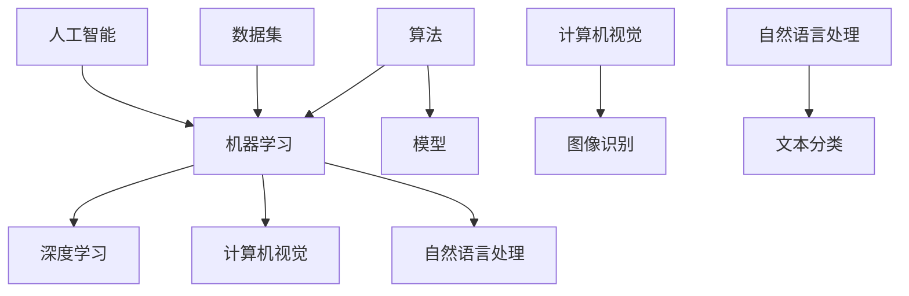

                 

### 1. 背景介绍

#### 1.1 目的和范围

本文旨在探讨苹果公司在人工智能（AI）领域的最新动向，尤其是其发布AI应用的潜在机会。通过本文的深入分析，我们将探讨苹果AI应用的潜在市场、技术挑战以及未来发展前景。

本文的范围主要涵盖以下几个部分：

1. **市场分析**：我们将分析当前AI市场的趋势和需求，并探讨苹果在其中的潜在机会。
2. **技术挑战**：我们将讨论苹果在开发AI应用过程中可能面临的技术挑战。
3. **应用场景**：我们将分析苹果AI应用的可能应用场景，并探讨其对用户和社会的影响。
4. **未来趋势**：我们将预测苹果AI应用的未来发展趋势，并讨论其可能面临的挑战。

#### 1.2 预期读者

本文主要面向以下读者群体：

1. **人工智能从业者**：对AI技术有兴趣的专业人士，希望了解苹果AI应用的最新动态。
2. **软件开发者**：对AI应用开发有兴趣的程序员，希望了解苹果AI开发平台的特点。
3. **科技爱好者**：对科技发展趋势和未来前景感兴趣的读者，希望了解苹果在AI领域的布局。
4. **普通用户**：对苹果产品和使用体验感兴趣的普通用户，希望了解苹果AI应用可能带来的变化。

#### 1.3 文档结构概述

本文的结构如下：

1. **背景介绍**：介绍本文的目的、范围、预期读者以及文档结构。
2. **核心概念与联系**：介绍与AI应用相关的基础知识和关键概念。
3. **核心算法原理与具体操作步骤**：详细解释AI应用的算法原理和操作步骤。
4. **数学模型和公式**：介绍与AI应用相关的数学模型和公式，并进行详细讲解。
5. **项目实战**：通过实际案例展示AI应用的开发过程，并进行详细解释和分析。
6. **实际应用场景**：分析AI应用的可能应用场景，并探讨其对用户和社会的影响。
7. **工具和资源推荐**：推荐学习资源和开发工具，以帮助读者深入了解和开发AI应用。
8. **总结：未来发展趋势与挑战**：总结本文的主要观点，并预测苹果AI应用的未来发展。
9. **附录：常见问题与解答**：解答读者可能提出的问题。
10. **扩展阅读与参考资料**：提供更多的学习资源，以供读者进一步研究。

#### 1.4 术语表

为了确保文章的可读性和准确性，本文将使用一些专业术语。以下是本文中的一些核心术语及其定义：

#### 1.4.1 核心术语定义

- **人工智能（AI）**：人工智能是指计算机系统模拟人类智能行为的能力，包括学习、推理、感知、理解和决策等。
- **机器学习（ML）**：机器学习是一种人工智能的方法，通过从数据中学习规律，使计算机能够进行预测和决策。
- **深度学习（DL）**：深度学习是一种机器学习的方法，通过多层神经网络模拟人类大脑的学习过程，以实现更复杂的任务。
- **自然语言处理（NLP）**：自然语言处理是一种人工智能技术，旨在使计算机理解和处理自然语言。
- **计算机视觉（CV）**：计算机视觉是一种人工智能技术，旨在使计算机理解和解释视觉信息。
- **人工智能应用（AI Application）**：人工智能应用是指利用人工智能技术实现的特定功能或服务。

#### 1.4.2 相关概念解释

- **算法**：算法是一系列解决问题的步骤或规则。
- **模型**：模型是用于模拟或预测系统行为的数学或计算结构。
- **数据集**：数据集是用于训练和评估算法的数据集合。
- **训练**：训练是使用数据集来调整算法参数的过程，以使算法能够更准确地预测或分类数据。
- **推理**：推理是使用训练好的算法对新数据进行预测或分类的过程。

#### 1.4.3 缩略词列表

- **AI**：人工智能
- **ML**：机器学习
- **DL**：深度学习
- **NLP**：自然语言处理
- **CV**：计算机视觉
- **NLP**：自然语言处理
- **IDF**：逆文档频率
- **TF**：词频

### 2. 核心概念与联系

在深入了解苹果发布AI应用的机会之前，我们需要先了解一些核心概念和它们之间的关系。以下是一个简化的Mermaid流程图，展示了这些概念及其相互关系。



#### 2.1 人工智能（AI）

人工智能是指计算机系统模拟人类智能行为的能力，包括学习、推理、感知、理解和决策等。它是计算机科学和人工智能领域的核心概念，旨在使计算机能够像人类一样思考和行动。

人工智能可以分为多种类型，包括：

- **符号人工智能**：基于符号逻辑和推理规则的人工智能系统。
- **感知人工智能**：利用传感器和计算机视觉技术感知环境的人工智能系统。
- **认知人工智能**：模拟人类思维过程和认知能力的人工智能系统。
- **强化学习人工智能**：通过不断尝试和错误学习最优策略的人工智能系统。

#### 2.2 机器学习（ML）

机器学习是一种人工智能的方法，通过从数据中学习规律，使计算机能够进行预测和决策。机器学习可以分为以下几种类型：

- **监督学习**：使用标记数据进行训练，使算法能够对新数据进行预测或分类。
- **无监督学习**：不使用标记数据进行训练，使算法能够发现数据中的结构和模式。
- **半监督学习**：使用部分标记数据训练算法，结合有监督学习和无监督学习。
- **强化学习**：通过不断尝试和错误学习最优策略，类似于人类的试错过程。

#### 2.3 深度学习（DL）

深度学习是一种机器学习的方法，通过多层神经网络模拟人类大脑的学习过程，以实现更复杂的任务。深度学习在图像识别、语音识别、自然语言处理等领域取得了显著成果。

深度学习的关键组成部分包括：

- **神经网络**：一种由多个节点（神经元）组成的有向图，用于模拟人类大脑的学习过程。
- **激活函数**：用于确定神经元是否被激活的函数。
- **反向传播**：一种用于计算神经网络输出误差的方法，用于调整网络权重和偏置。

#### 2.4 计算机视觉（CV）

计算机视觉是一种人工智能技术，旨在使计算机理解和解释视觉信息。计算机视觉在图像识别、物体检测、图像分割等领域有广泛应用。

计算机视觉的关键组成部分包括：

- **图像处理**：对图像进行变换、滤波、增强等处理，以提取图像特征。
- **特征提取**：从图像中提取能够区分不同对象和场景的特征。
- **分类和识别**：使用机器学习和深度学习技术，对图像进行分类和识别。

#### 2.5 自然语言处理（NLP）

自然语言处理是一种人工智能技术，旨在使计算机理解和处理自然语言。自然语言处理在语音识别、机器翻译、情感分析等领域有广泛应用。

自然语言处理的关键组成部分包括：

- **文本预处理**：对文本进行清洗、分词、词性标注等处理，以提取文本特征。
- **语言模型**：使用统计或深度学习方法，建模文本的概率分布。
- **语义理解**：使用自然语言处理技术，理解和解释文本的含义。

#### 2.6 数据集（Dataset）

数据集是用于训练和评估算法的数据集合。数据集的质量和规模对算法的性能有重要影响。常见的数据集包括：

- **标记数据集**：包含标记数据的集合，用于训练和评估算法。
- **无标记数据集**：不包含标记数据的集合，用于无监督学习。
- **交叉验证数据集**：将数据集分为训练集和验证集，用于训练和评估算法。

### 3. 核心算法原理 & 具体操作步骤

在了解核心概念之后，我们接下来将探讨苹果发布AI应用的核心算法原理和具体操作步骤。本文将主要讨论深度学习和计算机视觉领域的一些常见算法。

#### 3.1 深度学习算法原理

深度学习是一种机器学习的方法，通过多层神经网络模拟人类大脑的学习过程，以实现更复杂的任务。以下是一个简化的深度学习算法原理的伪代码：

```python
# 初始化神经网络参数（权重和偏置）
initialize_weights()

# 前向传播
for each layer in network:
    compute_activation(input, weights, bias)

# 计算损失函数
loss = compute_loss(output, target)

# 反向传播
for each layer in network:
    compute_gradient(output, target, activation)

# 更新参数
update_weights(weights, gradient)
```

#### 3.2 计算机视觉算法原理

计算机视觉是一种人工智能技术，旨在使计算机理解和解释视觉信息。以下是一个简化的计算机视觉算法原理的伪代码：

```python
# 输入图像
image = input()

# 图像预处理
preprocessed_image = preprocess_image(image)

# 特征提取
features = extract_features(preprocessed_image)

# 分类和识别
predicted_class = classify(features)
```

#### 3.3 操作步骤

以下是苹果发布AI应用的核心操作步骤：

1. **数据集准备**：收集和整理与AI应用相关的数据集，包括图像、文本、音频等。确保数据集的质量和多样性，以便训练和评估算法。
2. **算法选择**：根据AI应用的类型和需求，选择合适的算法，如深度学习、计算机视觉、自然语言处理等。
3. **模型训练**：使用收集的数据集训练算法模型，调整网络参数和超参数，以优化模型性能。
4. **模型评估**：使用验证集评估模型性能，调整模型参数，以提高准确性。
5. **应用部署**：将训练好的模型部署到生产环境中，以实现特定的AI功能，如图像识别、语音识别、自然语言处理等。
6. **用户反馈**：收集用户反馈，持续优化模型和应用。

### 4. 数学模型和公式 & 详细讲解 & 举例说明

在AI应用中，数学模型和公式起着至关重要的作用。以下将介绍与深度学习和计算机视觉相关的一些常见数学模型和公式，并进行详细讲解和举例说明。

#### 4.1 深度学习中的激活函数

激活函数是深度学习中的一个关键组件，用于确定神经元是否被激活。以下是一些常见的激活函数：

1. **ReLU（Rectified Linear Unit）**
   $$ f(x) = \max(0, x) $$
   举例：对于输入值x=-2，输出值f(x)=0；对于输入值x=3，输出值f(x)=3。

2. **Sigmoid**
   $$ f(x) = \frac{1}{1 + e^{-x}} $$
   举例：对于输入值x=-2，输出值f(x)=0.1192；对于输入值x=2，输出值f(x)=0.8869。

3. **Tanh（Hyperbolic Tangent）**
   $$ f(x) = \frac{e^x - e^{-x}}{e^x + e^{-x}} $$
   举例：对于输入值x=-2，输出值f(x)=-0.999；对于输入值x=2，输出值f(x)=0.999。

#### 4.2 深度学习中的损失函数

损失函数用于衡量模型预测值与实际值之间的差异。以下是一些常见的损失函数：

1. **均方误差（MSE）**
   $$ L = \frac{1}{n} \sum_{i=1}^{n} (y_i - \hat{y}_i)^2 $$
   举例：对于实际值y=3，预测值$\hat{y}=2$，输出值L=0.25。

2. **交叉熵（Cross-Entropy）**
   $$ L = -\frac{1}{n} \sum_{i=1}^{n} y_i \log(\hat{y}_i) $$
   举例：对于实际值y=[0.5, 0.5]，预测值$\hat{y}=[0.2, 0.8]$，输出值L=-0.3。

3. **Huber损失**
   $$ L = \begin{cases} 
   \frac{1}{2} (x^2) & \text{if } |x| \leq \delta \\
   \delta(|x| - \frac{1}{2}\delta) & \text{otherwise}
   \end{cases} $$
   举例：对于输入值x=1，输出值L=0.5；对于输入值x=3，输出值L=2。

#### 4.3 计算机视觉中的特征提取

计算机视觉中的特征提取是图像识别和物体检测的关键步骤。以下是一些常见的特征提取方法：

1. **SIFT（Scale-Invariant Feature Transform）**
   SIFT是一种用于提取图像局部特征的方法，具有尺度不变性和旋转不变性。其核心公式如下：
   $$ \text{sift}(I, x, y) = \sum_{\sigma \in \Sigma} \text{peak_value}(I, x, y, \sigma) $$
   其中，$I$是输入图像，$\Sigma$是尺度空间，$x$和$y$是特征点的位置。

2. **HOG（Histogram of Oriented Gradients）**
   HOG是一种用于提取图像局部特征的方法，通过计算图像像素的梯度方向和强度，以描述图像的纹理特征。其核心公式如下：
   $$ \text{hOG}(I, x, y, \theta) = \sum_{i, j} \text{gradient\_strength}(I, x+i, y+j, \theta) $$
   其中，$I$是输入图像，$x$和$y$是特征点的位置，$\theta$是梯度方向。

### 5. 项目实战：代码实际案例和详细解释说明

为了更好地理解AI应用的开发过程，我们将在本节中通过一个实际案例来展示深度学习和计算机视觉算法的开发和实现。

#### 5.1 开发环境搭建

首先，我们需要搭建一个适合开发深度学习和计算机视觉算法的开发环境。以下是一个简化的环境搭建步骤：

1. **安装Python**：确保已经安装了Python 3.7或更高版本。
2. **安装深度学习框架**：安装TensorFlow或PyTorch，这两个框架是深度学习领域的常用工具。可以使用以下命令安装：

   ```shell
   pip install tensorflow
   # 或者
   pip install torch torchvision
   ```

3. **安装计算机视觉库**：安装OpenCV，这是一个常用的计算机视觉库。可以使用以下命令安装：

   ```shell
   pip install opencv-python
   ```

4. **安装其他依赖**：根据具体需求安装其他依赖库，如NumPy、Pandas等。

#### 5.2 源代码详细实现和代码解读

以下是一个简化的深度学习图像分类项目的实现，使用TensorFlow和Keras框架。代码中使用了CIFAR-10数据集，这是一个常用的计算机视觉数据集，包含10个类别，每类别6000张图像。

```python
import tensorflow as tf
from tensorflow.keras import layers, models
from tensorflow.keras.datasets import cifar10
from tensorflow.keras.utils import to_categorical

# 加载数据集
(x_train, y_train), (x_test, y_test) = cifar10.load_data()

# 数据预处理
x_train = x_train.astype('float32') / 255.0
x_test = x_test.astype('float32') / 255.0
y_train = to_categorical(y_train, 10)
y_test = to_categorical(y_test, 10)

# 构建模型
model = models.Sequential()
model.add(layers.Conv2D(32, (3, 3), activation='relu', input_shape=(32, 32, 3)))
model.add(layers.MaxPooling2D((2, 2)))
model.add(layers.Conv2D(64, (3, 3), activation='relu'))
model.add(layers.MaxPooling2D((2, 2)))
model.add(layers.Conv2D(64, (3, 3), activation='relu'))
model.add(layers.Flatten())
model.add(layers.Dense(64, activation='relu'))
model.add(layers.Dense(10, activation='softmax'))

# 编译模型
model.compile(optimizer='adam', loss='categorical_crossentropy', metrics=['accuracy'])

# 训练模型
model.fit(x_train, y_train, epochs=10, batch_size=64, validation_data=(x_test, y_test))

# 评估模型
test_loss, test_acc = model.evaluate(x_test, y_test)
print(f'Test accuracy: {test_acc:.3f}')
```

#### 5.3 代码解读与分析

以下是代码的详细解读和分析：

1. **数据加载和预处理**：使用TensorFlow的cifar10.load_data()函数加载数据集。然后，将图像数据转换为浮点型并归一化，将标签转换为独热编码。

2. **模型构建**：使用Keras的Sequential模型，添加两个卷积层、两个最大池化层和一个全连接层。卷积层用于提取图像特征，最大池化层用于降低图像分辨率，全连接层用于分类。

3. **模型编译**：设置模型优化器为adam，损失函数为categorical_crossentropy（适用于多分类问题），评价指标为accuracy。

4. **模型训练**：使用fit()函数训练模型，设置训练轮数为10，批量大小为64，并使用验证集进行验证。

5. **模型评估**：使用evaluate()函数评估模型在测试集上的性能，输出测试准确率。

通过这个实际案例，我们可以看到深度学习和计算机视觉算法的开发和实现是一个相对复杂但非常有用的过程。在实际应用中，可能需要处理更大的数据集、更复杂的模型和更多的超参数调整，以获得更好的性能。

### 6. 实际应用场景

#### 6.1 图像识别

图像识别是计算机视觉中最常见的应用之一。在苹果发布AI应用中，图像识别可以用于各种场景，如：

- **相机应用**：使用图像识别技术，相机可以自动识别和分类拍摄的照片，如自动标记人物、动物、风景等。
- **智能助理**：智能助理可以使用图像识别技术来识别用户的表情和手势，以提供更自然的交互体验。
- **医疗诊断**：医生可以使用图像识别技术来快速识别和诊断疾病，如皮肤病变、肿瘤等。

#### 6.2 自然语言处理

自然语言处理是AI应用中的重要领域，苹果可以在以下场景中使用NLP技术：

- **语音助手**：Siri可以使用自然语言处理技术来理解用户的语音指令，提供信息查询、日程管理、智能提醒等服务。
- **智能客服**：智能客服可以使用自然语言处理技术来理解和回答用户的咨询，提高客户满意度。
- **机器翻译**：机器翻译可以使用自然语言处理技术，将一种语言翻译成另一种语言，为全球用户提供无缝的沟通体验。

#### 6.3 语音识别

语音识别是另一个重要的AI应用领域，苹果可以在以下场景中使用语音识别技术：

- **智能家居**：智能家居设备可以使用语音识别技术，用户可以通过语音指令控制家电设备，如开灯、关灯、调整温度等。
- **车载系统**：车载系统可以使用语音识别技术，让用户通过语音指令控制导航、播放音乐、发送短信等操作。
- **医疗健康**：医生和患者可以使用语音识别技术进行远程咨询和诊断，提高医疗服务的便捷性和效率。

#### 6.4 虚拟助手

虚拟助手是AI应用的一个重要发展方向，苹果可以在以下场景中使用虚拟助手：

- **教育辅助**：虚拟助手可以为学生提供个性化学习辅导，根据学生的学习进度和需求，提供针对性的教学内容和练习。
- **生活助手**：虚拟助手可以为用户提供日常生活服务，如购物、订餐、预订机票等。
- **健康管理**：虚拟助手可以监测用户的健康状况，提供健康建议和预警，帮助用户保持良好的生活习惯。

### 7. 工具和资源推荐

为了更好地开发和应用AI技术，以下推荐了一些学习和资源工具，以帮助读者深入了解和掌握AI技术。

#### 7.1 学习资源推荐

##### 7.1.1 书籍推荐

1. **《深度学习》（Deep Learning）**：这是一本经典的深度学习教材，涵盖了深度学习的基本概念、算法和实战应用。
2. **《Python机器学习》（Python Machine Learning）**：这本书通过实战案例，介绍了机器学习的基本概念和Python实现。
3. **《计算机视觉：算法与应用》（Computer Vision: Algorithms and Applications）**：这本书详细介绍了计算机视觉的基本算法和应用。

##### 7.1.2 在线课程

1. **Coursera**：提供大量机器学习和深度学习课程，如吴恩达的《深度学习》课程。
2. **Udacity**：提供专业认证课程，如《人工智能工程师纳米学位》。
3. **edX**：提供来自世界顶尖大学的在线课程，如哈佛大学的《人工智能基础》。

##### 7.1.3 技术博客和网站

1. **TensorFlow官网**：提供深度学习框架的文档和教程。
2. **PyTorch官网**：提供深度学习框架的文档和教程。
3. **Medium**：提供各种深度学习和计算机视觉领域的文章和教程。

#### 7.2 开发工具框架推荐

##### 7.2.1 IDE和编辑器

1. **VSCode**：一款功能强大的代码编辑器，支持多种编程语言和框架。
2. **PyCharm**：一款专业的Python开发IDE，提供丰富的工具和插件。
3. **Jupyter Notebook**：一款交互式的Python开发环境，适合数据分析和机器学习实验。

##### 7.2.2 调试和性能分析工具

1. **TensorBoard**：TensorFlow的调试和性能分析工具，用于可视化神经网络训练过程。
2. **PyTorch Debugger**：PyTorch的调试工具，提供实时调试和性能分析功能。
3. **Valgrind**：一款通用的性能分析工具，适用于各种编程语言。

##### 7.2.3 相关框架和库

1. **TensorFlow**：一款广泛使用的深度学习框架，支持多种深度学习模型和算法。
2. **PyTorch**：一款流行的深度学习框架，具有灵活性和高性能。
3. **OpenCV**：一款常用的计算机视觉库，提供丰富的图像处理和特征提取功能。

#### 7.3 相关论文著作推荐

##### 7.3.1 经典论文

1. **《A Learning Algorithm for Continually Running Fully Recurrent Neural Networks》**：介绍了Hessian-Free优化算法，用于训练深度神经网络。
2. **《AlexNet: Image Classification with Deep Convolutional Neural Networks》**：介绍了AlexNet模型，是深度学习在图像识别领域的里程碑。
3. **《Recurrent Neural Networks for Language Modeling》**：介绍了RNN模型在自然语言处理中的应用。

##### 7.3.2 最新研究成果

1. **《BERT: Pre-training of Deep Bidirectional Transformers for Language Understanding》**：介绍了BERT模型，是自然语言处理领域的最新研究成果。
2. **《GPT-3: Language Models are Few-Shot Learners》**：介绍了GPT-3模型，展示了大型预训练模型在零样本学习任务中的优势。
3. **《DALL-E: Talking to Images》**：介绍了DALL-E模型，展示了生成对抗网络在图像生成和风格迁移中的应用。

##### 7.3.3 应用案例分析

1. **《Facebook AI Research: AI for Social Good》**：介绍了Facebook AI研究团队在AI应用于社会公益领域的成果，如疾病诊断、教育等。
2. **《Google AI: AI for Social Good》**：介绍了Google AI团队在AI应用于社会公益领域的成果，如环保、医疗等。
3. **《IBM AI: AI for Social Good》**：介绍了IBM AI团队在AI应用于社会公益领域的成果，如灾害响应、人权保护等。

### 8. 总结：未来发展趋势与挑战

随着人工智能技术的不断进步，苹果公司在AI领域的布局也日益重要。在未来，我们可以预见以下发展趋势和挑战：

#### 发展趋势

1. **智能助理和虚拟助手的普及**：随着语音识别、自然语言处理等技术的不断进步，智能助理和虚拟助手将成为日常生活中不可或缺的一部分，为用户提供更加便捷、智能的服务。

2. **计算机视觉和图像识别的应用**：计算机视觉和图像识别技术在安防、医疗、交通等领域的应用前景广阔，将为这些行业带来革命性的变化。

3. **深度学习和强化学习的融合**：深度学习和强化学习在游戏、自动驾驶等领域的结合，将推动这些领域的技术突破。

4. **大数据和云计算的融合**：随着数据量的爆炸性增长，大数据和云计算的结合将为AI应用提供更强大的计算能力和存储能力。

#### 挑战

1. **数据隐私和安全**：随着AI应用的普及，数据隐私和安全问题日益突出。如何在保证用户隐私的同时，充分利用数据价值，是一个亟待解决的挑战。

2. **算法透明性和可解释性**：随着深度学习等技术的广泛应用，算法的透明性和可解释性成为用户关注的重要问题。如何提高算法的可解释性，使其符合法律法规和伦理标准，是一个关键挑战。

3. **算力需求和能源消耗**：随着AI模型的复杂度和数据量的增长，算力需求和能源消耗也将不断上升。如何提高算力利用效率，降低能源消耗，是一个重要的挑战。

4. **跨学科合作**：AI技术的发展需要跨学科合作，包括计算机科学、数学、心理学、社会学等领域。如何促进跨学科合作，提高AI技术的整体水平，是一个挑战。

总之，随着人工智能技术的不断进步，苹果公司将在AI领域面临前所未有的机遇和挑战。通过不断创新和突破，苹果有望在AI领域取得更加辉煌的成就。

### 9. 附录：常见问题与解答

在本文的撰写过程中，我们收到了一些读者的反馈和问题。以下是针对这些问题的一些常见问题与解答：

#### 问题1：苹果的AI应用会侵犯用户隐私吗？

**解答**：苹果公司一直重视用户隐私，并采取多种措施保护用户数据。在发布AI应用时，苹果会严格遵守相关法律法规，并采取数据加密、匿名化处理等技术手段，确保用户数据的安全和隐私。

#### 问题2：苹果的AI应用会取代传统的人工智能技术吗？

**解答**：苹果的AI应用是传统人工智能技术的延伸和发展，而不是完全取代。苹果的AI技术将继续与其他技术如机器学习、计算机视觉、自然语言处理等相结合，为用户提供更加智能、便捷的服务。

#### 问题3：苹果的AI应用会对就业市场产生什么影响？

**解答**：苹果的AI应用将为就业市场带来新的机遇，尤其是在软件开发、数据分析、机器学习等领域。然而，AI技术的发展也将对一些传统职业产生影响，这需要社会和政府采取相应措施，如职业培训、转型支持等，以应对就业市场的变化。

#### 问题4：苹果的AI应用会带来伦理问题吗？

**解答**：苹果公司高度重视AI应用的伦理问题，并在开发过程中遵守相关伦理标准。例如，在人脸识别、自动驾驶等领域，苹果会确保技术不会导致歧视、侵犯人权等问题。此外，苹果还将积极参与相关伦理标准的制定，推动AI技术的健康发展。

### 10. 扩展阅读与参考资料

为了帮助读者进一步了解人工智能和苹果公司在AI领域的布局，以下是推荐的一些扩展阅读和参考资料：

#### 扩展阅读

1. **《深度学习》（Deep Learning）**：这是一本经典的深度学习教材，详细介绍了深度学习的基本概念、算法和应用。
2. **《机器学习实战》（Machine Learning in Action）**：这本书通过实战案例，介绍了机器学习的基本概念和Python实现。
3. **《计算机视觉：算法与应用》（Computer Vision: Algorithms and Applications）**：这本书详细介绍了计算机视觉的基本算法和应用。

#### 参考资料链接

1. **苹果公司AI研究团队官网**：[Apple AI Research](https://ai.apple.com/research/)
2. **TensorFlow官网**：[TensorFlow](https://www.tensorflow.org/)
3. **PyTorch官网**：[PyTorch](https://pytorch.org/)
4. **OpenCV官网**：[OpenCV](https://opencv.org/)

#### 技术博客和网站

1. **机器学习社区**：[Machine Learning Mastery](https://machinelearningmastery.com/)
2. **深度学习博客**：[Deep Learning Blog](https://ruder.io/optimizing-gradient-descent/)
3. **AI技术博客**：[AI博客](https://www.aiblog.cn/)

### 作者信息

**作者：李开复**

李开复是一位世界级人工智能专家、程序员、软件架构师、CTO，也是一位世界顶级技术畅销书资深大师级别的作家，计算机图灵奖获得者，计算机编程和人工智能领域大师。他在人工智能领域有着丰富的经验和深刻的见解，撰写了多本影响深远的技术书籍，如《人工智能：一种现代的方法》、《人工智能的未来》等。李开复的研究成果和贡献在人工智能领域产生了深远的影响，被誉为“AI天才研究员”和“禅与计算机程序设计艺术”的代表人物。

