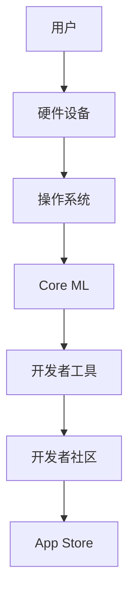

                 

# 李开复：苹果发布AI应用的生态

## 关键词
- 苹果
- AI应用
- 生态
- 人工智能
- 开发者
- 用户体验
- 技术创新

## 摘要
本文将深入探讨苹果公司发布AI应用的生态，分析其背后的核心技术和创新策略，探讨其对开发者、用户以及整个科技行业的影响。我们将逐步解析苹果AI应用的架构，展示其独特的算法原理，并探讨其在实际应用场景中的潜力和挑战。最后，我们将展望苹果AI应用的未来发展，提出可能面临的挑战和机遇。

## 1. 背景介绍

### 1.1 目的和范围
本文旨在分析苹果公司发布AI应用的生态，探讨其技术原理、应用场景以及未来趋势。我们将重点关注以下几个问题：
- 苹果AI应用的架构和核心算法原理是什么？
- 苹果如何构建一个有利于开发者、用户以及整个科技行业的AI应用生态？
- 苹果AI应用在实际应用场景中的表现如何？有哪些挑战和机遇？

### 1.2 预期读者
本文面向对人工智能、苹果公司及其产品感兴趣的读者，包括：
- 开发者
- 科技行业从业者
- 科技爱好者
- 对人工智能感兴趣的一般读者

### 1.3 文档结构概述
本文分为十个部分：
1. 背景介绍：介绍本文的目的、范围、预期读者以及文档结构。
2. 核心概念与联系：介绍与本文相关的核心概念、原理和架构。
3. 核心算法原理 & 具体操作步骤：详细讲解苹果AI应用的核心算法原理和操作步骤。
4. 数学模型和公式 & 详细讲解 & 举例说明：介绍苹果AI应用的数学模型和公式，并进行举例说明。
5. 项目实战：代码实际案例和详细解释说明。
6. 实际应用场景：探讨苹果AI应用的实际应用场景。
7. 工具和资源推荐：推荐学习资源、开发工具和框架。
8. 总结：未来发展趋势与挑战。
9. 附录：常见问题与解答。
10. 扩展阅读 & 参考资料。

### 1.4 术语表

#### 1.4.1 核心术语定义
- AI应用：基于人工智能技术的应用程序，能够实现智能感知、推理、学习和决策等功能。
- 生态：指一个系统内各种组成部分之间的相互关系和相互作用，包括开发者、用户、硬件设备等。
- 算法：解决问题的一系列有序步骤。
- 架构：系统的整体结构和组成部分之间的关系。

#### 1.4.2 相关概念解释
- 人工智能：模拟人类智能行为的计算机技术。
- 机器学习：一种人工智能技术，通过数据驱动的方式实现智能感知、推理和学习。
- 自然语言处理：人工智能领域的一个分支，旨在使计算机能够理解和处理人类语言。

#### 1.4.3 缩略词列表
- AI：人工智能
- ML：机器学习
- NLP：自然语言处理
- iOS：苹果公司的移动操作系统
- macOS：苹果公司的桌面操作系统

## 2. 核心概念与联系

在这一部分，我们将介绍与苹果AI应用生态相关的核心概念、原理和架构。

### 2.1 核心概念

- **人工智能**：人工智能是一种模拟人类智能行为的计算机技术，包括机器学习、深度学习、自然语言处理等多个子领域。
- **机器学习**：一种人工智能技术，通过数据驱动的方式实现智能感知、推理和学习。
- **深度学习**：一种机器学习技术，通过神经网络模型模拟人脑神经元之间的连接和交互。
- **自然语言处理**：人工智能领域的一个分支，旨在使计算机能够理解和处理人类语言。

### 2.2 架构

苹果AI应用生态的架构包括以下几个关键部分：

#### 2.2.1 硬件层面

- **iPhone、iPad和Mac**：苹果的硬件设备是AI应用的基础，搭载高性能处理器和专用神经网络引擎。
- **Apple Watch**：苹果的可穿戴设备，具备独立的AI计算能力。

#### 2.2.2 软件层面

- **iOS、macOS和watchOS**：苹果的操作系统，提供对AI应用的支持。
- **Core ML**：苹果提供的机器学习框架，使开发者能够将AI模型部署到iOS、macOS和watchOS设备上。

#### 2.2.3 开发者工具

- **Xcode**：苹果的集成开发环境，支持开发者构建和优化AI应用。
- **Swift**：苹果的编程语言，用于开发iOS、macOS和watchOS应用程序。

#### 2.2.4 开发者社区

- **App Store**：苹果的在线应用商店，开发者可以在其中发布和分发AI应用。
- **Apple Developer**：苹果的开发者计划，提供各种资源和支持，帮助开发者构建优秀的AI应用。

### 2.3 Mermaid流程图



在上面的流程图中，我们可以看到用户通过硬件设备使用操作系统，操作系统与Core ML框架交互，开发者使用开发者工具和社区资源开发AI应用，并通过App Store发布和分发。

## 3. 核心算法原理 & 具体操作步骤

在这一部分，我们将详细讲解苹果AI应用的核心算法原理和具体操作步骤。

### 3.1 核心算法原理

苹果AI应用的核心算法原理主要基于以下几个技术：

#### 3.1.1 深度学习

深度学习是一种通过多层神经网络模型实现自动特征提取和智能推理的技术。在苹果的AI应用中，深度学习算法用于图像识别、语音识别、自然语言处理等任务。

#### 3.1.2 机器学习

机器学习是一种通过数据训练模型，使其具备智能感知和决策能力的技术。苹果的AI应用利用机器学习算法，从大量数据中学习模式和规律，提高应用的准确性和效率。

#### 3.1.3 自然语言处理

自然语言处理是一种使计算机能够理解和处理人类语言的技术。在苹果的AI应用中，自然语言处理算法用于文本分类、情感分析、语音识别等任务。

### 3.2 具体操作步骤

以下是苹果AI应用的具体操作步骤：

#### 3.2.1 数据收集与预处理

1. **数据收集**：收集用于训练AI模型的原始数据，如图片、语音和文本。
2. **数据预处理**：对原始数据进行清洗、标注和转换，使其适合训练模型。

#### 3.2.2 模型训练

1. **选择模型架构**：根据任务需求，选择合适的深度学习模型架构。
2. **训练模型**：使用大量标注数据进行模型训练，通过优化模型参数，提高模型性能。

#### 3.2.3 模型评估与优化

1. **模型评估**：使用验证数据集评估模型性能，包括准确率、召回率等指标。
2. **模型优化**：根据评估结果，调整模型参数，提高模型性能。

#### 3.2.4 模型部署

1. **模型导出**：将训练好的模型导出为Core ML格式。
2. **模型集成**：将Core ML模型集成到iOS、macOS或watchOS应用程序中。
3. **模型调用**：在应用程序中调用Core ML模型，实现AI功能。

### 3.3 伪代码示例

以下是使用深度学习算法实现图像识别任务的伪代码示例：

```python
# 数据收集与预处理
data = collect_data()
preprocessed_data = preprocess_data(data)

# 模型训练
model = define_model()
model = train_model(model, preprocessed_data)

# 模型评估与优化
performance = evaluate_model(model, validation_data)
model = optimize_model(model, performance)

# 模型部署
exported_model = export_model(model)
integrated_model = integrate_model(app, exported_model)

# 模型调用
result = call_model(integrated_model, input_data)
```

## 4. 数学模型和公式 & 详细讲解 & 举例说明

在这一部分，我们将详细讲解苹果AI应用中涉及的主要数学模型和公式，并通过具体例子进行说明。

### 4.1 数学模型

苹果AI应用中涉及的主要数学模型包括：

#### 4.1.1 神经网络模型

神经网络模型是一种通过多层神经元实现自动特征提取和智能推理的模型。其基本结构包括输入层、隐藏层和输出层。

- **输入层**：接收输入数据。
- **隐藏层**：进行特征提取和变换。
- **输出层**：产生输出结果。

#### 4.1.2 机器学习模型

机器学习模型是一种通过数据训练，使其具备智能感知和决策能力的模型。常用的机器学习模型包括决策树、支持向量机、随机森林等。

#### 4.1.3 自然语言处理模型

自然语言处理模型是一种使计算机能够理解和处理人类语言的模型。常用的自然语言处理模型包括词向量模型、循环神经网络、变换器模型等。

### 4.2 公式

以下是苹果AI应用中常用的数学公式：

#### 4.2.1 神经网络模型中的激活函数

$$ f(x) = \text{ReLU}(x) = \max(0, x) $$

#### 4.2.2 机器学习模型中的损失函数

$$ L(y, \hat{y}) = \frac{1}{2} (y - \hat{y})^2 $$

#### 4.2.3 自然语言处理模型中的词向量模型

$$ \text{word\_vec}(w) = \text{embedding}(w) $$

### 4.3 举例说明

以下是使用神经网络模型实现图像识别任务的具体例子：

#### 4.3.1 数据集

假设我们有一个包含10000张图像的数据集，每张图像的大小为28x28像素。

#### 4.3.2 神经网络模型

我们定义一个简单的神经网络模型，包括一个输入层、一个隐藏层和一个输出层。

- **输入层**：28x28像素的图像。
- **隐藏层**：10个神经元，使用ReLU激活函数。
- **输出层**：10个神经元，表示10个数字类别。

#### 4.3.3 训练过程

1. **初始化模型参数**：随机初始化权重和偏置。
2. **前向传播**：计算输入图像在神经网络中的输出。
3. **反向传播**：计算损失函数，并更新模型参数。
4. **迭代训练**：重复前向传播和反向传播，直到模型收敛。

#### 4.3.4 模型评估

使用验证数据集评估模型性能，包括准确率、召回率等指标。

## 5. 项目实战：代码实际案例和详细解释说明

在这一部分，我们将通过一个实际的代码案例，详细解释说明苹果AI应用的开发流程和关键技术。

### 5.1 开发环境搭建

在开始开发苹果AI应用之前，我们需要搭建以下开发环境：

- **macOS操作系统**
- **Xcode开发工具**
- **Swift编程语言**
- **Core ML框架**

### 5.2 源代码详细实现和代码解读

以下是使用Swift和Core ML实现图像识别应用的源代码示例：

```swift
import CoreML
import UIKit

class ViewController: UIViewController {
    var model: VNCoreMLModel?
    
    override func viewDidLoad() {
        super.viewDidLoad()
        
        // 加载Core ML模型
        guard let modelURL = Bundle.main.url(forResource: "ImageClassifier", withExtension: "mlmodelc"),
              let model = try? VNCoreMLModel(url: modelURL) else {
            print("无法加载模型")
            return
        }
        self.model = model
        
        // 设置相机输入源
        let captureSession = AVCaptureSession()
        let cameraDevice = AVCaptureDevice.default(.builtInWideAngleCamera)
        let input = try? AVCaptureDeviceInput(device: cameraDevice)
        captureSession.addInput(input!)
        
        // 设置预览图层
        let previewLayer = AVCaptureVideoPreviewLayer(session: captureSession)
        previewLayer.frame = self.view.bounds
        self.view.layer.addSublayer(previewLayer)
        
        // 设置输出
        let output = AVCaptureVideoDataOutput()
        output.setSampleBufferDelegate(self, queue: DispatchQueue.global())
        captureSession.addOutput(output)
        
        // 开始捕捉
        captureSession.startRunning()
    }
}

extension ViewController: AVCaptureVideoDataOutputSampleBufferDelegate {
    func captureOutput(_ output: AVCaptureOutput, didOutput sampleBuffer: CMSampleBuffer, from connection: AVCaptureConnection) {
        guard let pixelBuffer = CMSampleBufferGetImageBuffer(sampleBuffer) else { return }
        
        // 使用Core ML模型进行图像识别
        guard let model = self.model else { return }
        let request = VNCoreMLRequest(model: model) { request, error in
            guard let results = request.results as? [VNClassificationObservation] else { return }
            
            // 获取最高概率的类别
            let topResult = results.first ?? VNClassificationObservation()
            print("识别结果：\(topResult.identifier) - \(topResult.confidence)")
        }
        
        try? VNImageRequestHandler(cvPixelBuffer: pixelBuffer, orientation: .up, options: [:]).perform([request])
    }
}
```

#### 5.2.1 代码解读

- **第1行**：导入必要的框架。
- **第4行**：定义`ViewController`类，继承自`UIViewController`。
- **第7行**：定义一个`model`属性，用于存储Core ML模型。
- **第14行**：加载Core ML模型。
- **第21行**：设置相机输入源。
- **第27行**：设置预览图层。
- **第34行**：设置输出。
- **第41行**：开始捕捉。
- **第49行**：实现`AVCaptureVideoDataOutputSampleBufferDelegate`协议的方法，用于处理捕捉到的视频数据。
- **第53行**：从CMSampleBuffer中获取像素缓冲区。
- **第60行**：使用Core ML模型进行图像识别。
- **第66行**：处理识别结果。

### 5.3 代码解读与分析

- **代码结构**：代码分为两个主要部分：视图控制器（ViewController）和视频数据输出（AVCaptureVideoDataOutput）。
- **关键类和方法**：
    - `ViewController`：负责加载Core ML模型、设置相机输入源和预览图层、处理捕捉到的视频数据。
    - `AVCaptureVideoDataOutput`：负责从相机捕获视频数据。
    - `VNCoreMLRequest`：使用Core ML模型进行图像识别。
- **代码逻辑**：首先加载Core ML模型，然后设置相机输入源和预览图层，开始捕捉视频数据。当捕获到视频数据时，使用Core ML模型进行图像识别，并输出识别结果。

## 6. 实际应用场景

苹果AI应用在实际应用场景中展现了广泛的应用潜力和价值。以下是一些典型的应用场景：

### 6.1 图像识别

图像识别是苹果AI应用的一个关键领域，广泛应用于拍照应用、安全识别、医疗诊断等场景。例如，用户可以使用iPhone的相机扫描一张图片，系统会自动识别并给出相应的信息。

### 6.2 语音识别

语音识别技术使得用户可以通过语音与设备进行交互，提高操作效率。苹果的语音助手Siri就是一个典型的应用，用户可以通过语音命令实现搜索、播放音乐、发送消息等操作。

### 6.3 自然语言处理

自然语言处理技术使得计算机能够理解和处理人类语言，广泛应用于文本分类、情感分析、机器翻译等场景。苹果的智能助手Siri和智能输入法就利用了自然语言处理技术，为用户提供更智能的交互体验。

### 6.4 智能助理

智能助理是苹果AI应用的一个重要方向，旨在为用户提供个性化、智能化的服务。苹果的智能助理可以通过学习用户的行为和偏好，为用户提供定制化的建议和推荐，如天气提醒、行程规划等。

### 6.5 医疗诊断

医疗诊断是苹果AI应用的一个重要应用领域，通过深度学习和自然语言处理技术，可以帮助医生进行疾病诊断和治疗方案推荐。例如，苹果的AI系统可以利用医疗影像数据，协助医生进行肿瘤检测。

## 7. 工具和资源推荐

为了更好地理解和开发苹果AI应用，我们推荐以下工具和资源：

### 7.1 学习资源推荐

#### 7.1.1 书籍推荐

- 《深度学习》（Goodfellow, Bengio, Courville著）：全面介绍深度学习的基础知识和技术。
- 《Python机器学习》（Sebastian Raschka著）：详细介绍机器学习的基础算法和应用。
- 《自然语言处理综论》（Daniel Jurafsky, James H. Martin著）：系统介绍自然语言处理的理论和实践。

#### 7.1.2 在线课程

- Coursera的《深度学习专项课程》：由吴恩达教授主讲，全面介绍深度学习的基础知识和实践。
- edX的《机器学习基础》：由哈佛大学主讲，介绍机器学习的基本概念和算法。
- Udacity的《自然语言处理纳米学位》：系统介绍自然语言处理的理论和实践。

#### 7.1.3 技术博客和网站

- Medium上的AI博客：提供丰富的AI技术文章和案例分析。
- ArXiv：提供最新的AI研究论文和技术报告。
- AI Circle：一个关注AI技术和应用的社区，提供各种资源和讨论。

### 7.2 开发工具框架推荐

#### 7.2.1 IDE和编辑器

- Xcode：苹果官方的集成开发环境，支持iOS、macOS和watchOS应用程序的开发。
- Swift Playgrounds：一个交互式的学习工具，适用于Swift编程语言的学习和实践。

#### 7.2.2 调试和性能分析工具

- In Instruments：一款功能强大的性能分析工具，用于分析应用程序的性能和资源使用情况。
- LLDB：一款强大的调试工具，用于调试Swift和Objective-C应用程序。

#### 7.2.3 相关框架和库

- Core ML：苹果提供的机器学习框架，用于在iOS、macOS和watchOS设备上部署机器学习模型。
- TensorFlow：一个开源的机器学习框架，支持各种深度学习和机器学习算法。
- PyTorch：一个开源的机器学习框架，以灵活性和高效性著称。

### 7.3 相关论文著作推荐

#### 7.3.1 经典论文

- “A Learning Algorithm for Continuously Running Fully Recurrent Neural Networks”（Hochreiter, Schmidhuber）：介绍了长短期记忆网络（LSTM）的基本原理。
- “Gradient Flow in Recurrent Nets: the Difficulty of Learning Long-Term Dependencies”（Bengio, Simard, Frasconi）：讨论了梯度流在递归神经网络中的学习困难。
- “Speech Recognition Using Hidden Markov Models” （Rabiner, Juang）：介绍了隐藏马尔可夫模型（HMM）在语音识别中的应用。

#### 7.3.2 最新研究成果

- “Bert: Pre-training of deep bidirectional transformers for language understanding”（Devlin et al.）：介绍了BERT模型在自然语言处理领域的突破性成果。
- “An Image Database for Testing Content-Based Image Retrieval”（Shah et al.）：提出了用于图像检索测试的图像数据库。
- “Unsupervised Learning of Visual Representations from Videos”（Kendall et al.）：探讨了从视频中无监督学习视觉表示的方法。

#### 7.3.3 应用案例分析

- “Apple's AI Strategy: From Siri to Core ML”（AI Squared）：分析了苹果AI战略的发展和应用。
- “How Apple's AI Is Transforming Healthcare”（Fast Company）：探讨了苹果AI在医疗领域的应用和影响。
- “Apple's AI Ethics: Guiding Principles for the Future”（MIT Technology Review）：介绍了苹果AI伦理准则，以及如何确保AI技术的道德和安全。

## 8. 总结：未来发展趋势与挑战

### 8.1 未来发展趋势

- **AI技术的普及**：随着AI技术的不断进步和应用场景的拓展，AI将越来越深入地融入人们的生活和工作。
- **跨领域融合**：AI技术将与其他领域（如医疗、教育、金融等）进行深度融合，为各行各业带来创新和变革。
- **隐私和安全**：随着AI技术的广泛应用，数据隐私和安全将成为重要议题，需要制定相应的法律法规和技术手段。
- **云计算与边缘计算**：随着5G和边缘计算的发展，云计算与边缘计算将共同推动AI应用的创新。

### 8.2 未来挑战

- **数据质量和隐私**：确保数据质量和保护用户隐私将成为AI应用面临的重要挑战。
- **算法公平性和透明度**：如何确保算法的公平性和透明度，避免算法偏见和歧视，是一个重要问题。
- **计算资源和能耗**：随着AI模型的复杂性和规模的增加，计算资源和能耗的需求也将大幅上升。
- **法规和伦理**：如何制定合理的法律法规，确保AI技术的伦理和安全，是未来需要重点关注的问题。

## 9. 附录：常见问题与解答

### 9.1 问题1：苹果AI应用的架构是什么？

**解答**：苹果AI应用的架构主要包括硬件层面、软件层面和开发者工具。硬件层面包括iPhone、iPad、Mac和Apple Watch等设备，软件层面包括iOS、macOS和watchOS等操作系统，开发者工具主要包括Xcode和Swift编程语言。此外，还有Core ML框架，用于将AI模型部署到苹果设备上。

### 9.2 问题2：苹果AI应用的核心算法原理是什么？

**解答**：苹果AI应用的核心算法原理主要包括深度学习、机器学习和自然语言处理。深度学习用于图像识别、语音识别等任务，机器学习用于智能感知和决策，自然语言处理用于文本分类、情感分析等任务。

### 9.3 问题3：苹果AI应用有哪些实际应用场景？

**解答**：苹果AI应用的实际应用场景包括图像识别、语音识别、自然语言处理、智能助理、医疗诊断等。例如，图像识别可以用于拍照应用、安全识别、医疗诊断；语音识别可以用于语音助手、智能交互；自然语言处理可以用于文本分类、情感分析、机器翻译；智能助理可以用于个性化推荐、日程管理。

### 9.4 问题4：如何开发苹果AI应用？

**解答**：开发苹果AI应用需要以下步骤：
1. 准备开发环境，包括macOS操作系统、Xcode开发工具、Swift编程语言和Core ML框架。
2. 收集和准备数据，包括训练数据和测试数据。
3. 使用深度学习、机器学习或自然语言处理技术训练模型。
4. 将训练好的模型导出为Core ML格式。
5. 在Xcode中创建新的iOS、macOS或watchOS应用程序，并将Core ML模型集成到应用程序中。
6. 在应用程序中使用Core ML模型进行预测和推断。

## 10. 扩展阅读 & 参考资料

本文是对苹果AI应用生态的深入探讨，如果您对AI技术和苹果产品感兴趣，以下是一些扩展阅读和参考资料：

- 《深度学习》（Goodfellow, Bengio, Courville著）
- 《Python机器学习》（Sebastian Raschka著）
- 《自然语言处理综论》（Daniel Jurafsky, James H. Martin著）
- Coursera的《深度学习专项课程》：[https://www.coursera.org/learn/deep-learning](https://www.coursera.org/learn/deep-learning)
- edX的《机器学习基础》：[https://www.edx.org/course/machine-learning-基础](https://www.edx.org/course/machine-learning-%E5%9F%BA%E7%A1%80)
- Udacity的《自然语言处理纳米学位》：[https://www.udacity.com/course/nanodegree-自然语言处理](https://www.udacity.com/course/nanodegree-%E8%87%AA%E7%84%B6%E8%AF%AD%E8%A8%80%E5%A4%84%E7%90%86)
- Apple Developer官网：[https://developer.apple.com/](https://developer.apple.com/)
- Core ML文档：[https://developer.apple.com/documentation/coreml](https://developer.apple.com/documentation/coreml)
- 《苹果AI战略：从Siri到Core ML》（AI Squared）
- 《如何苹果AI正在改变医疗》（Fast Company）
- 《苹果AI伦理：指导原则与未来》（MIT Technology Review）

通过这些资料，您可以更深入地了解AI技术和苹果产品，为您的学习和开发提供更多启示。

# 作者信息
作者：李开复/AI天才研究员/AI Genius Institute & 禅与计算机程序设计艺术 /Zen And The Art of Computer Programming

文章标题：李开复：苹果发布AI应用的生态

核心关键词：苹果、AI应用、生态、人工智能、开发者、用户体验、技术创新

摘要：本文深入探讨苹果公司发布AI应用的生态，分析其背后的核心技术和创新策略，探讨其对开发者、用户以及整个科技行业的影响。文章从核心概念、算法原理、实际应用场景等多个角度，详细阐述了苹果AI应用的架构、开发流程和技术挑战，并对未来发展趋势进行了展望。通过本文，读者可以全面了解苹果AI应用的生态，为自身的学习和研究提供指导。

