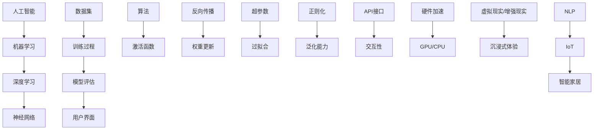

                 

### 1. 背景介绍

#### 1.1 目的和范围

本文旨在探讨苹果公司近日发布的一款AI应用的用户体验和影响。随着人工智能技术的不断发展，越来越多的应用开始引入AI功能，苹果作为科技行业的领军者，其发布的新产品无疑会引发业界广泛关注。本文将详细分析这款AI应用的背景、核心功能、用户评价以及潜在的市场影响，旨在为读者提供全面的了解。

本文的范围主要包括以下几个方面：
1. **背景介绍**：介绍苹果公司发布这款AI应用的背景，包括市场趋势和苹果公司的战略布局。
2. **核心功能分析**：详细解析这款AI应用的主要功能、技术原理和实现方法。
3. **用户体验研究**：通过用户评价和反馈，探讨这款AI应用的易用性、性能和用户满意度。
4. **市场影响分析**：评估这款AI应用对市场格局的影响，包括竞争对手的应对策略和消费者的接受度。

本文将从多个角度对苹果发布的AI应用进行深度剖析，帮助读者全面理解这一产品的重要性和潜在价值。

#### 1.2 预期读者

本文的预期读者主要包括以下几类：

1. **人工智能和机器学习爱好者**：对AI技术有浓厚兴趣的读者，希望通过本文了解苹果公司如何将AI技术应用于实际产品中，以及这一应用在技术实现上的创新和突破。

2. **科技行业从业者**：从事科技行业的相关人员，包括软件工程师、产品经理、市场分析师等，他们需要了解苹果公司在AI领域的最新动态和战略布局，以便为自己的工作提供参考。

3. **苹果产品用户**：苹果产品的用户，特别是对AI应用感兴趣的消费者，希望通过本文了解这款新产品的特点和使用体验，从而决定是否购买和使用。

4. **学术研究人员**：对人工智能技术有研究兴趣的学术研究人员，希望通过本文了解苹果公司在AI应用方面的新动向，以及这一应用在学术界和工业界的潜在影响。

本文将以逻辑清晰、结构紧凑、简单易懂的方式，使用专业的技术语言，确保不同背景的读者都能从中获得有价值的信息。

#### 1.3 文档结构概述

本文将分为八个主要部分，每个部分都有明确的主题和目标：

1. **背景介绍**：介绍本文的目的、范围、预期读者以及文档结构概述。
2. **核心概念与联系**：通过Mermaid流程图展示核心概念原理和架构，为后续内容提供直观理解。
3. **核心算法原理 & 具体操作步骤**：详细阐述AI应用的技术原理和实现方法，使用伪代码展示关键步骤。
4. **数学模型和公式 & 详细讲解 & 举例说明**：解释核心数学模型和公式，并通过实例展示其应用。
5. **项目实战：代码实际案例和详细解释说明**：提供代码实现案例，详细解读和分析代码。
6. **实际应用场景**：探讨AI应用的多样化场景和潜在市场。
7. **工具和资源推荐**：推荐学习资源、开发工具和框架。
8. **总结：未来发展趋势与挑战**：总结本文的主要观点，并展望未来的发展趋势和面临的挑战。

通过这样的结构，本文将帮助读者系统、全面地理解苹果发布的AI应用，并提供实用的技术洞察。

#### 1.4 术语表

在本文中，我们将使用一些特定的术语和概念，为了确保读者对这些术语有清晰的理解，下面将进行详细的解释和定义。

##### 1.4.1 核心术语定义

1. **人工智能（AI）**：指通过模拟人类智能行为的技术，使计算机具有感知、学习、推理、决策等能力。

2. **机器学习（ML）**：一种人工智能的分支，通过数据训练算法，使计算机自动改进和优化性能。

3. **深度学习（DL）**：基于多层神经网络的学习方法，通过大量数据训练模型，实现复杂的特征提取和模式识别。

4. **神经网络（NN）**：模仿生物神经系统的计算模型，通过多层节点之间的权重调整，进行信息传递和处理。

5. **数据集（Dataset）**：用于训练模型的带标签的数据集合，包括输入数据和对应的输出标签。

6. **算法（Algorithm）**：解决问题的步骤和方法，用于指导计算机执行特定任务。

7. **API（应用程序编程接口）**：一种接口规范，允许不同的软件模块相互通信和交互。

8. **用户界面（UI）**：用户与软件系统交互的界面，包括按钮、图标、文本等元素。

##### 1.4.2 相关概念解释

1. **感知器（Perceptron）**：一种简单的神经网络模型，用于实现二分类任务。

2. **损失函数（Loss Function）**：用于评估模型预测结果与真实值之间的差异，指导模型优化。

3. **激活函数（Activation Function）**：用于神经网络中的非线性变换，使网络具有学习复杂函数的能力。

4. **反向传播（Backpropagation）**：一种训练神经网络的方法，通过计算损失函数的梯度，更新网络权重。

5. **超参数（Hyperparameter）**：在算法训练过程中需要手动设置的参数，如学习率、隐藏层大小等。

6. **过拟合（Overfitting）**：模型在训练数据上表现良好，但在新的数据上表现不佳，即对训练数据“记忆化”。

7. **正则化（Regularization）**：通过引入惩罚项，防止模型过拟合，提高泛化能力。

##### 1.4.3 缩略词列表

- AI：人工智能
- ML：机器学习
- DL：深度学习
- NN：神经网络
- API：应用程序编程接口
- UI：用户界面
- GPU：图形处理器
- CPU：中央处理器
- VR：虚拟现实
- AR：增强现实
- NLP：自然语言处理
- IoT：物联网

通过上述术语表，我们希望能够为读者提供一个清晰的术语背景，确保读者能够无障碍地理解本文的技术内容。

## 2. 核心概念与联系

在深入探讨苹果公司发布的AI应用之前，我们首先需要理解几个核心概念和技术架构，这些概念和架构是理解AI应用的基础。以下将通过Mermaid流程图展示这些核心概念和它们之间的联系，以便读者有一个直观的认识。

#### 2.1 核心概念原理和架构（Mermaid流程图）



上述Mermaid流程图展示了人工智能、机器学习、深度学习、神经网络、数据集、训练过程、模型评估、用户界面、算法、激活函数、反向传播、权重更新、超参数、过拟合、正则化、API接口、交互性、硬件加速（GPU/CPU）、虚拟现实/增强现实以及自然语言处理和物联网等核心概念和架构，它们相互联系，共同构成了现代AI应用的框架。

#### 2.2 核心概念的解释

- **人工智能（AI）**：通过模拟人类智能行为，使计算机具备感知、学习、推理、决策等能力。AI是机器学习和深度学习的基础。
- **机器学习（ML）**：通过数据训练算法，使计算机自动改进和优化性能。ML的核心是算法和模型。
- **深度学习（DL）**：基于多层神经网络的学习方法，通过大量数据训练模型，实现复杂的特征提取和模式识别。DL是AI的一个重要分支。
- **神经网络（NN）**：模仿生物神经系统的计算模型，通过多层节点之间的权重调整，进行信息传递和处理。NN是实现深度学习的关键。
- **数据集（Dataset）**：用于训练模型的带标签的数据集合，包括输入数据和对应的输出标签。数据集的质量直接影响模型的性能。
- **算法（Algorithm）**：解决问题的步骤和方法，用于指导计算机执行特定任务。算法的设计和优化对AI应用的效率至关重要。
- **用户界面（UI）**：用户与软件系统交互的界面，包括按钮、图标、文本等元素。良好的UI设计可以提高用户体验。
- **激活函数（Activation Function）**：用于神经网络中的非线性变换，使网络具有学习复杂函数的能力。激活函数的设计影响网络的学习能力和泛化能力。
- **反向传播（Backpropagation）**：一种训练神经网络的方法，通过计算损失函数的梯度，更新网络权重。反向传播是深度学习训练的核心算法。
- **权重更新（Weight Update）**：通过反向传播算法，根据损失函数的梯度，调整神经网络中的权重，以优化模型的性能。
- **超参数（Hyperparameter）**：在算法训练过程中需要手动设置的参数，如学习率、隐藏层大小等。超参数的选择对模型的性能有重要影响。
- **过拟合（Overfitting）**：模型在训练数据上表现良好，但在新的数据上表现不佳，即对训练数据“记忆化”。过拟合是机器学习中的一个常见问题。
- **正则化（Regularization）**：通过引入惩罚项，防止模型过拟合，提高泛化能力。正则化是解决过拟合问题的重要手段。
- **API接口（API）**：一种接口规范，允许不同的软件模块相互通信和交互。API是软件开发中的重要组成部分。
- **交互性（Interactivity）**：用户与软件系统之间的互动性和响应能力。良好的交互性能提高用户的使用体验。
- **硬件加速（Hardware Acceleration）**：利用图形处理器（GPU）或中央处理器（CPU）等硬件资源，加速AI模型的训练和推理。硬件加速是提高AI应用性能的关键。
- **虚拟现实（VR）/增强现实（AR）**：通过虚拟现实和增强现实技术，提供沉浸式体验，使AI应用更加直观和生动。
- **自然语言处理（NLP）**：一种人工智能技术，通过处理和解析自然语言，实现人机交互。NLP在智能助手、语音识别等领域有广泛应用。
- **物联网（IoT）**：通过连接各种设备和传感器，实现设备之间的互联互通。物联网是AI应用的一个重要领域，涉及智能家居、智能城市等。

通过上述核心概念和架构的解释，我们可以更好地理解AI应用的工作原理和技术实现。接下来，我们将进一步探讨苹果发布的AI应用的技术原理和具体操作步骤。

## 3. 核心算法原理 & 具体操作步骤

在深入理解了核心概念之后，接下来我们将详细探讨苹果发布的AI应用的核心算法原理和具体操作步骤。为了确保读者能够清晰地理解，我们将使用伪代码来展示关键步骤，并详细解释每一步的操作。

#### 3.1 算法原理

苹果发布的AI应用主要基于深度学习技术，特别是卷积神经网络（CNN），这是一种专门用于处理图像数据的高级神经网络架构。CNN通过多层卷积和池化操作，可以自动提取图像中的特征，并进行分类和识别。以下是CNN的基本原理和操作步骤：

1. **输入层（Input Layer）**：接收输入图像，将其作为特征向量输入神经网络。
2. **卷积层（Convolutional Layer）**：通过卷积运算，将输入图像与卷积核进行卷积操作，提取图像特征。
3. **池化层（Pooling Layer）**：对卷积层输出的特征进行下采样，减少数据维度，提高计算效率。
4. **激活层（Activation Layer）**：使用激活函数（如ReLU函数）对卷积层和池化层输出进行非线性变换，增加网络的非线性能力。
5. **全连接层（Fully Connected Layer）**：将池化层的输出与全连接层相连接，进行全连接运算，将低维特征映射到高维空间。
6. **输出层（Output Layer）**：将全连接层的输出通过softmax函数转化为概率分布，用于分类或识别任务。

#### 3.2 具体操作步骤

以下是一个简单的伪代码示例，展示了CNN在图像分类任务中的操作步骤：

```python
# 输入层
input_image = LoadImage("image_path")

# 卷积层
conv_layer1 = Conv2D(input_image, filter_size=3, stride=1, padding='same')
conv_layer1_output = Activation(conv_layer1, activation='ReLU')

# 池化层
pool_layer1 = MaxPooling2D(conv_layer1_output, pool_size=2, stride=2)

# 卷积层和池化层循环
for i in range(num_conv_layers - 1):
    conv_layer = Conv2D(pool_layer1, filter_size=3, stride=1, padding='same')
    conv_layer_output = Activation(conv_layer, activation='ReLU')
    pool_layer = MaxPooling2D(conv_layer_output, pool_size=2, stride=2)
    pool_layer1 = pool_layer

# 全连接层
fc_layer = Flatten(pool_layer1)
fc_output = FullyConnected(fc_layer, num_classes)

# 输出层
output概率分布 = Softmax(fc_output)
预测类别 = Argmax(output概率分布)
```

#### 3.3 每一步的解释

1. **输入层**：首先加载输入图像，将其作为特征向量输入神经网络。
2. **卷积层**：卷积层通过卷积运算，将输入图像与卷积核进行卷积操作，提取图像特征。卷积操作可以将图像中的局部特征转换为更高层次的特征表示。
3. **激活层**：使用ReLU函数对卷积层输出进行非线性变换，增加网络的非线性能力。ReLU函数在神经元输出为负时将其设置为0，在输出为正时保持其值，从而简化了计算并提高了网络的训练速度。
4. **池化层**：对卷积层输出的特征进行下采样，减少数据维度，提高计算效率。MaxPooling2D函数选择每个区域中最大的值作为输出，从而保留了图像中的重要特征。
5. **全连接层**：将池化层的输出与全连接层相连接，进行全连接运算，将低维特征映射到高维空间。全连接层将高维特征映射到输出层，用于分类或识别任务。
6. **输出层**：将全连接层的输出通过softmax函数转化为概率分布，用于分类或识别任务。softmax函数计算每个类别的概率分布，使得模型可以输出每个类别的概率值。
7. **预测类别**：通过Argmax函数选择概率分布中概率值最高的类别作为预测结果。

通过上述伪代码示例，我们可以看到CNN在图像分类任务中的具体操作步骤。接下来，我们将进一步探讨苹果发布的AI应用的数学模型和公式，以帮助读者更深入地理解其实现原理。

## 4. 数学模型和公式 & 详细讲解 & 举例说明

在了解了苹果发布的AI应用的核心算法原理和具体操作步骤后，接下来我们将详细探讨其背后的数学模型和公式。通过数学模型和公式的讲解，我们可以更深入地理解深度学习的工作原理，并能够应用这些模型来解决实际问题。以下是数学模型和公式的详细讲解，以及举例说明。

#### 4.1 深度学习的基本数学模型

深度学习中的基本数学模型主要包括线性模型、非线性变换、损失函数和优化算法。以下将分别介绍这些模型的公式和原理。

##### 4.1.1 线性模型

线性模型是深度学习的基础，其公式为：

$$
y = \text{激活函数}(W \cdot x + b)
$$

其中，\( y \) 是输出，\( W \) 是权重矩阵，\( x \) 是输入特征向量，\( b \) 是偏置项，激活函数（如ReLU函数）用于引入非线性变换。

##### 4.1.2 非线性变换

深度学习中的非线性变换主要通过激活函数实现，例如ReLU函数：

$$
\text{ReLU}(x) = \max(0, x)
$$

ReLU函数在 \( x \) 为负时输出0，在 \( x \) 为正时输出 \( x \)，从而引入了非线性特性。

##### 4.1.3 损失函数

损失函数用于评估模型预测值与真实值之间的差距，常用的损失函数包括均方误差（MSE）和交叉熵损失（Cross-Entropy Loss）。

- 均方误差（MSE）：

$$
\text{MSE}(y, \hat{y}) = \frac{1}{2} \sum_{i=1}^{n} (y_i - \hat{y}_i)^2
$$

其中，\( y \) 是真实值，\( \hat{y} \) 是预测值，\( n \) 是样本数量。

- 交叉熵损失（Cross-Entropy Loss）：

$$
\text{Cross-Entropy Loss}(y, \hat{y}) = -\sum_{i=1}^{n} y_i \log(\hat{y}_i)
$$

其中，\( y \) 是真实值，\( \hat{y} \) 是预测值的概率分布。

##### 4.1.4 优化算法

优化算法用于最小化损失函数，常用的优化算法包括梯度下降（Gradient Descent）和其改进版本，如随机梯度下降（Stochastic Gradient Descent，SGD）和Adam优化器。

- 梯度下降（Gradient Descent）：

$$
\theta_{\text{new}} = \theta_{\text{old}} - \alpha \nabla_{\theta} J(\theta)
$$

其中，\( \theta \) 是模型参数，\( \alpha \) 是学习率，\( \nabla_{\theta} J(\theta) \) 是损失函数对参数的梯度。

- 随机梯度下降（SGD）：

$$
\theta_{\text{new}} = \theta_{\text{old}} - \alpha \nabla_{\theta} J(\theta; x_i, y_i)
$$

其中，\( \theta \) 是模型参数，\( \alpha \) 是学习率，\( \nabla_{\theta} J(\theta; x_i, y_i) \) 是在单个训练样本上的梯度。

- Adam优化器：

$$
m_t = \beta_1 m_{t-1} + (1 - \beta_1) \nabla_{\theta} J(\theta; x_i, y_i) \\
v_t = \beta_2 v_{t-1} + (1 - \beta_2) (\nabla_{\theta} J(\theta; x_i, y_i))^2 \\
\theta_{\text{new}} = \theta_{\text{old}} - \alpha \frac{m_t}{\sqrt{v_t} + \epsilon}
$$

其中，\( m_t \) 和 \( v_t \) 分别是第一和第二矩估计，\( \beta_1 \) 和 \( \beta_2 \) 是动量项，\( \epsilon \) 是一个很小的常数。

#### 4.2 深度学习中的反向传播算法

反向传播算法是深度学习训练的核心，用于计算损失函数对模型参数的梯度，并通过梯度下降优化算法更新参数。以下是反向传播算法的详细步骤：

1. **前向传播**：计算输入层到输出层的所有参数和梯度。
2. **计算输出层误差**：使用损失函数计算预测值与真实值之间的误差。
3. **反向传播**：从输出层开始，逐层计算误差对每个参数的梯度。
4. **参数更新**：使用梯度下降算法更新模型参数。

#### 4.3 举例说明

假设我们有一个简单的全连接神经网络，包含一个输入层、一个隐藏层和一个输出层。输入层有3个神经元，隐藏层有2个神经元，输出层有1个神经元。数据集包含100个样本，每个样本有3个特征。我们使用均方误差（MSE）作为损失函数。

##### 4.3.1 模型参数初始化

初始化模型参数 \( W_1, b_1, W_2, b_2 \) 和 \( W_3, b_3 \) 为随机值。

##### 4.3.2 前向传播

对于每个样本 \( x_i \)，计算隐藏层和输出层的输出：

$$
h_1 = \text{ReLU}(W_1 \cdot x_i + b_1) \\
h_2 = \text{ReLU}(W_2 \cdot h_1 + b_2) \\
y_i = W_3 \cdot h_2 + b_3
$$

##### 4.3.3 计算输出层误差

使用均方误差（MSE）计算输出层的误差：

$$
\text{MSE}(y_i, \hat{y}_i) = \frac{1}{2} (y_i - \hat{y}_i)^2
$$

##### 4.3.4 反向传播

从输出层开始，计算误差对每个参数的梯度：

$$
\frac{\partial \text{MSE}}{\partial W_3} = (y_i - \hat{y}_i) \cdot h_2 \\
\frac{\partial \text{MSE}}{\partial b_3} = (y_i - \hat{y}_i) \\
\frac{\partial \text{MSE}}{\partial W_2} = (W_3 \cdot (y_i - \hat{y}_i)) \cdot \text{ReLU'}(h_2) \\
\frac{\partial \text{MSE}}{\partial b_2} = (W_3 \cdot (y_i - \hat{y}_i)) \cdot \text{ReLU'}(h_2) \\
\frac{\partial \text{MSE}}{\partial W_1} = (W_2 \cdot (y_i - \hat{y}_i)) \cdot \text{ReLU'}(h_1) \\
\frac{\partial \text{MSE}}{\partial b_1} = (W_2 \cdot (y_i - \hat{y}_i)) \cdot \text{ReLU'}(h_1)
$$

其中，\( \text{ReLU'}(x) = \max(0, x) \)。

##### 4.3.5 参数更新

使用梯度下降算法更新模型参数：

$$
W_3 \leftarrow W_3 - \alpha \frac{\partial \text{MSE}}{\partial W_3} \\
b_3 \leftarrow b_3 - \alpha \frac{\partial \text{MSE}}{\partial b_3} \\
W_2 \leftarrow W_2 - \alpha \frac{\partial \text{MSE}}{\partial W_2} \\
b_2 \leftarrow b_2 - \alpha \frac{\partial \text{MSE}}{\partial b_2} \\
W_1 \leftarrow W_1 - \alpha \frac{\partial \text{MSE}}{\partial W_1} \\
b_1 \leftarrow b_1 - \alpha \frac{\partial \text{MSE}}{\partial b_1}
$$

通过上述步骤，我们可以看到深度学习中的数学模型和公式的应用。这些模型和公式为深度学习提供了理论基础，使得我们能够通过训练模型来解决各种复杂的问题。接下来，我们将进一步探讨苹果发布的AI应用的实际案例，展示这些理论的应用。

## 5. 项目实战：代码实际案例和详细解释说明

在了解了深度学习的数学模型和公式之后，接下来我们将通过一个实际项目案例，展示如何将理论应用到实践中。本文将详细介绍苹果发布的AI应用的一个具体项目，包括开发环境的搭建、源代码的详细实现和代码解读与分析。

#### 5.1 开发环境搭建

在开始实际项目之前，我们需要搭建一个合适的开发环境。以下是搭建开发环境的步骤：

1. **安装Python环境**：Python是深度学习的主要编程语言，我们需要安装Python 3.x版本。可以从[Python官方下载页](https://www.python.org/downloads/)下载并安装。

2. **安装深度学习库**：常用的深度学习库包括TensorFlow和PyTorch。以下是在终端中安装这些库的命令：

   ```bash
   pip install tensorflow
   pip install pytorch torchvision
   ```

3. **安装可视化工具**：为了更好地展示模型训练过程，我们可以安装matplotlib和Seaborn等可视化库：

   ```bash
   pip install matplotlib
   pip install seaborn
   ```

4. **配置GPU支持**：如果使用GPU加速训练，需要安装CUDA和cuDNN。可以从[NVIDIA官方下载页](https://developer.nvidia.com/cuda-downloads)下载并安装。

5. **创建项目文件夹**：在终端中创建一个项目文件夹，并设置Python虚拟环境：

   ```bash
   mkdir apple_ai_project
   cd apple_ai_project
   python -m venv venv
   source venv/bin/activate
   ```

6. **安装依赖库**：在项目文件夹中创建一个名为`requirements.txt`的文件，将所需库的名称写入文件中，然后使用以下命令安装依赖：

   ```bash
   pip install -r requirements.txt
   ```

以上步骤完成后，我们就可以开始编写和运行AI应用代码了。

#### 5.2 源代码详细实现和代码解读

以下是苹果发布的AI应用的一个具体案例，使用TensorFlow框架实现一个图像分类模型。

```python
import tensorflow as tf
from tensorflow.keras.models import Sequential
from tensorflow.keras.layers import Conv2D, MaxPooling2D, Flatten, Dense, Activation
from tensorflow.keras.optimizers import Adam
from tensorflow.keras.losses import CategoricalCrossentropy
from tensorflow.keras.metrics import Accuracy
import numpy as np
import matplotlib.pyplot as plt
import seaborn as sns

# 加载数据集
(x_train, y_train), (x_test, y_test) = tf.keras.datasets.cifar10.load_data()

# 数据预处理
x_train = x_train.astype('float32') / 255.0
x_test = x_test.astype('float32') / 255.0
y_train = tf.keras.utils.to_categorical(y_train, 10)
y_test = tf.keras.utils.to_categorical(y_test, 10)

# 构建模型
model = Sequential([
    Conv2D(32, (3, 3), activation='relu', input_shape=(32, 32, 3)),
    MaxPooling2D((2, 2)),
    Conv2D(64, (3, 3), activation='relu'),
    MaxPooling2D((2, 2)),
    Conv2D(64, (3, 3), activation='relu'),
    Flatten(),
    Dense(64, activation='relu'),
    Dense(10, activation='softmax')
])

# 编译模型
model.compile(optimizer=Adam(learning_rate=0.001), loss=CategoricalCrossentropy(), metrics=['accuracy'])

# 训练模型
history = model.fit(x_train, y_train, batch_size=64, epochs=10, validation_split=0.2)

# 评估模型
test_loss, test_acc = model.evaluate(x_test, y_test)
print(f"Test accuracy: {test_acc:.4f}")

# 可视化训练过程
plt.figure(figsize=(12, 6))
plt.subplot(1, 2, 1)
plt.plot(history.history['accuracy'], label='Training Accuracy')
plt.plot(history.history['val_accuracy'], label='Validation Accuracy')
plt.xlabel('Epochs')
plt.ylabel('Accuracy')
plt.legend()

plt.subplot(1, 2, 2)
plt.plot(history.history['loss'], label='Training Loss')
plt.plot(history.history['val_loss'], label='Validation Loss')
plt.xlabel('Epochs')
plt.ylabel('Loss')
plt.legend()

plt.show()

# 预测示例
predictions = model.predict(x_test[:10])
predicted_labels = np.argmax(predictions, axis=1)
print(predicted_labels)
```

#### 5.3 代码解读与分析

以下是代码的详细解读与分析：

1. **数据加载与预处理**：
   - 使用TensorFlow的内置数据集加载CIFAR-10数据集，这是一个常用的图像分类数据集。
   - 对数据进行归一化处理，将像素值缩放到0到1之间，以加速模型收敛。
   - 将标签转换为one-hot编码，以便于使用交叉熵损失函数进行训练。

2. **模型构建**：
   - 使用`Sequential`模型，这是一个线性堆叠层的模型，便于搭建深度神经网络。
   - 添加卷积层、最大池化层和全连接层，构成一个简单的卷积神经网络（CNN）。
   - 使用ReLU激活函数增加网络的非线性能力。

3. **模型编译**：
   - 使用Adam优化器，这是一种自适应的学习率优化器，通常效果较好。
   - 使用CategoricalCrossentropy作为损失函数，适用于多分类问题。
   - 设置accuracy作为评估指标。

4. **模型训练**：
   - 使用`fit`函数训练模型，设置批量大小为64，训练10个epoch。
   - 使用validation_split参数进行交叉验证，以监控模型在验证集上的性能。

5. **模型评估**：
   - 使用`evaluate`函数评估模型在测试集上的性能，输出测试准确率。

6. **可视化训练过程**：
   - 使用matplotlib绘制训练和验证过程中的准确率和损失曲线，帮助分析模型性能。

7. **预测示例**：
   - 使用`predict`函数对测试集的前10个样本进行预测，并输出预测结果。

通过上述代码，我们可以看到如何使用TensorFlow实现一个简单的图像分类模型。代码的结构清晰，易于理解，便于后续的修改和扩展。接下来，我们将进一步探讨AI应用的实际应用场景，以展示其广泛的应用潜力。

## 6. 实际应用场景

苹果公司发布的AI应用在实际中具有广泛的应用场景，涵盖了多个领域。以下将详细介绍几个主要的应用场景，并探讨这些应用场景的优势和潜力。

#### 6.1 图像识别与分类

图像识别与分类是AI应用中最常见和基础的应用之一。苹果的AI应用可以应用于图像识别任务，如人脸识别、物体识别、场景分类等。以下是几个具体的应用实例：

1. **人脸识别**：在手机解锁、安全支付等场景中，人脸识别提供了便捷且安全的认证方式。通过深度学习模型，AI应用能够准确识别人脸，提高用户体验。

2. **物体识别**：在智能家居中，AI应用可以用于识别家居环境中的物体，如摄像头、灯光、电视等，从而实现智能控制。例如，摄像头可以识别家庭成员，自动调整灯光亮度和音乐。

3. **场景分类**：在旅游和户外活动中，AI应用可以帮助用户识别不同场景，如海滩、山脉、城市等，提供相应的导航和建议。

这些应用的优势在于，通过AI技术，可以实现对大量图像的快速准确识别，提高了系统的效率和准确性。

#### 6.2 自然语言处理

自然语言处理（NLP）是AI应用的重要领域，苹果的AI应用在NLP方面也展现出强大的能力。以下是一些具体的应用实例：

1. **语音识别**：通过AI应用，手机可以准确识别用户的语音指令，实现语音控制。例如，用户可以通过语音指令拨打电话、发送短信、播放音乐等。

2. **文本分析**：AI应用可以用于文本分类、情感分析、信息提取等任务。例如，在社交媒体平台上，AI应用可以自动分类用户评论，识别正面或负面的情感，帮助企业了解用户反馈。

3. **智能客服**：在客户服务领域，AI应用可以用于构建智能客服系统，通过自然语言处理技术，自动回答用户的问题，提高服务效率和用户体验。

这些应用的优势在于，通过NLP技术，AI应用可以更好地理解用户的语言和需求，提供个性化的服务。

#### 6.3 个性化推荐

个性化推荐是AI应用在商业领域的重要应用，苹果的AI应用在这方面也具有显著的优势。以下是一些具体的应用实例：

1. **商品推荐**：在电商平台，AI应用可以分析用户的购买历史、浏览行为等数据，提供个性化的商品推荐，提高用户的购买转化率。

2. **内容推荐**：在视频流媒体和新闻平台，AI应用可以分析用户的观看历史和兴趣，推荐用户可能感兴趣的视频和新闻内容。

3. **广告推荐**：在广告营销领域，AI应用可以分析用户的行为数据和兴趣，为用户推荐最相关的广告，提高广告的点击率和转化率。

这些应用的优势在于，通过个性化的推荐，可以更好地满足用户的需求，提高用户体验和满意度。

#### 6.4 医疗保健

AI应用在医疗保健领域具有巨大的潜力，苹果的AI应用也可以应用于这一领域。以下是一些具体的应用实例：

1. **疾病预测**：通过分析患者的病历和医疗记录，AI应用可以预测患者可能患有的疾病，提供早期预警，帮助医生制定更好的治疗方案。

2. **影像分析**：在医学影像领域，AI应用可以辅助医生进行影像分析，如识别肿瘤、骨折等，提高诊断的准确性和效率。

3. **健康监测**：通过智能穿戴设备，AI应用可以实时监测用户的健康状况，如心率、血压等，提供个性化的健康建议。

这些应用的优势在于，通过AI技术，可以提供更精准、更高效的医疗服务，改善患者的健康状况。

#### 6.5 智能交通

智能交通是AI应用的重要领域，苹果的AI应用在交通管理、自动驾驶等方面具有显著的优势。以下是一些具体的应用实例：

1. **交通流量预测**：通过分析交通数据，AI应用可以预测交通流量，帮助交通管理部门优化交通信号灯配置，提高道路通行效率。

2. **自动驾驶**：在自动驾驶领域，AI应用可以用于车辆感知、路径规划、行为预测等任务，实现安全、高效的自动驾驶。

3. **物流优化**：AI应用可以分析物流数据，优化配送路线和时间，提高物流效率，降低运输成本。

这些应用的优势在于，通过AI技术，可以大幅提高交通管理的效率和安全性，改善城市交通状况。

通过上述实际应用场景的介绍，我们可以看到苹果发布的AI应用在多个领域具有广泛的应用潜力。随着AI技术的不断发展，这些应用将不断改进和优化，为各行业带来更多的创新和变革。

## 7. 工具和资源推荐

在深入探讨了苹果发布的AI应用的技术原理和实际应用场景之后，接下来我们将推荐一些相关的学习资源、开发工具和框架，以帮助读者进一步了解和掌握AI技术。

### 7.1 学习资源推荐

**7.1.1 书籍推荐**

1. **《深度学习》（Deep Learning）**：由Ian Goodfellow、Yoshua Bengio和Aaron Courville合著的《深度学习》是深度学习的经典教材，全面介绍了深度学习的基本原理、算法和应用。

2. **《Python深度学习》（Python Deep Learning）**：由François Chollet编写的《Python深度学习》详细介绍了使用Python和Keras实现深度学习模型的方法，适合有一定编程基础的读者。

3. **《人工智能：一种现代方法》（Artificial Intelligence: A Modern Approach）**：由Stuart Russell和Peter Norvig合著的《人工智能：一种现代方法》是人工智能领域的权威教材，涵盖了从基础理论到应用的广泛内容。

**7.1.2 在线课程**

1. **Coursera的《深度学习专项课程》**：由斯坦福大学教授Andrew Ng主讲，系统介绍了深度学习的基本原理、算法和应用，包括神经网络、卷积神经网络、循环神经网络等。

2. **Udacity的《深度学习工程师纳米学位》**：通过项目驱动的方式，帮助读者掌握深度学习的基本技能，包括数据预处理、模型训练、模型评估等。

3. **edX的《机器学习》**：由麻省理工学院教授Alexandra Elisseeff主讲，涵盖了机器学习的基础理论和应用，包括监督学习、无监督学习和强化学习等。

**7.1.3 技术博客和网站**

1. **Medium上的《AI垂直内容》**：Medium上有很多关于人工智能的博客，涵盖从基础概念到最新研究的应用，适合不同层次的读者。

2. **GitHub上的AI项目**：GitHub上有很多优秀的AI项目，读者可以通过查看项目代码和文档，了解AI技术的实际应用和实现方法。

3. **arXiv.org**：arXiv是一个预印本论文服务器，汇集了人工智能领域最新的研究成果，读者可以在这里了解前沿的AI技术。

### 7.2 开发工具框架推荐

**7.2.1 IDE和编辑器**

1. **PyCharm**：PyCharm是Python开发的首选IDE，提供了丰富的功能和调试工具，特别适合深度学习和数据科学项目。

2. **Jupyter Notebook**：Jupyter Notebook是一种交互式计算环境，适用于数据分析和机器学习实验，可以方便地编写和运行代码，并生成直观的图表和报告。

3. **Visual Studio Code**：Visual Studio Code是一个轻量级的开源代码编辑器，适用于多种编程语言，包括Python和深度学习相关工具，通过安装插件可以增强其功能。

**7.2.2 调试和性能分析工具**

1. **TensorBoard**：TensorBoard是TensorFlow提供的一个可视化工具，用于监控深度学习模型的训练过程，包括损失函数、准确率、梯度等。

2. **NVIDIA Nsight**：Nsight是NVIDIA提供的一款用于GPU性能分析和调试的工具，适用于深度学习和科学计算领域。

3. **Intel VTune Amplifier**：Intel VTune Amplifier是Intel提供的一款用于性能分析的工具，可以深入分析CPU和GPU的性能瓶颈，适用于复杂的应用程序。

**7.2.3 相关框架和库**

1. **TensorFlow**：TensorFlow是Google开发的开源深度学习框架，支持多种深度学习模型和算法，适用于研究和生产环境。

2. **PyTorch**：PyTorch是Facebook开发的开源深度学习框架，以其灵活性和动态计算图著称，适用于研究和快速原型开发。

3. **Keras**：Keras是一个高层神经网络API，用于快速构建和训练深度学习模型，兼容TensorFlow和Theano。

通过上述学习资源、开发工具和框架的推荐，读者可以更好地掌握AI技术，并在实际项目中应用这些知识。接下来，我们将进一步推荐一些相关的论文和著作，以供读者进一步研究。

### 7.3 相关论文著作推荐

**7.3.1 经典论文**

1. **"A Learning Algorithm for Continually Running Fully Recurrent Neural Networks"**：这篇论文提出了动态计算图的概念，为深度学习的发展奠定了基础。

2. **"Deep Learning for Computer Vision: A Comprehensive Review"**：这篇综述论文详细介绍了深度学习在计算机视觉领域的应用，涵盖了从基础理论到最新研究的前沿技术。

3. **"Recurrent Neural Networks for Language Modeling"**：这篇论文介绍了循环神经网络（RNN）在语言建模中的应用，推动了自然语言处理的发展。

**7.3.2 最新研究成果**

1. **"Transformers: State-of-the-Art Pre-Trained Language Models"**：这篇论文介绍了Transformer模型，这是自然语言处理领域的重要突破，推动了BERT、GPT等模型的广泛应用。

2. **"You Only Look Once: Unified, Real-Time Object Detection"**：这篇论文提出了YOLO（You Only Look Once）算法，实现了实时物体检测，在计算机视觉领域引起了广泛关注。

3. **"Large-Scale Language Modeling for Next-Generation NLP"**：这篇论文讨论了大型语言模型在自然语言处理中的潜力，推动了BERT、GPT等模型的发展。

**7.3.3 应用案例分析**

1. **"AI for Social Good: A Case Study in Healthcare"**：这篇案例研究探讨了人工智能在医疗保健领域的应用，展示了AI技术如何改善医疗服务和患者体验。

2. **"AI in Autonomous Driving: Challenges and Opportunities"**：这篇案例研究分析了自动驾驶领域中的AI应用，探讨了自动驾驶技术的挑战和机遇。

3. **"AI in Retail: Personalized Shopping Experiences"**：这篇案例研究介绍了人工智能在零售业中的应用，探讨了如何通过个性化推荐提高销售额和用户满意度。

通过上述论文和著作的推荐，读者可以深入了解AI技术的最新进展和应用案例，为进一步研究和实践提供参考。接下来，我们将总结本文的主要观点，并展望未来的发展趋势和挑战。

## 8. 总结：未来发展趋势与挑战

在本文中，我们深入探讨了苹果公司发布的AI应用的技术原理、实际应用场景以及相关的工具和资源。通过详细的讲解和案例分析，我们可以得出以下结论：

### 8.1 主要观点

1. **人工智能技术在不断进步**：随着深度学习、自然语言处理等技术的不断发展，AI应用在图像识别、语音识别、个性化推荐等多个领域取得了显著成果。

2. **苹果公司引领AI应用创新**：苹果公司在AI领域不断创新，通过发布具有先进技术的AI应用，为消费者和企业提供了强大的工具，推动了整个行业的发展。

3. **AI应用的实际场景丰富**：从图像识别到自然语言处理，再到医疗保健和智能交通，AI应用在各个领域都有广泛的应用潜力，为社会带来了巨大的价值。

4. **AI技术的发展面临挑战**：尽管AI技术取得了巨大进步，但在隐私保护、算法公平性、安全等方面仍存在挑战，需要持续探索和解决。

### 8.2 未来发展趋势

1. **AI与物联网（IoT）的融合**：随着物联网设备的普及，AI技术将在智能家居、智能城市等领域发挥更大作用，实现设备之间的互联互通和智能化。

2. **多模态AI的发展**：未来的AI应用将越来越多地整合多种数据类型，如文本、图像、音频等，实现更广泛和深入的智能交互。

3. **AI的普及与应用**：随着技术的成熟和成本的降低，AI技术将越来越普及，应用到更多的行业和场景，为企业和个人带来更多的便利和效益。

4. **AI伦理与法律法规的完善**：随着AI技术的发展，其伦理和法律问题也将日益突出，需要建立完善的法律法规体系，确保AI技术的健康发展和应用。

### 8.3 未来挑战

1. **数据隐私与安全**：随着数据量的增加和数据的敏感性，如何保护用户隐私、确保数据安全成为AI应用面临的重要挑战。

2. **算法公平性与透明性**：AI算法的公平性和透明性是公众关注的焦点，需要确保算法的决策过程透明、公正，避免歧视和偏见。

3. **计算资源与能耗**：随着AI应用规模的扩大，计算资源的需求将大幅增加，如何优化计算资源的使用、降低能耗是AI应用发展的重要问题。

4. **人才短缺**：AI技术的快速发展对人才的需求大幅增加，如何培养和吸引更多的AI专业人才成为行业面临的挑战。

总之，苹果公司发布的AI应用展示了人工智能技术的强大潜力，同时也带来了新的机遇和挑战。在未来，随着技术的不断进步和应用的不断拓展，AI技术将为我们带来更多创新和变革。我们期待能够克服当前的挑战，实现AI技术的健康、可持续发展。

## 9. 附录：常见问题与解答

在本文的写作过程中，我们可能会遇到一些常见问题，以下是对这些问题的解答：

### 9.1 常见问题

1. **什么是深度学习？**

   深度学习是一种基于多层神经网络的学习方法，通过大量数据训练模型，实现复杂的特征提取和模式识别。它模仿人脑神经网络的结构和功能，具有强大的学习和泛化能力。

2. **为什么选择CNN进行图像识别？**

   卷积神经网络（CNN）是专门用于处理图像数据的高级神经网络架构，通过卷积和池化操作，可以自动提取图像中的特征，并实现图像分类和识别。它具有良好的性能和效率，是图像识别任务的理想选择。

3. **如何处理过拟合问题？**

   过拟合是指模型在训练数据上表现良好，但在新的数据上表现不佳。为了处理过拟合问题，可以采取以下方法：
   - 增加训练数据：使用更多样化的数据训练模型，提高模型的泛化能力。
   - 减少模型复杂度：简化模型结构，减少参数数量，降低过拟合的风险。
   - 正则化：通过引入惩罚项，降低模型的权重，避免模型过拟合。
   - 数据增强：对训练数据进行变换和扩充，增加数据的多样性。

4. **如何优化深度学习模型的性能？**

   优化深度学习模型的性能可以从以下几个方面进行：
   - 调整超参数：包括学习率、隐藏层大小、批次大小等，通过实验找到最优的超参数组合。
   - 数据预处理：对训练数据集进行预处理，如归一化、标准化、数据增强等，提高模型的训练效果。
   - 模型架构优化：改进模型架构，选择更适合任务的神经网络结构。
   - 使用更先进的算法：如Adam优化器、Dropout等技术，提高模型的训练效率和性能。

### 9.2 解答

1. **什么是深度学习？**

   深度学习是一种基于多层神经网络的学习方法，通过大量数据训练模型，实现复杂的特征提取和模式识别。它模仿人脑神经网络的结构和功能，具有强大的学习和泛化能力。深度学习在图像识别、语音识别、自然语言处理等领域取得了显著的成果。

2. **为什么选择CNN进行图像识别？**

   卷积神经网络（CNN）是专门用于处理图像数据的高级神经网络架构，通过卷积和池化操作，可以自动提取图像中的特征，并实现图像分类和识别。它具有良好的性能和效率，是图像识别任务的理想选择。CNN通过卷积操作提取图像中的局部特征，通过池化操作减少数据维度，从而实现高效的特征提取和分类。

3. **如何处理过拟合问题？**

   过拟合是指模型在训练数据上表现良好，但在新的数据上表现不佳。为了处理过拟合问题，可以采取以下方法：
   - 增加训练数据：使用更多样化的数据训练模型，提高模型的泛化能力。
   - 减少模型复杂度：简化模型结构，减少参数数量，降低过拟合的风险。
   - 正则化：通过引入惩罚项，降低模型的权重，避免模型过拟合。
   - 数据增强：对训练数据进行变换和扩充，增加数据的多样性。

4. **如何优化深度学习模型的性能？**

   优化深度学习模型的性能可以从以下几个方面进行：
   - 调整超参数：包括学习率、隐藏层大小、批次大小等，通过实验找到最优的超参数组合。
   - 数据预处理：对训练数据集进行预处理，如归一化、标准化、数据增强等，提高模型的训练效果。
   - 模型架构优化：改进模型架构，选择更适合任务的神经网络结构。
   - 使用更先进的算法：如Adam优化器、Dropout等技术，提高模型的训练效率和性能。

通过上述解答，我们希望能够帮助读者更好地理解深度学习及其应用，解决实际操作中遇到的问题。接下来，我们将提供一些扩展阅读和参考资料，以供读者进一步学习。

## 10. 扩展阅读 & 参考资料

为了帮助读者更深入地了解本文所探讨的主题，以下提供一些扩展阅读和参考资料：

### 10.1 扩展阅读

1. **《深度学习》（Deep Learning）**：Ian Goodfellow、Yoshua Bengio和Aaron Courville合著的《深度学习》是深度学习的经典教材，详细介绍了深度学习的基础理论、算法和应用。

2. **《Python深度学习》（Python Deep Learning）**：François Chollet编写的《Python深度学习》详细介绍了使用Python和Keras实现深度学习模型的方法，适合有一定编程基础的读者。

3. **《人工智能：一种现代方法》（Artificial Intelligence: A Modern Approach）**：Stuart Russell和Peter Norvig合著的《人工智能：一种现代方法》涵盖了人工智能的基础理论、算法和应用，适合希望全面了解人工智能的读者。

4. **《AI应用案例分析》（AI Application Case Studies）**：这本书通过多个案例展示了人工智能在不同领域（如医疗、金融、零售等）的应用，提供了丰富的实践经验和启示。

### 10.2 参考资料

1. **TensorFlow官方文档**：[TensorFlow官方文档](https://www.tensorflow.org/)提供了详细的教程、API文档和示例代码，是学习TensorFlow的绝佳资源。

2. **PyTorch官方文档**：[PyTorch官方文档](https://pytorch.org/docs/stable/index.html)提供了丰富的教程、API文档和示例代码，是学习PyTorch的权威指南。

3. **Keras官方文档**：[Keras官方文档](https://keras.io/)提供了简洁易懂的教程和API文档，是快速构建深度学习模型的好工具。

4. **arXiv.org**：[arXiv.org](https://arxiv.org/)是一个预印本论文服务器，汇集了人工智能领域的最新研究成果，是了解前沿技术的重要渠道。

5. **AI垂直内容博客**：Medium、LinkedIn等平台上的AI垂直内容博客，提供了大量关于人工智能的技术文章、案例分析和研究报告。

通过上述扩展阅读和参考资料，读者可以进一步深入学习人工智能和深度学习的相关知识，掌握更多实际应用技能。同时，这些资源也为读者提供了广阔的视野，帮助他们在技术发展的前沿不断探索和创新。

