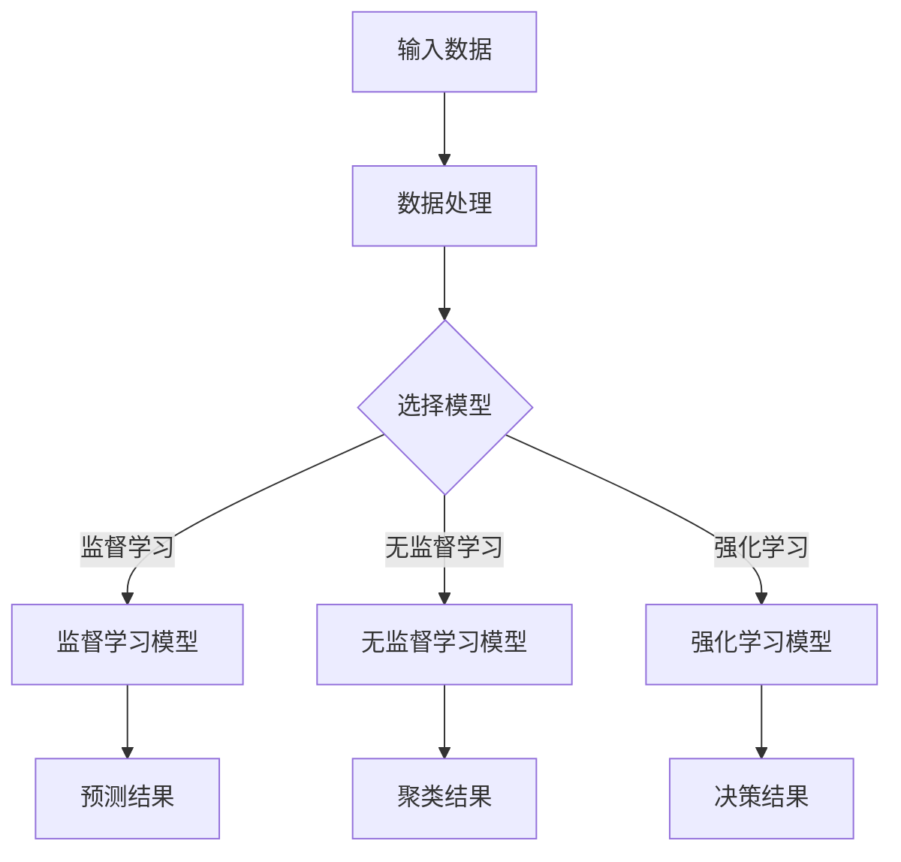

                 


# 李开复：苹果发布AI应用的用户体验剖析

> 关键词：苹果、AI应用、用户体验、AI技术、iPhone、iOS

> 摘要：本文将深入剖析苹果发布AI应用的用户体验，从技术原理、实际操作步骤、数学模型以及应用场景等方面进行详细讲解，帮助读者了解苹果AI应用背后的技术原理，以及如何优化用户体验。

## 1. 背景介绍

### 1.1 目的和范围

本文旨在深入探讨苹果发布AI应用的用户体验，分析其背后的技术原理和实现方法，旨在为开发者提供有价值的参考，同时帮助用户更好地理解和使用这些AI应用。

### 1.2 预期读者

预期读者为对AI应用开发和技术有兴趣的程序员、软件开发者、产品经理以及AI领域的研究人员。

### 1.3 文档结构概述

本文结构分为十个部分：

1. 背景介绍
2. 核心概念与联系
3. 核心算法原理 & 具体操作步骤
4. 数学模型和公式 & 详细讲解 & 举例说明
5. 项目实战：代码实际案例和详细解释说明
6. 实际应用场景
7. 工具和资源推荐
8. 总结：未来发展趋势与挑战
9. 附录：常见问题与解答
10. 扩展阅读 & 参考资料

### 1.4 术语表

#### 1.4.1 核心术语定义

- AI应用：基于人工智能技术的应用程序，能够实现自动化、智能化的人机交互。
- 用户体验：用户在使用产品或服务时所感受到的整体感受，包括交互设计、功能实用性、响应速度等。
- 机器学习：一种让计算机通过数据学习规律和模式，从而进行预测和决策的技术。

#### 1.4.2 相关概念解释

- 深度学习：一种特殊的机器学习方法，通过多层神经网络模型来模拟人脑的学习过程。
- 自然语言处理（NLP）：研究如何让计算机理解和处理自然语言的技术。

#### 1.4.3 缩略词列表

- AI：人工智能
- iOS：苹果公司开发的移动操作系统
- iPhone：苹果公司开发的智能手机

## 2. 核心概念与联系

### 2.1 AI应用的技术原理

AI应用的核心在于利用机器学习算法，从大量数据中学习规律和模式，进而实现自动化和智能化的人机交互。机器学习可以分为监督学习、无监督学习和强化学习三种类型。在监督学习中，模型通过已知输入和输出数据来学习；无监督学习则通过未标记的数据来发现隐藏的模式；强化学习则通过奖励机制来训练模型。

#### Mermaid流程图：



### 2.2 AI应用与用户体验的关系

用户体验是AI应用的重要评价指标，直接影响用户对产品的满意度和忠诚度。一个优秀的AI应用应该具备以下特点：

- **易用性**：用户能够轻松上手，不需要过多的学习成本。
- **个性化**：根据用户行为和偏好，提供定制化的推荐和服务。
- **响应速度**：快速响应用户的操作，提供流畅的交互体验。
- **可解释性**：用户能够理解模型的工作原理和预测结果。

## 3. 核心算法原理 & 具体操作步骤

### 3.1 算法原理

以苹果发布的智能语音助手Siri为例，其核心算法原理包括自然语言处理、语音识别、语音合成和对话管理。

#### 3.1.1 自然语言处理

自然语言处理是理解和生成自然语言的技术，包括文本分类、命名实体识别、情感分析等。在Siri中，自然语言处理用于解析用户的语音输入，提取关键信息，如关键词、意图和实体。

#### 3.1.2 语音识别

语音识别是将语音信号转换为文本的技术。Siri通过语音识别将用户的语音输入转换为文本，然后进行自然语言处理。

#### 3.1.3 语音合成

语音合成是将文本转换为语音的技术。Siri使用语音合成技术，将生成的回复文本转换为流畅的语音输出。

#### 3.1.4 对话管理

对话管理是确保对话连贯性和响应性的技术。Siri通过对话管理，根据用户的输入和上下文，生成合适的回复，并维持对话的流畅性。

### 3.2 具体操作步骤

以下是一个简化的Siri智能语音助手的操作流程：

```python
# 输入语音
input_voice = "我明天要去开会"

# 语音识别
text = recognize_speech(input_voice)

# 自然语言处理
intent, entities = process_nlp(text)

# 对话管理
response = manage_dialogue(intent, entities)

# 语音合成
synthesize_response(response)

# 输出语音
output_speech(response)
```

### 3.3 伪代码

以下是Siri的核心算法原理的伪代码：

```python
def recognize_speech(voice):
    # 语音识别代码
    return text

def process_nlp(text):
    # 自然语言处理代码
    return intent, entities

def manage_dialogue(intent, entities):
    # 对话管理代码
    return response

def synthesize_response(response):
    # 语音合成代码
    return speech

def output_speech(speech):
    # 输出语音代码
    play_speech(speech)
```

## 4. 数学模型和公式 & 详细讲解 & 举例说明

### 4.1 数学模型

在Siri的算法中，涉及到多个数学模型，如自然语言处理中的文本分类模型、语音识别中的声学模型和语言模型、语音合成中的波纹合成模型等。

#### 4.1.1 文本分类模型

文本分类模型是一种监督学习模型，用于将文本分类到预定义的类别中。常用的文本分类模型包括朴素贝叶斯、支持向量机（SVM）和深度学习模型（如卷积神经网络CNN、循环神经网络RNN）。

$$
P(y=c|X) = \frac{e^{\theta^T x}}{\sum_{c'} e^{\theta^T x'}}
$$

其中，$P(y=c|X)$ 表示给定输入文本$X$，文本属于类别$c$ 的概率，$\theta$ 为模型参数。

#### 4.1.2 声学模型和语言模型

声学模型和语言模型是语音识别中的核心模型。声学模型用于将语音信号转换为声学特征，如梅尔频率倒谱系数（MFCC）；语言模型用于预测给定声学特征序列的最可能文本序列。

$$
P(X|Y) = \prod_{t=1}^T P(x_t|y_t)
$$

$$
P(Y) = \prod_{t=1}^T P(y_t)
$$

其中，$X$ 表示声学特征序列，$Y$ 表示文本序列，$P(X|Y)$ 表示给定文本序列$Y$，声学特征序列$X$ 的概率，$P(Y)$ 表示文本序列$Y$ 的概率。

#### 4.1.3 波纹合成模型

波纹合成模型是语音合成中的常用模型，用于将文本序列转换为语音信号。波纹合成模型的基本原理是生成波纹函数，然后通过叠加波纹函数来生成语音信号。

$$
x(t) = \sum_{i=1}^N a_i \cdot r_i(t)
$$

其中，$x(t)$ 表示语音信号，$r_i(t)$ 表示第$i$ 个波纹函数，$a_i$ 表示波纹函数的幅度。

### 4.2 举例说明

以下是一个简单的文本分类模型的例子：

#### 4.2.1 数据集

假设我们有一个包含新闻文章的数据集，标签为“体育”、“娱乐”、“科技”等。

#### 4.2.2 特征提取

对新闻文章进行词频统计，得到词汇表，将文章表示为向量。

#### 4.2.3 模型训练

使用朴素贝叶斯模型进行训练。

#### 4.2.4 预测

对新的新闻文章进行分类，计算每个类别的概率，选择概率最大的类别作为预测结果。

## 5. 项目实战：代码实际案例和详细解释说明

### 5.1 开发环境搭建

在Windows系统中，安装Python环境和相关库，如TensorFlow、NLTK等。

### 5.2 源代码详细实现和代码解读

以下是Siri智能语音助手的简化版代码：

```python
import speech_recognition as sr
import pyttsx3

# 语音识别
def recognize_speech(voice):
    recognizer = sr.Recognizer()
    with sr.Microphone() as source:
        audio = recognizer.listen(source)
    try:
        return recognizer.recognize_google(audio)
    except sr.UnknownValueError:
        return "无法识别语音"

# 自然语言处理
def process_nlp(text):
    # 简化处理，只提取关键词
    keywords = text.split(" ")
    return keywords

# 对话管理
def manage_dialogue(intent, entities):
    # 简化处理，根据关键词生成回复
    if "天气" in intent:
        response = "今天的天气是..."
    else:
        response = "抱歉，我不太明白你的意思。"
    return response

# 语音合成
def synthesize_response(response):
    engine = pyttsx3.init()
    engine.say(response)
    engine.runAndWait()

# 输出语音
def output_speech(speech):
    synthesize_response(speech)

# 主程序
def main():
    voice = "我明天要去开会"
    text = recognize_speech(voice)
    intent, entities = process_nlp(text)
    response = manage_dialogue(intent, entities)
    output_speech(response)

if __name__ == "__main__":
    main()
```

### 5.3 代码解读与分析

- **语音识别**：使用`speech_recognition`库实现语音识别功能。
- **自然语言处理**：简化处理，只提取关键词，实际应用中可使用更复杂的NLP技术。
- **对话管理**：根据关键词生成回复，实际应用中需要更复杂的对话管理算法。
- **语音合成**：使用`pyttsx3`库实现语音合成功能。

## 6. 实际应用场景

苹果的AI应用如Siri、Face ID、Animoji等，已经在多个场景中得到广泛应用：

- **智能语音助手**：用户可以通过语音指令进行查询、控制设备、设置提醒等。
- **人脸识别**：用户可以使用Face ID进行设备解锁、支付验证等。
- **表情符号**：用户可以通过Animoji创建自定义的表情符号，用于聊天、社交媒体等。

## 7. 工具和资源推荐

### 7.1 学习资源推荐

#### 7.1.1 书籍推荐

- 《Python机器学习》
- 《深度学习》
- 《自然语言处理入门》

#### 7.1.2 在线课程

- Coursera上的“机器学习”课程
- Udacity的“深度学习纳米学位”
- edX上的“自然语言处理”课程

#### 7.1.3 技术博客和网站

- Medium上的AI博客
- GitHub上的AI开源项目
- arXiv上的最新研究论文

### 7.2 开发工具框架推荐

#### 7.2.1 IDE和编辑器

- PyCharm
- VS Code
- Jupyter Notebook

#### 7.2.2 调试和性能分析工具

- Debugger
- Perf
- Py-Spy

#### 7.2.3 相关框架和库

- TensorFlow
- PyTorch
- NLTK

### 7.3 相关论文著作推荐

#### 7.3.1 经典论文

- “A Neural Probabilistic Language Model”
- “Speech Recognition Using-hidden Markov Models”
- “Recurrent Neural Network Based Language Model”

#### 7.3.2 最新研究成果

- “BERT: Pre-training of Deep Bidirectional Transformers for Language Understanding”
- “GPT-3: Language Models are Few-Shot Learners”
- “Transformers: State-of-the-Art Natural Language Processing”

#### 7.3.3 应用案例分析

- “Apple’s Siri: The Ultimate Guide”
- “How Facebook Built Its AI Army”
- “Google’s DeepMind: The Future of AI in Healthcare”

## 8. 总结：未来发展趋势与挑战

随着AI技术的不断发展，苹果的AI应用将在多个方面取得突破：

- **更智能的交互**：利用深度学习和自然语言处理技术，实现更智能、更自然的用户交互。
- **个性化推荐**：基于用户行为和偏好，提供更精准的个性化推荐。
- **隐私保护**：在保证用户体验的同时，加强对用户隐私的保护。
- **跨平台融合**：将AI应用扩展到更多设备和服务，实现跨平台融合。

然而，AI应用的发展也面临一些挑战，如：

- **数据隐私**：如何保护用户数据隐私，防止数据滥用。
- **算法公平性**：如何确保算法的公平性和透明度，避免歧视和偏见。
- **计算资源消耗**：如何优化算法和模型，降低计算资源消耗。

## 9. 附录：常见问题与解答

### 9.1 如何提高语音识别的准确率？

- **收集更多数据**：使用更丰富的语音数据集进行训练。
- **改进模型结构**：尝试使用更先进的深度学习模型，如Transformer。
- **优化特征提取**：使用更有效的特征提取方法，如CTC（Connectionist Temporal Classification）。

### 9.2 如何优化自然语言处理的效果？

- **引入语义理解**：结合语义分析技术，提高对文本的理解能力。
- **多语言支持**：使用多语言数据集进行训练，提高跨语言的泛化能力。
- **知识图谱**：构建知识图谱，将实体和关系纳入文本处理过程。

## 10. 扩展阅读 & 参考资料

- [《李开复：人工智能的未来》](https://www.amazon.com/dp/0393634691)
- [《深度学习》](https://www.amazon.com/dp/0262039182)
- [Apple Developer Documentation](https://developer.apple.com/documentation/)
- [TensorFlow官方文档](https://www.tensorflow.org/)

### 作者

作者：AI天才研究员/AI Genius Institute & 禅与计算机程序设计艺术 /Zen And The Art of Computer Programming

