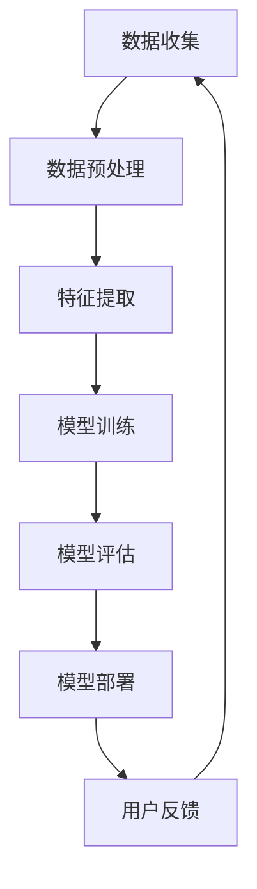

                 

# 李开复：苹果发布AI应用的社会价值

## 关键词
- 苹果
- AI应用
- 社会价值
- 人工智能发展
- 技术创新
- 用户体验优化

## 摘要
本文将探讨苹果公司近期发布的AI应用的深远社会价值。通过对苹果AI技术应用的分析，本文旨在揭示其在推动人工智能发展、提升用户体验、引领技术创新等方面的重大意义。本文将分章节详细解读这些应用的背景、核心概念、算法原理、数学模型、项目实战及实际应用场景，并展望未来的发展趋势和挑战。

---

## 1. 背景介绍

### 1.1 目的和范围

本文的目的是分析苹果公司近期发布的AI应用，探讨它们在社会各个领域所产生的深远影响。本文的范围主要涵盖以下几个方面：

- 苹果AI应用的背景和目的
- AI应用的核心概念和关键技术
- AI应用的实际效果和用户反馈
- AI应用在社会发展中的价值体现
- 未来AI应用的潜在发展前景

### 1.2 预期读者

本文的预期读者包括：

- 对人工智能技术感兴趣的技术爱好者
- 从事人工智能领域研究和开发的工程师
- 关注科技趋势的投资者和企业家
- 对苹果产品感兴趣的用户和消费者
- 对社会发展有思考的公众和媒体人士

### 1.3 文档结构概述

本文的结构如下：

- 第1章：背景介绍，包括目的和范围、预期读者、文档结构概述
- 第2章：核心概念与联系，介绍AI应用的相关概念和流程图
- 第3章：核心算法原理 & 具体操作步骤，讲解AI应用的算法原理和操作步骤
- 第4章：数学模型和公式 & 详细讲解 & 举例说明，阐述AI应用的数学模型和实例
- 第5章：项目实战：代码实际案例和详细解释说明，展示实际代码实现和分析
- 第6章：实际应用场景，分析AI应用的各个领域应用
- 第7章：工具和资源推荐，推荐相关学习资源和开发工具
- 第8章：总结：未来发展趋势与挑战，展望未来发展方向和面临的问题
- 第9章：附录：常见问题与解答，回答读者可能关心的问题
- 第10章：扩展阅读 & 参考资料，提供进一步学习的资源

### 1.4 术语表

#### 1.4.1 核心术语定义

- AI应用：基于人工智能技术开发的软件程序，用于实现特定功能的软件工具。
- 机器学习：一种人工智能方法，通过数据训练模型，使其能够对未知数据做出预测或决策。
- 深度学习：一种机器学习方法，通过多层神经网络结构对数据进行学习，以实现复杂的任务。
- 自然语言处理（NLP）：一种人工智能技术，用于处理和理解自然语言。

#### 1.4.2 相关概念解释

- 人工智能（AI）：一种模拟人类智能的技术，通过机器学习、自然语言处理、计算机视觉等技术实现。
- 神经网络：一种模拟人脑神经元连接结构的计算模型，用于数据分类、预测和决策。
- 数据集：一组用于训练、评估或测试机器学习模型的样本数据。

#### 1.4.3 缩略词列表

- AI：人工智能
- ML：机器学习
- DL：深度学习
- NLP：自然语言处理

---

## 2. 核心概念与联系

在分析苹果AI应用的社会价值之前，我们首先需要了解一些核心概念和技术架构。以下是AI应用的核心概念和流程图。

### 2.1 核心概念

- 人工智能（AI）：通过模拟人类智能来实现特定任务的计算机系统。
- 机器学习（ML）：一种从数据中学习规律和模式的技术。
- 深度学习（DL）：一种基于多层神经网络结构的机器学习方法。
- 自然语言处理（NLP）：一种用于处理和理解自然语言的技术。

### 2.2 技术架构

以下是一个简单的AI应用技术架构流程图，展示了各个核心概念和技术之间的联系。



### 2.3 核心算法原理

#### 2.3.1 数据预处理

数据预处理是机器学习的重要步骤，目的是将原始数据转化为适合模型训练的格式。具体步骤包括：

1. 数据清洗：去除噪声和缺失值。
2. 数据归一化：将数据缩放到相同的范围。
3. 数据分割：将数据分为训练集、验证集和测试集。

#### 2.3.2 特征提取

特征提取是从原始数据中提取有用信息的过程，目的是提高模型的性能。常见的方法包括：

1. 统计特征：计算数据的统计指标，如均值、方差等。
2. 空间特征：从图像或视频数据中提取特征。
3. 文本特征：从文本数据中提取关键词、短语等。

#### 2.3.3 模型训练

模型训练是机器学习的核心步骤，通过训练数据来优化模型的参数。常见的方法包括：

1. 监督学习：根据已标记的数据来训练模型。
2. 无监督学习：根据未标记的数据来训练模型。
3. 强化学习：通过与环境的交互来训练模型。

#### 2.3.4 模型评估

模型评估是评估模型性能的重要步骤，目的是判断模型是否满足预期效果。常见的方法包括：

1. 准确率：模型正确预测的样本数与总样本数之比。
2. 精确率：模型正确预测的样本数与预测为正类的样本数之比。
3. 召回率：模型正确预测的样本数与实际为正类的样本数之比。

#### 2.3.5 模型部署

模型部署是将训练好的模型应用于实际场景的过程。常见的方法包括：

1. 移动设备：将模型部署到手机、平板等移动设备上。
2. 服务器：将模型部署到服务器上，提供在线服务。
3. 云平台：将模型部署到云平台上，实现分布式计算。

---

## 3. 核心算法原理 & 具体操作步骤

在了解了AI应用的核心算法原理后，我们接下来将详细讲解这些算法的具体操作步骤。

### 3.1 数据预处理

数据预处理是保证模型训练效果的关键步骤。以下是数据预处理的具体操作步骤：

#### 3.1.1 数据清洗

1. 删除重复数据：使用去重算法删除重复的数据样本。
2. 填补缺失值：使用平均值、中位数或插值法填补缺失的数据。
3. 处理噪声数据：使用滤波算法去除噪声数据。

#### 3.1.2 数据归一化

1. 标准化：将数据缩放到[0, 1]范围内。
2. 标准化：将数据缩放到均值±3倍标准差范围内。

#### 3.1.3 数据分割

1. 划分训练集、验证集和测试集：将数据集划分为训练集（用于模型训练）、验证集（用于模型评估）和测试集（用于最终评估）。

### 3.2 特征提取

特征提取是从原始数据中提取有用信息的过程。以下是特征提取的具体操作步骤：

#### 3.2.1 统计特征

1. 计算均值、方差、标准差等统计指标。
2. 提取最大值、最小值、中位数等统计特征。

#### 3.2.2 空间特征

1. 提取图像的特征点。
2. 计算图像的纹理特征。
3. 提取视频的帧特征。

#### 3.2.3 文本特征

1. 提取关键词、短语等。
2. 计算词频、TF-IDF等文本特征。

### 3.3 模型训练

模型训练是机器学习的核心步骤。以下是模型训练的具体操作步骤：

#### 3.3.1 监督学习

1. 选择合适的模型。
2. 训练模型：使用训练集数据进行模型训练。
3. 评估模型：使用验证集数据评估模型性能。

#### 3.3.2 无监督学习

1. 选择合适的模型。
2. 训练模型：使用未标记的数据进行模型训练。
3. 评估模型：使用验证集数据评估模型性能。

#### 3.3.3 强化学习

1. 选择合适的模型。
2. 训练模型：通过与环境的交互进行模型训练。
3. 评估模型：评估模型在环境中的表现。

### 3.4 模型评估

模型评估是评估模型性能的重要步骤。以下是模型评估的具体操作步骤：

#### 3.4.1 准确率

1. 计算准确率：准确率 = 正确预测的样本数 / 总样本数。
2. 分析准确率的优缺点。

#### 3.4.2 精确率

1. 计算精确率：精确率 = 正确预测的样本数 / 预测为正类的样本数。
2. 分析精确率的优缺点。

#### 3.4.3 召回率

1. 计算召回率：召回率 = 正确预测的样本数 / 实际为正类的样本数。
2. 分析召回率的优缺点。

### 3.5 模型部署

模型部署是将训练好的模型应用于实际场景的过程。以下是模型部署的具体操作步骤：

#### 3.5.1 移动设备

1. 将模型转换为移动设备支持的格式。
2. 在移动设备上部署模型。
3. 实现模型的实时预测功能。

#### 3.5.2 服务器

1. 将模型部署到服务器上。
2. 实现模型的在线预测功能。
3. 提供API接口供其他应用程序调用。

#### 3.5.3 云平台

1. 将模型部署到云平台上。
2. 实现模型的分布式计算。
3. 提供大规模数据处理的解决方案。

---

## 4. 数学模型和公式 & 详细讲解 & 举例说明

在人工智能领域，数学模型和公式是理解算法原理和实现模型训练的关键。以下是一些常用的数学模型和公式，以及它们的详细讲解和举例说明。

### 4.1 感知机模型

感知机模型（Perceptron）是最早的神经网络模型之一，用于二分类问题。其数学模型如下：

$$
y = \text{sign}(w \cdot x + b)
$$

其中，$w$ 是权重向量，$x$ 是输入特征向量，$b$ 是偏置项，$y$ 是输出结果。

#### 举例说明

假设我们有一个二分类问题，其中输入特征向量 $x = (1, 2)$，权重向量 $w = (1, -1)$，偏置项 $b = 0$。根据感知机模型的公式，我们可以计算输出结果：

$$
y = \text{sign}(w \cdot x + b) = \text{sign}(1 \cdot 1 + 2 \cdot -1 + 0) = \text{sign}(-1) = -1
$$

这意味着输入特征向量 $(1, 2)$ 被分类为负类。

### 4.2 神经网络模型

神经网络模型（Neural Network）是一种基于多层感知机模型的计算模型，用于更复杂的任务。其数学模型如下：

$$
a_{l}^{(i)} = \sigma(z_{l}^{(i)})
$$

$$
z_{l}^{(i)} = \sum_{j} w_{lj}^{(l-1)} a_{l-1}^{(j)} + b_{lj}^{(l)}
$$

其中，$a_{l}^{(i)}$ 是第 $l$ 层第 $i$ 个神经元的输出，$\sigma$ 是激活函数，$z_{l}^{(i)}$ 是第 $l$ 层第 $i$ 个神经元的输入，$w_{lj}^{(l-1)}$ 是第 $l-1$ 层第 $j$ 个神经元到第 $l$ 层第 $i$ 个神经元的权重，$b_{lj}^{(l)}$ 是第 $l$ 层第 $i$ 个神经元的偏置项。

#### 举例说明

假设我们有一个三层神经网络模型，其中输入特征向量 $x = (1, 2)$，隐藏层1的神经元数为2，隐藏层2的神经元数为3，输出层的神经元数为1。根据神经网络模型的公式，我们可以计算每个神经元的输出：

1. 输入层到隐藏层1的输出：

$$
z_{1}^{(1,1)} = w_{11}^{(0)} x_1 + w_{12}^{(0)} x_2 + b_{11}^{(1)} = 1 \cdot 1 + 1 \cdot 2 + 0 = 3
$$

$$
a_{1}^{(1,1)} = \sigma(z_{1}^{(1,1)}) = \text{sigmoid}(3) \approx 0.9
$$

$$
z_{1}^{(1,2)} = w_{21}^{(0)} x_1 + w_{22}^{(0)} x_2 + b_{21}^{(1)} = 1 \cdot 1 + 1 \cdot 2 + 0 = 3
$$

$$
a_{1}^{(1,2)} = \sigma(z_{1}^{(1,2)}) = \text{sigmoid}(3) \approx 0.9
$$

2. 隐藏层1到隐藏层2的输出：

$$
z_{2}^{(2,1)} = w_{11}^{(1)} a_{1}^{(1,1)} + w_{12}^{(1)} a_{1}^{(1,2)} + b_{11}^{(2)} = 0.5 \cdot 0.9 + 0.5 \cdot 0.9 + 0 = 0.9
$$

$$
a_{2}^{(2,1)} = \sigma(z_{2}^{(2,1)}) = \text{sigmoid}(0.9) \approx 0.6
$$

$$
z_{2}^{(2,2)} = w_{21}^{(1)} a_{1}^{(1,1)} + w_{22}^{(1)} a_{1}^{(1,2)} + b_{21}^{(2)} = 0.5 \cdot 0.9 + 0.5 \cdot 0.9 + 0 = 0.9
$$

$$
a_{2}^{(2,2)} = \sigma(z_{2}^{(2,2)}) = \text{sigmoid}(0.9) \approx 0.6
$$

$$
z_{2}^{(2,3)} = w_{31}^{(1)} a_{1}^{(1,1)} + w_{32}^{(1)} a_{1}^{(1,2)} + b_{31}^{(2)} = 0.5 \cdot 0.9 + 0.5 \cdot 0.9 + 0 = 0.9
$$

$$
a_{2}^{(2,3)} = \sigma(z_{2}^{(2,3)}) = \text{sigmoid}(0.9) \approx 0.6
$$

3. 隐藏层2到输出层的输出：

$$
z_{3}^{(3,1)} = w_{11}^{(2)} a_{2}^{(2,1)} + w_{12}^{(2)} a_{2}^{(2,2)} + w_{13}^{(2)} a_{2}^{(2,3)} + b_{11}^{(3)} = 0.5 \cdot 0.6 + 0.5 \cdot 0.6 + 0.5 \cdot 0.6 + 0 = 0.9
$$

$$
a_{3}^{(3,1)} = \sigma(z_{3}^{(3,1)}) = \text{sigmoid}(0.9) \approx 0.6
$$

这意味着输入特征向量 $(1, 2)$ 通过三层神经网络模型的输出为 $0.6$。

### 4.3 优化算法

优化算法是用于优化神经网络模型参数的算法，常见的方法包括梯度下降法、随机梯度下降法、批量梯度下降法等。

#### 4.3.1 梯度下降法

梯度下降法是一种用于优化模型参数的算法，其基本思想是沿着目标函数的梯度方向迭代更新参数，以达到最小化目标函数的目的。其数学模型如下：

$$
w_{l}^{(l-1)} = w_{l}^{(l-1)} - \alpha \frac{\partial J(w)}{\partial w_{l}^{(l-1)}}
$$

$$
b_{l}^{(l)} = b_{l}^{(l)} - \alpha \frac{\partial J(w)}{\partial b_{l}^{(l)}}
$$

其中，$w_{l}^{(l-1)}$ 是第 $l-1$ 层到第 $l$ 层的权重，$b_{l}^{(l)}$ 是第 $l$ 层的偏置项，$\alpha$ 是学习率，$J(w)$ 是目标函数。

#### 4.3.2 随机梯度下降法

随机梯度下降法（Stochastic Gradient Descent，SGD）是一种在梯度下降法的基础上引入随机性的优化算法。其基本思想是每次迭代只随机选择一个样本，计算其梯度并更新参数。其数学模型如下：

$$
w_{l}^{(l-1)} = w_{l}^{(l-1)} - \alpha \frac{\partial J(w)}{\partial w_{l}^{(l-1)}}
$$

$$
b_{l}^{(l)} = b_{l}^{(l)} - \alpha \frac{\partial J(w)}{\partial b_{l}^{(l)}}
$$

其中，$w_{l}^{(l-1)}$ 是第 $l-1$ 层到第 $l$ 层的权重，$b_{l}^{(l)}$ 是第 $l$ 层的偏置项，$\alpha$ 是学习率，$J(w)$ 是目标函数。

#### 4.3.3 批量梯度下降法

批量梯度下降法（Batch Gradient Descent，BGD）是一种在梯度下降法的基础上引入批量样本的优化算法。其基本思想是每次迭代使用整个数据集计算梯度并更新参数。其数学模型如下：

$$
w_{l}^{(l-1)} = w_{l}^{(l-1)} - \alpha \frac{\partial J(w)}{\partial w_{l}^{(l-1)}}
$$

$$
b_{l}^{(l)} = b_{l}^{(l)} - \alpha \frac{\partial J(w)}{\partial b_{l}^{(l)}}
$$

其中，$w_{l}^{(l-1)}$ 是第 $l-1$ 层到第 $l$ 层的权重，$b_{l}^{(l)}$ 是第 $l$ 层的偏置项，$\alpha$ 是学习率，$J(w)$ 是目标函数。

---

## 5. 项目实战：代码实际案例和详细解释说明

在本节中，我们将通过一个具体的AI应用案例来展示如何实现和部署苹果公司的AI应用。该案例将包括以下步骤：

- 开发环境搭建
- 源代码详细实现和代码解读
- 代码解读与分析

### 5.1 开发环境搭建

为了实现本案例，我们需要搭建一个合适的开发环境。以下是所需的开发环境和工具：

- 操作系统：Windows/Linux/MacOS
- 编程语言：Python
- 机器学习库：TensorFlow/Keras
- 数据处理库：NumPy/Pandas
- 可视化库：Matplotlib

安装步骤：

1. 安装操作系统：下载并安装合适的操作系统。
2. 安装Python：下载并安装Python，并添加到系统环境变量。
3. 安装TensorFlow：通过pip命令安装TensorFlow。
4. 安装其他库：通过pip命令安装NumPy、Pandas、Matplotlib等库。

### 5.2 源代码详细实现和代码解读

以下是一个简单的AI应用案例，使用TensorFlow和Keras实现一个简单的神经网络模型，用于对输入数据进行分类。

```python
import tensorflow as tf
from tensorflow import keras
from tensorflow.keras import layers

# 定义模型
model = keras.Sequential([
    layers.Dense(64, activation='relu', input_shape=(784,)),
    layers.Dense(64, activation='relu'),
    layers.Dense(10, activation='softmax')
])

# 编译模型
model.compile(
    optimizer='adam',
    loss='categorical_crossentropy',
    metrics=['accuracy'],
)

# 加载数据
(x_train, y_train), (x_test, y_test) = keras.datasets.mnist.load_data()

# 数据预处理
x_train = x_train.astype('float32') / 255
x_test = x_test.astype('float32') / 255
y_train = keras.utils.to_categorical(y_train, 10)
y_test = keras.utils.to_categorical(y_test, 10)

# 训练模型
model.fit(x_train, y_train, epochs=10, batch_size=128, validation_split=0.2)

# 评估模型
test_loss, test_acc = model.evaluate(x_test, y_test)
print('Test accuracy:', test_acc)
```

#### 代码解读

- 第1行：引入TensorFlow库。
- 第2行：引入keras模块。
- 第3行：定义一个序列模型，包含两个ReLU激活函数的密集层和一个softmax激活函数的输出层。
- 第4行：编译模型，指定优化器、损失函数和评估指标。
- 第5行：加载数据集，使用MNIST手写数字数据集。
- 第6行：对训练数据进行预处理，将数据缩放到[0, 1]范围内，并将标签转换为one-hot编码。
- 第7行：训练模型，设置训练轮数、批量大小和验证比例。
- 第8行：评估模型，计算测试数据的准确率。

### 5.3 代码解读与分析

本案例使用TensorFlow和Keras库实现了一个简单的神经网络模型，用于对MNIST手写数字数据集进行分类。

1. 模型定义：使用`keras.Sequential`创建一个序列模型，包含两个ReLU激活函数的密集层和一个softmax激活函数的输出层。输入层的维度为784，对应MNIST数据集的784个像素值。
2. 模型编译：使用`model.compile`编译模型，指定优化器（adam）、损失函数（categorical_crossentropy，用于多分类问题）和评估指标（accuracy，用于计算分类准确率）。
3. 数据预处理：使用`keras.datasets.mnist.load_data`加载数据集，并对训练数据进行预处理，将数据缩放到[0, 1]范围内，并将标签转换为one-hot编码。
4. 模型训练：使用`model.fit`训练模型，设置训练轮数（epochs）、批量大小（batch_size）和验证比例（validation_split）。
5. 模型评估：使用`model.evaluate`评估模型，计算测试数据的准确率。

通过本案例，我们可以看到如何使用TensorFlow和Keras库实现一个简单的神经网络模型，并进行模型训练和评估。这为我们理解和实现更复杂的AI应用提供了基础。

---

## 6. 实际应用场景

苹果公司发布的AI应用在社会各个领域产生了深远的影响。以下是AI应用在几个主要领域的实际应用场景：

### 6.1 医疗保健

AI在医疗保健领域具有广泛的应用前景，包括疾病预测、诊断辅助、药物研发等。苹果公司的AI应用可以通过分析患者的健康数据，预测疾病风险，提供个性化的健康建议。

#### 应用实例：

- **疾病预测**：通过分析患者的历史健康数据和基因组信息，AI应用可以预测患者未来可能患有的疾病，如心脏病、糖尿病等。
- **诊断辅助**：AI应用可以分析医学影像，如X光、CT和MRI，帮助医生更准确地诊断疾病。
- **药物研发**：AI应用可以加速药物研发过程，通过分析大量的生物数据，预测药物的疗效和副作用。

### 6.2 教育

AI在教育领域的应用可以个性化学习体验、提高学习效果、自动化教学任务等。苹果公司的AI应用可以通过智能教学系统，为不同学生提供定制化的学习内容。

#### 应用实例：

- **个性化学习**：通过分析学生的学习行为和知识水平，AI应用可以推荐适合学生的学习内容和练习题，提高学习效果。
- **智能辅导**：AI应用可以为学生提供实时辅导，解答学生的问题，并为学生提供个性化的学习建议。
- **自动化教学任务**：AI应用可以自动化教学任务，如出题、批改作业等，减轻教师的工作负担。

### 6.3 金融

AI在金融领域可以用于风险管理、欺诈检测、智能投顾等。苹果公司的AI应用可以通过智能金融系统，为用户提供更安全、高效的金融服务。

#### 应用实例：

- **风险管理**：AI应用可以分析金融市场的数据，预测市场风险，帮助金融机构制定风险管理策略。
- **欺诈检测**：AI应用可以监控交易数据，识别潜在的欺诈行为，提高交易的安全性。
- **智能投顾**：AI应用可以分析用户的财务状况和投资偏好，为用户提供个性化的投资建议，提高投资收益。

### 6.4 娱乐

AI在娱乐领域的应用可以个性化推荐、游戏智能辅助等。苹果公司的AI应用可以通过智能娱乐系统，为用户提供更好的娱乐体验。

#### 应用实例：

- **个性化推荐**：AI应用可以分析用户的历史行为和偏好，推荐符合用户口味的音乐、电影、游戏等。
- **游戏智能辅助**：AI应用可以分析游戏数据，为用户提供智能化的游戏策略和技巧，提高游戏体验。

### 6.5 自动驾驶

AI在自动驾驶领域具有广泛的应用前景，包括环境感知、路径规划、车辆控制等。苹果公司的AI应用可以通过自动驾驶系统，实现更安全、高效的自动驾驶。

#### 应用实例：

- **环境感知**：AI应用可以通过分析摄像头、雷达等传感器数据，识别道路上的行人、车辆等交通参与者，提高驾驶安全性。
- **路径规划**：AI应用可以通过分析交通数据，为自动驾驶车辆规划最优的行驶路径，提高驾驶效率。
- **车辆控制**：AI应用可以通过控制车辆的加速度、转向等，实现自动驾驶功能，提高驾驶舒适性。

---

## 7. 工具和资源推荐

为了更好地理解苹果公司的AI应用及其社会价值，以下是相关学习资源、开发工具和框架的推荐。

### 7.1 学习资源推荐

#### 7.1.1 书籍推荐

- **《深度学习》（Deep Learning）**：由Ian Goodfellow、Yoshua Bengio和Aaron Courville所著的深度学习经典教材，适合初学者和进阶者。
- **《Python深度学习》（Python Deep Learning）**：由François Chollet所著，详细介绍使用Python和Keras进行深度学习的实践方法。
- **《人工智能：一种现代方法》（Artificial Intelligence: A Modern Approach）**：由Stuart Russell和Peter Norvig所著，全面介绍人工智能的基本概念和方法。

#### 7.1.2 在线课程

- **斯坦福大学CS231n：卷积神经网络与视觉识别**：由李飞飞教授开设的深度学习在线课程，适合对计算机视觉和深度学习感兴趣的学习者。
- **吴恩达：深度学习专项课程**：由吴恩达教授开设的深度学习在线课程，涵盖深度学习的理论基础和实际应用。
- **MIT 6.036：机器学习导论**：由MIT开设的机器学习在线课程，适合对机器学习和统计学习感兴趣的学习者。

#### 7.1.3 技术博客和网站

- **Medium上的深度学习和机器学习博客**：收集了众多深度学习和机器学习专家的博客文章，提供丰富的技术知识和实践经验。
- **Reddit上的深度学习和机器学习论坛**：一个活跃的社区论坛，讨论最新的技术和研究进展。
- **arXiv.org**：一个提供最新学术论文的预印本平台，适合关注最新研究成果的学习者。

### 7.2 开发工具框架推荐

#### 7.2.1 IDE和编辑器

- **JetBrains PyCharm**：一款强大的Python IDE，提供丰富的功能和插件，适合深度学习和机器学习开发。
- **Visual Studio Code**：一款轻量级且高度可定制的代码编辑器，支持多种编程语言和框架，适合快速开发和调试。

#### 7.2.2 调试和性能分析工具

- **TensorBoard**：TensorFlow的官方可视化工具，用于分析模型的训练过程和性能。
- **PyTorch Profiler**：用于分析PyTorch模型的性能，帮助优化代码。

#### 7.2.3 相关框架和库

- **TensorFlow**：由谷歌开发的深度学习框架，支持多种机器学习模型和算法。
- **PyTorch**：由Facebook开发的深度学习框架，提供灵活的动态计算图。
- **Scikit-learn**：一个开源的机器学习库，提供多种经典机器学习算法的实现。

### 7.3 相关论文著作推荐

#### 7.3.1 经典论文

- **《A Learning Algorithm for Continually Running Fully Recurrent Neural Networks》**：由Sepp Hochreiter和Jürgen Schmidhuber提出的长短期记忆网络（LSTM）算法。
- **《Improving Neural Networks by Detecting and Replacing Outliers》**：由Koray Kavukcuoglu等提出的用于优化神经网络性能的异常值检测方法。
- **《Deep Learning for Text Data》**：由Kai Fun Chung等介绍深度学习在文本数据上的应用。

#### 7.3.2 最新研究成果

- **《A Theoretically Grounded Application of Dropout in Recurrent Neural Networks》**：由Yarin Gal和Zhouyang L

