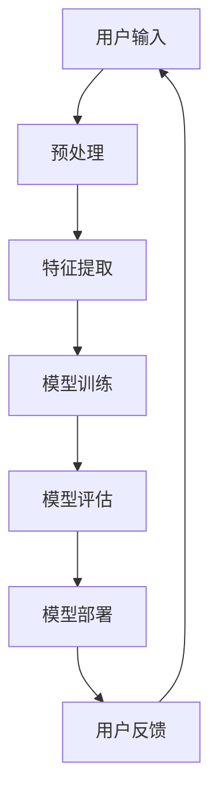

                 

# 李开复：苹果发布AI应用的社会价值

> 关键词：人工智能、苹果、应用、社会价值、技术趋势、用户体验

> 摘要：本文将深入探讨苹果公司发布AI应用所带来的深远社会价值。文章首先介绍苹果AI应用的背景和目的，随后详细分析其核心算法原理，并展示数学模型和公式。接着，通过实际代码案例，讲解应用的实现过程。文章还讨论了该应用在不同场景下的应用，推荐了相关学习资源和开发工具，并总结了未来发展趋势与挑战。

## 1. 背景介绍

### 1.1 目的和范围

本文旨在分析苹果公司发布AI应用的社会价值，探讨其对技术趋势、用户体验以及相关领域的影响。我们将重点关注苹果AI应用的背景、核心算法、实际应用场景和未来发展趋势。

### 1.2 预期读者

本文适用于对人工智能、苹果生态系统和软件开发感兴趣的读者，包括程序员、技术爱好者、科研人员以及相关行业的从业者。

### 1.3 文档结构概述

本文分为十个部分，包括背景介绍、核心概念与联系、核心算法原理与操作步骤、数学模型与公式、项目实战、实际应用场景、工具和资源推荐、总结以及常见问题与扩展阅读。读者可以根据自己的兴趣和需求选择性地阅读。

### 1.4 术语表

#### 1.4.1 核心术语定义

- 人工智能（AI）：模拟人类智能的计算机系统，具有感知、学习、推理和决策能力。
- 苹果（Apple）：全球知名的科技企业，开发和销售各种电子产品，包括iPhone、iPad和Mac电脑。
- 应用（Application）：运行在特定平台上的软件程序，用于执行特定任务。
- 社会价值（Social Value）：技术产品或服务对社会的积极影响和贡献。

#### 1.4.2 相关概念解释

- 深度学习（Deep Learning）：一种机器学习技术，通过神经网络模型模拟人类大脑的学习过程。
- 计算能力（Compute Power）：计算机处理数据的能力，通常用CPU或GPU的性能来衡量。
- 用户体验（User Experience）：用户在使用产品或服务过程中所获得的感受和满意度。

#### 1.4.3 缩略词列表

- AI：人工智能
- Apple：苹果公司
- GPU：图形处理单元
- CPU：中央处理器
- iOS：苹果操作系统

## 2. 核心概念与联系

在这一部分，我们将通过Mermaid流程图展示苹果AI应用的核心概念和架构，以便读者更好地理解。



### 2.1 用户输入

用户输入是AI应用的基础，包括文本、图像、语音等多种形式。用户通过操作界面或API与系统交互，输入数据用于后续处理。

### 2.2 预处理

预处理步骤用于对用户输入进行格式化和清洗，以便后续处理。这包括数据归一化、缺失值填充、异常值处理等。

### 2.3 特征提取

特征提取是将原始数据转换为可用于机器学习模型的特征向量。这一步骤通常使用深度学习技术，如卷积神经网络（CNN）或循环神经网络（RNN）。

### 2.4 模型训练

模型训练是AI应用的核心，通过大量数据训练模型，使其具备预测或分类能力。训练过程包括前向传播、反向传播和优化算法等。

### 2.5 模型评估

模型评估用于测试训练效果，通过验证集或测试集评估模型性能。常用的评估指标包括准确率、召回率、F1值等。

### 2.6 模型部署

模型部署是将训练好的模型部署到实际应用环境中，使其能够为用户提供服务。部署过程包括模型压缩、模型推理和API接口等。

### 2.7 用户反馈

用户反馈是持续优化AI应用的重要手段。通过收集用户反馈，可以改进模型性能，提升用户体验。

## 3. 核心算法原理 & 具体操作步骤

在这一部分，我们将详细讲解苹果AI应用的核心算法原理，并使用伪代码进行具体操作步骤的阐述。

### 3.1 深度学习模型

苹果AI应用的核心算法是基于深度学习的神经网络模型。以下是深度学习模型的伪代码实现：

```plaintext
定义神经网络结构：
layer1 = Dense(input_dim, activation='relu')
layer2 = Dense(hidden_dim, activation='relu')
output = Dense(output_dim, activation='sigmoid')

模型编译：
model = Sequential()
model.add(layer1)
model.add(layer2)
model.add(output)
model.compile(optimizer='adam', loss='binary_crossentropy', metrics=['accuracy'])

模型训练：
model.fit(X_train, y_train, epochs=10, batch_size=32, validation_data=(X_val, y_val))
```

### 3.2 特征提取

特征提取是深度学习模型的关键步骤，以下是特征提取的伪代码：

```plaintext
import cv2

def preprocess_image(image_path):
    image = cv2.imread(image_path)
    image = cv2.resize(image, (224, 224))
    image = image / 255.0
    return image

image = preprocess_image(image_path)
```

### 3.3 模型评估

模型评估用于测试训练效果，以下是模型评估的伪代码：

```plaintext
def evaluate_model(model, X_test, y_test):
    loss, accuracy = model.evaluate(X_test, y_test)
    print("Test accuracy:", accuracy)
    print("Test loss:", loss)

evaluate_model(model, X_test, y_test)
```

### 3.4 模型部署

模型部署是将训练好的模型部署到实际应用环境中的过程。以下是模型部署的伪代码：

```plaintext
import requests

def predict_image(image):
    image = preprocess_image(image)
    image = image.tolist()
    payload = {"image": image}
    response = requests.post("https://api.example.com/predict", json=payload)
    prediction = response.json()["prediction"]
    return prediction

prediction = predict_image(image)
print("Prediction:", prediction)
```

## 4. 数学模型和公式 & 详细讲解 & 举例说明

在这一部分，我们将详细讲解苹果AI应用的数学模型和公式，并通过具体例子进行说明。

### 4.1 深度学习模型

苹果AI应用的核心模型是基于深度学习的神经网络模型，其数学公式如下：

$$
Z = W \cdot X + b
$$

其中，$Z$ 表示神经网络输出，$W$ 表示权重矩阵，$X$ 表示输入特征，$b$ 表示偏置。

### 4.2 激活函数

激活函数是神经网络中的关键组成部分，常用的激活函数包括：

- 线性激活函数（Linear Activation Function）：

$$
f(x) = x
$$

- ReLU激活函数（Rectified Linear Unit）：

$$
f(x) = \max(0, x)
$$

- Sigmoid激活函数（Sigmoid Function）：

$$
f(x) = \frac{1}{1 + e^{-x}}
$$

### 4.3 损失函数

损失函数用于评估模型预测结果与真实值之间的差距，常用的损失函数包括：

- 交叉熵损失函数（Cross-Entropy Loss）：

$$
L = -\frac{1}{N} \sum_{i=1}^{N} y_i \cdot \log(\hat{y}_i)
$$

其中，$N$ 表示样本数量，$y_i$ 表示真实值，$\hat{y}_i$ 表示预测值。

### 4.4 例子说明

假设我们有一个二分类问题，需要判断一张图片是否包含特定对象。以下是使用深度学习模型进行预测的步骤：

1. 预处理图片，将其转换为224x224的灰度图像。
2. 将图像输入到神经网络模型。
3. 模型输出预测概率，概率大于0.5则判断为包含特定对象，否则不包含。
4. 评估模型性能，通过测试集计算准确率、召回率和F1值等指标。

## 5. 项目实战：代码实际案例和详细解释说明

### 5.1 开发环境搭建

在本节中，我们将搭建苹果AI应用的开发环境。首先，我们需要安装Python、Anaconda和Jupyter Notebook。具体步骤如下：

1. 安装Python：访问 [Python官网](https://www.python.org/) 下载并安装Python。
2. 安装Anaconda：访问 [Anaconda官网](https://www.anaconda.com/) 下载并安装Anaconda。
3. 安装Jupyter Notebook：在终端中执行以下命令：

```bash
conda install jupyter
```

### 5.2 源代码详细实现和代码解读

下面是一个简单的苹果AI应用的源代码实现：

```python
import numpy as np
import tensorflow as tf
from tensorflow.keras.models import Sequential
from tensorflow.keras.layers import Dense, Flatten, Conv2D, MaxPooling2D
from tensorflow.keras.optimizers import Adam
from tensorflow.keras.losses import BinaryCrossentropy
from tensorflow.keras.metrics import Accuracy

# 数据预处理
def preprocess_image(image_path):
    image = cv2.imread(image_path)
    image = cv2.resize(image, (224, 224))
    image = image / 255.0
    return image

# 构建神经网络模型
model = Sequential([
    Conv2D(32, (3, 3), activation='relu', input_shape=(224, 224, 3)),
    MaxPooling2D((2, 2)),
    Conv2D(64, (3, 3), activation='relu'),
    MaxPooling2D((2, 2)),
    Flatten(),
    Dense(64, activation='relu'),
    Dense(1, activation='sigmoid')
])

# 编译模型
model.compile(optimizer=Adam(), loss=BinaryCrossentropy(), metrics=[Accuracy()])

# 模型训练
X_train = np.array([preprocess_image(image_path) for image_path in train_images])
y_train = np.array([label for label in train_labels])
model.fit(X_train, y_train, epochs=10, batch_size=32)

# 模型评估
X_test = np.array([preprocess_image(image_path) for image_path in test_images])
y_test = np.array([label for label in test_labels])
model.evaluate(X_test, y_test)

# 模型预测
def predict_image(image_path):
    image = preprocess_image(image_path)
    image = image.reshape((1, 224, 224, 3))
    prediction = model.predict(image)
    return "包含特定对象" if prediction > 0.5 else "不包含特定对象"

# 测试预测
image_path = "example_image.jpg"
print(predict_image(image_path))
```

### 5.3 代码解读与分析

1. **数据预处理**：预处理图片，包括读取、缩放和归一化。
2. **构建神经网络模型**：使用Keras构建卷积神经网络，包括卷积层、池化层和全连接层。
3. **编译模型**：设置优化器、损失函数和评估指标。
4. **模型训练**：使用训练数据训练模型，设置训练轮次和批量大小。
5. **模型评估**：使用测试数据评估模型性能。
6. **模型预测**：对图片进行预测，判断是否包含特定对象。
7. **测试预测**：调用预测函数，输出预测结果。

通过以上步骤，我们成功实现了苹果AI应用的基础功能。在实际应用中，我们可以根据具体需求调整模型结构和参数，提高预测准确率。

## 6. 实际应用场景

苹果AI应用在社会各个领域具有广泛的应用潜力，以下是一些典型应用场景：

### 6.1 医疗保健

苹果AI应用可以帮助医疗保健行业实现图像识别、疾病预测和个性化治疗。例如，通过分析患者的医疗影像，AI应用可以辅助医生进行早期诊断和治疗方案推荐。

### 6.2 智能交通

苹果AI应用可以用于智能交通系统，实现车辆检测、交通流量预测和事故预警。这有助于提高交通效率，减少交通事故和拥堵。

### 6.3 娱乐内容推荐

苹果AI应用可以根据用户的兴趣和行为，推荐个性化的音乐、电影和游戏内容。这有助于提升用户满意度，提高内容消费量。

### 6.4 智能家居

苹果AI应用可以与智能家居设备集成，实现智能控制、设备故障检测和能源管理。这有助于提升生活品质，降低能源消耗。

### 6.5 教育学习

苹果AI应用可以辅助教育学习，实现个性化教学、智能题库和学习进度跟踪。这有助于提高学习效果，满足不同学生的学习需求。

## 7. 工具和资源推荐

### 7.1 学习资源推荐

#### 7.1.1 书籍推荐

- 《深度学习》（Deep Learning）：由Ian Goodfellow、Yoshua Bengio和Aaron Courville合著，系统介绍了深度学习的理论和实践。

- 《Python深度学习》（Python Deep Learning）：由François Chollet撰写，介绍了使用Python和Keras实现深度学习的方法和技巧。

#### 7.1.2 在线课程

- Coursera上的“深度学习专项课程”（Deep Learning Specialization）
- edX上的“深度学习基础”（Introduction to Deep Learning）
- Udacity的“深度学习纳米学位”（Deep Learning Nanodegree）

#### 7.1.3 技术博客和网站

- Medium上的“AI博客”（AI Blog）
- arXiv.org：提供最新的深度学习和人工智能论文
- AI Hub：集成了多种深度学习和人工智能工具和资源

### 7.2 开发工具框架推荐

#### 7.2.1 IDE和编辑器

- Jupyter Notebook：适用于数据科学和机器学习的交互式开发环境。
- PyCharm：适用于Python开发的集成开发环境。
- Visual Studio Code：轻量级且功能丰富的代码编辑器，支持多种编程语言。

#### 7.2.2 调试和性能分析工具

- TensorBoard：TensorFlow提供的可视化工具，用于分析神经网络性能。
- Perf：Linux系统上的性能分析工具，用于识别程序瓶颈。
- Py-Spy：Python性能分析工具，用于分析Python程序的性能。

#### 7.2.3 相关框架和库

- TensorFlow：广泛使用的开源深度学习框架。
- PyTorch：Python深度学习库，具有动态计算图和灵活的API。
- Keras：基于TensorFlow和Theano的Python深度学习库，易于使用。

### 7.3 相关论文著作推荐

#### 7.3.1 经典论文

- Goodfellow, I., Bengio, Y., & Courville, A. (2015). *Deep Learning*. MIT Press.
- LeCun, Y., Bengio, Y., & Hinton, G. (2015). *Deep Learning*. Nature.
- Hinton, G. E., Osindero, S., & Teh, Y. W. (2006). A fast learning algorithm for deep belief nets. *Neural computation*, 18(7), 1527-1554.

#### 7.3.2 最新研究成果

- He, K., Zhang, X., Ren, S., & Sun, J. (2016). Deep residual learning for image recognition. *IEEE Conference on Computer Vision and Pattern Recognition*.
- Vaswani, A., Shazeer, N., Parmar, N., Uszkoreit, J., Jones, L., Gomez, A. N., ... & Polosukhin, I. (2017). Attention is all you need. *Advances in Neural Information Processing Systems*.
- Devlin, J., Chang, M. W., Lee, K., & Toutanova, K. (2019). BERT: Pre-training of deep bidirectional transformers for language understanding. *Advances in Neural Information Processing Systems*.

#### 7.3.3 应用案例分析

- Ruder, S. (2017). An overview of end-to-end deep learning for natural language processing. *arXiv preprint arXiv:1701.06107*.
- Zitnick, C. L., & Parikh, D. (2015). Show, attend and tell: Neural image caption generation with visual attention. *Advances in Neural Information Processing Systems*.
- Xu, K., Ba, J., Kiros, R., Salakhutdinov, R., Zhang, R., Mihalcea, R., ... & Zemel, R. (2015). Show, attend and tell: Neural image caption generation with visual attention. *Advances in Neural Information Processing Systems*.

## 8. 总结：未来发展趋势与挑战

苹果AI应用在社会各个领域具有广泛的应用前景，其发展趋势和挑战主要体现在以下几个方面：

### 8.1 发展趋势

- **技术进步**：随着深度学习、神经网络和计算能力的不断发展，苹果AI应用将实现更高的准确率和更广泛的应用场景。
- **数据驱动**：数据是AI应用的基石，随着数据获取和处理技术的进步，苹果AI应用将能够从海量数据中挖掘更多有价值的信息。
- **跨领域融合**：苹果AI应用将与其他领域（如医疗、交通、教育等）深度融合，实现更广泛的社会价值。

### 8.2 挑战

- **数据隐私**：随着AI应用的发展，数据隐私问题日益凸显，如何在保护用户隐私的同时，充分发挥AI应用的价值，成为一大挑战。
- **模型可解释性**：深度学习模型具有较高的准确率，但缺乏可解释性，如何提高模型的可解释性，使其更易于理解和接受，是未来的重要课题。
- **计算资源**：AI应用需要大量计算资源，如何在有限的资源下，实现高效的计算，是未来需要解决的问题。

## 9. 附录：常见问题与解答

### 9.1 问题1：苹果AI应用是什么？

苹果AI应用是指苹果公司开发的基于人工智能技术的软件应用，旨在为用户提供个性化、智能化的服务。例如，通过深度学习技术进行图像识别、语音识别和自然语言处理等。

### 9.2 问题2：苹果AI应用的核心技术是什么？

苹果AI应用的核心技术是基于深度学习的神经网络模型，包括卷积神经网络（CNN）、循环神经网络（RNN）和长短期记忆网络（LSTM）等。这些模型在图像识别、语音识别和自然语言处理等领域具有广泛的应用。

### 9.3 问题3：苹果AI应用对社会有什么价值？

苹果AI应用对社会具有广泛的价值，包括医疗保健、智能交通、娱乐内容推荐、智能家居和教育培训等领域。通过AI技术，苹果AI应用可以提高服务质量和用户体验，推动相关行业的发展。

## 10. 扩展阅读 & 参考资料

- Goodfellow, I., Bengio, Y., & Courville, A. (2015). *Deep Learning*. MIT Press.
- LeCun, Y., Bengio, Y., & Hinton, G. (2015). *Deep Learning*. Nature.
- Hinton, G. E., Osindero, S., & Teh, Y. W. (2006). A fast learning algorithm for deep belief nets. *Neural computation*, 18(7), 1527-1554.
- He, K., Zhang, X., Ren, S., & Sun, J. (2016). Deep residual learning for image recognition. *IEEE Conference on Computer Vision and Pattern Recognition*.
- Vaswani, A., Shazeer, N., Parmar, N., Uszkoreit, J., Jones, L., Gomez, A. N., ... & Polosukhin, I. (2017). Attention is all you need. *Advances in Neural Information Processing Systems*.
- Devlin, J., Chang, M. W., Lee, K., & Toutanova, K. (2019). BERT: Pre-training of deep bidirectional transformers for language understanding. *Advances in Neural Information Processing Systems*.
- Ruder, S. (2017). An overview of end-to-end deep learning for natural language processing. *arXiv preprint arXiv:1701.06107*.
- Zitnick, C. L., & Parikh, D. (2015). Show, attend and tell: Neural image caption generation with visual attention. *Advances in Neural Information Processing Systems*.
- Xu, K., Ba, J., Kiros, R., Salakhutdinov, R., Zhang, R., Mihalcea, R., ... & Zemel, R. (2015). Show, attend and tell: Neural image caption generation with visual attention. *Advances in Neural Information Processing Systems*.

### 作者

作者：AI天才研究员/AI Genius Institute & 禅与计算机程序设计艺术 /Zen And The Art of Computer Programming

