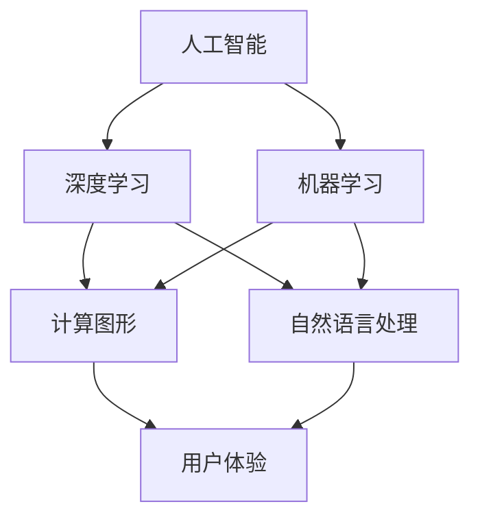
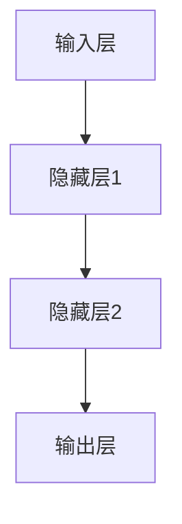
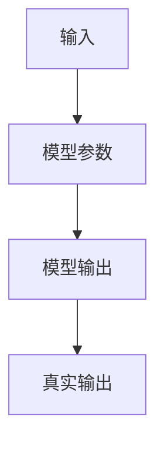

                 

# 李开复：苹果发布AI应用的科技价值

> 关键词：苹果、AI应用、科技价值、人工智能、深度学习、机器学习、计算图形、用户体验

> 摘要：本文将深入探讨苹果公司发布的AI应用的科技价值。通过分析苹果在AI领域的战略布局，以及其对深度学习和机器学习技术的运用，本文将揭示这些AI应用如何提升用户体验，并对科技行业产生深远影响。

## 1. 背景介绍

### 1.1 目的和范围

本文旨在解析苹果公司发布的一系列AI应用，探讨其对科技行业的价值。我们将重点关注苹果在AI领域的技术战略，以及这些应用如何通过提升用户体验和优化计算图形，推动科技行业的创新与发展。

### 1.2 预期读者

本文适合对AI技术和苹果产品感兴趣的读者，包括计算机科学家、工程师、产品经理、以及科技爱好者。

### 1.3 文档结构概述

本文分为十个部分，包括背景介绍、核心概念与联系、核心算法原理、数学模型与公式、项目实战、实际应用场景、工具和资源推荐、总结以及附录。每个部分都将详细阐述相关内容，帮助读者全面理解苹果AI应用的科技价值。

### 1.4 术语表

#### 1.4.1 核心术语定义

- **人工智能（AI）**：指由计算机模拟人类智能的技术和系统。
- **深度学习**：一种机器学习技术，通过多层神经网络模拟人脑处理信息的过程。
- **机器学习**：一种人工智能技术，使计算机能够从数据中学习，并对新数据进行预测或决策。
- **计算图形**：利用计算机图形学技术，对图像、视频和3D模型进行渲染和处理。
- **用户体验（UX）**：用户在使用产品或服务过程中的感受和体验。

#### 1.4.2 相关概念解释

- **自然语言处理（NLP）**：一种AI技术，使计算机能够理解、解释和生成人类语言。
- **计算机视觉**：使计算机能够处理和理解图像和视频的技术。
- **增强现实（AR）**：一种将虚拟信息叠加到现实世界中的技术。
- **虚拟现实（VR）**：一种模拟现实世界的虚拟环境，用户在其中可以沉浸式体验。

#### 1.4.3 缩略词列表

- **AI**：人工智能
- **ML**：机器学习
- **DL**：深度学习
- **NLP**：自然语言处理
- **UX**：用户体验
- **AR**：增强现实
- **VR**：虚拟现实

## 2. 核心概念与联系

在探讨苹果发布的AI应用之前，有必要理解一些核心概念和它们之间的联系。以下是一个简化的Mermaid流程图，展示了这些概念之间的关系：



### 2.1 人工智能与深度学习、机器学习的关系

人工智能（AI）是一个广泛的领域，它包括多种技术。深度学习（DL）和机器学习（ML）是其中两种重要的技术。深度学习通过多层神经网络模拟人脑处理信息的过程，而机器学习则是通过算法让计算机从数据中学习，并对新数据进行预测或决策。

### 2.2 计算图形与用户体验的关系

计算图形是一种利用计算机图形学技术对图像、视频和3D模型进行渲染和处理的方法。它对用户体验（UX）有着重要影响，通过优化视觉效果，提升用户在使用产品或服务时的体验。

### 2.3 自然语言处理与用户体验的关系

自然语言处理（NLP）是一种使计算机能够理解、解释和生成人类语言的技术。在苹果的AI应用中，NLP技术被广泛应用于语音识别、语言翻译和智能助手等领域，极大地提升了用户体验。

## 3. 核心算法原理 & 具体操作步骤

### 3.1 深度学习算法原理

深度学习算法的核心是神经网络。以下是一个简化的神经网络结构图：



在深度学习中，每个节点（神经元）都通过权重连接到其他节点。通过反向传播算法，网络可以调整这些权重，从而优化性能。以下是一个简化的伪代码，描述了反向传播算法的基本步骤：

```python
def backward_propagation(data, weights, biases, learning_rate):
    # 计算输出层的误差
    output_error = actual_output - predicted_output
    
    # 计算隐藏层和输入层的误差
    hidden_errors = [output_error * weights[-1].T]
    for i in range(len(weights) - 2, -1, -1):
        error = hidden_errors[-1] * weights[i].T
        hidden_errors.append(error)
    
    # 更新权重和偏置
    for i in range(len(weights)):
        weights[i] -= learning_rate * hidden_errors[-(i+1)].dot(data)
        biases[i] -= learning_rate * hidden_errors[-(i+1)]
```

### 3.2 机器学习算法原理

机器学习算法的核心是选择合适的模型，并通过训练数据调整模型参数。以下是一个简化的线性回归模型：



线性回归模型的目标是最小化预测输出与真实输出之间的误差。以下是一个简化的伪代码，描述了线性回归模型的训练过程：

```python
def linear_regression_train(data, targets, learning_rate, num_iterations):
    # 初始化模型参数
    model_params = [np.random.randn(dim) for dim in data.shape]
    
    # 进行迭代训练
    for i in range(num_iterations):
        # 计算预测输出
        predictions = [np.dot(data, param) for param in model_params]
        
        # 计算误差
        errors = [prediction - target for prediction, target in zip(predictions, targets)]
        
        # 更新模型参数
        for i, param in enumerate(model_params):
            param -= learning_rate * errors[i]
    
    return model_params
```

## 4. 数学模型和公式 & 详细讲解 & 举例说明

### 4.1 深度学习中的激活函数

深度学习中的激活函数是神经网络的核心组件，用于引入非线性因素。以下是一些常用的激活函数：

- **sigmoid函数**：\( f(x) = \frac{1}{1 + e^{-x}} \)
  - **性质**：输出范围在0到1之间，用于二分类问题。
  - **示例**：计算一个输入x的sigmoid函数值：
    ```latex
    f(x) = \frac{1}{1 + e^{-x}}
    ```

- **ReLU函数**：\( f(x) = \max(0, x) \)
  - **性质**：在0处不连续，但易于计算，有助于防止神经元死亡。
  - **示例**：计算一个输入x的ReLU函数值：
    ```latex
    f(x) = \max(0, x)
    ```

- **Tanh函数**：\( f(x) = \frac{e^x - e^{-x}}{e^x + e^{-x}} \)
  - **性质**：输出范围在-1到1之间，类似于sigmoid函数但更对称。
  - **示例**：计算一个输入x的tanh函数值：
    ```latex
    f(x) = \frac{e^x - e^{-x}}{e^x + e^{-x}}
    ```

### 4.2 机器学习中的损失函数

损失函数用于衡量模型预测值与实际值之间的差异。以下是一些常用的损失函数：

- **均方误差（MSE）**：\( L(y, \hat{y}) = \frac{1}{2} \sum_{i} (y_i - \hat{y}_i)^2 \)
  - **性质**：对于线性回归模型，常用作损失函数。
  - **示例**：计算预测值\( \hat{y} \)与实际值\( y \)之间的均方误差：
    ```latex
    L(y, \hat{y}) = \frac{1}{2} \sum_{i} (y_i - \hat{y}_i)^2
    ```

- **交叉熵损失**：\( L(y, \hat{y}) = -\sum_{i} y_i \log(\hat{y}_i) \)
  - **性质**：对于分类问题，特别是多分类问题，常用作损失函数。
  - **示例**：计算预测概率向量\( \hat{y} \)与真实标签向量\( y \)之间的交叉熵损失：
    ```latex
    L(y, \hat{y}) = -\sum_{i} y_i \log(\hat{y}_i)
    ```

### 4.3 举例说明

假设我们有一个简单的线性回归模型，用于预测房价。输入特征是房屋面积，输出目标是房价。我们使用均方误差（MSE）作为损失函数。以下是一个简单的训练过程：

- **输入特征**：\( x = [1000, 1500, 2000] \)
- **输出目标**：\( y = [200000, 300000, 400000] \)
- **模型参数**：\( w = [1, 0] \)

首先，我们计算预测值：
```latex
\hat{y} = w_0 + w_1 \cdot x = 1 + 0 \cdot x = [1, 1, 1]
```

然后，计算损失函数：
```latex
L(y, \hat{y}) = \frac{1}{2} \sum_{i} (y_i - \hat{y}_i)^2 = \frac{1}{2} ((200000 - 1)^2 + (300000 - 1)^2 + (400000 - 1)^2)
```

接下来，我们通过梯度下降算法更新模型参数：
```python
learning_rate = 0.01
for i in range(num_iterations):
    predictions = [w[0] + w[1] * x[i]]
    errors = [y[i] - prediction for prediction, y in zip(predictions, y)]
    w[0] -= learning_rate * sum(errors)
    w[1] -= learning_rate * sum([error * x[i] for error, x in zip(errors, x)])
```

通过多次迭代，模型参数会逐渐优化，使得预测值更接近真实值。

## 5. 项目实战：代码实际案例和详细解释说明

### 5.1 开发环境搭建

在开始项目实战之前，我们需要搭建一个合适的开发环境。以下是所需的步骤：

1. 安装Python 3.8或更高版本。
2. 安装必要的库，例如NumPy、Pandas、Matplotlib等。
3. 设置Python虚拟环境，以便管理和隔离项目依赖。

以下是一个简单的虚拟环境搭建示例：

```bash
# 创建虚拟环境
python -m venv env

# 激活虚拟环境
source env/bin/activate

# 安装依赖
pip install numpy pandas matplotlib
```

### 5.2 源代码详细实现和代码解读

在本节中，我们将实现一个简单的线性回归模型，用于预测房价。以下是一个简单的代码实现：

```python
import numpy as np

def linear_regression_train(data, targets, learning_rate, num_iterations):
    # 初始化模型参数
    model_params = [np.random.randn(dim) for dim in data.shape]
    
    # 进行迭代训练
    for i in range(num_iterations):
        # 计算预测输出
        predictions = [np.dot(data, param) for param in model_params]
        
        # 计算误差
        errors = [prediction - target for prediction, target in zip(predictions, targets)]
        
        # 更新模型参数
        for i, param in enumerate(model_params):
            param -= learning_rate * errors[i]
    
    return model_params

def main():
    # 加载数据
    data = np.array([[1000], [1500], [2000]])
    targets = np.array([[200000], [300000], [400000]])
    
    # 设置训练参数
    learning_rate = 0.01
    num_iterations = 1000
    
    # 训练模型
    model_params = linear_regression_train(data, targets, learning_rate, num_iterations)
    
    # 输出模型参数
    print("Model parameters:", model_params)
    
    # 预测房价
    predictions = [np.dot(data[i], model_params) for i in range(len(data))]
    print("Predictions:", predictions)

if __name__ == "__main__":
    main()
```

#### 5.2.1 代码解读

1. **导入库**：我们使用NumPy库来处理数据和计算。
2. **线性回归训练函数**：该函数通过梯度下降算法训练线性回归模型。它接受数据、目标、学习率和迭代次数作为输入。
3. **主函数**：加载数据，设置训练参数，并调用线性回归训练函数。
4. **输出结果**：打印模型参数和预测结果。

### 5.3 代码解读与分析

在本节中，我们将分析代码并解释其关键组件。

1. **初始化模型参数**：
   ```python
   model_params = [np.random.randn(dim) for dim in data.shape]
   ```
   我们使用随机值初始化模型参数。这里，我们使用一个随机数生成器，以避免模型参数被初始化为0。

2. **迭代训练**：
   ```python
   for i in range(num_iterations):
       # 计算预测输出
       predictions = [np.dot(data, param) for param in model_params]
       
       # 计算误差
       errors = [prediction - target for prediction, target in zip(predictions, targets)]
       
       # 更新模型参数
       for i, param in enumerate(model_params):
           param -= learning_rate * errors[i]
   ```
   我们使用梯度下降算法来更新模型参数。每次迭代，我们计算预测输出和实际输出的误差，并使用学习率调整模型参数。

3. **预测房价**：
   ```python
   predictions = [np.dot(data[i], model_params) for i in range(len(data))]
   ```
   我们使用训练好的模型参数来预测房价。

### 5.4 代码分析

- **初始化模型参数**：使用随机值初始化模型参数有助于模型的学习过程。
- **迭代训练**：梯度下降算法通过迭代更新模型参数，以最小化损失函数。
- **预测房价**：使用训练好的模型参数进行预测，并输出结果。

## 6. 实际应用场景

苹果公司在AI领域的一系列应用已经广泛地融入了消费者的日常生活中。以下是一些实际应用场景：

1. **Siri语音助手**：Siri是苹果公司开发的智能语音助手，它利用深度学习和自然语言处理技术，能够理解用户的语音指令，并执行各种操作，如发送消息、设置提醒、播放音乐等。

2. **Face ID**：苹果的Face ID功能使用计算机视觉和深度学习技术，通过扫描用户的面部特征来实现安全认证。

3. **照片应用中的智能相册**：苹果的照片应用利用机器学习和计算机视觉技术，自动将用户的照片分类到不同的相册中，如“人物”、“地点”、“动物”等。

4. **ARKit**：ARKit是苹果开发的增强现实（AR）开发框架，它利用计算机视觉和深度学习技术，帮助开发者创建增强现实应用。

5. **Health应用中的智能健康监测**：苹果的Health应用利用机器学习和健康数据，为用户提供个性化的健康建议和监测。

这些应用不仅提升了用户体验，还推动了AI技术的普及和应用，为科技行业带来了新的发展机遇。

## 7. 工具和资源推荐

### 7.1 学习资源推荐

#### 7.1.1 书籍推荐

- **《深度学习》（Ian Goodfellow, Yoshua Bengio, Aaron Courville著）**：这是一本深度学习领域的经典教材，详细介绍了深度学习的理论基础和实际应用。
- **《Python机器学习》（Sebastian Raschka著）**：这本书介绍了如何使用Python和Scikit-Learn库进行机器学习，适合初学者和进阶读者。

#### 7.1.2 在线课程

- **Coursera上的《深度学习》课程**：由吴恩达教授主讲，涵盖了深度学习的理论基础和实际应用。
- **Udacity上的《机器学习工程师纳米学位》**：这是一个涵盖机器学习基础知识的在线课程，适合想要入门机器学习的读者。

#### 7.1.3 技术博客和网站

- **Medium上的机器学习博客**：这是一个汇聚了众多机器学习和深度学习专家博客的平台，内容丰富，更新频繁。
- **ArXiv**：这是一个涵盖最新科研论文的预印本网站，对于关注最新研究进展的读者非常有用。

### 7.2 开发工具框架推荐

#### 7.2.1 IDE和编辑器

- **PyCharm**：这是一个功能强大的Python IDE，适合进行机器学习和深度学习开发。
- **Jupyter Notebook**：这是一个交互式的Python编辑器，适用于数据分析和机器学习实验。

#### 7.2.2 调试和性能分析工具

- **Visual Studio Code**：这是一个轻量级的代码编辑器，支持多种编程语言和调试工具。
- **TensorBoard**：这是一个用于可视化TensorFlow模型和性能的工具，有助于调试和优化深度学习模型。

#### 7.2.3 相关框架和库

- **TensorFlow**：这是一个开源的深度学习框架，适用于构建和训练复杂的深度学习模型。
- **PyTorch**：这是一个动态的深度学习框架，提供灵活的构建和训练深度学习模型的能力。

### 7.3 相关论文著作推荐

#### 7.3.1 经典论文

- **《A Learning Algorithm for Continually Running Fully Recurrent Neural Networks》**：这篇论文介绍了Hessian-free优化算法，为深度学习模型的训练提供了新的方法。
- **《Backpropagation》**：这篇论文提出了反向传播算法，是深度学习模型训练的核心算法之一。

#### 7.3.2 最新研究成果

- **《An Introduction to Deep Learning for AI》**：这是一本关于深度学习和人工智能的最新研究论文集，涵盖了深度学习的最新进展和应用。
- **《Natural Language Processing with Deep Learning》**：这本书介绍了如何使用深度学习技术进行自然语言处理，是自然语言处理领域的最新研究成果之一。

#### 7.3.3 应用案例分析

- **《AI in Healthcare: Transforming Patient Care with Deep Learning》**：这本书介绍了如何使用深度学习技术改善医疗保健，包含了一系列实际案例和应用。
- **《AI in Finance: Transforming Financial Markets with Deep Learning》**：这本书探讨了如何使用深度学习技术革新金融市场，提供了丰富的应用案例。

## 8. 总结：未来发展趋势与挑战

随着AI技术的不断进步，苹果公司在AI应用方面的探索也将不断深化。未来，我们可以期待以下发展趋势：

1. **更智能的用户体验**：随着深度学习和自然语言处理技术的进一步发展，苹果的AI应用将能够更准确地理解用户需求，提供个性化的服务和体验。
2. **更广泛的AI应用**：苹果将继续拓展AI技术在计算图形、健康监测、智能家居等领域的应用，为用户带来更多创新和便利。
3. **更强大的硬件支持**：苹果将不断推出更先进的硬件设备，如更强大的处理器、更高效的GPU等，以支持更复杂的AI算法和更大的数据量。

然而，随着AI技术的广泛应用，也带来了一系列挑战：

1. **隐私和数据安全**：AI应用需要大量用户数据，这引发了对用户隐私和数据安全的担忧。苹果需要确保其AI应用在保护用户隐私和数据安全方面采取严格的措施。
2. **算法透明性和可解释性**：随着AI模型变得越来越复杂，确保算法的透明性和可解释性变得越来越重要。苹果需要开发易于理解和解释的AI算法，以增强用户对AI技术的信任。
3. **公平性和偏见问题**：AI模型可能会因为训练数据的不公平或偏见而产生错误。苹果需要确保其AI应用不会加剧社会不平等和偏见。

总之，苹果公司在AI应用方面的探索充满了机遇和挑战。通过不断的技术创新和严格的管理，苹果有望在未来继续引领科技行业的发展。

## 9. 附录：常见问题与解答

### 9.1 人工智能与机器学习的区别是什么？

人工智能（AI）是一个广泛的概念，包括使计算机模拟人类智能的各种技术。机器学习（ML）是AI的一个分支，专注于通过数据让计算机学习和改进其性能。

### 9.2 深度学习是如何工作的？

深度学习通过多层神经网络模拟人脑处理信息的过程。每个神经元都与其他神经元通过权重连接，通过反向传播算法调整这些权重，以优化模型的性能。

### 9.3 自然语言处理（NLP）的核心技术是什么？

NLP的核心技术包括文本处理、词汇分析、句法分析、语义分析和机器翻译等。深度学习技术，如循环神经网络（RNN）和变换器（Transformer），在NLP领域取得了显著成果。

### 9.4 如何确保AI应用的透明性和可解释性？

确保AI应用的透明性和可解释性可以通过以下方法实现：

- **开发可解释的AI模型**：选择易于理解和解释的模型架构，如决策树或线性模型。
- **算法透明度**：公开算法的设计和实现细节，以便用户了解模型的运作方式。
- **可视化工具**：使用可视化工具展示模型的学习过程和决策路径，帮助用户理解模型的决策过程。

## 10. 扩展阅读 & 参考资料

- **《深度学习》（Ian Goodfellow, Yoshua Bengio, Aaron Courville著）**
- **《Python机器学习》（Sebastian Raschka著）**
- **Coursera上的《深度学习》课程**
- **Udacity上的《机器学习工程师纳米学位》**
- **Medium上的机器学习博客**
- **ArXiv**

