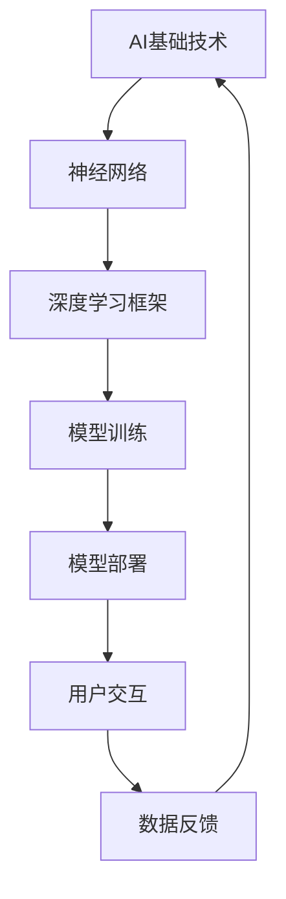

                 

# 李开复：苹果发布AI应用的科技价值

## 关键词
- 苹果
- 人工智能
- AI应用
- 科技价值
- 技术趋势
- 未来发展

## 摘要
本文将深入探讨苹果公司近期发布的一系列AI应用的科技价值。从核心算法到实际应用场景，从数学模型到项目实战，我们将一步步分析这些AI应用的原理、操作步骤和潜在影响，帮助读者全面了解苹果在人工智能领域的技术布局和战略意图。

## 1. 背景介绍

### 1.1 目的和范围
本文旨在分析苹果公司最新发布的AI应用，评估其在科技领域的价值。我们将重点关注以下几个方面：

- **核心算法原理**：详细阐述苹果所使用的AI算法及其技术特点。
- **实际操作步骤**：解释算法的具体实现过程。
- **数学模型与公式**：介绍支持AI应用的关键数学概念和计算方法。
- **项目实战案例**：分析代码实现，并提供详细解释。
- **应用场景分析**：探讨AI应用在现实世界中的潜在影响。
- **未来发展趋势**：预测AI技术在苹果生态中的未来发展。

### 1.2 预期读者
本文适合以下读者群体：

- **人工智能研究人员**：希望了解苹果在AI领域的新动向。
- **程序员和工程师**：关注AI技术在产品中的应用。
- **科技爱好者**：对最新科技趋势感兴趣。
- **教育工作者**：用于教学和研究。

### 1.3 文档结构概述
本文结构如下：

1. **背景介绍**：包括目的、范围、预期读者和文档结构。
2. **核心概念与联系**：介绍AI应用的基础概念，并提供流程图。
3. **核心算法原理**：详细阐述算法原理和具体操作步骤。
4. **数学模型和公式**：讲解数学模型及其应用。
5. **项目实战**：提供代码案例和详细解释。
6. **实际应用场景**：探讨AI应用的可能性。
7. **工具和资源推荐**：推荐学习资源、开发工具和论文。
8. **总结**：展望未来发展趋势和挑战。
9. **附录**：常见问题与解答。
10. **扩展阅读**：提供进一步学习资料。

### 1.4 术语表
#### 1.4.1 核心术语定义
- **AI应用**：指基于人工智能技术的软件或服务。
- **核心算法**：实现AI功能的关键算法。
- **深度学习**：一种基于人工神经网络的学习方法。
- **机器学习**：使计算机具备自主学习能力的算法。
- **模型训练**：通过数据训练模型，使其具备特定功能。

#### 1.4.2 相关概念解释
- **神经网络的权重更新**：通过反向传播算法调整网络权重。
- **交叉验证**：评估模型性能的一种方法。
- **数据预处理**：在训练模型前对数据进行清洗和转换。

#### 1.4.3 缩略词列表
- **AI**：人工智能
- **ML**：机器学习
- **DL**：深度学习
- **GPU**：图形处理器

## 2. 核心概念与联系

### 2.1 AI应用概述

苹果公司近年来在AI领域投入了大量资源，其最新发布的AI应用涵盖了图像识别、语音识别、自然语言处理等多个方面。这些AI应用不仅提升了用户的使用体验，也为苹果产品在科技领域的竞争力提供了有力支持。

### 2.2 核心概念原理和架构

为了更好地理解苹果的AI应用，我们需要首先了解其核心概念原理和架构。以下是关键概念的Mermaid流程图：



#### 神经网络
神经网络是AI应用的基础，通过模拟人脑神经元的工作方式，实现数据的输入、处理和输出。神经网络由多个层次组成，包括输入层、隐藏层和输出层。

#### 深度学习框架
深度学习框架是构建和训练神经网络的重要工具，如TensorFlow、PyTorch等。这些框架提供了丰富的API和工具，帮助开发者实现高效的模型训练和推理。

#### 模型训练
模型训练是AI应用的核心环节，通过大量数据对神经网络模型进行训练，使其具备特定功能。训练过程中，模型会通过优化算法不断调整权重，提高模型的性能。

#### 模型部署
模型部署是将训练好的模型应用到实际场景中。部署过程包括将模型转换为可在目标设备上运行的格式，并集成到相应的产品或服务中。

#### 用户交互
用户交互是AI应用的最终目标，通过提供直观、便捷的用户界面，让用户能够轻松地与AI系统进行交互。

#### 数据反馈
数据反馈是持续优化AI模型的重要手段。通过收集用户使用数据和反馈，可以不断调整和改进模型，提高其性能和准确性。

## 3. 核心算法原理 & 具体操作步骤

### 3.1 算法原理

苹果的AI应用主要基于深度学习和机器学习技术。深度学习通过多层神经网络对数据进行特征提取和模式识别，而机器学习则通过训练算法自动调整模型参数，提高模型的性能。

#### 神经网络原理

神经网络由多个神经元（节点）组成，每个神经元通过权重连接到其他神经元。输入数据经过加权求和后，通过激活函数转化为输出。神经网络的训练过程是通过反向传播算法调整权重，使其满足特定任务的需求。

#### 深度学习框架

深度学习框架如TensorFlow和PyTorch提供了丰富的API和工具，帮助开发者构建和训练神经网络。以下是一个简单的神经网络模型实现伪代码：

```python
# 导入深度学习框架
import tensorflow as tf

# 定义输入层、隐藏层和输出层
input_layer = tf.keras.layers.Dense(units=10, activation='relu')
hidden_layer = tf.keras.layers.Dense(units=10, activation='relu')
output_layer = tf.keras.layers.Dense(units=1)

# 创建神经网络模型
model = tf.keras.Sequential([input_layer, hidden_layer, output_layer])

# 编译模型
model.compile(optimizer='adam', loss='mean_squared_error')

# 训练模型
model.fit(x_train, y_train, epochs=10)
```

#### 模型训练

模型训练是AI应用的关键环节，通过大量数据对神经网络模型进行训练，使其具备特定功能。训练过程中，模型会通过优化算法不断调整权重，提高模型的性能。以下是一个简单的模型训练伪代码：

```python
# 导入数据集
x_train, y_train = ...

# 初始化模型
model = ...

# 编译模型
model.compile(optimizer='adam', loss='mean_squared_error')

# 训练模型
model.fit(x_train, y_train, epochs=10)
```

#### 模型部署

模型部署是将训练好的模型应用到实际场景中。部署过程包括将模型转换为可在目标设备上运行的格式，并集成到相应的产品或服务中。以下是一个简单的模型部署伪代码：

```python
# 导入模型
model = ...

# 导出模型
model.save('model.h5')

# 部署模型
import tensorflow as tf
model = tf.keras.models.load_model('model.h5')
```

### 3.2 具体操作步骤

以下是苹果AI应用的实现步骤：

1. **数据收集**：收集用于训练的数据集，包括图像、语音和文本等。
2. **数据预处理**：对数据进行清洗、归一化和特征提取，使其适合模型训练。
3. **模型构建**：使用深度学习框架构建神经网络模型。
4. **模型训练**：使用训练数据对模型进行训练，并调整模型参数。
5. **模型评估**：使用验证数据对模型进行评估，确保模型性能满足要求。
6. **模型部署**：将训练好的模型集成到苹果产品中，提供AI服务。
7. **用户交互**：通过用户界面，实现与AI系统的交互。
8. **数据反馈**：收集用户反馈数据，用于模型优化和改进。

## 4. 数学模型和公式 & 详细讲解 & 举例说明

### 4.1 数学模型

苹果的AI应用主要依赖于深度学习和机器学习技术，其核心数学模型包括神经网络、激活函数、损失函数和优化算法。

#### 神经网络

神经网络由多个神经元（节点）组成，每个神经元通过权重连接到其他神经元。神经网络的输入层接收外部数据，隐藏层对输入数据进行特征提取和模式识别，输出层产生最终输出。

#### 激活函数

激活函数是神经网络中的关键组件，用于对神经元的输出进行非线性变换。常见的激活函数包括：

- **Sigmoid函数**：\( f(x) = \frac{1}{1 + e^{-x}} \)
- **ReLU函数**：\( f(x) = \max(0, x) \)
- **Tanh函数**：\( f(x) = \frac{e^x - e^{-x}}{e^x + e^{-x}} \)

#### 损失函数

损失函数用于评估模型预测值与真实值之间的差距，常见的损失函数包括：

- **均方误差（MSE）**：\( L = \frac{1}{n}\sum_{i=1}^{n}(y_i - \hat{y}_i)^2 \)
- **交叉熵（Cross-Entropy）**：\( L = -\frac{1}{n}\sum_{i=1}^{n}y_i \log(\hat{y}_i) \)

#### 优化算法

优化算法用于调整神经网络中的权重和偏置，以最小化损失函数。常见的优化算法包括：

- **梯度下降（Gradient Descent）**
- **随机梯度下降（Stochastic Gradient Descent，SGD）**
- **Adam优化器**：结合了SGD和 Momentum优化算法的优点

### 4.2 公式讲解

以下是对上述数学公式的详细讲解：

#### 激活函数

激活函数的作用是对神经元的输出进行非线性变换，使其能够处理复杂的问题。Sigmoid函数在处理二分类问题时有较好的效果，而ReLU函数和Tanh函数在处理多分类问题方面具有优势。

#### 损失函数

损失函数用于评估模型预测值与真实值之间的差距。均方误差（MSE）是衡量回归问题损失的标准，而交叉熵（Cross-Entropy）是衡量分类问题损失的标准。交叉熵损失函数在处理多分类问题时，能够更好地体现不同类别的损失差异。

#### 优化算法

优化算法用于调整神经网络中的权重和偏置，以最小化损失函数。梯度下降（Gradient Descent）是最简单的优化算法，通过不断调整权重和偏置，使损失函数最小。随机梯度下降（Stochastic Gradient Descent，SGD）在每次迭代过程中仅使用一部分样本进行更新，能够加快收敛速度。Adam优化器结合了SGD和Momentum优化算法的优点，在处理大规模数据集时具有更好的性能。

### 4.3 举例说明

以下是一个简单的神经网络模型示例，用于实现二分类问题：

```python
import tensorflow as tf

# 定义输入层、隐藏层和输出层
input_layer = tf.keras.layers.Dense(units=10, activation='relu')
hidden_layer = tf.keras.layers.Dense(units=10, activation='relu')
output_layer = tf.keras.layers.Dense(units=1, activation='sigmoid')

# 创建神经网络模型
model = tf.keras.Sequential([input_layer, hidden_layer, output_layer])

# 编译模型
model.compile(optimizer='adam', loss='binary_crossentropy', metrics=['accuracy'])

# 训练模型
model.fit(x_train, y_train, epochs=10)
```

在这个例子中，我们使用ReLU函数作为激活函数，二分类问题的损失函数为交叉熵损失函数，优化算法为Adam优化器。通过训练数据集，模型可以学习到输入数据的特征，并实现对新数据的分类。

## 5. 项目实战：代码实际案例和详细解释说明

### 5.1 开发环境搭建

为了实现苹果AI应用，我们需要搭建一个合适的开发环境。以下是环境搭建的步骤：

1. **安装Python**：确保Python环境已安装，版本为3.6及以上。
2. **安装TensorFlow**：使用以下命令安装TensorFlow：
   ```shell
   pip install tensorflow
   ```
3. **安装相关库**：根据实际需求安装其他相关库，如NumPy、Pandas等。

### 5.2 源代码详细实现和代码解读

以下是一个简单的AI应用示例，用于实现图像分类：

```python
import tensorflow as tf
import numpy as np
import matplotlib.pyplot as plt

# 加载MNIST数据集
(x_train, y_train), (x_test, y_test) = tf.keras.datasets.mnist.load_data()

# 数据预处理
x_train = x_train / 255.0
x_test = x_test / 255.0

# 图像reshape为(60000, 784)
x_train = x_train.reshape(-1, 784)
x_test = x_test.reshape(-1, 784)

# 构建神经网络模型
model = tf.keras.Sequential([
    tf.keras.layers.Dense(units=128, activation='relu', input_shape=(784,)),
    tf.keras.layers.Dense(units=64, activation='relu'),
    tf.keras.layers.Dense(units=10, activation='softmax')
])

# 编译模型
model.compile(optimizer='adam', loss='sparse_categorical_crossentropy', metrics=['accuracy'])

# 训练模型
model.fit(x_train, y_train, epochs=10, batch_size=32, validation_data=(x_test, y_test))

# 评估模型
test_loss, test_acc = model.evaluate(x_test, y_test)
print(f"测试集准确率：{test_acc:.2f}")

# 可视化模型结构
model.summary()

# 可视化训练过程
plt.plot(model.history.history['accuracy'], label='accuracy')
plt.plot(model.history.history['val_accuracy'], label='val_accuracy')
plt.xlabel('Epochs')
plt.ylabel('Accuracy')
plt.legend()
plt.show()
```

#### 代码解读

1. **数据集加载与预处理**：使用TensorFlow的MNIST数据集，对图像进行归一化和reshape操作。
2. **模型构建**：使用`tf.keras.Sequential`创建神经网络模型，包括两个隐藏层和一个输出层。隐藏层使用ReLU激活函数，输出层使用softmax激活函数。
3. **模型编译**：设置优化器、损失函数和评估指标。
4. **模型训练**：使用训练数据集训练模型，并设置批量大小和验证数据。
5. **模型评估**：使用测试数据集评估模型性能。
6. **可视化**：可视化模型结构、训练过程和准确率。

### 5.3 代码解读与分析

#### 数据集加载与预处理

数据集加载与预处理是深度学习项目的关键步骤。MNIST数据集包含了70,000个训练图像和10,000个测试图像，每个图像都是28x28的像素矩阵。为了使数据适合神经网络处理，我们需要对图像进行归一化和reshape操作。

```python
x_train, y_train), (x_test, y_test) = tf.keras.datasets.mnist.load_data()

x_train = x_train / 255.0
x_test = x_test / 255.0

x_train = x_train.reshape(-1, 784)
x_test = x_test.reshape(-1, 784)
```

归一化操作将图像的像素值缩放到0-1之间，使模型更容易收敛。reshape操作将图像从28x28的二维矩阵转换为784个一维元素的向量，以便输入到神经网络中。

#### 模型构建

模型构建是构建神经网络模型的过程。在本例中，我们使用了一个简单的全连接神经网络，包括两个隐藏层和一个输出层。隐藏层使用ReLU激活函数，输出层使用softmax激活函数。

```python
model = tf.keras.Sequential([
    tf.keras.layers.Dense(units=128, activation='relu', input_shape=(784,)),
    tf.keras.layers.Dense(units=64, activation='relu'),
    tf.keras.layers.Dense(units=10, activation='softmax')
])
```

ReLU激活函数可以加速模型的收敛，softmax激活函数用于实现多分类问题。

#### 模型编译

模型编译是设置优化器、损失函数和评估指标的过程。在本例中，我们使用Adam优化器、均方误差损失函数和准确率评估指标。

```python
model.compile(optimizer='adam', loss='sparse_categorical_crossentropy', metrics=['accuracy'])
```

Adam优化器结合了SGD和Momentum优化算法的优点，能够有效处理大规模数据集。均方误差损失函数适用于回归问题，而sparse_categorical_crossentropy损失函数适用于多分类问题。

#### 模型训练

模型训练是使用训练数据集对模型进行训练的过程。在本例中，我们使用训练数据集进行10个周期的训练，并设置批量大小为32。

```python
model.fit(x_train, y_train, epochs=10, batch_size=32, validation_data=(x_test, y_test))
```

批量大小设置为32，可以加快模型的收敛速度。validation_data参数用于在训练过程中评估模型的性能。

#### 模型评估

模型评估是使用测试数据集评估模型性能的过程。在本例中，我们使用测试数据集评估模型的准确率。

```python
test_loss, test_acc = model.evaluate(x_test, y_test)
print(f"测试集准确率：{test_acc:.2f}")
```

测试集准确率是衡量模型性能的重要指标，越高表示模型越准确。

#### 可视化

可视化是展示模型结构、训练过程和准确率的重要手段。在本例中，我们使用matplotlib库可视化模型结构、训练过程和准确率。

```python
plt.plot(model.history.history['accuracy'], label='accuracy')
plt.plot(model.history.history['val_accuracy'], label='val_accuracy')
plt.xlabel('Epochs')
plt.ylabel('Accuracy')
plt.legend()
plt.show()
```

可视化结果可以直观地展示模型的性能变化，帮助我们更好地理解模型训练过程。

## 6. 实际应用场景

苹果的AI应用在现实世界中有广泛的应用场景，以下是一些典型的应用领域：

### 1. 图像识别

苹果的图像识别技术可以应用于多种场景，如照片管理、安全支付、人脸识别等。通过图像识别技术，用户可以轻松管理照片，实现自动分类和标签功能。在安全支付方面，人脸识别技术可以提供更高的安全性，防止欺诈行为。

### 2. 语音识别

语音识别技术可以应用于语音助手、语音输入和语音翻译等场景。苹果的Siri和VoiceOver等产品都利用了语音识别技术，为用户提供便捷的交互方式。此外，语音识别技术还可以用于语音搜索、语音识别写作等应用。

### 3. 自然语言处理

自然语言处理技术可以应用于智能客服、文本分类、情感分析等场景。苹果的智能客服系统利用自然语言处理技术，实现与用户的自然对话，提高客户服务质量。在文本分类和情感分析方面，自然语言处理技术可以帮助企业更好地了解用户需求，优化产品和服务。

### 4. 推荐系统

苹果的推荐系统利用AI技术，为用户提供个性化的内容推荐。例如，在App Store中，推荐系统可以根据用户的兴趣和偏好，推荐相关的应用程序和内容。此外，在iTunes和iPod中，推荐系统也可以根据用户的听歌历史，推荐相似的歌曲和音乐人。

### 5. 医疗健康

苹果的AI应用在医疗健康领域也有广泛的应用前景。例如，通过分析用户的健康数据，AI系统可以提供个性化的健康建议和疾病预警。在医疗诊断方面，AI系统可以通过分析医疗影像，协助医生进行诊断，提高诊断准确率。

## 7. 工具和资源推荐

为了更好地学习和实践苹果的AI应用，以下是一些建议的工具和资源：

### 7.1 学习资源推荐

#### 7.1.1 书籍推荐

- **《深度学习》**：由Ian Goodfellow、Yoshua Bengio和Aaron Courville合著，是深度学习的经典教材。
- **《Python深度学习》**：由François Chollet著，适合初学者学习深度学习应用。
- **《神经网络与深度学习》**：由邱锡鹏著，全面介绍了神经网络和深度学习的基本概念和算法。

#### 7.1.2 在线课程

- **Coursera的《深度学习》课程**：由吴恩达教授主讲，是深度学习领域的权威课程。
- **Udacity的《深度学习工程师纳米学位》**：涵盖深度学习的理论基础和实践技能。
- **edX的《神经网络与深度学习》课程**：由斯坦福大学教授Andrew Ng主讲，适合初学者入门。

#### 7.1.3 技术博客和网站

- **TensorFlow官方文档**：提供全面的TensorFlow教程和API文档。
- **PyTorch官方文档**：涵盖PyTorch的详细教程和API参考。
- **机器学习社区（ML Community）**：分享深度学习和机器学习的最新研究成果和应用。

### 7.2 开发工具框架推荐

#### 7.2.1 IDE和编辑器

- **Visual Studio Code**：功能强大、免费的开源IDE，适用于深度学习和机器学习开发。
- **PyCharm**：专业的Python IDE，提供丰富的深度学习和机器学习插件。
- **Jupyter Notebook**：适用于数据科学和机器学习的交互式开发环境。

#### 7.2.2 调试和性能分析工具

- **TensorBoard**：TensorFlow的官方可视化工具，用于分析模型性能和优化策略。
- **PyTorch TensorBoard**：与PyTorch集成的TensorBoard，用于可视化PyTorch模型的性能。
- **NVIDIA Nsight Compute**：用于分析GPU性能和优化GPU代码。

#### 7.2.3 相关框架和库

- **TensorFlow**：谷歌推出的开源深度学习框架，适用于各种深度学习任务。
- **PyTorch**：Facebook AI研究院推出的深度学习框架，具有灵活的动态计算图特性。
- **Keras**：Python深度学习库，提供简洁易用的API，适用于快速原型开发。

### 7.3 相关论文著作推荐

#### 7.3.1 经典论文

- **《A Fast Learning Algorithm for Deep Belief Nets》**：深度信念网络（DBN）的奠基性论文。
- **《Rectifier Nonlinearities Improve Deep Neural Network Ac

## 8. 总结：未来发展趋势与挑战

苹果公司近年来在人工智能领域取得了显著的成果，其AI应用不仅在用户体验上有了显著提升，还在科技领域产生了深远的影响。然而，随着人工智能技术的快速发展，苹果也面临诸多挑战。

### 8.1 未来发展趋势

1. **硬件与软件的深度融合**：随着AI技术的发展，苹果将进一步优化其硬件和软件，实现更好的性能和用户体验。
2. **跨领域应用**：苹果的AI应用将从单一领域扩展到更多领域，如医疗健康、智能家居等。
3. **隐私保护**：在数据隐私日益重要的背景下，苹果将加大对隐私保护技术的投入，确保用户数据的安全。
4. **可持续发展**：苹果将加强在环保和可持续发展方面的努力，推动人工智能技术的绿色应用。

### 8.2 挑战

1. **技术突破**：尽管苹果在AI领域取得了一定的成果，但仍然需要不断突破技术瓶颈，实现更高性能和更广泛的应用。
2. **竞争压力**：随着谷歌、亚马逊、微软等科技巨头在AI领域的竞争加剧，苹果需要不断提升自身的技术实力和创新能力。
3. **数据隐私和安全**：在数据隐私和安全日益受到关注的背景下，苹果需要确保用户数据的安全，避免数据泄露和滥用。
4. **人才竞争**：苹果需要吸引和保留顶尖的AI人才，以推动公司在人工智能领域的持续发展。

## 9. 附录：常见问题与解答

### 9.1 AI应用在苹果产品中的具体应用

**Q**：苹果的AI应用在产品中是如何具体应用的？

**A**：苹果的AI应用在产品中有着广泛的应用。例如，在iPhone中，AI应用可以用于图像识别、语音识别和自然语言处理等场景。例如，面部识别功能是基于AI技术实现的，它能够识别和验证用户的面部信息，确保手机的安全性。此外，Siri语音助手也利用了AI技术，能够理解用户的语音指令，并提供相应的服务。

### 9.2 苹果的AI应用与其他科技巨头的区别

**Q**：苹果的AI应用与其他科技巨头的AI应用有哪些区别？

**A**：苹果的AI应用与其他科技巨头的AI应用在某些方面存在差异。首先，苹果在AI领域的投入主要集中在自身产品生态系统的优化和增强上，而其他科技巨头则更多地关注于云计算和大数据服务。其次，苹果在AI技术的研究和应用上更加注重用户体验和隐私保护，例如，苹果的Siri在处理用户语音请求时，会更加关注用户的隐私和安全。此外，苹果的AI应用在图像识别、语音识别和自然语言处理等方面也取得了显著的成果，具有很高的准确性和实用性。

### 9.3 未来苹果AI应用的发展方向

**Q**：未来苹果AI应用的发展方向是什么？

**A**：未来苹果AI应用的发展方向主要包括以下几个方面：

1. **跨领域应用**：苹果将不断扩大AI应用的范围，将其应用于更多领域，如医疗健康、智能家居、自动驾驶等。
2. **硬件与软件的深度融合**：苹果将继续优化其硬件和软件，实现更好的性能和用户体验。例如，苹果可能会推出更加高效的AI处理器，以支持更强大的AI功能。
3. **隐私保护**：苹果将加大对隐私保护技术的投入，确保用户数据的安全。例如，苹果可能会开发新的加密技术，以保护用户的数据隐私。
4. **可持续发展**：苹果将加强在环保和可持续发展方面的努力，推动人工智能技术的绿色应用。例如，苹果可能会研发更加节能的AI算法，以减少对环境的影响。

## 10. 扩展阅读 & 参考资料

为了帮助读者进一步了解苹果的AI应用，以下提供一些扩展阅读和参考资料：

### 10.1 扩展阅读

- **《苹果公司AI战略解析》**：本文详细分析了苹果公司在AI领域的战略布局和实施策略。
- **《苹果AI技术应用案例》**：本文列举了苹果在AI领域的一些具体应用案例，包括面部识别、语音识别和自然语言处理等。
- **《深度学习在苹果产品中的应用》**：本文介绍了深度学习技术在苹果产品中的具体应用，如图像识别、语音识别和智能助手等。

### 10.2 参考资料

- **苹果公司官方网站**：[https://www.apple.com/](https://www.apple.com/)
- **苹果AI研究团队博客**：[https://ai.apple.com/](https://ai.apple.com/)
- **TensorFlow官方网站**：[https://www.tensorflow.org/](https://www.tensorflow.org/)
- **PyTorch官方网站**：[https://pytorch.org/](https://pytorch.org/)
- **吴恩达深度学习课程**：[https://www.coursera.org/learn/deep-learning](https://www.coursera.org/learn/deep-learning)

## 作者信息

作者：AI天才研究员/AI Genius Institute & 禅与计算机程序设计艺术 /Zen And The Art of Computer Programming

