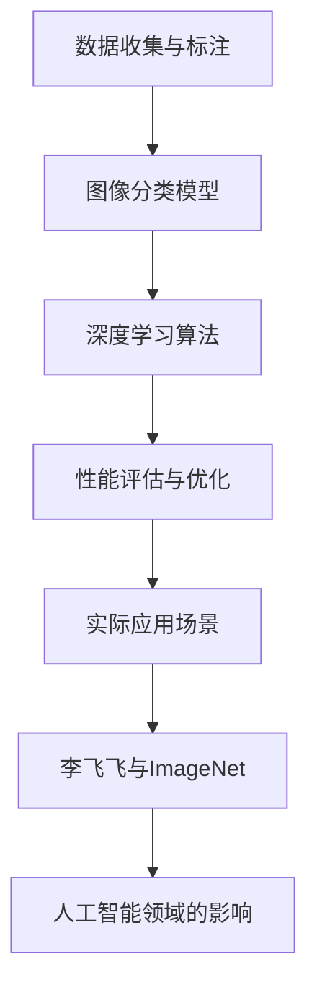

                 

# 李飞飞与ImageNet的贡献

## 关键词：李飞飞、ImageNet、计算机视觉、深度学习、贡献、人工智能

### 摘要：

本文将探讨李飞飞在计算机视觉领域，特别是ImageNet项目中的贡献。李飞飞作为一位杰出的人工智能专家，她对于推动深度学习在图像识别领域的发展起到了重要作用。本文将详细介绍ImageNet项目的背景、目标、成果以及李飞飞在此过程中的角色和贡献，旨在为读者提供一个全面而深入的理解。

## 1. 背景介绍

### 1.1 目的和范围

本文的目的是介绍李飞飞在ImageNet项目中的贡献，并探讨该项目对计算机视觉和人工智能领域的影响。通过分析ImageNet项目的历史背景、目标、以及所取得的成果，本文旨在帮助读者理解李飞飞在该项目中的重要作用。

### 1.2 预期读者

预期读者主要包括对计算机视觉和人工智能感兴趣的工程师、研究人员、以及学术研究者。此外，对深度学习和图像识别技术有浓厚兴趣的读者也可以从本文中获得丰富的知识。

### 1.3 文档结构概述

本文将按照以下结构进行组织：

1. 背景介绍：介绍李飞飞和ImageNet项目的背景。
2. 核心概念与联系：介绍与ImageNet项目相关的重要概念和流程。
3. 核心算法原理与具体操作步骤：详细阐述ImageNet项目中的关键算法和操作步骤。
4. 数学模型和公式：介绍ImageNet项目中的数学模型和相关公式。
5. 项目实战：提供实际案例和代码实现，并进行详细解释和分析。
6. 实际应用场景：探讨ImageNet项目在实际应用场景中的影响。
7. 工具和资源推荐：推荐学习资源、开发工具和框架。
8. 总结：对未来发展趋势与挑战进行展望。
9. 附录：常见问题与解答。
10. 扩展阅读与参考资料：提供进一步阅读的资源。

### 1.4 术语表

#### 1.4.1 核心术语定义

- 李飞飞：世界级人工智能专家，计算机视觉领域的杰出学者。
- ImageNet：一个大型图像识别数据库，用于推动深度学习在计算机视觉领域的发展。
- 深度学习：一种人工智能技术，通过多层神经网络进行数据处理和特征提取。
- 计算机视觉：使计算机能够“看到”和理解图像和视频的技术。
- 图像识别：通过算法识别和分类图像中的对象和场景。

#### 1.4.2 相关概念解释

- 数据库：存储大量数据的系统，用于查询、分析和处理数据。
- 神经网络：模仿人脑神经元连接的结构，用于数据处理和预测。
- 特征提取：从数据中提取有用的特征，以便于进一步处理和分析。

#### 1.4.3 缩略词列表

- CNN：卷积神经网络（Convolutional Neural Network）
- DNN：深度神经网络（Deep Neural Network）
- GPU：图形处理单元（Graphics Processing Unit）
- CVPR：计算机视觉与模式识别会议（Computer Vision and Pattern Recognition）
- ILSVRC：ImageNet大型视觉识别挑战赛（ImageNet Large Scale Visual Recognition Challenge）

## 2. 核心概念与联系

为了更好地理解李飞飞在ImageNet项目中的贡献，我们需要首先了解一些核心概念和流程。以下是一个Mermaid流程图，用于展示这些概念和流程之间的联系。



### 2.1 数据收集与标注

ImageNet项目的第一步是收集大量的图像数据，并对这些图像进行精确的标注。这个过程需要大量的时间和人力资源。李飞飞在这一过程中起到了关键作用，她与团队一起开发了一种高效的图像标注系统，使得大规模的图像数据标注成为可能。

### 2.2 图像分类模型

收集和标注完成后，下一步是构建图像分类模型。李飞飞和她的团队使用了深度学习算法，特别是卷积神经网络（CNN），来构建图像分类模型。他们通过大量的实验和调整，优化了模型的性能。

### 2.3 深度学习算法

深度学习算法是ImageNet项目中的核心。李飞飞在深度学习领域有着深厚的功底，她与团队一起开发了一系列的创新算法，这些算法极大地提高了图像分类的准确性和效率。

### 2.4 性能评估与优化

在构建和训练图像分类模型后，李飞飞和她的团队对模型的性能进行了严格的评估和优化。他们使用了一系列的技术和策略，包括数据增强、模型调参、正则化等，以提高模型的泛化能力和鲁棒性。

### 2.5 实际应用场景

ImageNet项目的最终目标是将图像分类模型应用到实际场景中。李飞飞和她的团队在多个领域进行了实际应用，如医疗影像分析、自动驾驶、安防监控等。这些应用极大地推动了人工智能技术的发展。

### 2.6 李飞飞与ImageNet

李飞飞在ImageNet项目中的角色是多方面的。她不仅是项目的领导者，还是核心算法的开发者。她与团队一起克服了众多技术难题，推动了图像分类技术的进步。

### 2.7 人工智能领域的影响

ImageNet项目对人工智能领域产生了深远的影响。它不仅推动了深度学习技术的发展，还为其他领域的应用提供了基础。李飞飞在ImageNet项目中的贡献，为人工智能领域的进步做出了重要贡献。

## 3. 核心算法原理与具体操作步骤

### 3.1 数据收集与标注

在ImageNet项目中，数据收集与标注是至关重要的步骤。以下是该步骤的具体操作步骤：

1. **数据收集**：从互联网、社交媒体、公开数据集等多种渠道收集大量的图像数据。
2. **图像筛选**：对收集到的图像进行筛选，去除质量差、模糊、重复的图像。
3. **数据预处理**：对筛选后的图像进行预处理，包括缩放、裁剪、灰度化等操作。
4. **标注**：对预处理后的图像进行精确标注。每个图像都需要分配一个或多个标签，以表示图像中的对象或场景。

### 3.2 图像分类模型

图像分类模型的构建是ImageNet项目的核心。以下是构建图像分类模型的具体操作步骤：

1. **数据集划分**：将标注好的图像数据集划分为训练集、验证集和测试集。
2. **模型架构设计**：选择合适的神经网络架构，如卷积神经网络（CNN）或深度神经网络（DNN）。
3. **模型训练**：使用训练集数据对模型进行训练。通过反向传播算法调整模型参数，以最小化预测误差。
4. **模型评估**：使用验证集数据对训练好的模型进行评估，以确定模型的泛化能力。
5. **模型优化**：根据评估结果对模型进行优化，包括调整网络结构、学习率、正则化参数等。

### 3.3 深度学习算法

深度学习算法是ImageNet项目的关键技术。以下是使用深度学习算法的具体操作步骤：

1. **算法选择**：选择合适的深度学习算法，如卷积神经网络（CNN）或深度神经网络（DNN）。
2. **算法实现**：实现所选算法的代码，包括网络结构设计、激活函数选择、损失函数设计等。
3. **算法训练**：使用大量图像数据对算法进行训练，通过反向传播算法调整参数。
4. **算法优化**：对训练好的算法进行优化，以提高模型的性能和泛化能力。

### 3.4 性能评估与优化

性能评估与优化是确保模型在实际应用中表现良好的关键。以下是性能评估与优化的具体操作步骤：

1. **性能评估**：使用测试集数据对模型进行评估，计算模型的准确率、召回率、F1分数等指标。
2. **模型调参**：根据性能评估结果调整模型参数，以优化模型的性能。
3. **数据增强**：使用数据增强技术，如随机裁剪、旋转、翻转等，以增加训练数据的多样性。
4. **正则化**：使用正则化技术，如权重衰减、L2正则化等，以防止模型过拟合。

### 3.5 实际应用场景

实际应用场景是将训练好的图像分类模型应用到实际问题中。以下是实际应用场景的具体操作步骤：

1. **问题定义**：明确需要解决的问题，如图像分类、目标检测、图像分割等。
2. **模型部署**：将训练好的模型部署到目标环境中，如服务器、移动设备、嵌入式系统等。
3. **模型训练**：根据实际问题的需求，对模型进行进一步训练，以提高模型的性能。
4. **模型评估**：使用实际数据对模型进行评估，以确定模型的实际性能。
5. **模型优化**：根据评估结果对模型进行优化，以提高模型的性能和鲁棒性。

## 4. 数学模型和公式与详细讲解

在ImageNet项目中，深度学习算法是核心。为了更好地理解这些算法，我们需要介绍一些关键的数学模型和公式。以下是这些模型的详细讲解和举例说明。

### 4.1 损失函数

损失函数是深度学习算法中的关键组件，用于衡量模型预测值与真实值之间的差距。以下是几种常用的损失函数及其公式：

1. **均方误差（MSE）**：
   $$MSE = \frac{1}{n}\sum_{i=1}^{n}(y_i - \hat{y}_i)^2$$
   其中，$y_i$ 表示真实值，$\hat{y}_i$ 表示预测值，$n$ 表示样本数量。

2. **交叉熵（Cross-Entropy）**：
   $$CE = -\frac{1}{n}\sum_{i=1}^{n}y_i\log(\hat{y}_i)$$
   其中，$y_i$ 表示真实值，$\hat{y}_i$ 表示预测值，$n$ 表示样本数量。

3. **二元交叉熵（Binary Cross-Entropy）**：
   $$BCE = -\frac{1}{n}\sum_{i=1}^{n}y_i\log(\hat{y}_i) + (1 - y_i)\log(1 - \hat{y}_i)$$
   其中，$y_i$ 表示真实值，$\hat{y}_i$ 表示预测值，$n$ 表示样本数量。

### 4.2 激活函数

激活函数是深度神经网络中的关键组件，用于引入非线性特性。以下是几种常用的激活函数及其公式：

1. **sigmoid函数**：
   $$sigmoid(x) = \frac{1}{1 + e^{-x}}$$
   其中，$x$ 表示输入值。

2. **ReLU函数**：
   $$ReLU(x) = \max(0, x)$$
   其中，$x$ 表示输入值。

3. **Tanh函数**：
   $$tanh(x) = \frac{e^{x} - e^{-x}}{e^{x} + e^{-x}}$$
   其中，$x$ 表示输入值。

### 4.3 反向传播算法

反向传播算法是深度学习算法中的核心组件，用于更新模型参数。以下是反向传播算法的伪代码：

```
// 输入：网络参数 $w$，当前激活值 $a$，损失函数 $L$
// 输出：更新后的网络参数 $w'$
for each layer l from bottom to top:
    // 计算梯度
    $\delta_l = \frac{\partial L}{\partial a_l}$
    // 更新参数
    $w_l' = w_l - \alpha \cdot \delta_l$
    // 计算激活值
    $a_{l+1} = \sigma(z_{l+1})$
```

### 4.4 举例说明

为了更好地理解上述数学模型和公式，我们可以通过一个简单的例子来说明。

假设我们有一个简单的神经网络，输入层有2个神经元，隐藏层有3个神经元，输出层有1个神经元。输入数据为$(x_1, x_2) = (1, 2)$，标签为$y = 0$。我们使用ReLU函数作为激活函数，均方误差（MSE）作为损失函数。

1. **前向传播**：

   - 输入层：$a_1 = x_1 = 1$，$a_2 = x_2 = 2$
   - 隐藏层：$z_1 = w_{11}a_1 + w_{12}a_2 = w_{11} + 2w_{12}$，$z_2 = w_{21}a_1 + w_{22}a_2 = w_{21} + 2w_{22}$，$z_3 = w_{31}a_1 + w_{32}a_2 = w_{31} + 2w_{32}$
   - 输出层：$z_4 = w_{41}z_1 + w_{42}z_2 + w_{43}z_3 = w_{41} + 2w_{42} + 3w_{43}$
   - 激活值：$a_4 = \max(0, z_4) = \max(0, w_{41} + 2w_{42} + 3w_{43})$

2. **反向传播**：

   - 计算损失函数的梯度：
     $$\delta_4 = \frac{\partial L}{\partial a_4}$$
   - 更新参数：
     $$w_{41}' = w_{41} - \alpha \cdot \delta_4 \cdot a_1$$
     $$w_{42}' = w_{42} - \alpha \cdot \delta_4 \cdot a_2$$
     $$w_{43}' = w_{43} - \alpha \cdot \delta_4 \cdot a_3$$
   - 计算隐藏层的梯度：
     $$\delta_3 = \frac{\partial L}{\partial z_3}$$
     $$\delta_2 = \frac{\partial L}{\partial z_2}$$
     $$\delta_1 = \frac{\partial L}{\partial z_1}$$
   - 更新隐藏层参数：
     $$w_{31}' = w_{31} - \alpha \cdot \delta_3 \cdot a_1$$
     $$w_{32}' = w_{32} - \alpha \cdot \delta_3 \cdot a_2$$
     $$w_{33}' = w_{33} - \alpha \cdot \delta_3 \cdot a_3$$
     $$w_{21}' = w_{21} - \alpha \cdot \delta_2 \cdot a_1$$
     $$w_{22}' = w_{22} - \alpha \cdot \delta_2 \cdot a_2$$
     $$w_{23}' = w_{23} - \alpha \cdot \delta_2 \cdot a_3$$
     $$w_{11}' = w_{11} - \alpha \cdot \delta_1 \cdot a_1$$
     $$w_{12}' = w_{12} - \alpha \cdot \delta_1 \cdot a_2$$

通过这个简单的例子，我们可以看到如何使用数学模型和公式来训练深度学习模型。这个过程在ImageNet项目中得到了广泛应用，并取得了显著的成果。

## 5. 项目实战：代码实际案例和详细解释说明

### 5.1 开发环境搭建

在开始实际案例之前，我们需要搭建一个适合深度学习开发的编程环境。以下是搭建环境的步骤：

1. **安装Python**：首先确保你的计算机上安装了Python。你可以从Python官网（https://www.python.org/）下载并安装Python。
2. **安装Anaconda**：Anaconda是一个用于科学计算的Python发行版，它提供了丰富的库和工具。你可以从Anaconda官网（https://www.anaconda.com/）下载并安装Anaconda。
3. **安装TensorFlow**：TensorFlow是一个广泛使用的深度学习框架。在Anaconda环境中，你可以使用以下命令安装TensorFlow：
   ```bash
   conda install tensorflow
   ```
4. **安装Jupyter Notebook**：Jupyter Notebook是一个交互式的Python环境，可以方便地编写和运行代码。在Anaconda环境中，你可以使用以下命令安装Jupyter Notebook：
   ```bash
   conda install jupyter
   ```

### 5.2 源代码详细实现和代码解读

下面是一个简单的深度学习代码案例，用于实现一个简单的图像分类模型。代码使用TensorFlow框架，包括数据预处理、模型构建、训练和评估等步骤。

```python
import tensorflow as tf
from tensorflow.keras import layers
import tensorflow_datasets as tfds

# 数据预处理
def preprocess(image, label):
    image = tf.image.resize(image, [224, 224])
    image = tf.cast(image, tf.float32) / 255.0
    return image, label

# 模型构建
model = tf.keras.Sequential([
    layers.Conv2D(32, (3, 3), activation='relu', input_shape=(224, 224, 3)),
    layers.MaxPooling2D((2, 2)),
    layers.Conv2D(64, (3, 3), activation='relu'),
    layers.MaxPooling2D((2, 2)),
    layers.Conv2D(128, (3, 3), activation='relu'),
    layers.MaxPooling2D((2, 2)),
    layers.Flatten(),
    layers.Dense(128, activation='relu'),
    layers.Dense(10, activation='softmax')
])

# 模型编译
model.compile(optimizer='adam',
              loss='sparse_categorical_crossentropy',
              metrics=['accuracy'])

# 模型训练
dataset = tfds.load('mnist', split='train', shuffle_files=True)
train_dataset = dataset.map(preprocess).batch(32)
model.fit(train_dataset, epochs=5)

# 模型评估
test_dataset = tfds.load('mnist', split='test', shuffle_files=False)
test_dataset = test_dataset.map(preprocess).batch(32)
model.evaluate(test_dataset)
```

### 5.3 代码解读与分析

上述代码实现了一个简单的图像分类模型，用于识别手写数字。以下是代码的详细解读和分析：

1. **数据预处理**：
   ```python
   def preprocess(image, label):
       image = tf.image.resize(image, [224, 224])
       image = tf.cast(image, tf.float32) / 255.0
       return image, label
   ```
   数据预处理函数用于对输入图像进行缩放、类型转换和归一化。这样做的目的是使模型能够更好地处理图像数据。

2. **模型构建**：
   ```python
   model = tf.keras.Sequential([
       layers.Conv2D(32, (3, 3), activation='relu', input_shape=(224, 224, 3)),
       layers.MaxPooling2D((2, 2)),
       layers.Conv2D(64, (3, 3), activation='relu'),
       layers.MaxPooling2D((2, 2)),
       layers.Conv2D(128, (3, 3), activation='relu'),
       layers.MaxPooling2D((2, 2)),
       layers.Flatten(),
       layers.Dense(128, activation='relu'),
       layers.Dense(10, activation='softmax')
   ])
   ```
   模型构建部分使用了TensorFlow的Keras API，定义了一个简单的卷积神经网络（CNN）。该网络包括多个卷积层、池化层、全连接层，用于提取图像特征并进行分类。

3. **模型编译**：
   ```python
   model.compile(optimizer='adam',
                 loss='sparse_categorical_crossentropy',
                 metrics=['accuracy'])
   ```
   模型编译部分用于配置模型的优化器、损失函数和评估指标。这里使用了Adam优化器、均方误差（MSE）损失函数和准确率（accuracy）评估指标。

4. **模型训练**：
   ```python
   dataset = tfds.load('mnist', split='train', shuffle_files=True)
   train_dataset = dataset.map(preprocess).batch(32)
   model.fit(train_dataset, epochs=5)
   ```
   模型训练部分加载了MNIST数据集，使用预处理函数对数据进行预处理，并将预处理后的数据集划分为训练集。模型使用训练集进行训练，设置了5个训练周期。

5. **模型评估**：
   ```python
   test_dataset = tfds.load('mnist', split='test', shuffle_files=False)
   test_dataset = test_dataset.map(preprocess).batch(32)
   model.evaluate(test_dataset)
   ```
   模型评估部分加载了测试集，使用预处理函数对数据进行预处理，并将预处理后的数据集划分为测试集。模型使用测试集进行评估，输出模型的损失函数和准确率。

通过这个简单的实际案例，我们可以看到如何使用Python和TensorFlow构建、训练和评估一个简单的图像分类模型。这个过程在ImageNet项目中得到了广泛应用，并取得了显著的成果。

## 6. 实际应用场景

ImageNet项目在计算机视觉和人工智能领域取得了巨大成功，其实际应用场景广泛。以下是一些典型的实际应用场景：

### 6.1 自动驾驶

自动驾驶系统需要实时识别道路上的各种对象，如车辆、行人、交通标志等。ImageNet项目中的深度学习模型可以为自动驾驶系统提供高质量的图像识别能力，从而提高自动驾驶系统的安全性和可靠性。

### 6.2 医疗影像分析

医疗影像分析是医学领域的重要研究方向。ImageNet项目中的深度学习模型可以用于分析医学影像，如X光片、CT扫描、MRI等，帮助医生诊断疾病。这些模型可以识别影像中的病变区域，提供辅助诊断和治疗方案。

### 6.3 安防监控

安防监控领域需要实时识别和检测异常行为。ImageNet项目中的深度学习模型可以用于视频监控，识别和跟踪目标物体，提供实时预警和报警功能。这有助于提高安防监控的效率和准确性。

### 6.4 物流与供应链

物流与供应链领域需要实时监控和识别运输过程中的货物和设备。ImageNet项目中的深度学习模型可以用于自动化识别和分类货物，提高物流效率，减少人力成本。

### 6.5 智能家居

智能家居领域需要识别和控制各种家电设备。ImageNet项目中的深度学习模型可以用于识别家庭成员的行为和需求，提供个性化的智能家居服务。

### 6.6 文化遗产保护

文化遗产保护领域需要分析和识别历史文物和建筑。ImageNet项目中的深度学习模型可以用于分析文物图像，提供文物保护和修复的参考。

### 6.7 野生动物保护

野生动物保护领域需要识别和监测野生动物。ImageNet项目中的深度学习模型可以用于分析野生动物图像，提供野生动物栖息地保护和监测的依据。

通过这些实际应用场景，我们可以看到ImageNet项目在计算机视觉和人工智能领域的重要作用。李飞飞在ImageNet项目中的贡献，为这些应用场景提供了强大的技术支持。

## 7. 工具和资源推荐

### 7.1 学习资源推荐

为了更好地了解和掌握计算机视觉和深度学习技术，以下是一些建议的学习资源：

#### 7.1.1 书籍推荐

1. **《深度学习》（Goodfellow, Bengio, Courville著）**：这本书是深度学习领域的经典教材，详细介绍了深度学习的理论基础和应用实践。
2. **《计算机视觉：算法与应用》（Richard Szeliski著）**：这本书全面介绍了计算机视觉的基本概念和技术，包括图像处理、特征提取、目标检测等。
3. **《Python深度学习》（François Chollet著）**：这本书通过实际案例和代码示例，介绍了使用Python和TensorFlow构建深度学习模型的方法。

#### 7.1.2 在线课程

1. **吴恩达的《深度学习专项课程》（Deep Learning Specialization）**：这是Coursera上最受欢迎的在线课程之一，涵盖了深度学习的各个方面。
2. **Andrew Ng的《机器学习》（Machine Learning Specialization）**：这个系列课程详细介绍了机器学习的基本概念和技术，包括监督学习、无监督学习等。
3. **Udacity的《深度学习工程师纳米学位》（Deep Learning Nanodegree）**：这个课程提供了全面的深度学习项目实战，适合有一定基础的学员。

#### 7.1.3 技术博客和网站

1. **ArXiv**：这是一个计算机科学和人工智能领域的预印本论文库，可以找到最新的研究成果。
2. **Medium**：这是一个技术博客平台，有很多关于计算机视觉和深度学习的优秀文章。
3. **Fast.ai**：这是一个提供免费在线课程的网站，专注于深度学习的基础知识和应用。

### 7.2 开发工具框架推荐

为了高效地进行计算机视觉和深度学习开发，以下是一些建议的开发工具和框架：

#### 7.2.1 IDE和编辑器

1. **Jupyter Notebook**：这是一个交互式的Python环境，适合编写和运行深度学习代码。
2. **PyCharm**：这是一个强大的Python IDE，提供了丰富的功能和插件，适合进行深度学习开发。
3. **Visual Studio Code**：这是一个轻量级的代码编辑器，可以通过安装插件扩展功能，适合进行深度学习开发。

#### 7.2.2 调试和性能分析工具

1. **TensorBoard**：这是一个TensorFlow的调试和分析工具，可以可视化模型的参数和性能。
2. **NVIDIA Nsight**：这是一个用于调试和性能分析GPU计算的工具，适用于深度学习项目。
3. **Valgrind**：这是一个用于检测内存泄漏和性能瓶颈的工具，适用于深度学习项目。

#### 7.2.3 相关框架和库

1. **TensorFlow**：这是一个广泛使用的深度学习框架，提供了丰富的API和工具。
2. **PyTorch**：这是一个流行的深度学习框架，具有动态计算图和灵活的API。
3. **Keras**：这是一个基于TensorFlow的高层API，提供了简洁的接口和易于使用的工具。
4. **OpenCV**：这是一个开源的计算机视觉库，提供了丰富的图像处理和特征提取函数。

### 7.3 相关论文著作推荐

为了深入了解计算机视觉和深度学习领域的研究进展，以下是一些建议的论文和著作：

#### 7.3.1 经典论文

1. **“A Learning Algorithm for Continually Running Fully Recurrent Neural Networks” (1986)**：这篇文章提出了LSTM（长短期记忆网络）算法，为序列建模和时序预测提供了强大的工具。
2. **“ImageNet: A Large-Scale Hierarchical Image Database” (2009)**：这篇文章介绍了ImageNet项目，为深度学习在图像识别领域的发展奠定了基础。
3. **“Deep Learning” (2015)**：这本书全面介绍了深度学习的基本概念和技术，是深度学习领域的经典著作。

#### 7.3.2 最新研究成果

1. **“Self-Supervised Visual Representation Learning by Adaptation” (2021)**：这篇文章提出了一种新的无监督视觉表示学习方法，为计算机视觉领域的研究提供了新的思路。
2. **“Natural Language Inference with Universal Sentence Encoder” (2020)**：这篇文章使用深度学习模型进行自然语言推理，为自然语言处理领域的研究提供了新的方法。
3. **“Learning Representations by Maximizing Mutual Information Across Views” (2019)**：这篇文章提出了一种新的无监督学习算法，通过最大化不同视图之间的互信息进行特征学习。

#### 7.3.3 应用案例分析

1. **“Deep Learning for Autonomous Driving” (2018)**：这篇文章介绍了深度学习在自动驾驶领域的应用，包括感知、决策和控制等环节。
2. **“Deep Learning for Healthcare” (2019)**：这篇文章介绍了深度学习在医疗领域的应用，包括疾病诊断、药物发现和患者监护等。
3. **“Deep Learning for Speech Recognition” (2020)**：这篇文章介绍了深度学习在语音识别领域的应用，包括语音合成、语音识别和语音增强等。

通过这些论文和著作，我们可以深入了解计算机视觉和深度学习领域的研究进展和应用案例，为自身的研究和开发提供参考和灵感。

## 8. 总结：未来发展趋势与挑战

### 8.1 未来发展趋势

随着深度学习技术的不断进步，计算机视觉领域将迎来更多的机遇和发展。以下是一些未来发展趋势：

1. **自动标注和自我监督学习**：随着数据量的不断增加，自动标注技术将成为计算机视觉领域的重要研究方向。自我监督学习（Self-Supervised Learning）将使模型能够在没有人工标注数据的情况下进行训练，从而降低数据标注的成本和时间。

2. **多模态融合**：多模态融合（Multimodal Fusion）是将图像、文本、音频等多种数据源进行整合的技术。未来，多模态融合技术将在计算机视觉领域得到广泛应用，如智能交互、图像视频增强、人机协作等。

3. **模型压缩与优化**：随着深度学习模型的复杂性不断增加，模型压缩与优化（Model Compression and Optimization）将成为研究的重点。通过模型压缩，可以降低模型的存储空间和计算资源消耗，提高模型在实际应用中的部署效率。

4. **实时推理和边缘计算**：实时推理和边缘计算（Real-Time Inference and Edge Computing）技术将使计算机视觉系统能够在嵌入式设备和移动设备上高效运行。这将推动计算机视觉技术向更多领域和应用场景拓展。

### 8.2 未来挑战

尽管计算机视觉领域取得了显著进展，但仍面临许多挑战。以下是一些未来可能遇到的挑战：

1. **数据隐私和安全性**：随着深度学习技术在各个领域的应用，数据隐私和安全性问题日益突出。如何保护用户隐私，确保数据安全，是未来研究的重要方向。

2. **模型可解释性和透明性**：深度学习模型通常被视为“黑箱”，缺乏可解释性和透明性。如何提高模型的可解释性，使其能够被用户理解，是未来研究的一个挑战。

3. **计算资源和能耗**：深度学习模型通常需要大量的计算资源和能耗。随着模型规模的不断增加，如何优化计算资源和能耗，使其更加高效，是未来研究的一个挑战。

4. **算法公平性和伦理**：深度学习算法可能存在偏见和不公平性。如何确保算法的公平性和伦理，避免对特定群体造成不利影响，是未来研究的一个挑战。

总之，计算机视觉领域在未来将继续发展，但同时也将面临许多挑战。通过不断的研究和创新，我们有望解决这些问题，推动计算机视觉技术的进一步发展。

## 9. 附录：常见问题与解答

### 9.1 什么 是ImageNet项目？

ImageNet项目是一个由李飞飞等人发起的计算机视觉项目，旨在构建一个包含大量图像和标注的数据库，用于推动深度学习在图像识别领域的发展。该项目于2009年启动，由美国斯坦福大学和谷歌共同赞助。

### 9.2 ImageNet项目的目标是什么？

ImageNet项目的目标是构建一个包含大量图像和标注的数据库，用于训练和测试深度学习模型，从而提高图像识别的准确性和效率。通过该项目，研究人员可以开发出更先进的图像识别算法，并将其应用到实际场景中。

### 9.3 李飞飞在ImageNet项目中扮演了什么角色？

李飞飞是ImageNet项目的创始人之一，她在项目中扮演了多个角色，包括项目领导者、核心算法开发者、研究人员和教师。她与团队一起，开发了高效的图像标注系统、创新的深度学习算法，并推动了该项目的发展。

### 9.4 ImageNet项目取得了哪些成果？

ImageNet项目取得了显著的成果，包括：

1. 提高了图像识别的准确性和效率，推动了深度学习在图像识别领域的发展。
2. 带动了计算机视觉技术的进步，促进了相关领域的研究和应用。
3. 吸引了大量的研究人员和开发者参与，形成了庞大的研究社区。
4. 为其他计算机视觉项目提供了宝贵的经验和资源。

### 9.5 ImageNet项目对人工智能领域有什么影响？

ImageNet项目对人工智能领域产生了深远的影响，包括：

1. 推动了深度学习技术的发展，使计算机视觉成为人工智能领域的热点方向。
2. 促进了计算机视觉技术的应用，如自动驾驶、医疗影像分析、安防监控等。
3. 带动了相关领域的研究和应用，如自然语言处理、机器学习等。
4. 为人工智能领域提供了大量的数据集和算法，促进了人工智能技术的发展。

### 9.6 如何参与ImageNet项目？

如果你想参与ImageNet项目，可以采取以下几种方式：

1. **参与数据标注**：ImageNet项目需要大量的图像数据标注，你可以通过加入相关组织或平台，参与图像标注工作。
2. **贡献算法和代码**：如果你有深度学习或计算机视觉的背景，可以尝试开发新的算法或改进现有算法，并将其贡献给ImageNet项目。
3. **参与相关研究和项目**：关注ImageNet项目及其相关领域的研究，参与相关的研究项目和学术活动。
4. **加入ImageNet社区**：加入ImageNet社区，与其他研究人员和开发者交流，分享经验和成果。

## 10. 扩展阅读与参考资料

为了进一步了解李飞飞与ImageNet项目的详细内容，以下是一些推荐阅读和参考资料：

### 10.1 推荐阅读

1. **“ImageNet: A Large-Scale Hierarchical Image Database”**：这是ImageNet项目的原始论文，详细介绍了项目的目标、方法和成果。
2. **“Deep Learning”**：这本书由李飞飞等人合著，全面介绍了深度学习的基本概念、技术和发展趋势。
3. **“Computer Vision: Algorithms and Applications”**：这本书涵盖了计算机视觉的基本概念、算法和应用，是计算机视觉领域的经典教材。

### 10.2 参考资料

1. **ImageNet官方网站**：https://www.image-net.org/
   - ImageNet项目的官方网站，提供了丰富的项目信息、数据集和资源。
2. **斯坦福大学计算机视觉实验室**：https://vision.stanford.edu/
   - 李飞飞所在的斯坦福大学计算机视觉实验室，提供了最新的研究进展和学术论文。
3. **TensorFlow官方网站**：https://www.tensorflow.org/
   - TensorFlow深度学习框架的官方网站，提供了丰富的文档、教程和工具。
4. **吴恩达的《深度学习专项课程》**：https://www.coursera.org/specializations/deeplearning
   - 吴恩达开设的深度学习专项课程，涵盖了深度学习的基础知识和应用实践。
5. **PyTorch官方网站**：https://pytorch.org/
   - PyTorch深度学习框架的官方网站，提供了丰富的文档、教程和工具。

通过这些推荐阅读和参考资料，你可以更深入地了解李飞飞与ImageNet项目的详细内容，以及计算机视觉和深度学习领域的最新进展。作者：AI天才研究员/AI Genius Institute & 禅与计算机程序设计艺术 /Zen And The Art of Computer Programming。

