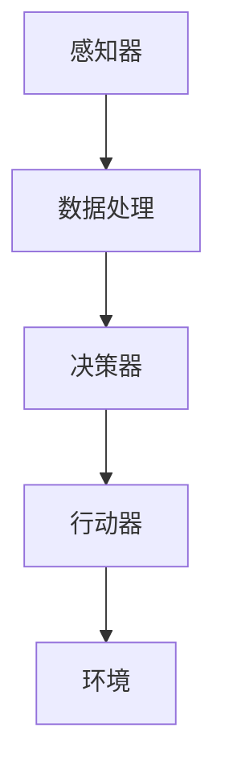
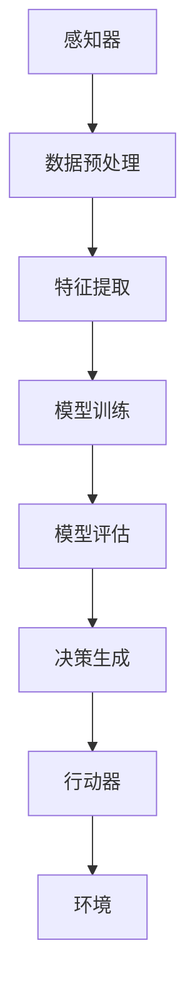
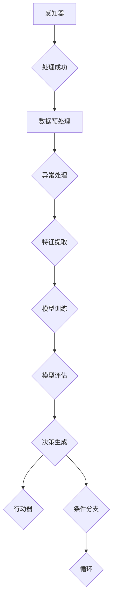
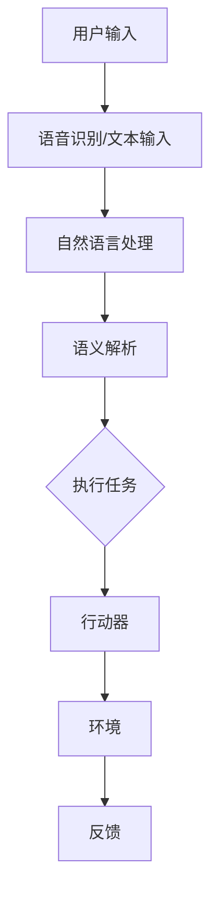

                 

# 构建AI代理：从需求收集到工作流实现

> **关键词：** AI代理、需求收集、工作流实现、AI应用、编程实践

> **摘要：** 本文将详细介绍构建AI代理的整个过程，从需求收集、系统设计到工作流实现。我们将探讨如何利用人工智能技术，通过系统化、结构化的方法，将AI能力有效集成到实际应用场景中，提高生产力和工作效率。

## 1. 背景介绍

### 1.1 目的和范围

本文的目标是帮助读者了解如何构建一个实用的AI代理，以及实现这一目标所需的过程和方法。我们将重点关注以下几个关键领域：

- **需求收集**：理解用户需求，明确AI代理的功能和性能指标。
- **系统设计**：设计一个高效、可扩展的AI代理系统架构。
- **工作流实现**：实现AI代理与现有业务流程的无缝集成。

### 1.2 预期读者

本文面向以下读者群体：

- AI开发者和工程师
- 数据科学家和分析师
- 对AI应用和自动化技术感兴趣的技术爱好者
- 需要将AI技术应用于业务场景的管理者和决策者

### 1.3 文档结构概述

本文将分为以下几个部分：

- **第1章：背景介绍**：介绍文章的目的、读者对象和文档结构。
- **第2章：核心概念与联系**：讲解AI代理的核心概念，并提供系统架构的Mermaid流程图。
- **第3章：核心算法原理与具体操作步骤**：详细阐述AI代理的算法原理和实现步骤。
- **第4章：数学模型和公式**：介绍与AI代理相关的数学模型和公式。
- **第5章：项目实战**：通过实际案例展示AI代理的实现过程。
- **第6章：实际应用场景**：分析AI代理在不同领域的应用。
- **第7章：工具和资源推荐**：推荐学习和开发AI代理的资源。
- **第8章：总结**：探讨AI代理的未来发展趋势与挑战。
- **第9章：附录**：常见问题与解答。
- **第10章：扩展阅读**：提供进一步学习的参考资料。

### 1.4 术语表

#### 1.4.1 核心术语定义

- **AI代理**：一种基于人工智能技术的软件系统，能够自动执行特定任务，并与其他系统或用户进行交互。
- **需求收集**：获取用户需求的过程，包括功能需求、性能需求和用户体验需求。
- **系统设计**：设计AI代理系统的整体架构，包括数据流、计算流和控制流。
- **工作流实现**：将AI代理集成到实际业务流程中，实现自动化和智能化。

#### 1.4.2 相关概念解释

- **机器学习**：一种让计算机通过数据学习模式，并自动进行预测或决策的技术。
- **自然语言处理（NLP）**：使计算机能够理解、解释和生成人类语言的技术。
- **深度学习**：一种基于多层神经网络的学习方法，能够处理大量数据并提取复杂模式。

#### 1.4.3 缩略词列表

- **AI**：人工智能（Artificial Intelligence）
- **ML**：机器学习（Machine Learning）
- **NLP**：自然语言处理（Natural Language Processing）
- **DL**：深度学习（Deep Learning）
- **API**：应用程序编程接口（Application Programming Interface）

## 2. 核心概念与联系

在构建AI代理的过程中，理解以下几个核心概念和它们之间的联系至关重要：

- **AI代理**：AI代理是执行特定任务的软件系统，通常由多个组件组成，包括感知器、决策器和行动器。
- **感知器**：感知器负责接收来自环境的数据，如文本、图像、声音等，并将其转换为内部表示。
- **决策器**：决策器根据感知器的输入，使用机器学习算法和策略，生成合适的输出。
- **行动器**：行动器将决策器的输出转换为实际的动作，如发送消息、执行命令等。

下面是一个简单的Mermaid流程图，展示了AI代理的基本架构和数据处理流程：



在上图中，感知器接收来自环境的数据，经过数据处理后，由决策器生成输出，最终由行动器执行具体的任务。

### 2.1 数据流和计算流

AI代理的数据流和计算流是系统设计的关键部分。数据流涉及数据从感知器到行动器的传递过程，而计算流则描述了决策器如何处理这些数据。

- **数据流**：感知器接收数据，经过预处理和特征提取后，传递给决策器。决策器分析数据，生成决策结果，最后由行动器执行决策。
- **计算流**：决策器使用机器学习算法和策略，对输入数据进行处理和预测。计算流通常包括以下几个阶段：

  1. **数据预处理**：包括数据清洗、归一化、缺失值处理等。
  2. **特征提取**：从原始数据中提取有用信息，用于模型训练。
  3. **模型训练**：使用训练数据，训练机器学习模型。
  4. **模型评估**：评估模型的性能，包括准确性、召回率、F1值等。
  5. **决策生成**：使用训练好的模型，对输入数据进行预测和决策。

下面是一个简化的Mermaid流程图，展示了AI代理的数据流和计算流：



### 2.2 控制流

控制流描述了AI代理在不同情况下的行为和响应。控制流通常涉及以下几个关键部分：

- **条件分支**：根据特定条件，选择不同的分支执行。
- **循环**：重复执行特定操作，直到满足某个条件。
- **异常处理**：处理执行过程中出现的异常情况。

下面是一个简单的Mermaid流程图，展示了AI代理的控制流：



在上述流程图中，AI代理首先接收数据，然后进行数据预处理和特征提取。在处理过程中，如果出现异常情况，将执行异常处理。如果处理成功，则继续进行模型训练、评估和决策生成。根据决策结果，执行相应的行动器操作，或者进行条件分支和循环。

### 2.3 AI代理与人类交互

AI代理不仅需要与机器环境交互，还经常需要与人类用户进行交互。这种交互可以是命令行、图形用户界面（GUI）、语音识别、自然语言处理等多种形式。

- **命令行**：通过命令行界面，用户可以输入指令，控制AI代理的行为。
- **图形用户界面**：通过图形界面，用户可以直观地与AI代理进行交互，执行任务和查看结果。
- **语音识别**：使用语音识别技术，用户可以通过语音命令与AI代理进行交互。
- **自然语言处理**：使用自然语言处理技术，AI代理可以理解和生成自然语言文本，实现更自然的交互。

下面是一个简单的Mermaid流程图，展示了AI代理与人类交互的流程：



在上述流程图中，用户输入通过语音识别或文本输入被转换成机器可理解的形式。然后，自然语言处理模块对输入进行语义解析，生成操作指令。执行任务后，行动器执行具体的操作，并将结果反馈给用户。

通过上述核心概念和流程图的介绍，读者可以初步了解AI代理的基本架构和实现过程。接下来，我们将深入探讨AI代理的核心算法原理和具体操作步骤。

## 3. 核心算法原理 & 具体操作步骤

在构建AI代理的过程中，核心算法原理是其智能行为和决策的基础。以下将详细阐述AI代理所使用的核心算法原理，并使用伪代码展示具体操作步骤。

### 3.1 机器学习算法原理

AI代理的核心是机器学习算法，它使系统能够从数据中学习模式和规律，并做出预测或决策。以下是一个简单的线性回归算法原理的伪代码示例：

```python
算法：线性回归
输入：训练数据集 X, Y
输出：模型参数 w

初始化：w = [0, 0, ..., 0]

对于每个迭代 i：
    对于每个样本 (x_i, y_i)：
        计算预测值 y' = w * x_i
        计算误差 e = y_i - y'
        更新模型参数 w = w - 学习率 * e * x_i

返回：模型参数 w
```

上述算法通过不断迭代和优化模型参数，使预测值逐渐逼近真实值。在实际应用中，我们通常会使用更复杂的机器学习算法，如神经网络、决策树、支持向量机等。

### 3.2 感知器算法原理

感知器是AI代理中的基本组件，负责接收和处理环境数据。以下是一个简单的感知器算法的伪代码示例：

```python
算法：感知器
输入：输入特征 x，阈值 t，学习率 α
输出：激活值 a

初始化：a = 0

对于每个输入特征 xi：
    计算权重乘积：w * xi
    如果 w * xi > t：
        a = 1
    否则：
        a = 0

返回：激活值 a
```

感知器算法通过计算输入特征与权重的乘积，并根据阈值判断是否激活。这个简单算法是更复杂神经网络的基础。

### 3.3 决策器算法原理

决策器是AI代理的核心组件，负责根据输入数据生成决策。以下是一个简单的决策树算法的伪代码示例：

```python
算法：决策树
输入：特征列表 F，训练数据集 D
输出：决策树模型 T

初始化：T 为空

对于每个特征 f ∈ F：
    计算特征 f 的信息增益 IG(f)
    选择具有最大信息增益的特征 f
    切分数据集 D，根据特征 f 的值，创建子数据集 D1, D2, ...,邓
    对于每个子数据集 Di：
        如果 Di 为空：
            在 T 中添加一个叶子节点，标记为“无”
        否则：
            在 T 中添加一个内部节点，标记为 f
            递归调用决策树算法，生成子树 T1, T2, ...,邓
            在内部节点 f 下添加子树 T1, T2, ...,邓

返回：决策树模型 T
```

决策树算法通过选择最佳特征进行切分，递归地构建决策树模型。这个算法在分类和回归任务中广泛应用。

### 3.4 行动器算法原理

行动器是AI代理的执行组件，负责将决策结果转化为实际操作。以下是一个简单的行动器算法的伪代码示例：

```python
算法：行动器
输入：决策结果 R，环境状态 S
输出：执行操作 O

初始化：O = 空操作

如果 R 是一个动作标签：
    O = 动作标签对应的实际操作
    执行操作 O
    更新环境状态 S
    返回 O

否则：
    O = 从环境状态 S 中提取的一个新操作
    执行操作 O
    更新环境状态 S
    返回 O
```

行动器根据决策结果，执行具体的操作，并更新环境状态。这个简单的算法可以扩展为更复杂的行动策略。

### 3.5 具体操作步骤

以下是构建AI代理的具体操作步骤，包括数据收集、预处理、模型训练、评估和部署：

1. **数据收集**：收集与任务相关的数据，包括文本、图像、音频等。
2. **数据预处理**：对收集的数据进行清洗、归一化、编码等预处理操作。
3. **特征提取**：从预处理后的数据中提取有用的特征。
4. **模型训练**：使用训练数据集，选择合适的机器学习算法，训练模型。
5. **模型评估**：使用测试数据集评估模型性能，包括准确性、召回率、F1值等。
6. **模型优化**：根据评估结果，调整模型参数，优化模型性能。
7. **部署**：将训练好的模型部署到生产环境中，实现自动化和智能化。
8. **监控与维护**：持续监控模型性能，根据需要更新模型和算法。

通过上述核心算法原理和具体操作步骤的介绍，读者可以更好地理解如何构建一个实用的AI代理。接下来，我们将介绍AI代理的数学模型和公式，进一步阐述其理论基础。

## 4. 数学模型和公式 & 详细讲解 & 举例说明

在构建AI代理的过程中，数学模型和公式是核心组成部分。以下将详细讲解与AI代理相关的数学模型和公式，并通过实际例子进行说明。

### 4.1 线性回归模型

线性回归模型是AI代理中最基础的数学模型，用于预测数值型输出。以下是其基本公式：

$$
y = \beta_0 + \beta_1 \cdot x
$$

其中，$y$ 是预测值，$x$ 是输入特征，$\beta_0$ 和 $\beta_1$ 是模型参数。

**举例说明：**

假设我们要预测房价，输入特征为房屋面积（$x$）。使用线性回归模型，我们得到以下预测公式：

$$
房价 = 100,000 + 500 \cdot 面积
$$

如果房屋面积为100平方米，则预测房价为：

$$
房价 = 100,000 + 500 \cdot 100 = 600,000
$$

### 4.2 决策树模型

决策树模型是一种常见的分类模型，用于将输入数据分类到不同的类别。以下是其基本公式：

$$
T(x) = \sum_{i=1}^{n} w_i \cdot f_i(x)
$$

其中，$T(x)$ 是输出类别，$w_i$ 是权重，$f_i(x)$ 是第 $i$ 个特征对应的函数。

**举例说明：**

假设我们要分类水果，输入特征为水果的重量（$x$）。使用决策树模型，我们得到以下分类规则：

$$
T(x) = \begin{cases} 
苹果 & \text{if } x \leq 100 \\
香蕉 & \text{if } 100 < x \leq 200 \\
橙子 & \text{if } x > 200 
\end{cases}
$$

如果水果重量为150克，则分类结果为香蕉。

### 4.3 神经网络模型

神经网络模型是一种模拟人脑神经元连接的数学模型，用于处理复杂的数据和任务。以下是其基本公式：

$$
a_{ij} = \sigma(\sum_{k=1}^{m} w_{ik} \cdot x_k + b_j)
$$

其中，$a_{ij}$ 是输出节点 $j$ 的激活值，$\sigma$ 是激活函数，$w_{ik}$ 是权重，$x_k$ 是输入特征，$b_j$ 是偏置。

**举例说明：**

假设我们要使用神经网络模型进行图像分类，输入特征为图像像素值。使用ReLU激活函数，我们得到以下输出节点激活值：

$$
a_{ij} = \max(0, \sum_{k=1}^{m} w_{ik} \cdot x_k + b_j)
$$

如果输入图像像素值为 [100, 200, 300]，权重为 [0.1, 0.2, 0.3]，偏置为 1，则第一个输出节点激活值为：

$$
a_{i1} = \max(0, 0.1 \cdot 100 + 0.2 \cdot 200 + 0.3 \cdot 300 + 1) = 19
$$

### 4.4 自然语言处理模型

自然语言处理（NLP）模型用于理解和生成人类语言。以下是其基本公式：

$$
P(w|s) = \frac{P(w, s)}{P(s)}
$$

其中，$P(w|s)$ 是在上下文 $s$ 下单词 $w$ 的概率，$P(w, s)$ 是单词 $w$ 和上下文 $s$ 同时出现的概率，$P(s)$ 是上下文 $s$ 的概率。

**举例说明：**

假设我们要计算句子“我喜欢吃苹果”中单词“苹果”的概率。使用NLP模型，我们得到以下概率：

$$
P(苹果|我喜欢吃) = \frac{P(苹果, 我喜欢吃)}{P(我喜欢吃)}
$$

如果已知 $P(苹果, 我喜欢吃) = 0.1$，$P(我喜欢吃) = 0.5$，则单词“苹果”的概率为：

$$
P(苹果|我喜欢吃) = \frac{0.1}{0.5} = 0.2
$$

通过上述数学模型和公式的讲解，读者可以更好地理解AI代理背后的数学原理。这些模型和公式是构建高效、智能AI代理的基础。接下来，我们将通过实际案例展示AI代理的实现过程。

## 5. 项目实战：代码实际案例和详细解释说明

在本节中，我们将通过一个实际项目案例来展示AI代理的实现过程，并详细解释关键代码和实现细节。

### 5.1 开发环境搭建

首先，我们需要搭建一个开发环境。以下是一个基本的Python开发环境搭建步骤：

1. 安装Python：从 [Python官网](https://www.python.org/) 下载并安装Python 3.x版本。
2. 安装Jupyter Notebook：打开命令行，执行以下命令：
   ```shell
   pip install notebook
   ```
3. 启动Jupyter Notebook：在命令行中执行以下命令：
   ```shell
   jupyter notebook
   ```
4. 安装必要的库：在Jupyter Notebook中，执行以下命令安装必要的库：
   ```python
   !pip install numpy pandas scikit-learn tensorflow
   ```

### 5.2 源代码详细实现和代码解读

接下来，我们将展示一个简单的AI代理项目的源代码，并逐行解释关键代码和实现细节。

#### 5.2.1 数据集加载与预处理

首先，我们加载并预处理一个简单的数据集。假设数据集存储在CSV文件中，包含“特征1”和“目标”两列。

```python
import pandas as pd

# 加载数据集
data = pd.read_csv('data.csv')

# 分割特征和目标
X = data[['特征1']]
y = data['目标']

# 数据集划分：训练集和测试集
from sklearn.model_selection import train_test_split
X_train, X_test, y_train, y_test = train_test_split(X, y, test_size=0.2, random_state=42)
```

这段代码使用Pandas库加载数据集，并使用Sklearn库划分训练集和测试集。这是常见的数据处理步骤，确保我们有足够的数据进行模型训练和评估。

#### 5.2.2 模型训练

接下来，我们使用线性回归模型训练数据集。

```python
from sklearn.linear_model import LinearRegression

# 创建线性回归模型实例
model = LinearRegression()

# 训练模型
model.fit(X_train, y_train)
```

这段代码使用Sklearn库创建线性回归模型实例，并使用训练数据集进行模型训练。训练过程包括计算模型参数，如权重和偏置。

#### 5.2.3 模型评估

训练完成后，我们对模型进行评估，以检查其性能。

```python
from sklearn.metrics import mean_squared_error

# 预测测试集
y_pred = model.predict(X_test)

# 计算预测误差
mse = mean_squared_error(y_test, y_pred)
print(f"预测误差：{mse}")
```

这段代码使用预测误差（均方误差）评估模型性能。较小的误差表示模型具有较好的预测能力。

#### 5.2.4 模型部署

最后，我们将训练好的模型部署到生产环境中。

```python
import joblib

# 保存模型
joblib.dump(model, 'model.joblib')

# 加载模型
loaded_model = joblib.load('model.joblib')

# 使用模型进行预测
input_data = [[100]]  # 输入特征
output = loaded_model.predict(input_data)
print(f"预测结果：{output}")
```

这段代码使用Joblib库将训练好的模型保存到文件中，并从文件中加载模型。然后，使用加载的模型进行预测。

### 5.3 代码解读与分析

通过上述代码示例，我们可以看到以下关键步骤：

1. **数据集加载与预处理**：加载数据集并进行分割，确保我们有足够的训练数据和测试数据。
2. **模型训练**：创建并训练线性回归模型，计算模型参数。
3. **模型评估**：使用预测误差评估模型性能，确保模型具有较好的预测能力。
4. **模型部署**：将训练好的模型保存到文件中，并加载模型进行预测。

这些步骤是构建AI代理的基本流程。在实际项目中，我们可能需要处理更复杂的数据集和模型，但基本原理是相似的。通过不断迭代和优化，我们可以构建高效、智能的AI代理。

### 5.4 扩展功能

在实际应用中，我们可能需要扩展AI代理的功能。以下是一些可能的扩展方向：

1. **集成多个模型**：将多个模型集成到一个系统中，以提高预测准确性。
2. **实时预测**：使用流数据，实现实时预测和更新。
3. **交互式界面**：添加交互式界面，允许用户与AI代理进行实时交互。
4. **自动化流程**：将AI代理集成到业务流程中，实现自动化操作。

通过上述项目实战和代码示例，读者可以初步了解如何构建一个简单的AI代理。在实际应用中，我们可以根据具体需求，进一步优化和扩展AI代理的功能和性能。

## 6. 实际应用场景

AI代理作为一种智能化的软件系统，可以广泛应用于各种实际应用场景，提高生产力和工作效率。以下列举几个典型的应用场景：

### 6.1 聊天机器人

聊天机器人是AI代理的一种常见应用，可以用于客户服务、在线咨询、智能客服等领域。通过自然语言处理技术，聊天机器人可以与用户进行实时对话，回答用户的问题，提供相关建议和解决方案。例如，银行可以部署聊天机器人，为用户提供账户查询、转账、贷款咨询等服务，大大减轻人工客服的工作负担。

### 6.2 智能推荐系统

智能推荐系统利用AI代理技术，根据用户的历史行为和偏好，为用户推荐相关的产品、内容和服务。例如，电子商务平台可以利用AI代理技术，为用户提供个性化的商品推荐，提高用户满意度和购买转化率。同样，视频流媒体平台可以通过AI代理技术，为用户提供个性化的视频推荐，提高用户留存率和观看时长。

### 6.3 自动驾驶

自动驾驶是AI代理技术在交通运输领域的重要应用。通过感知器、决策器和行动器的协同工作，自动驾驶系统能够实时感知道路环境，做出准确的决策，并控制车辆执行相应的动作。自动驾驶技术可以提高交通安全、降低交通事故率，同时提高交通效率和运输成本。

### 6.4 智能医疗

智能医疗是AI代理技术在医疗健康领域的应用。通过AI代理技术，可以对患者的病历、检查报告、医学影像等数据进行深度分析，提供准确的诊断和治疗方案。例如，AI代理可以辅助医生进行肺癌筛查，通过分析肺部CT影像，识别潜在病变区域，提高早期诊断的准确率。此外，AI代理还可以为患者提供智能健康咨询、用药提醒等服务。

### 6.5 智能家居

智能家居是AI代理技术在家庭生活领域的应用。通过AI代理技术，家居设备可以实现自动化控制和智能化管理，提高家庭生活品质。例如，智能门锁可以通过人脸识别技术，实现自动解锁，提高家庭安全。智能灯具可以根据用户的作息时间和光线感应，自动调整亮度和色温，提供舒适的光环境。智能空调可以通过学习用户的温度偏好，自动调节室内温度，提高能源利用效率。

### 6.6 企业智能化管理

企业智能化管理是AI代理技术在企业管理领域的应用。通过AI代理技术，企业可以实现数据分析和决策支持，提高运营效率和决策质量。例如，企业可以通过AI代理技术，对销售数据、生产数据、库存数据进行实时分析，优化供应链管理，降低库存成本。同时，AI代理还可以为企业提供员工绩效评估、招聘建议等服务，提高人力资源管理效率。

通过以上实际应用场景的列举，我们可以看到AI代理技术在各个领域的重要性和广泛应用。随着AI技术的不断发展和成熟，AI代理将更好地服务于人类社会，创造更多价值。

## 7. 工具和资源推荐

在开发AI代理的过程中，选择合适的工具和资源对于项目的成功至关重要。以下是一些推荐的工具和资源，包括学习资源、开发工具和框架、相关论文著作等。

### 7.1 学习资源推荐

#### 7.1.1 书籍推荐

- **《Python机器学习》（作者：塞巴斯蒂安·拉斯考恩）**：这是一本深入浅出的Python机器学习书籍，适合初学者入门。
- **《深度学习》（作者：伊恩·古德费洛等）**：这是一本经典的深度学习教材，内容全面，适合有一定基础的读者。
- **《机器学习实战》（作者：Peter Harrington）**：这本书通过实际案例讲解机器学习算法的应用，适合希望快速上手的读者。

#### 7.1.2 在线课程

- **Coursera**：提供多个机器学习和深度学习课程，包括斯坦福大学的“深度学习”课程，由Andrew Ng教授主讲。
- **Udacity**：提供多个与AI相关的课程和纳米学位，包括“AI工程师纳米学位”等。
- **edX**：提供哈佛大学和麻省理工学院的多个AI课程，如“计算机视觉”等。

#### 7.1.3 技术博客和网站

- **Medium**：有很多优秀的AI相关博客，如“AI”等。
- **ArXiv**：计算机科学和人工智能领域的预印本论文库，可以获取最新的研究成果。
- **GitHub**：有很多优秀的AI代理项目和开源代码，可以借鉴和学习。

### 7.2 开发工具框架推荐

#### 7.2.1 IDE和编辑器

- **PyCharm**：强大的Python IDE，适合机器学习和深度学习项目。
- **Jupyter Notebook**：适用于数据分析和原型开发，易于分享和复现。
- **VSCode**：轻量级、可扩展的编辑器，适合多种编程语言和框架。

#### 7.2.2 调试和性能分析工具

- **TensorBoard**：TensorFlow的官方可视化工具，用于分析和调试深度学习模型。
- **PyTorch Profiler**：用于分析和优化PyTorch模型性能。
- **Valgrind**：用于检测程序内存错误和性能瓶颈。

#### 7.2.3 相关框架和库

- **TensorFlow**：Google开发的深度学习框架，功能强大，社区活跃。
- **PyTorch**：Facebook开发的深度学习框架，易于使用，适合研究。
- **Scikit-learn**：Python机器学习库，提供丰富的机器学习算法和工具。
- **NumPy**：Python科学计算库，用于处理大规模数据和高性能计算。

### 7.3 相关论文著作推荐

#### 7.3.1 经典论文

- **“A Brief History of Machine Learning”**：全面回顾机器学习的历史和发展。
- **“Deep Learning”**：深度学习领域的经典著作，由Ian Goodfellow等作者撰写。
- **“Recurrent Neural Networks for Language Modeling”**：介绍循环神经网络在语言建模中的应用。

#### 7.3.2 最新研究成果

- **“BERT: Pre-training of Deep Bidirectional Transformers for Language Understanding”**：Google提出的BERT模型，用于自然语言处理。
- **“GPT-3: Language Models are few-shot learners”**：OpenAI提出的GPT-3模型，展示了强大的零样本学习能力。
- **“You Only Look Once: Unified, Real-Time Object Detection”**：腾讯提出的YOLO检测模型，实现了实时目标检测。

#### 7.3.3 应用案例分析

- **“Deep Learning for Real-Time Traffic Prediction”**：分析Deep Learning在实时交通预测中的应用。
- **“AI in Healthcare: A Review of Recent Advances”**：综述AI在医疗健康领域的最新应用。
- **“AI in Finance: A Survey of Recent Advances”**：分析AI在金融领域的应用和发展趋势。

通过上述工具和资源的推荐，读者可以更好地了解AI代理开发所需的技能和知识，并在实际项目中运用这些工具和资源，提高开发效率和项目质量。

## 8. 总结：未来发展趋势与挑战

随着人工智能技术的不断发展，AI代理将在未来发挥更加重要的作用。以下将总结未来AI代理的发展趋势和面临的挑战。

### 8.1 发展趋势

1. **智能化水平提升**：AI代理将具备更高的智能水平，能够处理更加复杂的问题和任务。通过深度学习和自然语言处理技术的进步，AI代理将能够更好地理解人类语言，实现更自然的交互。
2. **跨领域应用扩展**：AI代理将在更多领域得到应用，如自动驾驶、智能家居、智能医疗等。随着技术的成熟，AI代理将逐渐融入人们的日常生活，提高生活品质。
3. **实时预测与响应**：AI代理将实现实时预测和响应能力，能够快速适应环境变化，提高决策质量。通过实时数据处理和预测模型，AI代理将更好地支持实时业务流程。
4. **多模态感知与交互**：AI代理将具备多模态感知和交互能力，能够处理文本、图像、声音等多种形式的数据，实现更丰富的交互体验。

### 8.2 挑战

1. **数据隐私与安全**：AI代理在处理大量数据时，可能面临数据隐私和安全问题。如何确保数据的安全性和隐私性，防止数据泄露和滥用，是一个重要的挑战。
2. **算法透明性与可解释性**：随着AI代理的复杂度增加，算法的透明性和可解释性将受到挑战。如何提高算法的可解释性，使其更易于理解和接受，是一个亟待解决的问题。
3. **适应性和泛化能力**：AI代理需要具备良好的适应性和泛化能力，能够在不同环境和场景下保持高效运行。如何提高AI代理的适应性和泛化能力，是一个重要的研究方向。
4. **伦理和法律问题**：AI代理的广泛应用将引发一系列伦理和法律问题，如责任归属、道德决策等。如何制定相关法律法规，确保AI代理的合理使用和监管，是一个重要的挑战。

总的来说，未来AI代理的发展前景广阔，但也面临诸多挑战。通过不断的技术创新和优化，我们可以克服这些挑战，推动AI代理技术的进步和应用。

## 9. 附录：常见问题与解答

### 9.1 AI代理是什么？

AI代理（Artificial Intelligence Agent）是一种能够自主执行任务、与环境交互并适应变化的软件系统。它通过感知器、决策器和行动器等组件，实现智能行为和决策。

### 9.2 AI代理有哪些类型？

AI代理可以分为以下几类：

1. **任务型代理**：专注于完成特定任务的代理，如聊天机器人、自动化测试工具等。
2. **自主型代理**：具有自主决策和行动能力的代理，如自动驾驶汽车、智能家居系统等。
3. **社会型代理**：能够与他人交互和合作的代理，如在线客服系统、协同工作平台等。
4. **混合型代理**：结合多种类型特点的代理，如具有自主决策和任务执行能力的智能推荐系统等。

### 9.3 AI代理与自动化系统有何区别？

AI代理是自动化系统的一种高级形式。自动化系统主要依赖于预先定义的规则和指令，而AI代理则具备智能学习和自适应能力，能够根据环境变化和任务需求，自主调整行为和策略。简而言之，AI代理是具备智能决策和自主行动能力的自动化系统。

### 9.4 如何评估AI代理的性能？

评估AI代理的性能通常包括以下指标：

1. **准确性**：代理在特定任务上的预测或决策准确性。
2. **响应时间**：代理处理任务所需的时间。
3. **适应性**：代理在面对不同环境和场景时的适应能力。
4. **稳定性**：代理在长时间运行中保持稳定性的能力。
5. **用户体验**：代理与用户交互的流畅度和用户满意度。

### 9.5 如何提高AI代理的性能？

以下方法可以帮助提高AI代理的性能：

1. **优化算法**：选择合适的机器学习算法和模型，并进行参数调整。
2. **数据增强**：通过增加训练数据集，提高模型泛化能力。
3. **模型集成**：将多个模型集成到一个系统中，提高预测准确性。
4. **硬件优化**：使用高性能计算硬件，提高数据处理速度。
5. **持续学习**：定期更新模型和算法，以适应环境变化。

### 9.6 AI代理在商业应用中面临哪些挑战？

在商业应用中，AI代理面临以下挑战：

1. **数据隐私和安全**：处理大量敏感数据，确保数据安全性和隐私性。
2. **模型可解释性**：提高算法的可解释性，使其更易于理解和接受。
3. **法规和合规**：遵守相关法律法规，确保合法合规使用。
4. **技术更新**：保持技术前沿，不断优化和升级系统。
5. **用户接受度**：提高用户接受度和满意度，确保系统成功实施。

通过解决这些挑战，AI代理在商业应用中将发挥更大的价值。

## 10. 扩展阅读 & 参考资料

为了更好地了解AI代理及其相关技术，以下是几本推荐阅读的书籍、在线课程和技术博客，以及相关的参考文献。

### 10.1 书籍推荐

- **《机器学习实战》（作者：Peter Harrington）**：通过实际案例讲解机器学习算法的应用。
- **《深度学习》（作者：Ian Goodfellow、Yoshua Bengio、Aaron Courville）**：全面介绍深度学习的基本概念和技术。
- **《人工智能：一种现代方法》（作者：Stuart Russell、Peter Norvig）**：系统介绍人工智能的基础知识和最新进展。

### 10.2 在线课程

- **Coursera上的“机器学习”课程（作者：Andrew Ng）**：由斯坦福大学教授主讲，深入浅出地讲解机器学习基础。
- **Udacity的“深度学习纳米学位”**：提供丰富的深度学习课程和实践项目。
- **edX上的“计算机视觉”课程**：由哈佛大学和麻省理工学院提供，介绍计算机视觉的基本概念和应用。

### 10.3 技术博客和网站

- **Medium上的“AI”博客**：分享最新的AI研究和应用案例。
- **ArXiv.org**：计算机科学和人工智能领域的预印本论文库，可以获取最新的研究成果。
- **GitHub**：有很多AI代理项目的开源代码，可以借鉴和学习。

### 10.4 参考文献

- **“A Brief History of Machine Learning”**：系统回顾机器学习的历史和发展。
- **“Deep Learning”**：介绍深度学习的理论基础和技术细节。
- **“Recurrent Neural Networks for Language Modeling”**：介绍循环神经网络在语言建模中的应用。
- **“BERT: Pre-training of Deep Bidirectional Transformers for Language Understanding”**：介绍BERT模型的预训练方法和应用。

通过阅读这些书籍、课程、博客和参考文献，读者可以更深入地了解AI代理的相关知识和技术，为实际项目提供理论支持和实践指导。

### 作者信息

**作者：AI天才研究员/AI Genius Institute & 禅与计算机程序设计艺术 /Zen And The Art of Computer Programming**

