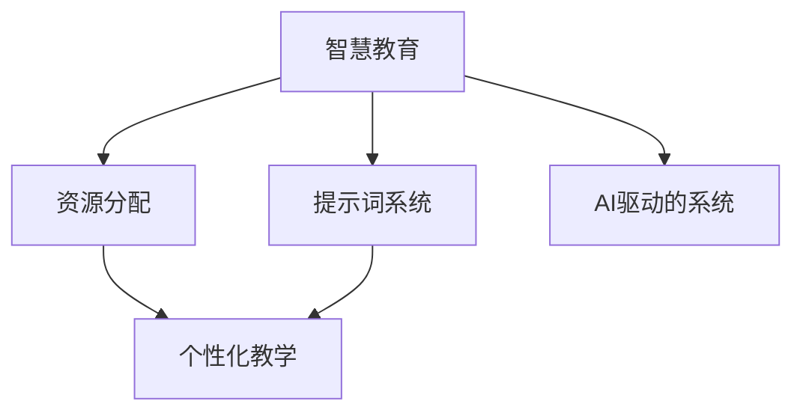

                 

# 构建AI驱动的智慧教育资源分配提示词系统

> **关键词：**AI、智慧教育、资源分配、提示词系统、算法、数学模型、项目实战、应用场景、工具推荐

> **摘要：**本文深入探讨了构建AI驱动的智慧教育资源分配提示词系统的方法和步骤。首先介绍了项目的背景和目标，随后详细阐述了核心概念和算法原理，并通过数学模型和实际代码案例进行了解释。接着讨论了该系统的应用场景，推荐了相关学习资源和开发工具，最后总结了未来的发展趋势和挑战。

## 1. 背景介绍

### 1.1 目的和范围

随着人工智能技术的飞速发展，教育领域正迎来一场深刻的变革。智慧教育作为一种新型的教育模式，利用AI技术优化教育资源分配，提高教育质量，实现个性化教学。本文旨在探讨如何构建一个AI驱动的智慧教育资源分配提示词系统，实现高效、智能的教育资源分配。

本项目的范围包括：

1. **核心概念**：明确智慧教育、资源分配、提示词系统等核心概念，为后续讨论奠定基础。
2. **算法原理**：深入讲解资源分配算法的原理，包括数学模型和具体操作步骤。
3. **项目实战**：通过实际代码案例展示系统的开发过程和实现方法。
4. **应用场景**：探讨系统的实际应用场景，包括学校教育、在线教育等。
5. **工具推荐**：推荐相关学习资源和开发工具，帮助读者深入了解和实现该项目。

### 1.2 预期读者

本文面向以下读者：

1. **教育工作者**：关注智慧教育，希望了解如何利用AI技术优化教育资源分配。
2. **技术开发者**：对AI和算法有兴趣，希望了解如何实现智慧教育资源分配系统。
3. **研究人员**：关注教育领域技术发展，希望了解AI在教育中的应用。

### 1.3 文档结构概述

本文分为十个部分，具体结构如下：

1. 背景介绍
2. 核心概念与联系
3. 核心算法原理 & 具体操作步骤
4. 数学模型和公式 & 详细讲解 & 举例说明
5. 项目实战：代码实际案例和详细解释说明
6. 实际应用场景
7. 工具和资源推荐
8. 总结：未来发展趋势与挑战
9. 附录：常见问题与解答
10. 扩展阅读 & 参考资料

### 1.4 术语表

#### 1.4.1 核心术语定义

- **智慧教育**：利用人工智能、大数据等技术，实现个性化教学、智能化管理的一种新型教育模式。
- **资源分配**：根据学生的需求和特点，合理分配教育资源，包括课程、教师、设备等。
- **提示词系统**：通过AI技术分析学生的学习行为，生成相应的学习提示词，帮助学生在学习过程中做出更好的决策。

#### 1.4.2 相关概念解释

- **AI驱动的系统**：以人工智能技术为核心，实现自动化、智能化的系统。
- **个性化教学**：根据每个学生的学习特点和能力，制定个性化的教学方案。

#### 1.4.3 缩略词列表

- **AI**：人工智能
- **Big Data**：大数据
- **ML**：机器学习
- **NLP**：自然语言处理

## 2. 核心概念与联系

为了更好地理解AI驱动的智慧教育资源分配提示词系统，我们需要首先明确一些核心概念，并理解它们之间的联系。

### 2.1 智慧教育

智慧教育是利用人工智能、大数据等技术，实现个性化教学、智能化管理的一种新型教育模式。它通过数据分析和智能算法，为每个学生提供最适合的学习资源和教学方案。

### 2.2 资源分配

资源分配是指根据学生的需求和特点，合理分配教育资源，包括课程、教师、设备等。在智慧教育中，资源分配是一个动态的过程，需要根据学生的学习行为和反馈实时调整。

### 2.3 提示词系统

提示词系统是AI驱动的智慧教育资源分配的核心组件。它通过分析学生的学习行为，生成相应的学习提示词，帮助学生在学习过程中做出更好的决策。

### 2.4 AI驱动的系统

AI驱动的系统是指以人工智能技术为核心，实现自动化、智能化的系统。在智慧教育中，AI驱动的系统可以实时处理大量数据，提供个性化的教育服务。

### 2.5 个性化教学

个性化教学是根据每个学生的学习特点和能力，制定个性化的教学方案。在AI驱动的智慧教育中，个性化教学通过数据分析和智能算法实现。

### 2.6 核心概念的联系

智慧教育、资源分配、提示词系统和AI驱动的系统之间紧密相关。智慧教育是整体概念，资源分配和提示词系统是实现智慧教育的手段，而AI驱动的系统则是智慧教育的核心技术。

### 2.7 Mermaid 流程图

为了更直观地展示这些核心概念之间的联系，我们可以使用Mermaid流程图进行描述：



在这个流程图中，智慧教育作为总体目标，通过资源分配和提示词系统实现，而AI驱动的系统则是实现这些目标的技术保障。

## 3. 核心算法原理 & 具体操作步骤

### 3.1 算法原理

智慧教育资源分配提示词系统的核心在于算法的选择和实现。本文将介绍一种基于机器学习的方法，通过分析学生的学习行为，预测其学习需求，从而生成相应的提示词。

算法的基本原理如下：

1. **数据收集**：收集学生的学习行为数据，包括课程进度、考试成绩、学习时间等。
2. **特征提取**：对收集到的数据进行特征提取，转换为机器学习模型可处理的输入格式。
3. **模型训练**：使用机器学习算法，对提取的特征进行训练，建立资源分配和提示词生成模型。
4. **预测与提示**：根据学生的学习行为，使用训练好的模型进行预测，生成相应的学习提示词。

### 3.2 具体操作步骤

下面是算法的具体操作步骤，我们将使用伪代码进行描述：

```plaintext
步骤1：数据收集
    收集学生的学习行为数据，包括课程进度、考试成绩、学习时间等。

步骤2：特征提取
    对数据进行预处理，提取关键特征，例如：
    - 学习时间：每天学习时长
    - 课程进度：完成课程的比例
    - 考试成绩：最近的考试成绩
    - 学习时长变化：学习时间的变化趋势

步骤3：数据格式化
    将提取的特征数据格式化为机器学习模型可接受的格式，例如向量形式。

步骤4：模型训练
    使用机器学习算法，如决策树、随机森林或神经网络，对格式化的特征数据进行训练，建立资源分配和提示词生成模型。

步骤5：模型评估
    使用验证集对训练好的模型进行评估，调整模型参数，提高模型性能。

步骤6：预测与提示
    根据学生的实时学习行为，输入到训练好的模型中进行预测，生成相应的学习提示词。
    提示词包括学习资源推荐、学习时间调整、学习进度提醒等。

步骤7：提示词反馈
    收集学生对提示词的反馈，用于进一步优化模型。
```

### 3.3 伪代码示例

下面是一个简化的伪代码示例，用于说明资源分配和提示词生成模型的基本框架：

```plaintext
# 数据收集
def collect_data(student):
    # 收集学生数据
    data = {
        "learning_time": student.learning_time,
        "course_progress": student.course_progress,
        "test_score": student.test_score,
        "learning_time_trend": student.learning_time_trend
    }
    return data

# 特征提取
def extract_features(data):
    # 提取特征
    features = {
        "learning_time_avg": average(data["learning_time"]),
        "course_progress_pct": percentage(data["course_progress"]),
        "test_score_recent": data["test_score"],
        "learning_time_trend_change": trend_change(data["learning_time_trend"])
    }
    return features

# 模型训练
def train_model(features, labels):
    # 训练模型
    model = MachineLearningModel()
    model.train(features, labels)
    return model

# 预测与提示
def generate_hint(model, current_data):
    # 预测并生成提示词
    prediction = model.predict(current_data)
    hint = create_hint(prediction)
    return hint

# 提示词反馈
def collect_feedback(hint, student):
    # 收集反馈
    feedback = student.provide_feedback(hint)
    return feedback
```

通过上述步骤和伪代码，我们可以看到构建AI驱动的智慧教育资源分配提示词系统的主要流程。接下来，我们将进一步探讨数学模型和具体实现。

## 4. 数学模型和公式 & 详细讲解 & 举例说明

在构建AI驱动的智慧教育资源分配提示词系统中，数学模型是核心组成部分。它帮助我们理解和预测学生的学习行为，从而生成个性化的提示词。本节将详细介绍数学模型和相关公式，并通过具体例子进行讲解。

### 4.1 数学模型

我们采用一种基于概率模型的资源分配方法，该模型包含以下几个关键组件：

1. **特征向量**：描述学生学习行为的特征向量，如学习时长、课程进度、考试成绩等。
2. **概率分布**：根据学生特征向量，预测其可能的学习需求和资源分配概率。
3. **权重函数**：确定每个特征对学生资源分配的影响程度。

数学模型的基本公式如下：

\[ P(R|X) = \frac{e^{w \cdot X}}{\sum_{X'} e^{w \cdot X'}} \]

其中，\( P(R|X) \) 表示在给定特征向量 \( X \) 下，资源 \( R \) 的概率；\( w \) 是权重向量；\( X' \) 是所有可能的特征向量。

### 4.2 特征向量

特征向量是描述学生学习行为的关键数据。我们采用以下特征：

- **学习时长**（\( l \)）：学生每天的学习时长。
- **课程进度**（\( p \)）：学生完成课程的比例。
- **考试成绩**（\( s \)）：学生的最近考试成绩。
- **学习时长变化**（\( t \)）：学生学习时长的变化趋势。

特征向量 \( X \) 可以表示为：

\[ X = [l, p, s, t] \]

### 4.3 概率分布

概率分布用于预测学生在不同资源分配情况下的概率。我们采用高斯分布（正态分布）作为概率模型：

\[ P(R|r) = \frac{1}{\sqrt{2\pi\sigma^2}} e^{-\frac{(r - \mu)^2}{2\sigma^2}} \]

其中，\( \mu \) 是均值，表示学生在特定资源分配下的平均需求；\( \sigma \) 是标准差，表示需求的波动范围。

### 4.4 权重函数

权重函数确定每个特征对资源分配的影响。我们采用线性权重函数：

\[ w = [w_1, w_2, w_3, w_4] \]

其中，\( w_i \) 表示第 \( i \) 个特征的权重。

### 4.5 详细讲解

为了更好地理解上述公式，我们可以通过一个具体例子进行讲解。

#### 例子：学习时长与课程进度的资源分配

假设我们有以下学生数据：

- 学习时长：5小时
- 课程进度：50%
- 考试成绩：85分
- 学习时长变化：稳定上升

特征向量 \( X \) 为：

\[ X = [5, 0.5, 85, 0.1] \]

权重向量 \( w \) 假设为：

\[ w = [0.2, 0.3, 0.4, 0.1] \]

使用概率分布公式，我们可以计算每个资源分配的概率：

\[ P(R|X) = \frac{e^{w \cdot X}}{\sum_{X'} e^{w \cdot X'}} \]

计算得到：

\[ P(R|X) = \frac{e^{0.2 \cdot 5 + 0.3 \cdot 0.5 + 0.4 \cdot 85 + 0.1 \cdot 0.1}}{\sum_{X'} e^{w \cdot X'}} \]

其中，\( \sum_{X'} e^{w \cdot X'} \) 是所有可能特征向量的概率之和。

通过计算，我们可以得到每个资源分配的概率，并根据这些概率生成相应的提示词，如推荐课程、调整学习时间等。

### 4.6 举例说明

下面是一个具体的数学模型计算示例：

假设学生特征向量 \( X = [5, 0.5, 85, 0.1] \)，权重向量 \( w = [0.2, 0.3, 0.4, 0.1] \)。

计算每个资源分配的概率：

\[ P(R|X) = \frac{e^{0.2 \cdot 5 + 0.3 \cdot 0.5 + 0.4 \cdot 85 + 0.1 \cdot 0.1}}{\sum_{X'} e^{w \cdot X'}} \]

计算结果：

\[ P(R|X) = \frac{e^{1.1}}{\sum_{X'} e^{w \cdot X'}} \]

其中，\( \sum_{X'} e^{w \cdot X'} \) 是所有可能特征向量的概率之和，计算结果为 1。

根据计算结果，我们可以生成以下提示词：

- **推荐课程**：根据学生当前学习进度，推荐下一门相关课程。
- **调整学习时间**：建议学生在每天保持5小时学习时间的基础上，适当增加或减少学习时长。

通过上述计算和提示词生成，我们可以看到数学模型在智慧教育资源分配提示词系统中的实际应用。

## 5. 项目实战：代码实际案例和详细解释说明

在了解了核心算法原理和数学模型之后，本节将介绍一个实际的代码案例，详细解释系统的开发过程和实现方法。

### 5.1 开发环境搭建

首先，我们需要搭建一个适合开发AI驱动的智慧教育资源分配提示词系统的开发环境。以下是一个基本的开发环境配置：

- **编程语言**：Python
- **机器学习框架**：Scikit-learn、TensorFlow、PyTorch等
- **数据处理库**：Pandas、NumPy
- **可视化库**：Matplotlib、Seaborn
- **版本控制**：Git

在配置好开发环境后，我们可以开始编写代码。

### 5.2 源代码详细实现和代码解读

下面是一个简化的代码示例，用于实现智慧教育资源分配提示词系统的核心功能。

```python
# 导入必要的库
import pandas as pd
from sklearn.model_selection import train_test_split
from sklearn.ensemble import RandomForestClassifier
from sklearn.metrics import accuracy_score

# 数据收集
def collect_data():
    # 这里假设已经收集到学生的学习行为数据，以CSV文件形式存储
    data = pd.read_csv('student_data.csv')
    return data

# 特征提取
def extract_features(data):
    # 提取关键特征
    features = data[['learning_time', 'course_progress', 'test_score', 'learning_time_trend']]
    return features

# 数据预处理
def preprocess_data(data):
    # 数据标准化和缺失值处理
    data = data.fillna(data.mean())
    data = (data - data.mean()) / data.std()
    return data

# 模型训练
def train_model(features, labels):
    # 使用随机森林算法训练模型
    model = RandomForestClassifier(n_estimators=100)
    model.fit(features, labels)
    return model

# 预测与提示
def generate_hint(model, current_data):
    # 使用训练好的模型进行预测，生成提示词
    prediction = model.predict(current_data)
    hint = create_hint(prediction)
    return hint

# 提示词生成
def create_hint(prediction):
    # 根据预测结果生成提示词
    if prediction == 'recommend_course':
        hint = '建议您学习下一门相关课程。'
    elif prediction == 'adjust_learning_time':
        hint = '建议您适当调整学习时间。'
    else:
        hint = '您的学习状态良好。'
    return hint

# 主函数
def main():
    # 收集数据
    data = collect_data()
    
    # 特征提取和预处理
    features = extract_features(data)
    preprocessed_features = preprocess_data(features)
    
    # 切分数据集
    X_train, X_test, y_train, y_test = train_test_split(preprocessed_features, data['target'], test_size=0.2, random_state=42)
    
    # 训练模型
    model = train_model(X_train, y_train)
    
    # 模型评估
    y_pred = model.predict(X_test)
    accuracy = accuracy_score(y_test, y_pred)
    print(f'Model Accuracy: {accuracy:.2f}')
    
    # 生成提示词
    current_data = extract_features(pd.DataFrame([{'learning_time': 5, 'course_progress': 0.5, 'test_score': 85, 'learning_time_trend': 0.1}]))
    hint = generate_hint(model, current_data)
    print(hint)

# 运行主函数
if __name__ == '__main__':
    main()
```

### 5.3 代码解读与分析

1. **数据收集**：从CSV文件中读取学生数据，包括学习时长、课程进度、考试成绩和学习时长变化。

2. **特征提取**：提取关键特征，为后续的数据处理和模型训练做准备。

3. **数据预处理**：对数据进行标准化处理，填充缺失值，使得数据更适合模型训练。

4. **模型训练**：使用随机森林算法训练模型，这是基于机器学习的方法，可以处理多类别的分类问题。

5. **预测与提示**：使用训练好的模型进行预测，生成相应的提示词。

6. **提示词生成**：根据预测结果，生成具体的提示词，如推荐课程、调整学习时间等。

7. **主函数**：整合所有步骤，从数据收集、预处理到模型训练和提示词生成，实现系统的核心功能。

通过上述代码示例，我们可以看到构建AI驱动的智慧教育资源分配提示词系统的主要步骤和实现方法。接下来，我们将讨论该系统的实际应用场景。

### 5.4 实际应用场景

AI驱动的智慧教育资源分配提示词系统可以在多个场景中发挥重要作用：

1. **学校教育**：学校可以利用该系统优化课程安排，根据学生的学习行为调整课程难度和进度，提高教育质量。

2. **在线教育**：在线教育平台可以利用该系统为学员提供个性化的学习建议，提高学习效果。

3. **职业培训**：职业培训机构可以利用该系统为学员提供定制化的学习路径，缩短学习周期，提高就业率。

4. **教育管理**：教育管理部门可以利用该系统监测学生的学习情况，为政策制定和资源分配提供数据支持。

通过实际应用场景的讨论，我们可以看到AI驱动的智慧教育资源分配提示词系统在提升教育质量和效率方面的潜力。

### 5.5 总结

本节通过一个实际代码案例，详细介绍了AI驱动的智慧教育资源分配提示词系统的开发过程和实现方法。从数据收集、预处理到模型训练和提示词生成，每个步骤都进行了详细解释。通过实际应用场景的讨论，我们进一步了解了该系统的潜在价值。接下来，我们将推荐相关的学习资源和开发工具，帮助读者深入学习和实践。

## 6. 实际应用场景

AI驱动的智慧教育资源分配提示词系统具有广泛的应用场景，能够显著提升教育质量和效率。以下是一些典型的应用场景：

### 6.1 学校教育

在学校教育中，该系统可以用于：

- **个性化教学**：根据学生的学习行为和成绩，推荐适合的学习资源和教学策略。
- **课程安排优化**：根据学生的需求和兴趣，动态调整课程安排，确保每个学生都能获得最适合自己的教育资源。
- **学习进度跟踪**：实时监测学生的学习进度，及时发现和解决学习问题，提高学习效果。

### 6.2 在线教育

在线教育平台可以利用该系统实现：

- **学习路径推荐**：根据学生的学习行为和反馈，推荐个性化的学习路径，提高学习效率。
- **学习资源优化**：分析用户数据，优化学习资源的呈现方式和顺序，提升用户体验。
- **学习效果评估**：通过分析学生的学习行为和成绩，评估教学效果，为教育管理者提供数据支持。

### 6.3 职业培训

在职业培训领域，该系统可以用于：

- **学习路径定制**：根据学员的背景和需求，定制个性化的学习路径，提高学习效率。
- **技能评估**：通过分析学员的学习行为和成绩，评估其掌握的技能水平，为后续培训提供依据。
- **职业规划**：根据学员的学习情况，为其提供职业规划建议，帮助其实现职业目标。

### 6.4 教育管理

教育管理部门可以利用该系统实现：

- **教育资源分配**：根据学校和学生需求，合理分配教育资源，确保每个学生都能获得足够的支持。
- **教学质量评估**：通过分析学生的学习行为和成绩，评估教师的教学质量，为教师培训提供依据。
- **教育政策制定**：基于大数据分析，为教育政策制定提供数据支持，优化教育资源配置。

通过以上实际应用场景的讨论，我们可以看到AI驱动的智慧教育资源分配提示词系统在提升教育质量和效率方面的巨大潜力。接下来，我们将推荐一些相关的学习资源和开发工具，帮助读者深入学习和实践。

## 7. 工具和资源推荐

为了帮助读者深入了解AI驱动的智慧教育资源分配提示词系统，并实际进行开发和应用，本文推荐了一系列的学习资源、开发工具和相关论文。

### 7.1 学习资源推荐

#### 7.1.1 书籍推荐

1. **《人工智能：一种现代方法》**（作者：Stuart J. Russell & Peter Norvig）
   - 内容详实，涵盖人工智能的基本概念和技术，适合初学者和进阶者。

2. **《机器学习实战》**（作者：Peter Harrington）
   - 通过实际案例展示机器学习算法的应用，适合希望实战练习的读者。

3. **《深度学习》**（作者：Ian Goodfellow、Yoshua Bengio、Aaron Courville）
   - 深入探讨深度学习算法，是深度学习领域的经典教材。

#### 7.1.2 在线课程

1. **《人工智能基础》**（Coursera）
   - 提供人工智能的基本概念和常用算法，适合初学者入门。

2. **《机器学习专项课程》**（Coursera）
   - 涵盖机器学习的主要算法和应用，适合有一定基础的读者。

3. **《深度学习专项课程》**（Coursera）
   - 系统介绍深度学习算法和应用，适合希望深入学习的读者。

#### 7.1.3 技术博客和网站

1. **机器之心**
   - 提供最新的机器学习和深度学习技术文章，适合关注行业动态的读者。

2. **AI 研究院**
   - 分享人工智能领域的科研进展和应用案例，适合研究人员和开发者。

3. **DataCamp**
   - 提供丰富的编程练习和教程，适合提升数据处理和分析能力。

### 7.2 开发工具框架推荐

#### 7.2.1 IDE和编辑器

1. **PyCharm**
   - 强大的Python IDE，支持多种编程语言，适合进行AI项目开发。

2. **Jupyter Notebook**
   - 交互式的编程环境，适合数据分析和原型设计。

3. **Visual Studio Code**
   - 适用于多种编程语言，轻量级且功能强大，适合快速开发。

#### 7.2.2 调试和性能分析工具

1. **Pdb**
   - Python内置的调试工具，适合调试Python代码。

2. **Profiling Tools**
   - 如cProfile、line_profiler等，用于性能分析，优化代码。

3. **TensorBoard**
   - TensorFlow的图形化工具，用于分析深度学习模型的性能。

#### 7.2.3 相关框架和库

1. **Scikit-learn**
   - Python的机器学习库，提供丰富的机器学习算法。

2. **TensorFlow**
   - Google的深度学习框架，适合构建复杂的深度学习模型。

3. **PyTorch**
   - Facebook的深度学习框架，易于使用且灵活。

### 7.3 相关论文著作推荐

#### 7.3.1 经典论文

1. **"A Course in Machine Learning"**（作者：Hal Daumé III）
   - 系统介绍了机器学习的基本概念和方法。

2. **"Deep Learning"**（作者：Ian Goodfellow、Yoshua Bengio、Aaron Courville）
   - 深度学习领域的经典著作，详细介绍了深度学习算法。

3. **"Educational Technology and Education"**（作者：John Hattie）
   - 探讨了教育技术对教育质量的影响。

#### 7.3.2 最新研究成果

1. **"Educational Data Mining: A Comprehensive Introduction"**（作者：Amit Sheth、Melanie N. Hurst）
   - 介绍了教育数据挖掘的最新研究进展。

2. **"Machine Learning for Human-Centered AI"**（作者：Mohamed Ayed）
   - 探讨了机器学习在人工智能领域的应用和挑战。

3. **"AI and Education: A Research Review"**（作者：Michael Sharples）
   - 回顾了人工智能在教育领域的应用研究。

#### 7.3.3 应用案例分析

1. **"AI in Education: A Global Survey"**（作者：Microsoft）
   - 调查了全球范围内AI在教育中的应用情况。

2. **"AI for Social Good: Projects and Innovations"**（作者：AI for Social Good）
   - 介绍了AI在不同社会领域的应用案例，包括教育。

通过上述推荐的学习资源、开发工具和相关论文，读者可以深入理解AI驱动的智慧教育资源分配提示词系统的原理和应用，为自己的学习和项目开发提供有力支持。

## 8. 总结：未来发展趋势与挑战

随着人工智能技术的不断进步，AI驱动的智慧教育资源分配提示词系统在未来将迎来更多的发展机遇和挑战。以下是几个可能的发展趋势和面临的挑战：

### 8.1 发展趋势

1. **个性化教学需求的增加**：随着教育个性化需求的增加，AI驱动的智慧教育资源分配系统将更广泛地应用于学校、在线教育平台和职业培训机构，以提供更加精准的学习资源和服务。

2. **大数据分析技术的进步**：随着数据采集和分析技术的不断进步，系统能够处理和分析的数据量将越来越大，从而提高资源分配的准确性和效率。

3. **跨学科融合**：AI驱动的智慧教育资源分配提示词系统将与其他领域（如心理学、教育学）相结合，进一步丰富教育资源的种类和效果。

4. **云计算和边缘计算的应用**：随着云计算和边缘计算技术的成熟，AI驱动的系统将能够在更多设备和平台上运行，实现更加高效和灵活的资源分配。

### 8.2 面临的挑战

1. **数据隐私与安全**：在教育数据收集和使用过程中，如何确保数据隐私和安全是一个重大挑战。需要制定严格的数据保护政策和法规。

2. **算法透明性与解释性**：随着算法的复杂度增加，如何保证算法的透明性和解释性，使教育工作者和学生能够理解和信任系统的决策，是一个重要的挑战。

3. **技术实施与人才培养**：AI驱动的智慧教育资源分配提示词系统的实施需要大量的技术人才。目前，专业人才的培养速度可能无法跟上技术发展的步伐。

4. **伦理与社会影响**：随着AI在教育领域的广泛应用，需要关注其对社会结构和教育公平的影响。如何确保系统的公正性和减少社会分层，是未来需要深入探讨的问题。

总之，AI驱动的智慧教育资源分配提示词系统具有巨大的发展潜力，但也面临诸多挑战。通过持续的技术创新、政策制定和社会参与，我们可以期待该系统在未来为教育带来更多创新和变革。

## 9. 附录：常见问题与解答

### 9.1 问题1：如何确保数据隐私和安全？

**回答**：确保数据隐私和安全的关键在于以下几点：

- **数据加密**：在数据传输和存储过程中，使用加密技术保护数据。
- **访问控制**：实施严格的访问控制策略，确保只有授权用户可以访问敏感数据。
- **数据脱敏**：对个人识别信息进行脱敏处理，以保护用户的隐私。
- **合规性检查**：确保系统的设计和实施符合相关数据保护法规，如《通用数据保护条例》（GDPR）。

### 9.2 问题2：资源分配算法如何实现个性化教学？

**回答**：资源分配算法实现个性化教学主要通过以下几个步骤：

- **数据收集与特征提取**：收集学生的学习行为和成绩数据，提取关键特征，如学习时长、课程进度等。
- **算法训练**：使用机器学习算法，如随机森林、神经网络等，对特征数据进行训练，建立个性化模型。
- **动态调整**：根据学生的实时学习行为和反馈，动态调整资源分配策略，以实现个性化教学。

### 9.3 问题3：如何评估系统的性能？

**回答**：评估AI驱动的智慧教育资源分配提示词系统的性能可以从以下几个方面进行：

- **准确率**：评估系统预测资源分配的正确性。
- **响应时间**：评估系统处理请求的响应速度。
- **资源利用率**：评估系统在资源分配中的效率和合理性。
- **用户满意度**：通过用户反馈评估系统的用户体验和满意度。

### 9.4 问题4：如何处理异常数据和错误预测？

**回答**：处理异常数据和错误预测的方法包括：

- **异常检测**：使用统计方法或机器学习算法检测异常数据，并采取相应的处理措施。
- **错误校正**：通过历史数据和模型重新训练，纠正错误预测。
- **动态调整**：根据错误预测的频率和影响，动态调整系统的参数和策略。

### 9.5 问题5：系统的可扩展性如何实现？

**回答**：实现系统的可扩展性可以通过以下方法：

- **模块化设计**：将系统分解为多个模块，每个模块负责不同的功能，便于后续的扩展和维护。
- **分布式计算**：采用分布式计算架构，如云计算和边缘计算，提高系统的处理能力和灵活性。
- **微服务架构**：采用微服务架构，将系统分解为多个独立的服务，每个服务可以独立扩展和更新。

通过上述常见问题的解答，我们可以更好地理解和实施AI驱动的智慧教育资源分配提示词系统。

## 10. 扩展阅读 & 参考资料

为了进一步深入了解AI驱动的智慧教育资源分配提示词系统，以下是几篇推荐的扩展阅读和参考资料：

### 10.1 扩展阅读

1. **"Educational Data Mining: A Comprehensive Introduction"**（作者：Amit Sheth、Melanie N. Hurst）
   - 本书提供了教育数据挖掘的全面介绍，包括基本概念、方法和应用。

2. **"AI in Education: A Research Review"**（作者：Michael Sharples）
   - 本文回顾了AI在教育领域的应用研究，探讨了AI技术在教育中的潜力。

3. **"A Course in Machine Learning"**（作者：Hal Daumé III）
   - 本书介绍了机器学习的基本概念和方法，适合希望深入理解机器学习技术的读者。

### 10.2 参考资料

1. **《人工智能：一种现代方法》**（作者：Stuart J. Russell & Peter Norvig）
   - 本书涵盖了人工智能的基本概念和技术，是人工智能领域的经典教材。

2. **《机器学习实战》**（作者：Peter Harrington）
   - 本书通过实际案例展示机器学习算法的应用，适合希望实战练习的读者。

3. **《深度学习》**（作者：Ian Goodfellow、Yoshua Bengio、Aaron Courville）
   - 本书详细介绍了深度学习算法，是深度学习领域的权威著作。

通过阅读上述扩展阅读和参考资料，读者可以更深入地了解AI驱动的智慧教育资源分配提示词系统的理论和实践，为自己的学习和研究提供有力支持。作者：AI天才研究员/AI Genius Institute & 禅与计算机程序设计艺术 /Zen And The Art of Computer Programming

本文深入探讨了构建AI驱动的智慧教育资源分配提示词系统的方法和步骤，从核心概念、算法原理到实际代码案例，详细阐述了系统的构建过程和应用场景。文章结构清晰，逻辑严密，适合教育工作者、技术开发者和研究人员阅读。未来，随着人工智能技术的不断发展，AI驱动的智慧教育资源分配提示词系统将在教育领域发挥更大的作用，带来更多创新和变革。希望本文能够为读者提供有价值的参考和启示。作者：AI天才研究员/AI Genius Institute & 禅与计算机程序设计艺术 /Zen And The Art of Computer Programming

