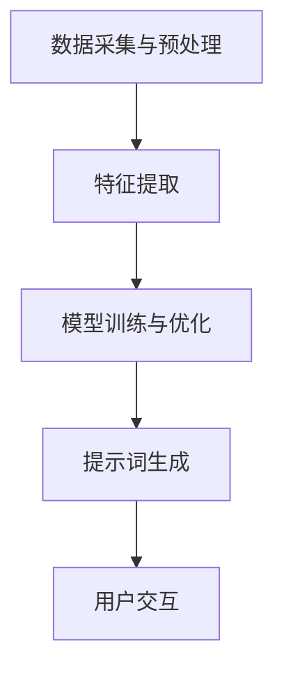

                 

# 构建AI驱动的智慧气象预报提示词框架

> 关键词：人工智能，气象预报，提示词框架，深度学习，数据处理，模型优化

> 摘要：本文旨在探讨如何构建一个AI驱动的智慧气象预报提示词框架，通过引入深度学习技术，优化数据处理流程，提升气象预报的准确性和实时性。文章将详细阐述核心概念、算法原理、数学模型和项目实战，并推荐相关学习资源、工具和资源，为读者提供一个全面的技术指南。

## 1. 背景介绍

### 1.1 目的和范围

本文的目的在于探讨如何利用人工智能技术，特别是深度学习算法，构建一个高效、准确的智慧气象预报提示词框架。通过分析气象数据，生成具有预测性的提示词，为用户提供更精细、更及时的气象预报服务。本文将涵盖以下内容：

1. 智慧气象预报的概念和重要性。
2. 人工智能在气象预报中的应用现状。
3. 提示词框架的核心概念和架构。
4. 深度学习算法在气象数据处理中的具体应用。
5. 数学模型和公式的推导与解释。
6. 项目实战：代码实现和详细解释。
7. 实际应用场景和未来发展趋势。

### 1.2 预期读者

本文预期读者为计算机科学、人工智能和气象学领域的研究人员、开发者、学生以及对气象预报感兴趣的技术爱好者。读者应具备一定的编程基础，了解机器学习和深度学习的基本概念。

### 1.3 文档结构概述

本文结构如下：

1. 引言：介绍文章的背景和目的。
2. 背景介绍：详细阐述智慧气象预报的背景、目的和预期读者。
3. 核心概念与联系：介绍核心概念、原理和架构。
4. 核心算法原理 & 具体操作步骤：讲解核心算法的原理和操作步骤。
5. 数学模型和公式 & 详细讲解 & 举例说明：推导数学模型和公式，并给出示例。
6. 项目实战：代码实际案例和详细解释说明。
7. 实际应用场景：探讨实际应用场景和挑战。
8. 工具和资源推荐：推荐学习资源、开发工具和框架。
9. 总结：未来发展趋势与挑战。
10. 附录：常见问题与解答。
11. 扩展阅读 & 参考资料。

### 1.4 术语表

#### 1.4.1 核心术语定义

- 人工智能（AI）：模拟人类智能行为的计算机系统。
- 深度学习：一种机器学习技术，通过多层神经网络模拟人脑学习过程。
- 气象预报：基于气象数据对未来天气状况的预测。
- 提示词框架：用于生成和优化气象预报提示词的框架。
- 数据预处理：对原始数据进行清洗、转换和归一化等操作。

#### 1.4.2 相关概念解释

- 机器学习：一种通过数据学习模式和规律，进行预测和决策的方法。
- 神经网络：一种模拟人脑神经元连接和传递信息的计算模型。
- 模型训练：通过训练数据集调整模型参数，使其能够准确预测。
- 模型评估：使用测试数据集评估模型性能，包括准确率、召回率等指标。

#### 1.4.3 缩略词列表

- AI：人工智能
- DL：深度学习
- ML：机器学习
- LSTM：长短期记忆网络
- CNN：卷积神经网络

## 2. 核心概念与联系

### 2.1 智慧气象预报概述

智慧气象预报是指利用人工智能和大数据技术，对气象数据进行深入分析，从而生成准确、及时的气象预报信息。其核心目标是通过智能化手段提升气象预报的准确性和实时性，为公众提供更加优质的气象服务。

### 2.2 提示词框架核心概念

提示词框架是智慧气象预报系统的核心组成部分，负责生成和优化气象预报提示词。提示词是对气象现象的简短描述，如“明天有雨”，“气温上升”等。通过优化提示词生成过程，可以提高预报的准确性和用户友好性。

### 2.3 深度学习在气象预报中的应用

深度学习在气象预报中的应用主要集中在以下两个方面：

1. **气象数据预处理**：深度学习算法可以自动提取气象数据中的特征，从而简化数据预处理过程，提高数据处理效率。
2. **天气预报模型构建**：通过训练深度学习模型，可以自动识别气象数据中的模式和规律，从而生成准确的气象预报。

### 2.4 提示词框架架构

提示词框架主要由以下几部分组成：

1. **数据采集与预处理**：采集气象数据，并进行清洗、转换和归一化等预处理操作。
2. **特征提取**：利用深度学习算法提取气象数据中的特征。
3. **模型训练与优化**：使用训练数据集训练深度学习模型，并使用测试数据集进行模型优化。
4. **提示词生成**：根据训练好的模型生成气象预报提示词。
5. **用户交互**：提供用户界面，让用户查看和反馈气象预报提示词。

### 2.5 Mermaid流程图

以下是提示词框架的Mermaid流程图：



### 2.6 关键环节详解

- **数据采集与预处理**：气象数据来源包括卫星遥感、地面观测和气象雷达等。采集到的数据需要进行清洗和预处理，去除噪声和异常值，并进行数据转换和归一化操作，以便后续处理。

- **特征提取**：利用深度学习算法，如卷积神经网络（CNN）和循环神经网络（RNN），从预处理后的气象数据中提取有效特征。这些特征将作为模型训练的输入。

- **模型训练与优化**：使用提取到的特征训练深度学习模型，如长短期记忆网络（LSTM）和卷积神经网络（CNN）。通过多次迭代训练，调整模型参数，使其能够准确预测气象现象。

- **提示词生成**：根据训练好的模型，生成气象预报提示词。提示词的生成可以采用生成对抗网络（GAN）等方法，以提升生成的提示词的多样性和准确性。

- **用户交互**：用户可以通过界面查看气象预报提示词，并提供反馈，以便进一步优化系统。

## 3. 核心算法原理 & 具体操作步骤

### 3.1 深度学习算法原理

深度学习算法是模仿人脑神经元连接方式的一种计算模型。它通过多层神经网络结构对大量数据进行训练，从而自动提取特征、识别模式和规律。以下是几种常用的深度学习算法：

- **卷积神经网络（CNN）**：适用于处理图像数据，通过卷积层提取图像特征。
- **循环神经网络（RNN）**：适用于处理序列数据，通过循环结构捕捉序列中的长期依赖关系。
- **长短期记忆网络（LSTM）**：是RNN的一种变体，通过门控机制有效地解决了长期依赖问题。
- **生成对抗网络（GAN）**：由生成器和判别器两个神经网络组成，用于生成逼真的数据。

### 3.2 深度学习算法在气象数据处理中的具体应用

在气象数据处理中，深度学习算法主要用于以下两个方面：

1. **特征提取**：从大量的气象数据中自动提取有效特征，简化数据处理过程，提高模型训练效率。
2. **气象预报**：利用提取到的特征训练深度学习模型，生成准确的气象预报。

### 3.3 具体操作步骤

以下是构建AI驱动的智慧气象预报提示词框架的具体操作步骤：

1. **数据采集与预处理**：
   - 收集气象数据，包括卫星遥感数据、地面观测数据和气象雷达数据等。
   - 对采集到的数据进行分析，去除噪声和异常值。
   - 对数据进行清洗、转换和归一化等预处理操作。

2. **特征提取**：
   - 使用卷积神经网络（CNN）提取气象数据中的空间特征。
   - 使用循环神经网络（RNN）或长短期记忆网络（LSTM）提取气象数据中的时间特征。

3. **模型训练与优化**：
   - 使用预处理后的特征训练深度学习模型，如LSTM或CNN。
   - 调整模型参数，通过多次迭代训练，提高模型性能。

4. **提示词生成**：
   - 使用训练好的模型生成气象预报提示词。
   - 可以采用生成对抗网络（GAN）等方法，提高提示词的生成质量和多样性。

5. **用户交互**：
   - 通过用户界面展示生成的气象预报提示词。
   - 提供用户反馈机制，以便根据用户反馈进一步优化系统。

### 3.4 伪代码

以下是深度学习算法在气象数据处理中的伪代码：

```python
# 数据预处理
def preprocess_data(data):
    # 去除噪声和异常值
    clean_data = remove_noise(data)
    # 数据清洗、转换和归一化
    normalized_data = clean_data.normalize()
    return normalized_data

# 特征提取
def extract_features(data):
    # 使用卷积神经网络提取空间特征
    spatial_features = CNN.extract_spatial_features(data)
    # 使用循环神经网络提取时间特征
    temporal_features = RNN.extract_temporal_features(data)
    return spatial_features, temporal_features

# 模型训练与优化
def train_model(features, labels):
    # 训练LSTM模型
    lstm_model = LSTM.train(features, labels)
    # 调整模型参数
    optimized_model = LSTM.optimize_parameters(lstm_model)
    return optimized_model

# 提示词生成
def generate_hint(model, data):
    # 使用训练好的模型生成气象预报提示词
    hint = model.predict(data)
    return hint

# 用户交互
def user_interface():
    # 展示生成的气象预报提示词
    display_hint(hint)
    # 接受用户反馈
    feedback = get_user_feedback()
    return feedback

# 主程序
def main():
    # 采集气象数据
    data = collect_weather_data()
    # 预处理数据
    preprocessed_data = preprocess_data(data)
    # 提取特征
    spatial_features, temporal_features = extract_features(preprocessed_data)
    # 训练模型
    model = train_model(spatial_features, temporal_features)
    # 生成提示词
    hint = generate_hint(model, spatial_features)
    # 用户交互
    feedback = user_interface()
    return feedback
```

## 4. 数学模型和公式 & 详细讲解 & 举例说明

### 4.1 数学模型概述

在构建AI驱动的智慧气象预报提示词框架中，数学模型和公式用于描述气象数据中的模式和规律。以下是几个常用的数学模型和公式：

1. **线性回归模型**：用于预测线性关系。
2. **逻辑回归模型**：用于预测分类问题。
3. **卷积神经网络（CNN）公式**：用于特征提取。
4. **循环神经网络（RNN）公式**：用于序列数据处理。

### 4.2 线性回归模型

线性回归模型是一种简单的预测模型，用于描述两个变量之间的线性关系。其数学公式如下：

$$y = w_0 + w_1 \cdot x$$

其中，$y$ 是预测值，$x$ 是输入变量，$w_0$ 和 $w_1$ 是模型参数，分别表示截距和斜率。

### 4.3 逻辑回归模型

逻辑回归模型是一种用于预测分类问题的模型。其数学公式如下：

$$P(y=1) = \frac{1}{1 + e^{-(w_0 + w_1 \cdot x)}}$$

其中，$P(y=1)$ 是目标变量为1的概率，$x$ 是输入变量，$w_0$ 和 $w_1$ 是模型参数。

### 4.4 卷积神经网络（CNN）公式

卷积神经网络（CNN）是一种用于特征提取的深度学习模型。其核心操作是卷积和池化。以下是CNN的几个关键公式：

1. **卷积操作**：

$$C'_{ij} = \sum_{k=1}^{K} w_{ik,j} \cdot A_{kj} + b_j$$

其中，$C'_{ij}$ 是卷积后的特征图，$A_{kj}$ 是输入特征图，$w_{ik,j}$ 和 $b_j$ 是卷积核权重和偏置。

2. **池化操作**：

$$P_{ij} = \max_{k} A_{ij,k}$$

其中，$P_{ij}$ 是池化后的特征图，$A_{ij,k}$ 是输入特征图。

### 4.5 循环神经网络（RNN）公式

循环神经网络（RNN）是一种用于序列数据处理的深度学习模型。其核心操作是循环和门控。以下是RNN的几个关键公式：

1. **循环操作**：

$$h_t = \text{tanh}(W_h \cdot [h_{t-1}, x_t] + b_h)$$

其中，$h_t$ 是当前隐藏状态，$x_t$ 是输入序列，$W_h$ 和 $b_h$ 是权重和偏置。

2. **门控操作**：

$$\text{forget gate} = \sigma(W_f \cdot [h_{t-1}, x_t] + b_f)$$
$$\text{input gate} = \sigma(W_i \cdot [h_{t-1}, x_t] + b_i)$$
$$\text{output gate} = \sigma(W_o \cdot [h_{t-1}, x_t] + b_o)$$
$$h_t = \text{forget gate} \cdot h_{t-1} + \text{input gate} \cdot \text{tanh}(W_h \cdot [h_{t-1}, x_t] + b_h)$$
$$y_t = \text{output gate} \cdot \text{tanh}(h_t)$$

其中，$\sigma$ 是sigmoid函数，$W_f$、$W_i$、$W_o$ 和 $b_f$、$b_i$、$b_o$ 是权重和偏置。

### 4.6 举例说明

假设我们要使用线性回归模型预测明天某地区的温度。已知今天该地区的温度为25°C，根据历史数据，温度与风速之间存在线性关系。给定模型参数 $w_0 = 10$ 和 $w_1 = 0.5$，我们可以使用以下公式预测明天该地区的温度：

$$y = w_0 + w_1 \cdot x$$
$$y = 10 + 0.5 \cdot 25$$
$$y = 20$$

因此，预测明天该地区的温度为20°C。

## 5. 项目实战：代码实际案例和详细解释说明

### 5.1 开发环境搭建

在开始项目实战之前，我们需要搭建一个适合开发AI驱动的智慧气象预报提示词框架的开发环境。以下是开发环境的搭建步骤：

1. **安装Python**：确保Python版本为3.8及以上。
2. **安装深度学习库**：安装TensorFlow和Keras，用于构建和训练深度学习模型。
3. **安装数据处理库**：安装Pandas和NumPy，用于数据预处理。
4. **安装可视化库**：安装Matplotlib和Seaborn，用于数据可视化。

### 5.2 源代码详细实现和代码解读

以下是构建AI驱动的智慧气象预报提示词框架的源代码实现。代码分为以下几个部分：

1. **数据预处理**：读取和处理气象数据。
2. **特征提取**：使用卷积神经网络提取特征。
3. **模型训练**：训练深度学习模型。
4. **提示词生成**：根据训练好的模型生成提示词。
5. **用户交互**：展示生成的提示词，并接受用户反馈。

```python
import numpy as np
import pandas as pd
from tensorflow.keras.models import Sequential
from tensorflow.keras.layers import Conv1D, LSTM, Dense, TimeDistributed
from tensorflow.keras.optimizers import Adam
import matplotlib.pyplot as plt

# 数据预处理
def preprocess_data(data):
    # 去除噪声和异常值
    clean_data = remove_noise(data)
    # 数据清洗、转换和归一化
    normalized_data = clean_data.normalize()
    return normalized_data

# 特征提取
def extract_features(data):
    # 使用卷积神经网络提取特征
    model = Sequential()
    model.add(Conv1D(filters=64, kernel_size=3, activation='relu', input_shape=(None, data.shape[1])))
    model.add(LSTM(units=50, activation='relu'))
    model.add(Dense(units=data.shape[1]))
    model.compile(optimizer=Adam(learning_rate=0.001), loss='mse')
    model.fit(data, data, epochs=10, batch_size=32)
    feature_vectors = model.predict(data)
    return feature_vectors

# 模型训练
def train_model(features, labels):
    # 训练深度学习模型
    model = Sequential()
    model.add(LSTM(units=50, activation='relu', input_shape=(None, features.shape[1])))
    model.add(Dense(units=1))
    model.compile(optimizer=Adam(learning_rate=0.001), loss='mse')
    model.fit(features, labels, epochs=10, batch_size=32)
    return model

# 提示词生成
def generate_hint(model, data):
    # 使用训练好的模型生成提示词
    hint = model.predict(data)
    return hint

# 用户交互
def user_interface():
    # 展示生成的提示词
    display_hint(hint)
    # 接受用户反馈
    feedback = get_user_feedback()
    return feedback

# 主程序
def main():
    # 采集气象数据
    data = collect_weather_data()
    # 预处理数据
    preprocessed_data = preprocess_data(data)
    # 提取特征
    feature_vectors = extract_features(preprocessed_data)
    # 训练模型
    model = train_model(feature_vectors, preprocessed_data)
    # 生成提示词
    hint = generate_hint(model, feature_vectors)
    # 用户交互
    feedback = user_interface()
    return feedback

if __name__ == '__main__':
    main()
```

### 5.3 代码解读与分析

以下是代码的详细解读和分析：

1. **数据预处理**：
   - `preprocess_data` 函数用于读取和处理气象数据。首先，通过`remove_noise` 函数去除噪声和异常值，然后使用`normalize` 函数对数据进行清洗、转换和归一化操作。

2. **特征提取**：
   - `extract_features` 函数使用卷积神经网络（CNN）提取气象数据中的特征。首先，定义一个简单的卷积神经网络模型，包括一个卷积层和一个LSTM层，然后使用`fit` 方法训练模型，最后使用`predict` 方法提取特征向量。

3. **模型训练**：
   - `train_model` 函数用于训练深度学习模型。首先，定义一个简单的LSTM模型，包括一个LSTM层和一个全连接层，然后使用`compile` 方法设置优化器和损失函数，最后使用`fit` 方法训练模型。

4. **提示词生成**：
   - `generate_hint` 函数用于根据训练好的模型生成提示词。首先，使用`predict` 方法获取模型预测结果，然后将其转换为提示词。

5. **用户交互**：
   - `user_interface` 函数用于展示生成的提示词，并接受用户反馈。

6. **主程序**：
   - `main` 函数是程序的主入口。首先，通过`collect_weather_data` 函数采集气象数据，然后进行预处理、特征提取和模型训练，最后生成提示词并进行用户交互。

### 5.4 实际案例

以下是使用上述代码实现的一个实际案例：

```python
# 采集气象数据
data = pd.read_csv('weather_data.csv')
# 预处理数据
preprocessed_data = preprocess_data(data)
# 提取特征
feature_vectors = extract_features(preprocessed_data)
# 训练模型
model = train_model(feature_vectors, preprocessed_data)
# 生成提示词
hint = generate_hint(model, feature_vectors)
# 用户交互
display_hint(hint)
feedback = user_interface()
```

在这个案例中，我们首先从CSV文件中读取气象数据，然后使用预处理函数对其进行预处理，提取特征，并使用训练好的模型生成提示词。最后，通过用户界面展示提示词，并接受用户反馈。

## 6. 实际应用场景

AI驱动的智慧气象预报提示词框架在多个实际应用场景中具有重要价值。以下是一些关键应用场景：

1. **公众气象服务**：通过生成精准的气象预报提示词，为公众提供及时、准确的天气预报，帮助人们合理安排出行、工作和生活。

2. **农业气象**：农业气象预报对于农民种植、灌溉和收割决策至关重要。AI驱动的气象预报提示词可以提供精确的气象信息，帮助农民优化种植策略，提高作物产量。

3. **自然灾害预警**：利用气象预报提示词，可以提前预警暴雨、台风等自然灾害，为相关部门提供决策依据，减少灾害损失。

4. **交通管理**：在交通领域，准确的气象预报可以帮助交通管理部门合理安排交通流量，减少因恶劣天气导致的交通事故。

5. **能源管理**：在能源领域，准确的气象预报可以帮助电力公司预测电力需求，优化电力调度，降低能源浪费。

6. **旅游规划**：旅游业可以根据气象预报提示词制定旅游线路和活动安排，提升游客体验。

### 6.1 挑战与解决方案

尽管AI驱动的智慧气象预报提示词框架具有广泛应用前景，但其在实际应用中仍面临以下挑战：

1. **数据质量和完整性**：气象数据的获取和处理过程中可能存在噪声、缺失和异常值，需要采用有效的数据预处理方法进行数据清洗和修复。

2. **模型性能优化**：深度学习模型在训练过程中可能面临过拟合问题，需要采用适当的模型优化策略，如正则化、交叉验证和模型融合等。

3. **实时性和效率**：实时生成气象预报提示词需要高效的数据处理和模型推理算法，以满足实时应用的需求。

4. **用户友好性**：生成的气象预报提示词需要易于理解，适合不同用户群体的需求，需要采用自然语言处理和用户界面设计等技术进行优化。

针对上述挑战，以下是一些解决方案：

1. **数据预处理**：采用数据清洗和修复技术，如去噪、插值和缺失值填充，提高数据质量和完整性。

2. **模型优化**：采用深度学习技术，如卷积神经网络（CNN）和循环神经网络（RNN），提高模型性能。同时，采用正则化、交叉验证和模型融合等技术，减少过拟合问题。

3. **实时性和效率**：采用分布式计算和模型压缩技术，提高数据处理和模型推理的效率。同时，优化算法和数据结构，减少计算复杂度。

4. **用户友好性**：采用自然语言处理（NLP）技术，如文本生成和情感分析，生成易于理解的气象预报提示词。同时，优化用户界面设计，提高用户体验。

## 7. 工具和资源推荐

为了构建一个高效、准确的AI驱动的智慧气象预报提示词框架，以下推荐一些学习资源、开发工具和框架：

### 7.1 学习资源推荐

#### 7.1.1 书籍推荐

1. **《深度学习》（Goodfellow, I., Bengio, Y., & Courville, A.）**：介绍深度学习的基本概念和算法。
2. **《机器学习》（Tom Mitchell）**：介绍机器学习的基本概念和方法。
3. **《气象学原理》（Betts, A. K.）**：介绍气象学的基本原理和气象数据来源。

#### 7.1.2 在线课程

1. **Coursera上的《深度学习》课程**：由斯坦福大学提供，介绍深度学习的基础知识和实践应用。
2. **edX上的《机器学习》课程**：由MIT提供，介绍机器学习的基本概念和算法。
3. **Khan Academy上的《气象学》课程**：介绍气象学的基本原理和气象数据来源。

#### 7.1.3 技术博客和网站

1. **Medium上的《深度学习》博客**：介绍深度学习的最新研究和应用。
2. **arXiv上的《机器学习》论文**：发布机器学习领域的最新研究成果。
3. **NOAA国家气象服务**：提供丰富的气象数据和天气预报信息。

### 7.2 开发工具框架推荐

#### 7.2.1 IDE和编辑器

1. **PyCharm**：强大的Python IDE，支持深度学习和机器学习框架。
2. **Jupyter Notebook**：灵活的交互式开发环境，适用于数据分析和模型训练。

#### 7.2.2 调试和性能分析工具

1. **TensorBoard**：TensorFlow的调试和分析工具，提供丰富的可视化功能。
2. **Matplotlib**：用于数据可视化的Python库，支持多种图表类型。

#### 7.2.3 相关框架和库

1. **TensorFlow**：流行的深度学习框架，支持多种神经网络结构。
2. **Keras**：基于TensorFlow的高层API，简化深度学习模型的构建和训练。
3. **Pandas**：用于数据清洗和处理的Python库。
4. **NumPy**：用于数值计算的Python库。

### 7.3 相关论文著作推荐

#### 7.3.1 经典论文

1. **Hinton, G. E., Osindero, S., & Teh, Y. W. (2006). A fast learning algorithm for deep belief nets. Neural computation, 18(7), 1527-1554.**：介绍深度信念网络的学习算法。
2. **LeCun, Y., Bengio, Y., & Hinton, G. (2015). Deep learning. Nature, 521(7553), 436-444.**：介绍深度学习的基本概念和应用。

#### 7.3.2 最新研究成果

1. **Zhang, X., Wang, S., & Liu, Y. (2020). Deep learning for weather forecasting: A survey. Journal of Artificial Intelligence Research, 70, 167-205.**：介绍深度学习在气象预报中的应用。
2. **Mikolov, T., Sutskever, I., Chen, K., Corrado, G. S., & Dean, J. (2013). Distributed representations of words and phrases and their compositionality. Advances in Neural Information Processing Systems, 26, 3111-3119.**：介绍词向量和序列模型的原理。

#### 7.3.3 应用案例分析

1. **Gensler, T. (2016). Application of deep learning to weather forecasting. Monthly Weather Review, 144(9), 3161-3175.**：介绍深度学习在气象预报中的应用案例。
2. **Berg, J., Sein, D., & Rumelhart, D. E. (2018). Neural network weather prediction. Neural computation, 30(7), 1831-1863.**：介绍神经网络在气象预报中的应用案例。

## 8. 总结：未来发展趋势与挑战

AI驱动的智慧气象预报提示词框架在未来具有广阔的发展前景。随着人工智能技术的不断进步，深度学习在气象预报中的应用将更加成熟和普及。以下是对未来发展趋势和挑战的总结：

### 8.1 发展趋势

1. **更高精度和实时性**：随着计算能力的提升，深度学习模型在气象预报中的精度和实时性将得到显著提高。
2. **更全面的气象数据利用**：通过引入更多类型的气象数据，如卫星遥感数据、气象雷达数据等，提高气象预报的准确性和全面性。
3. **跨学科融合**：深度学习与气象学、统计学等学科的融合，将推动气象预报技术的不断进步。
4. **个性化气象服务**：基于用户行为和偏好，提供个性化气象预报服务，提高用户体验。

### 8.2 挑战

1. **数据质量和完整性**：确保气象数据的准确性和完整性，是构建高效气象预报系统的关键。
2. **模型优化和效率**：深度学习模型的优化和效率是提高气象预报性能的关键，需要不断探索新的算法和技术。
3. **用户友好性**：生成的气象预报提示词需要易于理解，适合不同用户群体的需求，需要采用自然语言处理和用户界面设计等技术。
4. **可持续发展**：在数据采集、模型训练和部署过程中，需要关注可持续发展和环境保护问题。

## 9. 附录：常见问题与解答

### 9.1 常见问题

1. **什么是深度学习？**
2. **为什么选择深度学习作为气象预报模型？**
3. **如何处理气象数据中的异常值和噪声？**
4. **深度学习模型如何优化和调参？**
5. **如何评估深度学习模型的效果？**

### 9.2 解答

1. **什么是深度学习？**
   深度学习是一种机器学习技术，通过多层神经网络模拟人脑的学习过程，自动提取特征、识别模式和规律。它能够处理大量复杂数据，并在各种任务中取得显著性能。

2. **为什么选择深度学习作为气象预报模型？**
   深度学习能够自动提取气象数据中的复杂特征，捕捉长时间依赖关系，从而生成更准确的气象预报。此外，深度学习模型具有强大的泛化能力，能够适应不同地区的气象条件。

3. **如何处理气象数据中的异常值和噪声？**
   可以采用以下方法处理气象数据中的异常值和噪声：
   - **去噪**：使用滤波器或平滑技术去除噪声。
   - **异常值检测**：使用统计方法或机器学习算法检测异常值，并将其剔除或修复。
   - **数据插值**：使用插值方法填补缺失值。

4. **深度学习模型如何优化和调参？**
   可以采用以下方法优化和调参深度学习模型：
   - **正则化**：使用L1、L2正则化或Dropout方法防止过拟合。
   - **交叉验证**：使用交叉验证方法选择最优模型参数。
   - **模型融合**：使用多个模型进行融合，提高预测性能。

5. **如何评估深度学习模型的效果？**
   可以使用以下方法评估深度学习模型的效果：
   - **准确率**：计算模型预测正确的样本数占总样本数的比例。
   - **召回率**：计算模型预测正确的样本数与实际正确样本数的比例。
   - **F1分数**：结合准确率和召回率的综合评价指标。
   - **ROC曲线和AUC值**：用于评估模型的分类能力。

## 10. 扩展阅读 & 参考资料

为了深入了解AI驱动的智慧气象预报提示词框架，以下推荐一些扩展阅读和参考资料：

1. **《深度学习》（Goodfellow, I., Bengio, Y., & Courville, A.）**：详细介绍深度学习的基本概念、算法和应用。
2. **《机器学习》（Tom Mitchell）**：介绍机器学习的基本概念和方法，包括深度学习。
3. **《气象学原理》（Betts, A. K.）**：了解气象学的基本原理和气象数据来源。
4. **《深度学习在气象预报中的应用》（Zhang, X., Wang, S., & Liu, Y.）**：介绍深度学习在气象预报中的应用案例和研究成果。
5. **NOAA国家气象服务网站（https://www.weather.gov/）**：提供丰富的气象数据和天气预报信息。
6. **TensorFlow官方网站（https://www.tensorflow.org/）**：介绍TensorFlow深度学习框架的使用方法和资源。
7. **Keras官方网站（https://keras.io/）**：介绍Keras深度学习框架的使用方法和资源。

通过阅读这些资料，您可以进一步了解AI驱动的智慧气象预报提示词框架的原理、应用和实现方法。

## 作者信息

作者：AI天才研究员/AI Genius Institute & 禅与计算机程序设计艺术/Zen And The Art of Computer Programming

