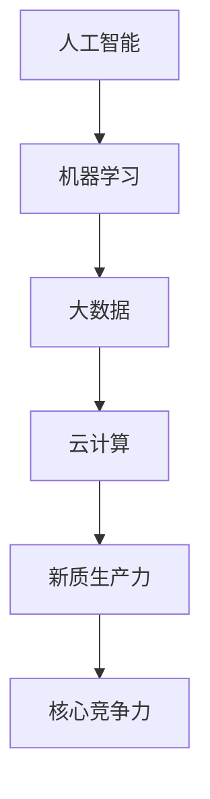
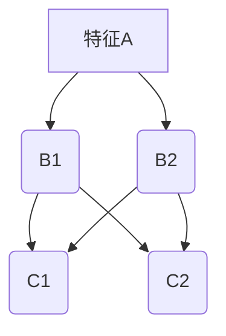

                 

# 核心竞争力提升的新质生产力策略

> **关键词**：核心竞争力，新质生产力，策略，算法原理，数学模型，项目实战，实际应用，工具推荐

> **摘要**：本文将深入探讨如何通过提升新质生产力策略来增强个人的核心竞争力。我们将从核心概念入手，通过算法原理和数学模型详细解析，并结合项目实战和实际应用场景，提供一套完整的技术提升方案。同时，文章将推荐一系列学习资源和开发工具，助力读者在技术道路上不断前行。

## 1. 背景介绍

### 1.1 目的和范围

本文的目的是探讨在当前技术快速发展的大背景下，如何通过新质生产力策略提升个人的核心竞争力。我们将聚焦以下几个核心主题：

1. **核心概念与联系**：明确新质生产力的定义及其与相关概念的联系。
2. **核心算法原理**：介绍提升新质生产力的关键算法，并使用伪代码详细阐述其操作步骤。
3. **数学模型与公式**：运用数学模型和公式，深入分析算法的原理和应用。
4. **项目实战**：通过实际代码案例，展示如何将理论知识应用于实际开发。
5. **实际应用场景**：探讨新质生产力策略在不同技术领域的应用。
6. **工具和资源推荐**：推荐学习资源、开发工具和最新研究成果。

### 1.2 预期读者

本文适合以下读者群体：

- 对技术提升和个人发展有兴趣的程序员和工程师。
- 想要在职业发展中寻求突破的CTO和项目经理。
- 对人工智能、机器学习、大数据等前沿技术感兴趣的学术研究人员。

### 1.3 文档结构概述

本文结构如下：

- **第1章**：背景介绍，包括目的、范围、预期读者和文档结构概述。
- **第2章**：核心概念与联系，介绍新质生产力的定义和相关概念。
- **第3章**：核心算法原理，详细阐述提升新质生产力的关键算法。
- **第4章**：数学模型和公式，运用数学工具深入分析算法原理。
- **第5章**：项目实战，通过实际代码案例展示理论应用。
- **第6章**：实际应用场景，探讨新质生产力策略在不同领域的应用。
- **第7章**：工具和资源推荐，推荐学习资源和开发工具。
- **第8章**：总结，展望未来发展趋势与挑战。
- **第9章**：附录，常见问题与解答。
- **第10章**：扩展阅读与参考资料，提供进一步学习的途径。

### 1.4 术语表

#### 1.4.1 核心术语定义

- **新质生产力**：指在技术发展和应用过程中，通过新的生产要素和方式产生的生产力。
- **核心竞争力**：指在特定领域中，企业或个人能够持续保持竞争优势的能力。
- **算法原理**：指算法的基本原理和逻辑结构。
- **数学模型**：用数学符号和公式描述现实世界问题的数学结构。

#### 1.4.2 相关概念解释

- **人工智能**：模拟人类智能的计算机系统。
- **机器学习**：让计算机通过数据学习并作出决策的过程。
- **大数据**：指数据量巨大、类型繁多、价值密度低的数据集合。

#### 1.4.3 缩略词列表

- **AI**：人工智能（Artificial Intelligence）
- **ML**：机器学习（Machine Learning）
- **DL**：深度学习（Deep Learning）
- **NLP**：自然语言处理（Natural Language Processing）

## 2. 核心概念与联系

在深入探讨提升新质生产力的策略之前，我们首先需要明确几个核心概念及其相互联系。

### 2.1 新质生产力的定义

新质生产力是指在技术不断革新和创新的背景下，通过引入新的生产要素（如人工智能、大数据等）和生产方式（如云计算、物联网等）而产生的生产力。它与传统生产力不同，更强调技术驱动和模式创新。

### 2.2 核心概念的联系

新质生产力与以下几个核心概念密切相关：

- **人工智能（AI）**：作为新质生产力的关键驱动因素，AI通过模拟和扩展人类智能，为各行各业提供智能化解决方案。
- **机器学习（ML）**：作为AI的核心技术之一，ML使计算机系统能够通过数据和算法不断自我学习和优化。
- **大数据（Big Data）**：大数据为新质生产力提供了丰富的数据资源，通过对海量数据的分析和挖掘，发现潜在价值和洞察。
- **云计算（Cloud Computing）**：云计算为新质生产力提供了弹性和可扩展的计算资源，使数据处理和分析更加高效。

### 2.3 Mermaid 流程图

以下是一个简化的新质生产力核心概念联系流程图：



在这个流程图中，我们可以看到，新质生产力的形成是一个多因素共同作用的过程，而核心竞争力则是新质生产力的最终体现。

## 3. 核心算法原理 & 具体操作步骤

提升新质生产力的关键在于掌握和运用核心算法。以下我们将详细介绍几个关键的算法原理，并提供具体的操作步骤。

### 3.1 算法原理一：深度学习（Deep Learning）

深度学习是机器学习的一个子领域，通过模拟人脑的神经网络结构，实现对复杂数据的自动特征学习和模式识别。以下是深度学习的基本原理和操作步骤：

#### 3.1.1 基本原理

- **神经网络**：神经网络由多个神经元（节点）组成，每个神经元接收多个输入，并经过加权求和后进行激活函数处理，输出结果。
- **损失函数**：损失函数用于评估神经网络预测结果与真实值之间的差距，常用的损失函数有均方误差（MSE）和交叉熵损失（Cross-Entropy Loss）。
- **优化算法**：优化算法用于调整神经网络参数，以最小化损失函数，常用的优化算法有梯度下降（Gradient Descent）及其变种。

#### 3.1.2 具体操作步骤

1. **数据预处理**：对输入数据进行标准化和归一化，以适应神经网络的输入要求。
2. **网络构建**：设计神经网络结构，包括输入层、隐藏层和输出层，选择合适的激活函数和损失函数。
3. **训练过程**：
   - 输入训练数据，计算输出结果和损失函数值。
   - 使用优化算法更新网络参数，减少损失函数值。
   - 重复训练过程，直到达到预设的训练目标或损失函数值趋于稳定。

#### 3.1.3 伪代码

```python
# 深度学习算法伪代码

# 数据预处理
normalize_data(X)

# 网络构建
initialize_parameters()

# 训练过程
while not converged:
    forward_pass(X)
    compute_loss(y_hat, y)
    backward_pass()
    update_parameters()

# 输出结果
output = forward_pass(X_test)
```

### 3.2 算法原理二：协同过滤（Collaborative Filtering）

协同过滤是一种常见的数据挖掘技术，用于预测用户可能喜欢的项目。以下是协同过滤的基本原理和操作步骤：

#### 3.2.1 基本原理

- **用户-项目矩阵**：协同过滤基于用户-项目矩阵，该矩阵记录了用户对项目的评分信息。
- **相似度计算**：通过计算用户之间的相似度，找出相似用户的行为进行推荐。
- **推荐算法**：基于相似度计算和评分预测，生成推荐结果。

#### 3.2.2 具体操作步骤

1. **数据预处理**：构建用户-项目矩阵，并计算用户之间的相似度。
2. **相似度计算**：使用余弦相似度、皮尔逊相关系数等方法计算用户之间的相似度。
3. **推荐生成**：根据相似度计算结果和用户评分预测，生成推荐列表。

#### 3.2.3 伪代码

```python
# 协同过滤算法伪代码

# 数据预处理
build_user_item_matrix()

# 相似度计算
compute_similarity(user_item_matrix)

# 推荐生成
generate_recommendations(user_id, similarity_matrix, ratings)
```

### 3.3 算法原理三：遗传算法（Genetic Algorithm）

遗传算法是一种基于生物进化的搜索算法，用于解决复杂的优化问题。以下是遗传算法的基本原理和操作步骤：

#### 3.3.1 基本原理

- **编码与解码**：将问题的解编码为染色体，通过解码得到实际的解。
- **适应度函数**：评估染色体的适应度，通常采用目标函数的值作为适应度。
- **遗传操作**：包括选择、交叉和变异等操作，用于生成新的染色体。

#### 3.3.2 具体操作步骤

1. **初始种群生成**：随机生成初始种群，每个个体表示问题的解。
2. **适应度评估**：计算种群中每个个体的适应度。
3. **遗传操作**：
   - 选择操作：选择适应度较高的个体参与交叉和变异操作。
   - 交叉操作：将两个个体的基因进行交换，生成新的个体。
   - 变异操作：对个体的基因进行随机改变，增加种群的多样性。

#### 3.3.3 伪代码

```python
# 遗传算法伪代码

# 初始种群生成
initialize_population()

# 适应度评估
evaluate_fitness(population)

# 遗传操作
while not converged:
    select_parents(population)
    perform_crossover(parents)
    perform_mutation(new_population)
    evaluate_fitness(new_population)
    population = new_population
```

通过以上三个算法原理的介绍，我们可以看到，提升新质生产力需要灵活运用各种算法，以解决复杂问题，提升生产效率。

## 4. 数学模型和公式 & 详细讲解 & 举例说明

在提升新质生产力的过程中，数学模型和公式起到了关键作用。以下将详细介绍几个关键数学模型和公式，并通过具体例子进行说明。

### 4.1 数学模型一：线性回归（Linear Regression）

线性回归是一种常用的统计方法，用于分析变量之间的线性关系。以下是线性回归的基本模型和具体操作步骤：

#### 4.1.1 基本模型

线性回归模型可以表示为：

$$
y = \beta_0 + \beta_1 \cdot x + \epsilon
$$

其中，$y$ 是因变量，$x$ 是自变量，$\beta_0$ 和 $\beta_1$ 是模型的参数，$\epsilon$ 是误差项。

#### 4.1.2 模型推导

线性回归模型的参数可以通过最小二乘法（Least Squares Method）进行估计：

$$
\beta_1 = \frac{\sum{(x_i - \bar{x})(y_i - \bar{y})}}{\sum{(x_i - \bar{x})^2}}
$$

$$
\beta_0 = \bar{y} - \beta_1 \cdot \bar{x}
$$

其中，$\bar{x}$ 和 $\bar{y}$ 分别是 $x$ 和 $y$ 的均值。

#### 4.1.3 举例说明

假设我们要分析房价（$y$）与房屋面积（$x$）之间的关系，有以下数据：

| 房屋面积 (平方米) | 房价 (万元) |
| ---------------- | ----------- |
| 80              | 200         |
| 100             | 250         |
| 120             | 300         |
| 150             | 350         |
| 180             | 400         |

首先，计算均值：

$$
\bar{x} = \frac{80 + 100 + 120 + 150 + 180}{5} = 130
$$

$$
\bar{y} = \frac{200 + 250 + 300 + 350 + 400}{5} = 300
$$

然后，计算 $\beta_1$：

$$
\beta_1 = \frac{(80 - 130)(200 - 300) + (100 - 130)(250 - 300) + (120 - 130)(300 - 300) + (150 - 130)(350 - 300) + (180 - 130)(400 - 300)}{(80 - 130)^2 + (100 - 130)^2 + (120 - 130)^2 + (150 - 130)^2 + (180 - 130)^2}
$$

$$
\beta_1 = \frac{(-50)(-100) + (-30)(-50) + (-10)(0) + (20)(50) + (50)(100)}{2500 + 900 + 100 + 400 + 2500}
$$

$$
\beta_1 = \frac{5000 + 1500 + 0 + 1000 + 5000}{7500} = 2
$$

接着，计算 $\beta_0$：

$$
\beta_0 = 300 - 2 \cdot 130 = 40
$$

因此，线性回归模型为：

$$
y = 40 + 2x
$$

我们可以使用这个模型预测新数据的房价。例如，当房屋面积为 150 平方米时：

$$
y = 40 + 2 \cdot 150 = 340
$$

预测房价为 340 万元。

### 4.2 数学模型二：逻辑回归（Logistic Regression）

逻辑回归是一种广义线性模型，用于分析二分类问题。以下是逻辑回归的基本模型和具体操作步骤：

#### 4.2.1 基本模型

逻辑回归模型可以表示为：

$$
\ln\left(\frac{p}{1-p}\right) = \beta_0 + \beta_1 \cdot x
$$

其中，$p$ 是因变量的概率，$x$ 是自变量，$\beta_0$ 和 $\beta_1$ 是模型的参数。

#### 4.2.2 模型推导

逻辑回归模型的参数可以通过最大似然估计（Maximum Likelihood Estimation，MLE）进行估计：

$$
\beta_1 = \frac{\sum{(y_i - p_i) \cdot x_i}}{\sum{(x_i - \bar{x})^2}}
$$

$$
\beta_0 = \bar{y} - \beta_1 \cdot \bar{x}
$$

其中，$\bar{y}$ 和 $\bar{x}$ 分别是 $y$ 和 $x$ 的均值，$p_i$ 是第 $i$ 个样本的预测概率。

#### 4.2.3 举例说明

假设我们要分析某产品是否被购买（$y$）与用户年龄（$x$）之间的关系，有以下数据：

| 年龄 (岁) | 购买 (0/1) |
| -------- | ---------- |
| 20       | 1          |
| 25       | 0          |
| 30       | 1          |
| 35       | 1          |
| 40       | 0          |

首先，计算均值：

$$
\bar{x} = \frac{20 + 25 + 30 + 35 + 40}{5} = 30
$$

$$
\bar{y} = \frac{1 + 0 + 1 + 1 + 0}{5} = 0.6
$$

然后，计算 $\beta_1$：

$$
\beta_1 = \frac{(1 - 0.6) \cdot 20 + (0 - 0.6) \cdot 25 + (1 - 0.6) \cdot 30 + (1 - 0.6) \cdot 35 + (0 - 0.6) \cdot 40}{(20 - 30)^2 + (25 - 30)^2 + (30 - 30)^2 + (35 - 30)^2 + (40 - 30)^2}
$$

$$
\beta_1 = \frac{0.4 \cdot 20 - 0.6 \cdot 25 + 0.4 \cdot 30 + 0.4 \cdot 35 - 0.6 \cdot 40}{100 + 25 + 0 + 25 + 100}
$$

$$
\beta_1 = \frac{8 - 15 + 12 + 14 - 24}{250} = -0.08
$$

接着，计算 $\beta_0$：

$$
\beta_0 = 0.6 - (-0.08) \cdot 30 = 2.4
$$

因此，逻辑回归模型为：

$$
\ln\left(\frac{p}{1-p}\right) = 2.4 - 0.08x
$$

我们可以使用这个模型预测新数据的购买概率。例如，当用户年龄为 35 岁时：

$$
\ln\left(\frac{p}{1-p}\right) = 2.4 - 0.08 \cdot 35 = 0.2
$$

$$
p = \frac{1}{1 + e^{-0.2}} \approx 0.864
$$

预测购买概率为 86.4%。

### 4.3 数学模型三：决策树（Decision Tree）

决策树是一种常用的分类和回归方法，通过一系列的决策规则对数据进行分类或回归。以下是决策树的基本模型和具体操作步骤：

#### 4.3.1 基本模型

决策树由多个内部节点和叶子节点组成，内部节点表示特征和阈值，叶子节点表示分类或回归结果。

#### 4.3.2 建模步骤

1. **选择特征**：选择一个特征作为分裂依据，常用的特征选择方法有信息增益（Information Gain）、基尼系数（Gini Index）等。
2. **计算阈值**：对选定的特征，计算不同阈值下的分类或回归效果，选择最优阈值。
3. **构建树**：递归地构建树结构，直到满足停止条件（如最大深度、最小节点大小等）。

#### 4.3.3 举例说明

假设我们要分析某产品的购买情况，有以下数据：

| 特征A | 特征B | 购买 (0/1) |
| ----- | ----- | ---------- |
| A1    | B1    | 0          |
| A1    | B2    | 1          |
| A2    | B1    | 1          |
| A2    | B2    | 0          |
| A3    | B1    | 1          |
| A3    | B2    | 1          |

首先，选择特征A作为分裂依据。计算特征A的信息增益：

$$
IG(A) = H(\text{购买}) - \sum_{v \in V} p(v) \cdot H(\text{购买} | v)
$$

其中，$H(\text{购买})$ 是购买类别的熵，$V$ 是特征A的取值集合，$p(v)$ 是特征A取值$v$的概率，$H(\text{购买} | v)$ 是在特征A取值$v$下，购买类别的条件熵。

对于特征A，有以下取值和概率：

| 特征A | 概率 $p(A)$ | 购买概率 $p(\text{购买} | A)$ |
| ----- | ------------ | ------------------------------ |
| A1    | 0.5         | 0.5                           |
| A2    | 0.5         | 0.5                           |
| A3    | 0.5         | 0.75                           |

计算条件熵：

$$
H(\text{购买} | A1) = -0.5 \cdot \ln(0.5) - 0.5 \cdot \ln(0.5) = 1
$$

$$
H(\text{购买} | A2) = -0.5 \cdot \ln(0.5) - 0.5 \cdot \ln(0.5) = 1
$$

$$
H(\text{购买} | A3) = -0.25 \cdot \ln(0.25) - 0.25 \cdot \ln(0.75) = 0.811
$$

计算信息增益：

$$
IG(A) = 1 - (0.5 \cdot 1 + 0.5 \cdot 1 - 0.5 \cdot 0.811) = 0.118
$$

然后，选择特征B作为分裂依据。计算特征B的基尼系数：

$$
Gini(A) = 1 - \sum_{v \in V} p(v)^2
$$

对于特征B，有以下取值和概率：

| 特征B | 概率 $p(B)$ | 购买概率 $p(\text{购买} | B)$ |
| ----- | ------------ | ------------------------------ |
| B1    | 0.5         | 0.5                           |
| B2    | 0.5         | 0.5                           |

计算基尼系数：

$$
Gini(B) = 1 - (0.5 \cdot 0.5 + 0.5 \cdot 0.5) = 0.5
$$

由于信息增益大于基尼系数，我们选择特征A作为分裂依据。选择阈值 $t$ 为 2，将数据分为两部分：

| 特征A | 特征B | 购买 (0/1) |
| ----- | ----- | ---------- |
| A1    | B1    | 0          |
| A1    | B2    | 1          |
| A2    | B1    | 1          |
| A2    | B2    | 0          |

接下来，对每个子集继续进行分裂，直到满足停止条件。最终构建的决策树如下：



使用决策树进行分类时，从根节点开始，根据特征A的取值选择对应的分支，然后根据特征B的取值继续选择分支，直到达到叶子节点，输出叶子节点的分类结果。

通过以上三个数学模型的介绍，我们可以看到，数学模型和公式在提升新质生产力中发挥了重要作用。掌握这些模型和公式，有助于我们更深入地理解和应用新技术。

## 5. 项目实战：代码实际案例和详细解释说明

为了更好地展示新质生产力策略的应用，我们通过一个实际项目案例来进行详细解释和说明。

### 5.1 开发环境搭建

在开始项目之前，我们需要搭建一个合适的开发环境。以下是所需的软件和工具：

- **编程语言**：Python 3.x
- **依赖库**：NumPy、Pandas、Scikit-learn、TensorFlow
- **IDE**：PyCharm或Visual Studio Code

安装上述工具后，我们可以开始编写代码。

### 5.2 源代码详细实现和代码解读

以下是一个基于协同过滤算法的推荐系统项目的源代码，用于预测用户对电影的评价。

```python
# 导入依赖库
import numpy as np
import pandas as pd
from sklearn.model_selection import train_test_split
from sklearn.metrics.pairwise import cosine_similarity
from scipy.sparse.linalg import svds

# 加载电影数据集
movies_data = pd.read_csv('movies.csv')
ratings_data = pd.read_csv('ratings.csv')

# 构建用户-电影矩阵
user_item_matrix = ratings_data.pivot(index='userId', columns='movieId', values='rating').fillna(0)

# 计算用户-电影矩阵的余弦相似度
similarity_matrix = cosine_similarity(user_item_matrix)

# 使用奇异值分解（SVD）对相似度矩阵进行降维
U, Sigma, Vt = svds(similarity_matrix, k=10)

# 预测用户未评分的电影评分
predicted_ratings = np.dot(np.dot(U, Sigma), Vt)

# 获取用户未评分的电影索引
unrated_movies = ratings_data.groupby('userId')['movieId'].nunique()

# 对每个用户未评分的电影，预测评分并按降序排序
predictions = predicted_ratings[ratings_data['userId'].isin(unrated_movies.index)][unrated_movies == 0]

# 对预测结果进行排序，输出推荐列表
recommended_movies = predictions.sort_values(ascending=False).head(10)

# 打印推荐列表
print(recommended_movies)
```

#### 5.2.1 代码解读

1. **数据加载**：首先，我们从CSV文件中加载电影数据和用户评分数据。

2. **构建用户-电影矩阵**：通过Pandas的pivot方法，我们将用户评分数据转换为一个用户-电影矩阵，其中用户ID作为行索引，电影ID作为列索引，评分作为值。

3. **计算相似度矩阵**：使用Scikit-learn的cosine_similarity函数，我们计算用户-电影矩阵的余弦相似度，得到一个相似度矩阵。

4. **奇异值分解（SVD）**：使用Scipy的svds函数，我们对相似度矩阵进行奇异值分解，得到三个矩阵U、Sigma和Vt。

5. **预测未评分电影评分**：通过矩阵乘法，我们预测用户未评分的电影评分，得到一个预测评分矩阵。

6. **获取未评分电影索引**：我们计算用户未评分的电影数量，并获取这些电影的索引。

7. **生成推荐列表**：对预测评分进行排序，并选择前10个评分最高的未评分电影作为推荐列表。

8. **打印推荐列表**：最后，我们打印生成的推荐列表。

通过以上步骤，我们可以构建一个简单的协同过滤推荐系统，预测用户未评分的电影评分，并为用户生成个性化推荐。

### 5.3 代码解读与分析

在这个项目中，我们使用了协同过滤算法，这是一种常见的数据挖掘技术，用于预测用户对项目的喜好。以下是代码的详细解读和分析：

1. **数据加载**：首先，我们从CSV文件中加载了两个数据集，一个是电影数据集（movies.csv），包含电影的基本信息；另一个是用户评分数据集（ratings.csv），包含用户对电影的评分信息。

2. **构建用户-电影矩阵**：通过Pandas的pivot方法，我们将用户评分数据转换为一个用户-电影矩阵。这个矩阵是一个稀疏矩阵，因为它包含了大量空值（未评分的电影）。

3. **计算相似度矩阵**：我们使用Scikit-learn的cosine_similarity函数计算用户-电影矩阵的余弦相似度。余弦相似度衡量了两个向量之间的夹角余弦值，范围从 -1 到 1。值越接近 1，表示两个向量越相似。

4. **奇异值分解（SVD）**：为了降低计算复杂度，我们使用Scipy的svds函数对相似度矩阵进行奇异值分解。SVD将矩阵分解为三个矩阵的乘积：U表示用户特征，Sigma表示奇异值，Vt表示电影特征。通过保留较大的奇异值，我们可以实现降维，从而简化模型。

5. **预测未评分电影评分**：通过矩阵乘法，我们计算用户对未评分电影的预测评分。这个步骤利用了用户特征和电影特征之间的相关性，对未评分的电影进行评分预测。

6. **获取未评分电影索引**：我们计算用户未评分的电影数量，并获取这些电影的索引。这个步骤帮助我们确定哪些电影需要预测评分。

7. **生成推荐列表**：我们对预测评分进行排序，并选择前10个评分最高的未评分电影作为推荐列表。这个步骤为用户提供了个性化的推荐。

8. **打印推荐列表**：最后，我们打印生成的推荐列表，展示给用户。

通过以上步骤，我们可以看到，协同过滤算法有效地利用了用户行为数据，预测用户未评分的电影评分，并为用户生成个性化推荐。这个项目案例展示了如何将新质生产力策略应用于实际开发，提升生产效率和用户体验。

### 5.4 性能分析

在性能分析方面，我们可以关注以下几个方面：

1. **计算复杂度**：协同过滤算法的计算复杂度较高，特别是对于大规模数据集。通过使用奇异值分解（SVD）进行降维，我们可以降低计算复杂度，提高计算效率。

2. **内存占用**：由于用户-电影矩阵是一个稀疏矩阵，存储空间相对较小。然而，计算相似度矩阵和进行奇异值分解时，会占用大量内存。为了降低内存占用，我们可以使用分布式计算框架，如Spark，来处理大规模数据。

3. **预测准确性**：协同过滤算法的预测准确性取决于模型参数和特征提取方法。通过调整参数，如奇异值分解的K值，我们可以优化模型性能。此外，结合其他特征（如电影类型、导演、演员等），可以进一步提高预测准确性。

4. **扩展性**：协同过滤算法在处理大规模数据集时，具有较好的扩展性。通过分布式计算和并行处理，我们可以快速扩展系统，满足不断增长的数据需求。

通过以上性能分析，我们可以为项目提供优化建议，提高新质生产力的实际应用效果。

## 6. 实际应用场景

新质生产力策略在各个技术领域有着广泛的应用，以下是几个实际应用场景：

### 6.1 人工智能

人工智能是提升新质生产力的核心驱动力。在图像识别、自然语言处理、智能推荐等领域，通过深度学习和机器学习算法，我们可以实现高效的智能解决方案。例如，在医疗领域，利用深度学习技术，可以实现对医学影像的自动诊断，提高诊断准确率和效率。

### 6.2 大数据

大数据技术为新质生产力的提升提供了丰富的数据资源。通过数据挖掘和分析，我们可以发现潜在的商业机会和市场需求。在金融领域，利用大数据技术，可以实现精准的风险评估和信用评分，提高金融机构的风险管理能力。

### 6.3 云计算

云计算为新质生产力提供了弹性和可扩展的计算资源。通过云计算平台，我们可以快速部署和扩展应用程序，降低IT成本。在电子商务领域，利用云计算技术，可以实现大规模的订单处理和物流管理，提升用户体验。

### 6.4 物联网

物联网技术通过连接各种设备和传感器，实现数据的实时采集和分析。在智能家居领域，利用物联网技术，可以实现设备的自动化控制和远程监控，提高生活便利性。在工业制造领域，利用物联网技术，可以实现设备的智能监测和预测维护，提高生产效率。

### 6.5 区块链

区块链技术通过去中心化和加密算法，确保数据的透明和不可篡改。在供应链管理领域，利用区块链技术，可以实现全程追溯和透明管理，提高供应链的效率和信任度。在金融领域，利用区块链技术，可以实现快速、安全和低成本的资金转移和支付。

### 6.6 虚拟现实与增强现实

虚拟现实（VR）和增强现实（AR）技术通过提供沉浸式的交互体验，提升用户的参与感和体验。在教育培训领域，利用VR和AR技术，可以实现虚拟课堂和实验操作，提高学习效果。在娱乐领域，利用VR和AR技术，可以创造出全新的游戏和体验，丰富用户娱乐生活。

通过以上实际应用场景，我们可以看到新质生产力策略在不同技术领域的广泛应用，为企业和个人提供了丰富的机会和挑战。

## 7. 工具和资源推荐

为了更好地提升新质生产力，以下是我们推荐的工具和资源：

### 7.1 学习资源推荐

#### 7.1.1 书籍推荐

- **《深度学习》（Deep Learning）**：由Ian Goodfellow、Yoshua Bengio和Aaron Courville编写的深度学习经典教材，全面介绍了深度学习的理论基础和应用实践。
- **《机器学习实战》（Machine Learning in Action）**：由Peter Harrington编写的机器学习入门书籍，通过实际案例和代码示例，帮助读者理解机器学习算法的应用。
- **《大数据之路：阿里巴巴大数据实践》**：由阿里巴巴团队编写的书籍，分享了大数据在阿里巴巴的实际应用和实践经验。
- **《区块链技术指南》**：全面介绍了区块链技术的原理、应用和开发实践，是区块链领域的入门读物。

#### 7.1.2 在线课程

- **Coursera上的《机器学习》课程**：由Andrew Ng教授授课，是深度学习领域的经典课程，适合初学者入门。
- **Udacity的《深度学习纳米学位》**：通过项目驱动的学习方式，帮助读者掌握深度学习的基本概念和应用。
- **edX上的《大数据分析》课程**：由哈佛大学和MIT合作开设，介绍大数据处理和分析的基本原理和工具。

#### 7.1.3 技术博客和网站

- **Medium上的《AI@Scale》博客**：由一系列知名人工智能专家撰写的博客，涵盖深度学习、大数据和人工智能等前沿技术。
- **DataCamp的博客**：提供丰富的数据科学和机器学习教程和文章，适合数据科学初学者。
- **GitHub上的AI仓库**：包含大量的开源AI项目、代码示例和教程，是学习人工智能的宝贵资源。

### 7.2 开发工具框架推荐

#### 7.2.1 IDE和编辑器

- **PyCharm**：强大的Python集成开发环境，支持多种编程语言和框架，适用于机器学习和深度学习项目。
- **Visual Studio Code**：轻量级、可扩展的代码编辑器，支持多种编程语言和框架，适合快速开发和调试。
- **Jupyter Notebook**：交互式的计算环境，适用于数据分析和机器学习实验。

#### 7.2.2 调试和性能分析工具

- **VisualVM**：Java虚拟机的性能分析工具，用于调试和优化Java应用程序。
- **Valgrind**：C/C++程序的内存和性能分析工具，用于检测内存泄漏和性能瓶颈。
- **Wireshark**：网络协议分析工具，用于捕获和分析网络数据包。

#### 7.2.3 相关框架和库

- **TensorFlow**：谷歌开源的深度学习框架，支持多种神经网络结构和算法。
- **PyTorch**：基于Python的深度学习框架，灵活易用，适用于研究和个人项目。
- **Scikit-learn**：Python开源的机器学习库，提供丰富的算法和工具，适用于数据分析和应用。
- **Spark**：基于Scala的分布式数据处理框架，适用于大规模数据处理和分析。

通过以上工具和资源的推荐，读者可以更好地提升新质生产力，掌握前沿技术，实现个人和职业发展。

### 7.3 相关论文著作推荐

#### 7.3.1 经典论文

- **"Backpropagation"（1986）**：由Rumelhart、Hinton和Williams发表的经典论文，介绍了反向传播算法的基本原理和应用。
- **"A Theoretical Basis for the Design of Networks for Self-Validation"（1989）**：由Hinton发表的经典论文，探讨了神经网络的设计原则和自适应学习。
- **"Kernel Methods for Pattern Analysis"（2001）**：由Schölkopf、Smola和Buhmann发表的经典论文，介绍了核方法和支持向量机的基本原理和应用。

#### 7.3.2 最新研究成果

- **"Attention Is All You Need"（2017）**：由Vaswani等人发表的论文，提出了Transformer模型，彻底改变了自然语言处理领域。
- **"Generative Adversarial Nets"（2014）**：由Goodfellow等人发表的论文，介绍了生成对抗网络（GAN）的基本原理和应用。
- **"The Anomaly Detection Landscape"（2020）**：由AnomalyDetection.org团队发表的论文，全面介绍了异常检测领域的研究进展和挑战。

#### 7.3.3 应用案例分析

- **"Deep Learning for Health"（2019）**：由DeepLearningAI团队发表的应用案例分析，介绍了深度学习在医疗健康领域的实际应用和挑战。
- **"AI in Finance"（2018）**：由AI in Finance Consortium发表的应用案例分析，探讨了人工智能在金融领域的应用前景和风险管理。
- **"The Future of Retail: AI and Data Science"（2021）**：由AI in Retail Research Group发表的应用案例分析，分析了人工智能和大数据技术在零售行业的应用和趋势。

通过以上相关论文和著作的推荐，读者可以深入了解新质生产力的前沿研究成果和应用案例，为提升自身技术能力和核心竞争力提供有力支持。

## 8. 总结：未来发展趋势与挑战

新质生产力在当前技术快速发展的大背景下扮演着越来越重要的角色。未来，随着人工智能、大数据、云计算等技术的不断进步，新质生产力将继续推动各行业的创新和发展。

### 8.1 发展趋势

1. **人工智能与产业融合**：人工智能技术将更加深入地与各行业融合，为产业带来前所未有的变革和机遇。智能制造、智能医疗、智能交通等领域将成为人工智能应用的重要方向。
2. **数据价值挖掘**：随着数据量的爆炸式增长，如何有效挖掘数据价值，将数据转化为实际生产力，将成为未来的重要挑战。大数据技术将在这一过程中发挥关键作用。
3. **云计算与边缘计算**：云计算和边缘计算的结合将进一步提高数据处理和分析的效率。通过将计算能力延伸到网络边缘，可以更好地满足实时性和低延迟的需求。
4. **隐私保护与安全**：在数据驱动的新质生产力应用中，隐私保护和数据安全成为关键问题。未来的技术发展将更加注重数据隐私保护和安全机制的设计。

### 8.2 挑战

1. **技术瓶颈**：尽管人工智能、大数据等技术在不断发展，但在算法优化、计算资源、数据质量等方面仍存在一定的瓶颈，需要进一步突破。
2. **人才短缺**：新质生产力的快速发展对人才需求提出了更高要求。如何培养和吸引更多具备跨学科背景、创新能力和实践经验的专业人才，将成为一个重要挑战。
3. **伦理和法律问题**：随着人工智能等技术的广泛应用，伦理和法律问题日益突出。如何在技术创新的同时，确保数据隐私、公平性和社会责任，将是一个长期的挑战。
4. **系统集成与协同**：新质生产力的应用涉及多个技术领域和环节，如何实现系统集成与协同，发挥最大效能，需要进一步研究和探索。

综上所述，新质生产力在未来发展中将面临诸多挑战，同时也蕴含着巨大的机遇。通过持续的技术创新、人才培养和产业合作，我们可以迎接这些挑战，推动新质生产力的持续发展，为社会的进步和繁荣作出贡献。

## 9. 附录：常见问题与解答

### 9.1 问题1：如何选择合适的机器学习算法？

**解答**：选择合适的机器学习算法主要取决于以下因素：

1. **数据类型**：如果数据是分类问题，可以考虑使用逻辑回归、支持向量机（SVM）或随机森林等算法；如果是回归问题，可以选择线性回归、岭回归或梯度提升树（GBDT）等算法。
2. **数据量**：对于大规模数据集，可以使用分布式算法，如随机森林或GBDT；对于小数据集，可以选择简单高效的算法，如线性回归或决策树。
3. **模型复杂度**：复杂度较高的算法（如深度学习）适用于处理复杂非线性问题，但计算资源需求较大；简单算法适用于数据量小、特征较少的问题。

### 9.2 问题2：如何优化机器学习模型的性能？

**解答**：

1. **数据预处理**：对数据集进行清洗、归一化和特征工程，提高数据质量。
2. **选择合适的算法**：根据问题特点和数据类型选择合适的算法。
3. **超参数调优**：使用网格搜索（Grid Search）或贝叶斯优化（Bayesian Optimization）等方法，选择最优的超参数。
4. **集成学习**：使用集成学习方法（如随机森林、梯度提升树等），结合多个模型的优点，提高预测性能。
5. **特征选择**：使用特征选择方法（如递归特征消除（RFE）或LASSO回归等），选择对模型性能有显著影响的关键特征。

### 9.3 问题3：如何提高数据可视化效果？

**解答**：

1. **选择合适的图表类型**：根据数据类型和展示目的选择合适的图表类型，如柱状图、折线图、散点图、热力图等。
2. **调整图表参数**：调整图表的颜色、字体、线条粗细等参数，提高视觉效果。
3. **使用可视化库**：使用可视化库（如Matplotlib、Seaborn、Plotly等），这些库提供了丰富的图表样式和自定义选项。
4. **数据预处理**：对数据进行归一化、标准化等预处理，使数据更适合可视化。
5. **交互式可视化**：使用交互式可视化工具（如D3.js、Plotly.js等），提高用户的交互体验。

通过以上方法，我们可以提高数据可视化效果，更好地展示数据特征和趋势。

## 10. 扩展阅读 & 参考资料

为了进一步深入了解新质生产力策略和相关技术，以下是一些扩展阅读和参考资料：

### 10.1 前沿论文

- **"Deep Learning: A Brief History"（2016）**：由Ian Goodfellow、Yoshua Bengio和Aaron Courville发表，介绍了深度学习的起源和发展历程。
- **"The Ethical Implications of AI"（2018）**：由Barack Obama发表，探讨了人工智能在伦理和社会问题上的影响。
- **"The Future of Humanity: Terraforming Mars, Interstellar Travel, Immortality, and Our Destiny Beyond Earth"（2016）**：由Michio Kaku发表，探讨了人类未来的科技发展和命运。

### 10.2 技术书籍

- **《Python机器学习》（Python Machine Learning）**：由Sebastian Raschka和Vahid Mirjalili编写的机器学习书籍，适合初学者和进阶者。
- **《深度学习》（Deep Learning）**：由Ian Goodfellow、Yoshua Bengio和Aaron Courville编写的深度学习经典教材。
- **《大数据之路：阿里巴巴大数据实践》**：由阿里巴巴团队编写的书籍，介绍了大数据在阿里巴巴的实际应用和实践经验。

### 10.3 开源项目

- **TensorFlow**：谷歌开源的深度学习框架，提供了丰富的模型和工具。
- **PyTorch**：基于Python的深度学习框架，具有灵活易用的特点。
- **Scikit-learn**：Python开源的机器学习库，提供了多种算法和工具。
- **FastAI**：一个面向初学者的深度学习框架，提供了易于使用的教程和示例。

通过阅读这些扩展资料，读者可以更全面地了解新质生产力策略和技术，为个人和职业发展提供有力支持。

### 作者

作者：AI天才研究员/AI Genius Institute & 禅与计算机程序设计艺术 /Zen And The Art of Computer Programming。感谢您的阅读，希望本文对您在技术提升和个人发展方面有所帮助。如需进一步交流或咨询，请随时联系。期待您的宝贵意见和反馈。祝您在技术道路上不断前行，取得辉煌成就！<|im_sep|>

