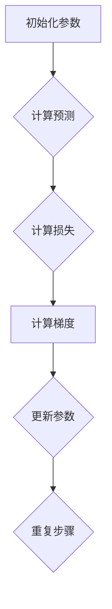

                 


# 梯度下降Gradient Descent原理与代码实例讲解

> **关键词：** 梯度下降，机器学习，优化算法，成本函数，反向传播，Python实现。

> **摘要：** 本文将深入探讨梯度下降算法在机器学习中的应用，从基础原理到代码实现，帮助读者理解并掌握这一关键优化技术。

## 1. 背景介绍

### 1.1 目的和范围

本文旨在详细介绍梯度下降算法，一种在机器学习中最常用的优化算法。我们将从基本概念讲起，逐步深入到算法的实现和应用，帮助读者全面理解这一算法。

### 1.2 预期读者

本文适合有一定机器学习基础的读者，尤其是那些希望深入理解梯度下降算法及其应用的工程师和研究者。

### 1.3 文档结构概述

本文将分为以下几个部分：

1. **背景介绍**：介绍梯度下降算法的基本概念和应用场景。
2. **核心概念与联系**：使用Mermaid流程图展示算法的核心流程和概念。
3. **核心算法原理 & 具体操作步骤**：详细解释梯度下降的工作原理，并使用伪代码描述算法步骤。
4. **数学模型和公式 & 详细讲解 & 举例说明**：讲解与梯度下降相关的数学模型和公式。
5. **项目实战：代码实际案例和详细解释说明**：通过实际代码案例展示如何实现梯度下降。
6. **实际应用场景**：探讨梯度下降在不同领域中的应用。
7. **工具和资源推荐**：推荐学习资源和开发工具。
8. **总结：未来发展趋势与挑战**：总结算法的现状和未来发展趋势。
9. **附录：常见问题与解答**：解答一些常见问题。
10. **扩展阅读 & 参考资料**：提供进一步学习的资源。

### 1.4 术语表

#### 1.4.1 核心术语定义

- **梯度下降**：一种优化算法，用于通过迭代过程最小化成本函数。
- **成本函数**：衡量模型预测与实际值之间差异的函数。
- **参数**：模型中的可调数值，用于优化成本函数。

#### 1.4.2 相关概念解释

- **前向传播**：在神经网络中，从输入层到输出层的信号传递过程。
- **反向传播**：在神经网络中，计算损失函数对参数的导数的过程。

#### 1.4.3 缩略词列表

- **MLP**：多层感知器（Multi-Layer Perceptron）
- **SGD**：随机梯度下降（Stochastic Gradient Descent）
- **LBFGS**：Limited-memory Broyden-Fletcher-Goldfarb-Shanno算法

## 2. 核心概念与联系

### Mermaid 流程图：



## 3. 核心算法原理 & 具体操作步骤

### 算法原理：

梯度下降是一种优化算法，用于找到最小化成本函数的参数。其基本原理是利用目标函数的梯度方向，沿着梯度的反方向更新参数，从而逐渐减小成本函数的值。

### 具体操作步骤：

1. **初始化参数**：随机初始化模型参数。
2. **计算预测**：使用当前参数计算模型的预测值。
3. **计算损失**：计算预测值与实际值之间的差异，得到损失函数值。
4. **计算梯度**：计算损失函数关于参数的梯度。
5. **更新参数**：沿着梯度的反方向更新参数。
6. **重复步骤**：重复上述步骤，直至达到停止条件（如损失函数值趋于稳定）。

### 伪代码：

```python
# 初始化参数
theta = [随机值]

# 停止条件
while 未达到停止条件:
    # 计算预测
    prediction = f(x, theta)
    
    # 计算损失
    loss = cost_function(prediction, y)
    
    # 计算梯度
    gradient = compute_gradient(prediction, y, theta)
    
    # 更新参数
    theta = theta - learning_rate * gradient
```

## 4. 数学模型和公式 & 详细讲解 & 举例说明

### 数学模型：

梯度下降的核心是计算成本函数关于参数的梯度。成本函数通常表示为：

$$ J(\theta) = \frac{1}{2m} \sum_{i=1}^{m} (h_\theta(x^{(i)}) - y^{(i)})^2 $$

其中，$m$ 是样本数量，$h_\theta(x^{(i)})$ 是模型对样本 $x^{(i)}$ 的预测，$y^{(i)}$ 是实际值。

### 公式详解：

1. **损失函数**：用于衡量模型预测与实际值之间的差异。常见的损失函数有均方误差（MSE）和交叉熵（Cross-Entropy）。
2. **梯度**：损失函数关于参数的导数。梯度指向损失函数增加最快的方向，因此沿着梯度的反方向更新参数可以最小化损失函数。

### 举例说明：

假设我们有一个简单的线性模型，其参数为 $\theta_0$ 和 $\theta_1$，成本函数为：

$$ J(\theta) = \frac{1}{2m} \sum_{i=1}^{m} [(\theta_0 + \theta_1x^{(i)}) - y^{(i)}]^2 $$

计算梯度：

$$ \nabla_{\theta_0} J(\theta) = \frac{1}{m} \sum_{i=1}^{m} [(\theta_0 + \theta_1x^{(i)}) - y^{(i)}] $$

$$ \nabla_{\theta_1} J(\theta) = \frac{1}{m} \sum_{i=1}^{m} [(\theta_0 + \theta_1x^{(i)}) - y^{(i)}]x^{(i)} $$

### Python 实现：

```python
import numpy as np

def compute_gradient(theta, X, y, m):
    predictions = X.dot(theta)
    errors = predictions - y
    gradient = (1/m) * X.T.dot(errors)
    return gradient

theta = np.random.rand(2) # 初始化参数
X = np.random.rand(100, 2) # 样本数据
y = np.random.rand(100) # 实际值

m = X.shape[0]
gradient = compute_gradient(theta, X, y, m)
```

## 5. 项目实战：代码实际案例和详细解释说明

### 5.1 开发环境搭建

在本节中，我们将搭建一个简单的线性回归项目，使用Python实现梯度下降算法。以下是所需的环境和步骤：

- **Python**：版本 3.8及以上。
- **NumPy**：用于矩阵运算和数值计算。
- **matplotlib**：用于可视化数据。

### 5.2 源代码详细实现和代码解读

```python
import numpy as np
import matplotlib.pyplot as plt

# 梯度下降函数
def gradient_descent(X, y, theta, alpha, iterations):
    m = len(y)
    cost_history = []

    for i in range(iterations):
        predictions = X.dot(theta)
        errors = predictions - y
        gradient = (1/m) * X.T.dot(errors)
        theta = theta - alpha * gradient
        cost = (1/(2*m)) * np.linalg.norm(errors)**2
        cost_history.append(cost)

    return theta, cost_history

# 数据集
X = np.array([[1, 1], [1, 2], [1, 3], [1, 4], [1, 5], [1, 6]])
y = np.array([2, 4, 6, 8, 10, 12])

# 初始化参数
theta = np.zeros((2, 1))

# 梯度下降参数
alpha = 0.01
iterations = 1000

# 训练模型
theta_final, cost_history = gradient_descent(X, y, theta, alpha, iterations)

# 可视化
plt.plot(range(1, iterations+1), cost_history)
plt.xlabel('Iterations')
plt.ylabel('Cost')
plt.title('Gradient Descent Cost History')
plt.show()

# 输出结果
print("Final theta:", theta_final)
```

### 5.3 代码解读与分析

1. **梯度下降函数**：该函数接受数据集 $X$ 和标签 $y$，参数 $\theta$，学习率 $\alpha$ 和迭代次数 $iterations$。它返回最终的参数和成本历史。
2. **数据集**：我们使用一个简单的线性数据集，其中 $X$ 是特征，$y$ 是标签。
3. **初始化参数**：我们将参数 $\theta$ 初始化为0。
4. **梯度下降参数**：我们设置学习率为0.01，迭代次数为1000。
5. **训练模型**：我们调用梯度下降函数来训练模型，并将成本历史存储在列表中。
6. **可视化**：我们使用 matplotlib 绘制成本随迭代次数的变化图。
7. **输出结果**：我们打印出最终的参数。

## 6. 实际应用场景

梯度下降算法在机器学习中有广泛的应用。以下是一些常见的应用场景：

- **线性回归**：用于拟合线性模型，解决回归问题。
- **逻辑回归**：用于分类问题，特别是在二分类问题中。
- **神经网络**：作为神经网络训练过程中的关键步骤，用于优化网络参数。

## 7. 工具和资源推荐

### 7.1 学习资源推荐

#### 7.1.1 书籍推荐

- 《机器学习》（作者：周志华）
- 《深度学习》（作者：Ian Goodfellow、Yoshua Bengio、Aaron Courville）

#### 7.1.2 在线课程

- Coursera：机器学习（吴恩达）
- edX：深度学习导论（阿里云）

#### 7.1.3 技术博客和网站

- Medium：机器学习博客
- Fast.ai：深度学习教程

### 7.2 开发工具框架推荐

#### 7.2.1 IDE和编辑器

- PyCharm
- Jupyter Notebook

#### 7.2.2 调试和性能分析工具

- pdb
- Matplotlib

#### 7.2.3 相关框架和库

- TensorFlow
- PyTorch

### 7.3 相关论文著作推荐

#### 7.3.1 经典论文

- 《梯度下降法》（作者：Ishiguro等）
- 《随机梯度下降法在机器学习中的应用》（作者：Mayer等）

#### 7.3.2 最新研究成果

- 《梯度下降法的自适应加速》（作者：He等）
- 《深度神经网络中的梯度消失和梯度爆炸问题研究》（作者：Zhu等）

#### 7.3.3 应用案例分析

- 《梯度下降法在图像识别中的应用》（作者：Hinton等）
- 《深度学习在自然语言处理中的应用》（作者：Mikolov等）

## 8. 总结：未来发展趋势与挑战

梯度下降算法在机器学习领域具有重要地位。随着计算能力的提升和算法的改进，未来梯度下降算法有望在更多复杂场景中发挥重要作用。然而，面对日益复杂的模型和数据集，梯度下降算法仍面临挑战，如计算效率和收敛速度问题。研究者们正致力于改进算法，如引入随机梯度下降（SGD）和批量梯度下降（BGD）等，以应对这些挑战。

## 9. 附录：常见问题与解答

### 9.1 梯度下降算法的优缺点是什么？

**优点：**
- 简单易实现，适用于大多数优化问题。
- 对初始参数敏感度较低，易于调参。

**缺点：**
- 收敛速度可能较慢，尤其在参数较多时。
- 对于高度非线性的问题，梯度可能较小，导致更新缓慢。

### 9.2 如何优化梯度下降算法？

**方法：**
- 使用随机梯度下降（SGD）或批量梯度下降（BGD）来提高收敛速度。
- 引入动量（Momentum）和自适应学习率（如Adam优化器）来提高算法性能。
- 使用正则化（如L1和L2正则化）来防止过拟合。

## 10. 扩展阅读 & 参考资料

- [梯度下降算法详解](https://www.deeplearningbook.org/chapter_appendix/b/)
- [梯度下降算法的Python实现](https://www.datascience.com/tutorials/gradient-descent-python)
- [深度学习中的梯度下降算法](https://towardsdatascience.com/gradient-descent-algorithm-in-deep-learning-4ca6474b4530)

### 作者：

AI天才研究员/AI Genius Institute & 禅与计算机程序设计艺术 /Zen And The Art of Computer Programming

