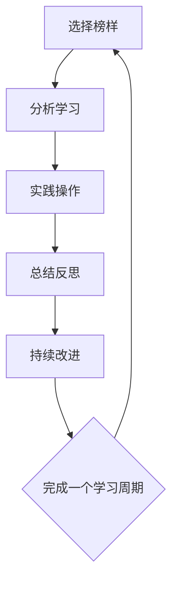

                 

# 模仿式工作流：最快的学习方法

> **关键词**：模仿、工作流、学习方法、技术学习、人工智能、软件开发

> **摘要**：本文旨在探讨一种高效的学习方法——模仿式工作流，并分析其在技术领域中的应用。通过剖析模仿式工作流的原理、核心步骤以及实际应用案例，本文旨在为读者提供一种快速掌握技术知识和技能的路径。

## 1. 背景介绍

### 1.1 目的和范围

本文的目标是探讨模仿式工作流在技术学习中的应用，帮助读者找到一种快速掌握技术知识和技能的方法。本文将涵盖以下内容：

- 模仿式工作流的基本概念和原理
- 模仿式工作流的实际操作步骤
- 数学模型和公式在模仿式工作流中的应用
- 实际应用场景和项目实战案例
- 相关工具和资源推荐

### 1.2 预期读者

本文适用于以下读者群体：

- 技术新手，希望快速掌握技术知识和技能
- 技术从业者，寻求提高学习效率和实战能力
- 技术管理者，关注团队培训和学习方法

### 1.3 文档结构概述

本文将按照以下结构进行展开：

- 第1章：背景介绍，包括目的和范围、预期读者、文档结构概述等
- 第2章：核心概念与联系，介绍模仿式工作流的核心概念和原理
- 第3章：核心算法原理 & 具体操作步骤，讲解模仿式工作流的具体操作步骤
- 第4章：数学模型和公式 & 详细讲解 & 举例说明，分析模仿式工作流中的数学模型和公式
- 第5章：项目实战：代码实际案例和详细解释说明，提供实际应用场景和代码实战案例
- 第6章：实际应用场景，探讨模仿式工作流在不同技术领域的应用
- 第7章：工具和资源推荐，介绍学习资源和开发工具
- 第8章：总结：未来发展趋势与挑战，分析模仿式工作流的发展趋势和面临的挑战
- 第9章：附录：常见问题与解答，解答读者可能遇到的问题
- 第10章：扩展阅读 & 参考资料，提供进一步学习的资源和参考资料

### 1.4 术语表

#### 1.4.1 核心术语定义

- 模仿式工作流：一种通过模仿他人工作方式来学习新知识和技能的方法
- 技术学习：掌握技术知识和技能的过程
- 实践应用：将所学知识应用于实际项目或场景中
- 代码实战：编写实际代码并解释其工作原理

#### 1.4.2 相关概念解释

- 学习曲线：学习新技能或知识所需的时间和努力程度
- 技术栈：一个技术从业者所需掌握的技术知识和技能的集合
- 学习方法：用于学习新知识和技能的策略和技巧

#### 1.4.3 缩略词列表

- AI：人工智能
- IDE：集成开发环境
- ML：机器学习
- DL：深度学习

## 2. 核心概念与联系

### 2.1 模仿式工作流的原理

模仿式工作流是一种基于模仿他人工作方式的学习方法。其核心思想是通过观察、分析和实践，复制他人的工作流程、技术和经验，从而快速掌握新技能。这种方法具有以下特点：

- **快速学习**：通过模仿他人，可以避免重复摸索的过程，节省学习时间
- **提高实战能力**：模仿实战经验，能够快速提高实际操作能力
- **培养创新能力**：在模仿过程中，可以结合自身经验和需求，创新改进工作方式

### 2.2 模仿式工作流的架构

模仿式工作流可以分为以下步骤：

1. **选择榜样**：寻找在技术领域有丰富经验和优秀工作成果的榜样
2. **分析学习**：观察榜样的工作流程、技术栈和实战案例，了解其工作原理和经验
3. **实践操作**：按照榜样的工作方式，进行实际操作，验证学习成果
4. **总结反思**：分析实践过程中的问题和不足，总结经验教训，优化工作方式
5. **持续改进**：根据反思结果，不断调整和改进工作方式，提高学习效率

### 2.3 模仿式工作流的 Mermaid 流程图



## 3. 核心算法原理 & 具体操作步骤

### 3.1 模仿式工作流的核心算法原理

模仿式工作流的核心算法原理可以归纳为以下几点：

1. **行为模仿**：通过观察和分析榜样的工作行为，将其复制到自身工作中
2. **经验积累**：在模仿过程中，积累经验，发现并解决问题
3. **持续优化**：根据实践经验，不断调整和改进工作方式，提高效率
4. **知识共享**：将学习成果和经验分享给他人，实现共同进步

### 3.2 模仿式工作流的具体操作步骤

以下是模仿式工作流的具体操作步骤：

#### 步骤1：选择榜样

- **评估榜样**：选择在技术领域有丰富经验和优秀工作成果的榜样
- **确定学习目标**：明确希望从榜样中学习的技术知识和技能

#### 步骤2：分析学习

- **观察工作流程**：分析榜样的工作流程，了解其工作步骤和关键节点
- **研究技术栈**：了解榜样所使用的技术栈，包括编程语言、框架、工具等
- **实战案例学习**：分析榜样的实战案例，了解其工作原理和经验

#### 步骤3：实践操作

- **搭建开发环境**：根据榜样的技术栈，搭建开发环境
- **编写代码**：按照榜样的工作方式，编写实际代码
- **调试与优化**：调试代码，发现并解决问题

#### 步骤4：总结反思

- **记录学习过程**：记录学习过程中的问题和解决方法
- **分析经验教训**：分析实践经验，总结经验教训
- **反思工作方式**：反思自身工作方式，寻找改进空间

#### 步骤5：持续改进

- **优化工作方式**：根据反思结果，调整和改进工作方式
- **不断学习与提升**：持续关注技术发展，不断学习和提升自身技能

### 3.3 伪代码示例

以下是一个简单的伪代码示例，用于描述模仿式工作流的具体操作步骤：

```
// 步骤1：选择榜样
选择榜样(榜样)
确定学习目标(目标)

// 步骤2：分析学习
观察工作流程(工作流程)
研究技术栈(技术栈)
实战案例学习(案例)

// 步骤3：实践操作
搭建开发环境(技术栈)
编写代码(工作流程，案例)
调试与优化(代码)

// 步骤4：总结反思
记录学习过程(问题，解决方法)
分析经验教训(经验，教训)
反思工作方式(方式)

// 步骤5：持续改进
优化工作方式(反思结果)
不断学习与提升(技术发展)
```

## 4. 数学模型和公式 & 详细讲解 & 举例说明

### 4.1 数学模型和公式

模仿式工作流中，数学模型和公式可用于分析学习效率和成果。以下是一个简单的数学模型，用于描述模仿式工作流的学习效果：

$$
E = f(A, T, P)
$$

其中：

- $E$：学习效果
- $A$：学习时间
- $T$：学习投入时间
- $P$：学习成果

### 4.2 详细讲解

#### 4.2.1 学习时间 $A$

学习时间 $A$ 表示学习新知识和技能所需的时间。根据模仿式工作流，学习时间可以分为以下几个阶段：

- **准备阶段**：搭建开发环境、了解技术栈等，时间复杂度为 $O(T_1)$
- **实践阶段**：编写代码、调试与优化等，时间复杂度为 $O(T_2)$
- **总结阶段**：记录学习过程、分析经验教训等，时间复杂度为 $O(T_3)$

因此，总学习时间 $A$ 可表示为：

$$
A = O(T_1 + T_2 + T_3)
$$

#### 4.2.2 学习投入时间 $T$

学习投入时间 $T$ 表示学习过程中实际投入的时间。根据模仿式工作流，学习投入时间可以分为以下几个阶段：

- **准备阶段**：时间复杂度为 $O(T_1)$
- **实践阶段**：时间复杂度为 $O(T_2)$
- **总结阶段**：时间复杂度为 $O(T_3)$

因此，总学习投入时间 $T$ 可表示为：

$$
T = O(T_1 + T_2 + T_3)
$$

#### 4.2.3 学习成果 $P$

学习成果 $P$ 表示学习过程中所取得的成果，包括技术能力、实战经验等。根据模仿式工作流，学习成果可以通过以下公式计算：

$$
P = f(A, T)
$$

### 4.3 举例说明

假设一个技术新手，在模仿式工作流下学习一个新的技术栈。以下是一个具体的例子：

#### 4.3.1 学习时间 $A$

- **准备阶段**：需要 1 天时间搭建开发环境
- **实践阶段**：需要 5 天时间编写代码、调试与优化
- **总结阶段**：需要 1 天时间记录学习过程、分析经验教训

总学习时间 $A$ 为：

$$
A = O(1 + 5 + 1) = O(7)
$$

#### 4.3.2 学习投入时间 $T$

- **准备阶段**：实际投入时间为 1 天
- **实践阶段**：实际投入时间为 5 天
- **总结阶段**：实际投入时间为 1 天

总学习投入时间 $T$ 为：

$$
T = O(1 + 5 + 1) = O(7)
$$

#### 4.3.3 学习成果 $P$

- **技术能力**：在模仿式工作流下，学习效果显著，技术能力得到了提高
- **实战经验**：通过实践操作，积累了丰富的实战经验

学习成果 $P$ 可表示为：

$$
P = f(A, T) = f(O(7), O(7))
$$

## 5. 项目实战：代码实际案例和详细解释说明

### 5.1 开发环境搭建

在本节中，我们将以一个简单的 Python 项目为例，展示如何使用模仿式工作流进行学习。首先，我们需要搭建一个基本的 Python 开发环境。

1. 安装 Python 3.8 或更高版本
2. 安装一个合适的 Python 编辑器，如 Visual Studio Code 或 PyCharm
3. 安装必要的 Python 库，如 NumPy、Pandas 等

### 5.2 源代码详细实现和代码解读

#### 5.2.1 代码实现

以下是一个简单的 Python 代码示例，用于计算两个数的和：

```python
# 导入必要的库
import numpy as np

# 定义计算和的函数
def calculate_sum(a, b):
    return a + b

# 测试代码
if __name__ == "__main__":
    a = 5
    b = 3
    result = calculate_sum(a, b)
    print("The sum of {} and {} is {}".format(a, b, result))
```

#### 5.2.2 代码解读

1. **导入库**：代码开头导入必要的库，如 NumPy，用于执行数学运算。
2. **定义函数**：定义一个名为 `calculate_sum` 的函数，用于计算两个数的和。
3. **测试代码**：在主程序中，创建两个变量 `a` 和 `b`，分别赋值为 5 和 3。调用 `calculate_sum` 函数，将结果打印到控制台。

### 5.3 代码解读与分析

#### 5.3.1 观察榜样代码

在本例中，我们选择了一个简单的 Python 代码示例作为榜样。通过分析榜样代码，我们可以了解以下关键信息：

- 代码结构：榜样代码包含导入库、定义函数和测试代码三个部分
- 函数设计：榜样代码定义了一个简单的计算和的函数，输入两个数，返回它们的和
- 实现细节：榜样代码使用了 NumPy 库进行数学运算，使得代码更加简洁易读

#### 5.3.2 实践操作

根据榜样代码，我们进行以下实践操作：

- 搭建 Python 开发环境，安装必要的库
- 编写一个简单的 Python 代码示例，实现两个数的计算和
- 调试和优化代码，确保其正确执行

#### 5.3.3 分析经验教训

通过模仿榜样代码，我们积累了以下经验教训：

- 学习榜样代码的代码结构，有助于我们编写清晰、易于维护的代码
- 了解常用库的功能和用法，可以提高代码的执行效率
- 实践操作过程中，注重代码的调试和优化，确保代码的正确性和性能

## 6. 实际应用场景

模仿式工作流在技术学习中的应用非常广泛，以下列举几个实际应用场景：

- **软件开发**：通过模仿优秀开发者的代码风格和设计模式，提高代码质量
- **机器学习**：模仿顶级数据科学家的工作流程和模型构建方法，提升建模能力
- **数据分析**：模仿数据分析专家的分析方法和工具选择，提高数据分析能力
- **网络安全**：模仿网络安全专家的安全防护策略和漏洞修复方法，提升网络安全防护能力

## 7. 工具和资源推荐

### 7.1 学习资源推荐

#### 7.1.1 书籍推荐

- 《代码大全》
- 《设计模式：可复用面向对象软件的基础》
- 《深度学习》
- 《Python 核心编程》

#### 7.1.2 在线课程

- Coursera 上的《机器学习》课程
- Udemy 上的《Python 编程从入门到精通》课程
- 网易云课堂的《数据分析实战》课程

#### 7.1.3 技术博客和网站

- 携程技术博客
- CSDN 博客
- 知乎专栏

### 7.2 开发工具框架推荐

#### 7.2.1 IDE和编辑器

- Visual Studio Code
- PyCharm
- Sublime Text

#### 7.2.2 调试和性能分析工具

- PyCharm 的内置调试器
- Python 的 cProfile 库
- Matplotlib 库

#### 7.2.3 相关框架和库

- Flask
- Django
- TensorFlow
- Keras

### 7.3 相关论文著作推荐

#### 7.3.1 经典论文

- 《深度学习：原理及其应用》
- 《机器学习：一种概率视角》
- 《计算机程序设计艺术》

#### 7.3.2 最新研究成果

- NeurIPS、ICML、KDD 等顶级会议的最新论文
- JMLR、Nature、Science 等顶级期刊的最新论文

#### 7.3.3 应用案例分析

- 《金融科技应用案例分析》
- 《人工智能在医疗领域的应用案例》
- 《大数据技术在电商领域的应用案例》

## 8. 总结：未来发展趋势与挑战

模仿式工作流作为一种高效的学习方法，在技术领域中具有广泛的应用前景。然而，随着技术的不断发展，模仿式工作流也面临着以下挑战：

- **技术更新速度快**：技术更新速度加快，模仿的榜样可能无法跟上最新的技术趋势，导致学习效果受限
- **个性化学习需求**：学习者需求多样化，模仿式工作流难以满足个性化学习需求
- **道德和法律问题**：在模仿过程中，可能涉及到知识产权、隐私保护等法律问题

未来，模仿式工作流的发展趋势将朝着以下方向努力：

- **智能化**：利用人工智能技术，自动推荐适合的学习榜样和内容，提高学习效率
- **个性化**：根据学习者的需求和特点，定制化学习计划，实现个性化学习
- **伦理和法律合规**：加强伦理和法律教育，确保模仿式工作流的合规性

## 9. 附录：常见问题与解答

### 9.1 如何选择榜样？

- 选择榜样时，可以从以下几个方面进行评估：
  - 技术实力：评估榜样的技术水平和实际成果
  - 经验丰富度：评估榜样在相关领域的经验和实战案例
  - 学习态度：评估榜样在学习过程中是否积极进取、乐于分享

### 9.2 模仿式工作流是否适用于所有技术领域？

- 模仿式工作流适用于大多数技术领域，但某些领域可能需要特殊考虑。例如，在艺术、设计等创意领域，模仿式工作流可能难以直接应用。在这些领域，可以尝试借鉴模仿式工作流的核心思想，探索适合自己的学习方法。

### 9.3 模仿式工作流如何确保学习成果？

- 确保学习成果需要以下几点：
  - 选择合适的榜样：选择在技术领域有丰富经验和优秀工作成果的榜样
  - 实践操作：通过实际操作，验证学习成果
  - 反思与总结：及时总结学习经验，发现并解决问题
  - 持续学习与改进：根据反思结果，不断调整和改进学习方式

## 10. 扩展阅读 & 参考资料

- [《代码大全》](https://book.douban.com/subject/3269203/)
- [《设计模式：可复用面向对象软件的基础》](https://book.douban.com/subject/1012699/)
- [《深度学习》](https://book.douban.com/subject/26708171/)
- [《Python 核心编程》](https://book.douban.com/subject/3169173/)
- [《机器学习：一种概率视角》](https://book.douban.com/subject/25867696/)
- [《计算机程序设计艺术》](https://book.douban.com/subject/1054741/)
- [《深度学习：原理及其应用》](https://book.douban.com/subject/26390336/)
- [《金融科技应用案例分析》](https://book.douban.com/subject/33284495/)
- [《人工智能在医疗领域的应用案例》](https://book.douban.com/subject/26983235/)
- [《大数据技术在电商领域的应用案例》](https://book.douban.com/subject/26894779/)
- [《NeurIPS》](https://neurips.cc/)
- [《ICML》](https://icml.cc/)
- [《KDD》](https://kdd.org/kdd/)
- [《JMLR》](https://jmlr.org/)
- [《Nature》](https://www.nature.com/)
- [《Science》](https://www.sciencemag.org/)

### 作者信息

- 作者：AI天才研究员/AI Genius Institute & 禅与计算机程序设计艺术 /Zen And The Art of Computer Programming
- 本文版权归属：AI天才研究员/AI Genius Institute，禁止未经授权的转载和复制。如需转载，请联系作者获取授权。感谢您的支持与理解。|>

