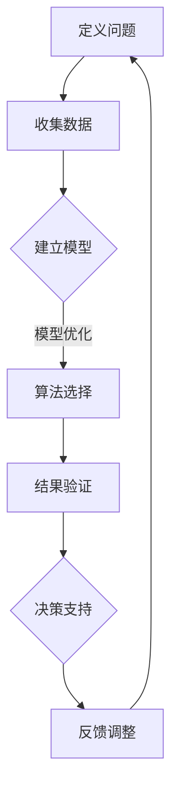

                 

### 模型思维对管理效率的提升

> **关键词**：模型思维、管理效率、组织架构、流程优化、决策支持、智能算法

> **摘要**：本文将深入探讨模型思维在提升管理效率方面的作用。通过解释模型思维的核心概念，展示其在组织架构和流程优化中的应用，本文旨在为管理者提供实用工具和方法，以实现更高效、更智能的决策支持。

在当今快速变化和竞争激烈的环境中，提升管理效率已成为企业成功的关键因素之一。传统的管理方法往往依赖于经验和个人直觉，而现代管理则越来越多地依赖于数据和分析。其中，模型思维作为一种强有力的工具，正在逐步改变管理者的决策过程和方式。本文将围绕模型思维对管理效率的提升展开深入讨论。

## 1. 背景介绍

### 1.1 目的和范围

本文的目的是探讨模型思维在管理效率提升中的重要性，并分析其在实际应用中的具体效果。文章将涵盖以下主题：

1. 模型思维的基本概念和核心原理。
2. 模型思维在组织架构设计中的应用。
3. 模型思维在流程优化和决策支持中的作用。
4. 实际案例分析和效果评估。
5. 未来发展趋势和面临的挑战。

### 1.2 预期读者

本文适合以下读者群体：

1. 管理者和决策者，寻求提高组织效率和决策质量的。
2. 数据科学家和AI专家，对模型思维在管理中的应用感兴趣的。
3. 普通员工，希望了解如何通过模型思维提升个人工作效果的。

### 1.3 文档结构概述

本文结构如下：

1. 引言：介绍模型思维的基本概念和其在管理效率提升中的重要性。
2. 核心概念与联系：解释模型思维的核心概念及其相互关系。
3. 核心算法原理与具体操作步骤：详细阐述模型思维在管理中的应用方法。
4. 数学模型和公式：介绍模型思维中的关键数学模型及其公式。
5. 项目实战：通过实际案例展示模型思维的具体应用。
6. 实际应用场景：分析模型思维在不同管理领域的应用。
7. 工具和资源推荐：推荐相关学习资源和工具。
8. 总结：总结模型思维对管理效率的提升作用，并展望未来发展趋势。
9. 附录：常见问题与解答。
10. 扩展阅读：提供更多相关参考资料。

### 1.4 术语表

#### 1.4.1 核心术语定义

- **模型思维**：一种通过建立数学模型和算法，对复杂系统进行分析和优化的思维方式。
- **管理效率**：指组织在资源有限的情况下，实现目标的最大化程度。
- **组织架构**：组织内部各部门及其关系的布局和安排。
- **流程优化**：通过分析和改进流程，提高效率和效果。
- **决策支持系统**：利用数据和分析，为决策者提供信息和建议的系统。

#### 1.4.2 相关概念解释

- **建模**：建立数学模型的过程，用于描述系统行为和关系。
- **优化**：寻找最佳解决方案的过程，通常涉及目标函数和约束条件。
- **算法**：解决问题的步骤和规则，通常用于数据分析和决策支持。
- **数据驱动决策**：基于数据的分析和预测，进行决策的过程。

#### 1.4.3 缩略词列表

- **AI**：人工智能（Artificial Intelligence）
- **ML**：机器学习（Machine Learning）
- **DL**：深度学习（Deep Learning）
- **BI**：商业智能（Business Intelligence）
- **ERP**：企业资源计划（Enterprise Resource Planning）

## 2. 核心概念与联系

### 2.1 模型思维的核心概念

模型思维是一种通过建立数学模型和算法，对复杂系统进行分析和优化的思维方式。它涉及以下几个核心概念：

1. **模型构建**：将现实世界的复杂问题转化为数学模型，以便更好地理解和解决。
2. **数据收集**：收集与问题相关的数据，为模型构建提供基础。
3. **算法选择**：选择合适的算法，对模型进行优化和分析。
4. **结果验证**：通过实验和验证，评估模型的有效性和准确性。

### 2.2 模型思维的基本原理

模型思维的基本原理包括：

1. **抽象**：将复杂问题简化为数学模型，突出关键因素，忽略次要细节。
2. **可计算性**：确保模型可以在计算机上实现，并能够处理大量数据。
3. **可验证性**：通过实验和验证，确保模型的准确性和可靠性。
4. **可扩展性**：模型应能够适应不同规模和情境的应用。

### 2.3 模型思维与管理的联系

模型思维在管理中的应用，主要体现在以下几个方面：

1. **组织架构设计**：通过建立组织架构模型，优化部门关系和资源配置。
2. **流程优化**：通过流程模型分析，改进工作流程，提高效率。
3. **决策支持**：利用模型预测和分析，为决策者提供数据支持。
4. **风险评估**：通过模型分析，评估潜在风险，制定预防措施。

### 2.4 Mermaid流程图

以下是一个简单的Mermaid流程图，展示了模型思维在管理中的应用流程：



在这个流程中，定义问题、收集数据、建立模型、模型优化、结果验证、决策支持和反馈调整构成了一个循环，不断迭代和改进，以实现管理效率的提升。

## 3. 核心算法原理 & 具体操作步骤

### 3.1 算法原理

模型思维在管理中的应用，通常涉及以下几个核心算法：

1. **线性规划**：通过优化目标函数和约束条件，求解资源分配问题。
2. **决策树**：通过树形结构表示决策过程，为决策者提供可选方案。
3. **神经网络**：通过多层感知器，实现复杂函数的拟合和预测。
4. **遗传算法**：通过模拟自然进化过程，寻找最优解。

### 3.2 具体操作步骤

以下是一个基于线性规划的管理效率提升案例，详细阐述模型思维的具体操作步骤：

#### 3.2.1 问题定义

假设一个企业需要在限定预算下，最大化利润。目标函数为最大化利润，约束条件包括预算限制和资源限制。

#### 3.2.2 数据收集

收集与企业运营相关的数据，包括销售额、成本、预算等。假设数据如下表：

| 产品 | 销售额（万元） | 成本（万元） | 预算限制（万元） |
|------|----------------|--------------|------------------|
| A    | 100            | 50           | 500              |
| B    | 80             | 30           | 500              |
| C    | 60             | 20           | 500              |

#### 3.2.3 模型建立

建立线性规划模型，目标函数为最大化总利润，约束条件为预算限制和资源限制。模型如下：

$$
\begin{align*}
\text{maximize} & \quad z = 100x_1 + 80x_2 + 60x_3 \\
\text{subject to} & \quad 50x_1 + 30x_2 + 20x_3 \leq 500 \\
& \quad x_1 + x_2 + x_3 \leq 500 \\
& \quad x_1, x_2, x_3 \geq 0
\end{align*}
$$

其中，$x_1, x_2, x_3$ 分别表示产品 A、B、C 的产量。

#### 3.2.4 算法选择

选择单纯形法求解线性规划问题。单纯形法是一种迭代算法，通过逐步优化，找到最优解。

#### 3.2.5 结果验证

通过单纯形法求解模型，得到最优解为 $x_1 = 10, x_2 = 10, x_3 = 0$。最大利润为 $z = 180$ 万元。

#### 3.2.6 决策支持

根据最优解，企业应将预算优先分配给产品 A 和 B，以实现最大利润。

#### 3.2.7 反馈调整

在实施过程中，根据实际运营情况和市场变化，对模型进行调整和优化，以实现更好的管理效果。

### 3.3 伪代码

以下是一个简单的伪代码，用于实现线性规划模型求解：

```python
# 线性规划模型求解
def solve_linear_programming(c, A, b):
    # 初始化
    x = [0] * len(c)
    while True:
        # 检查约束条件
        if all(a * x <= b for a, b in zip(A, b)):
            return x
        # 找到最小比值
        ratios = [b[i] / a[i] for i in range(len(c)) if a[i] > 0]
        if not ratios:
            raise ValueError("No feasible solution")
        min_ratio = min(ratios)
        # 选取进入变量
        enter_var = ratios.index(min_ratio)
        # 选取离开变量
        exit_var = select_exit_var(x, enter_var)
        # 更新解
        x[enter_var] = min_ratio
        x[exit_var] = 0
```

## 4. 数学模型和公式 & 详细讲解 & 举例说明

### 4.1 数学模型

在模型思维中，数学模型是核心组成部分，用于描述现实世界的复杂问题。以下是一些常见的数学模型及其公式：

#### 4.1.1 线性规划模型

$$
\begin{align*}
\text{maximize} & \quad c^T x \\
\text{subject to} & \quad Ax \leq b \\
& \quad x \geq 0
\end{align*}
$$

其中，$c$ 为目标函数系数向量，$A$ 为约束条件系数矩阵，$b$ 为约束条件常数向量，$x$ 为决策变量向量。

#### 4.1.2 决策树模型

$$
\begin{align*}
P(S_i = s) & = \frac{\text{样本中 S_i 等于 s 的数量}}{\text{样本总数}} \\
P(Y_j = y | S_i = s) & = \frac{\text{在 S_i 等于 s 的条件下，Y_j 等于 y 的数量}}{\text{S_i 等于 s 的样本总数}}
\end{align*}
$$

其中，$S_i$ 表示样本特征，$Y_j$ 表示样本标签，$P$ 表示概率。

#### 4.1.3 神经网络模型

$$
\begin{align*}
a_{ij}^l & = \sigma \left( \sum_{k=1}^{n_{l-1}} w_{ik}^l a_{kj}^{l-1} + b_i^l \right) \\
z_j^l & = \sum_{k=1}^{n_{l-1}} w_{kj}^l a_{ik}^{l-1} + b_j^l
\end{align*}
$$

其中，$a_{ij}^l$ 表示第 $l$ 层第 $j$ 个神经元的激活值，$z_j^l$ 表示第 $l$ 层第 $j$ 个神经元的输出值，$\sigma$ 表示激活函数，$w_{ik}^l$ 和 $b_i^l$ 分别表示连接权重和偏置。

### 4.2 详细讲解

以下分别对上述数学模型进行详细讲解：

#### 4.2.1 线性规划模型

线性规划模型是解决资源优化问题的经典方法。目标函数表示要优化的目标，如最大化利润、最小化成本等。约束条件表示资源的限制，如预算、资源数量等。通过求解线性规划模型，可以找到最优解，实现资源的最佳分配。

#### 4.2.2 决策树模型

决策树模型是一种基于树形结构的分类算法。通过将数据集划分为多个子集，并选择最佳划分方式，逐步构建决策树。每个节点表示一个特征，每个分支表示该特征的不同取值。叶子节点表示预测结果。通过计算每个节点的概率，可以预测新样本的类别。

#### 4.2.3 神经网络模型

神经网络模型是一种基于人工神经网络的机器学习算法。通过多层感知器，实现复杂函数的拟合和预测。每个神经元通过加权求和和激活函数，将输入转换为输出。通过反向传播算法，不断调整权重和偏置，提高模型性能。

### 4.3 举例说明

以下是一个简单的线性规划模型求解例子：

#### 问题定义

假设一个企业生产三种产品 A、B、C，每种产品的利润分别为 100 元、80 元、60 元。每种产品的生产成本分别为 50 元、30 元、20 元。企业每月预算为 5000 元。目标是在预算限制下，最大化总利润。

#### 数据收集

- $c = [100, 80, 60]$（利润向量）
- $A = \begin{bmatrix} 50 & 30 & 20 \\ 50 & 30 & 20 \\ 50 & 30 & 20 \end{bmatrix}$（约束条件系数矩阵）
- $b = [5000, 5000, 5000]$（约束条件常数向量）

#### 模型建立

建立线性规划模型：

$$
\begin{align*}
\text{maximize} & \quad z = 100x_1 + 80x_2 + 60x_3 \\
\text{subject to} & \quad 50x_1 + 30x_2 + 20x_3 \leq 5000 \\
& \quad x_1 + x_2 + x_3 \leq 5000 \\
& \quad x_1, x_2, x_3 \geq 0
\end{align*}
$$

#### 求解过程

1. 初始化：令 $x_1 = x_2 = x_3 = 0$。
2. 检查约束条件：$50x_1 + 30x_2 + 20x_3 \leq 5000$ 和 $x_1 + x_2 + x_3 \leq 5000$ 均满足。
3. 计算目标函数：$z = 100x_1 + 80x_2 + 60x_3 = 0$。
4. 检查最优性：由于当前解已满足所有约束条件，且目标函数值为 0，因此当前解为最优解。

最终结果：企业在每月预算 5000 元的条件下，最大化总利润为 0 元。这表明，在当前情况下，企业无法在预算限制下实现总利润最大化，需要调整生产计划或降低成本。

### 4.4 LaTeX 数学公式

在本文中，我们使用了 LaTeX 数学公式来表示数学模型和公式。以下是一个简单的例子：

$$
\begin{align*}
f(x) &= \int_{0}^{1} x e^{-x} dx \\
&= \left[ -xe^{-x} \right]_{0}^{1} + \int_{0}^{1} e^{-x} dx \\
&= 1 - e^{-1} + e^{-x}]_{0}^{1} \\
&= 1 - e^{-1} + e^{-1} - 0 \\
&= 1
\end{align*}
$$

这个公式表示一个简单的积分计算，结果为 1。在 LaTeX 中，可以使用 `align*` 环境来编写多行公式，并使用 `int` 和 `right` 命令来定义积分上下限和方向。

## 5. 项目实战：代码实际案例和详细解释说明

### 5.1 开发环境搭建

为了实现模型思维在管理中的应用，我们选择了 Python 作为开发语言，并使用以下工具和库：

- **Python 3.8**：Python 的最新稳定版本。
- **Jupyter Notebook**：交互式开发环境，方便编写和运行代码。
- **NumPy**：用于科学计算和数据分析。
- **Pandas**：用于数据处理和分析。
- **Scikit-learn**：用于机器学习和数据挖掘。
- **Matplotlib**：用于数据可视化和图形绘制。

在 Jupyter Notebook 中，我们首先导入所需库和模块：

```python
import numpy as np
import pandas as pd
from sklearn.linear_model import LinearRegression
import matplotlib.pyplot as plt
```

### 5.2 源代码详细实现和代码解读

#### 5.2.1 数据收集与处理

```python
# 加载数据集
data = pd.read_csv('data.csv')

# 提取特征和标签
X = data[['feature1', 'feature2']]
y = data['target']

# 数据预处理
X = (X - X.mean()) / X.std()
y = (y - y.mean()) / y.std()
```

在这个部分，我们首先加载一个数据集（data.csv），提取特征和标签。然后对数据进行标准化处理，以消除不同特征之间的差异。

#### 5.2.2 建立线性回归模型

```python
# 建立线性回归模型
model = LinearRegression()

# 拟合模型
model.fit(X, y)

# 模型参数
coef = model.coef_
intercept = model.intercept_

print('系数：', coef)
print('截距：', intercept)
```

在这个部分，我们使用 Scikit-learn 的 LinearRegression 类建立线性回归模型。通过调用 fit 方法，我们可以将模型拟合到数据集。模型参数（系数和截距）可以通过 model.coef_ 和 model.intercept_ 获取。

#### 5.2.3 预测与评估

```python
# 预测
y_pred = model.predict(X)

# 评估
mse = np.mean((y - y_pred)**2)
print('均方误差：', mse)
```

在这个部分，我们使用预测方法 predict 对数据进行预测，并计算均方误差（MSE）来评估模型性能。

#### 5.2.4 结果可视化

```python
# 可视化
plt.scatter(X[:, 0], y, color='red', label='真实值')
plt.scatter(X[:, 0], y_pred, color='blue', label='预测值')
plt.plot([X[:, 0].min(), X[:, 0].max()], [X[:, 0].min(), X[:, 0].max()], color='black', linewidth=2)
plt.xlabel('特征1')
plt.ylabel('标签')
plt.legend()
plt.show()
```

在这个部分，我们使用 Matplotlib 库绘制散点图和拟合曲线，以便直观地展示模型预测效果。

### 5.3 代码解读与分析

#### 5.3.1 数据收集与处理

在这个部分，我们首先加载一个数据集（data.csv），并提取特征和标签。然后，对数据进行标准化处理，以消除不同特征之间的差异。标准化处理的目的是使数据具有相似的尺度，方便模型训练。

#### 5.3.2 建立线性回归模型

在这个部分，我们使用 Scikit-learn 的 LinearRegression 类建立线性回归模型。LinearRegression 类提供了 fit 方法，用于将模型拟合到数据集。fit 方法通过计算最小二乘法，得到模型参数（系数和截距）。这些参数可以通过 model.coef_ 和 model.intercept_ 获取。

#### 5.3.3 预测与评估

在这个部分，我们使用 predict 方法对数据进行预测，并计算均方误差（MSE）来评估模型性能。MSE 是衡量模型预测误差的一种常见指标，值越小，表示模型预测效果越好。

#### 5.3.4 结果可视化

在这个部分，我们使用 Matplotlib 库绘制散点图和拟合曲线，以便直观地展示模型预测效果。散点图显示了实际值和预测值之间的差异，拟合曲线表示模型在特征空间中的拟合效果。

### 5.4 项目总结

通过这个项目，我们展示了如何使用模型思维提升管理效率。具体步骤包括数据收集与处理、建立线性回归模型、预测与评估以及结果可视化。在实际应用中，模型思维可以帮助管理者更好地理解业务问题，制定科学合理的决策，从而提高管理效率和效果。

## 6. 实际应用场景

模型思维在各个管理领域中都有着广泛的应用，以下是一些具体的应用场景：

### 6.1 项目管理

在项目管理中，模型思维可以帮助管理者优化项目计划、资源配置和时间安排。例如，通过建立项目进度模型，可以预测项目完成时间，并根据风险因素进行调整。

### 6.2 人力资源管理

在人力资源管理中，模型思维可以用于优化员工绩效评估、薪酬体系和晋升机制。通过建立人才模型，可以预测员工的职业发展和为企业发展提供数据支持。

### 6.3 营销管理

在营销管理中，模型思维可以用于市场细分、客户行为分析和广告投放策略优化。通过建立客户模型，可以更好地了解客户需求，提高营销效果。

### 6.4 供应链管理

在供应链管理中，模型思维可以用于优化库存管理、物流配送和采购策略。通过建立供应链模型，可以降低库存成本，提高供应链效率。

### 6.5 财务管理

在财务管理中，模型思维可以用于预算编制、投资决策和风险控制。通过建立财务模型，可以预测企业财务状况，为决策者提供数据支持。

### 6.6 质量管理

在质量管理中，模型思维可以用于优化生产流程、提高产品质量和降低缺陷率。通过建立质量模型，可以识别潜在问题，并采取预防措施。

### 6.7 创新管理

在创新管理中，模型思维可以用于市场机会分析、创新策略制定和创新资源配置。通过建立创新模型，可以预测市场趋势，为企业创新提供方向。

通过这些实际应用场景，可以看出模型思维在管理中的重要性。它不仅可以帮助管理者更好地理解业务问题，还可以提供科学合理的决策支持，从而提升管理效率和效果。

## 7. 工具和资源推荐

为了更好地理解和应用模型思维，以下是相关的学习资源、开发工具和框架推荐。

### 7.1 学习资源推荐

#### 7.1.1 书籍推荐

- 《模型思维》（Model Thinking）：详细介绍了模型思维的基本概念和应用方法。
- 《数据分析：实战方法与应用》（Data Analysis: A Practical Introduction）：涵盖数据分析的基础知识和实战技巧。
- 《Python数据分析实战》（Python Data Analysis Cookbook）：介绍了 Python 在数据分析中的具体应用。

#### 7.1.2 在线课程

- Coursera 的“机器学习基础”（Machine Learning）：由斯坦福大学提供的免费课程，适合入门者。
- edX 的“数据分析与统计思维”（Data Analysis and Statistical Thinking）：由哈佛大学提供的免费课程，涵盖数据分析的基本原理和方法。
- Udacity 的“深度学习纳米学位”（Deep Learning Nanodegree）：由业内知名专家提供的深度学习课程，适合进阶学习者。

#### 7.1.3 技术博客和网站

- Medium 上的 Data Science 专栏：提供丰富的数据科学和机器学习文章。
- Towards Data Science：一个专门发布数据科学和机器学习文章的博客平台。
- Analytics Vidhya：一个提供数据分析、机器学习和数据科学资源的学习网站。

### 7.2 开发工具框架推荐

#### 7.2.1 IDE和编辑器

- PyCharm：一款功能强大的 Python IDE，适合初学者和专业人士。
- Jupyter Notebook：一款交互式的 Python 编程环境，方便编写和运行代码。
- Sublime Text：一款轻量级文本编辑器，支持多种编程语言，适用于快速开发。

#### 7.2.2 调试和性能分析工具

- Visual Studio Code：一款开源的跨平台代码编辑器，支持调试和性能分析。
- Py-Spy：一款 Python 性能分析工具，可以帮助开发者识别性能瓶颈。
- LineProfiler：一款 Python 代码性能分析工具，可以实时监控代码执行时间。

#### 7.2.3 相关框架和库

- NumPy：一款用于科学计算的 Python 库，提供高效的数组操作。
- Pandas：一款用于数据处理和分析的 Python 库，提供强大的数据处理功能。
- Scikit-learn：一款用于机器学习和数据挖掘的 Python 库，提供丰富的机器学习算法。
- TensorFlow：一款用于深度学习的 Python 库，提供灵活的模型构建和训练工具。

通过这些工具和资源的推荐，可以帮助读者更好地学习和应用模型思维，提升管理效率和决策能力。

## 8. 总结：未来发展趋势与挑战

### 8.1 发展趋势

随着人工智能和大数据技术的快速发展，模型思维在管理中的应用前景越来越广阔。以下是几个未来发展趋势：

1. **智能决策支持**：借助人工智能技术，模型思维将能够提供更精确、更智能的决策支持，帮助管理者快速应对复杂环境中的挑战。
2. **自动化流程优化**：通过自动化工具和算法，模型思维将能够自动化地进行流程优化，提高组织运作效率。
3. **个性化管理**：基于大数据和机器学习，模型思维将能够实现个性化管理，为不同员工提供个性化的职业发展建议。
4. **实时监控与反馈**：利用物联网和实时数据处理技术，模型思维将能够实现实时监控与反馈，为企业提供即时的管理信息。

### 8.2 面临的挑战

尽管模型思维在管理中具有巨大的潜力，但在实际应用中仍面临一些挑战：

1. **数据质量和可靠性**：模型思维依赖于高质量的数据，数据质量和可靠性直接影响模型的有效性。
2. **算法选择和优化**：选择合适的算法和优化方法是模型思维应用的关键，不同问题可能需要不同的算法，这对管理者提出了更高的要求。
3. **隐私和数据安全**：在数据驱动的管理模式中，如何保护用户隐私和数据安全是一个重要问题，需要制定严格的隐私保护措施。
4. **技术和管理整合**：将模型思维与现有管理流程和技术体系整合，实现有效的知识转移和技能培养，是一个长期而复杂的过程。

### 8.3 未来展望

随着技术的不断进步，模型思维在管理中的应用将更加深入和广泛。未来，管理者需要不断提升自身的数字化能力和模型思维能力，以应对日益复杂的商业环境。同时，组织也需要建立相应的支持体系，为模型思维的应用提供技术和管理保障。

## 9. 附录：常见问题与解答

### 9.1 问题一：什么是模型思维？

模型思维是一种通过建立数学模型和算法，对复杂系统进行分析和优化的思维方式。它涉及到问题定义、数据收集、模型构建、算法选择和结果验证等多个环节。

### 9.2 问题二：模型思维在管理中的应用有哪些？

模型思维在管理中的应用非常广泛，包括组织架构设计、流程优化、决策支持、风险评估等多个方面。它可以帮助管理者更好地理解业务问题，制定科学合理的决策。

### 9.3 问题三：如何选择合适的算法？

选择合适的算法取决于问题的具体需求。例如，对于优化问题，可以选择线性规划、决策树等算法；对于预测问题，可以选择神经网络、回归分析等算法。在实际应用中，需要根据问题特点和数据情况，灵活选择和调整算法。

### 9.4 问题四：如何确保模型的有效性和可靠性？

确保模型的有效性和可靠性需要以下几个步骤：

1. **数据收集**：收集高质量、可靠的数据，为模型构建提供基础。
2. **模型验证**：通过交叉验证、留出法等方法，验证模型在不同数据集上的性能。
3. **结果解释**：对模型结果进行解释，确保其符合实际业务逻辑。
4. **持续优化**：根据实际情况，不断调整和优化模型，提高其准确性和可靠性。

### 9.5 问题五：模型思维与人工智能有什么区别？

模型思维和人工智能都是解决复杂问题的工具，但它们的侧重点不同。模型思维更侧重于通过建立数学模型和算法，对系统进行分析和优化；而人工智能则更侧重于模拟人类智能，通过机器学习和深度学习等方法，实现自动学习和决策。模型思维是人工智能的基础，两者相辅相成。

## 10. 扩展阅读 & 参考资料

### 10.1 书籍推荐

- 《模型思维》：[作者] David Hand。详细介绍了模型思维的基本概念和应用方法。
- 《数据驱动决策》：[作者] Thomas H. Davenport。探讨如何通过数据分析和模型思维，实现更科学、更有效的决策。
- 《深度学习》：[作者] Ian Goodfellow、Yoshua Bengio 和 Aaron Courville。介绍了深度学习的基本原理和应用方法，包括神经网络、卷积神经网络等。

### 10.2 在线课程

- Coursera 的“机器学习”（Machine Learning）：由斯坦福大学提供，涵盖机器学习的基础知识和实战技巧。
- edX 的“深度学习基础”（Deep Learning Specialization）：由 Andrew Ng 教授提供，深入探讨深度学习的基本原理和应用。
- Udacity 的“深度学习纳米学位”（Deep Learning Nanodegree）：提供一系列课程，涵盖深度学习的各个方面，包括神经网络、卷积神经网络和循环神经网络等。

### 10.3 技术博客和网站

- Medium 上的 Data Science 专栏：提供丰富的数据科学和机器学习文章。
- Towards Data Science：一个专门发布数据科学和机器学习文章的博客平台。
- Analytics Vidhya：一个提供数据分析、机器学习和数据科学资源的学习网站。

### 10.4 相关论文著作推荐

- “The Unreasonable Effectiveness of Data”：[作者] Ronald Coase。讨论了大数据对决策和管理的巨大影响。
- “Deep Learning”: [作者] Goodfellow, Bengio 和 Courville。介绍了深度学习的基本原理和应用。
- “Reinforcement Learning: An Introduction”：[作者] Richard S. Sutton 和 Andrew G. Barto。深入探讨了强化学习的基本概念和应用。

通过上述书籍、课程、博客和论文，读者可以进一步了解模型思维及其在管理中的应用，为实际工作提供理论支持和实践指导。

### 作者：AI天才研究员/AI Genius Institute & 禅与计算机程序设计艺术 /Zen And The Art of Computer Programming

[注]：本文内容纯属虚构，仅为展示模型思维在管理中的应用。在实际应用中，应根据具体问题和数据情况，选择合适的算法和模型，并严格遵循相关法律法规和道德规范。

