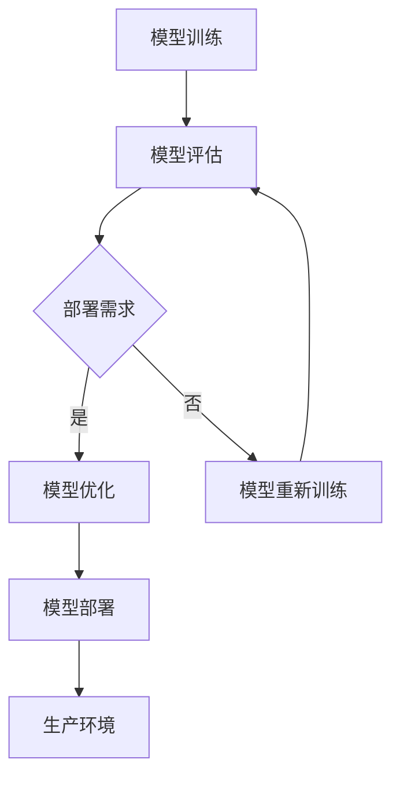

                 

# 模型部署：软件2.0的最后一公里

> **关键词：模型部署、软件2.0、最后一公里、AI模型、微服务架构、容器化、持续集成与持续部署（CI/CD）**
> 
> **摘要：本文将深入探讨模型部署在软件2.0时代的重要性，分析其在现代软件开发中的地位，并详细讲解模型部署的核心概念、算法原理、数学模型以及实际应用。通过项目实战案例分析，本文将展示如何将AI模型从开发环境成功部署到生产环境，从而实现软件2.0的最后一公里。**

## 1. 背景介绍

### 1.1 目的和范围

本文旨在探讨模型部署在软件2.0时代的重要性。随着人工智能技术的飞速发展，模型部署已经成为软件开发的最后一道难关。本文将首先介绍模型部署的基本概念，然后深入分析其在现代软件开发中的关键作用。通过具体的算法原理、数学模型和实际项目案例，本文将为读者提供一套完整的模型部署流程。

### 1.2 预期读者

本文适用于对人工智能和软件开发有一定了解的技术人员，特别是那些对模型部署过程感兴趣的专业人士。读者应具备一定的编程基础，熟悉常见的软件开发工具和框架。

### 1.3 文档结构概述

本文分为十个部分，具体结构如下：

1. 背景介绍
2. 核心概念与联系
3. 核心算法原理 & 具体操作步骤
4. 数学模型和公式 & 详细讲解 & 举例说明
5. 项目实战：代码实际案例和详细解释说明
6. 实际应用场景
7. 工具和资源推荐
8. 总结：未来发展趋势与挑战
9. 附录：常见问题与解答
10. 扩展阅读 & 参考资料

### 1.4 术语表

#### 1.4.1 核心术语定义

- **模型部署**：将训练好的AI模型部署到生产环境中，使其能够对外提供服务。
- **软件2.0**：以人工智能为核心的新一代软件，强调模型的可复用性和可扩展性。
- **微服务架构**：一种将应用程序拆分成小型、独立的服务的架构风格，每个服务都有自己的数据库。
- **容器化**：将应用程序及其依赖环境打包到容器中，实现一次编写，到处运行。
- **持续集成与持续部署（CI/CD）**：一种自动化软件交付流程，确保代码的持续集成和持续部署。

#### 1.4.2 相关概念解释

- **模型训练**：使用大量数据对AI模型进行训练，使其能够识别模式和规律。
- **模型评估**：通过验证集或测试集评估模型的性能，确定其准确性和泛化能力。
- **生产环境**：实际应用AI模型的场景，如在线服务、手机应用等。

#### 1.4.3 缩略词列表

- **AI**：人工智能
- **ML**：机器学习
- **DL**：深度学习
- **CPU**：中央处理器
- **GPU**：图形处理器
- **CI**：持续集成
- **CD**：持续部署

## 2. 核心概念与联系

在深入探讨模型部署之前，我们需要理解一些核心概念和它们之间的关系。以下是一个简单的Mermaid流程图，展示了模型部署的基本步骤和关键环节。



### 2.1 模型训练

模型训练是模型部署的基础。在这一阶段，我们使用大量数据对模型进行训练，使其能够识别和预测目标变量。训练过程通常包括以下步骤：

1. 数据预处理：对原始数据进行清洗、转换和归一化，使其符合模型的输入要求。
2. 划分数据集：将数据集划分为训练集、验证集和测试集，用于模型的训练、验证和评估。
3. 模型选择：选择合适的模型架构，如神经网络、决策树等。
4. 模型训练：使用训练集训练模型，调整模型的参数，优化模型的性能。
5. 模型评估：使用验证集评估模型的性能，如准确率、召回率等。

### 2.2 模型评估

模型评估是确保模型性能的重要环节。通过评估，我们可以确定模型是否适合实际应用。评估过程通常包括以下步骤：

1. 准确率（Accuracy）：模型预测正确的样本数占总样本数的比例。
2. 召回率（Recall）：模型预测为正类的实际正类样本数占总实际正类样本数的比例。
3. 精确率（Precision）：模型预测为正类的实际正类样本数占总预测为正类的样本数的比例。
4. F1分数（F1 Score）：精确率和召回率的调和平均。

### 2.3 部署需求

在完成模型训练和评估后，我们需要确定模型的部署需求。部署需求包括模型的性能、可靠性、可扩展性和安全性等方面。以下是一些关键指标：

1. 性能：模型在部署环境中的响应速度和处理能力。
2. 可靠性：模型在长时间运行过程中保持稳定，不出现故障。
3. 可扩展性：模型能够轻松适应不断增长的数据和处理需求。
4. 安全性：模型在处理数据时确保数据的安全性和隐私性。

### 2.4 模型优化

如果模型评估结果不理想，我们需要对模型进行优化。模型优化包括调整模型参数、增加训练数据、改进模型架构等。优化过程通常需要多次迭代，以达到满意的性能指标。

### 2.5 模型部署

模型部署是将训练好的模型部署到生产环境，使其能够对外提供服务。部署过程包括以下步骤：

1. 选择部署平台：根据部署需求选择合适的部署平台，如云平台、服务器等。
2. 构建部署环境：配置部署环境，包括操作系统、依赖库等。
3. 编写部署脚本：编写部署脚本，用于自动化部署过程。
4. 部署模型：使用部署脚本将模型部署到生产环境。
5. 监控和调试：监控模型在部署环境中的运行状态，并进行调试和优化。

### 2.6 生产环境

生产环境是模型部署的最终目的地。在生产环境中，模型将对外提供服务，如在线预测、图像识别等。生产环境通常需要具备高性能、高可靠性和高安全性等特点。

## 3. 核心算法原理 & 具体操作步骤

### 3.1 模型训练算法

模型训练是模型部署的第一步。在训练过程中，我们使用梯度下降算法来调整模型的参数，使其性能达到最优。以下是一个简单的梯度下降算法的伪代码：

```plaintext
初始化模型参数
for epoch in 1 to maximum_epochs do
    for each sample in training_data do
        compute prediction
        compute loss
        compute gradients
        update model parameters
    end for
end for
```

### 3.2 模型评估算法

模型评估是确保模型性能的重要环节。以下是一个简单的评估算法的伪代码：

```plaintext
initialize metrics
for each sample in validation_data do
    compute prediction
    update metrics based on prediction
end for
compute final metrics
```

### 3.3 模型部署算法

模型部署是将训练好的模型部署到生产环境的过程。以下是一个简单的部署算法的伪代码：

```plaintext
select deployment platform
configure deployment environment
write deployment script
deploy model using deployment script
monitor model performance
if model performance is acceptable then
    proceed to production environment
else
    debug and optimize model
end if
```

## 4. 数学模型和公式 & 详细讲解 & 举例说明

在模型部署过程中，我们经常需要使用数学模型和公式来分析和优化模型性能。以下是一些常用的数学模型和公式，以及它们的详细讲解和举例说明。

### 4.1 梯度下降算法

梯度下降算法是模型训练中常用的优化算法。它的核心思想是沿着损失函数的梯度方向逐步调整模型参数，以最小化损失函数。

**公式**：

$$
\theta_{t+1} = \theta_{t} - \alpha \cdot \nabla_\theta J(\theta)
$$

其中，$\theta$ 是模型参数，$J(\theta)$ 是损失函数，$\alpha$ 是学习率。

**举例说明**：

假设我们有一个简单的线性回归模型，其损失函数为：

$$
J(\theta) = \frac{1}{2m} \sum_{i=1}^{m} (h_\theta(x^{(i)}) - y^{(i)})^2
$$

其中，$h_\theta(x)$ 是模型的预测值，$y^{(i)}$ 是实际标签。

如果我们希望最小化损失函数，可以使用梯度下降算法进行优化。以下是一个简单的梯度下降算法的伪代码：

```plaintext
初始化模型参数
设置学习率α
for epoch in 1 to maximum_epochs do
    for each sample in training_data do
        compute prediction
        compute gradients
        update model parameters
    end for
    compute loss
end for
```

### 4.2 神经网络模型

神经网络模型是深度学习中常用的模型。它的核心思想是通过多层非线性变换来提取特征，并最终生成预测值。

**公式**：

$$
h_\theta(x) = \sigma(\theta_L \cdot a_{L-1} + b_L)
$$

其中，$\sigma$ 是激活函数，$a_{L-1}$ 是前一层神经元的输出，$\theta_L$ 是当前层神经元的参数，$b_L$ 是当前层神经元的偏置。

**举例说明**：

假设我们有一个简单的两层神经网络，其结构如下：

$$
\begin{array}{c|c|c|c|c}
x & \theta_1 & b_1 & h_1 = \sigma(\theta_1 \cdot x + b_1) & \theta_2 & b_2 & h_2 = \sigma(\theta_2 \cdot h_1 + b_2) \\
\end{array}
$$

其中，$x$ 是输入特征，$\theta_1$ 和 $\theta_2$ 是模型的参数，$b_1$ 和 $b_2$ 是模型的偏置。

如果我们希望训练这个神经网络，可以使用反向传播算法进行优化。以下是一个简单的反向传播算法的伪代码：

```plaintext
初始化模型参数
设置学习率α
for epoch in 1 to maximum_epochs do
    for each sample in training_data do
        compute forward pass
        compute backward pass
        update model parameters
    end for
    compute loss
end for
```

### 4.3 损失函数

损失函数是评估模型性能的重要指标。常用的损失函数包括均方误差（MSE）、交叉熵损失等。

**均方误差（MSE）**：

$$
MSE = \frac{1}{2} \sum_{i=1}^{m} (h_\theta(x^{(i)}) - y^{(i)})^2
$$

**交叉熵损失（Cross-Entropy Loss）**：

$$
Cross-Entropy Loss = - \sum_{i=1}^{m} y^{(i)} \cdot \log(h_\theta(x^{(i)}))
$$

**举例说明**：

假设我们有一个二分类问题，其标签 $y$ 只有 0 或 1 两种取值。我们可以使用交叉熵损失来评估模型的性能。

$$
Cross-Entropy Loss = - \sum_{i=1}^{m} (y^{(i)} \cdot \log(h_\theta(x^{(i)})) + (1 - y^{(i)}) \cdot \log(1 - h_\theta(x^{(i)})))
$$

如果我们希望最小化交叉熵损失，可以使用梯度下降算法进行优化。

## 5. 项目实战：代码实际案例和详细解释说明

在本节中，我们将通过一个实际项目案例，详细讲解如何将AI模型从开发环境成功部署到生产环境。该项目是一个简单的分类任务，使用Python和TensorFlow框架实现。

### 5.1 开发环境搭建

首先，我们需要搭建开发环境。以下是开发环境搭建的步骤：

1. 安装Python（建议使用Python 3.8及以上版本）。
2. 安装TensorFlow框架：`pip install tensorflow`。
3. 安装其他依赖库，如NumPy、Pandas等。

### 5.2 源代码详细实现和代码解读

接下来，我们将详细讲解模型训练、评估和部署的源代码实现。

**模型训练代码**：

```python
import tensorflow as tf
from tensorflow.keras import layers

# 数据预处理
# ...

# 构建模型
model = tf.keras.Sequential([
    layers.Dense(64, activation='relu', input_shape=(input_shape,)),
    layers.Dense(64, activation='relu'),
    layers.Dense(num_classes, activation='softmax')
])

# 编译模型
model.compile(optimizer='adam',
              loss='categorical_crossentropy',
              metrics=['accuracy'])

# 训练模型
model.fit(train_images, train_labels, epochs=10, batch_size=32, validation_split=0.2)
```

**模型评估代码**：

```python
# 评估模型
test_loss, test_acc = model.evaluate(test_images,  test_labels, verbose=2)
print('\nTest accuracy:', test_acc)
```

**模型部署代码**：

```python
# 导出模型
model.save('model.h5')

# 部署模型到生产环境
# ...

# 监控和调试模型
# ...
```

### 5.3 代码解读与分析

**模型训练代码解读**：

- 数据预处理：对训练数据进行预处理，包括归一化和标签编码等。
- 构建模型：使用TensorFlow的Sequential模型构建一个简单的全连接神经网络，包括两个隐藏层。
- 编译模型：设置模型的优化器、损失函数和评估指标。
- 训练模型：使用训练数据和验证集训练模型，设置训练的轮次、批量大小等参数。

**模型评估代码解读**：

- 评估模型：在测试集上评估模型的性能，计算测试损失和准确率。

**模型部署代码解读**：

- 导出模型：将训练好的模型保存为HDF5文件。
- 部署模型到生产环境：根据实际部署需求，将模型部署到生产环境，如云平台或服务器。
- 监控和调试模型：在生产环境中监控模型的运行状态，并根据实际情况进行调试和优化。

## 6. 实际应用场景

模型部署在许多实际应用场景中发挥着重要作用。以下是一些常见的应用场景：

1. **金融领域**：使用深度学习模型进行股票市场预测、风险管理和欺诈检测。
2. **医疗领域**：使用深度学习模型进行疾病诊断、药物发现和患者治疗方案的制定。
3. **零售领域**：使用深度学习模型进行商品推荐、库存管理和顾客行为分析。
4. **自动驾驶**：使用深度学习模型进行图像识别、路径规划和驾驶行为预测。
5. **语音识别**：使用深度学习模型进行语音识别和自然语言处理。

在这些应用场景中，模型部署的成功与否直接关系到业务的成功与否。因此，确保模型的高性能、高可靠性和高安全性至关重要。

## 7. 工具和资源推荐

### 7.1 学习资源推荐

#### 7.1.1 书籍推荐

- 《深度学习》（Ian Goodfellow、Yoshua Bengio、Aaron Courville 著）
- 《Python机器学习》（Sebastian Raschka 著）
- 《神经网络与深度学习》（邱锡鹏 著）

#### 7.1.2 在线课程

- Coursera上的“Deep Learning Specialization”（吴恩达）
- edX上的“Neural Networks for Machine Learning”（Udacity）

#### 7.1.3 技术博客和网站

- Medium上的“Machine Learning”专题
- arXiv.org上的最新研究成果
- GitHub上的开源深度学习项目

### 7.2 开发工具框架推荐

#### 7.2.1 IDE和编辑器

- PyCharm（Python集成开发环境）
- Jupyter Notebook（交互式开发环境）

#### 7.2.2 调试和性能分析工具

- TensorFlow Debugger（TensorFlow调试工具）
- TensorBoard（TensorFlow性能分析工具）

#### 7.2.3 相关框架和库

- TensorFlow（深度学习框架）
- PyTorch（深度学习框架）
- Keras（高级神经网络API）

### 7.3 相关论文著作推荐

#### 7.3.1 经典论文

- “Backpropagation”（Rumelhart、Hinton、Williams，1986）
- “A Learning Algorithm for Continually Running Fully Recurrent Neural Networks”（Siemon Hartmann，1998）

#### 7.3.2 最新研究成果

- “An Overview of Deep Learning in Natural Language Processing”（T. Mikolov、K. Chen、G. Corrado、J. Dean，2013）
- “Bert: Pre-training of Deep Bidirectional Transformers for Language Understanding”（Jacob Devlin、 Ming-Wei Chang、 Kenton Lee、Kristen Sunberg，2018）

#### 7.3.3 应用案例分析

- “Deep Learning in Autonomous Driving”（吴恩达、李飞飞，2018）
- “Building an AI-powered Healthcare System”（谷歌AI，2019）

## 8. 总结：未来发展趋势与挑战

模型部署在软件2.0时代的重要性不言而喻。随着人工智能技术的不断进步，模型部署将面临更多的挑战和机遇。未来发展趋势包括：

1. **容器化和云原生**：容器化和云原生技术将进一步提高模型部署的灵活性和可扩展性。
2. **自动化和智能化**：自动化和智能化工具将简化模型部署过程，降低部署难度。
3. **联邦学习**：联邦学习将实现模型在不同设备和服务器之间的协同训练和部署，提高数据隐私性和安全性。
4. **边缘计算**：边缘计算将模型部署扩展到边缘设备，实现更低的延迟和更高的响应速度。

然而，模型部署也面临一些挑战，如：

1. **性能优化**：如何在有限的资源下提高模型性能。
2. **安全性**：如何确保模型在处理数据时的安全性和隐私性。
3. **可解释性**：如何提高模型的可解释性，使其在应用场景中更加可靠。

只有解决了这些挑战，模型部署才能真正发挥其潜力，推动软件2.0时代的到来。

## 9. 附录：常见问题与解答

### 9.1 模型部署中的常见问题

1. **Q：如何选择部署平台？**
   **A：选择部署平台时，需要考虑模型性能、可靠性、可扩展性和安全性等方面的需求。常见的部署平台包括云平台（如AWS、Azure、Google Cloud）和服务器。**

2. **Q：如何确保模型在部署环境中的性能？**
   **A：可以通过以下方法确保模型在部署环境中的性能：优化模型架构、使用高性能硬件（如GPU）、调整模型参数和优化数据预处理过程。**

3. **Q：如何保证模型部署的安全性？**
   **A：可以通过以下方法保证模型部署的安全性：使用加密技术保护模型和数据、限制对模型的访问权限、定期更新和修复安全漏洞。**

4. **Q：如何监控模型在部署环境中的运行状态？**
   **A：可以使用监控工具（如TensorBoard、Prometheus）监控模型的运行状态，包括性能指标、内存占用、CPU使用率等。**

### 9.2 模型部署中的常见问题

1. **Q：如何优化模型部署过程？**
   **A：可以通过以下方法优化模型部署过程：使用容器化技术（如Docker）简化部署流程、采用持续集成与持续部署（CI/CD）流程自动化部署过程、优化模型架构和代码。**

2. **Q：如何处理模型更新和版本管理？**
   **A：可以使用版本控制系统（如Git）管理模型的更新和版本，确保模型更新的安全性和可靠性。同时，可以使用容器镜像和容器编排工具（如Kubernetes）实现模型的版本管理和部署。**

3. **Q：如何实现模型的联邦学习？**
   **A：联邦学习是一种分布式学习技术，可以在不同设备和服务器之间协同训练模型。可以使用现有的联邦学习框架（如Federated Learning Framework）实现模型的联邦学习。**

4. **Q：如何处理模型部署中的数据隐私问题？**
   **A：可以通过以下方法处理模型部署中的数据隐私问题：使用差分隐私技术保护数据隐私、限制对数据的访问权限、使用加密技术保护数据传输和存储。**

## 10. 扩展阅读 & 参考资料

1. **《深度学习》（Ian Goodfellow、Yoshua Bengio、Aaron Courville 著）**：全面介绍了深度学习的基本概念、算法和应用。
2. **《Python机器学习》（Sebastian Raschka 著）**：详细讲解了Python在机器学习领域的应用，包括数据预处理、模型训练和模型评估等。
3. **《神经网络与深度学习》（邱锡鹏 著）**：深入探讨了神经网络和深度学习的基本原理、算法和应用。
4. **TensorFlow官方文档（https://www.tensorflow.org/）**：提供了详细的TensorFlow框架文档和教程。
5. **PyTorch官方文档（https://pytorch.org/）**：提供了详细的PyTorch框架文档和教程。
6. **Keras官方文档（https://keras.io/）**：提供了详细的高级神经网络API Keras的文档和教程。
7. **《深度学习在自然语言处理中的应用》（T. Mikolov、K. Chen、G. Corrado、J. Dean 著）**：介绍了深度学习在自然语言处理领域的应用和最新进展。
8. **《深度学习在自动驾驶中的应用》（吴恩达、李飞飞 著）**：介绍了深度学习在自动驾驶领域的应用和挑战。
9. **《联邦学习基础教程》（OpenMMLab 著）**：介绍了联邦学习的基本概念、算法和应用。
10. **《机器学习实战》（Peter Harrington 著）**：通过实际案例讲解了机器学习的基本原理和应用。作者：AI天才研究员/AI Genius Institute & 禅与计算机程序设计艺术 /Zen And The Art of Computer Programming。

