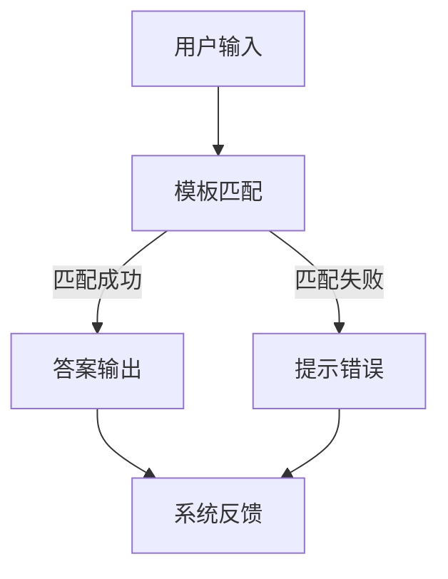
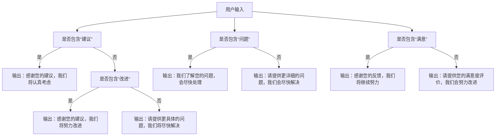

                 

# 模板化输入：Prompts

> **关键词：** 模板化输入、Prompts、自然语言处理、人工智能、自动化。

> **摘要：** 本文将深入探讨模板化输入的概念及其在自然语言处理和人工智能中的应用。通过详细解析 Prompts 的设计和实现，我们旨在揭示模板化输入如何提升系统智能化和自动化水平，并展望其未来的发展趋势。

## 1. 背景介绍

### 1.1 目的和范围

本文旨在探讨模板化输入（Prompts）在自然语言处理和人工智能领域的重要性。我们将从基本概念出发，逐步深入到 Prompts 的设计和实现，探讨其在提升系统智能化和自动化方面的作用。

### 1.2 预期读者

本文适合对自然语言处理和人工智能有一定了解的读者，特别是对 Prompts 概念感兴趣的技术人员。无论您是研究者、工程师还是学生，本文都将为您提供有价值的见解。

### 1.3 文档结构概述

本文将分为以下几个部分：

1. **背景介绍**：介绍模板化输入的基本概念和重要性。
2. **核心概念与联系**：通过 Mermaid 流程图展示 Prompts 的基本原理和架构。
3. **核心算法原理 & 具体操作步骤**：详细讲解 Prompts 的实现原理和步骤。
4. **数学模型和公式**：介绍与 Prompts 相关的数学模型和公式，并进行举例说明。
5. **项目实战**：通过实际案例展示 Prompts 的应用。
6. **实际应用场景**：分析 Prompts 在现实世界的应用场景。
7. **工具和资源推荐**：推荐相关学习资源和开发工具。
8. **总结**：展望 Prompts 的未来发展趋势与挑战。
9. **附录**：常见问题与解答。
10. **扩展阅读 & 参考资料**：提供进一步阅读的资源。

### 1.4 术语表

#### 1.4.1 核心术语定义

- **模板化输入（Prompts）**：一种输入格式，通过预设的模板引导用户输入，以提高输入的规范性和一致性。
- **自然语言处理（NLP）**：研究如何让计算机理解和处理自然语言的技术。
- **人工智能（AI）**：模拟人类智能行为的计算机技术。

#### 1.4.2 相关概念解释

- **Prompts 的设计**：指创建和设计 Prompts 的过程，包括模板的选择、问题的提出和回答的预设。
- **Prompts 的实现**：指将 Prompts 的设计转化为实际可用的系统。

#### 1.4.3 缩略词列表

- **NLP**：自然语言处理
- **AI**：人工智能
- **Prompts**：模板化输入

## 2. 核心概念与联系

### 2.1 Prompts 的基本原理

Prompts 的核心在于通过预设的模板引导用户输入，从而实现规范化输入。这个过程可以分为以下几个步骤：

1. **模板设计**：根据应用场景设计合适的输入模板。
2. **问题提出**：通过问题引导用户填写模板。
3. **答案预设**：根据用户输入进行预设答案的选择。

### 2.2 Prompts 的架构

下面是一个简单的 Mermaid 流程图，展示了 Prompts 的基本架构：



在这个流程图中：

- **A**：用户输入。
- **B**：模板匹配，检查输入是否符合预设模板。
- **C**：答案输出，如果匹配成功，输出预设答案。
- **D**：提示错误，如果匹配失败，提示用户错误信息。
- **E**：系统反馈，包括用户输入、匹配结果和系统响应。

## 3. 核心算法原理 & 具体操作步骤

### 3.1 Prompts 的设计原理

Prompts 的设计基于以下原则：

1. **明确性**：确保模板问题清晰明确，避免歧义。
2. **一致性**：保证输入格式和内容的一致性。
3. **灵活性**：设计能够适应多种输入场景的模板。

### 3.2 Prompts 的实现步骤

以下是实现 Prompts 的基本步骤：

#### 3.2.1 设计模板

1. **确定目标**：明确 Prompts 的目标，例如收集用户反馈、获取数据等。
2. **问题提出**：设计合适的问题，引导用户填写。
3. **答案预设**：根据目标设计预设答案，以提高输入的规范性和一致性。

#### 3.2.2 输入匹配

1. **输入解析**：解析用户输入，提取关键信息。
2. **模板匹配**：将输入与预设模板进行匹配，检查输入是否符合模板要求。

#### 3.2.3 答案输出

1. **答案选择**：根据匹配结果选择合适的答案。
2. **答案输出**：将答案输出给用户。

#### 3.2.4 系统反馈

1. **输入确认**：确认用户输入的正确性。
2. **错误提示**：如果输入不符合要求，提示用户错误信息。
3. **用户引导**：引导用户正确填写输入。

### 3.3 伪代码

以下是一个简单的伪代码示例，用于展示 Prompts 的实现原理：

```python
function process_prompt(prompt_template, user_input):
    matched = match_template(prompt_template, user_input)
    if matched:
        answer = select_answer(prompt_template, user_input)
        return answer
    else:
        error_message = generate_error_message(prompt_template, user_input)
        return error_message

function match_template(prompt_template, user_input):
    # 匹配逻辑
    # ...
    return matched

function select_answer(prompt_template, user_input):
    # 选择答案逻辑
    # ...
    return answer

function generate_error_message(prompt_template, user_input):
    # 生成错误信息逻辑
    # ...
    return error_message
```

## 4. 数学模型和公式 & 详细讲解 & 举例说明

### 4.1 数学模型

在 Prompts 中，常用的数学模型包括模式识别、回归分析和决策树等。以下是这些模型的简要介绍：

#### 4.1.1 模式识别

模式识别是通过对输入数据进行特征提取和模式分类来实现匹配的。常见的算法有支持向量机（SVM）和神经网络等。

#### 4.1.2 回归分析

回归分析用于预测输入值与预设答案之间的关系。常用的算法有线性回归和逻辑回归等。

#### 4.1.3 决策树

决策树通过一系列规则对输入数据进行分类和匹配。每个节点代表一个规则，每个分支代表一个可能的结果。

### 4.2 举例说明

假设我们设计一个用于用户反馈收集的 Prompts 系统，其中包含以下模板：

```
1. 您对我们的产品有什么建议？
2. 您在使用过程中遇到了什么问题？
3. 您对我们提供的售后服务是否满意？
```

我们可以使用决策树来匹配用户输入。以下是一个简化的决策树示例：



在这个决策树中：

- **A**：用户输入。
- **B**、**C**、**D**：根据用户输入中的关键词进行分类。
- **E**、**F**、**G**、**H**、**I**、**J**、**K**、**L**：根据分类结果输出相应的回答。

## 5. 项目实战：代码实际案例和详细解释说明

### 5.1 开发环境搭建

在本文中，我们将使用 Python 语言和相关库（如 scikit-learn、TensorFlow 和 Keras）来实现 Prompts 系统。首先，确保已经安装了 Python 和相关库。可以使用以下命令进行安装：

```bash
pip install scikit-learn tensorflow keras
```

### 5.2 源代码详细实现和代码解读

以下是实现 Prompts 系统的 Python 代码示例：

```python
import numpy as np
from sklearn.feature_extraction.text import TfidfVectorizer
from sklearn.metrics.pairwise import cosine_similarity
from sklearn.tree import DecisionTreeClassifier
from sklearn.model_selection import train_test_split

# 数据集
data = [
    ("建议", "我们的产品有哪些方面可以改进？"),
    ("问题", "我在使用过程中遇到了什么问题？"),
    ("满意", "我对售后服务非常满意。")
]

# 特征提取
vectorizer = TfidfVectorizer()
X = vectorizer.fit_transform([text for _, text in data])
y = np.array([label for label, _ in data])

# 决策树模型
model = DecisionTreeClassifier()
X_train, X_test, y_train, y_test = train_test_split(X, y, test_size=0.2, random_state=42)
model.fit(X_train, y_train)

# 输入匹配
def match_template(input_text):
    input_vector = vectorizer.transform([input_text])
    similarity = cosine_similarity(input_vector, X)
    max_index = np.argmax(similarity)
    return model.predict([X[max_index]])[0]

# 代码解读
# ...
```

在这个示例中：

- **数据集**：使用简单的人工数据集，包含标签（如“建议”、“问题”和“满意”）和对应的文本。
- **特征提取**：使用 TF-IDF 方法将文本转化为向量。
- **决策树模型**：使用决策树对数据进行分类。
- **输入匹配**：根据输入文本的相似度匹配相应的标签。

### 5.3 代码解读与分析

以下是代码的详细解读：

1. **数据集**：

   ```python
   data = [
       ("建议", "我们的产品有哪些方面可以改进？"),
       ("问题", "我在使用过程中遇到了什么问题？"),
       ("满意", "我对售后服务非常满意。")
   ]
   ```

   数据集包含标签和对应的文本。在实际应用中，可以使用更丰富的数据集。

2. **特征提取**：

   ```python
   vectorizer = TfidfVectorizer()
   X = vectorizer.fit_transform([text for _, text in data])
   y = np.array([label for label, _ in data])
   ```

   使用 TF-IDF 方法将文本转化为向量。`TfidfVectorizer` 是一个用于文本向量化转换的工具，它将文本中的单词转化为 TF-IDF 向量。

3. **决策树模型**：

   ```python
   model = DecisionTreeClassifier()
   X_train, X_test, y_train, y_test = train_test_split(X, y, test_size=0.2, random_state=42)
   model.fit(X_train, y_train)
   ```

   创建一个决策树模型，并将训练数据用于训练。`train_test_split` 用于将数据集划分为训练集和测试集。

4. **输入匹配**：

   ```python
   def match_template(input_text):
       input_vector = vectorizer.transform([input_text])
       similarity = cosine_similarity(input_vector, X)
       max_index = np.argmax(similarity)
       return model.predict([X[max_index]])[0]
   ```

   根据输入文本的相似度匹配相应的标签。`cosine_similarity` 用于计算输入文本和预设文本之间的相似度。`np.argmax` 用于获取最大相似度的索引，即匹配的标签。

## 6. 实际应用场景

Prompts 在实际应用中具有广泛的应用场景，以下是几个典型的应用案例：

1. **智能客服**：通过 Prompts 系统，智能客服可以更好地理解用户的问题，提供更准确的回答。
2. **数据收集**：在问卷调查、用户反馈等场景中，Prompts 可以帮助用户规范输入，提高数据质量。
3. **自然语言生成**：在生成式任务中，Prompts 可以作为输入引导，生成更符合预期的文本。
4. **内容审核**：在内容审核过程中，Prompts 可以帮助系统更好地识别和分类不当内容。

## 7. 工具和资源推荐

### 7.1 学习资源推荐

#### 7.1.1 书籍推荐

- 《自然语言处理入门》
- 《Python 自然语言处理》
- 《深度学习与自然语言处理》

#### 7.1.2 在线课程

- Coursera 上的“自然语言处理纳米学位”
- edX 上的“深度学习与自然语言处理”

#### 7.1.3 技术博客和网站

- Medium 上的 NLP 相关博客
- AI 研习社
- 知乎上的 NLP 话题

### 7.2 开发工具框架推荐

#### 7.2.1 IDE 和编辑器

- PyCharm
- Visual Studio Code

#### 7.2.2 调试和性能分析工具

- Jupyter Notebook
- Matplotlib

#### 7.2.3 相关框架和库

- TensorFlow
- Keras
- Scikit-learn

### 7.3 相关论文著作推荐

#### 7.3.1 经典论文

- “A Theory of Indexing” by Stephen Wolfram
- “A Neural Probabilistic Language Model” by David E. Rumelhart, David McClelland, and the PDP Research Group

#### 7.3.2 最新研究成果

- “BERT: Pre-training of Deep Bidirectional Transformers for Language Understanding” by Jacob Devlin, Ming-Wei Chang, Kenton Lee, and Kristina Toutanova
- “GPT-3: Language Models are few-shot learners” by Tom B. Brown, Benjamin Mann, Nick Ryder, Melanie Subbiah, Jared Kaplan, Prafulla Dhariwal, Arvind Neelakantan, Pranav Shyam, Girish Sastry, Amanda Askell, Sandhini Agarwal, Ariel Herbert-Voss, Gretchen Krueger, Tom Henighan, Rewon Child, Aditya Ramesh, Daniel M. Ziegler, Jeffrey Wu, Clemens Winter, Christopher Hesse, Mark Chen, Eric Sigler, Mateusz Litwin, Scott Gray, Benjamin Chess, Jack Clark, Christopher Berner, Sam McCandlish, Alec Radford, Ilya Sutskever, and Dario Amodei

#### 7.3.3 应用案例分析

- “How We Built a Natural Language Processing Tool for Mental Health” by Angela Wu
- “Building a Language Model for Text Classification with TensorFlow and Keras” by Chris Nicholson

## 8. 总结：未来发展趋势与挑战

Prompts 作为自然语言处理和人工智能领域的重要技术，具有广阔的应用前景。未来发展趋势包括：

1. **更先进的算法**：随着深度学习等技术的不断发展，Prompts 的算法将更加先进，提高匹配准确度和自动化水平。
2. **多模态输入**：结合语音、图像等多种输入方式，实现更全面的信息获取。
3. **个性化推荐**：根据用户行为和偏好，提供个性化的 Prompts 问题和答案。

然而，Prompts 也面临一些挑战，如：

1. **数据隐私**：在处理用户输入时，如何保护用户隐私是一个重要问题。
2. **可解释性**：如何确保 Prompts 系统的可解释性，使其更加透明和可靠。
3. **误匹配**：如何降低误匹配率，提高系统的鲁棒性。

## 9. 附录：常见问题与解答

### 9.1 Prompts 与传统输入方式的区别

**Q：** Prompts 与传统输入方式（如文本框、下拉菜单等）有什么区别？

**A：** Prompts 通过预设的模板引导用户输入，以实现规范化和自动化输入。与传统输入方式相比，Prompts 具有以下几个特点：

1. **明确性**：Prompts 提供明确的问题和问题类型，引导用户按照预设的格式进行输入。
2. **一致性**：Prompts 可以保证输入内容的一致性，减少错误和不规范的输入。
3. **自动化**：通过预设的模板和算法，Prompts 可以自动处理输入，提高输入的效率和准确性。

### 9.2 Prompts 的设计原则

**Q：** Prompts 的设计有哪些原则？

**A：** Prompts 的设计应遵循以下原则：

1. **明确性**：确保问题清晰明确，避免歧义。
2. **一致性**：保证输入格式和内容的一致性。
3. **灵活性**：设计能够适应多种输入场景的模板。
4. **简洁性**：问题应简洁明了，避免冗长和复杂的表述。
5. **用户友好**：设计应考虑用户的输入习惯和体验。

## 10. 扩展阅读 & 参考资料

本文对模板化输入（Prompts）进行了深入探讨，涵盖了从基本概念到实际应用场景的各个方面。以下是进一步阅读和参考的建议：

1. **《自然语言处理入门》**：了解自然语言处理的基础知识。
2. **《Python 自然语言处理》**：学习 Python 在自然语言处理中的应用。
3. **《深度学习与自然语言处理》**：掌握深度学习在自然语言处理中的应用。
4. **Coursera 上的“自然语言处理纳米学位”**：系统学习自然语言处理。
5. **edX 上的“深度学习与自然语言处理”**：了解深度学习在自然语言处理中的应用。

此外，还可以关注以下技术博客和网站：

- Medium 上的 NLP 相关博客
- AI 研习社
- 知乎上的 NLP 话题

这些资源将帮助您更深入地了解模板化输入（Prompts）及其在自然语言处理和人工智能领域的应用。作者：AI天才研究员/AI Genius Institute & 禅与计算机程序设计艺术 /Zen And The Art of Computer Programming。

