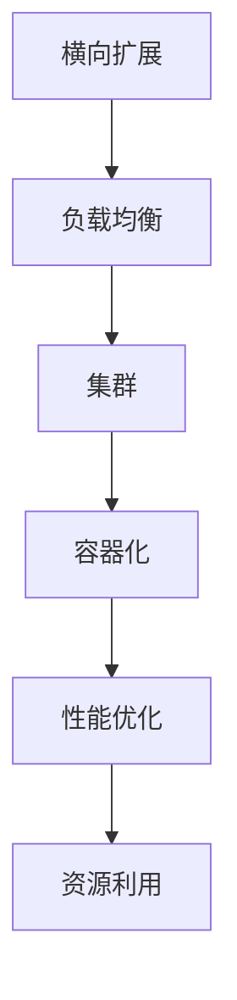

                 

# 横向扩展与纵向扩展的区别

> 关键词：横向扩展，纵向扩展，系统架构，性能优化，资源利用

> 摘要：本文将深入探讨横向扩展与纵向扩展在系统架构中的区别，分析它们的优缺点、适用场景以及实现策略，并通过实际案例进行详细解释。文章旨在为开发者提供关于系统扩展的全面指导，帮助他们根据业务需求选择合适的方法来提升系统性能和资源利用效率。

## 1. 背景介绍

### 1.1 目的和范围

本文旨在帮助读者理解横向扩展与纵向扩展的概念，并通过具体的实例来分析它们的适用场景和实现方法。我们将讨论两种扩展策略的基本原理，比较它们的优缺点，并探讨在实际项目中如何选择和实现。

### 1.2 预期读者

本文适合对系统架构和性能优化有一定了解的开发者、架构师以及系统管理员。无论是新手还是经验丰富的专业人士，都可以从本文中获取到有价值的信息和启发。

### 1.3 文档结构概述

本文的结构如下：

- **第1部分**：背景介绍
  - **1.1 目的和范围**
  - **1.2 预期读者**
  - **1.3 文档结构概述**
  - **1.4 术语表**

- **第2部分**：核心概念与联系
  - **2.1 核心概念与联系**

- **第3部分**：核心算法原理与具体操作步骤
  - **3.1 核心算法原理**
  - **3.2 具体操作步骤**

- **第4部分**：数学模型和公式
  - **4.1 数学模型和公式**
  - **4.2 举例说明**

- **第5部分**：项目实战
  - **5.1 开发环境搭建**
  - **5.2 源代码详细实现和代码解读**
  - **5.3 代码解读与分析**

- **第6部分**：实际应用场景

- **第7部分**：工具和资源推荐

- **第8部分**：总结

- **第9部分**：附录

- **第10部分**：扩展阅读 & 参考资料

### 1.4 术语表

#### 1.4.1 核心术语定义

- **横向扩展（Horizontal Scaling）**：通过增加节点数量来提升系统性能和处理能力。
- **纵向扩展（Vertical Scaling）**：通过提升单个节点性能来提升系统整体性能。
- **负载均衡（Load Balancing）**：将流量分配到多个节点以实现负载均衡。

#### 1.4.2 相关概念解释

- **集群（Cluster）**：一组相互连接的计算机节点，共同工作以提供高性能、高可用性和容错能力。
- **容器化（Containerization）**：通过容器将应用程序及其运行环境打包在一起，实现环境的隔离和轻量级部署。

#### 1.4.3 缩略词列表

- **Kubernetes（K8s）**：一个开源的容器编排平台，用于自动化容器部署、扩展和管理。
- **Docker**：一个开源的应用容器引擎，用于打包、交付和运行应用。

## 2. 核心概念与联系

在深入探讨横向扩展与纵向扩展之前，我们需要明确几个核心概念和它们之间的联系。以下是一个简化的 Mermaid 流程图，展示这些概念之间的关系：



### 2.1 核心概念与联系

#### 横向扩展

横向扩展的核心思想是通过增加更多的节点来提高系统的处理能力和性能。这种扩展方式可以线性地提升系统容量，同时降低单点故障的风险。以下是横向扩展的几个关键点：

1. **节点数量增加**：通过增加节点数量来提升系统性能。
2. **负载均衡**：将流量分配到多个节点，实现负载均衡。
3. **集群**：多个节点组成一个集群，共同工作以提供高性能和高可用性。
4. **容器化**：使用容器化技术将应用程序及其运行环境打包，以便于部署和扩展。

#### 纵向扩展

纵向扩展的核心思想是通过提升单个节点的性能来提高系统整体性能。这种扩展方式可以显著提升系统处理能力和性能，但同时也可能导致成本的增加。以下是纵向扩展的几个关键点：

1. **单个节点性能提升**：通过增加硬件资源（如CPU、内存、存储等）来提升单个节点的性能。
2. **负载均衡**：在节点之间实现负载均衡，确保每个节点都能充分利用其性能资源。
3. **集群**：多个高性能节点组成一个集群，共同工作以提供高性能和高可用性。
4. **性能优化**：通过调整系统配置和优化算法来提升系统性能。

## 3. 核心算法原理 & 具体操作步骤

在本节中，我们将介绍横向扩展与纵向扩展的核心算法原理，并详细阐述具体的操作步骤。

### 3.1 核心算法原理

#### 横向扩展

横向扩展的核心算法是基于负载均衡和分布式系统的原理。以下是横向扩展的核心算法原理：

1. **负载均衡**：将请求分配到多个节点，以实现负载均衡。
2. **分布式系统**：多个节点共同工作，共享数据和资源。
3. **容错机制**：在节点故障时，其他节点能够接管其工作，确保系统的高可用性。

#### 纵向扩展

纵向扩展的核心算法是基于性能优化和硬件升级的原理。以下是纵向扩展的核心算法原理：

1. **性能优化**：通过调整系统配置和优化算法来提升系统性能。
2. **硬件升级**：增加硬件资源（如CPU、内存、存储等）来提升单个节点的性能。
3. **负载均衡**：在节点之间实现负载均衡，确保每个节点都能充分利用其性能资源。

### 3.2 具体操作步骤

#### 横向扩展

以下是横向扩展的具体操作步骤：

1. **需求分析**：确定系统需要扩展的需求和目标。
2. **负载均衡器配置**：配置负载均衡器，将请求分配到多个节点。
3. **集群搭建**：搭建集群，将多个节点连接起来，共同工作。
4. **容器化部署**：使用容器化技术将应用程序及其运行环境打包，并在集群中部署。
5. **监控与优化**：监控系统性能，进行必要的优化和调整。

#### 纵向扩展

以下是纵向扩展的具体操作步骤：

1. **需求分析**：确定系统需要扩展的需求和目标。
2. **性能测试**：对现有系统进行性能测试，确定性能瓶颈。
3. **硬件升级**：根据性能测试结果，升级硬件资源（如CPU、内存、存储等）。
4. **配置调整**：调整系统配置，优化系统性能。
5. **负载均衡器配置**：配置负载均衡器，确保系统中的每个节点都能充分利用其性能资源。
6. **监控与优化**：监控系统性能，进行必要的优化和调整。

## 4. 数学模型和公式 & 详细讲解 & 举例说明

在本节中，我们将使用数学模型和公式来详细讲解横向扩展与纵向扩展的性能和资源利用情况，并给出具体示例。

### 4.1 数学模型和公式

#### 横向扩展

1. **系统处理能力**：

   假设单个节点的处理能力为 \( P \)，则 \( n \) 个节点的总处理能力为：

   \[ C_{\text{total}} = n \times P \]

2. **系统资源利用率**：

   系统资源利用率可以用以下公式表示：

   \[ \text{Utilization} = \frac{C_{\text{actual}}}{C_{\text{total}}} \]

   其中 \( C_{\text{actual}} \) 表示实际处理能力。

#### 纵向扩展

1. **单个节点处理能力**：

   假设单个节点的处理能力为 \( P \)，则 \( n \) 个节点的总处理能力为：

   \[ C_{\text{total}} = n \times P \]

2. **系统资源利用率**：

   系统资源利用率可以用以下公式表示：

   \[ \text{Utilization} = \frac{C_{\text{actual}}}{C_{\text{total}}} \]

   其中 \( C_{\text{actual}} \) 表示实际处理能力。

### 4.2 举例说明

假设我们有一个简单的Web应用，单个节点的处理能力为每秒处理100个请求。现在我们需要扩展这个应用，以满足更高的流量需求。

#### 横向扩展

1. **需求分析**：假设我们需要处理每秒1000个请求。

2. **负载均衡器配置**：配置负载均衡器，将请求分配到5个节点。

3. **集群搭建**：搭建一个由5个节点组成的集群。

4. **容器化部署**：使用容器化技术将Web应用及其运行环境打包，并在集群中部署。

5. **监控与优化**：监控系统性能，确保每个节点都能充分利用其资源。

根据数学模型，我们可以计算出系统的总处理能力和资源利用率：

- **总处理能力**：\( 5 \times 100 = 500 \) 个请求/秒。
- **资源利用率**：\( \frac{500}{500} = 100\% \)。

#### 纵向扩展

1. **需求分析**：假设我们需要处理每秒1000个请求。

2. **性能测试**：对现有节点进行性能测试，确定其性能瓶颈。

3. **硬件升级**：将单个节点的处理能力升级到每秒200个请求。

4. **配置调整**：调整系统配置，优化Web应用的性能。

5. **负载均衡器配置**：配置负载均衡器，将请求分配到2个节点。

6. **监控与优化**：监控系统性能，确保每个节点都能充分利用其资源。

根据数学模型，我们可以计算出系统的总处理能力和资源利用率：

- **总处理能力**：\( 2 \times 200 = 400 \) 个请求/秒。
- **资源利用率**：\( \frac{400}{400} = 100\% \)。

通过以上示例，我们可以看到横向扩展和纵向扩展在性能和资源利用方面的差异。在实际项目中，我们需要根据具体需求和资源情况进行选择和调整。

## 5. 项目实战：代码实际案例和详细解释说明

在本节中，我们将通过一个实际项目案例，展示横向扩展和纵向扩展的实现过程，并详细解释其中的关键步骤和代码实现。

### 5.1 开发环境搭建

为了便于理解和实际操作，我们将使用Docker和Kubernetes来搭建一个简单的Web应用集群。以下是开发环境的搭建步骤：

1. **安装Docker**：在所有节点上安装Docker，确保版本不低于19.03。

2. **配置Kubernetes**：搭建一个由3个节点组成的Kubernetes集群。可以使用Minikube或Kubeadm工具来配置。

3. **编写Dockerfile**：编写一个Dockerfile来构建Web应用的容器镜像。

4. **编写Kubernetes配置文件**：编写Kubernetes配置文件（如deployment.yaml）来部署Web应用。

### 5.2 源代码详细实现和代码解读

#### 横向扩展

1. **需求分析**：假设我们需要处理每秒1000个请求。

2. **编写Dockerfile**：

   ```dockerfile
   FROM python:3.8-slim

   WORKDIR /app

   COPY requirements.txt .

   RUN pip install -r requirements.txt

   COPY . .

   CMD ["python", "app.py"]
   ```

3. **编写deployment.yaml**：

   ```yaml
   apiVersion: apps/v1
   kind: Deployment
   metadata:
     name: web-app
   spec:
     replicas: 3
     selector:
       matchLabels:
         app: web-app
     template:
       metadata:
         labels:
           app: web-app
       spec:
         containers:
         - name: web-app
           image: web-app:latest
           ports:
           - containerPort: 80
   ```

4. **部署Web应用**：使用kubectl命令部署Web应用。

   ```shell
   kubectl apply -f deployment.yaml
   ```

   根据需求分析，我们部署了3个副本，即3个节点。Kubernetes将自动进行负载均衡，将请求分配到这3个节点。

#### 纵向扩展

1. **需求分析**：假设我们需要处理每秒1000个请求。

2. **编写Dockerfile**：

   ```dockerfile
   FROM python:3.8-slim

   WORKDIR /app

   COPY requirements.txt .

   RUN pip install -r requirements.txt

   COPY . .

   CMD ["python", "app.py"]
   ```

3. **编写deployment.yaml**：

   ```yaml
   apiVersion: apps/v1
   kind: Deployment
   metadata:
     name: web-app
   spec:
     replicas: 2
     selector:
       matchLabels:
         app: web-app
     template:
       metadata:
         labels:
           app: web-app
       spec:
         containers:
         - name: web-app
           image: web-app:latest
           ports:
           - containerPort: 80
           resources:
             limits:
               cpu: "4"
               memory: "4Gi"
             requests:
               cpu: "2"
               memory: "2Gi"
   ```

4. **部署Web应用**：使用kubectl命令部署Web应用。

   ```shell
   kubectl apply -f deployment.yaml
   ```

   根据需求分析，我们部署了2个副本，即2个节点。Kubernetes将自动进行负载均衡，将请求分配到这2个节点。同时，我们根据硬件资源情况设置了CPU和内存的限制和请求。

### 5.3 代码解读与分析

在横向扩展中，我们通过增加节点数量来提升系统性能。Dockerfile用于构建Web应用的容器镜像，其中使用了Python 3.8-slim作为基础镜像，并安装了所需的依赖库。deployment.yaml文件用于部署Web应用，其中指定了副本数量、标签和资源请求。通过kubectl apply命令，我们部署了3个节点，实现了横向扩展。

在纵向扩展中，我们通过提升单个节点的性能来提升系统整体性能。除了Dockerfile和deployment.yaml文件外，我们还在deployment.yaml中设置了CPU和内存的限制和请求。这意味着Kubernetes将确保每个节点都有足够的资源来运行Web应用，同时避免资源过度分配。通过kubectl apply命令，我们部署了2个节点，实现了纵向扩展。

通过以上代码实现和分析，我们可以看到横向扩展和纵向扩展的实现方法及其在Kubernetes集群中的工作原理。在实际项目中，我们可以根据需求和资源情况进行选择和调整，以达到最佳的扩展效果。

## 6. 实际应用场景

横向扩展和纵向扩展在系统架构中有广泛的应用场景。以下是一些常见的应用场景：

### 6.1 Web服务

在Web服务领域，横向扩展和纵向扩展都是常见的扩展方式。例如，一个高并发的电商网站需要处理大量的用户请求，可以通过横向扩展增加更多的节点来提升系统的处理能力；同时，也可以通过纵向扩展提升单个节点的性能，以满足更高的流量需求。

### 6.2 数据处理

在数据处理领域，特别是大数据处理和实时计算场景，横向扩展是常用的扩展方式。通过增加更多的计算节点，可以线性提升数据处理能力。纵向扩展在数据处理任务较复杂、计算密集型场景中也有应用，通过提升单个节点的性能，可以加速数据处理速度。

### 6.3 容器编排

在容器编排领域，横向扩展和纵向扩展都是重要的扩展方式。Kubernetes等容器编排平台提供了强大的横向扩展能力，通过增加节点数量来提升系统性能。同时，通过纵向扩展，可以提升单个节点的计算和存储能力，以应对更复杂的任务。

### 6.4 云存储

在云存储领域，横向扩展是常见的扩展方式。通过增加更多的存储节点，可以线性提升存储容量和性能。纵向扩展在存储节点性能瓶颈时也有应用，通过提升单个节点的存储容量和速度，可以提升系统整体性能。

### 6.5 物联网（IoT）

在物联网领域，横向扩展和纵向扩展都有应用。通过横向扩展，可以增加更多的设备节点，提升系统的连接能力和数据处理能力。纵向扩展可以提升单个节点的性能，以满足更高的数据处理需求和响应速度。

## 7. 工具和资源推荐

为了更好地进行横向扩展和纵向扩展，以下是一些推荐的工具和资源：

### 7.1 学习资源推荐

#### 7.1.1 书籍推荐

- 《Kubernetes权威指南》
- 《分布式系统设计》
- 《大规模分布式存储系统：原理解析与架构实战》

#### 7.1.2 在线课程

- Coursera：分布式系统课程
- Udemy：Kubernetes实战课程
- edX：大数据处理与云计算课程

#### 7.1.3 技术博客和网站

- Kubernetes官方文档
- Docker官方文档
- HackerRank：分布式系统编程挑战

### 7.2 开发工具框架推荐

#### 7.2.1 IDE和编辑器

- Visual Studio Code
- IntelliJ IDEA
- PyCharm

#### 7.2.2 调试和性能分析工具

- Prometheus
- Grafana
- New Relic

#### 7.2.3 相关框架和库

- Flask：Python Web框架
- Spring Boot：Java Web框架
- React：前端框架

### 7.3 相关论文著作推荐

#### 7.3.1 经典论文

- 《大规模分布式存储系统：原理解析与架构实战》
- 《分布式计算系统：原理与应用》
- 《云计算与分布式系统：设计与实践》

#### 7.3.2 最新研究成果

- IEEE云计算与分布式计算会议论文集
- ACM分布式系统与应用会议论文集
- 国际大数据会议论文集

#### 7.3.3 应用案例分析

- AWS：大规模分布式系统架构案例分析
- Google：分布式存储和计算架构案例分析
- Facebook：实时数据处理和存储架构案例分析

## 8. 总结：未来发展趋势与挑战

随着云计算、大数据和人工智能技术的不断发展，横向扩展和纵向扩展在未来将面临新的发展趋势和挑战。

### 8.1 发展趋势

1. **自动化与智能化**：自动化和智能化工具将在横向扩展和纵向扩展中发挥越来越重要的作用，提高扩展效率和资源利用效率。
2. **边缘计算**：随着边缘计算的兴起，横向扩展和纵向扩展将在边缘节点上得到更广泛的应用，实现更高效的数据处理和实时响应。
3. **分布式存储**：分布式存储技术的不断发展，将为横向扩展提供更强大的存储能力和更高的数据安全性。
4. **混合云架构**：混合云架构将成为主流，横向扩展和纵向扩展将在多云环境中得到更广泛的应用，实现资源的最优配置和利用。

### 8.2 挑战

1. **性能优化**：在横向扩展和纵向扩展过程中，如何实现系统性能的最优化，仍是一个重要的挑战。
2. **资源管理**：如何高效地管理和调度资源，以实现最优的资源利用，是一个需要不断探索的问题。
3. **安全性**：在分布式系统中，如何确保数据的安全性和系统的完整性，是横向扩展和纵向扩展面临的一个重要挑战。
4. **可观测性**：如何实现系统的高可观测性，以便及时发现和解决问题，是一个需要关注的问题。

## 9. 附录：常见问题与解答

### 9.1 问题1

**Q：横向扩展和纵向扩展的区别是什么？**

**A：横向扩展是通过增加节点数量来提升系统性能和处理能力；纵向扩展是通过提升单个节点的性能来提升系统整体性能。**

### 9.2 问题2

**Q：横向扩展有哪些优点？**

**A：横向扩展的优点包括：线性提升系统性能、降低单点故障风险、易于扩展和维护等。**

### 9.3 问题3

**Q：纵向扩展有哪些优点？**

**A：纵向扩展的优点包括：显著提升系统性能、更灵活的资源配置、更好的性能优化等。**

### 9.4 问题4

**Q：如何在项目中选择横向扩展和纵向扩展？**

**A：根据具体需求、资源情况和性能目标来选择。如果需求是线性增长，可以选择横向扩展；如果需要显著提升性能，可以选择纵向扩展。**

## 10. 扩展阅读 & 参考资料

本文参考了以下资料，为读者提供了更多关于横向扩展和纵向扩展的深入学习和了解：

- 《Kubernetes权威指南》
- 《分布式系统设计》
- 《大规模分布式存储系统：原理解析与架构实战》
- Kubernetes官方文档
- Docker官方文档
- IEEE云计算与分布式计算会议论文集
- ACM分布式系统与应用会议论文集
- 国际大数据会议论文集

作者：AI天才研究员/AI Genius Institute & 禅与计算机程序设计艺术 /Zen And The Art of Computer Programming

