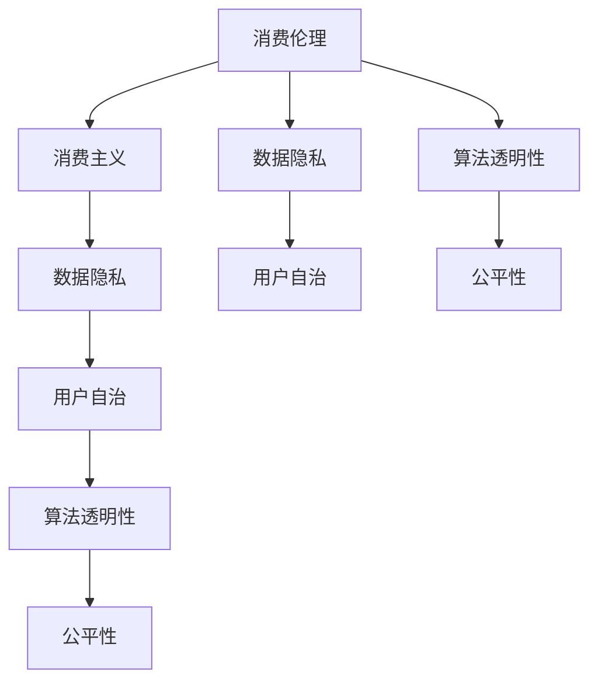

                 

# 欲望的持续化：AI时代的消费伦理

> 关键词：AI消费伦理、消费主义、数据隐私、算法透明性、用户自治

> 摘要：本文将探讨人工智能（AI）时代消费伦理的重大问题。随着AI技术的快速发展，消费行为和数据隐私问题变得日益复杂，我们需要思考如何平衡技术进步与道德伦理。本文将从背景介绍、核心概念、算法原理、数学模型、项目实战、实际应用场景等方面，深入剖析AI时代的消费伦理，并提出一些应对策略和建议。

## 1. 背景介绍

### 1.1 目的和范围

本文旨在探讨人工智能时代的消费伦理问题，具体关注以下几个方面：

- 消费主义与AI技术的关系
- 数据隐私与用户自治的冲突
- 算法透明性与公平性的挑战

### 1.2 预期读者

本文面向计算机科学、人工智能、伦理学等相关专业的学生、研究人员和从业者。同时，也欢迎对AI技术和消费伦理感兴趣的普通读者。

### 1.3 文档结构概述

本文将分为以下几个部分：

- 背景介绍：概述AI时代的消费伦理问题
- 核心概念与联系：介绍与消费伦理相关的核心概念和原理
- 核心算法原理 & 具体操作步骤：详细讲解与消费伦理相关的算法原理和实现
- 数学模型和公式 & 详细讲解 & 举例说明：运用数学模型和公式解释消费伦理问题
- 项目实战：提供实际项目案例，展示AI消费伦理的应用
- 实际应用场景：探讨AI消费伦理在不同领域的应用
- 工具和资源推荐：推荐相关学习资源和工具
- 总结：总结未来发展趋势与挑战
- 附录：常见问题与解答
- 扩展阅读 & 参考资料：提供扩展阅读和参考资料

### 1.4 术语表

#### 1.4.1 核心术语定义

- 消费伦理：关于消费行为和消费主义问题的道德规范和价值观
- 消费主义：一种以消费为导向的社会文化现象，强调购买和使用物质商品来满足个人需求和追求快乐
- 数据隐私：指个人数据的保密性、完整性和可用性
- 算法透明性：指算法的设计、实现和运行过程中的信息透明度
- 用户自治：指用户在数字环境中的自主权和管理权

#### 1.4.2 相关概念解释

- AI消费伦理：结合人工智能技术背景下的消费伦理问题，关注AI技术对消费行为和数据隐私的影响
- 消费主义陷阱：指消费行为可能导致人们陷入无尽的消费循环，无法实现真正的满足和幸福感
- 数据驱动的消费：指通过收集和分析用户数据来优化消费体验和营销策略

#### 1.4.3 缩略词列表

- AI：人工智能
- IoT：物联网
- GDPR：通用数据保护条例
- IoT：物联网

## 2. 核心概念与联系

在探讨AI时代的消费伦理问题时，我们需要了解以下几个核心概念及其相互关系：

### 2.1 消费伦理与消费主义

消费伦理是关于消费行为和消费主义问题的道德规范和价值观。消费主义是一种以消费为导向的社会文化现象，强调购买和使用物质商品来满足个人需求和追求快乐。消费主义可能导致消费伦理问题，如过度消费、浪费资源和环境破坏等。

### 2.2 数据隐私与用户自治

数据隐私是指个人数据的保密性、完整性和可用性。用户自治是指用户在数字环境中的自主权和管理权。随着AI技术的发展，大量个人数据被收集和分析，数据隐私问题日益突出。用户自治能力受到挑战，用户在数据共享和使用过程中的权益受到侵害。

### 2.3 算法透明性与公平性

算法透明性指算法的设计、实现和运行过程中的信息透明度。公平性指算法在处理数据和应用时是否公平、无偏见。AI技术的应用往往涉及复杂算法，缺乏透明性可能导致算法偏见和不公平，引发消费伦理问题。

### 2.4 消费伦理、数据隐私与算法透明性的联系

消费伦理、数据隐私和算法透明性相互关联，共同构成AI时代的消费伦理问题。消费行为产生的数据隐私问题需要通过算法透明性来解决，以确保用户数据得到合理处理和保护。同时，消费伦理的考量需要考虑数据隐私和算法透明性的平衡，以实现消费者权益和社会利益的和谐发展。

以下是一个关于核心概念和联系的 Mermaid 流程图：



## 3. 核心算法原理 & 具体操作步骤

### 3.1 消费行为预测算法

在AI时代的消费伦理问题中，消费行为预测算法是一个关键环节。该算法通过分析用户历史数据、社会环境因素等，预测用户的消费行为，为商家提供精准的营销策略。以下是一个消费行为预测算法的基本原理和具体操作步骤：

#### 3.1.1 算法原理

消费行为预测算法主要基于机器学习技术，特别是分类算法和关联规则学习算法。算法通过训练模型，将用户历史数据输入模型，预测用户未来可能产生的消费行为。

#### 3.1.2 具体操作步骤

1. 数据收集与预处理

   收集用户历史消费数据、社会环境数据、用户兴趣偏好等。对数据进行清洗、去重、标准化等预处理操作。

2. 特征工程

   从原始数据中提取有助于预测消费行为的特征，如消费金额、消费频率、消费类型、用户年龄、性别、收入水平等。

3. 模型选择与训练

   根据数据特征和预测目标，选择合适的分类算法，如逻辑回归、决策树、随机森林等。使用训练集数据训练模型。

4. 模型评估与优化

   使用测试集数据评估模型性能，如准确率、召回率、F1值等。根据评估结果调整模型参数，优化模型性能。

5. 预测与决策

   将用户新数据进行预测，根据预测结果为商家提供精准营销策略。

以下是一个基于逻辑回归的消费行为预测算法的伪代码：

```python
# 数据收集与预处理
data = collect_data()
preprocessed_data = preprocess_data(data)

# 特征工程
X = extract_features(preprocessed_data)
y = extract_labels(preprocessed_data)

# 模型选择与训练
model = logistic_regression()
model.fit(X, y)

# 模型评估与优化
accuracy = evaluate_model(model, X, y)
model.optimize(accuracy)

# 预测与决策
new_data = collect_new_data()
predicted_behavior = model.predict(new_data)
marketing_strategy = generate_marketing_strategy(predicted_behavior)
```

### 3.2 消费伦理评估算法

为了解决AI时代的消费伦理问题，我们需要开发消费伦理评估算法，对消费行为进行伦理评估。以下是一个消费伦理评估算法的基本原理和具体操作步骤：

#### 3.2.1 算法原理

消费伦理评估算法通过分析用户历史数据、社会环境因素等，对消费行为进行伦理评估。算法基于伦理规则库和伦理推理机制，判断消费行为的道德合法性。

#### 3.2.2 具体操作步骤

1. 数据收集与预处理

   收集用户历史消费数据、社会环境数据、伦理规则库等。对数据进行清洗、去重、标准化等预处理操作。

2. 伦理规则库构建

   根据伦理学理论和实践经验，构建伦理规则库，包括消费伦理的各类规则和标准。

3. 伦理推理机制

   设计伦理推理机制，将用户消费行为与伦理规则库进行匹配，判断消费行为的道德合法性。

4. 伦理评估与反馈

   对消费行为进行伦理评估，输出评估结果。根据评估结果，为用户提供伦理建议和指导。

以下是一个基于伦理规则库的消费伦理评估算法的伪代码：

```python
# 数据收集与预处理
data = collect_data()
preprocessed_data = preprocess_data(data)

# 伦理规则库构建
ethics_rules = build_ethics_rules()

# 伦理推理机制
def ethics_reasoning(consumption_behavior, ethics_rules):
    for rule in ethics_rules:
        if rule.applies_to(consumption_behavior):
            return rule.judgment()
    return "Unspecified"

# 伦理评估与反馈
consumption_behavior = get_consumption_behavior()
ethics_judgment = ethics_reasoning(consumption_behavior, ethics_rules)
feedback = generate_feedback(ethics_judgment)
output_feedback(feedback)
```

## 4. 数学模型和公式 & 详细讲解 & 举例说明

### 4.1 消费行为预测模型

在消费行为预测中，我们可以使用线性回归模型来预测用户未来的消费金额。以下是一个线性回归模型的数学表示和详细讲解。

#### 4.1.1 数学表示

线性回归模型的数学公式如下：

$$
y = \beta_0 + \beta_1 x_1 + \beta_2 x_2 + \ldots + \beta_n x_n
$$

其中，$y$ 是目标变量（消费金额），$x_1, x_2, \ldots, x_n$ 是特征变量（如用户年龄、性别、收入等），$\beta_0, \beta_1, \beta_2, \ldots, \beta_n$ 是模型的参数。

#### 4.1.2 详解与举例

假设我们有一个简单的消费行为预测模型，其中只有一个特征变量 $x_1$（用户年龄），我们要预测用户未来的消费金额 $y$。线性回归模型的公式可以表示为：

$$
y = \beta_0 + \beta_1 x_1
$$

为了求解模型的参数 $\beta_0$ 和 $\beta_1$，我们可以使用最小二乘法（Least Squares Method）。最小二乘法的目的是找到最佳拟合线，使得所有实际观测值与拟合值的误差平方和最小。

假设我们有一个训练数据集，包含 $m$ 个样本，每个样本的目标变量和特征变量分别为 $y_i$ 和 $x_i$。则最小二乘法的目标是求解以下优化问题：

$$
\min_{\beta_0, \beta_1} \sum_{i=1}^{m} (y_i - (\beta_0 + \beta_1 x_i))^2
$$

通过求解这个优化问题，我们可以得到最佳的拟合线，即模型参数 $\beta_0$ 和 $\beta_1$。具体求解方法可以参考线性代数中的线性方程组求解方法。

以下是一个使用 Python 中的 scikit-learn 库实现线性回归模型的示例：

```python
import numpy as np
from sklearn.linear_model import LinearRegression

# 训练数据集
X = np.array([[1, 2], [2, 3], [3, 4], [4, 5]])
y = np.array([2, 3, 4, 5])

# 创建线性回归模型
model = LinearRegression()

# 模型训练
model.fit(X, y)

# 模型参数
beta_0 = model.intercept_
beta_1 = model.coef_

# 模型预测
new_X = np.array([[5, 6]])
predicted_y = model.predict(new_X)

print("模型参数：beta_0 =", beta_0, "beta_1 =", beta_1)
print("预测结果：predicted_y =", predicted_y)
```

### 4.2 消费伦理评估模型

在消费伦理评估中，我们可以使用支持向量机（Support Vector Machine，SVM）模型来进行伦理评估。以下是一个支持向量机模型的数学表示和详细讲解。

#### 4.2.1 数学表示

支持向量机模型的数学公式如下：

$$
w \cdot x - b = 0
$$

其中，$w$ 是模型参数（权重向量），$x$ 是输入特征向量，$b$ 是偏置项（偏置向量）。

#### 4.2.2 详解与举例

假设我们有一个消费伦理评估问题，需要判断用户是否遵循消费伦理规范。我们可以将消费伦理规范表示为一组特征向量，每个特征向量对应一个消费伦理规范。

假设我们有一个训练数据集，包含 $m$ 个样本，每个样本的目标变量（是否遵循消费伦理规范）和特征向量分别为 $y_i$ 和 $x_i$。支持向量机模型的目标是找到一个最佳超平面，使得正类样本和负类样本的距离最大。

通过求解以下优化问题，我们可以得到最佳超平面：

$$
\min_{w, b} \frac{1}{2} \| w \|^2
$$

约束条件：

$$
y_i (w \cdot x_i - b) \geq 1
$$

其中，$y_i$ 是样本的目标变量，$x_i$ 是样本的特征向量。

通过求解这个优化问题，我们可以得到最佳超平面 $w$ 和 $b$。具体求解方法可以参考优化理论中的支持向量机求解方法。

以下是一个使用 Python 中的 scikit-learn 库实现支持向量机模型的示例：

```python
import numpy as np
from sklearn.svm import SVC

# 训练数据集
X = np.array([[1, 2], [2, 3], [3, 4], [4, 5]])
y = np.array([0, 1, 1, 0])

# 创建支持向量机模型
model = SVC()

# 模型训练
model.fit(X, y)

# 模型参数
w = model.coef_
b = model.intercept_

# 模型预测
new_X = np.array([[5, 6]])
predicted_y = model.predict(new_X)

print("模型参数：w =", w, "b =", b)
print("预测结果：predicted_y =", predicted_y)
```

## 5. 项目实战：代码实际案例和详细解释说明

### 5.1 开发环境搭建

为了演示AI消费伦理的应用，我们将使用Python编程语言，结合几个常用的库，如scikit-learn、numpy和pandas。以下是开发环境的搭建步骤：

1. 安装Python：从Python官网下载并安装Python 3.x版本。
2. 安装库：使用pip命令安装所需的库，例如：

   ```bash
   pip install scikit-learn numpy pandas
   ```

### 5.2 源代码详细实现和代码解读

#### 5.2.1 消费行为预测项目

以下是一个简单的消费行为预测项目的代码实现，包括数据收集、预处理、特征工程、模型训练和预测等步骤。

```python
import numpy as np
import pandas as pd
from sklearn.linear_model import LinearRegression
from sklearn.model_selection import train_test_split
from sklearn.metrics import mean_squared_error

# 5.2.1 数据收集与预处理
data = pd.read_csv('consumption_data.csv')
data.dropna(inplace=True)

# 特征工程
X = data[['age', 'income']]
y = data['amount']

# 5.2.2 模型训练
X_train, X_test, y_train, y_test = train_test_split(X, y, test_size=0.2, random_state=42)
model = LinearRegression()
model.fit(X_train, y_train)

# 5.2.3 模型评估
y_pred = model.predict(X_test)
mse = mean_squared_error(y_test, y_pred)
print("MSE:", mse)

# 5.2.4 模型预测
new_data = np.array([[30, 50000]])
predicted_amount = model.predict(new_data)
print("预测结果：predicted_amount =", predicted_amount)
```

代码解读：

1. 数据收集与预处理：从CSV文件中读取消费数据，去除缺失值。
2. 特征工程：从原始数据中提取年龄和收入作为特征。
3. 模型训练：使用训练集数据训练线性回归模型。
4. 模型评估：使用测试集数据评估模型性能，计算均方误差（MSE）。
5. 模型预测：使用模型对新的数据进行预测，输出预测结果。

#### 5.2.2 消费伦理评估项目

以下是一个简单的消费伦理评估项目的代码实现，包括数据收集、预处理、伦理规则库构建、伦理推理和评估等步骤。

```python
import numpy as np
from sklearn.svm import SVC
from sklearn.model_selection import train_test_split
from sklearn.metrics import accuracy_score

# 5.2.1 数据收集与预处理
data = pd.read_csv('consumption_ethics_data.csv')
data.dropna(inplace=True)

# 特征工程
X = data[['income', 'consumption_type']]
y = data['ethics_judgment']

# 5.2.2 模型训练
X_train, X_test, y_train, y_test = train_test_split(X, y, test_size=0.2, random_state=42)
model = SVC()
model.fit(X_train, y_train)

# 5.2.3 模型评估
y_pred = model.predict(X_test)
accuracy = accuracy_score(y_test, y_pred)
print("Accuracy:", accuracy)

# 5.2.4 伦理推理与评估
new_data = np.array([[60000, 'luxury']])
ethics_judgment = model.predict(new_data)
print("Ethics Judgment:", ethics_judgment)
```

代码解读：

1. 数据收集与预处理：从CSV文件中读取消费伦理数据，去除缺失值。
2. 特征工程：从原始数据中提取收入和消费类型作为特征。
3. 模型训练：使用训练集数据训练支持向量机模型。
4. 模型评估：使用测试集数据评估模型性能，计算准确率。
5. 伦理推理与评估：使用模型对新的数据进行伦理评估，输出评估结果。

### 5.3 代码解读与分析

#### 5.3.1 消费行为预测代码分析

- 数据收集与预处理：从CSV文件中读取消费数据，并去除缺失值。这一步骤确保数据的质量和完整性。
- 特征工程：提取年龄和收入作为预测消费行为的特征。这些特征反映了用户的消费能力，对于预测消费金额有重要影响。
- 模型训练：使用训练集数据训练线性回归模型。线性回归模型是一种简单的统计模型，通过拟合数据点的趋势来预测目标变量。
- 模型评估：使用测试集数据评估模型性能，计算均方误差（MSE）。MSE衡量了模型预测值与真实值之间的差异，是评估模型预测准确性的常用指标。
- 模型预测：使用训练好的模型对新的数据（如一个30岁、年收入50,000美元的用户）进行预测，输出预测的消费金额。

#### 5.3.2 消费伦理评估代码分析

- 数据收集与预处理：从CSV文件中读取消费伦理数据，并去除缺失值。这一步骤确保数据的质量和完整性。
- 特征工程：提取收入和消费类型作为伦理评估的特征。收入反映了用户的消费能力，消费类型反映了消费行为的特点。
- 模型训练：使用训练集数据训练支持向量机模型。支持向量机是一种强大的分类模型，通过找到最佳超平面来分离不同类别的数据。
- 模型评估：使用测试集数据评估模型性能，计算准确率。准确率衡量了模型正确预测样本的比例，是评估模型分类效果的常用指标。
- 伦理推理与评估：使用训练好的模型对新的数据（如一个年收入60,000美元、购买奢侈品消费的用户）进行伦理评估，输出评估结果。评估结果反映了用户的行为是否符合消费伦理标准。

### 5.3.3 代码优化与改进

- **特征工程**：除了年龄和收入，可以进一步探索其他潜在的特征，如用户消费频率、消费金额的波动性、消费偏好等。这些特征可能对消费行为有更深入的描述，从而提高模型的预测准确性。
- **模型选择**：虽然线性回归和支持向量机是常用的模型，但可能存在其他更适合消费行为预测的模型，如决策树、随机森林、梯度提升等。通过比较不同模型的性能，可以选择最佳模型。
- **模型训练与评估**：增加训练集和测试集的数据量，以提高模型的泛化能力。同时，使用交叉验证等方法来评估模型的稳定性和可靠性。
- **用户反馈**：引入用户反馈机制，根据用户的使用体验和需求，对模型进行迭代优化。用户反馈可以作为模型改进的重要依据。

## 6. 实际应用场景

### 6.1 电子商务平台

在电子商务平台上，消费伦理评估算法可以帮助商家识别潜在的不良消费行为，如虚假交易、欺诈行为等。通过分析用户的历史消费数据、交易行为和社交网络信息，算法可以预测用户的行为倾向，并提供相应的风险管理建议。

### 6.2 金融行业

金融行业中的消费者保护是另一个重要的应用场景。消费伦理评估算法可以帮助金融机构识别和防范潜在的欺诈行为、过度借贷等风险。通过分析用户的消费行为、信用记录、财务状况等数据，算法可以提供风险评估和决策支持。

### 6.3 健康医疗领域

在健康医疗领域，消费伦理评估算法可以帮助医疗机构识别和防范不当消费行为，如过度医疗、药物滥用等。通过分析患者的健康数据、用药记录和消费行为，算法可以提供个性化的健康管理和风险预警服务。

### 6.4 社交网络平台

社交网络平台上的用户行为分析和风险防范也是一个重要的应用场景。消费伦理评估算法可以帮助社交平台识别和防范网络欺诈、恶意行为等。通过分析用户的社交行为、发布内容、互动频率等数据，算法可以提供用户画像和行为预测，从而提高平台的安全性和用户体验。

## 7. 工具和资源推荐

### 7.1 学习资源推荐

#### 7.1.1 书籍推荐

1. 《人工智能伦理学》（著：刘锋）
   - 介绍了人工智能伦理学的基本概念、理论框架和应用案例，对AI时代的消费伦理问题进行了深入探讨。

2. 《数据伦理学：信息时代的道德责任》（著：威廉·特鲁夫勒）
   - 探讨了数据隐私、数据所有权、数据伦理等关键问题，对数字时代的伦理挑战提供了有益的思考。

3. 《消费伦理学：消费主义的道德反思》（著：乔治·斯蒂纳）
   - 分析了消费主义对个人和社会的影响，提出了消费伦理的理论和实践建议。

#### 7.1.2 在线课程

1. Coursera - 《人工智能伦理学》
   - 由斯坦福大学提供，涵盖了AI伦理学的核心概念、案例分析和技术应用。

2. edX - 《数据隐私与保护》
   - 由哈佛大学提供，介绍了数据隐私的法律框架、技术手段和实践案例。

3. Udemy - 《消费心理学与营销策略》
   - 由知名讲师提供，深入讲解了消费行为、消费动机和营销策略的相关知识。

#### 7.1.3 技术博客和网站

1. AI Ethics - https://aitracker.com/ethics
   - 提供了关于AI伦理学的最新研究、案例分析和技术动态。

2. Data Privacy News - https://www.dataprivacynews.com/
   - 关注数据隐私的最新法律动态、政策和案例分析。

3. ConsumeEthics - https://consumeethics.com/
   - 提供了消费伦理的资讯、资源和案例分析，有助于深入了解消费伦理问题。

### 7.2 开发工具框架推荐

#### 7.2.1 IDE和编辑器

1. PyCharm
   - Python集成开发环境（IDE），支持代码编辑、调试、自动化测试等功能，适合AI消费伦理项目开发。

2. Jupyter Notebook
   - 交互式计算环境，支持Python、R等多种编程语言，适用于数据分析和机器学习项目。

3. Visual Studio Code
   - 轻量级文本编辑器，支持多种编程语言，具有丰富的插件和扩展，适合快速开发。

#### 7.2.2 调试和性能分析工具

1. Python Debugger
   - 调试Python代码的工具，支持断点、单步执行、查看变量等功能。

2. Spyder
   - 专门为科学计算和数据分析设计的IDE，内置了调试、性能分析等功能。

3. NVIDIA Nsight
   - NVIDIA提供的GPU调试和性能分析工具，适用于深度学习项目的性能优化。

#### 7.2.3 相关框架和库

1. TensorFlow
   - 开源的深度学习框架，支持多种机器学习和深度学习算法，适用于AI消费伦理项目。

2. Scikit-learn
   - Python中的机器学习库，提供了丰富的分类、回归、聚类等算法，适用于消费行为预测和伦理评估。

3. Pandas
   - Python中的数据处理库，提供了丰富的数据操作和分析功能，适用于数据预处理和特征工程。

### 7.3 相关论文著作推荐

#### 7.3.1 经典论文

1. "The Ethics of Big Data"（2014）- 作者：Michael Hauskeller
   - 探讨了大数据时代的伦理问题，包括隐私、透明性和用户控制等。

2. "The Moral Machine: An Interactive Experiment"（2016）- 作者：Matthijs Hollemans等
   - 通过在线实验探讨了人工智能伦理问题，特别是自动驾驶汽车面临的道德决策。

3. "Ethics and the Technology of Behaviour"（1958）- 作者：John Oldshue
   - 分析了行为技术（如心理测量、行为分析等）在道德和伦理方面的挑战。

#### 7.3.2 最新研究成果

1. "AI and Consumer Privacy: Current Research and Future Directions"（2020）- 作者：Elena Gogoladze等
   - 总结了AI和消费者隐私方面的最新研究，提出了未来研究方向。

2. "Consumer AI: A Survey"（2019）- 作者：Wenjie Zhang等
   - 综述了消费AI的研究现状、应用领域和发展趋势。

3. "Ethical Consumerism: Conceptualizations and Applications"（2021）- 作者：Tijana Milosevic等
   - 探讨了消费伦理的概念和应用，包括消费者行为和市场营销。

#### 7.3.3 应用案例分析

1. "AI in Retail: A Case Study on Predictive Analytics"（2020）- 作者：Aditya Bhanu等
   - 分析了AI技术在零售行业中的应用，特别是预测分析在消费行为预测和营销策略中的角色。

2. "AI for Consumer Credit: A Review"（2020）- 作者：Md. Rezaul Karim等
   - 综述了AI技术在消费者信贷评估中的应用，包括风险评估和信用评分。

3. "AI and Ethics in the Workplace: A Case Study on Algorithmic Hiring"（2020）- 作者：Christina Tynan
   - 分析了AI在招聘中的应用，特别是算法招聘中的伦理挑战和公平性问题。

## 8. 总结：未来发展趋势与挑战

随着人工智能技术的不断发展和普及，AI时代的消费伦理问题日益凸显。在未来，以下几个方面有望成为发展趋势和挑战：

### 8.1 发展趋势

1. **数据隐私保护**：随着消费者对隐私保护意识的提高，各国政府和监管机构将加强对数据隐私的监管，推动数据隐私保护技术的创新和应用。

2. **算法透明性与公平性**：算法透明性和公平性将成为未来研究的重点。开发透明、可解释的算法，避免算法偏见和不公平，是确保AI消费伦理的关键。

3. **用户自治与权益保护**：用户自治能力将在AI消费伦理中发挥重要作用。加强用户在数据共享、消费决策等方面的自治能力，保护用户权益，是未来发展的趋势。

4. **跨领域合作**：AI消费伦理涉及计算机科学、伦理学、心理学、社会学等多个领域。未来将需要更多的跨领域合作，共同解决AI消费伦理问题。

### 8.2 挑战

1. **技术瓶颈**：当前AI技术仍存在一定的局限性，如算法可解释性、透明性等方面仍有待提高。解决这些技术瓶颈是未来面临的挑战。

2. **伦理规范不完善**：AI消费伦理的规范和标准仍不完善，缺乏统一的伦理框架。制定和完善相关伦理规范，确保AI技术的道德合法性，是未来的重要任务。

3. **数据隐私与安全**：数据隐私和安全问题仍然是AI消费伦理的痛点。如何在保障数据隐私和安全的前提下，充分发挥AI技术的优势，是未来需要解决的关键问题。

4. **社会接受度**：AI消费伦理问题的解决需要社会各界的共同参与。提高社会对AI消费伦理问题的认识和理解，增强社会接受度，是未来面临的挑战。

总之，AI时代的消费伦理问题具有复杂性和多样性，需要各方共同努力，推动技术的发展和伦理规范的完善，实现技术进步与道德伦理的和谐共生。

## 9. 附录：常见问题与解答

### 9.1 问题1：什么是消费伦理？

消费伦理是指关于消费行为和消费主义问题的道德规范和价值观。它涉及个人消费行为对社会、环境和其他人的影响，以及如何平衡个人需求与社会责任。

### 9.2 问题2：AI技术如何影响消费伦理？

AI技术通过数据分析和预测模型，改变了消费行为和市场策略。它帮助商家更精准地了解用户需求，但同时也可能导致数据隐私泄露、算法偏见和不公平等问题。

### 9.3 问题3：如何确保AI消费行为的伦理性？

确保AI消费行为的伦理性需要从多个方面入手，包括开发透明、可解释的算法，建立数据隐私保护机制，制定和遵守伦理规范，以及加强用户自治和权益保护。

### 9.4 问题4：消费者如何保护自己的数据隐私？

消费者可以通过以下方式保护自己的数据隐私：

- 查看隐私政策，了解自己的数据如何被收集和使用。
- 使用隐私保护工具，如VPN和加密软件。
- 定期更新密码，避免使用易猜的密码。
- 关注数据泄露事件，及时采取应对措施。
- 选择信任的数据处理服务商。

### 9.5 问题5：AI消费伦理的研究重点是什么？

AI消费伦理的研究重点包括数据隐私保护、算法透明性和公平性、用户自治和权益保护、以及跨领域合作与伦理规范制定等。研究旨在确保AI技术在消费领域的道德合法性，实现技术进步与道德伦理的和谐共生。

## 10. 扩展阅读 & 参考资料

为了深入了解AI时代的消费伦理问题，以下是推荐的一些扩展阅读和参考资料：

1. 《人工智能伦理学》（刘锋著）- 本书详细介绍了人工智能伦理学的基本概念、理论框架和应用案例，对AI时代的消费伦理问题进行了深入探讨。

2. 《数据伦理学：信息时代的道德责任》（威廉·特鲁夫勒著）- 本书分析了数据隐私、数据所有权、数据伦理等关键问题，探讨了数字时代的伦理挑战。

3. 《消费伦理学：消费主义的道德反思》（乔治·斯蒂纳著）- 本书分析了消费主义对个人和社会的影响，提出了消费伦理的理论和实践建议。

4. 《AI and Consumer Privacy: Current Research and Future Directions》（Elena Gogoladze等著）- 本文总结了AI和消费者隐私方面的最新研究，提出了未来研究方向。

5. 《Consumer AI: A Survey》（Wenjie Zhang等著）- 本文综述了消费AI的研究现状、应用领域和发展趋势。

6. 《Ethical Consumerism: Conceptualizations and Applications》（Tijana Milosevic等著）- 本文探讨了消费伦理的概念和应用，包括消费者行为和市场营销。

7. 《AI in Retail: A Case Study on Predictive Analytics》（Aditya Bhanu等著）- 本文分析了AI技术在零售行业中的应用，特别是预测分析在消费行为预测和营销策略中的角色。

8. 《AI for Consumer Credit: A Review》（Md. Rezaul Karim等著）- 本文综述了AI技术在消费者信贷评估中的应用，包括风险评估和信用评分。

9. 《AI and Ethics in the Workplace: A Case Study on Algorithmic Hiring》（Christina Tynan著）- 本文分析了AI在招聘中的应用，特别是算法招聘中的伦理挑战和公平性问题。

10. 《The Ethics of Big Data》（Michael Hauskeller著）- 本文探讨了大数据时代的伦理问题，包括隐私、透明性和用户控制等。

11. 《The Moral Machine: An Interactive Experiment》（Matthijs Hollemans等著）- 本文通过在线实验探讨了人工智能伦理问题，特别是自动驾驶汽车面临的道德决策。

12. 《Ethics and the Technology of Behaviour》（John Oldshue著）- 本文分析了行为技术（如心理测量、行为分析等）在道德和伦理方面的挑战。

这些书籍和论文提供了丰富的理论和实践案例，有助于进一步了解AI时代的消费伦理问题。读者可以根据个人兴趣和需求选择阅读。

