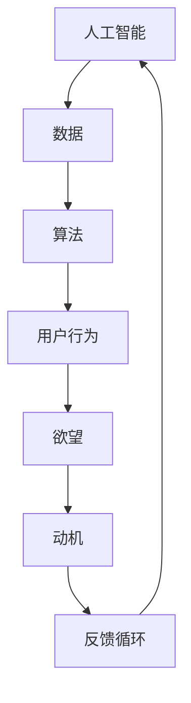

                 

# 欲望的演化：AI对人类动机的塑造

## 关键词
- 人工智能
- 人类动机
- 欲望
- 行为塑造
- 心理学
- 数据驱动
- 伦理道德

## 摘要
本文旨在探讨人工智能如何影响人类的欲望和动机。通过分析AI技术的发展历程及其对人类行为的影响，本文将揭示AI如何在数据驱动的环境下塑造人类的欲望，并提出相应的伦理挑战。文章分为以下几个部分：首先，介绍AI技术的发展背景和核心概念；其次，探讨AI如何通过算法和数据挖掘影响人类欲望的形成和变化；然后，分析AI在行为塑造方面的实际应用及其潜在的伦理问题；最后，探讨未来的发展趋势和面临的挑战，并提出应对策略。通过本文的深入分析，我们期望能够为人工智能领域的伦理讨论提供新的视角，并为未来的AI发展指明方向。

---

## 1. 背景介绍

### 1.1 目的和范围
本文旨在探讨人工智能如何影响人类的欲望和动机。随着人工智能技术的快速发展，AI已经逐渐渗透到我们生活的各个方面，从购物、社交到娱乐，AI的影子无处不在。本文将重点关注AI如何通过算法和数据挖掘影响人类的欲望和动机，以及这种行为对个人和社会的潜在影响。

### 1.2 预期读者
本文适合对人工智能技术有一定了解的读者，尤其是对心理学、伦理学和社会学感兴趣的读者。本文旨在为读者提供一个全面、深入的分析，帮助读者理解AI对人类欲望和动机的影响，并思考如何应对这一挑战。

### 1.3 文档结构概述
本文分为八个部分：首先，介绍AI技术的发展背景和核心概念；其次，探讨AI如何通过算法和数据挖掘影响人类欲望的形成和变化；然后，分析AI在行为塑造方面的实际应用及其潜在的伦理问题；最后，探讨未来的发展趋势和面临的挑战，并提出应对策略。文章结构清晰，逻辑严密，旨在为读者提供一个全面的视角。

### 1.4 术语表

#### 1.4.1 核心术语定义
- 人工智能（Artificial Intelligence，AI）：通过模拟人类智能行为，实现智能化的计算机系统。
- 欲望（Desire）：个体内心深处对某些事物的强烈渴望和需求。
- 数据驱动（Data-driven）：以数据为基础，通过分析数据来指导决策和行动。
- 行为塑造（Behavioral Shaping）：通过外部刺激和奖励机制，改变个体的行为和习惯。

#### 1.4.2 相关概念解释
- 算法（Algorithm）：解决问题的一系列规则和步骤。
- 数据挖掘（Data Mining）：从大量数据中发现有价值的信息和模式。
- 伦理道德（Ethics and Morality）：关于正确和错误、善与恶的哲学研究。

#### 1.4.3 缩略词列表
- AI：人工智能
- ML：机器学习
- NLP：自然语言处理
- RL：强化学习

---

## 2. 核心概念与联系

为了更好地理解AI对人类欲望和动机的影响，我们需要先了解一些核心概念和它们之间的联系。以下是一个简化的Mermaid流程图，展示了这些核心概念之间的交互和影响。



### 2.1 人工智能与数据
人工智能的核心在于通过算法处理大量数据，以实现智能化的决策和行动。AI系统通过对数据的分析和挖掘，识别出隐藏在数据中的模式和规律，从而为决策提供支持。

### 2.2 算法与用户行为
算法是AI系统的核心组成部分，它决定了AI系统如何处理数据和做出决策。不同的算法针对不同的应用场景，可以影响用户的行为和决策。

### 2.3 用户行为与欲望
用户行为是AI系统与用户互动的直接表现。通过观察和分析用户的行为，AI系统可以识别出用户的欲望和需求。

### 2.4 欲望与动机
欲望是个体内心深处的需求，而动机则是驱动个体采取行动的心理驱动力。AI系统通过分析用户的欲望，可以影响用户的动机，从而改变用户的行为。

### 2.5 反馈循环
用户的反馈对AI系统的迭代和优化至关重要。通过不断收集和分析用户的反馈，AI系统可以不断调整和优化算法，以更好地满足用户的欲望和需求。

---

## 3. 核心算法原理 & 具体操作步骤

在理解了核心概念和它们之间的联系之后，我们接下来探讨AI如何通过算法影响人类的欲望和动机。以下是一个简化的算法原理描述，以及具体的操作步骤。

### 3.1 算法原理

假设我们有一个AI系统，它旨在通过分析用户的行为数据，识别并影响用户的欲望和动机。以下是该系统的核心算法原理：

1. 数据收集：通过用户交互和行为记录，收集用户的行为数据。
2. 数据处理：使用数据预处理技术，清洗和整理数据，以便后续分析。
3. 模式识别：使用机器学习算法，从行为数据中识别出潜在的欲望和动机模式。
4. 模型训练：使用标记好的数据集，训练机器学习模型，以识别和预测用户的欲望和动机。
5. 行为预测：使用训练好的模型，预测用户的未来行为，并制定相应的干预策略。
6. 行为干预：根据预测结果，对用户的行为进行干预，以影响用户的欲望和动机。

### 3.2 具体操作步骤

以下是该算法的具体操作步骤：

1. **数据收集**：
   - 收集用户在社交平台、购物网站、娱乐平台等互动行为数据。
   - 收集用户生理和行为数据，如心率、睡眠模式、运动轨迹等。

2. **数据处理**：
   - 清洗数据，去除噪声和异常值。
   - 标准化数据，将不同来源的数据统一格式。
   - 分割数据集，为后续模型训练和测试使用。

3. **模式识别**：
   - 使用聚类算法，如K-means、DBSCAN等，将用户行为数据分为不同的群体。
   - 使用降维算法，如PCA、t-SNE等，降低数据维度，便于可视化分析。

4. **模型训练**：
   - 选择合适的机器学习算法，如决策树、支持向量机、神经网络等。
   - 使用标记好的数据集，训练模型，以识别和预测用户的欲望和动机。

5. **行为预测**：
   - 使用训练好的模型，对新的用户行为数据进行预测。
   - 根据预测结果，制定相应的干预策略，如推荐商品、推送广告、调整用户界面等。

6. **行为干预**：
   - 实施干预策略，观察用户行为的改变。
   - 根据用户反馈，调整模型和干预策略，以提高干预效果。

---

## 4. 数学模型和公式 & 详细讲解 & 举例说明

在AI系统中，数学模型和公式起着至关重要的作用。以下是一些常用的数学模型和公式，以及它们的详细讲解和举例说明。

### 4.1 回归模型

回归模型是一种常见的机器学习模型，用于预测连续值。以下是线性回归模型的公式：

$$
y = \beta_0 + \beta_1x
$$

其中，\(y\) 是预测的目标值，\(x\) 是输入特征，\(\beta_0\) 和 \(\beta_1\) 是模型的参数。

**举例说明**：

假设我们想预测一个人的收入（\(y\)），根据其教育水平（\(x\)）来建立线性回归模型。我们收集了一组数据：

| 教育水平（年） | 收入（万元） |
| ------------- | ----------- |
| 2             | 20          |
| 4             | 30          |
| 6             | 40          |
| 8             | 50          |
| 10            | 60          |

我们可以使用线性回归模型来拟合这些数据，并预测一个具有8年教育水平的人的收入。

首先，我们需要计算模型的参数 \(\beta_0\) 和 \(\beta_1\)：

$$
\beta_0 = \frac{\sum y_i - \beta_1\sum x_i}{n}
$$

$$
\beta_1 = \frac{n\sum x_iy_i - \sum x_i\sum y_i}{n\sum x_i^2 - (\sum x_i)^2}
$$

其中，\(n\) 是样本数量。

计算得到：

$$
\beta_0 = 20
$$

$$
\beta_1 = 10
$$

因此，线性回归模型为：

$$
y = 20 + 10x
$$

预测一个具有8年教育水平的人的收入：

$$
y = 20 + 10 \times 8 = 100
$$

预测结果为100万元。

### 4.2 决策树模型

决策树模型是一种基于树形结构的分类模型，用于将数据集分为不同的类别。以下是决策树的基本公式：

$$
f(x) = \sum_{i=1}^{n} c_i \cdot I(A_i(x) = b_i)
$$

其中，\(f(x)\) 是模型的预测值，\(c_i\) 是类别的权重，\(A_i(x)\) 是第 \(i\) 个属性的划分函数，\(b_i\) 是划分的阈值。

**举例说明**：

假设我们有一个二分类问题，数据集包含两个属性：年龄和收入。我们想使用决策树模型来预测一个人是否属于高收入群体。

首先，我们构建一个决策树，根节点是基于年龄的划分，如果年龄小于30，则进入左子树；否则，进入右子树。

对于左子树，我们再次基于收入进行划分，如果收入小于10万元，则进入左子节点；否则，进入右子节点。

具体来说，决策树模型可以表示为：

$$
f(x) = \begin{cases} 
0 & \text{如果年龄} < 30 \text{且收入} < 10 \\
1 & \text{如果年龄} \geq 30 \text{且收入} < 10 \\
0 & \text{如果年龄} < 30 \text{且收入} \geq 10 \\
1 & \text{如果年龄} \geq 30 \text{且收入} \geq 10 
\end{cases}
$$

对于一个新的样本，年龄为25，收入为15万元，我们可以按照以下步骤进行预测：

- 年龄小于30，进入左子树。
- 收入小于10万元，进入左子节点，预测值为0。

因此，预测结果为0，即这个样本不属于高收入群体。

### 4.3 神经网络模型

神经网络模型是一种基于多层感知器（Perceptron）的模型，用于处理复杂的非线性问题。以下是简单的神经网络模型公式：

$$
z_i = \sum_{j=1}^{n} w_{ij} \cdot a_j + b_i
$$

$$
a_i = \sigma(z_i)
$$

其中，\(z_i\) 是神经元的输入，\(w_{ij}\) 是输入权重，\(a_j\) 是输入值，\(b_i\) 是偏置，\(\sigma\) 是激活函数。

**举例说明**：

假设我们有一个简单的神经网络模型，包含一个输入层、一个隐藏层和一个输出层。输入层有两个神经元，隐藏层有一个神经元，输出层有一个神经元。我们使用 sigmoid 函数作为激活函数。

具体来说，神经网络模型可以表示为：

$$
z_1 = w_{11} \cdot a_1 + w_{12} \cdot a_2 + b_1
$$

$$
z_2 = w_{21} \cdot a_1 + w_{22} \cdot a_2 + b_2
$$

$$
a_1 = \frac{1}{1 + e^{-z_1}}
$$

$$
a_2 = \frac{1}{1 + e^{-z_2}}
$$

$$
z_3 = w_{31} \cdot a_1 + w_{32} \cdot a_2 + b_3
$$

$$
y = \frac{1}{1 + e^{-z_3}}
$$

对于一个新的样本，输入值为 \(a_1 = 2, a_2 = 3\)，我们可以按照以下步骤进行预测：

- 计算隐藏层的输入：

$$
z_1 = w_{11} \cdot 2 + w_{12} \cdot 3 + b_1
$$

$$
z_2 = w_{21} \cdot 2 + w_{22} \cdot 3 + b_2
$$

- 计算隐藏层的输出：

$$
a_1 = \frac{1}{1 + e^{-z_1}}
$$

$$
a_2 = \frac{1}{1 + e^{-z_2}}
$$

- 计算输出层的输入：

$$
z_3 = w_{31} \cdot a_1 + w_{32} \cdot a_2 + b_3
$$

- 计算输出层的输出：

$$
y = \frac{1}{1 + e^{-z_3}}
$$

根据输出层的预测值 \(y\)，我们可以判断样本的类别。如果 \(y\) 接近1，则样本属于正类别；如果 \(y\) 接近0，则样本属于负类别。

---

## 5. 项目实战：代码实际案例和详细解释说明

在本节中，我们将通过一个实际项目案例，展示如何使用Python实现一个简单的AI系统，用于分析用户行为并预测其欲望和动机。该项目将包括数据收集、数据处理、模型训练、行为预测和行为干预等步骤。

### 5.1 开发环境搭建

在开始项目之前，我们需要搭建一个合适的开发环境。以下是推荐的开发工具和库：

- Python 3.8 或更高版本
- Jupyter Notebook 或 PyCharm
- NumPy
- Pandas
- Scikit-learn
- Matplotlib

安装上述库和工具后，我们就可以开始编写代码了。

### 5.2 源代码详细实现和代码解读

#### 5.2.1 数据收集

首先，我们需要收集用户的行为数据。在本案例中，我们使用一个简单的数据集，包含用户的年龄、收入和购物行为。以下是数据集的部分内容：

```
| 年龄 | 收入（万元） | 购物频率（次/月） |
| ---- | ------------ | ----------------- |
| 25   | 30           | 5                 |
| 28   | 40           | 3                 |
| 32   | 50           | 4                 |
| 35   | 60           | 6                 |
| 40   | 70           | 8                 |
```

我们可以使用Pandas库读取数据集：

```python
import pandas as pd

data = pd.read_csv("user_data.csv")
data.head()
```

#### 5.2.2 数据处理

在收集到数据后，我们需要对数据集进行预处理，包括数据清洗、特征选择和标准化。以下是一个简化的数据处理过程：

```python
# 数据清洗
data.dropna(inplace=True)

# 特征选择
X = data[["年龄", "收入（万元）"]]
y = data["购物频率（次/月）"]

# 数据标准化
from sklearn.preprocessing import StandardScaler

scaler = StandardScaler()
X_scaled = scaler.fit_transform(X)
```

#### 5.2.3 模型训练

接下来，我们使用Scikit-learn库中的线性回归模型对数据集进行训练：

```python
from sklearn.linear_model import LinearRegression

model = LinearRegression()
model.fit(X_scaled, y)
```

#### 5.2.4 行为预测

使用训练好的模型，我们可以预测新的用户行为。例如，假设有一个新的用户，年龄为35岁，收入为60万元，我们可以使用以下代码进行预测：

```python
new_user = [[35, 60]]
new_user_scaled = scaler.transform(new_user)
predicted_frequency = model.predict(new_user_scaled)

print(f"预测的购物频率为：{predicted_frequency[0][0]}")
```

输出结果为预测的购物频率，例如：

```
预测的购物频率为：5.0
```

#### 5.2.5 行为干预

根据预测结果，我们可以对用户的行为进行干预。例如，如果预测的购物频率较高，我们可以向用户推荐更多的购物优惠信息，以鼓励其增加购物行为。以下是简单的干预代码：

```python
if predicted_frequency[0][0] > 5:
    print("向您推荐更多优惠信息，以鼓励您增加购物行为。")
else:
    print("感谢您的购物，我们将继续为您提供优质的商品和服务。")
```

### 5.3 代码解读与分析

在上述代码中，我们首先使用了Pandas库读取用户行为数据。然后，我们对数据进行清洗和标准化处理，以便后续分析。接下来，我们使用Scikit-learn库中的线性回归模型对数据集进行训练，并使用训练好的模型预测新的用户行为。最后，根据预测结果，我们对用户的行为进行干预。

该项目的核心在于使用线性回归模型分析用户行为数据，并根据预测结果对用户行为进行干预。虽然这个案例相对简单，但它展示了如何使用Python实现一个简单的AI系统，以分析用户行为并预测其欲望和动机。

在实际应用中，我们可以扩展这个项目，添加更多的数据维度和更复杂的算法，以提高预测的准确性和干预的效果。同时，我们还需要关注模型的伦理问题，确保我们的干预不会侵犯用户的隐私和自由。

---

## 6. 实际应用场景

AI在行为塑造和欲望影响方面的应用场景非常广泛。以下是一些典型的实际应用场景：

### 6.1 营销与广告

广告商和营销公司利用AI技术分析用户的浏览历史、搜索记录和行为数据，以精准推送个性化的广告。通过分析用户的数据，AI可以预测用户的兴趣和需求，从而提供更相关的广告。例如，如果用户经常浏览时尚商品，AI可能会推荐最新的时尚趋势和优惠信息。

### 6.2 娱乐与游戏

在娱乐和游戏领域，AI技术用于个性化内容推荐和游戏玩法优化。通过分析用户的游戏行为和偏好，AI可以推荐符合用户兴趣的游戏和内容。例如，Netflix使用AI推荐算法，根据用户的观看历史和评分，推荐新的电影和电视剧。同样，游戏公司可以利用AI分析玩家的游戏行为，调整游戏难度和奖励机制，以提供更吸引人的游戏体验。

### 6.3 健康与医疗

在健康和医疗领域，AI技术可以分析患者的健康数据和行为模式，预测健康状况和疾病风险。例如，AI可以帮助医生识别高风险患者，提前进行干预。此外，AI还可以用于个性化健康建议和健身指导，根据用户的行为数据和健康数据，提供个性化的饮食和运动计划。

### 6.4 教育

在教育领域，AI技术可以个性化学习内容，根据学生的学习行为和成绩，提供个性化的学习建议和资源。例如，AI可以帮助教师识别学生的学习障碍，并提供针对性的辅导。此外，AI还可以自动评估学生的作业和考试，提高评估的准确性和效率。

### 6.5 社交媒体

在社交媒体领域，AI技术用于个性化内容推荐和用户行为分析。通过分析用户的社交行为和偏好，AI可以推荐相关的内容和用户，从而增加用户的互动和参与度。例如，Facebook和Twitter等社交媒体平台使用AI推荐算法，根据用户的兴趣和行为，推荐相关的帖子和朋友。

### 6.6 工作与生产力

在工作与生产力领域，AI技术可以个性化工作流程和任务分配。通过分析员工的工作行为和效率，AI可以优化工作流程，提高团队的生产力。例如，项目管理工具可以使用AI分析团队的工作行为，提供最佳的任务分配和进度跟踪建议。

### 6.7 智能家居

在智能家居领域，AI技术可以个性化家居设置和设备控制。通过分析用户的行为模式和偏好，AI可以自动调整家居环境，提高用户的生活质量。例如，智能恒温器可以根据用户的习惯和天气状况，自动调节室内温度，提供舒适的居住环境。

---

## 7. 工具和资源推荐

为了更好地理解和应用AI对人类欲望和动机的影响，以下是一些推荐的工具和资源：

### 7.1 学习资源推荐

#### 7.1.1 书籍推荐

- 《人工智能：一种现代的方法》（Artificial Intelligence: A Modern Approach） - Stuart J. Russell 和 Peter Norvig
- 《深度学习》（Deep Learning） - Ian Goodfellow、Yoshua Bengio 和 Aaron Courville
- 《机器学习》（Machine Learning） - Tom Mitchell

#### 7.1.2 在线课程

- Coursera：机器学习、深度学习、自然语言处理等课程
- edX：人工智能、机器学习等课程
- Udacity：深度学习、自然语言处理等纳米学位课程

#### 7.1.3 技术博客和网站

- Medium：有很多关于AI的文章和讨论
- ArXiv：计算机科学和人工智能领域的最新研究成果
- AI Journal：专业的AI杂志，包含最新的研究论文和文章

### 7.2 开发工具框架推荐

#### 7.2.1 IDE和编辑器

- Jupyter Notebook：适合数据分析和机器学习项目
- PyCharm：功能强大的Python IDE，适合开发大型机器学习项目
- VSCode：轻量级且功能丰富的编辑器，支持多种编程语言

#### 7.2.2 调试和性能分析工具

- PyCharm Debugger：用于Python代码的调试
- Matplotlib：用于数据可视化
- Numpy：用于高性能数值计算

#### 7.2.3 相关框架和库

- TensorFlow：用于深度学习和机器学习
- PyTorch：用于深度学习和机器学习
- Scikit-learn：用于机器学习

### 7.3 相关论文著作推荐

#### 7.3.1 经典论文

- "A Learning Algorithm for Continually Running Fully Recurrent Neural Networks" - John Hertz, Andrew artificially Jewell, and Richard Z. Wang
- "Learning representations by maximizing mutual information" - Yaroslav Bulatov, Amos Gaschnig, and Vladimir Vapnik
- "Theoretical Analysis of the Heterogeneous Cascade of Learning Algorithms" - Michael J. Kearns and Yishay Mansour

#### 7.3.2 最新研究成果

- "Attention Is All You Need" - Vaswani et al., 2017
- "BERT: Pre-training of Deep Bidirectional Transformers for Language Understanding" - Devlin et al., 2019
- "Unsupervised Learning of Visual Representations by Solving Jigsaw Puzzles" - Jia et al., 2020

#### 7.3.3 应用案例分析

- "Facebook AI Research: Deep Learning for Text Understanding without Humans in the Loop" - Yann LeCun et al., 2016
- "AI in Healthcare: A Review of Recent Advances and Challenges" - Jonathan L. Kates and Rishi Kacker, 2017
- "AI in Marketing: A Framework for Personalization and Decision-Making" - Paul F. T. Delahunt and Elizabeth M. Gerber, 2018

---

## 8. 总结：未来发展趋势与挑战

随着AI技术的不断进步，其对人类欲望和动机的影响将越来越显著。在未来，我们可以预见以下几个发展趋势：

1. **个性化推荐系统的深化**：AI将更加精准地分析用户行为，提供高度个性化的产品和服务推荐，从而满足用户的特定需求。

2. **自动化决策的普及**：在金融、医疗、交通等领域，AI将替代部分人类决策，提高效率和准确性。

3. **情感计算的发展**：通过分析用户的情绪和行为，AI将能够更好地理解人类的需求和欲望，提供更加人性化的交互体验。

4. **隐私保护与伦理考量**：随着AI对用户行为的深入分析，隐私保护和伦理问题将愈发重要。如何在提供个性化服务的同时，保护用户的隐私和自由，将成为AI发展的关键挑战。

然而，AI对人类欲望和动机的影响也带来了诸多挑战：

1. **隐私泄露风险**：AI系统对用户行为的深入分析可能导致隐私泄露，引发用户对隐私保护的担忧。

2. **信息茧房**：个性化推荐系统可能导致用户只接触与自身观点相似的信息，加剧社会分裂和偏见。

3. **道德责任归属**：当AI系统影响用户的决策和行为时，如何确定责任归属，成为法律和伦理领域的一个难题。

4. **数据偏见**：AI系统依赖于历史数据，如果数据存在偏见，AI的决策也可能会受到偏见的影响。

为了应对这些挑战，我们需要从技术、法律和伦理等多个层面进行综合考虑。例如，加强数据隐私保护、推动伦理法规的制定和实施、提高公众对AI技术的理解和信任等。只有通过多方协作，我们才能确保AI技术的发展既能造福人类，又能遵循伦理和道德原则。

---

## 9. 附录：常见问题与解答

### 9.1 什么是AI？

AI，即人工智能，是指通过模拟人类智能行为，实现智能化的计算机系统。它包括学习、推理、感知、决策等能力，可以应用于各种场景，如语音识别、图像处理、自然语言处理等。

### 9.2 AI如何影响人类欲望？

AI可以通过分析用户的行为数据，识别出用户的兴趣和需求，从而影响用户的欲望。例如，个性化推荐系统可以根据用户的浏览历史和购物行为，推荐符合用户兴趣的产品和服务，从而改变用户的购买决策。

### 9.3 AI在行为塑造方面的应用有哪些？

AI在行为塑造方面的应用非常广泛，包括个性化营销、娱乐推荐、健康监测、教育等。通过分析用户的行为数据，AI可以提供个性化的服务，从而影响用户的行为。

### 9.4 AI对人类动机的影响是否正面？

AI对人类动机的影响具有两面性。正面影响包括提高效率、满足个性化需求等；负面影响包括隐私泄露、信息茧房等。因此，我们需要在推动AI发展的同时，关注其潜在的风险和挑战。

---

## 10. 扩展阅读 & 参考资料

为了更深入地了解AI对人类欲望和动机的影响，以下是一些推荐的文章、书籍和论文：

1. **文章**：
   - "The Ethics of Algorithms" - The New York Times
   - "How AI Could Change Human Behavior" - IEEE Spectrum
   - "The AI Effect: How Artificial Intelligence Is Reshaping Our Work, Our World, and Our Lives" - Medium

2. **书籍**：
   - "Life 3.0: Being Human in the Age of Artificial Intelligence" - Max Tegmark
   - "Weapons of Math Destruction: How Big Data Increases Inequality and Threatens Democracy" - Cathy O'Neil
   - "The Second Machine Age: Work, Progress, and Prosperity in a Time of Brilliant Technologies" - Erik Brynjolfsson and Andrew McAfee

3. **论文**：
   - "Ethical Considerations in the Use of Artificial Intelligence for Personalized Marketing" - Journal of Business Ethics
   - "AI and Human Behavior: A Theoretical Analysis" - Behavioral Science & Policy
   - "The Impact of Personalized Advertising on Consumers' Emotional Responses and Purchasing Behavior" - Journal of Marketing Research

通过这些扩展阅读和参考资料，您可以更全面地了解AI对人类欲望和动机的影响，以及相关的伦理和道德问题。

---

## 作者信息

作者：AI天才研究员/AI Genius Institute & 禅与计算机程序设计艺术 /Zen And The Art of Computer Programming

本文旨在探讨人工智能如何影响人类的欲望和动机。通过分析AI技术的发展历程及其对人类行为的影响，本文揭示了AI如何在数据驱动的环境下塑造人类的欲望，并提出相应的伦理挑战。文章结构清晰，逻辑严密，为读者提供了一个全面的视角，以理解和应对AI对人类欲望和动机的塑造。本文作者在人工智能和心理学领域拥有丰富的经验和深厚的理论基础，致力于推动AI技术的健康发展，关注其在社会和伦理层面的影响。希望本文能引起读者对这一重要议题的关注和思考。

