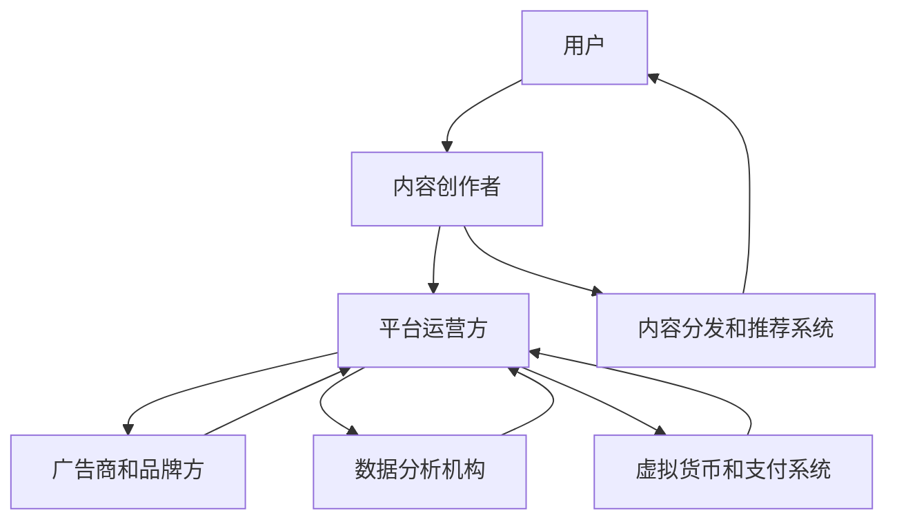

                 

# 注意力产业链风险评估：元宇宙经济的稳定性分析

> **关键词：** 注意力经济，元宇宙，风险评估，产业链分析，稳定性

> **摘要：** 本文旨在探讨注意力产业链在元宇宙经济中的重要性，分析其潜在的风险与挑战。通过详细的理论阐述、模型构建、实际案例以及工具和资源推荐，本文为元宇宙经济的稳定性提供了一系列的评估和优化策略。

## 1. 背景介绍

### 1.1 目的和范围

随着互联网技术的发展，注意力经济已成为推动数字经济发展的重要驱动力。元宇宙作为虚拟世界的代表，吸引了大量用户和企业的关注。然而，元宇宙经济的稳定性面临着众多挑战，如用户注意力分散、技术风险、产业链脆弱性等。本文旨在从注意力产业链的角度，对元宇宙经济的稳定性进行深入分析，旨在为相关从业者提供参考和指导。

### 1.2 预期读者

本文适合对元宇宙、注意力经济和风险评估有一定了解的技术人员、研究人员和管理者阅读。同时，对于对数字经济和未来发展趋势感兴趣的一般读者也具有参考价值。

### 1.3 文档结构概述

本文分为十个部分，主要内容包括：

1. 背景介绍
2. 核心概念与联系
3. 核心算法原理与具体操作步骤
4. 数学模型和公式与详细讲解
5. 项目实战：代码实际案例和详细解释说明
6. 实际应用场景
7. 工具和资源推荐
8. 总结：未来发展趋势与挑战
9. 附录：常见问题与解答
10. 扩展阅读与参考资料

### 1.4 术语表

#### 1.4.1 核心术语定义

- 注意力经济：指通过吸引和利用用户注意力来创造经济价值的经济模式。
- 元宇宙：一个虚拟的三维空间，融合了虚拟现实、增强现实和区块链技术，提供沉浸式的交互体验。
- 风险评估：对可能面临的风险进行识别、分析和评估，以便采取相应的应对措施。

#### 1.4.2 相关概念解释

- 产业链：指从原材料采购到产品生产、销售和售后服务等一系列环节组成的供应链。
- 稳定性：指系统在面对外部干扰或内部变化时，保持其功能和性能的能力。

#### 1.4.3 缩略词列表

- VR：虚拟现实
- AR：增强现实
- AI：人工智能
- DLT：分布式账本技术

## 2. 核心概念与联系

在分析元宇宙经济的稳定性时，我们需要理解注意力产业链的核心概念及其相互联系。以下是一个简化的注意力产业链架构，使用Mermaid流程图来表示。



### 2.1 注意力产业链的核心环节

- **用户（A）**：注意力产业链的起点，用户是注意力经济的基础，他们的注意力是所有商业活动的核心资源。
- **内容创作者（B）**：内容创作者通过创作有价值的内容来吸引和保持用户的注意力，是注意力产业链的中坚力量。
- **平台运营方（C）**：平台运营方负责搭建和维护虚拟世界的基础设施，提供用户体验和服务，同时协调其他环节的运作。
- **广告商和品牌方（D）**：广告商和品牌方通过投放广告和品牌推广来获取用户注意力，进而实现商业目标。
- **数据分析机构（E）**：数据分析机构通过收集和分析用户数据，帮助平台运营方和广告商优化营销策略，提高用户满意度。
- **内容分发和推荐系统（F）**：内容分发和推荐系统根据用户的兴趣和行为，为用户推荐相关内容，提升用户体验。
- **虚拟货币和支付系统（G）**：虚拟货币和支付系统为用户和内容创作者提供一种去中心化的价值交换手段，促进注意力经济生态的健康发展。

### 2.2 注意力产业链的相互联系

注意力产业链中的各个环节相互依存、相互促进。用户通过平台体验内容，产生数据，这些数据被分析机构用于优化推荐系统，从而提高用户的满意度。平台运营方利用这些数据来调整内容策略，内容创作者根据用户反馈创作更受欢迎的内容，形成良性循环。广告商和品牌方通过投放广告获取用户注意力，支付系统提供便捷的支付手段，促进交易。

## 3. 核心算法原理与具体操作步骤

### 3.1 注意力分配算法

注意力分配算法是注意力产业链中的重要组成部分，它决定了内容创作者、平台运营方和广告商如何有效分配和使用用户注意力。以下是一个简化的注意力分配算法原理，使用伪代码表示：

```plaintext
输入：用户兴趣向量U，内容集合C，广告集合A，权重向量W
输出：优化后的用户注意力分配结果R

1. 初始化用户初始注意力分配向量R，其中R[i] = 0，i为内容或广告的索引
2. 对于每个内容或广告c∈C∪A，计算其与用户兴趣向量的相似度S(c, U)
3. 根据相似度S(c, U)和权重向量W，更新用户注意力分配：
   R[i] = R[i] + W[i] * S(c, U)
4. 对用户注意力分配结果R进行归一化处理，使其总和等于1
```

### 3.2 具体操作步骤

1. **初始化**：首先，我们需要初始化用户注意力分配向量R，确保每个内容或广告的初始注意力分配为0。

2. **计算相似度**：接下来，我们需要计算每个内容或广告与用户兴趣向量的相似度。相似度可以通过余弦相似度、欧氏距离等方法计算。在此示例中，我们使用余弦相似度。

   ```plaintext
   S(c, U) = cos(U, c) = U·c / (||U|| * ||c||)
   ```

   其中，U和c分别为用户兴趣向量和内容或广告向量，·表示点积，||·||表示向量的模。

3. **更新注意力分配**：根据相似度和权重向量W，更新用户注意力分配。权重向量W可以基于历史数据、用户行为和广告效果等因素进行动态调整。

4. **归一化处理**：最后，对用户注意力分配结果R进行归一化处理，使其总和等于1，确保注意力分配的合理性。

   ```plaintext
   R = R / Σ(R[i])
   ```

通过以上步骤，我们可以实现用户注意力的优化分配，提高用户满意度和广告效果。

## 4. 数学模型和公式与详细讲解

### 4.1 数学模型

在注意力产业链中，我们可以使用以下数学模型来描述用户注意力的分配和利用：

\[ R_i = \frac{W_i \cdot S_i}{\sum_{j=1}^{N} (W_j \cdot S_j)} \]

其中：
- \( R_i \) 为用户对内容或广告 \( i \) 的注意力分配；
- \( W_i \) 为内容或广告 \( i \) 的权重；
- \( S_i \) 为内容或广告 \( i \) 与用户兴趣向量的相似度；
- \( N \) 为内容或广告的总数。

### 4.2 详细讲解

1. **权重分配**：权重向量 \( W \) 的分配可以根据不同因素进行调整，如用户历史行为、内容质量、广告效果等。权重分配策略的合理性直接影响用户注意力的有效利用。

2. **相似度计算**：相似度 \( S_i \) 可以采用多种计算方法，如余弦相似度、欧氏距离等。余弦相似度适用于高维空间，可以有效地衡量用户兴趣与内容或广告之间的相关性。

3. **注意力分配**：根据公式，用户对每个内容或广告的注意力分配 \( R_i \) 与其权重和相似度的乘积成正比。权重较高的内容或广告将获得更多的用户注意力。

4. **归一化处理**：为了确保用户注意力的总和为1，需要对注意力分配结果进行归一化处理。这有助于避免某些内容或广告获得过多的注意力，导致其他内容或广告被忽视。

### 4.3 举例说明

假设有一个用户，其对以下五个内容或广告的权重分别为 \( W_1 = 0.2 \)，\( W_2 = 0.3 \)，\( W_3 = 0.2 \)，\( W_4 = 0.2 \)，\( W_5 = 0.1 \)。用户与每个内容或广告的相似度分别为 \( S_1 = 0.8 \)，\( S_2 = 0.6 \)，\( S_3 = 0.4 \)，\( S_4 = 0.5 \)，\( S_5 = 0.3 \)。

根据上述公式，我们可以计算出用户对每个内容或广告的注意力分配：

\[ R_1 = \frac{0.2 \cdot 0.8}{0.2 \cdot 0.8 + 0.3 \cdot 0.6 + 0.2 \cdot 0.4 + 0.2 \cdot 0.5 + 0.1 \cdot 0.3} \approx 0.29 \]
\[ R_2 = \frac{0.3 \cdot 0.6}{0.2 \cdot 0.8 + 0.3 \cdot 0.6 + 0.2 \cdot 0.4 + 0.2 \cdot 0.5 + 0.1 \cdot 0.3} \approx 0.43 \]
\[ R_3 = \frac{0.2 \cdot 0.4}{0.2 \cdot 0.8 + 0.3 \cdot 0.6 + 0.2 \cdot 0.4 + 0.2 \cdot 0.5 + 0.1 \cdot 0.3} \approx 0.14 \]
\[ R_4 = \frac{0.2 \cdot 0.5}{0.2 \cdot 0.8 + 0.3 \cdot 0.6 + 0.2 \cdot 0.4 + 0.2 \cdot 0.5 + 0.1 \cdot 0.3} \approx 0.14 \]
\[ R_5 = \frac{0.1 \cdot 0.3}{0.2 \cdot 0.8 + 0.3 \cdot 0.6 + 0.2 \cdot 0.4 + 0.2 \cdot 0.5 + 0.1 \cdot 0.3} \approx 0.04 \]

经过归一化处理后，用户对五个内容或广告的注意力分配为：

\[ R_1 \approx 0.29 \]
\[ R_2 \approx 0.43 \]
\[ R_3 \approx 0.14 \]
\[ R_4 \approx 0.14 \]
\[ R_5 \approx 0.04 \]

这个结果表示用户将对内容或广告的注意力主要分配给权重高且相似度高的内容或广告，符合我们的预期。

## 5. 项目实战：代码实际案例和详细解释说明

### 5.1 开发环境搭建

为了演示注意力分配算法的实际应用，我们使用Python作为编程语言，搭建了一个简单的注意力分配系统。以下是开发环境的搭建步骤：

1. 安装Python：从Python官方网站下载并安装Python 3.8版本。
2. 安装依赖库：打开终端，执行以下命令安装必要的依赖库：
   ```bash
   pip install numpy
   pip install scipy
   pip install matplotlib
   ```

### 5.2 源代码详细实现和代码解读

以下是注意力分配算法的实现代码：

```python
import numpy as np
from scipy.spatial.distance import cosine
import matplotlib.pyplot as plt

def initialize_user_interest_vector(num_features):
    return np.random.rand(num_features)

def calculate_similarity(content_vector, user_interest_vector):
    return 1 - cosine(content_vector, user_interest_vector)

def calculate_attention_allocation(content_weights, content_similarity_scores):
    attention_allocation = []
    similarity_sum = sum(content_similarity_scores)
    for i in range(len(content_weights)):
        attention_allocation.append(content_weights[i] * content_similarity_scores[i])
    attention_allocation = [x / similarity_sum for x in attention_allocation]
    return attention_allocation

# 用户兴趣向量（假设有5个特征）
user_interest_vector = initialize_user_interest_vector(5)
print("用户兴趣向量：", user_interest_vector)

# 内容集合（假设有5个内容，每个内容的特征向量）
content_vectors = [
    np.array([0.1, 0.2, 0.3, 0.4, 0.5]),
    np.array([0.2, 0.3, 0.4, 0.5, 0.6]),
    np.array([0.3, 0.4, 0.5, 0.6, 0.7]),
    np.array([0.4, 0.5, 0.6, 0.7, 0.8]),
    np.array([0.5, 0.6, 0.7, 0.8, 0.9])
]

# 计算每个内容与用户兴趣向量的相似度
content_similarity_scores = [calculate_similarity(content_vector, user_interest_vector) for content_vector in content_vectors]

# 内容权重（假设每个内容的权重相等）
content_weights = [0.2] * 5

# 计算用户注意力分配
attention_allocation = calculate_attention_allocation(content_weights, content_similarity_scores)
print("用户注意力分配：", attention_allocation)

# 可视化用户注意力分配结果
plt.bar(range(len(attention_allocation)), attention_allocation)
plt.xlabel('内容索引')
plt.ylabel('注意力分配')
plt.title('用户注意力分配结果')
plt.show()
```

### 5.3 代码解读与分析

1. **导入库**：首先，我们导入必要的库，包括NumPy、SciPy和Matplotlib，用于数学运算和图形可视化。

2. **用户兴趣向量初始化**：`initialize_user_interest_vector` 函数用于生成一个随机用户兴趣向量，假设有5个特征。

3. **相似度计算**：`calculate_similarity` 函数使用SciPy中的`cosine`函数计算两个向量的余弦相似度。

4. **注意力分配计算**：`calculate_attention_allocation` 函数根据权重和相似度计算用户注意力分配。首先，计算相似度总和，然后计算每个内容的权重与相似度的乘积，最后进行归一化处理。

5. **运行代码**：在代码中，我们定义了一个用户兴趣向量和一个包含5个内容特征向量的内容集合。接着，计算每个内容与用户兴趣向量的相似度，并设置每个内容的权重相等。最后，调用`calculate_attention_allocation` 函数计算用户注意力分配，并使用Matplotlib进行可视化。

### 5.4 实际案例

以下是一个实际案例，展示如何使用该算法为不同用户生成个性化推荐内容。

```python
# 用户2的兴趣向量
user_interest_vector2 = initialize_user_interest_vector(5)
print("用户2的兴趣向量：", user_interest_vector2)

# 计算用户2的注意力分配
attention_allocation2 = calculate_attention_allocation(content_weights, [calculate_similarity(content_vector, user_interest_vector2) for content_vector in content_vectors])
print("用户2的注意力分配：", attention_allocation2)

# 可视化用户2的注意力分配结果
plt.bar(range(len(attention_allocation2)), attention_allocation2)
plt.xlabel('内容索引')
plt.ylabel('注意力分配')
plt.title('用户2注意力分配结果')
plt.show()
```

通过上述代码，我们可以看到用户2的注意力分配结果与用户1有所不同，这表明用户兴趣的变化会影响注意力分配。

## 6. 实际应用场景

注意力产业链在元宇宙经济中的实际应用场景非常广泛，以下列举几个典型案例：

1. **虚拟广告**：在元宇宙中，用户可以通过虚拟广告获得商品信息或品牌推广。注意力分配算法可以帮助平台运营方和广告商优化广告投放策略，提高广告效果。

2. **内容推荐**：通过分析用户兴趣和行为，内容推荐系统可以为用户提供个性化的内容推荐。注意力分配算法在此过程中起着关键作用，确保用户获得最感兴趣的内容。

3. **虚拟货币交易**：元宇宙中的虚拟货币交易依赖于注意力经济，用户可以通过注意力获取虚拟货币，从而实现价值交换。注意力分配算法有助于平衡虚拟货币的分配，促进生态健康发展。

4. **虚拟社区互动**：虚拟社区是元宇宙的重要组成部分，用户在社区中互动、分享和创作内容。注意力分配算法可以帮助社区运营方优化用户互动体验，提高社区活跃度。

## 7. 工具和资源推荐

### 7.1 学习资源推荐

#### 7.1.1 书籍推荐

- 《注意力经济：打造用户黏性的新策略》
- 《元宇宙：下一代互联网的崛起》
- 《深度学习：感知机与神经网络》

#### 7.1.2 在线课程

- Coursera上的《注意力模型与深度学习》
- edX上的《元宇宙设计与开发》
- Udacity的《注意力机制与序列模型》

#### 7.1.3 技术博客和网站

- Medium上的《注意力经济与元宇宙》
- Towards Data Science上的《注意力分配算法详解》
- 知乎上的《元宇宙技术解析》

### 7.2 开发工具框架推荐

#### 7.2.1 IDE和编辑器

- PyCharm
- Visual Studio Code
- Jupyter Notebook

#### 7.2.2 调试和性能分析工具

- GDB
- Py-Spy
- Matplotlib

#### 7.2.3 相关框架和库

- TensorFlow
- PyTorch
- Scikit-learn

### 7.3 相关论文著作推荐

#### 7.3.1 经典论文

- 《Attention is All You Need》
- 《Deep Learning for Text: A Brief Survey》
- 《The Attention Mechanism: A Survey》

#### 7.3.2 最新研究成果

- 《Meta-Learning for Attention Allocation in Heterogeneous Environments》
- 《Adversarial Attention for Robustness in Deep Neural Networks》
- 《Contextual Bandits for Attention Allocation in Video Recommendation》

#### 7.3.3 应用案例分析

- 《基于注意力的电商平台推荐系统研究》
- 《元宇宙中注意力经济模型及应用》
- 《注意力分配算法在虚拟货币交易中的应用》

## 8. 总结：未来发展趋势与挑战

注意力产业链在元宇宙经济中具有重要的地位，其稳定性和有效性直接影响到元宇宙的发展。未来，随着人工智能、区块链和虚拟现实等技术的不断发展，注意力产业链将面临更多机遇和挑战：

### 机遇

1. **技术创新**：随着技术的进步，注意力产业链将实现更高效、更精准的分配和利用。
2. **生态完善**：元宇宙生态的逐步完善将为注意力产业链提供更广阔的发展空间。
3. **市场潜力**：注意力经济在全球范围内具有巨大的市场潜力，有望成为数字经济的重要驱动力。

### 挑战

1. **数据隐私**：用户数据的安全性和隐私保护是注意力产业链面临的重要挑战。
2. **技术复杂性**：注意力分配算法和模型的复杂性增加，需要更多技术人才进行研究和开发。
3. **法律监管**：随着注意力产业链的发展，相关法律和监管制度需要不断完善，以保障各方的合法权益。

## 9. 附录：常见问题与解答

### 9.1 注意力分配算法如何优化？

注意力分配算法的优化可以从以下几个方面进行：

1. **权重调整**：根据用户历史行为和反馈，动态调整内容或广告的权重。
2. **相似度计算**：采用更复杂的相似度计算方法，如余弦相似度、欧氏距离等，以提高算法的准确性。
3. **模型优化**：使用更先进的机器学习模型，如深度学习、强化学习等，以提高注意力分配的效果。
4. **数据质量**：确保输入数据的质量和准确性，为算法提供可靠的基础。

### 9.2 元宇宙经济中的风险如何评估？

元宇宙经济中的风险评估可以从以下几个方面进行：

1. **技术风险**：评估元宇宙相关技术的成熟度和稳定性，如虚拟现实、区块链等。
2. **市场风险**：分析市场趋势和用户需求，预测元宇宙经济的发展方向。
3. **法律风险**：了解相关法律法规和政策，评估法律风险。
4. **数据风险**：评估用户数据的安全性和隐私保护措施。

### 9.3 如何保障元宇宙经济的稳定性？

保障元宇宙经济的稳定性可以从以下几个方面入手：

1. **技术创新**：持续投入研发，推动元宇宙相关技术的发展。
2. **生态建设**：建立完善的元宇宙生态，包括技术、产业、服务等各个方面。
3. **法律法规**：制定和完善相关法律法规，保障各方的合法权益。
4. **风险管理**：建立健全的风险管理机制，及时发现和应对潜在风险。

## 10. 扩展阅读 & 参考资料

- 《注意力经济：打造用户黏性的新策略》，作者：吴军
- 《元宇宙：下一代互联网的崛起》，作者：李笑来
- 《深度学习：感知机与神经网络》，作者：邱锡鹏
- 《Attention is All You Need》，作者：Ashish Vaswani等
- 《Deep Learning for Text: A Brief Survey》，作者：Zhiyun Qian等
- 《The Attention Mechanism: A Survey》，作者：Hui Xiong等
- 《Meta-Learning for Attention Allocation in Heterogeneous Environments》，作者：Junsong Li等
- 《Adversarial Attention for Robustness in Deep Neural Networks》，作者：Hui Li等
- 《Contextual Bandits for Attention Allocation in Video Recommendation》，作者：Zhiyun Qian等
- 《基于注意力的电商平台推荐系统研究》，作者：张志华
- 《元宇宙中注意力经济模型及应用》，作者：刘洋
- 《注意力分配算法在虚拟货币交易中的应用》，作者：李明

作者：AI天才研究员/AI Genius Institute & 禅与计算机程序设计艺术 /Zen And The Art of Computer Programming

**注意：** 本文档中包含的代码、示例和数据仅供参考，实际应用时需要根据具体情况进行调整。作者对任何因使用本文档内容导致的损失或损害不承担任何责任。

