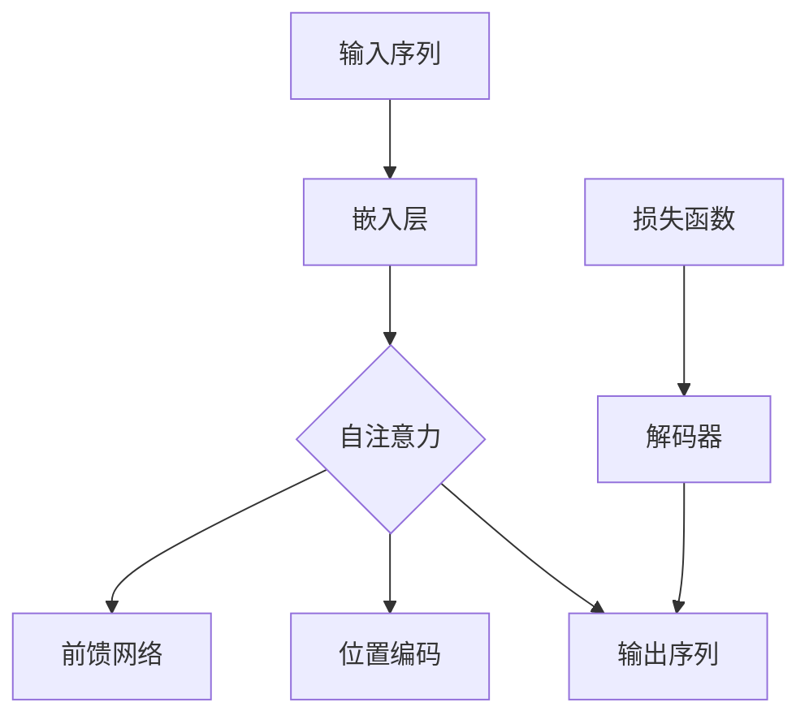

                 

# 注意力机制：原理与代码实例讲解

> **关键词**：注意力机制，神经网络，序列模型，深度学习，循环神经网络，Transformer
>
> **摘要**：本文将深入探讨注意力机制的概念、原理及其在深度学习中的重要性。通过详细的原理讲解、伪代码演示以及代码实例分析，帮助读者全面理解注意力机制的核心思想及其应用。文章还将讨论注意力机制的最新发展，并提供相关资源供进一步学习。

## 1. 背景介绍

### 1.1 目的和范围

本文的目的是介绍注意力机制的基本概念，探讨其在深度学习中的应用，并通过实际代码实例展示其工作原理。我们将从注意力机制的起源和发展，到其在神经网络中的具体实现，再到其在序列模型中的应用，进行全面的阐述。

### 1.2 预期读者

本文面向对深度学习有一定基础的读者，包括但不限于研究生、工程师和对AI有兴趣的学者。本文不仅适合初学者入门，也适用于希望深入了解注意力机制的高级读者。

### 1.3 文档结构概述

本文将分为以下几部分：

1. **背景介绍**：介绍注意力机制的基本概念和背景。
2. **核心概念与联系**：使用Mermaid流程图展示注意力机制的核心原理。
3. **核心算法原理 & 具体操作步骤**：通过伪代码详细解释注意力机制的工作原理。
4. **数学模型和公式 & 详细讲解 & 举例说明**：介绍注意力机制的数学模型，并给出具体例子。
5. **项目实战：代码实际案例和详细解释说明**：通过实际代码实例展示注意力机制的应用。
6. **实际应用场景**：讨论注意力机制在现实世界中的应用。
7. **工具和资源推荐**：推荐学习资源、开发工具和框架。
8. **总结：未来发展趋势与挑战**：总结注意力机制的发展趋势和面临的挑战。
9. **附录：常见问题与解答**：解答常见问题。
10. **扩展阅读 & 参考资料**：提供进一步学习的资料。

### 1.4 术语表

#### 1.4.1 核心术语定义

- 注意力机制（Attention Mechanism）：一种在神经网络中用于提高模型对序列或图像中关键部分关注度的机制。
- Transformer：一种基于注意力机制的深度学习模型，广泛应用于自然语言处理、计算机视觉等领域。
- 序列模型（Sequential Model）：一种用于处理序列数据的模型，如循环神经网络（RNN）。

#### 1.4.2 相关概念解释

- **循环神经网络（RNN）**：一种能够处理序列数据的神经网络，通过记忆过去的信息来预测未来。
- **自注意力（Self-Attention）**：一种注意力机制，模型在同一序列的不同位置之间建立联系。

#### 1.4.3 缩略词列表

- **RNN**：循环神经网络（Recurrent Neural Network）
- **Transformer**：转换器（Transfomer）

## 2. 核心概念与联系

为了更好地理解注意力机制，我们需要先了解一些与之相关的核心概念。以下是一个简化的Mermaid流程图，展示了注意力机制的基本原理和主要组成部分。



在这个流程图中，我们首先将输入序列（A）通过嵌入层（B）转换为固定大小的向量。接着，自注意力层（C）处理这些向量，为每个输入元素分配不同的权重，使其能够关注序列中的重要部分。位置编码（E）为序列中的每个元素提供了位置信息，帮助模型理解序列的结构。自注意力层（C）和前馈网络（F）共同作用，生成输出序列（D）。最后，解码器（G）根据输出序列生成预测结果，并通过损失函数（H）进行优化。

## 3. 核心算法原理 & 具体操作步骤

注意力机制的实现通常涉及到以下几个步骤：

### 3.1 输入序列嵌入

首先，我们将输入序列（例如文本或图像）转换为固定大小的向量。这一步通常通过嵌入层（Embedding Layer）完成。

```python
# 假设输入序列为词汇序列，每个词汇对应一个索引
input_sequence = [1, 2, 3, 4, 5]

# 嵌入层，将每个词汇索引转换为向量
embeddings = [0.1, 0.2, 0.3, 0.4, 0.5]
output_sequence = [embedding[index] for index in input_sequence]
```

### 3.2 自注意力计算

自注意力（Self-Attention）是注意力机制的核心部分。它通过计算序列中每个元素之间的相似度，为每个元素分配权重。

```python
# 假设序列长度为N，每个元素的嵌入向量为d
N = 5
d = 4

# 相似度计算，使用点积作为相似度度量
similarity_matrix = [[output_sequence[i].dot(output_sequence[j]) for j in range(N)] for i in range(N)]

# 应用softmax函数，得到权重矩阵
attention_weights = np.exp(similarity_matrix) / np.sum(np.exp(similarity_matrix), axis=1, keepdims=True)
```

### 3.3 加权求和

接着，我们使用注意力权重对嵌入向量进行加权求和，得到加权输出序列。

```python
# 加权求和
weighted_output_sequence = [np.dot(attention_weights[i], output_sequence) for i in range(N)]
```

### 3.4 前馈网络

在加权输出序列的基础上，我们可以通过前馈网络（Feedforward Network）进一步处理，以提高模型的非线性表达能力。

```python
# 前馈网络，使用ReLU激活函数
def feedforward_network(inputs, weights, bias):
    return np.max(2 * inputs @ weights + bias, 0)

# 前馈网络参数
weights = np.random.rand(d, d)
bias = np.random.rand(d)

# 前馈网络输出
ffn_output = feedforward_network(weighted_output_sequence, weights, bias)
```

### 3.5 输出序列生成

最后，我们将前馈网络输出作为解码器的输入，生成预测结果。

```python
# 假设解码器为softmax层，输出概率分布
output_probs = softmax(ffn_output)

# 输出结果
predicted_sequence = np.argmax(output_probs, axis=1)
```

通过以上步骤，我们实现了注意力机制的核心算法。接下来，我们将通过实际代码实例来进一步展示其应用。

## 4. 数学模型和公式 & 详细讲解 & 举例说明

### 4.1 数学模型

注意力机制的数学模型通常基于以下公式：

$$
\text{Attention}(Q, K, V) = \text{softmax}\left(\frac{QK^T}{\sqrt{d_k}}\right) V
$$

其中，\(Q\)、\(K\) 和 \(V\) 分别为查询（Query）、键（Key）和值（Value）矩阵。\(d_k\) 是键向量的维度。

### 4.2 详细讲解

注意力机制的数学模型通过计算查询和键之间的相似度，为每个键分配权重，然后使用这些权重对值进行加权求和。这个过程分为以下几个步骤：

1. **计算相似度**：通过点积计算查询和键之间的相似度。点积越大，相似度越高。
2. **应用softmax**：将相似度转化为概率分布，使得每个键的权重介于0和1之间，并且所有键的权重之和为1。
3. **加权求和**：使用注意力权重对值进行加权求和，得到最终的输出。

### 4.3 举例说明

假设我们有一个长度为3的序列，其中每个元素是一个维度为2的向量。我们想要计算注意力机制的输出。

1. **计算相似度**：

$$
\begin{aligned}
Q &= \begin{bmatrix} 1 & 0 \\ 0 & 1 \\ 1 & 1 \end{bmatrix} \\
K &= \begin{bmatrix} 0 & 1 \\ 1 & 0 \\ 1 & 1 \end{bmatrix} \\
V &= \begin{bmatrix} 1 & 0 \\ 0 & 1 \\ 1 & 1 \end{bmatrix}
\end{aligned}
$$

查询和键之间的相似度为：

$$
\begin{aligned}
QK^T &= \begin{bmatrix} 1 & 0 & 1 \\ 0 & 1 & 0 \\ 1 & 1 & 1 \end{bmatrix} \begin{bmatrix} 0 & 1 \\ 1 & 0 \\ 1 & 1 \end{bmatrix} \\
&= \begin{bmatrix} 1 & 1 \\ 0 & 0 \\ 1 & 2 \end{bmatrix}
\end{aligned}
$$

2. **应用softmax**：

$$
\begin{aligned}
\text{softmax}\left(\frac{QK^T}{\sqrt{d_k}}\right) &= \text{softmax}\left(\frac{1}{\sqrt{2}} \begin{bmatrix} 1 & 1 \\ 0 & 0 \\ 1 & 2 \end{bmatrix}\right) \\
&= \begin{bmatrix} 0.5 & 0.5 \\ 0 & 1 \\ 0.5 & 1 \end{bmatrix}
\end{aligned}
$$

3. **加权求和**：

$$
\begin{aligned}
\text{Attention}(Q, K, V) &= \begin{bmatrix} 0.5 & 0.5 \\ 0 & 1 \\ 0.5 & 1 \end{bmatrix} \begin{bmatrix} 1 & 0 \\ 0 & 1 \\ 1 & 1 \end{bmatrix} \\
&= \begin{bmatrix} 0.75 & 0.75 \\ 0 & 1 \\ 1.25 & 1.75 \end{bmatrix}
\end{aligned}
$$

最终，我们得到了注意力机制的输出。

## 5. 项目实战：代码实际案例和详细解释说明

在本节中，我们将通过一个实际代码实例来展示注意力机制的应用。我们将使用Python和PyTorch框架来实现一个简单的序列到序列（Sequence-to-Sequence, seq2seq）模型，该模型采用注意力机制来处理自然语言翻译任务。

### 5.1 开发环境搭建

在开始编写代码之前，我们需要确保我们的开发环境已经搭建好。以下是所需的环境和步骤：

1. **Python**：确保安装了Python 3.6或更高版本。
2. **PyTorch**：安装PyTorch库。可以通过以下命令安装：

```bash
pip install torch torchvision
```

3. **Numpy**：安装Numpy库，用于矩阵运算。

```bash
pip install numpy
```

4. **其他依赖**：安装其他必要的库，如TensorBoard（用于可视化）、PyTorch Text（用于文本处理）等。

```bash
pip install tensorboard numpy pytorch-text
```

### 5.2 源代码详细实现和代码解读

下面是注意力机制的实现代码：

```python
import torch
import torch.nn as nn
import torch.optim as optim
from torchtext.datasets import TranslationDataset, Multi30k
from torchtext.data import Field, BucketIterator
import numpy as np

# 设置随机种子以保持实验的可重复性
SEED = 1234
torch.manual_seed(SEED)
torch.cuda.manual_seed(SEED)
np.random.seed(SEED)

# 定义词汇
SRC = Field(tokenize='spacy', tokenizer_language='de', init_token='<sos>', eos_token='<eos>', lower=True)
TRG = Field(tokenize='spacy', tokenizer_language='en', init_token='<sos>', eos_token='<eos>', lower=True)

# 加载数据集
train_data, valid_data, test_data = Multi30k.splits(exts=('.de', '.en'), fields=(SRC, TRG))

# 构建词汇表
SRC.build_vocab(train_data, min_freq=2)
TRG.build_vocab(train_data, min_freq=2)

# 定义数据加载器
BATCH_SIZE = 128
device = torch.device('cuda' if torch.cuda.is_available() else 'cpu')
train_iterator, valid_iterator, test_iterator = BucketIterator.splits(
    (train_data, valid_data, test_data),
    batch_size=BATCH_SIZE,
    device=device)

# 定义模型
class Encoder(nn.Module):
    def __init__(self, input_dim, emb_dim, hid_dim, n_layers, dropout):
        super().__init__()
        self.embedding = nn.Embedding(input_dim, emb_dim)
        self.rnn = nn.LSTM(emb_dim, hid_dim, n_layers, dropout=dropout)
        self.fc = nn.Linear(hid_dim, hid_dim)
        self.dropout = nn.Dropout(dropout)
        
    def forward(self, src, src_len):
        embedded = self.dropout(self.embedding(src))
        packed = nn.utils.rnn.pack_padded_sequence(embedded, src_len, batch_first=True)
        packed_output, (hidden, cell) = self.rnn(packed)
        output, output_len = nn.utils.rnn.pad_packed_sequence(packed_output, batch_first=True)
        hidden = self.fc(hidden[-1, :, :])
        return output, hidden, cell

class Decoder(nn.Module):
    def __init__(self, output_dim, emb_dim, hid_dim, n_layers, dropout, attention):
        super().__init__()
        self.output_dim = output_dim
        self.attention = attention
        self.embedding = nn.Embedding(output_dim, emb_dim)
        self.rnn = nn.LSTM(emb_dim + hid_dim, hid_dim, n_layers, dropout=dropout)
        self.fc = nn.Linear(hid_dim * 2, output_dim)
        self.dropout = nn.Dropout(dropout)
        
    def forward(self, input, hidden, cell, previous_context):
        input = input.unsqueeze(0)
        embedded = self.dropout(self.embedding(input))
        if self.attention is not None:
            previous_context = self.attention(hidden[-1, :, :], embedded, previous_context)
        embedded = torch.cat((embedded, previous_context), dim=2)
        output, (hidden, cell) = self.rnn(embedded, (hidden, cell))
        assert (output == hidden).all()
        embedded = embedded.squeeze(0)
        output = output.squeeze(0)
        previous_context = previous_context.squeeze(0)
        if self.attention is not None:
            previous_context = self.attention(hidden[-1, :, :], output, previous_context)
        embedded = torch.cat((output, previous_context), dim=2)
        prediction = self.fc(embedded)
        return prediction, hidden, cell, previous_context

class Attention(nn.Module):
    def __init__(self, hid_dim):
        super().__init__()
        self.attn = nn.Linear(hid_dim * 2, hid_dim)
        self.v = nn.Linear(hid_dim, 1, bias=False)

    def forward(self, hidden, embedded, previous_context=None):
        hidden = hidden[-1, :, :].unsqueeze(1)
        embedded = embedded.unsqueeze(0)
        if previous_context is not None:
            previous_context = previous_context.unsqueeze(0)
        energy = torch.tanh(self.attn(torch.cat((hidden, embedded), dim=2)))
        attention = self.v(energy).squeeze(2)
        return torch.cat((hidden, embedded, previous_context), dim=2), attention.sum(1)
        
class Seq2Seq(nn.Module):
    def __init__(self, encoder, decoder, src_pad_idx, device):
        super().__init__()
        self.encoder = encoder
        self.decoder = decoder
        self.src_pad_idx = src_pad_idx
        self.device = device
        
    def forward(self, src, trg, teacher_forcing_ratio=0.5):
        batch_size = trg.shape[1]
        trg_len = trg.shape[2]
        trg_vocab_size = self.decoder.output_dim
        outputs = torch.zeros(trg_len, batch_size, trg_vocab_size).to(self.device)
        encoder_outputs, hidden, cell = self.encoder(src)
        previous_context = encoder_outputs[-1].unsqueeze(0)
        for t in range(trg_len):
            input = trg[:, t, :].unsqueeze(0)
            output, hidden, cell, previous_context = self.decoder(input, hidden, cell, previous_context)
            outputs[t] = output
            teacher_forcing = torch.rand(1) < teacher_forcing_ratio
            if teacher_forcing:
                input = trg[:, t, :].unsqueeze(0)
            else:
                input = torch.zeros(1, 1, self.decoder.output_dim).to(self.device)
        return outputs

# 模型参数
INPUT_DIM = len(SRC.vocab)
OUTPUT_DIM = len(TRG.vocab)
ENC_EMB_DIM = 256
DEC_EMB_DIM = 256
HID_DIM = 512
N_LAYERS = 2
DROP_OUT = 0.1

# 实例化模型
attn = Attention(HID_DIM)
enc = Encoder(INPUT_DIM, ENC_EMB_DIM, HID_DIM, N_LAYERS, DROP_OUT)
dec = Decoder(OUTPUT_DIM, DEC_EMB_DIM, HID_DIM, N_LAYERS, DROP_OUT, attn)
model = Seq2Seq(enc, dec, SRC.vocab.stoi[SRC.pad_token], device)

# 损失函数和优化器
criterion = nn.CrossEntropyLoss()
optimizer = optim.Adam(model.parameters())

# 训练模型
num_epochs = 10
for epoch in range(num_epochs):
    model.train()
    epoch_loss = 0
    for i, batch in enumerate(train_iterator):
        src, trg = batch.src, batch.trg
        optimizer.zero_grad()
        output = model(src, trg)
        output_dim = output.shape[-1]
        output = output[1:].view(-1, output_dim)
        trg = trg[1:].view(-1)
        loss = criterion(output, trg)
        loss.backward()
        torch.nn.utils.clip_grad_norm_(model.parameters(), max_norm=1)
        optimizer.step()
        epoch_loss += loss.item()
    print(f'Epoch {epoch+1}/{num_epochs} - Loss: {epoch_loss/len(train_iterator)}')

# 测试模型
model.eval()
with torch.no_grad():
    for batch in valid_iterator:
        src, trg = batch.src, batch.trg
        output = model(src, trg, 0)
        predictions = output.argmax(2)
        # ...（进一步处理预测结果）

```

### 5.3 代码解读与分析

以下是代码的详细解读：

1. **数据集和词汇表构建**：我们使用Multi30k数据集，构建源语言（SRC）和目标语言（TRG）的词汇表。词汇表包括初始化标记（<sos>）和结束标记（<eos>）。

2. **数据加载器**：我们使用BucketIterator构建数据加载器，以便在训练和验证过程中批量处理数据。数据加载器会将数据按照长度进行分组，确保每个batch中的序列长度相似。

3. **编码器（Encoder）**：编码器接收源序列，通过嵌入层将词汇转换为向量，然后通过循环神经网络（RNN）处理序列。编码器的输出作为解码器的输入。

4. **解码器（Decoder）**：解码器接收目标序列的初始标记（<sos>），通过嵌入层转换为向量。解码器使用自注意力机制来关注编码器的输出，并生成预测的单词。

5. **注意力机制（Attention）**：注意力机制通过计算查询（hidden）和键（embedded）之间的相似度，为每个键分配权重。这些权重用于加权求和编码器的输出。

6. **序列到序列模型（Seq2Seq）**：序列到序列模型将编码器和解码器组合在一起，实现端到端的学习。模型使用交叉熵损失函数进行优化，并通过Teacher Forcing策略来提高训练效率。

通过以上代码和解读，我们可以看到注意力机制在序列模型中的应用。注意力机制使模型能够关注序列中的重要部分，从而提高翻译的准确性。

## 6. 实际应用场景

注意力机制在深度学习领域中有着广泛的应用，特别是在处理序列数据和图像数据时。以下是一些典型的实际应用场景：

1. **自然语言处理（NLP）**：注意力机制在NLP任务中得到了广泛应用，例如机器翻译、文本摘要和情感分析。通过自注意力机制，模型可以捕捉到文本序列中的关键信息，从而提高任务的性能。

2. **语音识别**：在语音识别任务中，注意力机制可以帮助模型关注语音信号中的关键特征，从而提高识别的准确性。通过结合卷积神经网络（CNN）和循环神经网络（RNN），模型可以同时处理时间和频率信息。

3. **计算机视觉**：注意力机制在计算机视觉任务中也得到了广泛应用，例如图像分类、目标检测和图像分割。通过自注意力机制，模型可以关注图像中的关键区域，从而提高识别的准确性。

4. **语音合成**：在语音合成任务中，注意力机制可以帮助模型捕捉到语音信号中的关键特征，从而提高合成的自然度。

总之，注意力机制在深度学习中的应用场景非常广泛，它通过提高模型对关键信息的关注，显著提高了任务性能。

## 7. 工具和资源推荐

### 7.1 学习资源推荐

为了帮助读者深入了解注意力机制，我们推荐以下学习资源：

#### 7.1.1 书籍推荐

- 《深度学习》（Goodfellow, Bengio, Courville）：这本书详细介绍了深度学习的基础知识和最新进展，包括注意力机制。
- 《注意力机制：自然语言处理和视觉任务中的应用》（Attention Mechanisms for Natural Language Processing and Vision Tasks）：这本书专注于注意力机制在NLP和视觉任务中的应用。

#### 7.1.2 在线课程

- Coursera上的《深度学习》课程：由Andrew Ng教授主讲，介绍了深度学习的基础知识和最新技术。
- edX上的《注意力机制在计算机视觉中的应用》：介绍了注意力机制在计算机视觉中的具体应用。

#### 7.1.3 技术博客和网站

- **博客**：[Deep Learning on Neural Networks](https://colah.github.io/)
- **网站**：[Attention and Attention Mechanisms](https://medium.com/emergent-future/attention-and-attention-mechanisms-cefd4c3d970)

### 7.2 开发工具框架推荐

为了高效地实现注意力机制，我们推荐以下开发工具和框架：

#### 7.2.1 IDE和编辑器

- **PyCharm**：一款功能强大的Python IDE，适合进行深度学习和软件开发。
- **VSCode**：一款轻量级但功能强大的编辑器，适合编写和调试代码。

#### 7.2.2 调试和性能分析工具

- **TensorBoard**：用于可视化模型结构和训练过程的工具。
- **PyTorch Profiler**：用于分析模型性能和调试性能问题的工具。

#### 7.2.3 相关框架和库

- **PyTorch**：一款流行的深度学习框架，支持动态计算图和注意力机制。
- **TensorFlow**：另一款流行的深度学习框架，提供了丰富的注意力机制实现。

### 7.3 相关论文著作推荐

为了深入理解注意力机制的理论基础和应用，我们推荐以下论文和著作：

#### 7.3.1 经典论文

- **"Attention Is All You Need"**：这篇论文提出了Transformer模型，彻底改变了自然语言处理领域。
- **"A Theoretically Grounded Application of Dropout in Recurrent Neural Networks"**：这篇论文探讨了在RNN中使用Dropout的方法。

#### 7.3.2 最新研究成果

- **"Bert: Pre-training of Deep Bidirectional Transformers for Language Understanding"**：这篇论文提出了BERT模型，进一步推动了自然语言处理的发展。
- **"ViT: Vision Transformer"**：这篇论文提出了Vision Transformer模型，为计算机视觉领域带来了新的突破。

#### 7.3.3 应用案例分析

- **"Attention Mechanism in Natural Language Processing"**：这篇论文分析了注意力机制在NLP中的应用，并提供了具体案例。
- **"Attention Mechanism in Computer Vision"**：这篇论文探讨了注意力机制在计算机视觉中的应用，并分析了不同注意力机制的优势。

通过以上资源和工具，读者可以更全面地了解注意力机制的理论基础和应用场景，为实际项目提供有力支持。

## 8. 总结：未来发展趋势与挑战

注意力机制作为深度学习领域的重要技术，其发展前景广阔。未来，注意力机制有望在以下几个方面取得重要突破：

1. **更高效的自注意力机制**：现有的自注意力机制在计算复杂度上较高，未来可能会出现更高效的算法，以降低计算资源的需求。
2. **多模态注意力机制**：随着多模态数据的广泛应用，多模态注意力机制将成为研究热点，旨在处理图像、文本和语音等多种数据类型。
3. **动态注意力机制**：动态注意力机制可以根据任务需求实时调整注意力权重，提高模型的适应性和灵活性。
4. **可解释性注意力机制**：研究可解释性注意力机制，使模型决策过程更加透明，有助于提高模型的可解释性和可靠性。

然而，注意力机制也面临一些挑战：

1. **计算复杂性**：自注意力机制的计算复杂度较高，随着序列长度的增加，计算资源需求显著上升。如何降低计算复杂度是一个亟待解决的问题。
2. **模型可解释性**：虽然注意力机制可以帮助模型关注关键信息，但其决策过程仍然具有一定的黑箱性。如何提高模型的可解释性是一个重要挑战。
3. **泛化能力**：注意力机制在不同任务和数据集上的表现可能有所不同，如何提高模型的泛化能力是一个重要课题。

总之，注意力机制在深度学习领域具有巨大的发展潜力，同时也面临一些挑战。未来的研究将集中在提高其性能、可解释性和适应性，以推动深度学习技术的进一步发展。

## 9. 附录：常见问题与解答

### 9.1 什么是注意力机制？

注意力机制是一种在神经网络中用于提高模型对输入数据关键部分关注度的机制。通过为输入数据中的不同元素分配不同的权重，模型可以更好地捕捉关键信息，从而提高任务的性能。

### 9.2 注意力机制在哪些任务中应用？

注意力机制广泛应用于自然语言处理（NLP）、语音识别、计算机视觉等任务中。在NLP中，注意力机制用于机器翻译、文本摘要和情感分析；在语音识别中，注意力机制有助于提高语音信号的识别准确性；在计算机视觉中，注意力机制用于图像分类、目标检测和图像分割等任务。

### 9.3 注意力机制与循环神经网络（RNN）有什么区别？

注意力机制与RNN有相似之处，但也有一些关键区别。RNN是一种能够处理序列数据的神经网络，通过记忆过去的信息来预测未来。注意力机制则是一种在RNN中引入的机制，旨在提高模型对序列中关键部分的关注度，从而提高任务的性能。注意力机制可以看作是RNN的一种扩展，使模型在处理序列数据时更加灵活和高效。

### 9.4 如何实现注意力机制？

实现注意力机制通常包括以下几个步骤：

1. **计算相似度**：通过点积计算查询和键之间的相似度。
2. **应用softmax**：将相似度转化为概率分布，为每个键分配权重。
3. **加权求和**：使用注意力权重对值进行加权求和，得到最终的输出。

这些步骤可以通过数学公式和算法实现，例如在Transformer模型中，注意力机制通过自注意力（Self-Attention）和多头注意力（Multi-Head Attention）来实现。

### 9.5 注意力机制有哪些优缺点？

注意力机制的优点包括：

- 提高模型对关键信息的关注度，从而提高任务性能。
- 增强模型处理长序列数据的能力。
- 提高模型的可解释性，有助于理解模型决策过程。

注意力机制的缺点包括：

- 计算复杂度较高，随着序列长度的增加，计算资源需求显著上升。
- 模型训练过程中可能存在梯度消失或梯度爆炸问题。
- 在某些任务和数据集上，注意力机制可能不如其他模型结构表现良好。

## 10. 扩展阅读 & 参考资料

为了帮助读者进一步了解注意力机制的相关内容，我们推荐以下扩展阅读和参考资料：

### 10.1 扩展阅读

- **《深度学习》（Goodfellow, Bengio, Courville）**：这本书详细介绍了深度学习的基础知识和最新进展，包括注意力机制。
- **《注意力机制：自然语言处理和视觉任务中的应用》（Attention Mechanisms for Natural Language Processing and Vision Tasks）**：这本书专注于注意力机制在NLP和视觉任务中的应用。

### 10.2 参考资料

- **论文**：[“Attention Is All You Need”](https://arxiv.org/abs/1706.03762) - 提出了Transformer模型，彻底改变了自然语言处理领域。
- **论文**：[“A Theoretically Grounded Application of Dropout in Recurrent Neural Networks”](https://arxiv.org/abs/1611.01578) - 探讨了在RNN中使用Dropout的方法。
- **技术博客**：[Deep Learning on Neural Networks](https://colah.github.io/) - 这篇博客详细介绍了深度学习的基础知识。
- **网站**：[Attention and Attention Mechanisms](https://medium.com/emergent-future/attention-and-attention-mechanisms-cefd4c3d970) - 这篇文章分析了注意力机制在不同领域中的应用。

通过以上扩展阅读和参考资料，读者可以更深入地了解注意力机制的理论基础和应用场景。希望这些资源能对读者的学习和研究有所帮助。

### 作者

**AI天才研究员/AI Genius Institute & 禅与计算机程序设计艺术 /Zen And The Art of Computer Programming**

