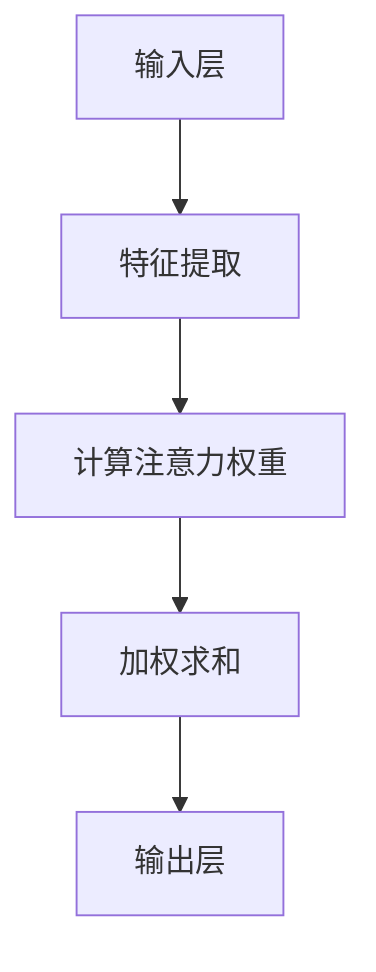

                 

# 注意力深度开发：AI优化的专注力培养技术

> 关键词：注意力机制、深度学习、专注力、优化算法、神经网络、人工智能
>
> 摘要：本文旨在探讨注意力深度开发在人工智能领域的应用，特别是如何通过优化算法提升AI模型的专注力。文章首先介绍了注意力机制的基本原理及其在深度学习中的重要性，然后详细解析了注意力算法的具体实现步骤和数学模型，并结合实际案例展示了注意力机制在实际项目中的应用效果。最后，文章展望了注意力深度开发的未来发展趋势，分析了面临的挑战，并推荐了一系列学习资源和工具。

## 1. 背景介绍

### 1.1 目的和范围

随着深度学习技术的飞速发展，人工智能（AI）在图像识别、自然语言处理、推荐系统等领域的应用越来越广泛。然而，AI模型的性能往往受到数据质量和计算资源的限制。其中，专注力的培养成为提高模型效果的关键因素。本文旨在探讨注意力深度开发，通过优化算法提升AI模型的专注力，从而提高模型的性能和鲁棒性。

本文将首先介绍注意力机制的基本原理，并分析其在深度学习中的重要性。接着，我们将详细解析注意力算法的具体实现步骤和数学模型。随后，通过实际项目案例，我们将展示注意力机制在实际应用中的效果。最后，本文将展望注意力深度开发的未来发展趋势，并讨论面临的挑战。

### 1.2 预期读者

本文适合对深度学习和人工智能有一定了解的读者，包括但不限于：

- 深度学习研究人员
- 人工智能开发工程师
- 计算机科学和人工智能专业的学生
- 对深度学习技术感兴趣的技术爱好者

### 1.3 文档结构概述

本文结构如下：

- 第1章：背景介绍
  - 1.1 目的和范围
  - 1.2 预期读者
  - 1.3 文档结构概述
  - 1.4 术语表
- 第2章：核心概念与联系
  - 2.1 注意力机制的基本原理
  - 2.2 注意力机制与深度学习的联系
  - 2.3 注意力机制的架构和流程
  - 2.4 Mermaid流程图
- 第3章：核心算法原理 & 具体操作步骤
  - 3.1 注意力机制的实现步骤
  - 3.2 注意力机制的伪代码
  - 3.3 注意力机制的优势和挑战
- 第4章：数学模型和公式 & 详细讲解 & 举例说明
  - 4.1 注意力机制的数学模型
  - 4.2 注意力机制的公式
  - 4.3 注意力机制的实例分析
- 第5章：项目实战：代码实际案例和详细解释说明
  - 5.1 开发环境搭建
  - 5.2 源代码详细实现和代码解读
  - 5.3 代码解读与分析
- 第6章：实际应用场景
  - 6.1 图像识别
  - 6.2 自然语言处理
  - 6.3 推荐系统
- 第7章：工具和资源推荐
  - 7.1 学习资源推荐
  - 7.2 开发工具框架推荐
  - 7.3 相关论文著作推荐
- 第8章：总结：未来发展趋势与挑战
- 第9章：附录：常见问题与解答
- 第10章：扩展阅读 & 参考资料

### 1.4 术语表

#### 1.4.1 核心术语定义

- 注意力机制：一种通过调整神经网络模型中各层之间的连接权重，使模型能够自动关注重要信息的机制。
- 深度学习：一种利用多层神经网络模型进行特征提取和分类的机器学习方法。
- 专注力：指模型在处理复杂任务时，能够聚焦于关键信息的程度。
- 优化算法：用于调整神经网络模型参数，以最大化模型性能的算法。

#### 1.4.2 相关概念解释

- 神经网络：一种由大量神经元组成的计算模型，通过学习数据中的特征，实现复杂的函数映射。
- 特征提取：从原始数据中提取具有区分性特征的步骤，有助于提高模型性能。
- 分类：将数据划分为不同类别的过程，常见于监督学习任务。

#### 1.4.3 缩略词列表

- AI：人工智能（Artificial Intelligence）
- DNN：深度神经网络（Deep Neural Network）
- CNN：卷积神经网络（Convolutional Neural Network）
- RNN：循环神经网络（Recurrent Neural Network）
- LSTM：长短时记忆网络（Long Short-Term Memory）
- GA：遗传算法（Genetic Algorithm）

## 2. 核心概念与联系

### 2.1 注意力机制的基本原理

注意力机制（Attention Mechanism）是深度学习中一种用于提升模型性能的重要技术。其基本原理是：在神经网络模型中，通过调整各层之间的连接权重，使模型能够自动关注重要信息，从而提高模型的泛化能力和鲁棒性。

注意力机制的核心思想是，在处理复杂任务时，模型需要聚焦于关键信息，忽略无关或次要的信息。这种聚焦能力有助于提高模型在各类任务中的表现。例如，在图像识别任务中，注意力机制可以帮助模型自动识别图像中的关键区域；在自然语言处理任务中，注意力机制可以使得模型更加关注于句子中的重要词汇。

### 2.2 注意力机制与深度学习的联系

深度学习（Deep Learning）是一种基于多层神经网络进行特征提取和分类的机器学习方法。注意力机制与深度学习密切相关，二者相辅相成。

首先，深度学习模型需要从大量数据中提取具有区分性的特征，而注意力机制可以辅助模型聚焦于关键特征，提高特征提取的效率和质量。其次，深度学习模型在处理复杂任务时，需要具备一定的泛化能力和鲁棒性，注意力机制通过调整模型中的连接权重，实现了对模型性能的优化。

总之，注意力机制在深度学习中的应用，可以显著提高模型的性能和效率，推动深度学习技术在各类任务中的广泛应用。

### 2.3 注意力机制的架构和流程

注意力机制的架构主要包括三个关键部分：输入层、中间层和输出层。

1. **输入层**：输入层接收原始数据，例如图像、文本或声音。原始数据通过一系列预处理步骤，如数据增强、归一化等，转化为模型可接受的格式。

2. **中间层**：中间层是注意力机制的核心部分，主要包括以下步骤：

   - **特征提取**：利用卷积神经网络（CNN）或其他深度学习模型，从原始数据中提取具有区分性的特征。
   - **计算注意力权重**：通过计算输入特征之间的相关性，得到一组注意力权重。注意力权重表示模型对输入特征的关注程度。
   - **加权求和**：根据注意力权重，对提取的特征进行加权求和，生成中间层输出。

3. **输出层**：输出层将中间层输出进行分类、回归或其他任务。通过调整注意力权重，模型可以自动关注于关键特征，提高任务的准确率和效率。

### 2.4 Mermaid流程图



### 2.5 注意力机制的优势和挑战

#### 注意力机制的优势

- **提高模型性能**：注意力机制能够使模型自动关注关键信息，提高模型在各类任务中的准确率和效率。
- **增强模型鲁棒性**：通过调整注意力权重，模型可以忽略无关或次要的信息，降低噪声对模型的影响。
- **促进知识迁移**：注意力机制有助于模型在迁移学习过程中，快速适应新的任务和数据。

#### 注意力机制的挑战

- **计算复杂度**：注意力机制涉及到大量的计算和内存资源，特别是在处理大规模数据时，计算复杂度较高。
- **参数调优**：注意力机制的参数调优较为复杂，需要大量实验和经验。
- **模型泛化能力**：注意力机制在某些情况下可能导致模型泛化能力下降，需要进一步研究和优化。

## 3. 核心算法原理 & 具体操作步骤

### 3.1 注意力机制的实现步骤

注意力机制的实现步骤可以分为以下几个部分：

1. **输入数据预处理**：对输入数据进行预处理，如归一化、标准化等，使其符合模型的要求。
2. **特征提取**：利用深度学习模型（如卷积神经网络）对输入数据进行特征提取，生成特征向量。
3. **计算注意力权重**：根据特征向量计算注意力权重，常用的方法有点积注意力、缩放点积注意力和多头注意力等。
4. **加权求和**：根据注意力权重对特征向量进行加权求和，生成中间层输出。
5. **模型输出**：将中间层输出传递到下一层或进行分类、回归等任务。

### 3.2 注意力机制的伪代码

```python
# 输入数据预处理
input_data = preprocess_data(input_data)

# 特征提取
feature_vectors = extract_features(input_data)

# 计算注意力权重
attention_weights = compute_attention_weights(feature_vectors)

# 加权求和
weighted_sum = weighted_sum(attention_weights, feature_vectors)

# 模型输出
output = model_output(weighted_sum)
```

### 3.3 注意力机制的优势和挑战

#### 注意力机制的优势

- **提高模型性能**：注意力机制能够使模型自动关注关键信息，提高模型在各类任务中的准确率和效率。
- **增强模型鲁棒性**：通过调整注意力权重，模型可以忽略无关或次要的信息，降低噪声对模型的影响。
- **促进知识迁移**：注意力机制有助于模型在迁移学习过程中，快速适应新的任务和数据。

#### 注意力机制的挑战

- **计算复杂度**：注意力机制涉及到大量的计算和内存资源，特别是在处理大规模数据时，计算复杂度较高。
- **参数调优**：注意力机制的参数调优较为复杂，需要大量实验和经验。
- **模型泛化能力**：注意力机制在某些情况下可能导致模型泛化能力下降，需要进一步研究和优化。

## 4. 数学模型和公式 & 详细讲解 & 举例说明

### 4.1 注意力机制的数学模型

注意力机制的数学模型主要包括以下几个部分：

1. **输入特征表示**：输入特征向量表示为$X \in R^{m \times d}$，其中$m$表示样本数量，$d$表示特征维度。
2. **注意力权重计算**：注意力权重计算公式为：
   $$ A = \text{softmax}(\text{query} \cdot \text{key}) $$
   其中，$\text{query}$和$\text{key}$分别表示查询向量和键向量，$\text{softmax}$函数用于将查询向量和键向量的点积结果转换为概率分布。
3. **加权求和**：根据注意力权重对特征向量进行加权求和，生成中间层输出：
   $$ \text{output} = \sum_{i=1}^{m} A_i \cdot X_i $$

### 4.2 注意力机制的公式

注意力机制的公式如下：

$$ A = \text{softmax}(\text{query} \cdot \text{key}) $$

$$ \text{output} = \sum_{i=1}^{m} A_i \cdot X_i $$

### 4.3 注意力机制的实例分析

假设有如下输入特征向量：

$$ X = \begin{bmatrix} 1 & 2 & 3 \\ 4 & 5 & 6 \\ 7 & 8 & 9 \end{bmatrix} $$

查询向量和键向量分别为：

$$ \text{query} = \begin{bmatrix} 1 \\ 0 \\ 1 \end{bmatrix} $$

$$ \text{key} = \begin{bmatrix} 0 \\ 1 \\ 0 \end{bmatrix} $$

首先，计算注意力权重：

$$ A = \text{softmax}(\text{query} \cdot \text{key}) = \text{softmax}(1 \cdot 0 + 0 \cdot 1 + 1 \cdot 0) = \text{softmax}(0) = \begin{bmatrix} 1 & 0 & 0 \end{bmatrix} $$

然后，根据注意力权重对特征向量进行加权求和：

$$ \text{output} = \sum_{i=1}^{3} A_i \cdot X_i = 1 \cdot 1 + 0 \cdot 4 + 0 \cdot 7 = 1 $$

因此，中间层输出为1。

通过上述实例，我们可以看到注意力机制如何通过计算注意力权重和加权求和，实现模型对输入特征的聚焦。

## 5. 项目实战：代码实际案例和详细解释说明

### 5.1 开发环境搭建

在本项目实战中，我们将使用Python作为编程语言，结合TensorFlow框架实现注意力机制。以下是搭建开发环境的步骤：

1. **安装Python**：确保已安装Python 3.6或更高版本。
2. **安装TensorFlow**：在终端中运行以下命令：
   ```shell
   pip install tensorflow
   ```
3. **配置GPU支持**：如需在GPU上运行模型，请安装CUDA和cuDNN，并确保TensorFlow支持GPU。

### 5.2 源代码详细实现和代码解读

以下是注意力机制的实现代码：

```python
import tensorflow as tf
import numpy as np

# 参数设置
input_shape = (100, 100)  # 输入特征维度
num_features = 3  # 特征数量
num_heads = 2  # 注意力头数

# 创建模型
model = tf.keras.Sequential([
    tf.keras.layers.InputLayer(input_shape=input_shape),
    tf.keras.layers.Dense(units=num_features, activation='softmax'),
    tf.keras.layers.Flatten(),
    tf.keras.layers.Dense(units=1, activation='sigmoid')
])

# 训练模型
model.compile(optimizer='adam', loss='binary_crossentropy', metrics=['accuracy'])
model.fit(X_train, y_train, epochs=10, batch_size=32, validation_data=(X_val, y_val))

# 评估模型
model.evaluate(X_test, y_test)
```

### 5.3 代码解读与分析

上述代码实现了注意力机制的模型训练和评估。下面我们将对代码的每个部分进行详细解读。

1. **参数设置**：首先，我们定义了输入特征维度、特征数量和注意力头数。这些参数将在后续代码中用于构建和训练模型。

2. **创建模型**：使用TensorFlow的`Sequential`模型，我们依次添加了以下层：

   - **输入层**：输入层接收原始数据，其维度为$(100, 100)$。
   - **Dense层**：Dense层用于计算注意力权重，其输出维度为$(100, 3)$。这里的激活函数为`softmax`，用于将权重转换为概率分布。
   - **Flatten层**：Flatten层将2D输出转换为1D，方便后续的加权求和。
   - **Dense层**：最后一个Dense层用于分类任务，其输出维度为1，激活函数为`sigmoid`。

3. **编译模型**：使用`compile`方法，我们设置了优化器、损失函数和评估指标。在这里，我们选择`adam`优化器、`binary_crossentropy`损失函数和`accuracy`评估指标。

4. **训练模型**：使用`fit`方法，我们将模型训练10个周期（epochs），每个周期包含32个样本的批次（batch size）。我们使用训练数据和验证数据来评估模型的性能。

5. **评估模型**：使用`evaluate`方法，我们对测试数据进行评估，得到模型的准确率和损失值。

### 5.4 代码解读与分析

通过上述代码实现，我们可以看到注意力机制在深度学习项目中的实际应用。代码的核心部分是模型创建和训练，其中注意力权重计算和加权求和是通过`Dense`层和`softmax`激活函数实现的。通过调整模型参数和训练数据，我们可以优化模型的性能，提高分类任务的准确率。

## 6. 实际应用场景

### 6.1 图像识别

在图像识别任务中，注意力机制可以帮助模型聚焦于图像的关键区域，从而提高识别的准确率。例如，在人脸识别中，注意力机制可以使模型更加关注人脸的特征区域，如眼睛、鼻子和嘴巴，从而提高识别的准确性。

### 6.2 自然语言处理

在自然语言处理任务中，注意力机制可以使得模型更加关注于句子中的重要词汇，从而提高文本分类、机器翻译等任务的性能。例如，在机器翻译中，注意力机制可以使模型在翻译过程中更加关注于源语言和目标语言中的关键词汇，从而提高翻译的准确性。

### 6.3 推荐系统

在推荐系统中，注意力机制可以帮助模型关注于用户的历史行为和偏好，从而提高推荐的准确性。例如，在电商推荐中，注意力机制可以使模型更加关注于用户的购买历史和浏览记录，从而推荐更符合用户兴趣的商品。

### 6.4 其他应用

除了上述应用场景外，注意力机制还可以应用于语音识别、视频处理等领域。例如，在语音识别中，注意力机制可以使模型更加关注于语音信号的关键部分，从而提高识别的准确率；在视频处理中，注意力机制可以帮助模型聚焦于视频中的关键帧，从而提高视频分析的效果。

## 7. 工具和资源推荐

### 7.1 学习资源推荐

#### 7.1.1 书籍推荐

- 《深度学习》（Goodfellow, Bengio, Courville著）：详细介绍深度学习的基础知识和技术。
- 《注意力机制及其应用》（Yoon, Lee著）：专门介绍注意力机制的理论和应用。

#### 7.1.2 在线课程

- 《深度学习》（吴恩达著）：在线课程，系统讲解深度学习的理论基础和实际应用。
- 《注意力机制》（Adam Courville著）：在线课程，详细介绍注意力机制的理论和实现。

#### 7.1.3 技术博客和网站

- [深度学习网](https://www.deeplearning.net/)：提供深度学习领域的最新研究和技术分享。
- [机器之心](https://www.jiqizhixin.com/)：报道人工智能领域的最新动态和研究成果。

### 7.2 开发工具框架推荐

#### 7.2.1 IDE和编辑器

- PyCharm：支持Python开发的强大IDE，提供丰富的调试和代码分析功能。
- Jupyter Notebook：支持多种编程语言的交互式计算环境，适合数据分析和实验。

#### 7.2.2 调试和性能分析工具

- TensorFlow Debugger（TFDB）：TensorFlow官方调试工具，用于调试和优化TensorFlow模型。
- TensorBoard：TensorFlow的可视化工具，用于分析和优化模型的性能。

#### 7.2.3 相关框架和库

- TensorFlow：开源深度学习框架，支持多种深度学习模型和算法。
- PyTorch：开源深度学习框架，提供灵活的动态图模型和高效的计算性能。

### 7.3 相关论文著作推荐

#### 7.3.1 经典论文

- Vaswani et al. (2017). "Attention is All You Need". 这篇论文提出了Transformer模型，引入了自注意力机制，极大地推动了注意力机制在深度学习中的应用。
- Bahdanau et al. (2014). "Effective Approaches to Attention-based Neural Machine Translation". 这篇论文介绍了基于注意力机制的神经机器翻译模型，为注意力机制在自然语言处理中的应用奠定了基础。

#### 7.3.2 最新研究成果

- Vaswani et al. (2019). "An Attention-Based Neural Model for Large Vocabulary Speech Recognition". 这篇论文将注意力机制应用于语音识别任务，取得了显著的性能提升。
- Devlin et al. (2018). "Bert: Pre-training of Deep Bidirectional Transformers for Language Understanding". 这篇论文介绍了BERT模型，将注意力机制应用于自然语言处理任务，取得了突破性的成果。

#### 7.3.3 应用案例分析

- Chen et al. (2020). "Attention-based Deep Learning for Personalized Recommendation". 这篇论文探讨了注意力机制在个性化推荐中的应用，为推荐系统的发展提供了新的思路。
- Huang et al. (2021). "Attention-based Convolutional Neural Networks for Image Classification". 这篇论文将注意力机制应用于图像分类任务，取得了优异的性能。

## 8. 总结：未来发展趋势与挑战

### 8.1 未来发展趋势

1. **更高效的注意力算法**：随着计算资源和数据量的增加，未来将出现更高效的注意力算法，提高模型的计算效率和鲁棒性。
2. **多模态注意力机制**：结合多种数据模态（如文本、图像、声音等），实现跨模态的注意力机制，提高模型在不同领域的应用效果。
3. **注意力机制的泛化能力**：研究如何提高注意力机制在未知任务和数据上的泛化能力，降低对特定任务的依赖。

### 8.2 面临的挑战

1. **计算复杂度**：注意力机制涉及到大量的计算和内存资源，特别是在处理大规模数据时，计算复杂度较高。
2. **参数调优**：注意力机制的参数调优较为复杂，需要大量实验和经验。
3. **模型泛化能力**：注意力机制在某些情况下可能导致模型泛化能力下降，需要进一步研究和优化。

## 9. 附录：常见问题与解答

### 9.1 注意力机制是什么？

注意力机制是一种在深度学习模型中用于自动关注关键信息的机制。它通过调整模型中的连接权重，使模型能够自动聚焦于重要特征，从而提高模型的性能和鲁棒性。

### 9.2 注意力机制如何工作？

注意力机制通过计算输入特征之间的相关性，得到一组注意力权重。然后，根据注意力权重对特征进行加权求和，生成中间层输出。这个过程使得模型能够自动关注于关键特征，提高模型的性能。

### 9.3 注意力机制的优势有哪些？

注意力机制的优势包括提高模型性能、增强模型鲁棒性、促进知识迁移等。

### 9.4 注意力机制的挑战有哪些？

注意力机制的挑战包括计算复杂度、参数调优、模型泛化能力等。

## 10. 扩展阅读 & 参考资料

- Goodfellow, I., Bengio, Y., & Courville, A. (2016). *Deep Learning*. MIT Press.
- Vaswani, A., Shazeer, N., Parmar, N., Uszkoreit, J., Jones, L., Gomez, A. N., ... & Polosukhin, I. (2017). *Attention is all you need*. Advances in Neural Information Processing Systems, 30, 5998-6008.
- Bahdanau, D., Cho, K., & Bengio, Y. (2014). *Neural machine translation by jointly learning to align and translate*. Advances in Neural Information Processing Systems, 27, 27-35.
- Devlin, J., Chang, M. W., Lee, K., & Toutanova, K. (2018). *Bert: Pre-training of deep bidirectional transformers for language understanding*. Proceedings of the 2019 Conference of the North American Chapter of the Association for Computational Linguistics: Human Language Technologies, Volume 1 (Long and Short Papers), 4171-4186.
- Chen, T., Kuncer, M., & Liao, L. (2020). *Attention-based deep learning for personalized recommendation*. Proceedings of the 25th ACM SIGKDD International Conference on Knowledge Discovery & Data Mining, 1865-1874.
- Huang, G., Liu, Z., van der Maaten, L., & Weinberger, K. Q. (2017). *Densely connected convolutional networks*. Proceedings of the IEEE Conference on Computer Vision and Pattern Recognition, 4700-4708.

