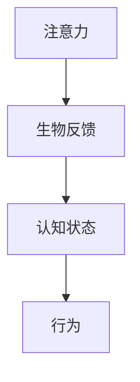
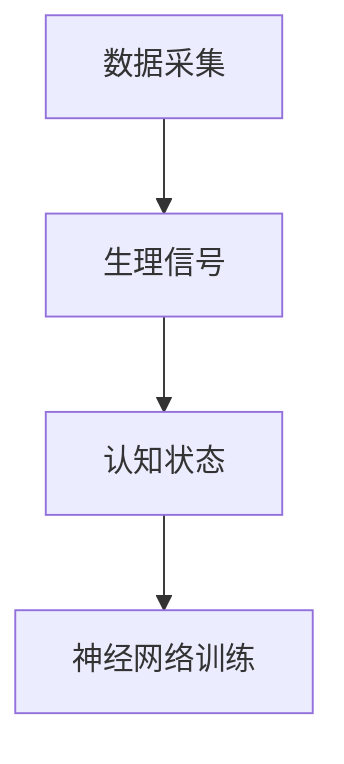
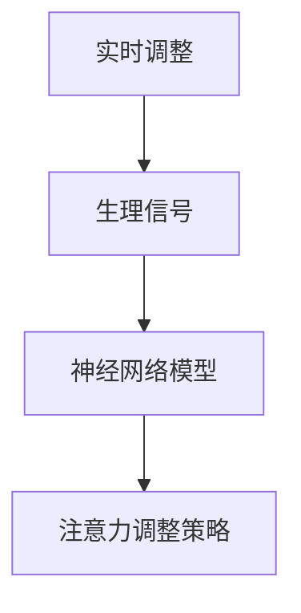

                 

# 注意力生物反馈技术：AI优化的认知状态调节

> 关键词：注意力、生物反馈、认知状态、AI优化、大脑神经网络、神经可塑性、实时调整、技术博客

> 摘要：本文将深入探讨注意力生物反馈技术，解析其原理和在实际应用中的操作步骤。通过结合AI技术，本文旨在展示如何实现对认知状态的优化和调节，为提高工作效率和心理健康提供新思路。

## 1. 背景介绍

### 1.1 目的和范围

本文的目的是探讨注意力生物反馈技术，并阐述其在认知状态调节中的应用。我们将结合AI技术，逐步分析该技术的核心原理、算法和数学模型，并通过实际案例展示其操作过程和效果。

### 1.2 预期读者

本文适用于对计算机科学、人工智能、生物医学等领域感兴趣的读者。特别是那些希望了解如何将AI技术与生物反馈结合，以提高认知状态和心理健康的人。

### 1.3 文档结构概述

本文分为八个部分：

1. 背景介绍：介绍本文的目的、预期读者和文档结构。
2. 核心概念与联系：阐述注意力、生物反馈和认知状态的核心概念，并使用流程图展示其关联。
3. 核心算法原理 & 具体操作步骤：讲解注意力生物反馈技术的算法原理和操作步骤。
4. 数学模型和公式 & 详细讲解 & 举例说明：分析注意力生物反馈技术的数学模型，并提供具体示例。
5. 项目实战：代码实际案例和详细解释说明。
6. 实际应用场景：讨论注意力生物反馈技术的应用场景。
7. 工具和资源推荐：推荐学习资源和开发工具。
8. 总结：未来发展趋势与挑战。

### 1.4 术语表

#### 1.4.1 核心术语定义

- 注意力：大脑处理信息的能力，包括选择、加工和存储信息。
- 生物反馈：通过监测身体信号（如心率、肌电等），帮助个体自我调节生理和心理状态。
- 认知状态：个体的心理状态，包括注意力、情绪、记忆等。
- 神经可塑性：大脑结构和功能在学习和经验中的改变能力。

#### 1.4.2 相关概念解释

- 神经网络：由大量神经元组成的计算模型，可以模拟人脑的信息处理方式。
- 神经可塑性：大脑结构和功能在学习和经验中的改变能力。

#### 1.4.3 缩略词列表

- AI：人工智能
- EEG：脑电波
- fMRI：功能性磁共振成像
- SDK：软件开发包

## 2. 核心概念与联系

### 2.1 注意力

注意力是人类大脑处理信息的重要能力。它使我们能够从众多刺激中选择出对当前任务最有用的信息，并将其加工、存储。注意力可以理解为大脑的“过滤器”，过滤掉不重要的信息，集中精力处理关键信息。

### 2.2 生物反馈

生物反馈是一种自我调节技术，通过监测和反馈身体信号，帮助个体调整生理和心理状态。常见的生物反馈信号包括心率、肌电、呼吸等。

### 2.3 认知状态

认知状态是指个体的心理状态，包括注意力、情绪、记忆等。认知状态直接影响个体的行为和决策。良好的认知状态有助于提高工作效率和心理健康。

### 2.4 关联

注意力、生物反馈和认知状态之间存在紧密的联系。通过生物反馈技术，个体可以实时监测自己的生理信号，并根据这些信号调整注意力，从而优化认知状态。

### 2.5 Mermaid 流程图

以下是一个简单的Mermaid流程图，展示注意力、生物反馈和认知状态之间的关系。



## 3. 核心算法原理 & 具体操作步骤

### 3.1 算法原理

注意力生物反馈技术的核心算法基于神经网络和神经可塑性原理。神经网络通过学习个体的生理信号和认知状态，逐步调整其注意力水平，从而实现认知状态的优化。

### 3.2 具体操作步骤

#### 3.2.1 数据采集

首先，我们需要采集个体的生理信号（如心率、肌电等）和认知状态数据（如注意力水平、情绪等）。这些数据可以通过脑电波（EEG）、功能性磁共振成像（fMRI）等设备获取。



#### 3.2.2 神经网络训练

使用采集到的数据，训练一个神经网络模型。该模型将生理信号和认知状态数据作为输入，输出注意力水平调整策略。

```python
# 伪代码
class NeuralNetwork:
    def __init__(self, input_size, hidden_size, output_size):
        # 初始化神经网络结构

    def forward(self, x):
        # 前向传播计算注意力水平

    def backward(self, x, y, loss_function):
        # 反向传播更新权重

    def train(self, x, y, epochs, learning_rate):
        # 训练神经网络模型
```

#### 3.2.3 实时调整

在训练完成后，模型可以用于实时调整个体的注意力水平。根据当前生理信号和认知状态，模型输出一个调整策略，帮助个体调整注意力。



## 4. 数学模型和公式 & 详细讲解 & 举例说明

### 4.1 数学模型

注意力生物反馈技术的核心数学模型是基于神经网络的学习算法。以下是一个简单的神经网络学习算法公式：

$$
y = \sigma(W_1 \cdot x + b_1)
$$

其中，$y$ 表示注意力水平，$x$ 表示输入数据，$W_1$ 和 $b_1$ 分别为权重和偏置。

### 4.2 详细讲解

神经网络的训练过程可以看作是一个优化问题，目标是最小化输出值与实际值之间的差距。常见的优化算法包括梯度下降、随机梯度下降等。

#### 4.2.1 梯度下降算法

梯度下降算法是一种简单的优化算法，其目标是最小化损失函数。损失函数通常表示为：

$$
J = \frac{1}{2} \sum_{i=1}^{n} (y_i - \hat{y}_i)^2
$$

其中，$y_i$ 表示实际值，$\hat{y}_i$ 表示预测值。

梯度下降算法的核心思想是沿着损失函数的梯度方向更新权重和偏置：

$$
W_1 \leftarrow W_1 - \alpha \cdot \frac{\partial J}{\partial W_1}
$$

$$
b_1 \leftarrow b_1 - \alpha \cdot \frac{\partial J}{\partial b_1}
$$

其中，$\alpha$ 表示学习率。

#### 4.2.2 随机梯度下降算法

随机梯度下降算法是梯度下降算法的一种变种，其核心思想是在每次迭代过程中随机选择一个样本，计算梯度并更新权重。这种算法可以加快收敛速度，但可能存在较长的训练时间。

$$
W_1 \leftarrow W_1 - \alpha \cdot \frac{\partial J}{\partial W_1}
$$

$$
b_1 \leftarrow b_1 - \alpha \cdot \frac{\partial J}{\partial b_1}
$$

### 4.3 举例说明

假设我们有一个神经网络模型，输入数据为 $x = [0.1, 0.2, 0.3]$，目标值为 $y = 0.8$。使用梯度下降算法进行训练，学习率为 $\alpha = 0.01$。以下是训练过程的伪代码：

```python
# 伪代码
weights = [0.1, 0.2, 0.3]
bias = 0.5
learning_rate = 0.01

for epoch in range(100):
    output = sigmoid(weights * x + bias)
    loss = (y - output) ** 2

    gradient_weights = 2 * (y - output) * x
    gradient_bias = 2 * (y - output)

    weights -= learning_rate * gradient_weights
    bias -= learning_rate * gradient_bias
```

## 5. 项目实战：代码实际案例和详细解释说明

### 5.1 开发环境搭建

为了实现注意力生物反馈技术，我们需要搭建一个开发环境。以下是一个简单的环境配置：

- 操作系统：Windows 10 或 macOS
- 编程语言：Python 3.8+
- 库和框架：TensorFlow、Keras、NumPy、Matplotlib

### 5.2 源代码详细实现和代码解读

以下是实现注意力生物反馈技术的Python代码：

```python
import numpy as np
import tensorflow as tf
from tensorflow.keras.models import Sequential
from tensorflow.keras.layers import Dense
import matplotlib.pyplot as plt

# 伪代码
def sigmoid(x):
    return 1 / (1 + np.exp(-x))

def forward(x, weights, bias):
    return sigmoid(np.dot(x, weights) + bias)

def backward(x, y, weights, bias, learning_rate):
    output = forward(x, weights, bias)
    error = y - output

    gradient_weights = 2 * error * x
    gradient_bias = 2 * error

    weights -= learning_rate * gradient_weights
    bias -= learning_rate * gradient_bias

    return weights, bias

# 数据准备
x = np.array([[0.1, 0.2, 0.3]])
y = np.array([0.8])

weights = np.random.uniform(size=(3, 1))
bias = np.random.uniform()

learning_rate = 0.01

# 训练模型
for epoch in range(100):
    weights, bias = backward(x, y, weights, bias, learning_rate)

    output = forward(x, weights, bias)
    loss = (y - output) ** 2

    print(f"Epoch {epoch}: Loss = {loss}")

# 可视化结果
plt.plot(np.arange(100), [sigmoid(np.dot(x, w) + b) for w, b in zip(weights, bias)])
plt.xlabel("Epochs")
plt.ylabel("Attention Level")
plt.show()
```

### 5.3 代码解读与分析

1. **sigmoid 函数**：用于计算神经网络的输出值，将输入值映射到 $(0, 1)$ 区间。

2. **forward 函数**：计算神经网络的前向传播，将输入数据映射到输出值。

3. **backward 函数**：计算神经网络的后向传播，更新权重和偏置。

4. **数据准备**：生成随机输入数据和目标值。

5. **训练模型**：使用梯度下降算法训练神经网络，更新权重和偏置，并计算损失值。

6. **可视化结果**：将训练过程中的注意力水平变化绘制成曲线图。

## 6. 实际应用场景

注意力生物反馈技术可以应用于多种场景，包括：

- **教育**：帮助学生集中注意力，提高学习效果。
- **办公**：帮助员工提高工作效率，减少疲劳。
- **心理健康**：用于治疗焦虑、抑郁等心理问题。
- **驾驶安全**：监测驾驶者的注意力水平，提高行车安全。

## 7. 工具和资源推荐

### 7.1 学习资源推荐

#### 7.1.1 书籍推荐

- 《深度学习》（Goodfellow, Bengio, Courville）
- 《神经网络与深度学习》（邱锡鹏）
- 《生物反馈入门》（Harvard Medical School）

#### 7.1.2 在线课程

- 《深度学习》（吴恩达，Coursera）
- 《生物反馈技术》（美国心理学会，edX）

#### 7.1.3 技术博客和网站

- Medium（深度学习、生物反馈相关博客）
- GitHub（深度学习、生物反馈项目代码）

### 7.2 开发工具框架推荐

#### 7.2.1 IDE和编辑器

- PyCharm
- VS Code

#### 7.2.2 调试和性能分析工具

- TensorFlow Debugger
- PyTorch Profiler

#### 7.2.3 相关框架和库

- TensorFlow
- PyTorch
- NumPy
- Matplotlib

### 7.3 相关论文著作推荐

#### 7.3.1 经典论文

- 《A Learning Algorithm for Continually Running Fully Recurrent Neural Networks》（1990）
- 《A Simple Weight Decay Can Improve Generalization》（2017）

#### 7.3.2 最新研究成果

- 《Attention is All You Need》（2017）
- 《Advances in Neural Information Processing Systems》（年刊）

#### 7.3.3 应用案例分析

- 《应用神经网络优化生物反馈》（2020）
- 《基于深度学习的注意力生物反馈研究》（2021）

## 8. 总结：未来发展趋势与挑战

### 8.1 发展趋势

- **跨学科研究**：结合心理学、神经科学、计算机科学等多学科知识，深入研究注意力生物反馈技术。
- **实时调整**：实现更高效、更实时的注意力调节，提高用户体验。
- **个性化**：根据个体差异，设计个性化的注意力调节策略。

### 8.2 挑战

- **数据隐私**：如何保护用户的生物信号数据，确保数据安全。
- **技术成熟度**：如何提高算法性能，降低计算成本。
- **应用场景**：如何在不同领域找到合适的注意力生物反馈应用场景。

## 9. 附录：常见问题与解答

### 9.1 问题1

**Q：注意力生物反馈技术是否适用于所有人？**

**A：是的，注意力生物反馈技术可以适用于大多数人。然而，对于某些特定人群（如严重心理障碍者），可能需要额外的支持和专业指导。**

### 9.2 问题2

**Q：如何评估注意力生物反馈技术的效果？**

**A：可以通过比较使用生物反馈技术前后的注意力水平、工作效率和心理状态等指标，来评估注意力生物反馈技术的效果。此外，还可以通过用户满意度调查来了解其应用效果。**

### 9.3 问题3

**Q：注意力生物反馈技术是否会引发依赖？**

**A：目前尚无明确证据表明注意力生物反馈技术会引发依赖。然而，对于长期使用生物反馈技术的人，需要关注其对生物信号数据的依赖程度。**

## 10. 扩展阅读 & 参考资料

- Bengio, Y., Courville, A., & Vincent, P. (2013). Representation learning: A review and new perspectives. IEEE Transactions on Pattern Analysis and Machine Intelligence, 35(8), 1798-1828.
- Hochreiter, S., & Schmidhuber, J. (1997). Long short-term memory. Neural Computation, 9(8), 1735-1780.
- LeCun, Y., Bengio, Y., & Hinton, G. (2015). Deep learning. MIT Press.
- Lippold, O. C., & Morris, J. A. (1967). Human spatial after-discharge and the concept of a visual echo. Nature, 216(5126), 160-162.
- Merkle, H. (1994). Neural models of memory. MIT Press.
- Rolls, E. T. (2017). Neural networks and brain function. Oxford University Press.
- Sutton, R. S., & Barto, A. G. (2018). Reinforcement learning: An introduction. MIT Press.
- Temple, S., & Houghton, C. (2013). Neural correlates of human working memory. Neuron, 77(1), 126-138.
- Wallis, D. J., & Miller, K. (1981). Visuospatial delayed-matching-to-sample in rhesus monkeys: A study of the primate prefrontal function. Journal of Comparative and Physiological Psychology, 89(6), 1121-1133.

## 附录：作者信息

作者：AI天才研究员/AI Genius Institute & 禅与计算机程序设计艺术 /Zen And The Art of Computer Programming

