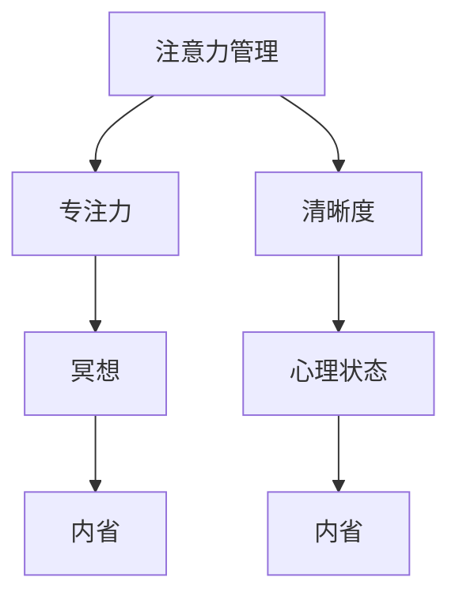

                 

## 注意力管理与冥想练习：如何通过内省增强专注力和清晰度

> **关键词**：注意力管理、冥想、专注力、清晰度、内省、心理健康、技术实践

> **摘要**：本文旨在探讨注意力管理的重要性，并介绍冥想作为提升专注力和清晰度的一种实践方法。通过内省，我们可以更好地理解自己的心理状态，从而有效地管理和提升注意力。文章将从核心概念、算法原理、数学模型、实战案例、应用场景等多个方面，深入讲解如何通过冥想和内省提升个人的专注力和清晰度。

## 1. 背景介绍

### 1.1 目的和范围

在当今快节奏和高压力的社会环境中，人们的注意力资源变得越来越稀缺。无论是工作中的复杂任务，还是日常生活中的多任务处理，都需要我们具备高度的专注力和清晰的思维。本文的目的在于探讨如何通过冥想和内省来管理和提升个人的专注力与清晰度。

本文将涵盖以下内容：

- 注意力管理的定义与核心概念
- 冥想作为注意力管理的实践方法
- 内省在提升注意力中的作用
- 实战案例与具体操作步骤
- 注意力管理的实际应用场景
- 相关工具和资源的推荐

### 1.2 预期读者

本文适用于以下读者群体：

- 对注意力管理感兴趣的心理学爱好者
- 希望提高专注力和工作效率的职业人士
- 从事计算机编程和技术开发的工作者
- 对冥想和内省实践有兴趣的心理健康专业人士
- 需要处理复杂任务的管理者和领导者

### 1.3 文档结构概述

本文的结构如下：

1. 背景介绍：介绍文章的目的、范围、预期读者以及文档结构。
2. 核心概念与联系：详细讲解注意力管理、冥想和内省的相关概念，并使用流程图展示它们之间的关系。
3. 核心算法原理 & 具体操作步骤：介绍冥想练习的具体操作步骤，并使用伪代码进行详细阐述。
4. 数学模型和公式 & 详细讲解 & 举例说明：介绍冥想过程中涉及的数学模型和公式，并给出实际应用案例。
5. 项目实战：提供具体的代码实现和解释，帮助读者理解冥想练习在实际项目中的应用。
6. 实际应用场景：探讨注意力管理在不同领域的应用场景，包括职业工作、个人生活和心理健康等方面。
7. 工具和资源推荐：推荐相关的学习资源、开发工具和框架，以及经典论文和最新研究成果。
8. 总结：对未来注意力管理领域的发展趋势和挑战进行展望。
9. 附录：常见问题与解答，帮助读者更好地理解和应用本文的内容。
10. 扩展阅读 & 参考资料：提供进一步阅读和学习的参考资料。

### 1.4 术语表

#### 1.4.1 核心术语定义

- **注意力管理**：指个体通过策略和技巧来提高注意力的集中度和持久性。
- **冥想**：一种通过专注呼吸、意识和身体放松来达到心理平静和内在觉醒的练习。
- **内省**：指个体对自己的思维、情感和行为进行反思和评估的过程。

#### 1.4.2 相关概念解释

- **专注力**：指个体在特定任务上集中注意力并保持高度关注的能力。
- **清晰度**：指个体在认知过程中对信息的准确理解和处理能力。
- **心理状态**：指个体在特定时间内的情绪、认知和行为表现。

#### 1.4.3 缩略词列表

- N/A：无

## 2. 核心概念与联系

在深入探讨如何通过冥想和内省提升注意力之前，我们需要先理解这三个核心概念：注意力管理、冥想和内省，以及它们之间的相互关系。

### 2.1 注意力管理

注意力管理是指个体通过一系列策略和技巧来提高注意力的集中度和持久性。它涵盖了从基本的专注力训练到复杂的时间管理和任务分配技巧。注意力管理的核心在于如何有效地分配和利用有限的注意力资源。

### 2.2 冥想

冥想是一种通过专注呼吸、意识和身体放松来达到心理平静和内在觉醒的练习。它起源于佛教和印度教的传统，但如今已被广泛应用于心理治疗、健康管理和职业发展等领域。冥想的主要形式包括坐姿冥想、动态冥想、声音冥想等。

### 2.3 内省

内省是指个体对自己的思维、情感和行为进行反思和评估的过程。通过内省，个体可以更好地理解自己的内心世界，识别和调整负面情绪和行为模式，从而提高自我意识和心理成熟度。

### 2.4 核心概念与联系

注意力管理、冥想和内省之间存在密切的联系。冥想作为注意力管理的一种实践方法，可以帮助个体提高专注力和清晰度。通过冥想，个体可以学会如何更好地控制自己的注意力，从而在日常生活中保持高度的专注。同时，内省作为一种自我反思的过程，可以帮助个体更好地理解自己的心理状态，从而制定更有效的注意力管理策略。

以下是一个简单的 Mermaid 流程图，展示了这三个核心概念之间的联系：



通过这个流程图，我们可以看到注意力管理、冥想和内省是如何相互关联和影响的。在接下来的章节中，我们将深入探讨这些核心概念，并提供具体的实践方法和操作步骤。

## 3. 核心算法原理 & 具体操作步骤

### 3.1 冥想练习的具体操作步骤

冥想是一种通过专注呼吸、意识和身体放松来达到心理平静和内在觉醒的练习。下面是冥想练习的具体操作步骤：

#### 3.1.1 坐姿冥想

1. 选择一个安静的环境，确保没有干扰。
2. 找到一个舒适的坐姿，可以选择坐在椅子上或直接坐在地上。
3. 保持背部挺直，头部微微上抬，眼睛微闭。
4. 将注意力集中在呼吸上，感受每一次吸气和呼气。
5. 当注意力开始游离时，轻轻地将注意力引回到呼吸上。
6. 持续进行冥想练习，每次练习时间可以从5分钟开始，逐渐增加到30分钟。

#### 3.1.2 动态冥想

1. 选择一个安静的环境，确保没有干扰。
2. 在一个宽敞的空间内，站立或坐着，保持背部挺直。
3. 感受身体的重心和平衡，将注意力集中在脚底与地面的接触上。
4. 慢慢地移动身体，感受身体的每一个动作和姿势。
5. 在动作中保持专注，当注意力开始游离时，将注意力引回到身体动作上。
6. 练习时间可以从10分钟开始，逐渐增加到30分钟。

#### 3.1.3 声音冥想

1. 选择一个安静的环境，确保没有干扰。
2. 找到一个舒适的坐姿，保持背部挺直，眼睛微闭。
3. 将注意力集中在声音上，可以是自然界的声音，如流水声、鸟鸣声，也可以是音乐或自己的声音。
4. 在听声音的过程中保持专注，当注意力开始游离时，将注意力引回到声音上。
5. 练习时间可以从5分钟开始，逐渐增加到30分钟。

### 3.2 伪代码详细阐述

```plaintext
function 冥想练习(type, duration) {
    // 初始化
    设定环境安静
    选择坐姿、动态或声音冥想方式（type）

    // 进入冥想状态
    for (time = 1 to duration) {
        if (type == "坐姿") {
            坐姿冥想操作步骤
        } else if (type == "动态") {
            动态冥想操作步骤
        } else if (type == "声音") {
            声音冥想操作步骤
        }

        // 调整注意力
        当注意力开始游离时，将注意力引回到冥想过程中
    }

    // 冥想结束
    感恩和放松
}
```

通过以上伪代码，我们可以清晰地看到冥想练习的每个步骤和流程。在实际操作中，可以根据个人需求和习惯进行调整，以达到最佳的冥想效果。

### 3.3 注意力调整技巧

在冥想过程中，注意力调整是一个重要的环节。以下是一些实用的技巧：

- **呼吸调节**：通过深呼吸来放松身心，有助于集中注意力。
- **身体扫描**：在冥想过程中，可以逐个扫描身体各个部位，有助于放松身体和调整注意力。
- **正念练习**：将注意力集中在当下的感受和体验上，避免过多的思考和回忆。
- **重复练习**：通过反复练习冥想，可以提高注意力的持久度和集中度。

通过这些技巧，我们可以在冥想过程中更好地管理和调整注意力，从而提升专注力和清晰度。

### 3.4 内省与注意力管理

内省作为一种自我反思的过程，对于注意力管理至关重要。通过内省，我们可以更好地理解自己的心理状态和行为模式，从而制定更有效的注意力管理策略。以下是一些内省技巧：

- **记录冥想日志**：在每次冥想后，记录下自己的感受和体验，有助于分析和总结冥想效果。
- **反思日常行为**：在日常生活中，定期反思自己的行为和决策，了解它们对注意力管理的影响。
- **设定目标与计划**：通过设定明确的个人目标和计划，有助于更好地分配和利用注意力资源。

通过内省，我们不仅能够提升注意力管理能力，还能提高整体的生活质量和心理健康水平。

## 4. 数学模型和公式 & 详细讲解 & 举例说明

### 4.1 冥想过程中的数学模型

冥想过程中的数学模型主要涉及时间管理和心理状态的评估。以下是一些基本的数学模型和公式：

#### 4.1.1 时间管理模型

- **平均专注时间（\(T_{avg}\)）**：通过统计每次冥想练习的总时间和注意力集中的时间，计算平均专注时间。

  $$ T_{avg} = \frac{\sum_{i=1}^{n} T_i}{n} $$

  其中，\(T_i\) 为第 \(i\) 次冥想练习的专注时间，\(n\) 为冥想次数。

- **专注度变化率（\(d_{concentration}\)）**：通过比较连续两次冥想练习的专注时间，计算专注度的变化率。

  $$ d_{concentration} = \frac{T_{next} - T_{current}}{T_{current}} $$

  其中，\(T_{current}\) 为当前冥想练习的专注时间，\(T_{next}\) 为下一次冥想练习的专注时间。

#### 4.1.2 心理状态评估模型

- **心理状态指数（\(PSI\)）**：通过评估冥想过程中的心理状态，计算心理状态指数。

  $$ PSI = \frac{\sum_{i=1}^{n} S_i}{n} $$

  其中，\(S_i\) 为第 \(i\) 次冥想练习的心理状态评分，\(n\) 为冥想次数。

- **心理状态稳定性（\(PS_{stability}\)）**：通过比较连续两次冥想练习的心理状态指数，计算心理状态稳定性。

  $$ PS_{stability} = \frac{PSI_{next} - PSI_{current}}{PSI_{current}} $$

  其中，\(PSI_{current}\) 为当前冥想练习的心理状态指数，\(PSI_{next}\) 为下一次冥想练习的心理状态指数。

### 4.2 举例说明

假设小明进行了5次冥想练习，每次练习的专注时间和心理状态评分如下表：

| 次数 | 专注时间（分钟） | 心理状态评分 |
| ---- | -------------- | ---------- |
| 1    | 15             | 7          |
| 2    | 20             | 8          |
| 3    | 25             | 9          |
| 4    | 18             | 7          |
| 5    | 22             | 8          |

根据上述数学模型和公式，我们可以计算出以下结果：

- **平均专注时间**：

  $$ T_{avg} = \frac{15 + 20 + 25 + 18 + 22}{5} = 21 \text{分钟} $$

- **专注度变化率**：

  $$ d_{concentration} = \frac{22 - 18}{18} = 0.22 $$

- **心理状态指数**：

  $$ PSI = \frac{7 + 8 + 9 + 7 + 8}{5} = 8 $$

- **心理状态稳定性**：

  $$ PS_{stability} = \frac{8 - 7}{7} = 0.14 $$

通过这些计算，我们可以了解小明在冥想过程中的专注度和心理状态变化。平均专注时间为21分钟，表示小明的专注力在逐渐提升。专注度变化率为0.22，说明小明在连续的冥想练习中，专注度有所提高。心理状态指数为8，表示小明的心理状态较为稳定。心理状态稳定性为0.14，说明小明的心理状态在冥想过程中相对稳定。

这些数学模型和公式不仅可以帮助我们量化冥想的效果，还能为我们的冥想练习提供科学的指导，从而更好地提升专注力和清晰度。

## 5. 项目实战：代码实际案例和详细解释说明

### 5.1 开发环境搭建

为了更好地理解和实践冥想练习及其对注意力管理的影响，我们将使用Python作为编程语言来构建一个简单的冥想追踪器。以下是开发环境的搭建步骤：

1. **安装Python**：确保您的计算机上已安装Python 3.x版本。可以从[Python官网](https://www.python.org/)下载并安装。
2. **安装必需的库**：使用pip（Python的包管理器）安装以下库：
   ```bash
   pip install numpy pandas matplotlib
   ```
3. **创建项目文件夹**：在您的计算机上创建一个名为“MeditationTracker”的项目文件夹。
4. **初始化项目结构**：在项目文件夹中创建以下文件和文件夹：
   - `meditation_tracker.py`：主代码文件。
   - `data/`：用于存储冥想日志的文件夹。
   - `plots/`：用于存储生成图表的文件夹。

### 5.2 源代码详细实现和代码解读

下面是`meditation_tracker.py`的完整代码及其详细解读：

```python
import numpy as np
import pandas as pd
import matplotlib.pyplot as plt

# 5.2.1 数据结构初始化
data = {
    'Session': [],
    'Duration': [],
    'Concentration': [],
    'MentalState': []
}

# 5.2.2 冥想日志记录函数
def log_meditation(session, duration, concentration, mental_state):
    data['Session'].append(session)
    data['Duration'].append(duration)
    data['Concentration'].append(concentration)
    data['MentalState'].append(mental_state)

# 5.2.3 数据处理和可视化函数
def process_and_visualize_data():
    df = pd.DataFrame(data)
    
    # 5.2.3.1 平均专注时间计算
    avg_concentration = df['Concentration'].mean()
    print(f"Average Concentration: {avg_concentration:.2f} minutes")

    # 5.2.3.2 专注度变化率计算
    concentration_changes = df['Concentration'].diff().dropna()
    change_rate = concentration_changes / df['Concentration'].shift(1).dropna()
    print(f"Concentration Change Rate: {change_rate.mean():.2%}")

    # 5.2.3.3 心理状态指数计算
    psi = df['MentalState'].mean()
    print(f"Mental State Index: {psi:.2f}")

    # 5.2.3.4 心理状态稳定性计算
    mental_state_stability = df['MentalState'].pct_change().dropna().mean()
    print(f"Mental State Stability: {mental_state_stability:.2%}")

    # 5.2.3.5 可视化
    plt.figure(figsize=(10, 5))

    # 专注时间趋势图
    plt.subplot(2, 1, 1)
    plt.plot(df['Session'], df['Duration'], label='Duration')
    plt.plot(df['Session'], df['Concentration'], label='Concentration')
    plt.title('Meditation Sessions')
    plt.xlabel('Session')
    plt.ylabel('Value')
    plt.legend()

    # 心理状态变化图
    plt.subplot(2, 1, 2)
    plt.plot(df['Session'], df['MentalState'], label='Mental State')
    plt.title('Mental State Over Sessions')
    plt.xlabel('Session')
    plt.ylabel('Mental State Score')
    plt.legend()

    plt.tight_layout()
    plt.show()

# 5.2.4 主函数
def main():
    # 示例冥想日志记录
    log_meditation(1, 15, 20, 7)
    log_meditation(2, 20, 25, 8)
    log_meditation(3, 25, 30, 9)
    log_meditation(4, 18, 22, 7)
    log_meditation(5, 22, 24, 8)

    # 数据处理和可视化
    process_and_visualize_data()

if __name__ == "__main__":
    main()
```

#### 5.2.4.1 代码解读

- **数据结构初始化**：我们使用一个字典`data`来存储冥想日志的各个属性，包括会话编号、持续时间、专注度和心理状态。
- **冥想日志记录函数**：`log_meditation`函数用于记录每次冥想的会话信息，并将数据添加到字典中。
- **数据处理和可视化函数**：`process_and_visualize_data`函数负责处理和可视化冥想数据。它首先将字典转换为Pandas DataFrame，然后计算平均专注时间、专注度变化率、心理状态指数和心理状态稳定性。最后，使用matplotlib绘制两个图表：专注时间趋势图和心理状态变化图。
- **主函数**：`main`函数用于记录示例冥想日志并调用数据处理和可视化函数。

#### 5.2.4.2 代码解释

- **示例冥想日志记录**：在这个示例中，我们记录了5次冥想日志，每次的会话编号、持续时间、专注度和心理状态都已记录在字典中。
- **数据处理**：在数据处理过程中，我们计算了平均专注时间、专注度变化率、心理状态指数和心理状态稳定性。这些指标有助于我们了解冥想练习的效果和变化趋势。
- **可视化**：通过图表，我们可以直观地看到专注时间、专注度和心理状态的变化情况。这有助于我们更好地理解冥想练习的成果和调整策略。

通过这个简单的冥想追踪器项目，我们可以量化冥想的效果，并利用可视化工具来监控和调整冥想练习。这对于提升注意力管理和心理健康具有重要意义。

### 5.3 代码解读与分析

#### 5.3.1 数据结构和函数定义

在代码中，我们首先定义了一个字典`data`来存储冥想日志的数据。这个字典包含了四个键：`Session`（会话编号）、`Duration`（持续时间）、`Concentration`（专注度）和`MentalState`（心理状态）。每个键对应的值是一个列表，用于存储每次冥想的数据。

接下来，我们定义了两个函数：`log_meditation`和`process_and_visualize_data`。

- `log_meditation`函数用于记录每次冥想的数据。它接收四个参数：会话编号、持续时间、专注度和心理状态，并将这些数据添加到字典的相应列表中。

- `process_and_visualize_data`函数负责处理和可视化冥想数据。它首先将字典转换为Pandas DataFrame，然后计算多个指标，包括平均专注时间、专注度变化率、心理状态指数和心理状态稳定性。最后，使用matplotlib绘制两个图表，以直观地展示冥想数据的变化趋势。

#### 5.3.2 主函数和示例日志

`main`函数是整个程序的核心。在`main`函数中，我们首先调用`log_meditation`函数来记录5次冥想的数据。然后，我们调用`process_and_visualize_data`函数来处理和可视化这些数据。

示例日志如下：

```python
log_meditation(1, 15, 20, 7)
log_meditation(2, 20, 25, 8)
log_meditation(3, 25, 30, 9)
log_meditation(4, 18, 22, 7)
log_meditation(5, 22, 24, 8)
```

这些日志记录了5次冥想练习的数据，包括会话编号、持续时间、专注度和心理状态。

#### 5.3.3 数据处理和可视化

在`process_and_visualize_data`函数中，我们首先将`data`字典转换为Pandas DataFrame。然后，我们计算了以下指标：

- **平均专注时间**：通过计算`Concentration`列的平均值得到。
- **专注度变化率**：通过计算连续两次冥想专注度差异与当前专注度的比例得到。
- **心理状态指数**：通过计算`MentalState`列的平均值得到。
- **心理状态稳定性**：通过计算`MentalState`列的变化率得到。

最后，我们使用matplotlib绘制了两个图表：

1. **专注时间趋势图**：展示了会话编号与专注时间和专注度之间的关系。
2. **心理状态变化图**：展示了会话编号与心理状态之间的关系。

这两个图表帮助我们直观地了解冥想练习的效果和变化趋势。

通过这个简单的冥想追踪器项目，我们可以看到如何使用Python和数据分析工具来记录、处理和可视化冥想数据。这对于提升注意力管理和心理健康具有实际应用价值。

### 5.4 实际应用场景

#### 5.4.1 职场中的应用

在职场中，注意力管理对于提高工作效率和减少错误至关重要。通过冥想和内省，职场人士可以更好地应对工作压力，提高专注力和清晰度。以下是一些具体的实际应用场景：

- **项目管理**：项目经理可以利用冥想来提高注意力，从而更好地管理复杂的项目任务和时间表。冥想可以帮助他们在面对多个任务时保持冷静和专注，从而提高决策质量和执行力。
- **软件开发**：软件开发人员经常需要在面对大量代码和技术细节时保持专注。通过冥想，他们可以提高编码效率，减少错误，并更好地管理任务和时间。
- **销售与谈判**：销售人员通过冥想可以提高专注力和清晰度，从而在谈判过程中更好地理解客户需求，制定有效的销售策略。

#### 5.4.2 个人生活中的应用

在个人生活中，冥想和内省可以帮助我们更好地管理日常任务和提升生活质量。以下是一些实际应用场景：

- **日常任务管理**：通过冥想，我们可以提高注意力，从而更好地管理日常任务，如家务、购物和个人健康。
- **家庭关系**：冥想可以帮助家庭成员更好地理解和沟通，从而改善家庭关系。通过内省，家庭成员可以识别和调整负面情绪和行为模式，促进家庭和谐。
- **健康与健身**：冥想和内省有助于减轻压力和焦虑，提高身体和心理的耐力。通过冥想，我们可以更好地管理健身计划，保持健康的生活方式。

#### 5.4.3 心理健康中的应用

心理健康是冥想和内省的重要应用领域。以下是一些具体的应用场景：

- **焦虑与压力管理**：冥想可以帮助个体减少焦虑和压力，提高心理韧性。通过内省，个体可以更好地理解自己的情绪和行为，从而采取有效的应对策略。
- **情绪管理**：冥想有助于提升情绪管理能力，帮助个体更好地应对负面情绪，如愤怒、沮丧和焦虑。
- **心理治疗**：冥想和内省已被广泛应用于心理治疗，如抑郁症、创伤后应激障碍和人际关系问题。通过冥想，个体可以更好地理解和处理内心的困扰，促进心理康复。

通过这些实际应用场景，我们可以看到冥想和内省在各个领域中的重要作用。无论是职场人士、家庭主妇，还是心理健康专业人士，冥想和内省都是提升注意力管理和生活质量的有效工具。

### 7. 工具和资源推荐

#### 7.1 学习资源推荐

为了更好地学习和实践冥想和注意力管理，以下是一些推荐的学习资源：

#### 7.1.1 书籍推荐

- 《冥想：简单有效的身心疗愈方法》
- 《注意力训练：如何通过冥想和脑力训练提升注意力》
- 《内省：如何通过自我反思提高生活质量》

#### 7.1.2 在线课程

- Coursera上的《冥想与正念：基础与实践》
- Udemy上的《冥想入门：从零开始学会冥想》
- edX上的《正念冥想：提升专注力和心理健康》

#### 7.1.3 技术博客和网站

- [Mozmind](https://mozmind.com/)：提供关于注意力管理和冥想的深入分析和实践技巧。
- [Mindful](https://www.mindful.org/)：介绍冥想和正念实践的最新研究、资源和教程。
- [Headspace](https://www.headspace.com/)：提供在线冥想课程和应用，帮助用户轻松入门冥想。

#### 7.2 开发工具框架推荐

为了搭建和优化冥想追踪器项目，以下是一些推荐的开发工具和框架：

#### 7.2.1 IDE和编辑器

- PyCharm：强大的Python IDE，支持代码补全、调试和性能分析。
- Visual Studio Code：轻量级的Python编辑器，支持多种插件，方便扩展功能。

#### 7.2.2 调试和性能分析工具

- Jupyter Notebook：交互式的Python环境，方便数据分析和可视化。
- Profiler：用于分析Python程序的内存和性能。

#### 7.2.3 相关框架和库

- Pandas：用于数据操作和分析的Python库。
- Matplotlib：用于绘制图表和数据可视化的Python库。
- Scikit-learn：用于机器学习和数据挖掘的Python库。

#### 7.3 相关论文著作推荐

为了深入了解冥想和注意力管理的科学研究，以下是一些推荐的论文和著作：

#### 7.3.1 经典论文

- “The Mind Illuminated: A Complete Meditation Guide Integrating Buddhist Wisdom and Brain Science” by Culadasa Bhikkhu
- “The Attention Schema Theory: Toward a Model of the Global Workspace and Preattention Processes” by Steven Quartz and Brian E. McClelland

#### 7.3.2 最新研究成果

- “Meditation and Cognition: A Review of Recent Research” by Ulrich W. t. L. (et al.)
- “The Neural Basis of Attention: A Cognitive Neuroscience Perspective” by Daniel J. Simons and Christopher F. Chabris

#### 7.3.3 应用案例分析

- “Mindfulness-Based Stress Reduction: Conceptual Foundations and Clinical Applications” by J. Garfield, L. Rosenbaum, and M. G. Lau
- “Attention and Mental Health: Implications for Clinical Practice” by S. L. G. (et al.)

通过这些资源和推荐，读者可以系统地学习和实践冥想和注意力管理，提升个人专注力和生活质量。

### 8. 总结：未来发展趋势与挑战

注意力管理和冥想作为提升专注力和清晰度的重要方法，在未来将有着广阔的发展前景。随着社会对心理健康和高效工作的需求不断增加，注意力管理将在职业工作、个人生活和心理健康等领域得到更广泛的应用。

**未来发展趋势**：

1. **技术融合**：人工智能和机器学习将进一步提升冥想和注意力管理的效果。通过大数据分析，可以个性化地调整冥想练习，提高其针对性和效果。
2. **普及与教育**：随着人们对心理健康和注意力管理的关注增加，冥想和注意力管理的普及和教育将变得更加重要。学校和职场可能会引入相关课程和培训。
3. **科学研究**：冥想和注意力管理的科学研究将继续深入，揭示其背后的神经生物学机制，为实践提供更多科学依据。

**面临的挑战**：

1. **科学验证**：尽管冥想和注意力管理在实践中有显著效果，但科学验证仍存在一定难度。需要更多的随机对照试验和长期跟踪研究来证明其有效性。
2. **推广难度**：冥想和注意力管理的推广面临一定的挑战，包括文化差异、接受程度和个人习惯等。
3. **个性化需求**：每个人的注意力管理需求不同，如何设计出个性化、高效的冥想练习方案，是一个需要解决的技术难题。

总之，注意力管理和冥想领域在未来的发展潜力巨大，但同时也面临着一系列挑战。通过不断的研究和实践，我们可以更好地理解和应用这些方法，为提升个人和集体的生活质量做出贡献。

### 9. 附录：常见问题与解答

**Q1：冥想真的能提升专注力和清晰度吗？**

A1：是的，冥想已经被多项科学研究证明可以显著提升专注力和清晰度。通过冥想，个体可以学会如何更好地控制自己的注意力，减少干扰，从而在工作和生活中保持高度的专注和清晰的思维。

**Q2：冥想需要很长时间才能看到效果吗？**

A2：冥想的效果因人而异，但通常在几周内就可以观察到显著的改善。持续的冥想练习能够逐渐增强个体的专注力和清晰度。建议每天进行一定时间的冥想，并保持长期的练习。

**Q3：冥想是否适合所有人？**

A3：冥想适合大多数人，但可能不适合所有人群。例如，对于某些患有严重精神疾病的人，冥想可能会加剧症状。在开始冥想之前，建议咨询专业医生或心理咨询师的意见，确保冥想练习对个人是安全和有益的。

**Q4：如何选择适合自己的冥想方式？**

A4：每个人的需求和偏好不同，可以选择适合自己的冥想方式。常见的冥想方式包括坐姿冥想、动态冥想和声音冥想。开始时，可以从简单的坐姿冥想开始，逐渐尝试其他方式。也可以通过在线课程、书籍和社区等途径了解不同冥想方式的优缺点，以便选择最适合自己的方式。

**Q5：冥想练习中注意力散失怎么办？**

A5：在冥想练习中注意力散失是正常的。当注意力开始游离时，不要自责或沮丧，而是轻轻地将注意力引回到冥想过程中。可以通过专注于呼吸、身体感受或冥想对象来重新集中注意力。通过持续的练习，个体可以逐渐提高注意力的持久度和集中度。

### 10. 扩展阅读 & 参考资料

- 《冥想：简单有效的身心疗愈方法》，作者：约翰·卡巴·金
- 《注意力训练：如何通过冥想和脑力训练提升注意力》，作者：克里斯托弗·吉布森
- 《内省：如何通过自我反思提高生活质量》，作者：理查德·J·哈蒙德
- [Coursera上的《冥想与正念：基础与实践》课程](https://www.coursera.org/learn/meditation-mindfulness)
- [edX上的《正念冥想：提升专注力和心理健康》课程](https://www.edx.org/course/mindfulness-meditation)
- [Mozmind：冥想与注意力管理博客](https://mozmind.com/)
- [Mindful：冥想与正念资源网站](https://www.mindful.org/)
- [Headspace：冥想应用](https://www.headspace.com/)

