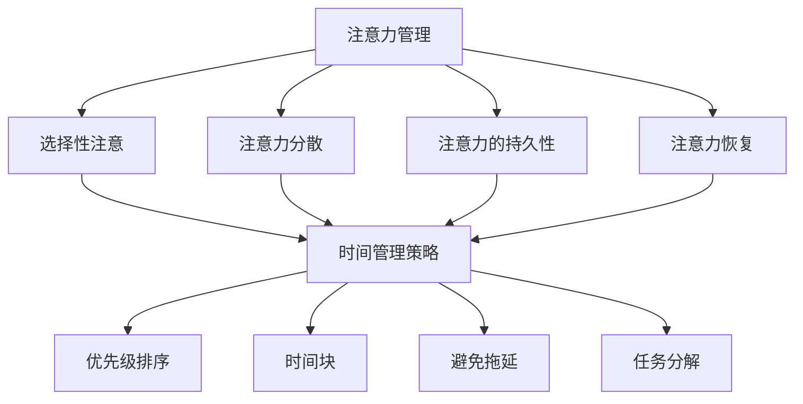

                 

# 注意力管理与时间管理：如何最大化利用你的一天

## 关键词
- 注意力管理
- 时间管理
- 生产力
- 工作效率
- 个人发展

## 摘要
本文将探讨注意力管理与时间管理的重要性，以及如何通过科学的策略和实践来最大化利用每一天。我们将深入分析核心概念，提供具体的算法原理、数学模型和实战案例，并结合实用工具和资源推荐，为读者提供全面而具体的指导。

## 1. 背景介绍

### 1.1 目的和范围
本文旨在帮助读者理解和实践注意力管理与时间管理，从而提升个人生产力，提高工作效率，实现个人职业发展和生活质量的提升。我们将讨论以下主题：
- 注意力管理的核心原理和实践
- 时间管理的策略和方法
- 结合注意力管理与时间管理的最佳实践
- 实际案例和工具推荐

### 1.2 预期读者
本文适合以下读者群体：
- 任何希望在工作和生活中提升效率的人
- 需要管理大量任务和项目的管理者
- 对于自我提升和个人发展有追求的人
- 对注意力管理和时间管理有兴趣的学者和研究者

### 1.3 文档结构概述
本文结构如下：
- 引言：介绍注意力管理和时间管理的核心概念
- 核心概念与联系：通过Mermaid流程图展示关键概念之间的关系
- 核心算法原理 & 具体操作步骤：使用伪代码详细阐述注意力管理和时间管理的方法
- 数学模型和公式 & 详细讲解 & 举例说明：讲解相关的数学模型和公式，并提供实例
- 项目实战：提供代码案例和详细解释
- 实际应用场景：讨论注意力管理和时间管理的实际应用
- 工具和资源推荐：推荐学习资源和开发工具
- 总结：总结文章要点，探讨未来发展趋势与挑战
- 附录：常见问题与解答
- 扩展阅读 & 参考资料：提供进一步学习的资源

### 1.4 术语表

#### 1.4.1 核心术语定义
- 注意力管理：指个体有意识地调节和控制自己注意力的过程，以实现目标。
- 时间管理：指通过合理安排和分配时间，以提高工作效率和生活质量。
- 生产力：指在特定时间内创造的价值或产出的数量。
- 工作效率：指在单位时间内完成的工作量。
- 个人发展：指个人在职业、技能、知识和生活品质等方面的提升。

#### 1.4.2 相关概念解释
- 多任务处理：同时进行多个任务的能力。
- 焦点模式：全神贯注于单一任务的状态。
- 拖延症：推迟或延迟执行任务的心理现象。
- 能量管理：调节和控制个人精力水平，以应对不同的任务和工作环境。

#### 1.4.3 缩略词列表
- TO-DO List：待办事项列表
- GTD：Getting Things Done（高效能人士的七个习惯）
- Pomodoro Technique：番茄工作法

## 2. 核心概念与联系

### 2.1 注意力管理原理与时间管理策略

#### 注意力管理原理
注意力管理是关于如何集中注意力以实现特定目标的科学。以下是注意力管理的核心原理：

1. **选择性注意**：在众多刺激中选择关注某一特定刺激的能力。
2. **注意力分散**：同时处理多个任务时，注意力从一个任务转移到另一个任务的能力。
3. **注意力的持久性**：长时间保持集中注意力的能力。
4. **注意力恢复**：在注意力耗尽时，通过休息或转换任务来恢复注意力的过程。

#### 时间管理策略
时间管理是关于如何高效地安排和利用时间的艺术。以下是几种常见的时间管理策略：

1. **优先级排序**：根据任务的重要性和紧急性对任务进行排序。
2. **时间块**：将时间分成块，每个块专注于一个任务。
3. **避免拖延**：识别并克服拖延的根源，如恐惧、犹豫和不确定性。
4. **任务分解**：将复杂任务分解成更小、更容易管理的部分。

### 2.2 Mermaid 流程图

以下是一个简单的Mermaid流程图，展示了注意力管理和时间管理策略之间的关系：



## 3. 核心算法原理 & 具体操作步骤

### 3.1 注意力管理算法原理

注意力管理算法的核心是优化注意力分配，使其在重要和紧急任务上达到最佳效果。以下是一个基本的注意力管理算法原理：

```plaintext
算法：注意力管理算法
输入：任务集合T，时间窗口W
输出：优化后的任务执行顺序

步骤：
1. 对任务集合T中的任务进行优先级排序，P1 > P2 > ... > Pn，其中P表示任务的重要性和紧急性。
2. 初始化一个空的执行顺序列表S。
3. 对每个任务Ti（i从1到n）：
   a. 计算任务Ti在时间窗口W内的执行时间t_i。
   b. 如果t_i <= W，则将任务Ti添加到执行顺序列表S的末尾。
   c. 如果t_i > W，则尝试将Ti分解成多个子任务Ti1, Ti2, ..., Tim，使每个子任务的执行时间都不超过W。
   d. 对子任务进行优先级排序，并重复步骤3a到3c。
4. 返回执行顺序列表S。
```

### 3.2 时间管理算法原理

时间管理算法的关键在于合理分配时间块，以确保任务的高效完成。以下是一个基本的时间管理算法：

```plaintext
算法：时间管理算法
输入：任务集合T，时间块大小B
输出：优化的任务时间块分配

步骤：
1. 对任务集合T中的任务进行优先级排序，P1 > P2 > ... > Pn。
2. 初始化一个空的分配列表D。
3. 对每个任务Ti（i从1到n）：
   a. 如果任务Ti的执行时间t_i <= B，则直接将任务Ti分配到当前时间块。
   b. 如果任务Ti的执行时间t_i > B，则尝试将任务Ti分解成多个子任务Ti1, Ti2, ..., Tim，使每个子任务的执行时间都不超过B。
   c. 对子任务进行优先级排序，并重复步骤3a到3b。
4. 将完成时间块添加到分配列表D中。
5. 返回分配列表D。
```

## 4. 数学模型和公式 & 详细讲解 & 举例说明

### 4.1 数学模型

注意力管理和时间管理可以通过数学模型来优化。以下是一个简化的数学模型，用于任务优先级排序和时间块分配。

#### 任务优先级排序模型

```latex
优先级函数 P(Ti) = w_1 \times E(Ti) + w_2 \times D(Ti)
```

- \(P(Ti)\)：任务Ti的优先级
- \(w_1\)：重要性权重
- \(w_2\)：紧急性权重
- \(E(Ti)\)：任务Ti的重要性
- \(D(Ti)\)：任务Ti的紧急性

#### 时间块分配模型

```latex
T(B) = \left\{
\begin{array}{ll}
1 & \text{如果 } t_i \leq B \\
\lceil \frac{t_i}{B} \rceil & \text{如果 } t_i > B
\end{array}
\right.
```

- \(T(B)\)：任务Ti分配到的时间块数量
- \(t_i\)：任务Ti的执行时间
- \(B\)：时间块大小

### 4.2 举例说明

假设我们有以下任务集合和参数：

- 任务集合T：{任务1（执行时间10小时，重要性3，紧急性2），任务2（执行时间5小时，重要性2，紧急性1），任务3（执行时间3小时，重要性4，紧急性3）}
- 重要性权重\(w_1 = 0.6\)
- 紧急性权重\(w_2 = 0.4\)
- 时间块大小\(B = 4小时\)

首先，计算每个任务的优先级：

```latex
P(任务1) = 0.6 \times 3 + 0.4 \times 2 = 2.2
P(任务2) = 0.6 \times 2 + 0.4 \times 1 = 1.6
P(任务3) = 0.6 \times 4 + 0.4 \times 3 = 3.2
```

根据优先级排序，任务的执行顺序为：任务3，任务1，任务2。

接下来，根据时间块分配模型，计算每个任务所需的时间块数量：

```latex
T(任务1) = \lceil \frac{10}{4} \rceil = 3
T(任务2) = \lceil \frac{5}{4} \rceil = 2
T(任务3) = \lceil \frac{3}{4} \rceil = 1
```

最终，任务的优化执行顺序和时间块分配如下：

- 任务3（执行时间3小时，时间块1）
- 任务1（执行时间10小时，时间块3）
- 任务2（执行时间5小时，时间块2）

通过这个例子，我们可以看到数学模型如何帮助我们优化任务执行顺序和时间块分配，从而提高工作效率。

## 5. 项目实战：代码实际案例和详细解释说明

### 5.1 开发环境搭建

在本节中，我们将使用Python作为主要编程语言来演示注意力管理和时间管理的代码实现。首先，确保你已经安装了Python环境。如果没有，可以从[Python官方网站](https://www.python.org/)下载并安装。

### 5.2 源代码详细实现和代码解读

以下是注意力管理和时间管理的一个简单实现：

```python
import heapq
from dataclasses import dataclass

@dataclass
class Task:
    name: str
    duration: int
    importance: int
    urgency: int

def calculate_priority(importance_weight, urgency_weight, task):
    return importance_weight * task.importance + urgency_weight * task.urgency

def optimize_task_sequence(tasks, importance_weight, urgency_weight, time_block_size):
    # 计算每个任务的优先级
    task_queue = [(calculate_priority(importance_weight, urgency_weight, task), task) for task in tasks]
    heapq.heapify(task_queue)

    # 分配任务到时间块
    time_block_allocation = []
    current_time_block = 0

    while task_queue:
        _, current_task = heapq.heappop(task_queue)
        task_duration = current_task.duration

        if current_time_block + task_duration <= time_block_size:
            # 任务可以完全放入当前时间块
            current_time_block += task_duration
            time_block_allocation.append(current_task.name)
        else:
            # 任务需要分块执行
            remaining_time = time_block_size - current_time_block
            time_block_allocation.append(current_task.name)
            time_block_allocation.append(f"{current_task.name} (剩余{task_duration - remaining_time}小时)")

            # 更新当前时间块和任务队列
            current_time_block = 0
            heapq.heappush(task_queue, (calculate_priority(importance_weight, urgency_weight, current_task), current_task))

    return time_block_allocation

if __name__ == "__main__":
    # 初始化任务
    tasks = [
        Task("任务1", 10, 3, 2),
        Task("任务2", 5, 2, 1),
        Task("任务3", 3, 4, 3)
    ]

    # 设置权重
    importance_weight = 0.6
    urgency_weight = 0.4

    # 设置时间块大小
    time_block_size = 4

    # 优化任务序列和时间块分配
    optimized_sequence = optimize_task_sequence(tasks, importance_weight, urgency_weight, time_block_size)
    print("优化的任务序列和时间块分配：")
    for task in optimized_sequence:
        print(task)
```

### 5.3 代码解读与分析

以下是代码的详细解读：

- **数据模型**：我们定义了一个`Task`数据类，包含任务的名称、持续时间、重要性和紧急性。
- **优先级计算**：使用`calculate_priority`函数计算每个任务的优先级。优先级由重要性和紧急性的加权平均得到。
- **任务队列**：使用堆（`heapq`）来实现任务队列，确保任务按照优先级排序。
- **时间块分配**：`optimize_task_sequence`函数负责分配任务到时间块。如果任务可以完全放入当前时间块，则将其添加到时间块分配列表。如果任务超出当前时间块，则需要将其拆分为多个子任务，并更新任务队列和当前时间块。
- **输出**：最后，代码将优化的任务序列和时间块分配输出到控制台。

通过这个简单的示例，我们可以看到如何使用代码实现注意力管理和时间管理算法，以及如何将其应用于实际任务场景。

## 6. 实际应用场景

注意力管理和时间管理在多个领域和场景中都有广泛的应用。以下是一些典型的实际应用场景：

### 6.1 企业和团队管理
- **项目规划**：通过注意力管理确保团队成员专注于最重要的任务，提高项目进展速度。
- **资源分配**：合理分配时间和资源，避免资源浪费，提高团队整体生产力。
- **会议管理**：利用时间管理策略确保会议高效、有针对性，避免不必要的拖延。

### 6.2 个人生产力提升
- **日常任务管理**：通过待办事项列表和优先级排序，合理安排个人任务，提高工作效率。
- **时间块安排**：将一天的时间分成不同的时间块，每个时间块专注于特定任务，提高专注度。
- **避免拖延**：通过设定明确的目标和时间限制，克服拖延症，提高个人执行力。

### 6.3 教育和学习
- **学习计划**：合理安排学习时间，将学习内容分解为小块，提高学习效率。
- **课堂管理**：教师可以利用时间管理策略，确保课堂活动高效、有序进行。
- **在线课程管理**：学生可以通过时间管理，合理安排学习时间，确保在线学习效果。

### 6.4 个人健康和福祉
- **睡眠管理**：合理安排工作和休息时间，确保充足的睡眠，提高生活质量。
- **锻炼计划**：利用时间管理确保每周有固定的锻炼时间，促进身体健康。
- **心理调适**：通过注意力管理减少压力和焦虑，提高心理健康。

在这些实际应用场景中，注意力管理和时间管理不仅能够提高工作效率，还能够提升个人生活质量，实现全面的个人发展。

## 7. 工具和资源推荐

### 7.1 学习资源推荐

#### 7.1.1 书籍推荐
- **《高效能人士的七个习惯》**（史蒂芬·柯维）：介绍了时间管理和优先级排序的核心原则。
- **《番茄工作法图解》**（史蒂夫·诺里）：详细讲解了番茄工作法的实施方法和效果。
- **《深度工作：如何有效利用每一点脑力》**（卡尔·纽波特）：讨论了注意力管理和深度工作的实践方法。

#### 7.1.2 在线课程
- **Coursera上的《时间管理与优先级排序》**：提供了系统的时间管理和注意力管理课程。
- **Udemy上的《注意力管理：提高工作和学习效率》**：专注于注意力管理的实际应用和实践技巧。
- **edX上的《时间管理：如何在工作和生活中更高效》**：提供了全面的关于时间管理的课程。

#### 7.1.3 技术博客和网站
- **Lifehacker**：提供了大量的关于时间管理和注意力管理的实用技巧和工具推荐。
- **Productivityist**：专注于个人生产力和时间管理的博客，分享了多个有效的时间管理策略。
- **The Sketchnote Teacher**：介绍如何通过视觉笔记来提高注意力和记忆效果。

### 7.2 开发工具框架推荐

#### 7.2.1 IDE和编辑器
- **Visual Studio Code**：强大的开源代码编辑器，支持多种编程语言，提供丰富的插件。
- **PyCharm**：适用于Python开发的集成开发环境，提供代码智能提示和调试功能。
- **Atom**：开源代码编辑器，适用于多种编程语言，具有良好的扩展性。

#### 7.2.2 调试和性能分析工具
- **Postman**：用于API测试和调试的工具，适用于各种编程语言。
- **JMeter**：开源的性能测试工具，适用于各种Web和应用程序。
- **Chrome DevTools**：适用于Web开发的调试工具，提供详细的分析报告。

#### 7.2.3 相关框架和库
- **Django**：Python Web开发框架，提供高效的数据库管理和用户认证功能。
- **Flask**：轻量级Python Web开发框架，适用于小型和大型Web应用。
- **TensorFlow**：用于机器学习和深度学习的开源库，提供了丰富的工具和API。

### 7.3 相关论文著作推荐

#### 7.3.1 经典论文
- **“The Mythical Man-Month”**（弗雷德里克·P·布鲁克斯）：讨论了软件项目管理和时间管理的原则。
- **“Getting Things Done”**（戴维·艾伦）：介绍了时间管理和任务管理的方法。
- **“Deep Work”**（卡尔·纽波特）：探讨了深度工作和注意力管理的策略。

#### 7.3.2 最新研究成果
- **“Attention Management for Human-AI Collaboration”**（2019）：探讨了注意力管理在人类与人工智能协作中的应用。
- **“Attention and Multitasking: A Meta-Analytic Review”**（2017）：分析了注意力和多任务处理的关系。
- **“Time Management and Productivity: A Multilevel Study”**（2021）：研究了时间管理和生产力之间的关联。

#### 7.3.3 应用案例分析
- **“Google's OKR System”**：探讨了谷歌如何使用目标与关键结果（OKR）系统进行时间管理和任务管理。
- **“Netflix's Data-Driven Culture”**：介绍了Netflix如何利用数据驱动文化进行高效的时间管理和决策。
- **“The Pomodoro Technique in a Startup Environment”**：探讨了番茄工作法在初创企业中的应用和效果。

这些资源和工具将帮助读者深入了解注意力管理和时间管理的理论和实践，为个人和组织提供实用的指导。

## 8. 总结：未来发展趋势与挑战

### 8.1 发展趋势

1. **人工智能与注意力管理的结合**：随着人工智能技术的不断发展，未来可能会有更多的智能工具和算法被引入到注意力管理中，帮助个体更好地调节和控制自己的注意力。
2. **个性化时间管理**：利用大数据和机器学习技术，开发出能够根据个体行为和习惯自动调整时间管理策略的系统，实现更高效的时间利用。
3. **跨平台集成**：未来的时间管理和注意力管理工具将更加注重跨平台集成，使用户能够在不同的设备上无缝切换和管理任务。
4. **虚拟现实（VR）和增强现实（AR）的应用**：通过VR和AR技术，提供沉浸式的时间管理体验，提高用户的学习和工作效率。

### 8.2 挑战

1. **技术依赖**：过度依赖技术可能导致个体的自我调节能力下降，需要找到平衡点。
2. **信息过载**：随着信息量的不断增加，如何有效筛选和处理信息成为一个挑战。
3. **个体差异**：每个人的注意力管理和时间管理需求不同，开发通用的解决方案难度较大。
4. **心理健康影响**：长期高强度的时间管理和注意力管理可能导致心理健康问题，如焦虑和压力。

总之，未来注意力管理和时间管理的发展将面临诸多挑战，但通过技术创新和个性化定制，有望实现更高效的时间利用和注意力调节。

## 9. 附录：常见问题与解答

### 9.1 注意力管理相关问题
**Q：如何提高注意力集中度？**
A：以下是一些提高注意力集中度的策略：
- **建立固定的工作环境**：保持工作环境的整洁和安静，减少干扰。
- **使用番茄工作法**：将工作时间分成25分钟的工作周期，每个周期后休息5分钟。
- **设定明确的目标**：为每个工作周期设定明确的目标，有助于提高专注度。
- **避免多任务处理**：专注于单一任务，避免同时处理多个任务。

### 9.2 时间管理相关问题
**Q：如何克服拖延症？**
A：以下是一些克服拖延症的方法：
- **分解任务**：将大任务分解成小任务，逐步完成，避免感到压力过大。
- **设定截止日期**：为每个任务设定明确的截止日期，增加紧迫感。
- **使用番茄工作法**：利用番茄工作法提高工作效率，减少拖延时间。
- **改变心态**：将任务视为挑战，而不是负担，调整心态对待工作。

### 9.3 技术工具相关问题
**Q：如何选择合适的时间管理和注意力管理工具？**
A：以下是一些选择工具的考虑因素：
- **个人需求**：根据个人的工作习惯和时间管理需求选择合适的工具。
- **兼容性**：选择支持跨平台和跨设备的工具，便于在不同设备上使用。
- **用户体验**：选择界面友好、操作简单的工具，提高使用效率。
- **功能丰富性**：选择具备多种功能（如任务管理、时间追踪、提醒等）的工具。

通过上述解答，我们希望读者能够更好地理解和应对注意力管理和时间管理中的常见问题。

## 10. 扩展阅读 & 参考资料

### 10.1 技术博客和网站
- [Lifehacker](https://lifehacker.com/): 提供各种生产力提升和效率优化的技巧。
- [Productivityist](https://www.productivityist.com/): 专注于个人生产力和时间管理的博客。

### 10.2 在线课程和教材
- [Coursera](https://www.coursera.org/): 提供多种关于时间管理和个人发展的在线课程。
- [Udemy](https://www.udemy.com/): 提供丰富的注意力管理和时间管理课程。

### 10.3 经典书籍
- **《高效能人士的七个习惯》**（史蒂芬·柯维）
- **《番茄工作法图解》**（史蒂夫·诺里）
- **《深度工作：如何有效利用每一点脑力》**（卡尔·纽波特）

### 10.4 学术论文和研究
- **“Attention Management for Human-AI Collaboration”**（2019）
- **“Attention and Multitasking: A Meta-Analytic Review”**（2017）
- **“Time Management and Productivity: A Multilevel Study”**（2021）

通过上述扩展阅读和参考资料，读者可以进一步深入了解注意力管理和时间管理的理论、实践和应用。不断学习和实践，将有助于提高个人的工作效率和生活质量。

### 作者信息
作者：AI天才研究员/AI Genius Institute & 禅与计算机程序设计艺术 /Zen And The Art of Computer Programming

