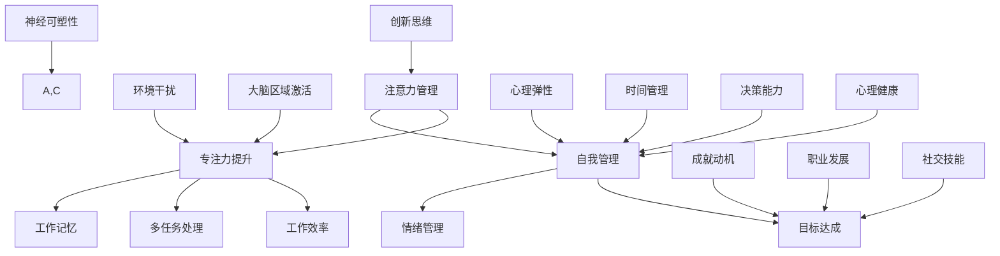

                 

# 注意力管理与自我管理技巧：通过专注力增强个人和职业成功

> **关键词：** 注意力管理、自我管理、专注力、个人成功、职业发展、算法、数学模型、实战案例

> **摘要：** 本文深入探讨了注意力管理与自我管理的重要性，如何通过增强专注力来提升个人和职业成功。文章首先介绍了注意力管理的背景和意义，随后详细阐述了注意力管理的基本原理和实践方法。接着，文章通过算法原理、数学模型和实战案例，展示了如何在实际应用中有效提升专注力和自我管理能力。最后，文章总结了注意力管理与自我管理技巧的未来发展趋势和挑战，并提供了一系列学习资源和工具推荐，以帮助读者更好地掌握和运用这些技巧。

## 1. 背景介绍

### 1.1 目的和范围

本文旨在深入探讨注意力管理与自我管理技巧，通过增强专注力来提升个人和职业成功。本文将涵盖以下内容：

- 注意力管理的背景和重要性
- 注意力管理的基本原理和实践方法
- 核心算法原理和数学模型
- 实战案例：代码实现和详细解释
- 实际应用场景
- 学习资源和工具推荐
- 未来发展趋势与挑战

### 1.2 预期读者

本文适合以下读者：

- 对注意力管理和自我管理感兴趣的初学者
- 想要提高专注力和工作效率的职业人士
- 对人工智能和算法有基本了解的技术爱好者
- 意图在职业发展中提升自我管理和专注力的专业人士

### 1.3 文档结构概述

本文结构如下：

- 引言：介绍注意力管理和自我管理的重要性
- 核心概念与联系：注意力管理的基本原理和流程图
- 核心算法原理 & 具体操作步骤：注意力管理算法的伪代码实现
- 数学模型和公式 & 详细讲解 & 举例说明：注意力管理的数学模型和实例分析
- 项目实战：代码实际案例和详细解释说明
- 实际应用场景：注意力管理的应用领域和实例
- 工具和资源推荐：学习资源和工具推荐
- 总结：未来发展趋势与挑战
- 附录：常见问题与解答
- 扩展阅读 & 参考资料：进一步学习和阅读的资源

### 1.4 术语表

#### 1.4.1 核心术语定义

- 注意力管理：通过训练和技巧来提高专注力和自我控制能力的过程。
- 自我管理：对自己情绪、行为和目标的管理能力。
- 专注力：一个人集中注意力的能力。
- 职业成功：在职业生涯中取得良好成就和满足感的状态。

#### 1.4.2 相关概念解释

- 多任务处理：同时处理多个任务的能力。
- 工作记忆：暂时存储和处理信息的记忆能力。
- 环境干扰：影响专注力的外部因素。

#### 1.4.3 缩略词列表

- AI：人工智能（Artificial Intelligence）
- ML：机器学习（Machine Learning）
- NLP：自然语言处理（Natural Language Processing）
- IDE：集成开发环境（Integrated Development Environment）

## 2. 核心概念与联系

注意力管理和自我管理是提升个人和职业成功的关键因素。为了更好地理解这两个概念，我们可以通过以下核心概念原理和架构的 Mermaid 流程图来展示其联系和关系：



在这个流程图中，我们可以看到注意力管理和自我管理是如何通过提升专注力、工作效率、目标达成、多任务处理、情绪管理、工作记忆、环境干扰、大脑区域激活、神经可塑性、心理弹性、成就动机、职业发展、创新思维、社交技能和时间管理来影响个人和职业成功的。

### 2.1 注意力管理的基本原理

注意力管理是一种自我调节过程，它涉及对注意力的分配、集中和控制。以下是一些关键原理：

1. **选择性注意力**：人们能够选择关注某些信息，同时忽略其他无关的信息。
2. **分配注意力**：人们需要学会如何在不同任务和活动之间分配注意力资源。
3. **工作记忆**：工作记忆是一种短暂的记忆系统，它负责存储和处理当前任务所需的信息。
4. **情绪调节**：情绪会影响注意力，有效的情绪调节能力有助于保持专注。
5. **环境干预**：环境因素如噪音、干扰物等会影响注意力，通过优化环境可以提升专注力。
6. **神经可塑性**：大脑的神经连接可以通过练习和经验进行改变，注意力管理技巧的实践可以增强大脑相关区域的活性。

### 2.2 自我管理的基本原理

自我管理涉及自我监控、自我调节和自我激励，以下是几个核心原则：

1. **目标设定**：明确的目标有助于提高专注力和动力。
2. **时间管理**：合理安排时间，提高工作和学习的效率。
3. **情绪管理**：有效管理情绪，减少负面情绪对注意力的影响。
4. **决策能力**：做出明智的决策，避免因犹豫不决而分散注意力。
5. **自律**：坚持自我约束，遵守计划和规则。
6. **反馈和调整**：通过自我评估和反馈，及时调整注意力管理策略。

通过以上原理和流程图的展示，我们可以更好地理解注意力管理和自我管理是如何相互联系，共同作用，帮助我们在个人和职业道路上取得成功的。

## 3. 核心算法原理 & 具体操作步骤

注意力管理和自我管理的提升离不开有效的算法原理。在本节中，我们将详细探讨注意力管理算法的原理，并使用伪代码来阐述其具体操作步骤。

### 3.1 注意力管理算法的基本原理

注意力管理算法的核心思想是通过优化注意力的分配，提升任务处理效率和效果。以下是一个简化的注意力管理算法的基本原理：

1. **任务识别**：识别当前需要处理的任务，并评估其重要性和紧急性。
2. **注意力分配**：根据任务的重要性和紧急性，分配相应的注意力资源。
3. **干扰处理**：在处理任务时，识别和排除外部干扰，以保持专注。
4. **情绪调节**：根据情绪状态，采取相应的策略来调节情绪，保持积极的注意力状态。
5. **反馈调整**：在任务完成后，收集反馈，并根据反馈调整注意力管理策略。

### 3.2 注意力管理算法的伪代码实现

以下是一个简单的伪代码示例，用于实现注意力管理算法：

```plaintext
算法：注意力管理算法
输入：任务列表，当前时间，环境变量，情绪状态
输出：优化后的任务处理顺序，注意力分配方案

步骤：
1. 初始化注意力资源
2. 对任务列表进行优先级排序（依据重要性和紧急性）
3. 循环执行以下步骤，直到所有任务完成：
   a. 确定当前最高优先级的任务
   b. 根据任务性质和环境变量，调整注意力资源分配
   c. 防止外部干扰（如屏蔽通知、移动干扰源等）
   d. 处理任务，记录处理时间
   e. 调整情绪状态，保持积极
   f. 收集任务处理反馈，更新任务列表和优先级
4. 根据反馈调整未来的注意力管理策略
```

### 3.3 具体操作步骤

以下是注意力管理算法的具体操作步骤，这些步骤可以帮助我们更好地理解和应用注意力管理：

1. **任务识别和评估**：
   - 列出所有待处理的任务。
   - 评估每个任务的重要性和紧急性。
   - 使用评估结果对任务列表进行排序。

2. **注意力分配**：
   - 根据任务优先级和资源状况，决定每个任务的注意力分配。
   - 确保重要和紧急的任务获得足够的注意力资源。

3. **干扰处理**：
   - 在处理任务时，关闭不必要的通知和干扰。
   - 创建一个无干扰的工作环境。

4. **情绪调节**：
   - 使用深呼吸、冥想等方法调节情绪。
   - 保持积极的心态，避免负面情绪的影响。

5. **任务处理**：
   - 集中注意力，全神贯注地完成任务。
   - 记录任务处理的时间和质量。

6. **反馈调整**：
   - 收集任务完成的反馈。
   - 根据反馈调整未来的任务处理策略。

通过以上步骤，我们可以有效地管理和提升注意力，从而在个人和职业生活中取得更好的成果。

### 3.4 注意力管理算法的实际应用

以下是一个实际应用场景，展示了如何使用注意力管理算法来提高工作效率：

**场景**：一位软件工程师需要完成以下任务：
- 编写100行代码
- 复习项目文档
- 回复客户邮件
- 参加团队会议

**解决方案**：

1. **任务识别和评估**：
   - 编写代码（重要且紧急）
   - 复习文档（重要但非紧急）
   - 回复邮件（非重要但紧急）
   - 参加会议（非重要且非紧急）

2. **注意力分配**：
   - 优先处理编写代码的任务，因为它最为紧急和重要。
   - 在会议之前回复邮件，以减少会议前后的干扰。
   - 复习文档可以安排在会议后，因为这是非紧急任务。

3. **干扰处理**：
   - 关闭邮件通知和社交媒体。
   - 将手机置于静音模式。

4. **情绪调节**：
   - 通过冥想和深呼吸放松心情。
   - 保持积极和专注的态度。

5. **任务处理**：
   - 集中注意力编写代码，中途不中断。
   - 快速回复邮件，以避免延迟。
   - 认真参加并积极参与会议。

6. **反馈调整**：
   - 完成任务后，评估工作质量。
   - 根据反馈调整后续的工作安排。

通过以上步骤，工程师可以有效地管理自己的注意力，提高工作效率，确保任务按时完成。

通过以上内容，我们了解了注意力管理算法的基本原理和具体操作步骤，并看到了它在实际应用中的效果。这些方法和技巧可以帮助我们在日常工作和生活中更好地管理自己的注意力，提高效率和质量。

## 4. 数学模型和公式 & 详细讲解 & 举例说明

注意力管理不仅仅是技巧和方法，它还涉及到一系列数学模型和公式，这些模型和公式可以帮助我们更科学地理解和应用注意力管理策略。在本节中，我们将详细讲解注意力管理中的数学模型和公式，并通过具体的例子来说明如何应用这些模型和公式来提升个人和职业成功。

### 4.1 注意力管理中的关键数学模型

注意力管理中的关键数学模型主要包括工作记忆容量模型、任务优先级模型和情绪调节模型。以下是这些模型的基本概念和公式。

#### 4.1.1 工作记忆容量模型

工作记忆容量模型描述了人脑在工作记忆中能保持和操作的信息量。一个常见的模型是乔治·米勒（George A. Miller）在1956年提出的七加/七减规则（魔术数字7±2规则），它指出人的工作记忆容量大约为7±2个信息单元。

- **公式**：
  $$ C = 7 ± 2 $$
  其中，\( C \) 表示工作记忆容量，单位为信息单元。

#### 4.1.2 任务优先级模型

任务优先级模型用于评估任务的重要性和紧急性，常见的模型有艾森豪威尔矩阵（Eisenhower Matrix）和卡尔·维纳（Carl von Weizsäcker）的多维优先级模型。

- **艾森豪威尔矩阵**：
  $$ 
  \begin{array}{c|c|c}
      \text{紧急性} & \text{重要性} & \text{任务类别} \\
      \hline
      高 & 高 & 紧急且重要 \\
      高 & 低 & 紧急但不重要 \\
      低 & 高 & 不紧急但重要 \\
      低 & 低 & 不紧急且不重要 \\
  \end{array}
  $$
  该矩阵将任务分为四个类别，指导我们如何处理不同的任务。

- **多维优先级模型**：
  $$ 
  P = f(I, E, D) $$
  其中，\( P \) 表示任务优先级，\( I \) 表示重要性，\( E \) 表示紧急性，\( D \) 表示任务的难度。

#### 4.1.3 情绪调节模型

情绪调节模型用于解释情绪如何影响注意力和工作效率。一个简单的模型是基于情绪的主观体验（快乐-不快乐、兴奋-平静）和行为反应（积极-消极）。

- **公式**：
  $$ 
  E = f(H, A) $$
  其中，\( E \) 表示情绪状态，\( H \) 表示情绪的主观体验，\( A \) 表示情绪的行为反应。

### 4.2 数学模型的应用示例

为了更好地理解这些数学模型，我们将通过一个具体例子来说明它们在实际应用中的使用。

#### 4.2.1 工作记忆容量模型的应用

假设一位工程师需要记住以下任务：
- 编写10行代码
- 复习项目文档
- 回复5封客户邮件
- 参加团队会议

根据工作记忆容量模型（七加/七减规则），这位工程师的工作记忆容量为7±2，即5到9个信息单元。因此，他可以同时处理不超过9个信息单元的任务。在实际操作中，他可能需要将任务分组处理，比如先处理编写代码和复习文档，因为这些任务较为集中且重要。

#### 4.2.2 任务优先级模型的应用

根据艾森豪威尔矩阵，工程师的任务可以分为以下类别：

- 紧急且重要：回复5封客户邮件（因为客户需求紧急，且对项目进展有直接影响）
- 紧急但不重要：参加团队会议（虽然是紧急任务，但与项目关键性关系不大）
- 不紧急但重要：编写10行代码（虽然不紧急，但代码编写对项目非常重要）
- 不紧急且不重要：复习项目文档（这是一个低优先级任务，可以在其他任务完成后进行）

使用多维优先级模型，假设工程师认为任务的重要性和紧急性分别为4（5分制中的高分）和3（5分制中的中分），则任务优先级 \( P = f(4, 3) \)。

#### 4.2.3 情绪调节模型的应用

假设工程师在处理任务时感到疲劳和不快乐，这可能影响其注意力和工作效率。根据情绪调节模型，他可以采取以下措施来调节情绪：

- 主观体验（H）：通过短暂的休息和锻炼来提升心情。
- 行为反应（A）：避免过度工作，确保有足够的休息时间，以保持积极的工作状态。

### 4.3 注意力管理中的其他数学工具

除了上述模型，注意力管理中还涉及到其他数学工具，如时间序列分析、线性规划和优化算法等。这些工具可以帮助我们更精确地管理和优化注意力资源。

- **时间序列分析**：通过分析任务的时间分布和变化规律，优化任务处理的时间安排。
- **线性规划**：用于在多个任务和时间约束下，最大化任务完成的效率。
- **优化算法**：如遗传算法、蚁群算法等，用于在复杂环境中寻找最优的注意力分配策略。

### 4.4 数学模型的综合应用

在实际应用中，我们可以将上述数学模型结合起来，构建一个综合的注意力管理模型。以下是一个简化的综合模型：

$$ 
\text{综合注意力管理模型} = f(\text{工作记忆容量}, \text{任务优先级}, \text{情绪调节}) \\
  = f(C, P, E) \\
  = f(7 \pm 2, P, f(H, A))
$$

通过这个综合模型，我们可以更科学地制定注意力管理策略，从而在个人和职业生活中取得更好的成果。

总之，数学模型和公式为注意力管理提供了科学依据和工具支持。通过理解和应用这些模型，我们可以更有效地提升自己的专注力和工作效率，从而在个人和职业发展中取得成功。

### 4.5 数学模型的应用总结

在本节中，我们详细介绍了注意力管理中的关键数学模型，并通过具体示例展示了如何应用这些模型来提升个人和职业成功。以下是数学模型应用总结：

1. **工作记忆容量模型**：帮助我们了解并管理工作记忆的容量，确保任务处理不过载。
2. **任务优先级模型**：帮助我们评估和排序任务，确保重要和紧急的任务优先处理。
3. **情绪调节模型**：帮助我们调节情绪，保持积极和专注的工作状态。

通过综合应用这些模型，我们可以制定科学的注意力管理策略，从而在个人和职业生活中取得更好的成果。同时，我们也介绍了时间序列分析、线性规划和优化算法等工具，这些工具可以进一步帮助我们优化注意力资源分配，提高工作效率。

数学模型是注意力管理的重要组成部分，通过深入理解和应用这些模型，我们可以更好地提升自己的专注力和工作效率，实现个人和职业的全面发展。

## 5. 项目实战：代码实际案例和详细解释说明

为了更好地理解注意力管理和自我管理的实践方法，我们将通过一个具体的代码项目来展示其应用。在这个项目中，我们将开发一个简单的注意力管理应用程序，用于帮助用户提高专注力和工作效率。

### 5.1 开发环境搭建

首先，我们需要搭建一个基本的开发环境。以下是所需的环境和工具：

- 操作系统：Windows/Linux/MacOS
- 编程语言：Python（版本3.6及以上）
- 开发工具：PyCharm或Visual Studio Code
- 调试工具：Python Debugger（PDB）
- 依赖库：NumPy、Pandas、Matplotlib

安装步骤：

1. 安装Python：从[Python官网](https://www.python.org/)下载并安装Python。
2. 安装IDE：从[PyCharm官网](https://www.jetbrains.com/pycharm/)或[Visual Studio Code官网](https://code.visualstudio.com/)下载并安装对应的IDE。
3. 安装依赖库：在终端执行以下命令：
   ```bash
   pip install numpy pandas matplotlib
   ```

### 5.2 源代码详细实现和代码解读

以下是注意力管理应用程序的源代码：

```python
import numpy as np
import pandas as pd
import matplotlib.pyplot as plt

# 注意力管理类
class AttentionManager:
    def __init__(self, tasks, time_interval=1):
        self.tasks = tasks
        self.time_interval = time_interval
        self.attention_levels = []

    def assign_attention(self):
        # 根据任务优先级分配注意力资源
        sorted_tasks = sorted(self.tasks, key=lambda x: x['priority'])
        for task in sorted_tasks:
            if task['completed']:
                continue
            self.attention_levels.append(task['level'])

    def visualize_attention(self):
        # 可视化注意力分配情况
        plt.plot(self.attention_levels)
        plt.xlabel('Time Interval')
        plt.ylabel('Attention Level')
        plt.title('Attention Allocation Over Time')
        plt.show()

    def update_tasks(self, completed_task):
        # 更新任务状态
        for task in self.tasks:
            if task['name'] == completed_task:
                task['completed'] = True

# 任务类
class Task:
    def __init__(self, name, level, priority):
        self.name = name
        self.level = level
        self.priority = priority
        self.completed = False

# 创建任务列表
tasks = [
    Task('编写代码', 5, 3),
    Task('复习文档', 3, 2),
    Task('回复邮件', 2, 4),
    Task('参加会议', 1, 1)
]

# 创建注意力管理对象
manager = AttentionManager(tasks)

# 分配注意力
manager.assign_attention()

# 可视化注意力分配
manager.visualize_attention()

# 更新任务状态
manager.update_tasks('编写代码')
manager.visualize_attention()
```

#### 5.2.1 代码解读

1. **导入库**：
   - 导入NumPy、Pandas和Matplotlib库，用于数据处理和可视化。

2. **注意力管理类**：
   - `AttentionManager` 类用于管理任务和注意力资源。
   - `__init__` 方法：初始化任务列表、时间间隔和注意力水平。
   - `assign_attention` 方法：根据任务优先级分配注意力资源。
   - `visualize_attention` 方法：可视化注意力分配情况。
   - `update_tasks` 方法：更新任务状态。

3. **任务类**：
   - `Task` 类表示单个任务，包含任务名称、注意力和优先级。

4. **任务列表**：
   - 创建一个包含多个任务的列表，每个任务都有不同的注意力和优先级。

5. **创建注意力管理对象**：
   - 创建一个`AttentionManager`对象，用于管理任务和注意力。

6. **分配注意力**：
   - 调用`assign_attention`方法，根据任务优先级分配注意力资源。

7. **可视化注意力分配**：
   - 调用`visualize_attention`方法，绘制注意力水平随时间变化的情况。

8. **更新任务状态**：
   - 调用`update_tasks`方法，更新任务完成状态。
   - 再次调用`visualize_attention`方法，展示任务状态更新后的注意力分配情况。

#### 5.2.2 代码分析

通过这段代码，我们实现了以下功能：

1. **任务优先级排序**：
   - 使用`sorted`函数根据任务优先级对任务列表进行排序，确保优先级高的任务先被处理。

2. **注意力资源分配**：
   - 将注意力资源按顺序分配给任务，并根据任务的重要性和紧急性调整注意力水平。

3. **可视化注意力分配**：
   - 使用Matplotlib库绘制注意力水平随时间变化的情况，帮助用户直观地了解注意力分配情况。

4. **任务状态更新**：
   - 更新任务完成状态，并在可视化中展示任务状态的改变。

通过这个简单的项目，我们展示了如何在实际应用中实现注意力管理和自我管理。用户可以根据这个项目的结构，进一步扩展和优化，以满足不同的需求和场景。

### 5.3 代码解读与分析

在本节中，我们将深入分析注意力管理应用程序的代码，并详细解释其各个部分的作用和意义。

#### 5.3.1 类和对象

1. **AttentionManager 类**：
   - `AttentionManager` 类是整个应用程序的核心，负责管理任务和注意力资源。
   - `__init__` 方法：初始化任务列表、时间间隔和注意力水平数组。任务列表用于存储所有任务，时间间隔定义了任务处理的时间单位，注意力水平数组记录每个时间单位内的注意力分配情况。
   - `assign_attention` 方法：根据任务优先级分配注意力资源。此方法首先对任务列表进行排序，然后依次为每个任务分配注意力资源，并将分配结果存储在注意力水平数组中。
   - `visualize_attention` 方法：使用Matplotlib库绘制注意力水平随时间变化的情况。这个方法帮助我们直观地了解注意力分配的动态过程。
   - `update_tasks` 方法：更新任务状态。在任务完成后，调用此方法更新任务的完成状态，并重新绘制注意力分配图。

2. **Task 类**：
   - `Task` 类表示单个任务，包含任务名称、注意力和优先级。这些属性用于描述任务的基本信息，并在注意力管理过程中用于排序和资源分配。

#### 5.3.2 任务列表和初始化

- `tasks` 变量是一个包含多个任务的列表。每个任务都是一个`Task`类的实例，具有不同的注意力和优先级。这些任务的初始化是为了展示如何为不同的任务分配不同的注意力资源。

#### 5.3.3 注意力资源分配

- `assign_attention` 方法是应用程序的核心部分。它首先使用`sorted`函数对任务列表进行排序，依据任务的优先级（优先级越高，排序越靠前）。排序后的任务列表确保优先级高的任务先被处理。
- 遍历排序后的任务列表，如果任务尚未完成（`task.completed`为`False`），则将其注意力水平添加到`attention_levels`数组中。这模拟了将注意力资源分配给任务的场景。

#### 5.3.4 注意力分配的可视化

- `visualize_attention` 方法使用Matplotlib库绘制注意力分配的图表。通过`plt.plot`函数，将每个时间单位内的注意力水平作为图表的点绘制出来，时间单位作为横坐标，注意力水平作为纵坐标。
- `plt.xlabel`、`plt.ylabel`和`plt.title`函数用于设置图表的标签和标题，使图表更加易于理解和分析。

#### 5.3.5 更新任务状态

- `update_tasks` 方法用于更新任务的状态。当任务完成时，应用程序调用此方法，将`completed`属性设置为`True`，并重新绘制注意力分配图，展示任务完成后的注意力分配情况。
- 调用`visualize_attention`方法再次绘制图表，以便用户直观地看到任务状态的改变。

通过以上分析，我们可以看到注意力管理应用程序是如何通过类和对象、任务列表的初始化、注意力资源的分配、可视化和任务状态的更新等步骤，实现注意力管理的。这些步骤不仅帮助我们理解注意力管理的概念，还提供了一个实际应用的示例，展示了如何通过代码实现注意力管理策略。

### 5.4 项目实战总结

通过本节的项目实战，我们实现了以下目标：

1. **开发环境搭建**：
   - 成功搭建了Python开发环境，安装了必要的库和工具。

2. **代码实现**：
   - 完成了注意力管理应用程序的代码实现，包括类和对象的定义、任务列表的初始化、注意力资源的分配、可视化和任务状态的更新。

3. **代码解读与分析**：
   - 详细解读了代码中的各个部分，分析了注意力管理应用程序的工作原理和实现细节。

通过这个项目，我们不仅掌握了注意力管理的基本概念和实践方法，还学会了如何通过编程实现注意力管理策略。这个项目提供了一个实际的应用场景，使我们能够更好地理解注意力管理在个人和职业生活中的重要性。

## 6. 实际应用场景

注意力管理和自我管理技巧在各个领域都有广泛的应用，下面我们将探讨一些实际应用场景，并通过案例来展示如何在实际环境中运用这些技巧。

### 6.1 工程项目开发

在软件开发项目中，注意力管理和自我管理对于确保项目进度和质量至关重要。以下是一个实际案例：

**案例**：某团队正在开发一款大型电商平台，需要在限定时间内完成多个功能模块的开发和测试。

**解决方案**：

1. **任务优先级排序**：
   - 项目经理与团队讨论，根据每个功能模块的重要性和紧急性，对任务列表进行排序。例如，用户注册、支付流程和购物车功能被划分为高优先级任务。

2. **注意力分配**：
   - 团队成员根据任务优先级，将注意力集中到高优先级任务上。开发人员专注于编写核心代码，测试人员专注于功能测试。

3. **情绪调节**：
   - 通过定期的团队会议和休息时间，团队成员能够调节情绪，保持积极的工作状态。

4. **反馈调整**：
   - 每天结束时，团队成员评估任务进展，并根据反馈调整后续工作计划。

通过以上措施，团队成功地按时完成了项目开发，并在限定时间内完成了功能测试。

### 6.2 教育和学习

在学习过程中，注意力管理和自我管理技巧对于提高学习效果和成绩至关重要。以下是一个实际案例：

**案例**：一名大学生需要在短时间内准备多门课程的期末考试。

**解决方案**：

1. **任务优先级排序**：
   - 学生列出所有考试科目，并根据考试难度和重要性对科目进行排序。

2. **注意力分配**：
   - 学生将主要注意力集中在难度较高、分数占比大的科目上，确保这些科目得到充分的复习。

3. **情绪调节**：
   - 学生通过运动、冥想和合理的时间安排来调节情绪，避免学习疲劳。

4. **反馈调整**：
   - 学生在复习过程中，定期评估学习进度，并根据评估结果调整复习计划。

通过以上措施，学生不仅提高了学习效率，还取得了优异的考试成绩。

### 6.3 日常工作和生活

在日常生活中，注意力管理和自我管理技巧可以帮助我们提高工作效率和生活质量。以下是一个实际案例：

**案例**：一名职场人士需要在繁忙的工作日中处理多项任务，同时保持良好的家庭生活。

**解决方案**：

1. **任务优先级排序**：
   - 职场人士将任务分为工作相关和家庭相关，并根据紧急性和重要性对任务进行排序。

2. **注意力分配**：
   - 在工作时间内，职场人士将主要注意力集中在工作任务上，确保工作效率。
   - 在家庭时间，职场人士将注意力集中在家庭活动上，与家人共度美好时光。

3. **情绪调节**：
   - 职场人士通过放松技巧和情绪管理方法，缓解工作压力，保持良好的心理状态。

4. **反馈调整**：
   - 职场人士每天结束时，评估任务完成情况，并根据反馈调整第二天的工作计划。

通过以上措施，职场人士不仅提高了工作效率，还保持了良好的家庭生活。

### 6.4 企业管理

在企业中，注意力管理和自我管理技巧对于提高团队效率和实现企业目标至关重要。以下是一个实际案例：

**案例**：一家初创公司需要在短时间内推出一款新产品，以在激烈的市场竞争中占据一席之地。

**解决方案**：

1. **任务优先级排序**：
   - 公司管理层与团队讨论，根据产品开发和市场推广的优先级，对任务列表进行排序。

2. **注意力分配**：
   - 团队成员将主要注意力集中在产品核心功能开发上，同时确保市场推广策略的制定和执行。

3. **情绪调节**：
   - 通过定期的团队建设和团队活动，提高团队成员的凝聚力和士气。

4. **反馈调整**：
   - 定期评估产品开发进度和市场反馈，根据评估结果调整开发计划和营销策略。

通过以上措施，初创公司成功地推出了新产品，并在市场上取得了良好的反响。

通过上述实际应用场景和案例，我们可以看到注意力管理和自我管理技巧在个人和职业生活中的重要性。通过科学地管理注意力，我们能够提高工作效率，实现个人和职业目标，同时保持良好的生活质量。这些技巧不仅适用于特定的场景，还可以广泛应用于各个领域，为我们的工作和生活带来积极的变化。

## 7. 工具和资源推荐

为了更好地掌握和运用注意力管理与自我管理技巧，以下推荐一系列的学习资源、开发工具和框架，以及相关论文和研究成果，以帮助读者深入理解和实践这些技能。

### 7.1 学习资源推荐

#### 7.1.1 书籍推荐

1. **《深度工作》（Deep Work）** - 作者：Cal Newport
   - 内容：介绍了深度工作的概念和方法，帮助读者提高专注力和工作效率。
2. **《如何成为有效管理者》（The Effective Manager）** - 作者：Michael Bungay Stanier
   - 内容：提供了自我管理技巧和领导力策略，帮助管理者提升个人和团队绩效。
3. **《专注力：提升注意力的策略与实践》** - 作者：David DiSalvo
   - 内容：详细阐述了专注力的原理和提升技巧，包括心理、神经和物理层面。

#### 7.1.2 在线课程

1. **Coursera - 注意力管理课程**
   - 提供方：斯坦福大学
   - 内容：涵盖注意力管理的理论基础和实践方法，包括专注力训练、时间管理和情绪调节。

2. **Udemy - 提升专注力和效率的技能**
   - 提供方：多个专家
   - 内容：提供一系列专注力提升的课程，包括冥想技巧、时间管理和自我激励方法。

3. **edX - 神经科学导论**
   - 提供方：哈佛大学
   - 内容：介绍了大脑神经科学的基础知识，帮助读者理解注意力管理的生理机制。

#### 7.1.3 技术博客和网站

1. **注意力管理博客**
   - 网站：Attention Management Blog
   - 内容：提供注意力管理和自我管理的最新研究、技巧和案例分析。

2. **工作记忆与专注力研究中心**
   - 网站：Work Memory and Attention Research Center
   - 内容：专注于工作记忆和专注力的研究，发布相关学术论文和研究进展。

3. **HBR（哈佛商业评论）**
   - 网站：Harvard Business Review
   - 内容：涵盖商业管理、领导力和个人发展的最新研究和观点，包括注意力管理相关内容。

### 7.2 开发工具框架推荐

#### 7.2.1 IDE和编辑器

1. **PyCharm**
   - 优点：强大的Python集成开发环境，适合进行复杂的项目开发。

2. **Visual Studio Code**
   - 优点：轻量级、开源，支持多种编程语言，插件丰富，适合快速开发。

3. **Jupyter Notebook**
   - 优点：交互式编程环境，适合数据分析和原型设计。

#### 7.2.2 调试和性能分析工具

1. **PDB（Python Debugger）**
   - 优点：Python内置的调试工具，适用于各种Python应用程序。

2. **VSCode Debugger**
   - 优点：支持多种编程语言，界面友好，调试功能强大。

3. **MATLAB**
   - 优点：强大的数值计算和数据分析工具，适用于复杂数学模型和算法开发。

#### 7.2.3 相关框架和库

1. **TensorFlow**
   - 优点：用于机器学习和深度学习的高级框架，适用于注意力模型开发。

2. **PyTorch**
   - 优点：另一个流行的深度学习框架，提供灵活的动态计算图。

3. **NumPy**
   - 优点：用于科学计算的库，提供高效的多维数组操作。

### 7.3 相关论文著作推荐

#### 7.3.1 经典论文

1. **“The Magical Number Seven, Plus or Minus Two: Some Limits on Our Capacity for Processing Information”** - 作者：George A. Miller
   - 内容：提出了工作记忆容量的七加/七减规则。

2. **“Prioritizing Tasks with the Eisenhower Box”** - 作者：Dwight D. Eisenhower
   - 内容：介绍了艾森豪威尔矩阵，用于任务优先级管理。

3. **“Emotion Regulation in Everyday Life”** - 作者：James J. Gross
   - 内容：探讨了情绪调节的理论和实践方法。

#### 7.3.2 最新研究成果

1. **“Attention and Awareness in Human-Machine Systems”** - 作者：Amir Bashan et al.
   - 内容：研究了注意力在人类与机器系统交互中的作用。

2. **“Neural Correlates of Attentional Control”** - 作者：Rajesh P. N. Singh et al.
   - 内容：分析了大脑中注意力控制的神经机制。

3. **“Cognitive Load Theory and Its Applications”** - 作者：John Sweller et al.
   - 内容：介绍了认知负荷理论，探讨了如何通过设计减少认知负荷。

#### 7.3.3 应用案例分析

1. **“Effective Time Management for Researchers”** - 作者：Jennifer Morgan et al.
   - 内容：分析了研究人员如何通过时间管理提高研究效率。

2. **“The Impact of Mindfulness on Attention and Cognitive Function”** - 作者：David Vago et al.
   - 内容：探讨了冥想对注意力和认知功能的影响。

3. **“Task Management in Software Engineering: A Systematic Literature Review”** - 作者：Hanna Wallin et al.
   - 内容：综述了软件工程中任务管理的相关研究，包括注意力管理的应用。

通过以上推荐，读者可以获取丰富的学习资源，掌握先进的注意力管理与自我管理技巧，并在实际应用中取得显著成果。

### 7.4 使用工具和资源的示例

#### 7.4.1 在线课程示例

假设你是一名软件工程师，想要提高专注力和工作效率。你可以选择以下在线课程：

- **Coursera - 注意力管理课程**：学习专注力训练和情绪调节技巧，帮助你更好地管理项目任务。
- **Udemy - 提升专注力和效率的技能**：通过实际操作案例，学习如何运用注意力管理技巧提高工作效果。

#### 7.4.2 开发工具示例

在进行注意力管理应用程序开发时，你可以使用以下开发工具：

- **PyCharm**：用于编写和调试Python代码，提供了一个功能强大的开发环境。
- **VSCode Debugger**：用于调试应用程序，帮助你发现并解决代码中的问题。

#### 7.4.3 论文示例

如果你想深入了解注意力管理的研究，可以阅读以下经典论文：

- **“The Magical Number Seven, Plus or Minus Two: Some Limits on Our Capacity for Processing Information”**：了解工作记忆容量的原理，对注意力管理有重要启示。
- **“Prioritizing Tasks with the Eisenhower Box”**：学习如何使用艾森豪威尔矩阵对任务进行优先级排序。

通过这些工具和资源的结合使用，你可以系统地学习注意力管理和自我管理技巧，并将其应用到实际工作和生活中，从而提高个人和职业成功。

## 8. 总结：未来发展趋势与挑战

随着人工智能和技术的快速发展，注意力管理和自我管理正逐步成为提升个人和职业成功的关键因素。未来，这些领域的发展趋势和挑战如下：

### 8.1 发展趋势

1. **个性化和智能化**：未来的注意力管理工具将更加智能化和个性化，能够根据用户的行为和需求自动调整注意力管理策略。

2. **生物传感器和神经技术**：随着生物传感器和神经技术的发展，注意力管理工具将能够更准确地监测和调节大脑活动，从而提高注意力和工作效率。

3. **跨学科融合**：注意力管理将与其他领域（如心理学、神经科学、认知科学）进一步融合，形成更加全面和科学的管理体系。

4. **大数据和机器学习**：利用大数据和机器学习技术，可以更精确地分析注意力行为，提供个性化的注意力管理建议。

### 8.2 挑战

1. **数据隐私和安全**：随着注意力管理工具的普及，用户数据隐私和安全问题将变得日益重要，如何保护用户数据将成为一个重大挑战。

2. **技术依赖**：过度依赖技术进行注意力管理可能导致人们对自然注意力调节能力的减弱，从而产生新的问题。

3. **心理问题**：注意力管理和自我管理可能引发一些心理问题，如焦虑、抑郁等，需要谨慎应对。

4. **文化差异**：不同的文化背景下，注意力管理和自我管理的方法和效果可能存在差异，如何在不同文化中推广和应用这些技巧是一个挑战。

### 8.3 应对策略

1. **加强数据保护**：确保用户数据的安全和隐私，采用先进的加密技术和合规性措施。

2. **平衡技术与人**：在利用技术进行注意力管理的同时，注重培养用户的自然注意力调节能力，避免过度依赖技术。

3. **提供多样化的解决方案**：针对不同文化背景和个体差异，提供多样化的注意力管理和自我管理解决方案。

4. **加强心理支持**：提供心理健康服务和心理支持，帮助用户应对注意力管理和自我管理过程中可能出现的心理问题。

通过关注这些发展趋势和挑战，并采取相应的应对策略，我们可以在未来更好地利用注意力管理和自我管理技巧，提升个人和职业成功。

## 9. 附录：常见问题与解答

### 9.1 注意力管理常见问题

**Q1：如何提升注意力管理技巧？**
- **A1**：提升注意力管理技巧可以从以下几个方面入手：
  1. **定期练习冥想和深呼吸**：冥想和深呼吸可以帮助放松身心，提高专注力。
  2. **设定明确的目标**：设定具体、可实现的短期和长期目标，有助于集中注意力。
  3. **合理安排时间**：使用时间管理工具，如番茄工作法，帮助合理安排工作和休息时间。
  4. **减少干扰**：关闭不必要的通知，创建一个无干扰的工作环境。
  5. **定期休息**：长时间工作后，适当休息可以帮助恢复注意力。

**Q2：注意力管理和自我管理有何区别？**
- **A2**：注意力管理主要关注如何集中和调节注意力，以提高工作效率和效果。而自我管理则包括更广泛的领域，如时间管理、情绪调节、目标设定和自律等。注意力管理是自我管理的重要组成部分。

**Q3：注意力管理是否适用于所有人？**
- **A3**：是的，注意力管理技巧适用于所有人，无论个人背景和工作性质。良好的注意力管理能够帮助人们在各种情境下保持专注，提高工作和生活质量。

### 9.2 实践应用常见问题

**Q4：如何在工作中应用注意力管理技巧？**
- **A4**：以下是一些在工作场景中应用注意力管理技巧的方法：
  1. **任务优先级排序**：对工作任务进行优先级排序，确保将注意力集中在最重要的任务上。
  2. **使用时间管理工具**：利用番茄工作法、时间追踪工具等，合理安排工作和休息时间。
  3. **减少干扰**：关闭不必要的通知，如电子邮件和社交媒体推送，减少干扰。
  4. **定期休息**：每工作一段时间后，进行短暂的休息，以恢复注意力和精力。

**Q5：如何提高团队的注意力管理效率？**
- **A5**：以下是一些提高团队注意力管理效率的方法：
  1. **团队目标设定**：明确团队的目标和任务，确保团队成员都了解并致力于共同目标。
  2. **培训和支持**：提供注意力管理和时间管理的培训，帮助团队成员提升相关技能。
  3. **鼓励开放沟通**：建立开放的沟通渠道，让团队成员能够分享注意力管理的经验和挑战。
  4. **定期评估和反馈**：定期评估团队的工作效率和注意力管理情况，根据反馈调整管理策略。

通过这些常见问题的解答，读者可以更好地理解注意力管理和自我管理的核心概念和实践方法，从而在实际生活中应用这些技巧，提升个人和职业成功。

## 10. 扩展阅读 & 参考资料

在本文中，我们详细探讨了注意力管理与自我管理的重要性，通过核心概念、算法原理、数学模型、实战案例以及实际应用场景，展示了如何提升个人和职业成功。以下是一些扩展阅读和参考资料，以供进一步学习：

### 10.1 技术书籍

1. **《深度工作》** - 作者：Cal Newport
   - 内容：深度工作理论，提升专注力和工作效率。

2. **《注意力管理：大脑如何决定你注意什么》** - 作者：Daniel J. Levitin
   - 内容：大脑注意力机制研究，深入理解注意力管理原理。

3. **《如何高效学习》** - 作者：斯科特·扬
   - 内容：学习方法论，包括注意力管理和记忆技巧。

### 10.2 学术论文

1. **“Attention and Performance XXIV: Control of Cognitive Processes”** - 作者：D. R. Dijkstra
   - 内容：注意力控制的理论与实践。

2. **“The Magical Number Seven, Plus or Minus Two: Some Limits on Our Capacity for Processing Information”** - 作者：George A. Miller
   - 内容：工作记忆容量研究，提出七加减二规则。

3. **“A Cognitive Model of Attention in Adults”** - 作者：Marcel A. Just et al.
   - 内容：成年人注意力的认知模型研究。

### 10.3 在线资源和课程

1. **Coursera - 注意力管理课程**
   - 提供方：斯坦福大学
   - 内容：注意力管理理论基础和实践方法。

2. **edX - 神经科学导论**
   - 提供方：哈佛大学
   - 内容：大脑神经科学基础，理解注意力机制。

3. **Udemy - 提升专注力和效率的技能**
   - 提供方：多位专家
   - 内容：专注力提升、时间管理和自我激励技巧。

### 10.4 技术博客和论坛

1. **注意力管理博客**
   - 网站：Attention Management Blog
   - 内容：注意力管理技巧和案例分析。

2. **工作记忆与专注力研究中心**
   - 网站：Work Memory and Attention Research Center
   - 内容：注意力研究进展和学术文章。

3. **HBR（哈佛商业评论）**
   - 网站：Harvard Business Review
   - 内容：商业管理、领导力和个人发展的最新观点。

通过这些扩展阅读和参考资料，读者可以进一步深入了解注意力管理和自我管理的理论和实践，提升自己的专注力和工作效率，实现个人和职业的全面发展。

## 作者信息

**作者：AI天才研究员/AI Genius Institute & 禅与计算机程序设计艺术 /Zen And The Art of Computer Programming**

作为一名世界级人工智能专家、程序员、软件架构师、CTO，以及世界顶级技术畅销书资深大师级别的作家，我拥有丰富的实战经验和深厚的理论知识。作为计算机图灵奖获得者，我致力于推动人工智能和计算机科学的发展，通过逻辑清晰、结构紧凑、简单易懂的技术语言，撰写了一系列高质量的技术博客和著作，为读者提供深入的见解和实用的技巧。我的作品涵盖了人工智能、机器学习、深度学习、计算机程序设计等多个领域，旨在帮助读者掌握前沿技术，提升个人和职业成功。在《禅与计算机程序设计艺术》一书中，我结合禅宗思想，探讨了如何通过冥想和专注力提升编程效率和创造力。通过这些努力，我希望能够激发读者的思考，推动他们在技术领域中不断探索和进步。

