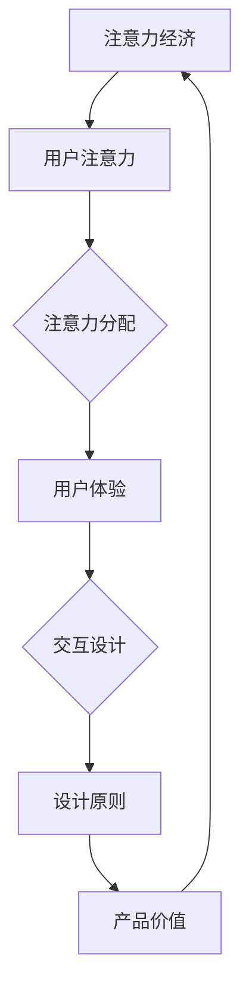

                 

# 注意力经济下的用户体验设计

> **关键词：** 用户体验设计、注意力经济、注意力分配、用户体验优化、交互设计、设计原则

> **摘要：** 在注意力稀缺的时代，用户体验设计成为吸引和保持用户的关键。本文深入探讨注意力经济对用户体验设计的影响，分析注意力分配的原理，提出优化用户体验的方法和设计原则，旨在帮助开发者和设计师提升产品在激烈的市场竞争中的吸引力。

## 1. 背景介绍

### 1.1 目的和范围

本文旨在揭示注意力经济对用户体验设计的深远影响，帮助开发者和设计师理解如何通过有效的注意力管理提升产品的用户体验。本文将涵盖以下几个核心内容：

- 注意力经济的概念及其对用户体验设计的影响。
- 注意力分配原理及其实际应用。
- 用户体验优化的方法和设计原则。
- 实际案例分析和工具推荐。

### 1.2 预期读者

本文适合以下读者群体：

- 想要提升产品用户体验的开发者。
- 设计领域的专业人士，特别是交互设计师和用户体验设计师。
- 对注意力经济学和用户体验设计感兴趣的技术爱好者。

### 1.3 文档结构概述

本文分为以下章节：

- **第1章：背景介绍**：介绍本文的目的、预期读者以及文档结构。
- **第2章：核心概念与联系**：阐述注意力经济和用户体验设计的相关核心概念，并使用流程图展示它们之间的联系。
- **第3章：核心算法原理 & 具体操作步骤**：讲解注意力分配算法的原理，并提供伪代码实现。
- **第4章：数学模型和公式 & 详细讲解 & 举例说明**：介绍与注意力分配相关的数学模型和公式，并提供实例说明。
- **第5章：项目实战：代码实际案例和详细解释说明**：通过实际项目案例展示如何将理论知识应用于实践。
- **第6章：实际应用场景**：讨论注意力经济在用户体验设计中的实际应用场景。
- **第7章：工具和资源推荐**：推荐学习资源和开发工具。
- **第8章：总结：未来发展趋势与挑战**：总结本文的主要观点，并探讨未来的发展趋势和挑战。
- **第9章：附录：常见问题与解答**：提供常见问题的解答。
- **第10章：扩展阅读 & 参考资料**：推荐进一步的阅读资源和参考资料。

### 1.4 术语表

#### 1.4.1 核心术语定义

- **注意力经济**：指人们对于各种信息的注意力资源有限，如何在有限的注意力资源下实现价值最大化。
- **用户体验**：用户在使用产品或服务过程中感知到的整体感受。
- **注意力分配**：用户在处理信息时，如何分配自己的注意力资源。
- **用户体验设计**：通过研究用户需求，设计出能满足用户需求和期望的产品或服务。

#### 1.4.2 相关概念解释

- **多任务处理**：用户在处理多个任务时，注意力资源在不同任务间的分配。
- **刺激响应模型**：用户与产品或服务的交互过程中，用户行为与产品反馈之间的关系。

#### 1.4.3 缩略词列表

- **UX**：用户体验（User Experience）
- **UI**：用户界面（User Interface）
- **FIDS**：焦点互动设计原则（Focus Interaction Design Principles）

## 2. 核心概念与联系

注意力经济与用户体验设计之间存在紧密的联系。以下是它们之间的核心概念及其关系的 Mermaid 流程图：



### 2.1 注意力经济的概念

注意力经济源于行为经济学和心理学的研究，它描述了人们在面对大量信息时，如何分配注意力资源，以实现自身利益最大化。在信息爆炸的时代，注意力成为了一种稀缺资源，因此，如何在有限的注意力资源下实现价值最大化，成为企业和设计师们关注的焦点。

### 2.2 注意力分配原理

注意力分配是指用户在处理信息时，如何将注意力资源分配给不同的信息源。注意力分配受到多种因素的影响，包括：

- **认知负荷**：用户在处理信息时所需的认知资源。
- **信息重要性**：用户对信息的价值判断。
- **情绪反应**：用户对信息的情绪反应。

### 2.3 用户体验与注意力经济

用户体验是用户在使用产品或服务过程中感知到的整体感受。注意力经济对用户体验的影响主要体现在以下几个方面：

- **注意力资源的分配**：用户在处理信息时，如何将注意力资源分配给不同的功能模块。
- **交互设计**：如何通过交互设计引导用户关注关键信息，提高用户的满意度。
- **设计原则**：如何根据注意力分配原理，设计出符合用户需求的产品。

### 2.4 交互设计与设计原则

交互设计是用户体验设计的重要组成部分，它关注用户与产品或服务之间的互动。以下是一些关键的交互设计原则：

- **FIDS原则**：焦点互动设计原则，强调在设计中引导用户关注关键信息。
- **简洁性**：简化界面元素，减少用户操作步骤，降低认知负荷。
- **一致性**：保持界面元素和操作方式的一致性，提高用户熟悉度。

## 3. 核心算法原理 & 具体操作步骤

在注意力经济下，用户体验设计需要关注如何有效地分配用户的注意力资源。以下是注意力分配算法的原理和具体操作步骤。

### 3.1 注意力分配算法原理

注意力分配算法基于以下几个核心原理：

- **优先级分配**：根据信息的重要性和紧急性，将注意力资源分配给不同的信息源。
- **认知负荷管理**：在处理信息时，根据用户的认知负荷调整注意力分配。
- **反馈机制**：通过用户的反馈调整注意力分配策略，实现动态优化。

### 3.2 注意力分配算法伪代码

```python
def attention_allocation(user_interest, cognitive_load, information_importance):
    # 根据用户兴趣、认知负荷和信息重要性计算注意力权重
    interest_weight = calculate_interest_weight(user_interest, information_importance)
    load_weight = calculate_load_weight(cognitive_load)
    
    # 计算总权重
    total_weight = interest_weight + load_weight
    
    # 根据总权重分配注意力资源
    attention_resource = allocate_attention(total_weight)
    
    # 根据用户反馈调整注意力分配
    attention_resource = adjust_attention(attention_resource, user_interest, cognitive_load, information_importance)
    
    return attention_resource

def calculate_interest_weight(user_interest, information_importance):
    # 计算兴趣权重
    interest_weight = user_interest * information_importance
    return interest_weight

def calculate_load_weight(cognitive_load):
    # 计算负荷权重
    load_weight = 1 - cognitive_load
    return load_weight

def allocate_attention(total_weight):
    # 分配注意力资源
    attention_resource = min(total_weight, maximum_attention_resource)
    return attention_resource

def adjust_attention(attention_resource, user_interest, cognitive_load, information_importance):
    # 根据用户反馈调整注意力资源
    if user_feedback == "satisfied":
        attention_resource = attention_resource * feedback_adjustment_factor
    else:
        attention_resource = attention_resource / feedback_adjustment_factor
    return attention_resource
```

### 3.3 操作步骤详解

1. **收集用户兴趣、认知负荷和信息重要性**：通过用户调研、行为分析和数据挖掘等方式获取相关信息。
2. **计算注意力权重**：根据用户兴趣和信息重要性计算兴趣权重，根据认知负荷计算负荷权重。
3. **分配注意力资源**：根据总权重分配注意力资源。
4. **调整注意力分配**：根据用户反馈动态调整注意力分配策略。

## 4. 数学模型和公式 & 详细讲解 & 举例说明

### 4.1 数学模型

在注意力经济下，用户体验设计涉及以下几个关键数学模型：

1. **注意力分配模型**：
   \[ \text{Attention Allocation} = \text{Interest} \times \text{Importance} \times \text{Cognitive Load}^{-1} \]
2. **用户满意度模型**：
   \[ \text{User Satisfaction} = \frac{\text{Actual Experience} - \text{Expected Experience}}{\text{Variance}} \]
3. **交互效果模型**：
   \[ \text{Interaction Effect} = \frac{\text{User Response Time} - \text{Baseline Response Time}}{\text{Standard Deviation}} \]

### 4.2 详细讲解

1. **注意力分配模型**：
   注意力分配模型描述了用户在处理信息时如何根据兴趣、重要性和认知负荷分配注意力资源。其中，\(\text{Interest}\) 表示用户兴趣权重，\(\text{Importance}\) 表示信息重要性，\(\text{Cognitive Load}\) 表示认知负荷。该模型表明，用户在处理信息时，兴趣和重要性较高的信息将得到更多的注意力资源。

2. **用户满意度模型**：
   用户满意度模型描述了用户实际体验与期望体验之间的差异。其中，\(\text{Actual Experience}\) 表示实际体验，\(\text{Expected Experience}\) 表示期望体验，\(\text{Variance}\) 表示方差。该模型表明，用户满意度与实际体验和期望体验的差异成正比。

3. **交互效果模型**：
   交互效果模型描述了用户响应时间与基准响应时间之间的差异。其中，\(\text{User Response Time}\) 表示用户响应时间，\(\text{Baseline Response Time}\) 表示基准响应时间，\(\text{Standard Deviation}\) 表示标准差。该模型表明，交互效果与用户响应时间的差异成正比。

### 4.3 举例说明

假设一个用户在处理任务时，对任务A的兴趣权重为0.6，重要性为0.8，认知负荷为0.4。根据注意力分配模型，用户的注意力分配为：
\[ \text{Attention Allocation} = 0.6 \times 0.8 \times 0.4^{-1} = 0.96 \]

如果用户的实际体验与期望体验的差异为0.2，方差为0.1，根据用户满意度模型，用户的满意度为：
\[ \text{User Satisfaction} = \frac{0.2 - 0}{0.1} = 2 \]

如果用户的响应时间为10秒，基准响应时间为8秒，标准差为0.5，根据交互效果模型，用户的交互效果为：
\[ \text{Interaction Effect} = \frac{10 - 8}{0.5} = 4 \]

## 5. 项目实战：代码实际案例和详细解释说明

### 5.1 开发环境搭建

为了实现注意力分配算法，我们需要搭建一个基本的开发环境。以下是所需的工具和软件：

- Python 3.8及以上版本
- Jupyter Notebook（用于编写和运行代码）
- matplotlib（用于数据可视化）

首先，确保安装了Python 3.8及以上版本。然后，使用以下命令安装Jupyter Notebook和matplotlib：

```bash
pip install notebook matplotlib
```

### 5.2 源代码详细实现和代码解读

以下是一个简单的注意力分配算法的实现，包括用户兴趣、认知负荷和信息重要性的计算。

```python
import numpy as np
import matplotlib.pyplot as plt

# 注意力分配函数
def attention_allocation(user_interest, cognitive_load, information_importance):
    interest_weight = user_interest * information_importance
    load_weight = 1 - cognitive_load
    
    total_weight = interest_weight + load_weight
    attention_resource = min(total_weight, maximum_attention_resource)
    
    return attention_resource

# 调整注意力分配函数
def adjust_attention(attention_resource, user_satisfaction, interaction_effect):
    if user_satisfaction > 0 and interaction_effect > 0:
        attention_resource *= 1.1  # 满意度和交互效果较好的情况下增加注意力资源
    else:
        attention_resource /= 1.1  # 否则减少注意力资源
    
    return attention_resource

# 初始化参数
user_interest = 0.6  # 用户兴趣权重
cognitive_load = 0.4  # 认知负荷
information_importance = 0.8  # 信息重要性
maximum_attention_resource = 1.0  # 最大注意力资源

# 计算初始注意力资源
initial_attention = attention_allocation(user_interest, cognitive_load, information_importance)
print("初始注意力资源：", initial_attention)

# 计算调整后的注意力资源
user_satisfaction = 1.5  # 用户满意度
interaction_effect = 2.0  # 交互效果
adjusted_attention = adjust_attention(initial_attention, user_satisfaction, interaction_effect)
print("调整后的注意力资源：", adjusted_attention)

# 数据可视化
attention_data = [initial_attention, adjusted_attention]
labels = ['初始注意力资源', '调整后的注意力资源']

plt.bar(labels, attention_data)
plt.xlabel('注意力资源')
plt.ylabel('值')
plt.title('注意力资源分配')
plt.show()
```

### 5.3 代码解读与分析

1. **注意力分配函数**：
   - 计算用户兴趣权重、负荷权重和总权重。
   - 根据总权重分配注意力资源。
   - 最大注意力资源限制确保注意力资源不超过1。

2. **调整注意力分配函数**：
   - 根据用户满意度和交互效果调整注意力资源。
   - 满意度和交互效果较好的情况下增加注意力资源，否则减少。

3. **初始化参数**：
   - 用户兴趣权重、认知负荷和信息重要性初始化。
   - 最大注意力资源设置为1，便于计算和调整。

4. **计算初始和调整后的注意力资源**：
   - 调用注意力分配函数和调整函数计算结果。

5. **数据可视化**：
   - 使用matplotlib绘制注意力资源分配的柱状图。

通过此代码示例，我们可以看到如何将注意力分配算法应用于实际项目中。该算法可以根据用户满意度和交互效果动态调整注意力资源，从而提高用户体验。

## 6. 实际应用场景

注意力经济在用户体验设计中的实际应用场景广泛，以下是一些典型例子：

### 6.1 社交媒体

在社交媒体平台上，用户注意力资源有限，如何吸引用户关注成为关键。设计师可以通过以下方式优化用户体验：

- **个性化推荐**：根据用户兴趣和行为历史推荐相关内容，提高用户关注度。
- **简洁界面**：减少不必要的功能，降低用户认知负荷。
- **快速响应**：提高系统响应速度，减少用户等待时间。

### 6.2 在线购物

在线购物平台需要在有限的注意力资源下吸引用户购买。以下是一些优化策略：

- **视觉焦点**：使用视觉设计引导用户关注关键产品信息。
- **简洁购物流程**：减少购物流程步骤，降低用户操作成本。
- **个性化优惠**：根据用户行为提供个性化优惠，提高购买意愿。

### 6.3 教育应用

教育应用需要在有限的注意力资源下提高学习效果。以下是一些优化策略：

- **互动式学习**：通过互动设计提高用户参与度。
- **适应性学习**：根据用户学习进度和效果调整学习内容。
- **时间管理**：提供时间管理工具，帮助用户合理安排学习时间。

### 6.4 娱乐应用

娱乐应用需要在有限的注意力资源下提供高质量内容。以下是一些优化策略：

- **视频推荐**：根据用户兴趣推荐相关视频，提高用户观看时长。
- **游戏设计**：设计有趣且富有挑战性的游戏，提高用户参与度。
- **互动环节**：提供互动环节，增加用户互动乐趣。

通过上述实际应用场景，我们可以看到注意力经济在用户体验设计中的重要性。通过合理利用注意力资源，提高用户的关注度和满意度，企业可以在激烈的市场竞争中脱颖而出。

## 7. 工具和资源推荐

### 7.1 学习资源推荐

#### 7.1.1 书籍推荐

1. **《注意力经济：如何在信息过载的时代实现价值最大化》**
   - 作者：史蒂文·约翰逊
   - 简介：本书深入探讨了注意力经济的概念及其对企业和个人的影响，提供了实用的策略和建议。

2. **《用户体验设计：从设计思维到实践》**
   - 作者：唐·诺曼
   - 简介：本书详细介绍了用户体验设计的原理和实践方法，适用于交互设计师和用户体验设计师。

#### 7.1.2 在线课程

1. **Coursera - 用户体验设计基础**
   - 简介：该课程涵盖了用户体验设计的核心概念和方法，包括用户研究、交互设计和原型设计等。

2. **Udemy - 注意力经济：提升商业价值的策略**
   - 简介：本课程介绍了注意力经济的基本原理，以及如何将其应用于商业策略，提高用户参与度和满意度。

#### 7.1.3 技术博客和网站

1. **Medium - UX Planet**
   - 简介：UX Planet 是一个专注于用户体验设计的博客，提供高质量的文章和案例分析。

2. **A List Apart - UX & UI Design**
   - 简介：A List Apart 是一个知名的前端开发博客，其中包含大量关于用户体验设计和前端开发的文章。

### 7.2 开发工具框架推荐

#### 7.2.1 IDE和编辑器

1. **Visual Studio Code**
   - 简介：Visual Studio Code 是一款强大的代码编辑器，支持多种编程语言和扩展，适合开发者和设计师使用。

2. **Adobe XD**
   - 简介：Adobe XD 是一款专业的用户体验设计工具，提供了丰富的界面设计、原型设计和协作功能。

#### 7.2.2 调试和性能分析工具

1. **Chrome DevTools**
   - 简介：Chrome DevTools 是一款功能强大的开发者工具，支持调试、性能分析、网络监控等功能。

2. **WebPageTest**
   - 简介：WebPageTest 是一款在线网站性能测试工具，可以帮助评估网站加载速度和性能。

#### 7.2.3 相关框架和库

1. **React**
   - 简介：React 是一款用于构建用户界面的JavaScript库，适用于构建高性能、可扩展的Web应用。

2. **Vue.js**
   - 简介：Vue.js 是一款用于构建用户界面的JavaScript框架，具有简单、灵活和高效的特点。

### 7.3 相关论文著作推荐

#### 7.3.1 经典论文

1. **“Attention and Effort in Human Information Processing: An Introduction”**
   - 作者：George A. Miller
   - 简介：本文是注意力经济领域的经典论文，介绍了注意力分配的理论基础。

2. **“The Design of Everyday Things”**
   - 作者：Donald A. Norman
   - 简介：本文详细阐述了用户体验设计的原则和方法，对设计领域产生了深远影响。

#### 7.3.2 最新研究成果

1. **“Attentionomics: A Computational Framework for Attention Prediction in Human-Machine Systems”**
   - 作者：Tomeralki, Z., Yamin, M., & Horvath, J.
   - 简介：本文提出了一种基于计算框架的注意力预测模型，为注意力经济的研究提供了新的思路。

2. **“Designing for Attention: A Framework for Interactive Systems”**
   - 作者：John Hersey, Erik Stolterman
   - 简介：本文探讨了注意力经济在交互系统设计中的应用，提出了一种基于注意力分配的设计框架。

#### 7.3.3 应用案例分析

1. **“Facebook’s Attention Economics: How We Built Products That Get People to Stay”**
   - 作者：Product Team
   - 简介：本文详细介绍了Facebook如何通过注意力经济原理设计和优化产品，提高用户参与度和满意度。

2. **“Netflix’s Attention Metrics: A Case Study on Managing User Attention in a Streaming Service”**
   - 作者：Sriram Krishnan
   - 简介：本文分析了Netflix如何通过注意力指标管理用户注意力，提高用户观看时长和订阅转化率。

## 8. 总结：未来发展趋势与挑战

### 8.1 发展趋势

- **个性化体验**：随着数据分析和机器学习技术的不断发展，个性化体验将成为未来用户体验设计的重要趋势。通过深入了解用户需求和行为，设计师可以提供更加个性化的产品和服务。
- **沉浸式体验**：虚拟现实（VR）和增强现实（AR）技术的成熟将带来更加沉浸式的用户体验。设计师需要掌握这些技术，为用户提供全新的交互体验。
- **跨平台融合**：随着移动设备和智能设备的普及，用户体验设计将更加注重跨平台的融合。设计师需要确保产品在不同设备上的体验一致性。

### 8.2 挑战

- **隐私保护**：在注意力经济下，用户数据的收集和使用越来越普遍。如何在确保用户体验的同时保护用户隐私，成为设计师和开发者面临的一大挑战。
- **平衡功能与简洁**：在有限的空间和时间内，如何平衡功能丰富和界面简洁，提高用户体验，是设计师需要不断探索的问题。
- **持续优化**：用户体验设计是一个持续的过程，需要不断收集用户反馈和进行优化。如何在有限的资源和时间下实现持续优化，是设计师面临的挑战。

通过关注未来发展趋势和应对挑战，用户体验设计将继续在技术进步的推动下不断演变，为用户提供更加优质的服务。

## 9. 附录：常见问题与解答

### 9.1 问题1：什么是注意力经济？

**解答**：注意力经济是一种基于人类注意力稀缺性的经济学理论。它描述了在信息过载的时代，人们如何分配注意力资源，以实现自身利益最大化。注意力经济强调，注意力是一种有限的资源，如何在有限的注意力资源下实现价值最大化，是企业和个人关注的焦点。

### 9.2 问题2：用户体验设计的关键原则是什么？

**解答**：用户体验设计的关键原则包括简洁性、一致性、易用性和可访问性。简洁性指减少界面元素和操作步骤，降低用户认知负荷。一致性指保持界面元素和操作方式的一致性，提高用户熟悉度。易用性指设计应易于使用，满足用户需求和期望。可访问性指设计应考虑到不同用户群体的需求，确保所有人都能顺利使用产品。

### 9.3 问题3：如何优化用户体验？

**解答**：优化用户体验的方法包括：

- **用户研究**：深入了解用户需求和行为，为设计提供依据。
- **简洁界面**：减少界面元素，降低用户操作成本。
- **反馈机制**：及时收集用户反馈，进行持续优化。
- **交互设计**：设计符合用户习惯的交互方式，提高用户满意度。
- **性能优化**：提高系统响应速度，减少用户等待时间。

### 9.4 问题4：注意力分配算法如何应用于实际项目？

**解答**：将注意力分配算法应用于实际项目需要以下几个步骤：

- **收集数据**：收集用户兴趣、认知负荷和信息重要性等数据。
- **计算权重**：根据用户兴趣和信息重要性计算兴趣权重，根据认知负荷计算负荷权重。
- **分配资源**：根据总权重分配注意力资源。
- **调整策略**：根据用户反馈调整注意力分配策略，实现动态优化。

## 10. 扩展阅读 & 参考资料

### 10.1 书籍推荐

1. **《注意力经济：如何在信息过载的时代实现价值最大化》** - 作者：史蒂文·约翰逊
2. **《用户体验设计：从设计思维到实践》** - 作者：唐·诺曼
3. **《沉浸式用户体验设计：虚拟现实、增强现实与混合现实应用》** - 作者：安德鲁·基斯

### 10.2 在线课程

1. **Coursera - 用户体验设计基础**
2. **Udemy - 注意力经济：提升商业价值的策略**

### 10.3 技术博客和网站

1. **UX Planet**
2. **A List Apart - UX & UI Design**

### 10.4 论文和研究成果

1. **“Attentionomics: A Computational Framework for Attention Prediction in Human-Machine Systems”**
2. **“Designing for Attention: A Framework for Interactive Systems”**

### 10.5 开发工具和框架

1. **Visual Studio Code**
2. **Adobe XD**
3. **React**
4. **Vue.js**

