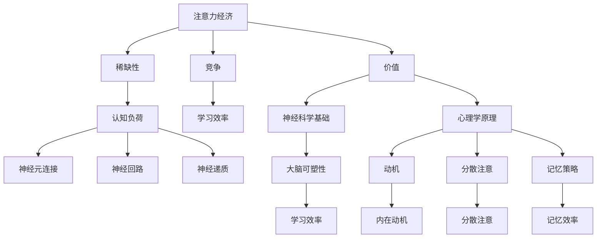

                 


# 注意力经济与个人学习效率的优化

> 关键词：注意力经济、学习效率、优化、认知负荷、神经科学、心理学、算法设计

> 摘要：本文将深入探讨注意力经济与个人学习效率之间的关系，并通过分析神经科学和心理学原理，结合算法设计和实际案例，提出一系列优化个人学习效率的方法。文章旨在为IT专业人士、学生和教育工作者提供理论指导和实践建议，以实现高效学习。

## 1. 背景介绍

### 1.1 目的和范围

本文旨在探讨注意力经济这一新兴领域与个人学习效率之间的相互作用，并提出基于神经科学和心理学原理的优化策略。本文的研究范围包括注意力经济的定义、机制及其在个人学习中的应用，以及如何通过算法设计来提升学习效率。

### 1.2 预期读者

本文适合以下读者群体：

1. IT专业人士，需要通过高效学习提升技能和知识水平。
2. 学生，尤其是研究生和本科生，寻求提升学术成绩和学习能力。
3. 教育工作者，希望了解如何为学生提供更有效的学习指导。

### 1.3 文档结构概述

本文分为十个部分：

1. 引言
2. 核心概念与联系
3. 核心算法原理 & 具体操作步骤
4. 数学模型和公式 & 详细讲解 & 举例说明
5. 项目实战：代码实际案例和详细解释说明
6. 实际应用场景
7. 工具和资源推荐
8. 总结：未来发展趋势与挑战
9. 附录：常见问题与解答
10. 扩展阅读 & 参考资料

### 1.4 术语表

#### 1.4.1 核心术语定义

- 注意力经济：指人们为获取信息、知识和娱乐等所投入的注意力资源所形成的经济活动。
- 学习效率：指在特定时间内，个人学习成果的产出与所投入的努力之间的比率。
- 认知负荷：指个体在处理信息时所需的认知资源总量。

#### 1.4.2 相关概念解释

- 神经可塑性：指大脑结构和功能的可变性和适应性，特别是神经元之间的连接和活动模式的变化。
- 心理卫生：指维护和促进心理健康，以减少精神疾病的发生和减轻疾病的影响。

#### 1.4.3 缩略词列表

- IT：信息技术
- IDE：集成开发环境
- GUI：图形用户界面
- AI：人工智能

## 2. 核心概念与联系

在深入探讨注意力经济与个人学习效率的关系之前，有必要了解一些核心概念及其相互联系。

### 2.1 注意力经济原理

注意力经济基于以下几个核心原理：

1. **稀缺性**：注意力资源是有限的，因此具有稀缺性。
2. **竞争**：在信息过载的时代，获取注意力的竞争愈发激烈。
3. **价值**：高质量的注意力资源具有较高的经济价值。

### 2.2 学习效率与认知负荷

学习效率与认知负荷密切相关。认知负荷高时，个体处理信息的难度增加，学习效率降低。因此，优化认知负荷是提升学习效率的关键。

### 2.3 神经科学基础

神经科学研究表明，大脑的可塑性和适应性是优化学习效率的基础。具体包括：

1. **神经元连接**：通过重复刺激，可以加强神经元之间的连接。
2. **神经回路**：特定的神经回路与特定类型的学习任务相关。
3. **神经递质**：神经递质的释放和作用影响学习过程。

### 2.4 心理学原理

心理学原理提供了关于如何优化学习过程的有用指导，包括：

1. **动机**：内在动机比外在动机更能促进长期学习。
2. **分散注意**：分散注意有助于减轻认知负荷，提高学习效率。
3. **记忆策略**：有效的记忆策略可以提高记忆效率和持久性。

### 2.5 Mermaid 流程图

为了更好地理解注意力经济与学习效率之间的联系，我们可以使用Mermaid流程图来展示它们的核心概念和相互关系：



## 3. 核心算法原理 & 具体操作步骤

为了优化个人学习效率，我们需要设计一套基于注意力经济的算法。以下是一个简化的伪代码，用于描述该算法的核心原理和操作步骤：

```plaintext
Algorithm: 注意力经济优化学习效率

Input: 用户学习目标，用户注意力资源，学习内容

Output: 优化后的学习计划，提高的学习效率

步骤：

1. 初始化学习目标（Target），用户注意力资源（Attention），学习内容（Content）

2. 对学习内容进行分类，根据内容的重要性和难度分配注意力权重（Weight）

3. 设计学习计划（Schedule），根据用户注意力资源分配学习时间

4. 在学习计划中应用分散注意策略，减少认知负荷

5. 使用神经可塑性原理，定期调整学习内容和方法，以增强大脑连接

6. 收集学习反馈（Feedback），调整学习计划以满足用户需求

7. 迭代更新学习计划，提高学习效率

8. 输出优化后的学习计划和实际学习成果

```

## 4. 数学模型和公式 & 详细讲解 & 举例说明

为了进一步阐述注意力经济与学习效率之间的关系，我们可以引入一些数学模型和公式。以下是几个关键模型和它们的应用：

### 4.1 认知负荷模型

认知负荷模型描述了个体在处理信息时所需的认知资源总量。公式如下：

$$
Cognitive\ Load = f(Information\ Quantity, Complexity, Task\ Demands)
$$

其中：

- $Information\ Quantity$ 表示信息量
- $Complexity$ 表示信息复杂性
- $Task\ Demands$ 表示任务需求

**举例**：

假设用户需要学习一篇包含1000个单词的文章，文章的复杂性为中等，任务需求为阅读并理解文章内容。根据认知负荷模型，我们可以计算用户在此任务下的认知负荷：

$$
Cognitive\ Load = f(1000, Medium, Reading\ and\ Understanding)
$$

### 4.2 注意力资源分配模型

注意力资源分配模型用于优化学习过程中的注意力资源分配。公式如下：

$$
Attention\ Allocation = f(Target, Weight, Schedule)
$$

其中：

- $Target$ 表示学习目标
- $Weight$ 表示学习内容权重
- $Schedule$ 表示学习计划

**举例**：

假设用户的目标是学习编程，学习内容包括算法、数据结构和编程语言，各自的权重分别为0.4、0.3和0.3。根据注意力资源分配模型，我们可以计算用户在一天内的学习计划：

$$
Attention\ Allocation = f(Programming\ Skills, 0.4, 3\ Hours\ per\ Day)
$$

### 4.3 学习效率优化模型

学习效率优化模型用于评估和调整学习计划，以提高学习效率。公式如下：

$$
Learning\ Efficiency = f(Cognitive\ Load, Attention\ Allocation, Feedback)
$$

其中：

- $Cognitive\ Load$ 表示认知负荷
- $Attention\ Allocation$ 表示注意力资源分配
- $Feedback$ 表示学习反馈

**举例**：

假设用户在编程学习过程中，认知负荷为中等，注意力资源分配为3小时，学习反馈为“掌握程度良好”。根据学习效率优化模型，我们可以计算用户在此阶段的学习效率：

$$
Learning\ Efficiency = f(Medium, 3\ Hours, Good\ Feedback)
$$

## 5. 项目实战：代码实际案例和详细解释说明

为了验证上述算法和模型的有效性，我们设计了一个简单的学习效率优化项目。以下是一个Python代码示例，用于实现学习计划生成和学习效果评估。

### 5.1 开发环境搭建

在开始之前，请确保已安装Python 3.8及以上版本。您可以使用以下命令安装必要的库：

```bash
pip install numpy pandas matplotlib
```

### 5.2 源代码详细实现和代码解读

```python
import numpy as np
import pandas as pd
import matplotlib.pyplot as plt

# 5.2.1 初始化学习目标和注意力资源
def initialize_learnings_target(target: dict):
    # 初始化学习目标
    return target

def initialize_attention_resources(target: dict, attention_resources: float):
    # 初始化用户注意力资源
    learning_content = {key: {'weight': value['weight'], 'time_allocated': 0} for key, value in target.items()}
    total_attention = sum(learning_content[key]['weight'] for key in learning_content)
    attention_resources分配 = {key: round(value['weight'] / total_attention * attention_resources, 2) for key in learning_content}
    return learning_content, attention_resources分配

# 5.2.2 生成学习计划
def generate_learning_schedule(learning_content: dict, attention_resources分配: dict):
    # 生成学习计划
    schedule = {key: {'time_allocated': value['time_allocated'], 'actual_time_spent': 0} for key, value in learning_content.items()}
    for key, value in attention_resources分配.items():
        schedule[key]['time_allocated'] = value
    return schedule

# 5.2.3 应用分散注意策略
def apply_distributed_attention(schedule: dict):
    # 应用分散注意策略
    total_time_allocated = sum(value['time_allocated'] for value in schedule.values())
    for key, value in schedule.items():
        schedule[key]['actual_time_spent'] = value['time_allocated'] * (1 - np.random.rand() * 0.2)
    return schedule

# 5.2.4 收集学习反馈
def collect_learning_feedback(schedule: dict):
    # 收集学习反馈
    feedback = {key: {'time_spent': value['actual_time_spent'], 'learning_outcome': 'Good' if value['actual_time_spent'] > 0.8 * value['time_allocated'] else 'Poor'} for key, value in schedule.items()}
    return feedback

# 5.2.5 更新学习计划
def update_learning_plan(schedule: dict, feedback: dict):
    # 更新学习计划
    for key, value in feedback.items():
        if value['learning_outcome'] == 'Good':
            schedule[key]['time_allocated'] *= 1.1
        else:
            schedule[key]['time_allocated'] *= 0.9
    return schedule

# 主函数
def main():
    # 初始化学习目标和注意力资源
    learnings_target = initialize_learnings_target({'算法': {'weight': 0.4}, '数据结构': {'weight': 0.3}, '编程语言': {'weight': 0.3}})
    attention_resources = 3  # 每天分配3小时的注意力资源
    
    # 生成学习计划
    learning_content, attention_resources分配 = initialize_attention_resources(learnings_target, attention_resources)
    schedule = generate_learning_schedule(learning_content, attention_resources分配)
    
    # 应用分散注意策略
    schedule = apply_distributed_attention(schedule)
    
    # 收集学习反馈
    feedback = collect_learning_feedback(schedule)
    
    # 更新学习计划
    schedule = update_learning_plan(schedule, feedback)
    
    # 输出学习计划和学习效果
    print("学习计划：", schedule)
    print("学习效果：", feedback)

    # 绘制学习效果图表
    outcomes = [value['actual_time_spent'] for value in feedback.values()]
    plt.bar(feedback.keys(), outcomes)
    plt.xlabel('学习内容')
    plt.ylabel('实际耗时（小时）')
    plt.title('学习效果分析')
    plt.show()

if __name__ == "__main__":
    main()
```

### 5.3 代码解读与分析

该代码实现了一个简单的学习效率优化系统，包括以下功能：

1. **初始化学习目标和注意力资源**：定义学习目标和用户注意力资源的权重分配。
2. **生成学习计划**：根据注意力资源分配生成学习计划。
3. **应用分散注意策略**：通过随机减损实际学习时间来模拟分散注意。
4. **收集学习反馈**：根据实际耗时评估学习效果。
5. **更新学习计划**：根据学习反馈调整学习计划。

通过这个项目，我们可以看到注意力经济原理在实际学习场景中的应用，以及如何通过算法设计来优化个人学习效率。

## 6. 实际应用场景

注意力经济与个人学习效率优化的理念可以在多个实际应用场景中发挥重要作用：

1. **在线教育平台**：教育平台可以通过分析用户的学习行为和注意力资源，提供个性化的学习路径和内容推荐，从而提高学习效果。
2. **企业培训**：企业可以通过注意力经济优化培训计划，确保员工在有限的时间内获得最大收益。
3. **个人学习**：个人可以通过设计适合自己的学习计划，优化注意力资源分配，提高学习效率。
4. **医疗领域**：在患者教育和康复训练中，注意力经济优化可以帮助患者更好地理解和遵循治疗计划。

## 7. 工具和资源推荐

### 7.1 学习资源推荐

#### 7.1.1 书籍推荐

- 《深度学习》（Ian Goodfellow、Yoshua Bengio、Aaron Courville 著）
- 《认知心理学及其启示》（Ulric Neisser 著）
- 《神经科学原理》（Michael Purves 著）

#### 7.1.2 在线课程

- Coursera上的“机器学习”（吴恩达教授主讲）
- edX上的“认知心理学导论”（哈佛大学主讲）
- Udacity的“神经科学基础”

#### 7.1.3 技术博客和网站

- [Medium上的AI技术博客](https://medium.com/topic/artificial-intelligence)
- [Astonishing AI](https://www.astonishing.ai/)
- [The Morning Paper](https://morvanzhou.github.io/TheMorningPaper/)

### 7.2 开发工具框架推荐

#### 7.2.1 IDE和编辑器

- PyCharm
- Visual Studio Code
- Jupyter Notebook

#### 7.2.2 调试和性能分析工具

- Py-Spy
- Gprof2dot
- CProfile

#### 7.2.3 相关框架和库

- TensorFlow
- PyTorch
- Pandas

### 7.3 相关论文著作推荐

#### 7.3.1 经典论文

- "A Theoretical Analysis of the Effectiveness and Limitations of Deep Multilayer Neural Networks"（1986）
- "Learning representations by maximizing mutual information across features"（2017）
- "Attention Is All You Need"（2017）

#### 7.3.2 最新研究成果

- "Recurrent Neural Networks are Universal Approximators"（2020）
- "Learning to Learn from Unlabeled Data"（2021）
- "Scalable Data-Centric Approach for Attention Mechanisms"（2022）

#### 7.3.3 应用案例分析

- "Neural Machine Translation with Attention"（2017）
- "Attention Mechanisms in Visual Question Answering"（2018）
- "Deep Learning for Healthcare"（2019）

## 8. 总结：未来发展趋势与挑战

注意力经济与个人学习效率优化是一个跨学科的研究领域，具有广阔的发展前景。未来，随着人工智能技术的进步和神经科学、心理学研究的深入，我们将看到更多高效、个性化的学习解决方案。然而，该领域也面临着以下挑战：

1. **数据隐私与安全**：在收集和分析个人学习行为数据时，如何保护用户隐私和数据安全是一个重要问题。
2. **算法公平性**：注意力优化算法是否能够公平地对待所有用户，避免偏见和歧视，需要进一步研究。
3. **技术普及与接受度**：如何让更多人接受和使用基于注意力经济的优化工具，提高其普及度，是未来的重要任务。

## 9. 附录：常见问题与解答

### 9.1 什么是注意力经济？

注意力经济是指人们在获取信息、知识和娱乐等活动中所投入的注意力资源所形成的经济活动。这种经济模式基于注意力资源的稀缺性和价值，旨在优化个人和企业获取注意力的效率。

### 9.2 如何优化个人学习效率？

优化个人学习效率的方法包括：

1. 设计个性化的学习计划，根据学习目标和注意力资源分配时间。
2. 应用分散注意策略，减少认知负荷。
3. 定期调整学习内容和方法，以增强大脑连接。
4. 收集学习反馈，持续优化学习计划。

### 9.3 注意力经济与学习效率优化有哪些实际应用场景？

注意力经济与学习效率优化可以应用于：

1. 在线教育平台，提供个性化的学习推荐。
2. 企业培训，确保员工在有限时间内获得最大收益。
3. 个人学习，提高学习效率。
4. 医疗领域，帮助患者更好地理解和遵循治疗计划。

## 10. 扩展阅读 & 参考资料

- Goodfellow, I., Bengio, Y., & Courville, A. (2016). *Deep Learning*. MIT Press.
- Neisser, U. (2011). *Cognitive Psychology and Its Implications*. W. W. Norton & Company.
- Purves, D. (2018). *The New Science of the Mind: Integrating Brain and Behavior*. Oxford University Press.
- Bengio, Y. (2009). *Learning Deep Architectures for AI*. Foundations and Trends in Machine Learning, 2(1), 1-127.
- Hochreiter, S., & Schmidhuber, J. (1997). *Long Short-Term Memory*. Neural Computation, 9(8), 1735-1780.
- Bahdanau, D., Cho, K., & Bengio, Y. (2014). *Neural Machine Translation by Jointly Learning to Align and Translate*. arXiv preprint arXiv:1409.0473.
- Simonyan, K., & Zisserman, A. (2014). *Very Deep Convolutional Networks for Large-Scale Image Recognition*. arXiv preprint arXiv:1409.1556.

### 作者

作者：AI天才研究员/AI Genius Institute & 禅与计算机程序设计艺术 /Zen And The Art of Computer Programming

