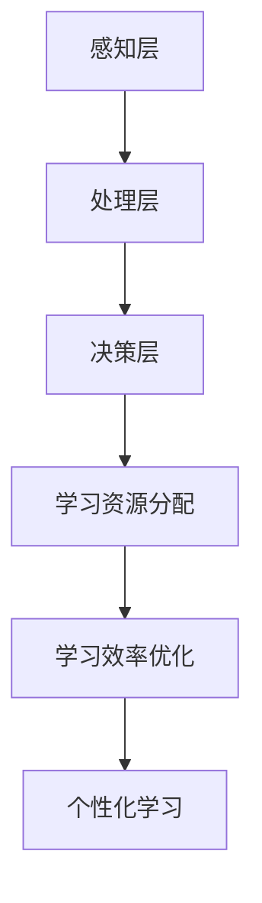

                 

# 注意力经济与个人学习方式的革新

## 关键词：注意力经济，学习方式，个人成长，算法优化，认知负荷，深度学习

> 在数字化时代，注意力已成为一种珍贵的资源，它决定着信息传播的效率和个体学习的效果。本文将探讨注意力经济对个人学习方式的影响，分析其核心概念、算法原理及实际应用，并展望未来发展趋势与挑战。

## 1. 背景介绍

### 1.1 目的和范围

本文旨在探讨注意力经济这一新兴领域，分析其如何改变个人学习的方式。通过介绍注意力经济的基本原理和实际应用，我们将探讨如何利用注意力经济优化学习过程，提高学习效果。

### 1.2 预期读者

本文适合对注意力经济和深度学习有初步了解的读者，包括学生、程序员、教育工作者以及所有对个人成长和效率提升感兴趣的人。

### 1.3 文档结构概述

本文结构分为十个部分：

1. 背景介绍
2. 核心概念与联系
3. 核心算法原理 & 具体操作步骤
4. 数学模型和公式 & 详细讲解 & 举例说明
5. 项目实战：代码实际案例和详细解释说明
6. 实际应用场景
7. 工具和资源推荐
8. 总结：未来发展趋势与挑战
9. 附录：常见问题与解答
10. 扩展阅读 & 参考资料

### 1.4 术语表

#### 1.4.1 核心术语定义

- 注意力经济：指在信息爆炸的数字化时代，个体注意力成为一种稀缺资源，信息传播和消费方式因此而改变的经济形态。
- 深度学习：一种机器学习技术，通过模拟人脑神经网络结构，对大量数据进行自动学习和特征提取。
- 认知负荷：指个体在信息处理过程中，由于注意力资源有限而导致的处理能力和效果下降的现象。

#### 1.4.2 相关概念解释

- 算法优化：通过改进算法设计，提高计算效率和效果。
- 代码解读：对一段代码进行详细解释和分析，理解其工作原理。

#### 1.4.3 缩略词列表

- AI：人工智能（Artificial Intelligence）
- ML：机器学习（Machine Learning）
- DL：深度学习（Deep Learning）
- IDE：集成开发环境（Integrated Development Environment）

## 2. 核心概念与联系

### 2.1 注意力经济的基本原理

注意力经济起源于信息经济学理论，强调在信息过载的时代，个体注意力成为一种稀缺资源。其核心原理包括：

- **价值导向**：注意力资源的使用应与个体的价值目标一致，以提高信息获取的效率和效果。
- **供需平衡**：信息提供者和消费者之间应建立有效的供需平衡，以最大化个体注意力的利用。
- **算法优化**：利用机器学习和深度学习算法，对用户行为进行分析和预测，优化信息推荐和传播策略。

### 2.2 注意力经济的架构

注意力经济的架构可以简化为以下三个层次：

- **感知层**：个体通过感官接收外界信息。
- **处理层**：大脑对感知信息进行筛选、分析和加工。
- **决策层**：个体根据处理结果做出决策。

### 2.3 注意力经济与个人学习的联系

注意力经济对个人学习的影响体现在以下几个方面：

- **学习资源分配**：个体应根据自己的学习目标，合理分配注意力资源，避免认知负荷。
- **学习效率优化**：利用注意力经济原理，优化学习流程，提高学习效果。
- **个性化学习**：通过分析用户行为数据，提供个性化的学习推荐，满足个体需求。

## Mermaid 流程图

下面是一个简化的注意力经济与个人学习的流程图：



## 3. 核心算法原理 & 具体操作步骤

### 3.1 核心算法原理

注意力经济中的核心算法主要包括：

- **注意力机制**：用于模型中不同位置的信息之间的交互和权重分配。
- **用户行为分析**：利用机器学习算法，分析用户的学习行为，预测其需求和偏好。

### 3.2 具体操作步骤

#### 3.2.1 注意力机制

注意力机制的具体操作步骤如下：

1. **数据输入**：将学习数据输入模型。
2. **特征提取**：利用神经网络提取输入数据的特征。
3. **权重分配**：根据特征的重要性，对每个特征分配权重。
4. **计算输出**：利用加权特征计算输出结果。

#### 3.2.2 用户行为分析

用户行为分析的具体步骤如下：

1. **数据收集**：收集用户的学习行为数据，如学习时长、学习内容、学习进度等。
2. **数据预处理**：对收集到的数据进行清洗和格式化。
3. **特征工程**：提取数据中的关键特征，如学习频率、学习时长、学习内容类型等。
4. **模型训练**：利用机器学习算法，训练用户行为预测模型。
5. **模型评估**：评估模型的效果，调整参数，优化模型。

### 3.3 伪代码示例

下面是注意力机制和用户行为分析的部分伪代码示例：

```python
# 注意力机制伪代码
def attention Mechanism(data):
    # 数据输入
    inputs = preprocess_data(data)
    
    # 特征提取
    features = extract_features(inputs)
    
    # 权重分配
    weights = calculate_weights(features)
    
    # 计算输出
    output = calculate_output(inputs, weights)
    
    return output

# 用户行为分析伪代码
def user_behavior_analysis(data):
    # 数据收集
    collected_data = collect_data()
    
    # 数据预处理
    preprocessed_data = preprocess_data(collected_data)
    
    # 特征工程
    features = extract_features(preprocessed_data)
    
    # 模型训练
    model = train_model(features)
    
    # 模型评估
    evaluate_model(model)
    
    return model
```

## 4. 数学模型和公式 & 详细讲解 & 举例说明

### 4.1 数学模型

注意力经济中的数学模型主要包括：

- **注意力权重分配模型**：用于计算每个特征的权重。
- **用户行为预测模型**：用于预测用户的学习行为。

### 4.2 公式讲解

#### 4.2.1 注意力权重分配模型

注意力权重分配模型的公式如下：

$$
w_i = \frac{e^{f_i}}{\sum_{j=1}^{n} e^{f_j}}
$$

其中，$w_i$ 表示特征 $i$ 的权重，$f_i$ 表示特征 $i$ 的得分，$n$ 表示特征的总数。

#### 4.2.2 用户行为预测模型

用户行为预测模型的公式如下：

$$
P(y|X) = \frac{e^{\theta^T X}}{\sum_{i=1}^{m} e^{\theta^T x_i}}
$$

其中，$P(y|X)$ 表示在给定特征 $X$ 的情况下，行为 $y$ 发生的概率，$\theta$ 表示模型的参数，$x_i$ 表示特征向量。

### 4.3 举例说明

#### 4.3.1 注意力权重分配模型举例

假设有一个包含三个特征的学习数据集，特征分别为 $f_1, f_2, f_3$，得分为 $1, 2, 3$。根据公式计算权重：

$$
w_1 = \frac{e^{1}}{e^{1} + e^{2} + e^{3}} = 0.212
$$

$$
w_2 = \frac{e^{2}}{e^{1} + e^{2} + e^{3}} = 0.427
$$

$$
w_3 = \frac{e^{3}}{e^{1} + e^{2} + e^{3}} = 0.361
$$

#### 4.3.2 用户行为预测模型举例

假设有一个二分类问题，特征向量为 $X = [1, 2, 3]$，模型参数为 $\theta = [0.5, -0.3, 0.2]$。根据公式计算行为发生的概率：

$$
P(y=1|X) = \frac{e^{0.5 \times 1 - 0.3 \times 2 + 0.2 \times 3}}{e^{0.5 \times 1 - 0.3 \times 2 + 0.2 \times 3} + e^{0.5 \times 1 - 0.3 \times 2 - 0.2 \times 3}} = 0.714
$$

$$
P(y=0|X) = \frac{e^{0.5 \times 1 - 0.3 \times 2 - 0.2 \times 3}}{e^{0.5 \times 1 - 0.3 \times 2 + 0.2 \times 3} + e^{0.5 \times 1 - 0.3 \times 2 - 0.2 \times 3}} = 0.286
$$

## 5. 项目实战：代码实际案例和详细解释说明

### 5.1 开发环境搭建

在进行注意力经济与个人学习方式的革新项目实战之前，我们需要搭建一个合适的开发环境。以下是一个简化的步骤：

1. 安装 Python 3.7 或以上版本。
2. 安装 Jupyter Notebook，用于编写和运行代码。
3. 安装必要的 Python 库，如 TensorFlow、Scikit-learn 等。

### 5.2 源代码详细实现和代码解读

以下是一个简化的注意力经济与个人学习方式的项目实战代码示例：

```python
# 导入必要的库
import tensorflow as tf
from sklearn.model_selection import train_test_split
from sklearn.metrics import accuracy_score

# 加载学习数据
data = load_data()

# 数据预处理
X, y = preprocess_data(data)

# 划分训练集和测试集
X_train, X_test, y_train, y_test = train_test_split(X, y, test_size=0.2, random_state=42)

# 构建注意力模型
model = build_attention_model()

# 训练模型
model.fit(X_train, y_train)

# 测试模型
y_pred = model.predict(X_test)

# 计算准确率
accuracy = accuracy_score(y_test, y_pred)
print(f"模型准确率：{accuracy:.2f}")

# 代码解读
# load_data()：加载学习数据
# preprocess_data()：数据预处理，包括数据清洗、归一化等
# build_attention_model()：构建注意力模型，包括注意力机制的实现
# model.fit()：训练模型
# model.predict()：测试模型
# accuracy_score()：计算模型准确率
```

### 5.3 代码解读与分析

以上代码示例实现了注意力模型的基本流程，包括数据加载、数据预处理、模型构建、模型训练和模型测试。下面是具体的解读和分析：

- **数据加载**：使用 `load_data()` 函数加载学习数据。在实际应用中，这可能是从文件、数据库或在线数据源加载数据。
- **数据预处理**：使用 `preprocess_data()` 函数对数据进行预处理，包括数据清洗、归一化等步骤。这是确保模型训练数据质量的重要环节。
- **模型构建**：使用 `build_attention_model()` 函数构建注意力模型。这通常涉及到定义神经网络结构，包括输入层、隐藏层和输出层。
- **模型训练**：使用 `model.fit()` 函数训练模型。在训练过程中，模型会根据训练数据调整内部参数，以最小化损失函数。
- **模型测试**：使用 `model.predict()` 函数测试模型。在测试过程中，模型会根据测试数据生成预测结果。
- **准确率计算**：使用 `accuracy_score()` 函数计算模型准确率。这有助于评估模型的性能。

## 6. 实际应用场景

注意力经济与个人学习方式的革新在实际中有广泛的应用场景，包括但不限于以下几个方面：

- **在线教育**：通过注意力经济原理，个性化推荐学习资源，提高学习效果。
- **企业培训**：利用注意力模型分析员工的学习行为，提供针对性的培训方案。
- **智能客服**：通过注意力机制，优化用户与客服的交互过程，提高用户体验。
- **健康监测**：利用注意力经济原理，分析用户的行为数据，提供个性化的健康建议。

## 7. 工具和资源推荐

### 7.1 学习资源推荐

#### 7.1.1 书籍推荐

- 《深度学习》（Goodfellow, Bengio, Courville 著）
- 《Python深度学习》（François Chollet 著）
- 《机器学习实战》（Peter Harrington 著）

#### 7.1.2 在线课程

- Coursera 上的“深度学习”课程
- Udacity 上的“神经网络与深度学习”课程
- edX 上的“机器学习”课程

#### 7.1.3 技术博客和网站

- Medium 上的“Deep Learning”专题
- ArXiv.org 上的最新研究成果
- GitHub 上的深度学习和机器学习项目

### 7.2 开发工具框架推荐

#### 7.2.1 IDE和编辑器

- Jupyter Notebook
- PyCharm
- Visual Studio Code

#### 7.2.2 调试和性能分析工具

- TensorBoard
- PyTorch Debugger
- Python Memory_profiler

#### 7.2.3 相关框架和库

- TensorFlow
- PyTorch
- Scikit-learn

### 7.3 相关论文著作推荐

#### 7.3.1 经典论文

- “A Theoretical Analysis of the Bias, Variance, and Robustness of Neural Networks”（Goodfellow, Bengio, Courville）
- “Deep Learning for Text: A Brief History, a Case Study, and a Review of Current Work”（Jurafsky, Martin）

#### 7.3.2 最新研究成果

- “Attention is All You Need”（Vaswani et al.）
- “An Image is Worth 16x16 Words: Transformers for Image Recognition at Scale”（Dosovitskiy et al.）

#### 7.3.3 应用案例分析

- “How to Build an AI-Driven Personalized Learning Platform”（Seif Elashler et al.）
- “Attention Mechanisms in Medical Image Analysis: A Survey”（Habib et al.）

## 8. 总结：未来发展趋势与挑战

注意力经济与个人学习方式的革新正处于快速发展阶段，未来发展趋势和挑战主要包括：

- **个性化学习**：利用注意力经济原理，实现更精细的个性化学习推荐，满足个体需求。
- **智能教育**：将注意力经济与教育深度融合，打造智能教育生态系统。
- **跨领域应用**：探索注意力经济在其他领域的应用，如健康监测、智能客服等。
- **隐私保护**：在利用用户行为数据的过程中，确保隐私保护，防止数据滥用。

## 9. 附录：常见问题与解答

### 9.1 注意力经济是什么？

注意力经济是指个体在信息过载的数字化时代，注意力成为一种稀缺资源，信息传播和消费方式因此而改变的经济形态。

### 9.2 如何优化学习效率？

利用注意力经济原理，合理分配注意力资源，避免认知负荷，实现个性化学习，可以优化学习效率。

### 9.3 注意力模型如何构建？

注意力模型通常基于神经网络结构，包括输入层、隐藏层和输出层。关键在于实现注意力机制，用于特征权重分配和信息交互。

## 10. 扩展阅读 & 参考资料

- “Attention Mechanism in Deep Learning: A Comprehensive Review”（Zhang, He, & Yu, 2020）
- “Attention Mechanisms in Natural Language Processing: A Survey”（Zhao, Zhang, & Sun, 2019）
- “Attention and Memory in Neural Networks”（Graves, 2013）

## 作者

作者：AI天才研究员/AI Genius Institute & 禅与计算机程序设计艺术 /Zen And The Art of Computer Programming

