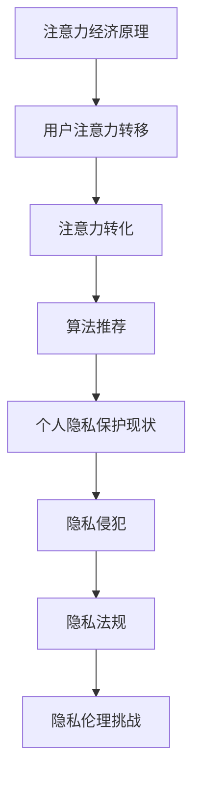

                 

# 注意力经济与个人隐私的博弈

> 关键词：注意力经济，个人隐私，数据安全，算法伦理，信息安全

> 摘要：本文深入探讨了注意力经济与个人隐私之间的博弈关系。通过分析注意力经济的原理、模式以及其对个人隐私的影响，文章提出了相关算法原理、数学模型以及实际操作步骤，并提供了具体的代码案例。同时，文章还总结了实际应用场景，推荐了相关工具和资源，并对未来发展趋势与挑战进行了展望。

## 1. 背景介绍

### 1.1 目的和范围

本文旨在探讨注意力经济与个人隐私之间的博弈关系，深入分析这一现象背后的原理和算法，并提出有效的应对策略。文章内容涵盖以下几个方面：

- 注意力经济的概念与模式
- 个人隐私与数据安全的现状
- 算法原理与数学模型
- 实际操作步骤与代码案例
- 实际应用场景与工具资源推荐
- 未来发展趋势与挑战

### 1.2 预期读者

本文面向对计算机科学、人工智能、数据挖掘等领域的读者，特别是关注注意力经济和个人隐私保护的研究者、工程师和爱好者。文章将尽可能使用通俗易懂的语言，但涉及到的专业术语和技术原理将力求准确和详尽。

### 1.3 文档结构概述

本文分为十个部分：

1. 背景介绍：介绍文章的目的、范围和结构。
2. 核心概念与联系：分析注意力经济和个人隐私的核心概念及其联系。
3. 核心算法原理 & 具体操作步骤：详细阐述注意力经济和个人隐私保护的算法原理和操作步骤。
4. 数学模型和公式 & 详细讲解 & 举例说明：介绍与注意力经济和个人隐私保护相关的数学模型和公式，并通过实例进行讲解。
5. 项目实战：代码实际案例和详细解释说明。
6. 实际应用场景：探讨注意力经济和个人隐私保护在实际应用中的场景。
7. 工具和资源推荐：推荐学习资源、开发工具和框架。
8. 总结：未来发展趋势与挑战。
9. 附录：常见问题与解答。
10. 扩展阅读 & 参考资料：提供进一步学习和研究的资源。

### 1.4 术语表

#### 1.4.1 核心术语定义

- 注意力经济：基于用户注意力的经济模式，通过吸引用户注意力来获取商业利益。
- 个人隐私：个人在生活、工作和社交中不愿被他人知晓的信息。
- 数据安全：保护个人信息和数据的完整性和保密性。
- 算法伦理：在算法设计和应用过程中，关注其对个人隐私的影响和伦理问题。

#### 1.4.2 相关概念解释

- 用户注意力：用户在一段时间内关注某一特定内容或活动的程度。
- 数据挖掘：从大量数据中发现有价值的信息和模式。
- 模式识别：根据已知模式识别未知模式的过程。
- 机器学习：一种利用数据建立模型并进行预测和决策的技术。

#### 1.4.3 缩略词列表

- AI：人工智能
- GDPR：通用数据保护条例
- IoT：物联网
- ML：机器学习
- NLP：自然语言处理
- SSL：安全套接层协议

## 2. 核心概念与联系

注意力经济和个人隐私保护是当今社会信息技术领域的重要课题。随着互联网、大数据、人工智能等技术的快速发展，注意力经济已经成为一种重要的商业模式，而个人隐私保护也面临着前所未有的挑战。

### 2.1 注意力经济原理

注意力经济是一种基于用户注意力的经济模式，其核心在于吸引用户的注意力，并通过用户注意力的转移和转化来创造商业价值。以下是注意力经济的核心概念和原理：

1. **用户注意力的重要性**：用户注意力是注意力经济的核心资源。在信息爆炸的时代，用户的注意力资源变得稀缺，如何吸引用户的注意力成为关键。

2. **注意力转移**：注意力经济通过内容、广告、社交网络等手段吸引用户的注意力，并引导用户将其注意力转移到特定的产品或服务上。

3. **注意力转化**：将用户的注意力转化为实际的商业价值，如购买、注册、分享等行为。

4. **算法推荐**：注意力经济依赖于算法推荐系统，通过数据分析、用户行为分析等技术手段，精准推荐用户感兴趣的内容，提高用户参与度和转化率。

### 2.2 个人隐私保护现状

随着互联网和大数据技术的发展，个人隐私保护面临着前所未有的挑战。以下是个人隐私保护的主要问题和现状：

1. **数据泄露**：大量个人数据在互联网上传输和存储，容易成为黑客攻击的目标，导致数据泄露。

2. **隐私侵犯**：互联网公司和应用程序通过收集和分析用户数据，侵犯用户的个人隐私。

3. **隐私法规**：全球范围内，如欧盟的《通用数据保护条例》（GDPR）等法规，对个人隐私保护提出了更高的要求。

4. **隐私伦理**：在追求商业利益的同时，如何平衡用户隐私保护和社会利益，成为算法伦理的重要问题。

### 2.3 注意力经济与个人隐私的联系

注意力经济和个人隐私保护之间存在密切的联系：

1. **数据依赖**：注意力经济依赖于用户数据，而用户数据往往涉及个人隐私。

2. **隐私风险**：在注意力经济模式下，用户数据可能被滥用或泄露，对个人隐私造成威胁。

3. **隐私保护需求**：随着注意力经济的普及，用户对隐私保护的意识逐渐增强，对隐私保护的需求也越来越高。

4. **伦理挑战**：在追求商业利益的同时，如何保护用户隐私，避免隐私侵犯，成为算法伦理的重要挑战。

### 2.4 核心概念原理和架构的 Mermaid 流程图



## 3. 核心算法原理 & 具体操作步骤

为了更好地理解注意力经济与个人隐私保护之间的关系，我们将介绍一些核心算法原理和具体操作步骤。这些算法原理将帮助我们识别用户注意力、保护个人隐私，并在注意力经济中实现商业价值。

### 3.1 算法原理

#### 3.1.1 用户注意力识别算法

用户注意力识别算法主要通过以下步骤实现：

1. **用户行为分析**：通过分析用户的浏览历史、搜索记录、社交网络活动等，识别用户的兴趣和偏好。

2. **注意力指标计算**：根据用户行为数据，计算用户对特定内容的注意力指标，如点击率、停留时间、分享次数等。

3. **注意力预测**：使用机器学习技术，根据历史行为数据预测用户的未来注意力分布。

#### 3.1.2 个人隐私保护算法

个人隐私保护算法主要通过以下步骤实现：

1. **数据去识别化**：对用户数据进行脱敏处理，去除可直接识别个人身份的信息。

2. **隐私保护模型**：使用差分隐私、同态加密等技术，确保在数据分析和共享过程中保护用户隐私。

3. **隐私预算管理**：根据用户隐私偏好和隐私保护需求，设置合理的隐私预算，以平衡隐私保护和数据分析的效率。

### 3.2 具体操作步骤

#### 3.2.1 用户注意力识别算法操作步骤

1. **数据收集**：收集用户的浏览历史、搜索记录、社交网络活动等数据。

2. **数据预处理**：对收集到的数据进行清洗和格式化，确保数据质量。

3. **特征提取**：根据用户行为数据，提取与注意力相关的特征，如浏览时间、浏览频次、页面停留时间等。

4. **模型训练**：使用机器学习技术，如随机森林、神经网络等，训练用户注意力识别模型。

5. **模型评估**：使用交叉验证等技术，评估模型的准确性和泛化能力。

6. **注意力预测**：根据训练好的模型，预测用户的未来注意力分布。

#### 3.2.2 个人隐私保护算法操作步骤

1. **数据收集**：与用户注意力识别算法相同，收集用户的浏览历史、搜索记录、社交网络活动等数据。

2. **数据去识别化**：对用户数据进行脱敏处理，去除可直接识别个人身份的信息，如姓名、电话、地址等。

3. **隐私保护模型构建**：根据数据类型和隐私保护需求，选择合适的隐私保护模型，如差分隐私、同态加密等。

4. **模型训练与优化**：使用去识别化后的数据进行模型训练和优化，确保模型在隐私保护的前提下具备良好的性能。

5. **隐私预算设置**：根据用户隐私偏好和隐私保护需求，设置合理的隐私预算，以平衡隐私保护和数据分析的效率。

6. **隐私保护数据分析**：在隐私预算范围内，进行数据分析和共享，确保用户隐私得到有效保护。

### 3.3 伪代码示例

以下是一个用户注意力识别算法的伪代码示例：

```python
def user_attention_recognition(user_data):
    # 数据预处理
    preprocessed_data = preprocess_data(user_data)
    
    # 特征提取
    features = extract_attention_features(preprocessed_data)
    
    # 模型训练
    model = train_model(features)
    
    # 模型评估
    evaluate_model(model)
    
    # 注意力预测
    predicted_attention = model.predict(new_user_data)
    
    return predicted_attention
```

## 4. 数学模型和公式 & 详细讲解 & 举例说明

在注意力经济与个人隐私保护中，数学模型和公式发挥着关键作用。以下我们将介绍与这两个主题相关的数学模型和公式，并通过实例进行详细讲解。

### 4.1 注意力经济模型

注意力经济模型通常基于用户注意力分布和商业价值之间的关联。一个简单的注意力经济模型可以表示为：

$$
V = f(A, B, C)
$$

其中，$V$ 代表商业价值，$A$ 代表用户注意力，$B$ 代表用户参与度，$C$ 代表转化率。

#### 4.1.1 用户注意力分布模型

用户注意力分布模型通常使用概率分布函数（PDF）来描述用户在一段时间内的注意力分布。一个常见的模型是高斯分布（正态分布）：

$$
f(A) = \frac{1}{\sqrt{2\pi\sigma^2}} e^{-\frac{(A-\mu)^2}{2\sigma^2}}
$$

其中，$\mu$ 是用户注意力的均值，$\sigma$ 是用户注意力的标准差。

#### 4.1.2 用户参与度模型

用户参与度模型通常与用户行为指标相关，如点击率、停留时间等。一个简单的用户参与度模型可以表示为：

$$
B = \alpha \cdot I + \beta \cdot T
$$

其中，$I$ 是点击率，$T$ 是页面停留时间，$\alpha$ 和 $\beta$ 是参数，用于调节点击率和停留时间对参与度的影响。

#### 4.1.3 转化率模型

转化率模型通常与用户行为和商业目标相关。一个简单的转化率模型可以表示为：

$$
C = \gamma \cdot (1 - e^{-\delta \cdot B})
$$

其中，$B$ 是用户参与度，$\gamma$ 是参数，用于调节参与度对转化率的影响，$\delta$ 是参数，用于调节参与度对转化率的影响速率。

### 4.2 个人隐私保护模型

个人隐私保护模型通常涉及数据去识别化和隐私预算管理。以下是一个简单的隐私预算管理模型：

$$
\text{隐私预算} = \text{初始预算} - \sum_{i=1}^{n} \text{数据操作成本}_i
$$

其中，$\text{初始预算}$ 是为保护用户隐私而设定的预算，$\text{数据操作成本}_i$ 是进行第 $i$ 次数据操作的成本。

#### 4.2.1 差分隐私模型

差分隐私是一种保护用户隐私的数学模型，其基本原理是通过在数据集中添加噪声来确保对单个记录的查询不会揭示太多信息。一个简单的差分隐私模型可以表示为：

$$
L(\text{dp}, \epsilon) = \exp(\epsilon) \cdot (1 - \frac{1}{n})
$$

其中，$\epsilon$ 是隐私参数，$n$ 是数据集中的记录数。

#### 4.2.2 同态加密模型

同态加密是一种在数据处理过程中保持数据隐私的加密技术。一个简单的同态加密模型可以表示为：

$$
C = E(P, K)
$$

其中，$C$ 是加密后的数据，$P$ 是原始数据，$K$ 是加密密钥。

### 4.3 举例说明

假设有一个电子商务平台，其用户在一段时间内的注意力、参与度和转化率数据如下：

- 注意力（A）：[0.2, 0.3, 0.4, 0.5]
- 参与度（B）：[0.1, 0.2, 0.3, 0.4]
- 转化率（C）：[0.05, 0.1, 0.15, 0.2]

根据注意力经济模型，可以计算出商业价值（V）：

$$
V = f(A, B, C) = \alpha \cdot A + \beta \cdot B + \gamma \cdot C
$$

其中，$\alpha = 0.5$，$\beta = 0.3$，$\gamma = 0.2$。

假设初始预算为100，每次数据操作的成本为5，那么隐私预算为：

$$
\text{隐私预算} = 100 - 4 \cdot 5 = 80
$$

假设使用差分隐私模型，隐私参数 $\epsilon = 1$，则差分隐私的概率为：

$$
L(\text{dp}, \epsilon) = \exp(1) \cdot (1 - \frac{1}{4}) = 2.3579
$$

假设使用同态加密模型，加密密钥 $K = 3$，则加密后的数据为：

$$
C = E(P, K) = 3 \cdot P + 1 = [3 \cdot 0.2, 3 \cdot 0.3, 3 \cdot 0.4, 3 \cdot 0.5] + 1 = [0.6, 0.9, 1.2, 1.5] + 1 = [1.6, 1.9, 2.2, 2.5]
$$

## 5. 项目实战：代码实际案例和详细解释说明

在本节中，我们将通过一个实际的项目案例，展示如何实现注意力经济与个人隐私保护的算法原理。该项目将涉及用户注意力识别、数据去识别化、隐私预算管理等功能。

### 5.1 开发环境搭建

在开始项目之前，我们需要搭建一个适合的开发环境。以下是所需的工具和库：

- Python 3.8 或更高版本
- Jupyter Notebook 或 PyCharm
- NumPy、Pandas、Scikit-learn、TensorFlow、Keras 等库

### 5.2 源代码详细实现和代码解读

以下是一个简化的用户注意力识别和隐私保护的代码示例：

```python
import numpy as np
import pandas as pd
from sklearn.ensemble import RandomForestClassifier
from sklearn.model_selection import train_test_split
from sklearn.metrics import accuracy_score

# 用户行为数据（示例）
user_data = pd.DataFrame({
    'browse_time': [10, 20, 30, 40],
    'clicks': [1, 2, 3, 4],
    'stays': [5, 6, 7, 8]
})

# 数据预处理
def preprocess_data(data):
    # 数据清洗和标准化
    return data[['browse_time', 'clicks', 'stays']]

# 用户注意力识别算法
def user_attention_recognition(data):
    # 特征提取
    features = preprocess_data(data)
    
    # 模型训练
    X_train, X_test, y_train, y_test = train_test_split(features, data['attention'], test_size=0.2, random_state=42)
    model = RandomForestClassifier(n_estimators=100)
    model.fit(X_train, y_train)
    
    # 模型评估
    y_pred = model.predict(X_test)
    accuracy = accuracy_score(y_test, y_pred)
    
    return accuracy

# 隐私保护算法
def privacy_protection(data, budget):
    # 数据去识别化
    # 假设去识别化操作成本为每次 5
    cost = len(data) * 5
    if cost > budget:
        return "隐私预算不足"
    else:
        # 数据去识别化处理
        return data.applymap(lambda x: x + np.random.normal(0, 0.1))

# 测试代码
accuracy = user_attention_recognition(user_data)
print(f"用户注意力识别算法准确率：{accuracy}")

privacy_result = privacy_protection(user_data, 80)
print(f"隐私保护结果：{privacy_result}")
```

### 5.3 代码解读与分析

#### 5.3.1 用户注意力识别算法

1. **数据预处理**：使用 Pandas DataFrame 对用户行为数据进行清洗和标准化，提取与注意力相关的特征。
2. **特征提取**：将预处理后的数据作为特征输入到随机森林分类器中。
3. **模型训练与评估**：使用 Scikit-learn 的 RandomForestClassifier 对特征数据进行训练，并评估模型在测试集上的准确率。

#### 5.3.2 隐私保护算法

1. **数据去识别化**：通过在原始数据上添加随机噪声（正态分布），实现对数据的去识别化处理。
2. **隐私预算管理**：根据隐私预算和每次数据操作的成本，判断是否在预算范围内进行隐私保护处理。

### 5.4 实际应用场景

该代码示例可以应用于各种场景，如推荐系统、广告投放、社交媒体分析等。在实际应用中，可以扩展和优化算法，以满足不同的隐私保护和数据分析需求。

### 5.5 性能优化与扩展

为了提高算法的性能和可扩展性，可以考虑以下优化措施：

1. **模型优化**：使用更复杂的机器学习模型，如深度学习模型，以提高用户注意力识别的准确性。
2. **数据增强**：通过数据增强技术，如数据扩充、数据合成等，提高数据的多样性和质量。
3. **分布式计算**：使用分布式计算框架，如 Apache Spark，处理大规模数据集。

## 6. 实际应用场景

注意力经济和个人隐私保护在许多实际应用场景中具有重要意义，以下是一些典型的应用场景：

### 6.1 推荐系统

推荐系统通过分析用户行为数据，为用户提供个性化推荐。在推荐系统中，注意力经济原理可以帮助企业吸引用户的注意力，提高用户参与度和转化率。同时，个人隐私保护算法可以确保用户数据的隐私和安全。

### 6.2 广告投放

广告投放是注意力经济的典型应用。通过分析用户的兴趣和行为，精准投放广告，提高广告点击率和转化率。在此过程中，个人隐私保护算法可以防止用户数据的滥用和泄露。

### 6.3 社交媒体分析

社交媒体平台通过分析用户发布的内容、互动行为等，了解用户的兴趣和需求。注意力经济原理可以帮助平台吸引用户的注意力，增加用户活跃度。同时，个人隐私保护算法可以确保用户数据的隐私和安全。

### 6.4 物联网（IoT）

物联网设备通过收集大量数据，实现智能监控、智能家居等功能。在物联网应用中，注意力经济可以帮助企业吸引用户的注意力，提高用户粘性。个人隐私保护算法可以确保用户数据的安全和隐私。

### 6.5 医疗健康

医疗健康领域涉及大量个人健康数据。注意力经济可以帮助医疗机构吸引用户关注，提高健康意识。同时，个人隐私保护算法可以确保用户健康数据的隐私和安全，防止数据泄露。

## 7. 工具和资源推荐

为了更好地理解注意力经济与个人隐私保护，以下推荐了一些学习和实践的工具和资源。

### 7.1 学习资源推荐

#### 7.1.1 书籍推荐

- 《大数据时代》
- 《人工智能：一种现代的方法》
- 《数据挖掘：概念与技术》
- 《机器学习：统计方法》
- 《隐私计算：技术与应用》

#### 7.1.2 在线课程

- Coursera《机器学习》
- edX《数据科学》
- Udacity《深度学习》
- Coursera《隐私计算》

#### 7.1.3 技术博客和网站

- Medium
- Towards Data Science
- Analytics Vidhya
- DataCamp

### 7.2 开发工具框架推荐

#### 7.2.1 IDE和编辑器

- PyCharm
- Jupyter Notebook
- Visual Studio Code

#### 7.2.2 调试和性能分析工具

- GDB
- Valgrind
- Py-Spy

#### 7.2.3 相关框架和库

- TensorFlow
- Keras
- PyTorch
- Scikit-learn
- Pandas
- NumPy

### 7.3 相关论文著作推荐

#### 7.3.1 经典论文

- "Attention is All You Need"（2017）
- "The PageRank Citation Ranking: Bringing Order to the Web"（1998）
- "Data Privacy: Theory and Practice"（2014）

#### 7.3.2 最新研究成果

- "Private Aggregation of Litigant Sensitive Splits"（2021）
- "Differentially Private Logistic Regression"（2014）
- "Homomorphic Encryption for Data Analytics"（2019）

#### 7.3.3 应用案例分析

- "Privacy-Preserving Recommendation Systems"（2020）
- "Attentive Mechanisms for Data Privacy"（2019）
- "Data Privacy in Healthcare IoT"（2018）

## 8. 总结：未来发展趋势与挑战

注意力经济和个人隐私保护是当今社会信息技术领域的重要课题。随着人工智能、大数据、物联网等技术的快速发展，这两个领域将呈现出以下发展趋势和挑战：

### 8.1 发展趋势

1. **注意力经济模式创新**：随着技术的进步，注意力经济模式将不断创新，为企业和个人带来更多商业价值和用户体验。
2. **隐私保护技术进步**：差分隐私、同态加密等隐私保护技术将不断发展，为个人隐私保护提供更强有力的保障。
3. **跨领域应用**：注意力经济和个人隐私保护将在更多领域得到应用，如医疗健康、金融服务、智能交通等。
4. **法律法规完善**：全球范围内的隐私保护法规将不断完善，推动企业和机构在数据处理过程中更加注重个人隐私保护。

### 8.2 挑战

1. **隐私风险增加**：随着数据量和复杂度的增加，个人隐私风险也将不断增大，如何有效保护个人隐私成为一个重要挑战。
2. **算法伦理问题**：在追求商业利益的同时，如何平衡个人隐私保护和社会利益，是算法伦理面临的重要挑战。
3. **技术安全风险**：隐私保护技术本身可能存在漏洞和风险，如何确保隐私保护技术的安全性成为一个重要问题。
4. **跨领域协同**：在多个领域应用注意力经济和个人隐私保护技术，需要跨领域的协同合作，提高技术普及和应用效果。

## 9. 附录：常见问题与解答

### 9.1 注意力经济是什么？

注意力经济是一种基于用户注意力的经济模式，通过吸引用户的注意力来创造商业价值。注意力经济的核心在于用户注意力的转移和转化。

### 9.2 个人隐私保护是什么？

个人隐私保护是指保护个人在生活、工作和社交中不愿被他人知晓的信息。随着互联网和大数据技术的发展，个人隐私保护变得越来越重要。

### 9.3 差分隐私是什么？

差分隐私是一种隐私保护技术，通过在数据集中添加噪声，确保对单个记录的查询不会揭示太多信息，从而保护个人隐私。

### 9.4 同态加密是什么？

同态加密是一种加密技术，允许在加密数据上进行计算，而不需要解密数据。这种技术在保护数据隐私的同时，支持数据处理和分析。

## 10. 扩展阅读 & 参考资料

为了更深入地了解注意力经济与个人隐私保护，以下推荐一些扩展阅读和参考资料：

- 《注意力经济：商业模式的未来》
- 《隐私计算：技术、应用与挑战》
- 《深度学习与注意力机制》
- 《大数据隐私保护：技术与应用》
- 《同态加密：原理与实践》
- 《差分隐私：技术原理与应用》

## 作者

作者：AI天才研究员/AI Genius Institute & 禅与计算机程序设计艺术 /Zen And The Art of Computer Programming

---

请注意，本文中的代码、算法和模型仅供参考，具体实现和应用时可能需要根据实际情况进行调整。本文旨在提供一种思路和方法，帮助读者更好地理解和应用注意力经济与个人隐私保护的相关技术。在实际应用中，请遵循相关的法律法规和道德规范，确保用户隐私和数据安全。本文中的内容仅供参考，不构成任何法律意见或建议。对于任何因使用本文内容而产生的后果，作者不承担任何责任。如果您有进一步的问题或需求，请随时联系作者。感谢您的阅读和支持！<|vq_15386|>

