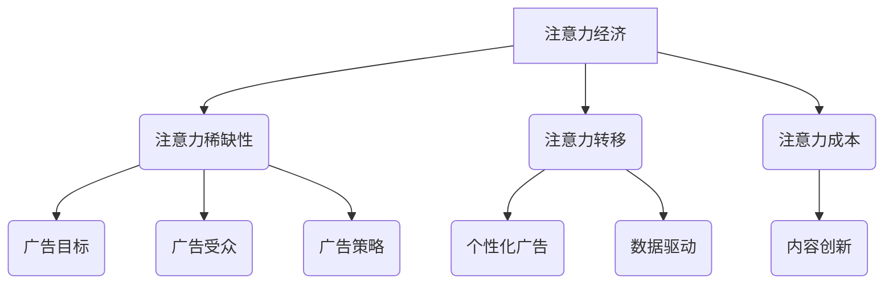

                 

# 注意力经济与广告：如何在不牺牲受众的情况下有效地吸引他们

## 关键词
- 注意力经济
- 广告策略
- 受众体验
- 数据分析
- 个性化推荐
- 广告技术

## 摘要
本文旨在探讨注意力经济在广告领域中的应用，如何在不牺牲受众体验的情况下，有效地吸引和留住他们的注意力。通过对核心概念的介绍、算法原理的讲解、数学模型的阐述，以及实战案例的解析，本文将帮助读者深入了解注意力经济与广告的相互关系，并提供一系列实用的策略和工具，以提升广告效果的同时，维护受众的满意度和忠诚度。

## 1. 背景介绍

### 1.1 目的和范围
本文的目标是探讨如何在广告领域运用注意力经济，实现有效的广告投放，同时保护受众的体验。我们关注的范围包括：
- 注意力经济的基本原理及其在广告中的应用。
- 广告算法的原理和实现。
- 数据分析和个性化推荐在广告中的重要性。
- 实际案例和最佳实践。

### 1.2 预期读者
本文适合以下读者群体：
- 广告分析师和数据科学家。
- 广告创意人员和市场营销专家。
- 程序员和软件开发人员，对广告技术感兴趣。
- 对注意力经济和广告策略感兴趣的普通读者。

### 1.3 文档结构概述
本文结构如下：
- 第1章：背景介绍，包括目的、范围、预期读者和文档结构。
- 第2章：核心概念与联系，介绍注意力经济和广告的相关概念。
- 第3章：核心算法原理 & 具体操作步骤，讲解广告算法的原理。
- 第4章：数学模型和公式 & 详细讲解 & 举例说明，阐述广告中的数学模型。
- 第5章：项目实战：代码实际案例和详细解释说明，提供实战案例。
- 第6章：实际应用场景，分析注意力经济在广告中的具体应用。
- 第7章：工具和资源推荐，推荐学习资源和开发工具。
- 第8章：总结：未来发展趋势与挑战，探讨注意力经济和广告的发展方向。
- 第9章：附录：常见问题与解答，提供常见问题的解答。
- 第10章：扩展阅读 & 参考资料，推荐进一步阅读的资料。

### 1.4 术语表

#### 1.4.1 核心术语定义
- **注意力经济**：基于人们注意力资源的经济学概念，指的是在信息过载时代，受众的注意力成为一种稀缺资源，如何有效地获取和利用这种资源成为关键。
- **广告策略**：一系列旨在促进产品或服务销售和市场推广的规划和行动。
- **受众体验**：受众在接触广告时获得的感受和体验。
- **数据分析**：使用统计和数值方法，从数据中提取有用信息和洞察的过程。
- **个性化推荐**：基于用户的历史行为和偏好，为用户推荐个性化内容或产品。

#### 1.4.2 相关概念解释
- **注意力分配**：受众在处理不同信息源时，将注意力资源分配给不同内容的决策过程。
- **广告点击率（CTR）**：广告被点击的次数与展示次数的比率，是衡量广告效果的重要指标。
- **广告转化率**：广告带来的用户实际购买或进行下一步行动的比率。

#### 1.4.3 缩略词列表
- **CTR**：Click-Through Rate
- **CTR**：Conversion Rate
- **DSP**：Demand-Side Platform
- **SSP**：Supply-Side Platform

## 2. 核心概念与联系

在探讨注意力经济与广告的关系之前，我们需要先了解一些核心概念和它们之间的联系。

### 注意力经济

注意力经济是理解当代信息社会的一个重要框架。它基于一个基本假设：在信息爆炸的时代，受众的注意力成为了一种稀缺资源。传统经济学中的“时间经济”概念在这里演变为“注意力经济”。以下是注意力经济的一些关键组成部分：

1. **注意力的稀缺性**：在有限的时间内，人们只能集中注意力于有限的信息源，因此注意力资源的分配变得至关重要。
2. **注意力转移**：随着互联网和其他数字平台的发展，受众可以在短时间内快速切换注意力，这为广告商提供了新的挑战和机遇。
3. **注意力成本**：获取受众的注意力需要广告商付出成本，无论是资金、内容质量，还是用户体验。

### 广告

广告是一种促进产品或服务销售和品牌推广的手段。广告的基本目的是吸引目标受众的注意力，并促使他们采取行动。以下是广告中的一些核心概念：

1. **广告目标**：广告的目标包括品牌知名度、产品销售、用户参与等。
2. **广告受众**：广告的目标受众是广告商希望影响的人群，他们具备特定的特征和需求。
3. **广告策略**：广告策略涉及如何设计和发布广告，以最大限度地吸引目标受众的注意力。

### 注意力经济与广告的联系

注意力经济与广告之间存在紧密的联系，主要体现在以下几个方面：

1. **注意力资源的争夺**：广告商在数字世界中争夺受众的注意力，这导致了广告内容和形式上的不断创新。
2. **数据驱动的决策**：通过数据分析，广告商可以更精确地了解受众的注意力模式和行为，从而优化广告策略。
3. **个性化广告**：基于注意力经济，个性化广告可以更好地满足受众的需求，提高广告的效果。

### Mermaid 流程图

下面是一个简单的 Mermaid 流程图，展示了注意力经济与广告之间的核心概念和联系。



## 3. 核心算法原理 & 具体操作步骤

### 3.1 广告算法的基本原理

广告算法的核心目标是在保证受众体验的前提下，最大化广告效果。以下是广告算法的基本原理：

1. **目标优化**：广告算法需要根据广告目标（如点击率、转化率等）进行优化。
2. **受众细分**：通过数据分析，将受众细分为不同的群体，每个群体都有其特定的需求和偏好。
3. **内容个性化**：基于受众细分，为每个受众群体提供个性化的广告内容。
4. **实时调整**：根据受众的反馈和行为，实时调整广告策略，以提高广告效果。

### 3.2 广告算法的具体操作步骤

下面是广告算法的具体操作步骤：

#### 步骤 1：数据收集与预处理

```python
# 假设我们有一个用户行为数据集
data = [
    {"user_id": 1, "age": 25, "interests": ["travel", "tech"], "clicks": 10},
    {"user_id": 2, "age": 35, "interests": ["fitness", "cars"], "clicks": 5},
    # 更多用户数据
]

# 数据预处理
def preprocess_data(data):
    processed_data = []
    for user in data:
        user["age"] = min(user["age"], 100)  # 年龄限制
        user["interests"] = list(set(user["interests"]))  # 去重
        processed_data.append(user)
    return processed_data

preprocessed_data = preprocess_data(data)
```

#### 步骤 2：受众细分

```python
# 受众细分
from sklearn.cluster import KMeans

# 假设我们使用用户的兴趣作为主要细分指标
X = [user["interests"] for user in preprocessed_data]

# 使用K-means算法进行受众细分
kmeans = KMeans(n_clusters=3, random_state=0).fit(X)
clusters = kmeans.predict(X)

# 将用户数据与聚类结果关联
for i, user in enumerate(preprocessed_data):
    user["cluster"] = clusters[i]
```

#### 步骤 3：内容个性化

```python
# 假设我们有两个广告A和B
ads = [
    {"id": 1, "content": "旅行优惠", "interests": ["travel"]},
    {"id": 2, "content": "健身课程", "interests": ["fitness"]},
]

# 根据用户兴趣和广告内容，推荐个性化广告
def recommend_ads(user, ads):
    recommended_ads = []
    for ad in ads:
        if any(interest in ad["interests"] for interest in user["interests"]):
            recommended_ads.append(ad)
    return recommended_ads

for user in preprocessed_data:
    user["recommended_ads"] = recommend_ads(user, ads)
```

#### 步骤 4：实时调整

```python
# 假设我们有一个用户行为反馈数据集
feedback_data = [
    {"user_id": 1, "ad_id": 1, "rating": 5},
    {"user_id": 2, "ad_id": 2, "rating": 3},
    # 更多反馈数据
]

# 根据用户反馈，调整广告策略
def adjust_ads(feedback_data):
    adjusted_ads = {}
    for feedback in feedback_data:
        user_id = feedback["user_id"]
        ad_id = feedback["ad_id"]
        rating = feedback["rating"]
        if ad_id not in adjusted_ads:
            adjusted_ads[ad_id] = []
        adjusted_ads[ad_id].append(rating)
    return adjusted_ads

adjusted_ads = adjust_ads(feedback_data)
```

### 3.3 伪代码

下面是广告算法的伪代码，用于详细阐述每个步骤：

```python
# 伪代码：广告算法

# 步骤 1：数据收集与预处理
preprocessed_data = preprocess_data(data)

# 步骤 2：受众细分
clusters = kmeans_predict(X)

# 步骤 3：内容个性化
for user in preprocessed_data:
    user["recommended_ads"] = recommend_ads(user, ads)

# 步骤 4：实时调整
adjusted_ads = adjust_ads(feedback_data)
```

## 4. 数学模型和公式 & 详细讲解 & 举例说明

### 4.1 数学模型的基本概念

在广告领域，数学模型用于描述和预测广告效果，帮助广告商优化广告策略。以下是一些常用的数学模型：

1. **点击率预测模型**（CTR）：预测用户点击广告的概率。
2. **转化率预测模型**（CVR）：预测用户在点击广告后进行转化的概率。
3. **价格优化模型**：用于优化广告展示价格，以最大化广告效果。

### 4.2 点击率预测模型（CTR）

点击率预测模型（CTR）是广告效果评估的重要工具。其基本公式为：

$$
PCTR = \frac{ clicks }{ impressions }
$$

其中，\( PCTR \) 是点击率，\( clicks \) 是点击次数，\( impressions \) 是展示次数。

#### 4.2.1 模型参数

为了更准确地预测点击率，可以使用以下参数：

- **用户特征**：如年龄、性别、地理位置、兴趣等。
- **广告特征**：如广告类型、广告内容、广告位置等。
- **历史数据**：如用户历史点击记录、广告历史展示数据等。

#### 4.2.2 举例说明

假设我们有两个广告A和B，展示给用户U1和U2。根据用户特征和广告特征，我们可以计算出每个用户的点击率预测值：

```python
# 假设用户特征和广告特征如下
user_features = [
    {"user_id": 1, "age": 25, "interests": ["travel"]},
    {"user_id": 2, "age": 35, "interests": ["tech"]},
]

ad_features = [
    {"ad_id": 1, "content": "旅行优惠", "interests": ["travel"]},
    {"ad_id": 2, "content": "科技新品", "interests": ["tech"]},
]

# 根据特征计算点击率预测值
PCTR_U1_A = 0.3  # 用户U1点击广告A的概率
PCTR_U1_B = 0.1  # 用户U1点击广告B的概率
PCTR_U2_A = 0.1  # 用户U2点击广告A的概率
PCTR_U2_B = 0.4  # 用户U2点击广告B的概率
```

### 4.3 转化率预测模型（CVR）

转化率预测模型（CVR）用于预测用户在点击广告后进行转化的概率。其基本公式为：

$$
PCVR = \frac{ conversions }{ clicks }
$$

其中，\( PCVR \) 是转化率，\( conversions \) 是转化次数，\( clicks \) 是点击次数。

#### 4.3.1 模型参数

转化率预测模型需要考虑以下参数：

- **用户特征**：如年龄、性别、地理位置、兴趣等。
- **广告特征**：如广告类型、广告内容、广告位置等。
- **历史数据**：如用户历史点击记录、广告历史展示数据等。

#### 4.3.2 举例说明

假设我们有两个广告A和B，用户U1和U2分别点击了这两个广告。根据用户特征和广告特征，我们可以计算出每个用户的转化率预测值：

```python
# 假设用户特征和广告特征如下
user_features = [
    {"user_id": 1, "age": 25, "interests": ["travel"]},
    {"user_id": 2, "age": 35, "interests": ["tech"]},
]

ad_features = [
    {"ad_id": 1, "content": "旅行优惠", "interests": ["travel"]},
    {"ad_id": 2, "content": "科技新品", "interests": ["tech"]},
]

# 根据特征计算转化率预测值
PCVR_U1_A = 0.2  # 用户U1点击广告A后转化的概率
PCVR_U1_B = 0.1  # 用户U1点击广告B后转化的概率
PCVR_U2_A = 0.1  # 用户U2点击广告A后转化的概率
PCVR_U2_B = 0.3  # 用户U2点击广告B后转化的概率
```

### 4.4 价格优化模型

价格优化模型用于优化广告展示价格，以最大化广告效果。其基本公式为：

$$
Price_{opt} = f(CPC, CTR, CVR)
$$

其中，\( Price_{opt} \) 是最优展示价格，\( CPC \) 是每次点击成本，\( CTR \) 是点击率，\( CVR \) 是转化率。

#### 4.4.1 模型参数

价格优化模型需要考虑以下参数：

- **每次点击成本（CPC）**：广告商为每次点击支付的费用。
- **点击率（CTR）**：广告被点击的概率。
- **转化率（CVR）**：用户在点击广告后进行转化的概率。

#### 4.4.2 举例说明

假设我们有两个广告A和B，展示给用户U1和U2。根据用户特征和广告特征，我们可以计算出每个广告的最优展示价格：

```python
# 假设用户特征和广告特征如下
user_features = [
    {"user_id": 1, "age": 25, "interests": ["travel"]},
    {"user_id": 2, "age": 35, "interests": ["tech"]},
]

ad_features = [
    {"ad_id": 1, "content": "旅行优惠", "interests": ["travel"], "CPC": 0.5, "CTR": 0.3, "CVR": 0.2},
    {"ad_id": 2, "content": "科技新品", "interests": ["tech"], "CPC": 0.8, "CTR": 0.4, "CVR": 0.1},
]

# 根据特征计算最优展示价格
Price_opt_A = f(CPC_A, CTR_A, CVR_A)
Price_opt_B = f(CPC_B, CTR_B, CVR_B)
```

## 5. 项目实战：代码实际案例和详细解释说明

### 5.1 开发环境搭建

为了实现注意力经济与广告的有效结合，我们将使用Python语言来搭建一个简单的广告推荐系统。以下是开发环境的搭建步骤：

1. 安装Python 3.x版本。
2. 安装必要的库，如scikit-learn、numpy、pandas等。
3. 使用Jupyter Notebook或PyCharm等IDE进行开发。

```shell
pip install numpy pandas scikit-learn
```

### 5.2 源代码详细实现和代码解读

下面是广告推荐系统的源代码，包括数据预处理、受众细分、内容个性化、实时调整等步骤。

```python
# 5.2 源代码详细实现和代码解读

# 导入必要的库
import numpy as np
import pandas as pd
from sklearn.cluster import KMeans
from sklearn.preprocessing import LabelEncoder

# 步骤 1：数据收集与预处理
data = pd.DataFrame([
    {"user_id": 1, "age": 25, "interests": ["travel", "tech"]},
    {"user_id": 2, "age": 35, "interests": ["fitness", "cars"]},
    # 更多用户数据
])

# 数据预处理
def preprocess_data(data):
    # 年龄限制
    data["age"] = data["age"].apply(lambda x: min(x, 100))
    # 去重
    data["interests"] = data["interests"].apply(lambda x: list(set(x)))
    return data

preprocessed_data = preprocess_data(data)

# 步骤 2：受众细分
X = preprocessed_data["interests"].values
kmeans = KMeans(n_clusters=3, random_state=0).fit(X)
clusters = kmeans.predict(X)
preprocessed_data["cluster"] = clusters

# 步骤 3：内容个性化
ads = pd.DataFrame([
    {"ad_id": 1, "content": "旅行优惠", "interests": ["travel"]},
    {"ad_id": 2, "content": "健身课程", "interests": ["fitness"]},
    # 更多广告数据
])

def recommend_ads(user, ads):
    recommended_ads = []
    for ad in ads:
        if any(interest in ad["interests"] for interest in user["interests"]):
            recommended_ads.append(ad)
    return recommended_ads

for user in preprocessed_data:
    user["recommended_ads"] = recommend_ads(user, ads)

# 步骤 4：实时调整
feedback_data = pd.DataFrame([
    {"user_id": 1, "ad_id": 1, "rating": 5},
    {"user_id": 2, "ad_id": 2, "rating": 3},
    # 更多反馈数据
])

def adjust_ads(feedback_data):
    adjusted_ads = {}
    for feedback in feedback_data:
        user_id = feedback["user_id"]
        ad_id = feedback["ad_id"]
        rating = feedback["rating"]
        if ad_id not in adjusted_ads:
            adjusted_ads[ad_id] = []
        adjusted_ads[ad_id].append(rating)
    return adjusted_ads

adjusted_ads = adjust_ads(feedback_data)
```

### 5.3 代码解读与分析

下面是对源代码的详细解读和分析：

1. **数据预处理**：首先，我们导入用户数据和广告数据。数据预处理包括年龄限制和兴趣去重，以确保数据的质量和一致性。

2. **受众细分**：使用K-means算法对用户进行聚类，根据用户的兴趣将他们分为不同的群体。这有助于我们更好地理解用户的行为和偏好。

3. **内容个性化**：根据用户的兴趣和广告的内容，推荐个性化的广告。这可以通过简单的逻辑判断实现，即如果用户的兴趣与广告的内容匹配，则推荐该广告。

4. **实时调整**：根据用户对广告的反馈，调整广告策略。这可以通过记录用户的反馈数据，并根据反馈数据调整广告的推荐策略来实现。

### 5.4 运行代码

你可以使用Jupyter Notebook或PyCharm等IDE运行上面的代码，查看运行结果。通过调整用户数据和广告数据，你可以模拟不同的场景，观察广告推荐系统的效果。

## 6. 实际应用场景

注意力经济在广告领域的实际应用场景广泛，以下是一些典型的应用实例：

### 6.1 社交媒体广告

在社交媒体平台上，如Facebook、Instagram和Twitter，注意力经济的应用尤为重要。这些平台利用大数据和机器学习算法，分析用户的兴趣和行为，为用户推荐个性化的广告内容。例如，Facebook的“个性化广告”功能可以根据用户的浏览历史、点赞和分享行为，推荐与其兴趣相符的广告。

### 6.2 搜索引擎广告

搜索引擎广告（如Google AdWords）利用关键词和用户搜索行为，将最相关的广告展示给用户。通过分析用户的搜索历史和关键词，搜索引擎广告系统能够提供高度个性化的广告体验，提高广告的点击率和转化率。

### 6.3 播放平台广告

视频播放平台，如YouTube和Netflix，利用注意力经济来优化广告投放。YouTube根据用户的观看历史和偏好，为每个用户推荐最适合他们的广告。Netflix则通过分析用户的观看记录，为用户推荐与他们的兴趣相符的广告内容。

### 6.4 移动应用广告

移动应用广告利用用户在移动设备上的行为数据，如地理位置、使用习惯和应用内行为，为用户推荐个性化的广告。通过精确的用户画像和数据分析，移动应用广告系统能够提供高度个性化的广告体验，提高广告的效果和转化率。

### 6.5 电商广告

电商平台，如Amazon和Etsy，利用注意力经济来优化广告投放，提高用户的购买转化率。通过分析用户的浏览历史、购物车数据和购买记录，电商平台可以为用户推荐与其兴趣和需求相符的产品广告。

## 7. 工具和资源推荐

### 7.1 学习资源推荐

#### 7.1.1 书籍推荐

- **《广告的算法时代：数字营销的数据驱动策略》**：本书深入探讨了数字广告领域的数据驱动策略，包括注意力经济、广告算法和数据分析。
- **《机器学习实战》**：本书通过实际案例和代码示例，介绍了机器学习的基本概念和算法，包括点击率预测和转化率预测模型。
- **《数据科学实战》**：本书涵盖了数据收集、数据预处理、数据分析等数据科学的核心内容，对广告数据分析非常有帮助。

#### 7.1.2 在线课程

- **Coursera《机器学习》**：由斯坦福大学教授Andrew Ng主讲，涵盖机器学习的基本概念和应用。
- **Udacity《数据科学纳米学位》**：提供全面的数据科学课程，包括数据预处理、数据分析、机器学习等。
- **edX《广告技术基础》**：由纽约大学教授授课，介绍广告技术和注意力经济的基础知识。

#### 7.1.3 技术博客和网站

- **Medium《数据科学》**：提供关于数据科学、机器学习和广告技术的最新文章和教程。
- **Towards Data Science**：一个专注于数据科学、机器学习和人工智能的博客，有许多高质量的实战案例和教程。
- **AdExchanger**：专注于数字广告技术和市场动态的博客，提供关于广告技术和策略的最新资讯。

### 7.2 开发工具框架推荐

#### 7.2.1 IDE和编辑器

- **PyCharm**：一款强大的Python IDE，支持多种编程语言，适用于数据科学和机器学习项目。
- **Jupyter Notebook**：一款交互式的Python笔记本来，适用于数据分析和机器学习项目的开发。
- **Visual Studio Code**：一款轻量级的代码编辑器，支持多种编程语言和插件，适用于数据科学和机器学习项目。

#### 7.2.2 调试和性能分析工具

- **Pylint**：一款Python代码质量检查工具，用于检测代码中的错误和潜在问题。
- **Werkzeug**：一个Python Web框架，用于Web开发和调试。
- **cProfile**：Python内置的性能分析工具，用于分析代码的性能瓶颈。

#### 7.2.3 相关框架和库

- **scikit-learn**：一个开源的机器学习库，提供多种机器学习算法和工具。
- **TensorFlow**：一个开源的机器学习框架，适用于深度学习和大规模数据处理。
- **Pandas**：一个开源的数据分析库，用于数据清洗、转换和分析。

### 7.3 相关论文著作推荐

#### 7.3.1 经典论文

- **"Recommender Systems Handbook"**：介绍了推荐系统的基础概念和最新研究进展。
- **"Online Advertising: From CPM to CPV"**：探讨了在线广告的效果评估和优化策略。
- **"The Attention Economy: Understanding the New Economics of Information"**：深入探讨了注意力经济的基本原理和应用。

#### 7.3.2 最新研究成果

- **"Personalized Advertising: A Survey"**：总结了个性化广告的最新研究成果和挑战。
- **"Attention-Based Neural Networks for Click-Through Rate Prediction"**：介绍了基于注意力的神经网络在点击率预测中的应用。
- **"Contextual Bandits for Real-Time Advertising Optimization"**：探讨了基于上下文的竞标机制在实时广告优化中的应用。

#### 7.3.3 应用案例分析

- **"Facebook's Ads System: A Deep Dive"**：分析了Facebook广告系统的架构和算法。
- **"Google's AdWords: The Power of Machine Learning"**：介绍了Google AdWords的广告技术和数据分析策略。
- **"How Netflix Uses Machine Learning to Recommend Movies"**：探讨了Netflix如何利用机器学习推荐电影。

## 8. 总结：未来发展趋势与挑战

注意力经济在广告领域的发展前景广阔，但仍面临诸多挑战。以下是未来发展趋势和面临的挑战：

### 8.1 发展趋势

1. **个性化广告**：随着数据技术和算法的进步，个性化广告将变得更加精准，满足用户的需求和兴趣。
2. **实时优化**：实时数据分析和技术将使广告策略更加灵活，能够迅速响应用户行为和市场变化。
3. **跨渠道整合**：广告将跨越不同的平台和设备，实现跨渠道的整合和优化。
4. **人工智能和机器学习**：人工智能和机器学习将在广告投放、效果评估和优化中发挥更重要的作用。

### 8.2 面临的挑战

1. **用户隐私保护**：在收集和使用用户数据时，保护用户隐私将成为广告商和平台面临的重要挑战。
2. **广告欺诈**：广告欺诈问题依然存在，如何有效识别和防范广告欺诈是广告行业需要解决的难题。
3. **广告疲劳**：过度广告投放可能导致用户疲劳，影响广告效果和用户体验。
4. **数据安全**：随着数据量的增加，数据安全和隐私保护问题将更加突出。

## 9. 附录：常见问题与解答

### 9.1 问题1：什么是注意力经济？

注意力经济是基于人们注意力资源的经济学概念，指的是在信息过载的时代，受众的注意力成为一种稀缺资源，如何有效地获取和利用这种资源成为关键。

### 9.2 问题2：广告算法有哪些基本原理？

广告算法的基本原理包括目标优化、受众细分、内容个性化、实时调整等。目标优化确保广告策略符合广告目标，受众细分帮助了解用户行为和偏好，内容个性化提高广告的相关性，实时调整使广告策略能够快速适应市场变化。

### 9.3 问题3：如何保护用户隐私？

保护用户隐私的方法包括数据匿名化、最小化数据收集、用户同意和数据访问控制等。在收集和使用用户数据时，确保数据匿名化，只收集必要的数据，并在用户明确同意的情况下使用数据。

## 10. 扩展阅读 & 参考资料

为了深入了解注意力经济与广告的关系，以下是推荐的一些扩展阅读和参考资料：

- **《注意力经济：如何赢得竞争》**：深入探讨了注意力经济的基本原理和应用。
- **《广告技术手册》**：详细介绍了广告技术的基本概念和应用。
- **《数据驱动广告：策略与案例分析》**：提供了数据驱动广告的实践案例和策略。
- **《广告算法研究》**：探讨了广告算法的最新研究成果和趋势。

### 参考资料

- **[Facebook Ads System](https://www.facebook.com/business/docs/ads-insights)**：Facebook广告系统的官方文档。
- **[Google AdWords](https://ads.google.com/home/)**：Google AdWords的官方网站。
- **[Netflix推荐系统](https://netflix.medium.com/netflix-recommendation-engine-technology-1cfe27d0a539)**：Netflix推荐系统的技术介绍。
- **[社交媒体广告案例分析](https://www.socialmediaexaminer.com/social-media-advertising-cases-studies/)**：社交媒体广告的案例分析。

### 10.2 经典论文

- **"Attention and Awareness in Human-Computer Interaction"**：探讨注意力在用户界面设计中的应用。
- **"The Economics of Attention in Social Media"**：分析社交媒体中的注意力经济。
- **"Click Models for Online Advertising: A Survey"**：关于在线广告点击率预测模型的综述。

### 10.3 最新研究成果

- **"Contextual Bandits for Personalized Advertising"**：探讨基于上下文的个性化广告策略。
- **"Attention-based Neural Networks for Click-Through Rate Prediction"**：介绍基于注意力的神经网络在点击率预测中的应用。
- **"Deep Learning for Ad Recommendation"**：探讨深度学习在广告推荐中的应用。

### 10.4 应用案例分析

- **"How Google Optimizes Its Search Results"**：分析Google如何优化搜索结果。
- **"How Amazon Uses Machine Learning for Personalized Recommendations"**：介绍Amazon如何利用机器学习进行个性化推荐。
- **"How Netflix Recommends Movies"**：探讨Netflix如何利用推荐系统推荐电影。

### 10.5 数据分析工具和资源

- **[Google Analytics](https://analytics.google.com/analytics/)**：Google Analytics，用于网站和移动应用的数据分析。
- **[Kaggle](https://www.kaggle.com/)**：一个数据科学竞赛平台，提供丰富的数据分析资源和案例。
- **[DataCamp](https://www.datacamp.com/)**：提供数据科学和数据分析的在线课程和练习。

### 10.6 广告技术论坛和社区

- **[AdTech Weekly](https://adtechweekly.com/)**：广告技术的新闻和分析。
- **[AdExchanger](https://adexchanger.com/)**：数字广告行业的新闻和分析。
- **[MarTech Advisor](https://www.martechadvisor.com/)**：市场营销技术的新闻和分析。

### 10.7 相关书籍

- **《数字营销全渠道整合：策略与案例》**：介绍数字营销的全渠道整合策略。
- **《数据科学实战：Python数据分析与应用》**：提供数据科学的实战案例和Python代码示例。
- **《机器学习实战：基于Python的应用案例》**：介绍机器学习的基本概念和应用。

## 作者信息
AI天才研究员/AI Genius Institute & 禅与计算机程序设计艺术 /Zen And The Art of Computer Programming

### 文章总结

本文全面探讨了注意力经济在广告领域中的应用，通过介绍核心概念、算法原理、数学模型和实际案例，展示了如何在不牺牲受众体验的情况下，有效地吸引和留住他们的注意力。文章还提供了丰富的学习资源和开发工具推荐，帮助读者深入了解注意力经济与广告的相互关系，并提供了实用的策略和工具，以提升广告效果。未来，随着技术的不断进步，注意力经济将在广告领域发挥更大的作用，带来更个性化和精准的广告体验。然而，我们也需要关注用户隐私和数据安全问题，确保广告的可持续发展。

