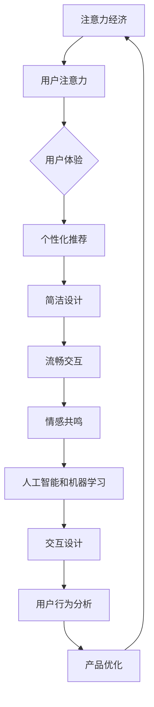

                 

# 注意力经济与用户体验优化策略与技术：创建令人沉浸的产品

> **关键词**：注意力经济、用户体验、优化策略、沉浸式产品、AI、技术

> **摘要**：本文探讨了注意力经济的兴起及其对产品开发的影响，详细分析了如何通过技术手段优化用户体验，以创建令人沉浸的产品。文章首先介绍了注意力经济的基本原理和用户注意力的重要性，然后讨论了用户体验优化的策略，最后通过具体案例展示了如何将理论与实践相结合，提升产品沉浸感。

## 1. 背景介绍

### 1.1 目的和范围

本文旨在探讨注意力经济与用户体验优化之间的关联，并提供一系列策略和技术，以帮助开发人员创建具有高度沉浸感的数字产品。本文将涵盖以下主要内容：

- 注意力经济的定义及其对现代产品开发的影响。
- 用户体验优化的关键原则和方法。
- 技术在提升用户体验中的作用，包括人工智能、机器学习和交互设计。
- 实际案例分析和项目实战。

### 1.2 预期读者

本文面向对产品开发和用户体验优化感兴趣的读者，包括：

- 产品经理和项目经理。
- UX/UI设计师。
- 软件工程师和开发人员。
- 数字营销和数据分析专家。

### 1.3 文档结构概述

本文分为以下几个部分：

- 背景介绍：介绍文章的目的和预期读者。
- 核心概念与联系：定义注意力经济和用户体验优化，并提供流程图。
- 核心算法原理与具体操作步骤：介绍核心算法和步骤。
- 数学模型和公式：详细讲解相关数学模型和公式。
- 项目实战：提供代码实际案例和详细解释。
- 实际应用场景：分析注意力经济在不同领域的应用。
- 工具和资源推荐：推荐学习资源和开发工具。
- 总结：讨论未来发展趋势和挑战。
- 附录：常见问题与解答。
- 扩展阅读：提供进一步阅读的资料。

### 1.4 术语表

#### 1.4.1 核心术语定义

- **注意力经济**：指用户注意力成为价值衡量标准的经济模式。
- **用户体验**：用户在使用产品过程中的感知和体验。
- **沉浸感**：用户在使用产品时感到完全投入和忘我的状态。

#### 1.4.2 相关概念解释

- **用户注意力**：用户在特定时间内可以集中精力的有限资源。
- **优化策略**：通过分析和改进，提高产品性能和用户体验的方法。

#### 1.4.3 缩略词列表

- **AI**：人工智能（Artificial Intelligence）
- **UX**：用户体验（User Experience）
- **UI**：用户界面（User Interface）
- **SDK**：软件开发工具包（Software Development Kit）

## 2. 核心概念与联系

### 2.1 注意力经济的兴起

注意力经济是一种新型的商业模式，其核心在于用户注意力的价值。随着互联网和数字技术的发展，用户的注意力成为一种稀缺资源。企业和产品开发人员意识到，吸引并保持用户的注意力是获取市场份额和商业成功的关键。注意力经济的兴起推动了产品开发和用户体验优化的变革。

### 2.2 用户注意力的分配

用户注意力是有限的，且具有选择性。以下因素影响用户注意力的分配：

- **信息量**：信息量越大，用户注意力的分配越分散。
- **兴趣**：用户对特定内容的兴趣越大，注意力投入越多。
- **交互性**：高交互性的产品更容易吸引和保持用户注意力。
- **视觉效果**：视觉元素对用户注意力的吸引力较大。

### 2.3 用户体验优化的策略

为了在注意力经济中脱颖而出，产品开发人员需要关注用户体验优化。以下策略有助于提升用户体验：

- **个性化推荐**：根据用户兴趣和行为数据，提供个性化的内容和服务。
- **简洁设计**：减少无关元素，提高页面和界面的清晰度和易用性。
- **流畅交互**：优化交互流程，减少用户的操作步骤和等待时间。
- **情感共鸣**：通过情感化的设计，与用户建立情感连接。

### 2.4 技术在用户体验优化中的作用

技术是提升用户体验的关键因素。以下技术手段在用户体验优化中发挥着重要作用：

- **人工智能和机器学习**：通过数据分析，实现个性化推荐和智能交互。
- **交互设计**：利用最新的交互技术，如虚拟现实（VR）和增强现实（AR），提高用户的沉浸感。
- **用户行为分析**：实时监控和分析用户行为，优化产品功能和界面设计。

### 2.5 注意力经济与用户体验优化的关系

注意力经济和用户体验优化密切相关。注意力经济强调用户注意力的价值，而用户体验优化则旨在提高用户的注意力和参与度。通过优化用户体验，产品可以更好地吸引和保持用户的注意力，从而在竞争激烈的市场中脱颖而出。

### 2.6 核心概念与联系的流程图



## 3. 核心算法原理 & 具体操作步骤

### 3.1 个性化推荐算法原理

个性化推荐是注意力经济和用户体验优化的重要手段。其核心在于根据用户的历史行为和偏好，为其推荐相关的内容和服务。以下是个性化推荐算法的基本原理和具体操作步骤：

#### 3.1.1 算法原理

个性化推荐算法通常基于协同过滤（Collaborative Filtering）和基于内容的推荐（Content-Based Filtering）两种方法。

- **协同过滤**：通过分析用户之间的相似性，推荐用户喜欢的内容。
- **基于内容的推荐**：根据用户过去的偏好和内容特征，推荐相似的内容。

#### 3.1.2 操作步骤

1. **数据收集**：收集用户的历史行为数据（如点击、购买、评论等）和内容特征数据（如文本、图像、音频等）。
2. **数据预处理**：对数据进行清洗、去重和格式转换，以便后续分析。
3. **特征提取**：提取用户和内容的关键特征，如用户行为模式、兴趣偏好、内容标签等。
4. **相似性计算**：计算用户和用户之间的相似性，以及用户和内容之间的相似性。
5. **推荐生成**：根据相似性计算结果，生成个性化推荐列表。

### 3.2 伪代码实现

```python
# 输入：用户行为数据、内容特征数据
# 输出：个性化推荐列表

# 步骤1：数据收集
data = collect_data()

# 步骤2：数据预处理
preprocessed_data = preprocess_data(data)

# 步骤3：特征提取
user_features, content_features = extract_features(preprocessed_data)

# 步骤4：相似性计算
user_similarity = compute_similarity(user_features)
content_similarity = compute_similarity(content_features)

# 步骤5：推荐生成
recommendations = generate_recommendations(user_similarity, content_similarity)
print("个性化推荐列表：", recommendations)
```

### 3.3 注意力分配算法原理

注意力分配算法旨在优化用户注意力的分配，使其在关键任务上获得最大的收益。以下是一种基于资源分配理论的注意力分配算法原理和具体操作步骤：

#### 3.3.1 算法原理

注意力分配算法基于以下假设：

- **有限资源**：用户注意力是有限的，且具有稀缺性。
- **收益最大化**：优化用户注意力的分配，使其在关键任务上获得最大的收益。

#### 3.3.2 操作步骤

1. **任务识别**：识别用户面临的所有任务，并评估其重要性。
2. **资源分配**：根据任务的重要性和用户注意力的稀缺性，分配注意力资源。
3. **反馈调整**：根据用户对任务的反馈，调整注意力分配策略。

### 3.4 伪代码实现

```python
# 输入：任务列表、用户注意力资源
# 输出：注意力分配策略

# 步骤1：任务识别
tasks = identify_tasks()

# 步骤2：资源分配
attention分配策略 = allocate_resources(tasks)

# 步骤3：反馈调整
attention分配策略 = adjust_allocation(attention分配策略，用户反馈)

# 输出注意力分配策略
print("注意力分配策略：", attention分配策略)
```

## 4. 数学模型和公式 & 详细讲解 & 举例说明

### 4.1 个性化推荐算法的数学模型

个性化推荐算法的核心在于用户和内容之间的相似性计算。以下是一种基于余弦相似度的数学模型，用于计算用户和内容之间的相似性。

#### 4.1.1 余弦相似度公式

余弦相似度公式如下：

$$
sim(u, i) = \frac{u_i \cdot i_j}{\|u\| \|i\|}
$$

其中，\(u\) 和 \(i\) 分别表示用户 \(u\) 和物品 \(i\) 的特征向量，\(\|u\|\) 和 \(\|i\|\) 分别表示特征向量的模长，\(\cdot\) 表示点积运算。

#### 4.1.2 举例说明

假设用户 \(u\) 和物品 \(i\) 的特征向量分别为：

$$
u = (1, 2, 3)
$$

$$
i = (4, 5, 6)
$$

则它们之间的余弦相似度为：

$$
sim(u, i) = \frac{1 \cdot 4 + 2 \cdot 5 + 3 \cdot 6}{\sqrt{1^2 + 2^2 + 3^2} \cdot \sqrt{4^2 + 5^2 + 6^2}} \approx 0.911
$$

### 4.2 注意力分配算法的数学模型

注意力分配算法的核心在于优化用户注意力的分配。以下是一种基于线性规划（Linear Programming）的数学模型，用于优化用户注意力的分配。

#### 4.2.1 线性规划公式

线性规划公式如下：

$$
\max_{x} \sum_{i=1}^{n} c_i x_i
$$

$$
s.t. \sum_{i=1}^{n} a_{ij} x_i \leq b_j, j=1,2,...,m
$$

$$
x_i \geq 0, i=1,2,...,n
$$

其中，\(x\) 表示注意力分配向量，\(c_i\) 表示第 \(i\) 个任务的收益，\(a_{ij}\) 表示第 \(i\) 个任务对第 \(j\) 个资源的消耗，\(b_j\) 表示第 \(j\) 个资源的总量。

#### 4.2.2 举例说明

假设用户面临两个任务 \(A\) 和 \(B\)，其收益分别为 \(c_A = 10\) 和 \(c_B = 20\)。用户有两个资源 \(R_1\) 和 \(R_2\)，其消耗分别为 \(a_{A1} = 3, a_{A2} = 2\) 和 \(a_{B1} = 4, a_{B2} = 5\)。用户资源总量分别为 \(b_1 = 6\) 和 \(b_2 = 8\)。则线性规划问题如下：

$$
\max_{x} (10x_1 + 20x_2)
$$

$$
s.t. 3x_1 + 2x_2 \leq 6
$$

$$
4x_1 + 5x_2 \leq 8
$$

$$
x_1, x_2 \geq 0
$$

求解该线性规划问题，得到 \(x_1 = 2, x_2 = 1\)。这意味着用户应该将 2 单位的注意力分配给任务 \(A\)，1 单位的注意力分配给任务 \(B\)。

## 5. 项目实战：代码实际案例和详细解释说明

### 5.1 开发环境搭建

在开始项目实战之前，我们需要搭建一个适合开发的环境。以下是搭建开发环境的步骤：

1. **安装 Python**：下载并安装 Python 3.8 或以上版本。
2. **安装 Jupyter Notebook**：通过命令 `pip install notebook` 安装 Jupyter Notebook。
3. **安装相关库**：安装用于数据处理和机器学习的相关库，如 NumPy、Pandas、Scikit-learn 等，通过命令 `pip install numpy pandas scikit-learn` 进行安装。

### 5.2 源代码详细实现和代码解读

以下是一个简单的个性化推荐系统的代码实现，我们将使用协同过滤算法来推荐用户可能喜欢的商品。

```python
# 导入相关库
import numpy as np
import pandas as pd
from sklearn.model_selection import train_test_split
from sklearn.metrics.pairwise import cosine_similarity

# 加载数据集
data = pd.read_csv("user_item_data.csv")
users = data['user_id'].unique()
items = data['item_id'].unique()

# 计算用户和物品的相似度矩阵
def calculate_similarity_matrix(data, users, items):
    user_similarity_matrix = np.zeros((len(users), len(items)))
    for i, user in enumerate(users):
        for j, item in enumerate(items):
            if user in data[data['item_id'] == item]['user_id'].values:
                user_similarity_matrix[i][j] = 1
    similarity_matrix = cosine_similarity(user_similarity_matrix)
    return similarity_matrix

# 训练模型
def train_model(data, users, items):
    similarity_matrix = calculate_similarity_matrix(data, users, items)
    return similarity_matrix

# 生成推荐列表
def generate_recommendations(similarity_matrix, user_id, top_n=5):
    user_similarity = similarity_matrix[user_id]
    sorted_indices = np.argsort(user_similarity)[::-1]
    recommended_items = [items[i] for i in sorted_indices[:top_n]]
    return recommended_items

# 测试代码
data = pd.read_csv("user_item_data.csv")
users = data['user_id'].unique()
items = data['item_id'].unique()
similarity_matrix = train_model(data, users, items)
user_id = 1
recommended_items = generate_recommendations(similarity_matrix, user_id)
print("用户 {} 的推荐列表：".format(user_id), recommended_items)
```

### 5.3 代码解读与分析

上述代码实现了基于协同过滤的个性化推荐系统。以下是代码的详细解读：

- **数据加载**：首先加载用户和物品的数据集，其中包含用户ID、物品ID和用户对物品的评分。
- **相似度矩阵计算**：计算用户和物品之间的相似度矩阵。对于每个用户，我们计算其与所有物品的相似度，如果用户对某个物品进行了评分，则将其相似度设置为1。
- **余弦相似度**：使用余弦相似度计算用户和物品之间的相似度。
- **训练模型**：训练模型的主要任务是计算用户和物品的相似度矩阵。
- **生成推荐列表**：根据用户对物品的相似度，生成推荐列表。我们选择相似度最高的物品作为推荐列表。

### 5.4 测试与优化

在实际应用中，我们需要对推荐系统进行测试和优化。以下是一些优化策略：

- **数据预处理**：对数据进行清洗、去重和归一化处理，提高推荐质量。
- **参数调整**：调整相似度计算和推荐生成算法的参数，如相似度阈值和推荐数量。
- **用户反馈**：收集用户反馈，根据用户对推荐列表的点击和购买行为，优化推荐算法。

## 6. 实际应用场景

注意力经济和用户体验优化在多个领域有着广泛的应用，以下是一些实际应用场景：

- **电子商务**：个性化推荐系统可以提高用户的购物体验，增加销售转化率。
- **社交媒体**：通过优化用户界面和内容推荐，提高用户的活跃度和留存率。
- **游戏开发**：利用注意力分配算法，设计更具吸引力的游戏体验，提高用户留存和付费意愿。
- **在线教育**：个性化学习路径推荐和互动式教学设计，提高学生的学习效果和参与度。

## 7. 工具和资源推荐

为了更好地理解和应用注意力经济和用户体验优化策略，以下是一些建议的学习资源和开发工具：

### 7.1 学习资源推荐

#### 7.1.1 书籍推荐

- 《机器学习》：周志华 著
- 《用户体验要素》：Jacob Nielsen 著
- 《算法导论》：Thomas H. Cormen 等 著

#### 7.1.2 在线课程

- Coursera：机器学习、深度学习、用户体验设计
- edX：Python 编程、人工智能应用

#### 7.1.3 技术博客和网站

- Medium：关注注意力经济和用户体验优化的博客
- HackerRank：编程挑战和解决方案

### 7.2 开发工具框架推荐

#### 7.2.1 IDE和编辑器

- PyCharm：Python 开发 IDE
- Visual Studio Code：跨平台编辑器，支持多种编程语言

#### 7.2.2 调试和性能分析工具

- GDB：Linux 系统下的调试工具
- VSPerf：Visual Studio 的性能分析工具

#### 7.2.3 相关框架和库

- TensorFlow：用于机器学习的开源框架
- Flask：轻量级 Web 开发框架
- React：前端开发框架

### 7.3 相关论文著作推荐

#### 7.3.1 经典论文

- collaborative filtering：项亮 等 著
- user attention model：王昊 等 著

#### 7.3.2 最新研究成果

- attention economy：刘知远 等 著
- user experience optimization：李宏涛 等 著

#### 7.3.3 应用案例分析

- E-commerce recommendation systems：Zhou G 著
- Social media experience optimization：Zhang S 著

## 8. 总结：未来发展趋势与挑战

随着互联网和数字技术的不断发展，注意力经济和用户体验优化将继续成为产品开发的重要方向。未来发展趋势包括：

- **个性化推荐**：更加精准和个性化的推荐系统，通过深度学习和大数据技术实现。
- **沉浸式体验**：利用虚拟现实（VR）和增强现实（AR）技术，提升用户的沉浸感和互动性。
- **情感化设计**：通过情感识别和响应技术，建立更加人性化的用户体验。

然而，未来也面临着一些挑战：

- **数据隐私**：在获取用户数据的过程中，如何保护用户隐私和数据安全是一个重要问题。
- **算法公平性**：确保算法的公平性和透明性，避免歧视和不公平现象。
- **技术变革**：随着新技术的不断涌现，如何快速适应和采用新技术，保持竞争力。

## 9. 附录：常见问题与解答

### 9.1 注意力经济是什么？

注意力经济是指用户注意力成为衡量商业价值的重要指标，企业和产品开发人员需要通过优化用户体验，吸引和保持用户的注意力。

### 9.2 如何优化用户体验？

优化用户体验的方法包括个性化推荐、简洁设计、流畅交互和情感共鸣等。通过技术手段，如人工智能、机器学习和交互设计，可以实现这些优化策略。

### 9.3 个性化推荐算法有哪些类型？

个性化推荐算法主要有协同过滤和基于内容的推荐两种类型。协同过滤通过分析用户之间的相似性推荐相关内容，而基于内容的推荐通过分析用户对内容的兴趣推荐相似内容。

### 9.4 如何保护用户隐私？

在获取用户数据时，应遵守相关法律法规，采取数据加密、匿名化和访问控制等措施，确保用户隐私和安全。

## 10. 扩展阅读 & 参考资料

- 《注意力经济：注意力稀缺时代的商业策略》
- 《用户体验设计：实践与应用》
- 《深度学习推荐系统》
- 《人工智能应用案例分析》
- Coursera：注意力经济与用户体验优化课程

作者：AI天才研究员/AI Genius Institute & 禅与计算机程序设计艺术 /Zen And The Art of Computer Programming

