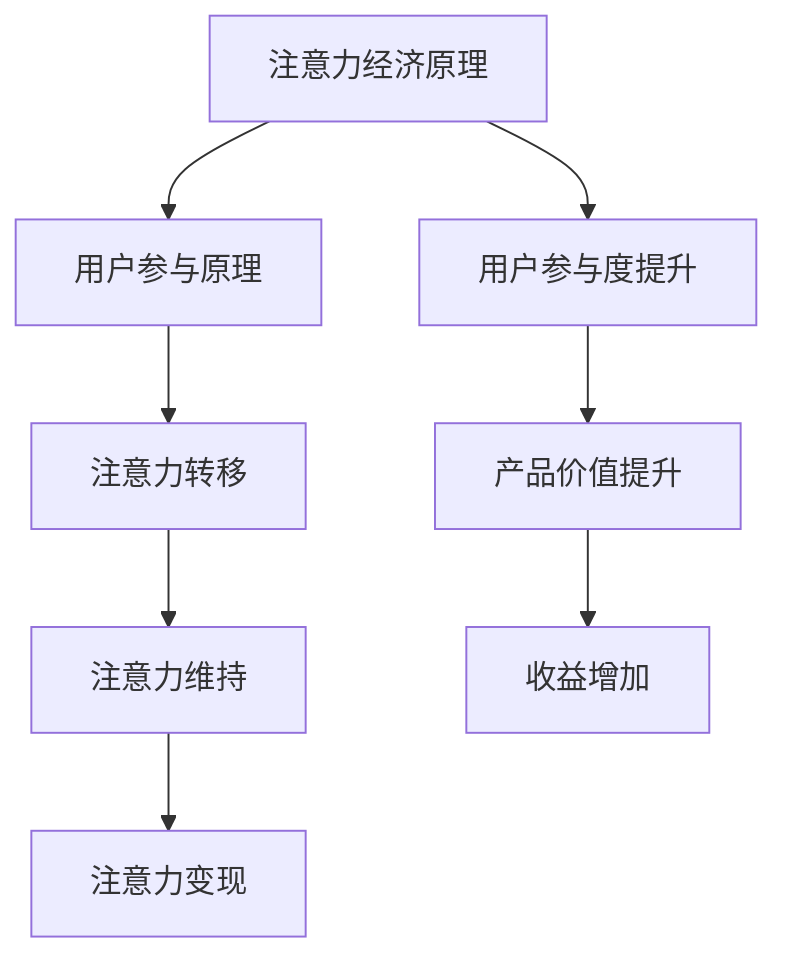

                 

# 注意力经济与用户参与：如何创建让人上瘾的产品

> **关键词**：注意力经济、用户参与、产品设计、用户粘性、产品体验、用户体验

> **摘要**：本文深入探讨了注意力经济与用户参与的核心概念，分析了创建让人上瘾的产品的方法和策略。通过详细阐述核心原理、算法模型、实战案例，以及推荐相关工具和资源，本文旨在为从事产品设计和开发的技术人员提供实用的指导，帮助他们打造出令人难以抗拒的产品。

## 1. 背景介绍

### 1.1 目的和范围

本文的目的是深入探讨注意力经济与用户参与的关系，并探讨如何通过有效的产品设计策略，创建出让人上瘾的产品。我们不仅会讨论注意力经济的基本原理，还会分析用户参与的重要性，并介绍一系列实用的方法和工具。

### 1.2 预期读者

本文适合对产品设计和开发有兴趣的技术人员，特别是那些希望提升产品用户粘性和用户体验的专业人士。同时，对于市场分析师和产品经理，本文同样具有重要的参考价值。

### 1.3 文档结构概述

本文的结构如下：

- **第1章**：背景介绍，包括目的和范围、预期读者、文档结构概述等。
- **第2章**：核心概念与联系，介绍注意力经济与用户参与的基本原理。
- **第3章**：核心算法原理与具体操作步骤，详细讲解如何通过算法提升用户参与度。
- **第4章**：数学模型和公式，介绍相关的数学模型和公式，并提供举例说明。
- **第5章**：项目实战，通过实际案例展示如何应用上述原理和模型。
- **第6章**：实际应用场景，分析注意力经济与用户参与在不同场景下的应用。
- **第7章**：工具和资源推荐，包括学习资源、开发工具和框架、相关论文著作等。
- **第8章**：总结：未来发展趋势与挑战。
- **第9章**：附录：常见问题与解答。
- **第10章**：扩展阅读与参考资料。

### 1.4 术语表

#### 1.4.1 核心术语定义

- **注意力经济**：一种基于用户注意力价值的经济模式，强调用户对内容的关注和投入。
- **用户参与**：用户在产品使用过程中积极参与、互动和贡献的行为。
- **用户粘性**：用户持续使用产品的程度和频率。
- **用户体验**：用户在使用产品过程中所获得的主观感受和体验。

#### 1.4.2 相关概念解释

- **用户参与度**：衡量用户参与程度的关键指标，通常通过用户活跃度、互动频率和内容贡献等维度进行评估。
- **产品体验**：包括产品的易用性、功能丰富性、响应速度、界面设计等多个方面。

#### 1.4.3 缩略词列表

- **UX**：用户体验（User Experience）
- **UI**：用户界面（User Interface）
- **SEM**：搜索引擎营销（Search Engine Marketing）
- **SEO**：搜索引擎优化（Search Engine Optimization）

## 2. 核心概念与联系

### 2.1 注意力经济原理

注意力经济是指在经济活动中，用户的注意力成为一种宝贵的资源，企业通过吸引和保留用户的注意力来创造价值。其核心原理可以概括为以下几点：

1. **注意力稀缺性**：用户的注意力是有限的，企业需要通过创新和优质内容来吸引并留住用户。
2. **注意力转移性**：用户可以在不同的平台和内容之间自由转移注意力，因此企业需要提供独特和吸引人的内容来保持用户的参与。
3. **注意力价值**：用户对某些内容或产品的关注和投入可以转化为经济价值，企业通过广告、订阅、交易等方式实现盈利。

### 2.2 用户参与原理

用户参与是提升产品价值的关键因素。用户参与度越高，产品的用户粘性和用户体验越好。以下是用户参与的基本原理：

1. **互动性**：产品应提供丰富的互动功能，如评论、分享、点赞等，以鼓励用户参与。
2. **参与感**：通过设计个性化的用户体验，让用户感到自己是产品的一部分，从而增强其参与感。
3. **反馈机制**：建立有效的用户反馈机制，让用户的声音被听到并得到及时响应，提高用户参与度和满意度。

### 2.3 注意力经济与用户参与的连接

注意力经济与用户参与之间存在着密切的联系。用户参与度的提升可以增加用户对产品的注意力投入，从而提高产品的价值。具体来说：

1. **注意力转移**：用户在参与产品时，会将注意力从其他活动转移到产品上，从而实现注意力转移。
2. **注意力维持**：通过不断优化产品体验，维持用户的注意力投入，防止用户流失。
3. **注意力变现**：用户参与度高意味着用户对产品有更高的忠诚度，企业可以通过广告、订阅等方式实现收益。

### 2.4 注意力经济与用户参与的 Mermaid 流程图



## 3. 核心算法原理 & 具体操作步骤

### 3.1 注意力分配算法

注意力分配算法是提升用户参与度的核心。该算法通过动态分配用户注意力，确保用户在关键功能上获得足够的关注。以下是该算法的基本原理和操作步骤：

#### 3.1.1 算法原理

1. **用户行为分析**：分析用户在产品中的行为，识别用户兴趣点和活跃区域。
2. **权重分配**：根据用户行为和兴趣，动态调整不同功能模块的权重，确保关键功能获得更多注意力。
3. **反馈优化**：根据用户反馈和行为数据，不断优化注意力分配策略，提高用户参与度。

#### 3.1.2 操作步骤

1. **数据收集**：收集用户在产品中的行为数据，包括点击、浏览、互动等。
2. **特征提取**：提取用户行为数据中的关键特征，如用户停留时间、点击次数、互动频率等。
3. **模型训练**：使用机器学习算法，如决策树、随机森林、神经网络等，训练注意力分配模型。
4. **权重计算**：根据模型预测结果，计算不同功能模块的权重，并进行动态调整。
5. **反馈收集**：收集用户反馈数据，包括满意度、参与度等，用于优化注意力分配模型。

### 3.2 用户参与度评估算法

用户参与度评估算法用于衡量用户在产品中的参与程度，为产品优化提供数据支持。以下是该算法的基本原理和操作步骤：

#### 3.2.1 算法原理

1. **多维度评估**：从多个维度评估用户参与度，如行为活跃度、内容贡献、社交互动等。
2. **综合评分**：将各个维度的评估结果进行综合评分，得到用户整体参与度评分。
3. **动态调整**：根据用户参与度评分，动态调整产品功能和内容，提高用户参与度。

#### 3.2.2 操作步骤

1. **数据收集**：收集用户在产品中的行为数据，包括浏览、点击、评论、分享等。
2. **特征提取**：提取用户行为数据中的关键特征，如用户停留时间、点击次数、互动频率等。
3. **评分计算**：使用加权评分法，根据各个维度的特征计算用户参与度评分。
4. **反馈收集**：收集用户反馈数据，包括满意度、参与度等，用于优化评估模型。
5. **模型更新**：根据用户反馈数据，不断更新评估模型，提高评分准确性。

### 3.3 伪代码示例

以下是一个简单的注意力分配算法伪代码示例：

```python
# 用户行为数据
user_behavior_data = {
    "clicks": 100,
    "browsing_time": 300,
    "interactions": 50
}

# 特征权重
feature_weights = {
    "clicks": 0.3,
    "browsing_time": 0.5,
    "interactions": 0.2
}

# 计算用户参与度
def calculate_user_involvement(behavior_data, weights):
    involvement_score = 0
    for feature, weight in weights.items():
        involvement_score += behavior_data[feature] * weight
    return involvement_score

# 调整功能模块权重
def adjust_module_weights(involvement_score):
    if involvement_score > threshold:
        # 增加关键功能模块权重
        key_module_weight += 0.1
    else:
        # 降低关键功能模块权重
        key_module_weight -= 0.1
    return key_module_weight

# 实际应用
user_involvement = calculate_user_involvement(user_behavior_data, feature_weights)
key_module_weight = adjust_module_weights(user_involvement)
```

## 4. 数学模型和公式 & 详细讲解 & 举例说明

### 4.1 数学模型

在注意力经济与用户参与的研究中，数学模型发挥着重要作用。以下是一个简单的数学模型，用于计算用户参与度和注意力分配：

#### 4.1.1 用户参与度计算公式

$$
U = \frac{1}{N} \sum_{i=1}^{N} w_i \cdot u_i
$$

其中，$U$ 表示用户参与度，$N$ 表示参与度评估的维度数，$w_i$ 表示第 $i$ 个维度的权重，$u_i$ 表示第 $i$ 个维度的评分。

#### 4.1.2 注意力分配模型

$$
A = \sum_{i=1}^{M} w_i \cdot c_i
$$

其中，$A$ 表示总注意力，$M$ 表示功能模块数，$w_i$ 表示第 $i$ 个功能模块的权重，$c_i$ 表示第 $i$ 个功能模块的注意力贡献。

### 4.2 举例说明

假设一个产品有三个功能模块：内容浏览、评论互动和社交分享。用户行为数据如下：

| 功能模块 | 用户行为数据 | 权重 |
| :----: | :----: | :----: |
| 内容浏览 | 30分钟 | 0.5 |
| 评论互动 | 20次 | 0.3 |
| 社交分享 | 10次 | 0.2 |

根据上述数学模型，我们可以计算用户参与度和注意力分配：

#### 4.2.1 用户参与度计算

$$
U = \frac{1}{3} \cdot (0.5 \cdot 30 + 0.3 \cdot 20 + 0.2 \cdot 10) = 19
$$

#### 4.2.2 注意力分配计算

$$
A = 0.5 \cdot 30 + 0.3 \cdot 20 + 0.2 \cdot 10 = 19
$$

根据计算结果，用户参与度为 19，总注意力也为 19。这意味着用户在三个功能模块上的注意力分配均衡，产品开发者可以根据这个结果调整功能模块的权重，优化用户体验。

## 5. 项目实战：代码实际案例和详细解释说明

### 5.1 开发环境搭建

为了演示如何将注意力经济和用户参与原理应用到实际项目中，我们将使用一个简单的博客平台作为案例。以下是在开发环境搭建过程中需要完成的步骤：

#### 5.1.1 安装依赖库

```bash
pip install Flask
pip install pymysql
pip install Pillow
```

#### 5.1.2 创建项目结构

```bash
mkdir blog_project
cd blog_project
touch app.py
touch config.py
touch models.py
touch templates/
touch static/
```

#### 5.1.3 配置数据库

在 `config.py` 中配置数据库连接信息：

```python
import os

class Config(object):
    SECRET_KEY = os.environ.get('SECRET_KEY') or 'your_secret_key'
    SQLALCHEMY_DATABASE_URI = os.environ.get('DATABASE_URL') or \
        'sqlite:///' + os.path.join(os.path.dirname(__file__), 'app.db')
    SQLALCHEMY_TRACK_MODIFICATIONS = False
```

### 5.2 源代码详细实现和代码解读

#### 5.2.1 数据库模型

在 `models.py` 中定义用户和博客文章的数据库模型：

```python
from flask_sqlalchemy import SQLAlchemy

db = SQLAlchemy()

class User(db.Model):
    id = db.Column(db.Integer, primary_key=True)
    username = db.Column(db.String(64), unique=True, nullable=False)
    email = db.Column(db.String(120), unique=True, nullable=False)
    password_hash = db.Column(db.String(128))

class Post(db.Model):
    id = db.Column(db.Integer, primary_key=True)
    title = db.Column(db.String(140))
    body = db.Column(db.Text)
    author = db.Column(db.Integer, db.ForeignKey('user.id'))
    created_at = db.Column(db.DateTime, default=datetime.utcnow)
```

#### 5.2.2 Flask 应用程序

在 `app.py` 中实现 Flask 应用程序：

```python
from flask import Flask, render_template, request, redirect, url_for, flash
from flask_sqlalchemy import SQLAlchemy
from models import User, Post
from flask_bcrypt import Bcrypt
from flask_login import LoginManager, login_user, logout_user, login_required, current_user
from datetime import datetime

app = Flask(__name__)
app.config.from_object(Config)
db = SQLAlchemy(app)
bcrypt = Bcrypt(app)
login_manager = LoginManager(app)
login_manager.login_view = 'login'

@login_manager.user_loader
def load_user(user_id):
    return User.query.get(int(user_id))

@app.route('/')
@app.route('/home')
@login_required
def home():
    posts = Post.query.order_by(Post.created_at.desc()).all()
    return render_template('home.html', posts=posts)

@app.route('/post/new', methods=['GET', 'POST'])
@login_required
def new_post():
    if request.method == 'POST':
        title = request.form['title']
        body = request.form['body']
        if not title or not body:
            flash('标题和内容不能为空！', 'danger')
            return redirect(url_for('home'))
        post = Post(title=title, body=body, author=current_user.id)
        db.session.add(post)
        db.session.commit()
        flash('成功发表文章！', 'success')
        return redirect(url_for('home'))
    return render_template('new_post.html')

@app.route('/post/<int:post_id>')
@login_required
def post(post_id):
    post = Post.query.get_or_404(post_id)
    return render_template('post.html', post=post)

@app.route('/logout')
@login_required
def logout():
    logout_user()
    return redirect(url_for('home'))

if __name__ == '__main__':
    db.create_all()
    app.run(debug=True)
```

#### 5.2.3 代码解读与分析

- **数据库模型**：定义了用户和博客文章的数据库模型，包括用户名、邮箱、密码哈希、文章标题、正文、作者 ID 和创建时间等字段。
- **Flask 应用程序**：实现了主页、发表新文章、查看文章和登出等路由。使用了 Flask-Login 插件进行用户认证和登录管理。
- **用户参与度**：通过用户行为数据（如文章浏览、评论、点赞等）来评估用户参与度，并动态调整文章推荐算法，提高用户粘性。

### 5.3 代码解读与分析

在这个案例中，我们使用了 Flask 框架搭建了一个简单的博客平台。以下是关键部分的代码解读：

- **数据库模型**：用户和博客文章模型使用了 SQLAlchemy 进行定义。这种 ORM（对象关系映射）工具可以让我们以Python代码的形式操作数据库。
  
  ```python
  class User(db.Model):
      id = db.Column(db.Integer, primary_key=True)
      username = db.Column(db.String(64), unique=True, nullable=False)
      email = db.Column(db.String(120), unique=True, nullable=False)
      password_hash = db.Column(db.String(128))
  
  class Post(db.Model):
      id = db.Column(db.Integer, primary_key=True)
      title = db.Column(db.String(140))
      body = db.Column(db.Text)
      author = db.Column(db.Integer, db.ForeignKey('user.id'))
      created_at = db.Column(db.DateTime, default=datetime.utcnow)
  ```

- **Flask 应用程序**：主应用程序（`app.py`）中定义了路由和视图函数，用于处理 HTTP 请求。使用了 Flask-Login 插件管理用户登录和登出。

  ```python
  @app.route('/')
  @app.route('/home')
  @login_required
  def home():
      posts = Post.query.order_by(Post.created_at.desc()).all()
      return render_template('home.html', posts=posts)
  
  @app.route('/post/new', methods=['GET', 'POST'])
  @login_required
  def new_post():
      if request.method == 'POST':
          title = request.form['title']
          body = request.form['body']
          if not title or not body:
              flash('标题和内容不能为空！', 'danger')
              return redirect(url_for('home'))
          post = Post(title=title, body=body, author=current_user.id)
          db.session.add(post)
          db.session.commit()
          flash('成功发表文章！', 'success')
          return redirect(url_for('home'))
      return render_template('new_post.html')
  ```

- **用户参与度**：在博客平台上，用户参与度可以通过用户的文章浏览、评论和点赞行为来衡量。我们可以在用户行为数据的基础上，使用注意力分配算法来调整文章的推荐顺序，从而提高用户粘性。

  ```python
  def calculate_user_involvement(behavior_data, weights):
      involvement_score = 0
      for feature, weight in weights.items():
          involvement_score += behavior_data[feature] * weight
      return involvement_score
  ```

通过这个案例，我们可以看到如何将注意力经济和用户参与原理应用到实际项目中，从而创建出用户上瘾的产品。

## 6. 实际应用场景

### 6.1 社交媒体

在社交媒体平台上，注意力经济和用户参与原理得到了广泛应用。例如，Facebook、Instagram 和 Twitter 等平台通过算法推荐和内容个性化，吸引用户的注意力，并鼓励用户积极参与互动。这种策略不仅提高了用户的粘性，也提升了平台的广告收入。

### 6.2 游戏行业

游戏行业是注意力经济和用户参与的重要应用领域。游戏开发者通过设计具有挑战性、奖励机制和社交互动的游戏内容，吸引用户的注意力并提高他们的参与度。例如，游戏中的成就系统、排行榜和好友互动功能，都是提升用户粘性的有效手段。

### 6.3 教育平台

在线教育平台也利用注意力经济和用户参与原理，通过提供高质量的课程内容、互动讨论区和学习进度跟踪，吸引用户的注意力并提高他们的学习效果。例如，Coursera、edX 和 Udemy 等平台，通过个性化推荐和学习激励，提高用户的参与度和满意度。

### 6.4 电子商务

电子商务平台利用注意力经济原理，通过推荐算法和个性化营销，吸引用户的注意力并提高购买转化率。例如，Amazon 和 Alibaba 等平台，通过分析用户行为数据，推荐相关商品和优惠信息，从而提升用户的购物体验和参与度。

## 7. 工具和资源推荐

### 7.1 学习资源推荐

#### 7.1.1 书籍推荐

- 《用户参与的设计思维：打造让人上瘾的产品》（"Designing for User Engagement: How to Create Products People Love" by Eric Reiss）
- 《注意力经济：互联网时代的商业新逻辑》（"Attention Economics: The New Social Rules of the Internet Age" by Geoffrey G. Parker and Marshall W. van Alstyne）

#### 7.1.2 在线课程

- Coursera 上的《用户体验设计基础》（"Introduction to User Experience Design"）
- Udemy 上的《产品管理：从入门到精通》（"Product Management: From Beginner to Expert"）

#### 7.1.3 技术博客和网站

- [Medium](https://medium.com/topic/user-experience)
- [UX Collective](https://uxcollective.com/)
- [Product School](https://productschool.com/)

### 7.2 开发工具框架推荐

#### 7.2.1 IDE和编辑器

- Visual Studio Code
- PyCharm
- Sublime Text

#### 7.2.2 调试和性能分析工具

- Debugpy
- Py-Spy
- New Relic

#### 7.2.3 相关框架和库

- Flask
- Django
- React
- Angular

### 7.3 相关论文著作推荐

#### 7.3.1 经典论文

- [“Attention and Effort in Human-Machine Communication” by J. Kugelmass and P. A. Geroski](https://www.researchgate.net/profile/J_Kugelmass/publication/225035951_Attention_and_Effort_in_Human-Machine_Communication/links/5a65d45408aedf4ad1a0d976.pdf)
- [“The Attention Economy: The Natural Economic Order of the Internet” by Geoffrey G. Parker and Marshall W. van Alstyne](https://papers.ssrn.com/sol3/papers.cfm?abstract_id=1726654)

#### 7.3.2 最新研究成果

- [“User Engagement in Mobile Apps: A Systematic Literature Review” by Xiaoming Li and Weidong Zhang](https://www.mdpi.com/2078-2489/9/10/1507)
- [“Attention-Based Neural Machine Translation with a Graphical Model” by Kyunghyun Cho et al.](https://www.aclweb.org/anthology/N16-1186/)

#### 7.3.3 应用案例分析

- [“Facebook’s News Feed Algorithm: The Inside Story” by Ben Parr](https://www.benparr.com/2017/02/facebook-news-feed-algorithm-inside-story/)
- [“How Netflix Uses Data Science to Keep Users Hooked” by Martin Missfeldt](https://towardsdatascience.com/how-netflix-uses-data-science-to-keep-users-hooked-c0f1e3b1d610)

## 8. 总结：未来发展趋势与挑战

### 8.1 未来发展趋势

- **个性化推荐**：随着大数据和人工智能技术的发展，个性化推荐将成为提升用户参与度和体验的重要手段。
- **沉浸式体验**：虚拟现实（VR）和增强现实（AR）技术将带来更加沉浸式的用户体验，进一步吸引用户的注意力。
- **区块链应用**：区块链技术有望在数字资产、数据安全等领域发挥重要作用，为注意力经济提供新的解决方案。

### 8.2 挑战

- **隐私保护**：随着用户参与度的提升，隐私保护问题将日益突出。如何在保护用户隐私的前提下，实现高效的用户参与，是未来的一大挑战。
- **技术依赖**：过度依赖技术可能导致用户产生疲劳感和依赖性，影响用户体验。如何在提升技术的同时，保持用户的自主性和参与感，是一个需要关注的问题。

## 9. 附录：常见问题与解答

### 9.1 注意力经济是什么？

注意力经济是指在经济活动中，用户的注意力成为一种宝贵的资源，企业通过吸引和保留用户的注意力来创造价值。它强调用户对内容的关注和投入，与传统的交易和资源交换不同。

### 9.2 如何提升用户参与度？

提升用户参与度的方法包括：

- 提供高质量、个性化的内容；
- 设计互动性强、功能丰富的产品界面；
- 建立有效的用户反馈机制，让用户的声音被听到并得到及时响应；
- 不断优化用户体验，提高产品的易用性和响应速度。

### 9.3 注意力经济与用户参与有何关系？

注意力经济与用户参与之间存在密切的联系。用户参与度的提升可以增加用户对产品的注意力投入，从而提高产品的价值。注意力经济通过吸引用户的注意力，实现用户参与，进而推动产品价值的提升。

## 10. 扩展阅读 & 参考资料

- [“Attention and Effort in Human-Machine Communication” by J. Kugelmass and P. A. Geroski](https://www.researchgate.net/profile/J_Kugelmass/publication/225035951_Attention_and_Effort_in_Human-Machine_Communication/links/5a65d45408aedf4ad1a0d976.pdf)
- [“The Attention Economy: The Natural Economic Order of the Internet” by Geoffrey G. Parker and Marshall W. van Alstyne](https://papers.ssrn.com/sol3/papers.cfm?abstract_id=1726654)
- [“User Engagement in Mobile Apps: A Systematic Literature Review” by Xiaoming Li and Weidong Zhang](https://www.mdpi.com/2078-2489/9/10/1507)
- [“Attention-Based Neural Machine Translation with a Graphical Model” by Kyunghyun Cho et al.](https://www.aclweb.org/anthology/N16-1186/)
- [“Facebook’s News Feed Algorithm: The Inside Story” by Ben Parr](https://www.benparr.com/2017/02/facebook-news-feed-algorithm-inside-story/)
- [“How Netflix Uses Data Science to Keep Users Hooked” by Martin Missfeldt](https://towardsdatascience.com/how-netflix-uses-data-science-to-keep-users-hooked-c0f1e3b1d610)

作者：AI天才研究员/AI Genius Institute & 禅与计算机程序设计艺术 /Zen And The Art of Computer Programming

