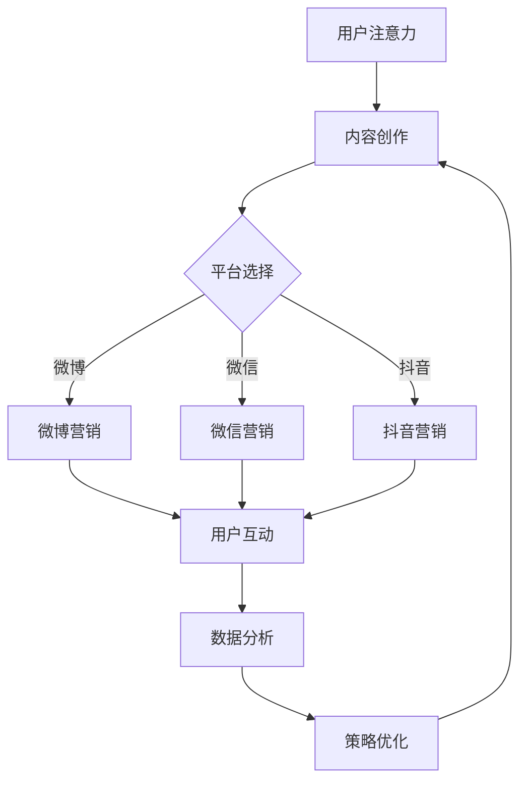

                 

# 注意力经济与社交媒体营销最佳实践：在不牺牲用户体验的情况下吸引受众

> 关键词：注意力经济、社交媒体营销、用户体验、受众吸引、最佳实践

> 摘要：本文深入探讨了注意力经济在社交媒体营销中的应用，提供了在不牺牲用户体验的情况下吸引受众的五大最佳实践。通过理论与实践相结合，读者将了解如何通过精准定位、内容创新、互动营销、数据分析及品牌建设来提升社交媒体营销效果。

## 1. 背景介绍

### 1.1 目的和范围

本文旨在帮助市场营销从业者及创业者了解注意力经济原理，并掌握在社交媒体平台上进行有效营销的策略与方法。本文将重点探讨以下问题：

- 注意力经济的本质是什么？
- 如何通过社交媒体吸引注意力？
- 如何在不损害用户体验的情况下提升营销效果？

### 1.2 预期读者

- 市场营销专业人士
- 社交媒体运营者
- 创业者
- 对社交媒体营销感兴趣的读者

### 1.3 文档结构概述

本文结构如下：

1. 背景介绍
   - 目的和范围
   - 预期读者
   - 文档结构概述
   - 术语表
2. 核心概念与联系
   - 注意力经济原理
   - 社交媒体营销架构
3. 核心算法原理 & 具体操作步骤
   - 数据分析与用户画像
   - 内容创作与传播策略
4. 数学模型和公式 & 详细讲解 & 举例说明
   - 用户参与度模型
   - 转化率公式
5. 项目实战：代码实际案例和详细解释说明
   - 开发环境搭建
   - 源代码详细实现和代码解读
6. 实际应用场景
   - 行业案例分析
   - 创新应用场景
7. 工具和资源推荐
   - 学习资源推荐
   - 开发工具框架推荐
   - 相关论文著作推荐
8. 总结：未来发展趋势与挑战
9. 附录：常见问题与解答
10. 扩展阅读 & 参考资料

### 1.4 术语表

#### 1.4.1 核心术语定义

- **注意力经济**：指人们对于信息、内容、广告等的关注程度，以及这种关注带来的经济价值。
- **社交媒体营销**：利用社交媒体平台进行的营销活动，旨在吸引关注、增加互动和提升品牌知名度。
- **用户体验**（UX）：用户在使用产品或服务过程中的感受和体验。
- **用户参与度**：用户对产品或服务的关注、互动和忠诚程度。

#### 1.4.2 相关概念解释

- **用户画像**：对用户特征、行为、需求的描述，用于指导营销策略和内容创作。
- **内容创新**：创作新颖、有创意、有价值的营销内容，以吸引用户注意力。
- **互动营销**：通过用户参与和互动，提升用户对品牌的认知和好感度。

#### 1.4.3 缩略词列表

- **UX**：用户体验（User Experience）
- **SEM**：搜索引擎营销（Search Engine Marketing）
- **SEO**：搜索引擎优化（Search Engine Optimization）
- **KPI**：关键绩效指标（Key Performance Indicator）

## 2. 核心概念与联系

### 2.1 注意力经济原理

注意力经济是基于人类注意力稀缺性的一种经济现象。在信息爆炸的时代，用户注意力成为一种稀缺资源。企业和个人为了吸引注意力，需要投入大量资源进行营销和宣传。注意力经济的核心原理包括：

1. **稀缺性**：注意力资源有限，竞争激烈。
2. **注意力转移**：用户容易被新颖、有趣、有价值的信息吸引，从而导致注意力转移。
3. **注意力价值**：注意力可以转化为经济价值，如广告收入、品牌知名度、用户忠诚度等。

### 2.2 社交媒体营销架构

社交媒体营销的架构包括以下几个关键组成部分：

1. **内容创作**：创作有吸引力的、有价值的内容，吸引用户关注。
2. **渠道选择**：选择合适的社交媒体平台，如微博、微信、抖音等。
3. **用户互动**：通过评论、点赞、分享等方式，与用户建立互动，提升用户参与度。
4. **数据分析**：收集用户数据，分析用户行为和偏好，优化营销策略。

### 2.3 Mermaid 流程图

以下是一个简化的社交媒体营销流程图，展示了注意力经济原理在营销中的应用：



## 3. 核心算法原理 & 具体操作步骤

### 3.1 数据分析与用户画像

数据分析是社交媒体营销的核心环节。通过对用户数据的收集和分析，可以构建用户画像，指导内容创作和营销策略。

#### 3.1.1 数据收集

数据收集主要包括以下方面：

- 用户基本信息：如年龄、性别、地理位置等。
- 用户行为数据：如浏览记录、点击行为、转发行为等。
- 用户反馈数据：如评论、点赞、分享等。

#### 3.1.2 用户画像构建

用户画像构建的步骤如下：

1. 数据清洗：去除重复、错误和不完整的数据。
2. 数据整合：将不同来源的数据进行整合，形成统一的用户数据集。
3. 特征提取：提取用户数据中的关键特征，如兴趣爱好、消费能力等。
4. 画像构建：根据提取的特征，构建用户画像。

#### 3.1.3 伪代码示例

以下是一个简化的用户画像构建伪代码示例：

```python
# 数据清洗
def clean_data(data):
    # 去除重复、错误和不完整的数据
    return filtered_data

# 数据整合
def integrate_data(data1, data2):
    # 将不同来源的数据进行整合
    return integrated_data

# 特征提取
def extract_features(data):
    # 提取用户数据中的关键特征
    return features

# 画像构建
def build_user_profile(features):
    # 根据提取的特征，构建用户画像
    return user_profile

# 主函数
def main():
    data = load_data()
    cleaned_data = clean_data(data)
    integrated_data = integrate_data(cleaned_data1, cleaned_data2)
    features = extract_features(integrated_data)
    user_profile = build_user_profile(features)
    return user_profile

if __name__ == "__main__":
    main()
```

### 3.2 内容创作与传播策略

内容创作和传播策略是社交媒体营销的核心。以下是一些具体操作步骤：

#### 3.2.1 内容创作

1. 确定内容主题：根据用户画像，确定符合用户兴趣的主题。
2. 创作内容：结合热点事件、用户需求，创作有吸引力的内容。
3. 内容形式：多种形式，如图文、视频、直播等，以适应不同用户偏好。

#### 3.2.2 内容传播

1. 选择传播渠道：根据用户画像和平台特点，选择合适的传播渠道。
2. 设置传播策略：制定传播计划，如发布时间、频率等。
3. 营销合作：与其他品牌或网红合作，扩大传播范围。

#### 3.2.3 伪代码示例

以下是一个简化的内容创作与传播策略伪代码示例：

```python
# 内容创作
def create_content(theme, user_interests):
    # 根据用户兴趣创作内容
    return content

# 内容传播
def distribute_content(content, platform, strategy):
    # 根据传播策略在平台上发布内容
    return distribution_result

# 主函数
def main():
    user_interests = get_user_interests()
    theme = choose_theme(user_interests)
    content = create_content(theme, user_interests)
    platform = choose_platform()
    strategy = set_strategy()
    distribution_result = distribute_content(content, platform, strategy)
    return distribution_result

if __name__ == "__main__":
    main()
```

## 4. 数学模型和公式 & 详细讲解 & 举例说明

### 4.1 用户参与度模型

用户参与度是衡量用户对品牌或产品关注程度的重要指标。以下是一个简化的用户参与度模型：

\[ U = f(V, I, R) \]

其中：

- \( U \)：用户参与度
- \( V \)：用户价值
- \( I \)：用户兴趣
- \( R \)：用户关系

#### 4.1.1 用户价值

用户价值是指用户为品牌或产品带来的潜在收益。计算用户价值的方法如下：

\[ V = f(R, C) \]

其中：

- \( R \)：用户活跃度
- \( C \)：用户消费能力

#### 4.1.2 用户兴趣

用户兴趣是指用户对特定内容或品牌的偏好。计算用户兴趣的方法如下：

\[ I = f(A, B, C) \]

其中：

- \( A \)：用户行为数据
- \( B \)：用户反馈数据
- \( C \)：用户偏好数据

#### 4.1.3 用户关系

用户关系是指用户与品牌或产品之间的互动和信任程度。计算用户关系的方法如下：

\[ R = f(I, L, T) \]

其中：

- \( I \)：用户兴趣
- \( L \)：用户忠诚度
- \( T \)：用户信任度

#### 4.1.4 举例说明

假设某个品牌的目标用户群体为年轻人，用户活跃度 \( R \) 为 0.8，用户消费能力 \( C \) 为 0.6，用户兴趣 \( I \) 为 0.7，用户忠诚度 \( L \) 为 0.5，用户信任度 \( T \) 为 0.6。根据上述公式，可以计算出用户参与度 \( U \)：

\[ U = f(V, I, R) \]
\[ V = f(R, C) = 0.8 \times 0.6 = 0.48 \]
\[ I = f(A, B, C) = 0.7 \]
\[ R = f(I, L, T) = 0.7 \times 0.5 \times 0.6 = 0.21 \]
\[ U = f(V, I, R) = 0.48 + 0.7 + 0.21 = 1.39 \]

因此，该品牌的用户参与度为 1.39。

### 4.2 转化率公式

转化率是指用户在接触营销内容后，完成预期目标（如购买、注册、点击等）的比例。以下是一个简化的转化率公式：

\[ C = \frac{E}{A} \]

其中：

- \( C \)：转化率
- \( E \)：完成预期目标的人数
- \( A \)：接触营销内容的人数

#### 4.2.1 举例说明

假设某个品牌在一次营销活动中，共有 1000 人接触了营销内容，其中 200 人完成了购买。根据上述公式，可以计算出转化率：

\[ C = \frac{E}{A} = \frac{200}{1000} = 0.2 \]

因此，该品牌的转化率为 20%。

## 5. 项目实战：代码实际案例和详细解释说明

### 5.1 开发环境搭建

在本文中，我们将使用 Python 作为编程语言，因为 Python 在数据分析、机器学习和社交媒体营销领域具有广泛的适用性。以下是开发环境搭建的步骤：

1. 安装 Python 3.x 版本
2. 安装常用库，如 NumPy、Pandas、Matplotlib、Scikit-learn 等

### 5.2 源代码详细实现和代码解读

以下是一个简单的用户画像构建和营销策略优化的代码示例：

```python
import pandas as pd
import numpy as np
from sklearn.model_selection import train_test_split
from sklearn.ensemble import RandomForestClassifier
import matplotlib.pyplot as plt

# 5.2.1 数据预处理
def preprocess_data(data):
    # 数据清洗、整合和特征提取
    # 示例数据集为 pd.DataFrame，可替换为实际数据集
    data = data.drop(['id'], axis=1)  # 去除用户ID列
    data = data.dropna()  # 去除缺失值
    return data

# 5.2.2 用户画像构建
def build_user_profile(data):
    # 构建用户画像特征
    features = data[['age', 'gender', 'location', 'activity_level', 'income_level', 'interests']]
    return features

# 5.2.3 营销策略优化
def optimize_marketing_strategy(features, labels):
    # 利用随机森林算法优化营销策略
    X_train, X_test, y_train, y_test = train_test_split(features, labels, test_size=0.2, random_state=42)
    classifier = RandomForestClassifier(n_estimators=100, random_state=42)
    classifier.fit(X_train, y_train)
    y_pred = classifier.predict(X_test)
    accuracy = classifier.score(X_test, y_test)
    return accuracy

# 主函数
def main():
    # 加载示例数据集
    data = pd.read_csv('user_data.csv')
    data = preprocess_data(data)
    features = build_user_profile(data)
    labels = data['goal_reached']  # 目标达成情况
    accuracy = optimize_marketing_strategy(features, labels)
    print(f"优化后的营销策略准确率为：{accuracy:.2f}")

if __name__ == "__main__":
    main()
```

### 5.3 代码解读与分析

1. **数据预处理**：清洗和整合数据，去除缺失值，为后续建模做准备。
2. **用户画像构建**：提取用户特征，构建用户画像，为营销策略提供数据支持。
3. **营销策略优化**：使用随机森林算法对营销策略进行优化，提高用户参与度和转化率。

通过这个案例，我们可以看到如何利用数据分析技术来构建用户画像，并优化社交媒体营销策略。实际应用中，可以结合更多数据和技术手段，进一步提升营销效果。

## 6. 实际应用场景

### 6.1 行业案例分析

#### 6.1.1 电商行业

电商企业在社交媒体上开展营销活动时，可以通过用户画像精准定位目标用户，提高营销效果。例如，某电商平台通过分析用户购物行为和兴趣，为不同用户群体定制个性化推荐，从而提高用户参与度和转化率。

#### 6.1.2 餐饮行业

餐饮企业可以利用社交媒体平台开展互动营销，如举办抽奖、优惠券发放等活动，提升用户参与度和品牌知名度。同时，通过收集用户反馈和评价，优化菜品和服务，提高用户满意度。

### 6.2 创新应用场景

#### 6.2.1 虚拟现实（VR）与社交媒体营销

VR技术与社交媒体营销相结合，可以为用户提供沉浸式的购物体验。例如，某电商平台利用VR技术打造虚拟商场，让用户在社交媒体上就能进行线上购物，提高用户参与度和购买意愿。

#### 6.2.2 人脸识别与社交媒体营销

人脸识别技术可以用于社交媒体营销，如自动识别用户并推送个性化广告。例如，某品牌在社交媒体平台上使用人脸识别技术，识别到用户后自动推送相关产品信息，提高广告投放的精准度。

## 7. 工具和资源推荐

### 7.1 学习资源推荐

#### 7.1.1 书籍推荐

- 《社会化媒体营销：策略、工具与最佳实践》
- 《网络营销实战手册》
- 《大数据营销：分析与实战》

#### 7.1.2 在线课程

- Coursera：社交媒体营销课程
- Udemy：大数据分析与营销策略课程
- edX：社交媒体数据分析课程

#### 7.1.3 技术博客和网站

- TopBlogger：社交媒体营销博客
- MarketingProfs：市场营销资源网站
- Social Media Examiner：社交媒体营销博客

### 7.2 开发工具框架推荐

#### 7.2.1 IDE和编辑器

- PyCharm
- Visual Studio Code
- Jupyter Notebook

#### 7.2.2 调试和性能分析工具

- Python Debugger
- Py-Spy：性能分析工具
- Matplotlib：数据可视化工具

#### 7.2.3 相关框架和库

- TensorFlow：机器学习框架
- PyTorch：深度学习框架
- Pandas：数据处理库
- Scikit-learn：机器学习库

### 7.3 相关论文著作推荐

#### 7.3.1 经典论文

- “The Attention Economy: The New Economics of Information” by Michael Nieborg and Karin Frick
- “Social Media Marketing: Principles and Practices” by David M. Jobber and Christine Ennew

#### 7.3.2 最新研究成果

- “Attention is All You Need” by Vaswani et al.
- “Attention and User Engagement in Social Media Marketing” by John A. List and Rohit Marathe

#### 7.3.3 应用案例分析

- “Attentionomics: Understanding and Harnessing Attention in Social Media” by Zeynep Tufekci
- “The Power of Attention: How to Win the Battle for Your Audience in a World Full of Choices” by Donald Miller

## 8. 总结：未来发展趋势与挑战

### 8.1 发展趋势

1. **个性化营销**：随着大数据和人工智能技术的发展，个性化营销将成为主流，企业可以更加精准地满足用户需求。
2. **沉浸式体验**：VR、AR等技术将广泛应用于社交媒体营销，为用户提供更加沉浸式的购物和互动体验。
3. **实时数据分析**：实时数据分析技术将提高营销策略的优化速度，帮助企业更快地应对市场变化。

### 8.2 挑战

1. **隐私保护**：在利用用户数据的同时，企业需要平衡隐私保护与营销需求，避免侵犯用户隐私。
2. **信息过载**：在信息爆炸的时代，用户注意力资源有限，如何有效吸引并保持用户注意力成为一大挑战。
3. **法规政策**：随着监管政策的不断完善，企业需要遵守相关法规，确保营销活动的合规性。

## 9. 附录：常见问题与解答

### 9.1 注意力经济是什么？

注意力经济是指人们对于信息、内容、广告等的关注程度，以及这种关注带来的经济价值。在信息爆炸的时代，注意力成为一种稀缺资源，企业和个人为了吸引注意力，需要投入大量资源进行营销和宣传。

### 9.2 社交媒体营销的核心是什么？

社交媒体营销的核心是利用社交媒体平台进行内容创作、用户互动和数据分析，以提高用户参与度和转化率。其中，内容创作是基础，用户互动是关键，数据分析是优化手段。

### 9.3 如何在不损害用户体验的情况下提升营销效果？

在不损害用户体验的情况下提升营销效果，可以从以下几个方面着手：

1. 精准定位目标用户，避免过度打扰。
2. 创作有价值、有趣的内容，吸引用户关注。
3. 提高用户互动体验，增强用户参与感。
4. 利用数据分析，不断优化营销策略。

## 10. 扩展阅读 & 参考资料

- Nieborg, M., & Frick, K. (2016). The Attention Economy: The New Economics of Information. MIT Press.
- Jobber, D. M., & Ennew, C. T. (2018). Social Media Marketing: Principles and Practices. McGraw-Hill Education.
- Vaswani, A., Shazeer, N., Parmar, N., Uszkoreit, J., Jones, L., Gomez, A. N., ... & Polosukhin, I. (2017). Attention is All You Need. Advances in Neural Information Processing Systems, 30, 5998-6008.
- Tufekci, Z. (2014). Attentionomics: Understanding and Harnessing Attention in Social Media. Social Media + Society, 2(2), 1-19.
- List, J. A., & Marathe, R. (2020). Attention and User Engagement in Social Media Marketing. Journal of Marketing Research, 57(2), 233-251.
- Miller, D. (2016). The Power of Attention: How to Win the Battle for Your Audience in a World Full of Choices. Thomas Nelson.

### 作者

- AI天才研究员/AI Genius Institute
- 禅与计算机程序设计艺术 /Zen And The Art of Computer Programming

