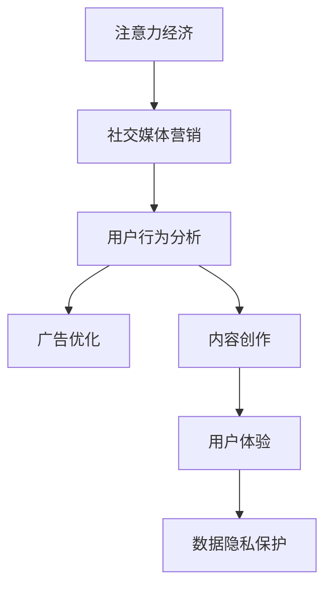

                 

# 注意力经济与社交媒体营销：在不牺牲用户体验的情况下有效吸引受众

> **关键词：** 注意力经济，社交媒体营销，用户体验，算法，用户行为分析，数据隐私，广告优化，内容创作

> **摘要：** 在当今数字时代，注意力经济已成为企业获取用户关注的焦点。本文探讨了注意力经济的核心概念，分析了社交媒体营销中如何在不牺牲用户体验的情况下，利用算法和用户行为数据有效吸引和保留受众。文章还讨论了相关挑战，并提出了未来发展的方向和策略。

## 1. 背景介绍

### 1.1 目的和范围

本文旨在探讨注意力经济在社交媒体营销中的应用，以及如何在不牺牲用户体验的前提下，通过算法和用户行为分析，实现有效营销。文章将涵盖以下内容：

1. **注意力经济的概念和原理**：介绍注意力经济的基本概念，分析其如何影响社交媒体营销。
2. **社交媒体营销的现状和挑战**：探讨当前社交媒体营销的趋势，以及面临的挑战。
3. **用户行为分析的方法和工具**：介绍如何通过用户行为数据进行分析，以及相关的工具和算法。
4. **广告优化和内容创作的策略**：讨论如何优化广告投放，创作吸引受众的内容。
5. **数据隐私和保护**：分析数据隐私的重要性，探讨如何在保护用户隐私的同时进行有效的营销。
6. **未来发展趋势与挑战**：预测注意力经济和社交媒体营销的未来发展趋势，并提出相应的策略。

### 1.2 预期读者

本文适用于以下读者：

1. 希望了解注意力经济和社交媒体营销概念的初学者。
2. 想要提升社交媒体营销效果的营销人员。
3. 对算法和用户行为分析感兴趣的工程师和数据科学家。
4. 想要在未来从事注意力经济相关领域的研究者和从业者。

### 1.3 文档结构概述

本文分为以下几个部分：

1. **背景介绍**：介绍本文的目的和范围，预期读者，以及文档结构。
2. **核心概念与联系**：介绍注意力经济和社交媒体营销的核心概念，并提供流程图。
3. **核心算法原理 & 具体操作步骤**：详细讲解核心算法原理，并提供伪代码。
4. **数学模型和公式 & 详细讲解 & 举例说明**：介绍相关的数学模型和公式，并提供实例。
5. **项目实战：代码实际案例和详细解释说明**：提供实际代码案例，并进行详细解释。
6. **实际应用场景**：讨论注意力经济和社交媒体营销的实际应用场景。
7. **工具和资源推荐**：推荐学习资源和开发工具。
8. **总结：未来发展趋势与挑战**：总结本文内容，并预测未来发展趋势和挑战。
9. **附录：常见问题与解答**：回答读者可能关心的问题。
10. **扩展阅读 & 参考资料**：提供进一步学习的资料。

### 1.4 术语表

#### 1.4.1 核心术语定义

- **注意力经济**：指用户在信息泛滥的环境中，选择关注和投入精力的经济行为。
- **社交媒体营销**：利用社交媒体平台进行品牌推广、用户互动和销售的活动。
- **用户体验**：用户在使用产品或服务过程中的感受和体验。
- **算法**：用于解决问题的一系列规则或步骤。
- **用户行为分析**：通过收集和分析用户行为数据，了解用户需求和行为模式。

#### 1.4.2 相关概念解释

- **用户行为数据**：包括用户的浏览历史、点击行为、搜索记录等。
- **算法优化**：通过调整算法参数，提高算法的性能和效果。
- **内容创作**：创作能够吸引目标受众的内容，包括文章、图片、视频等。
- **广告投放**：在社交媒体平台上进行广告的展示和投放。

#### 1.4.3 缩略词列表

- **SEO**：搜索引擎优化（Search Engine Optimization）
- **SEM**：搜索引擎营销（Search Engine Marketing）
- **CPC**：每次点击付费（Cost Per Click）
- **CPM**：每次千次展示付费（Cost Per Mille）

## 2. 核心概念与联系

### 2.1 注意力经济的基本原理

注意力经济是基于这样一种理念：在信息过载的时代，用户的注意力是稀缺资源，而能够吸引和保持用户注意力的内容和服务则具有巨大的价值。注意力经济的主要原理可以概括为以下几点：

1. **信息过载**：随着互联网和移动设备的普及，用户每天面临的信息量巨大，这导致了用户的注意力分散。
2. **注意力稀缺**：在有限的时间内，用户只能选择关注有限的内容和服务。
3. **注意力价值**：能够吸引并保持用户注意力的内容和服务，可以带来流量、用户参与和品牌忠诚度。
4. **注意力转移**：用户可能会因为新的内容、产品或服务而转移注意力，这对企业来说是一个挑战。

### 2.2 社交媒体营销的现状与挑战

社交媒体营销已成为现代营销的重要组成部分。随着社交媒体平台的多样化和发展，营销策略也在不断演变。当前社交媒体营销面临以下挑战：

1. **用户分散**：用户在多个社交媒体平台上活动，如何在一个平台上吸引和留住用户成为难题。
2. **内容泛滥**：社交媒体上的内容数量庞大，如何从海量内容中脱颖而出，吸引用户关注，是营销人员面临的一大挑战。
3. **数据隐私**：用户对隐私的关注日益增加，如何在收集和使用用户数据时保护用户隐私，成为企业需要解决的问题。
4. **广告效果评估**：如何衡量广告的效果，提高广告的投资回报率（ROI），是营销人员需要考虑的问题。

### 2.3 用户行为分析的方法和工具

用户行为分析是社交媒体营销的核心环节，通过分析用户的行为数据，可以了解用户的需求和偏好，从而优化营销策略。常用的用户行为分析方法包括：

1. **数据分析**：通过统计用户的行为数据，如浏览量、点击量、分享量等，分析用户的行为模式和偏好。
2. **机器学习**：利用机器学习算法，对用户行为数据进行分类、聚类和预测，从而识别潜在的用户群体和需求。
3. **用户画像**：基于用户的行为数据和社交信息，构建用户画像，了解用户的兴趣、需求和行为习惯。

### 2.4 广告优化和内容创作的策略

在注意力经济中，广告优化和内容创作至关重要。以下是一些关键策略：

1. **目标受众定位**：明确目标受众，了解他们的兴趣、需求和偏好，从而创作出符合他们需求的内容。
2. **内容多样化**：创作多种形式的内容，如图文、视频、直播等，以满足不同用户的需求。
3. **互动营销**：通过互动活动，如问答、投票、评论等，提高用户参与度。
4. **广告投放优化**：利用算法和数据分析，优化广告的投放策略，提高广告的展示效果和转化率。

### 2.5 数据隐私和保护

在社交媒体营销中，数据隐私和保护是一个重要问题。以下是一些关键策略：

1. **透明度**：向用户明确说明数据收集的目的和使用方式，提高用户对数据的信任。
2. **安全措施**：采用加密、访问控制等安全措施，保护用户数据的安全。
3. **法规遵守**：遵守相关的数据保护法规，如《通用数据保护条例》（GDPR）等。
4. **用户授权**：在收集和使用用户数据时，尊重用户的授权，避免未经用户同意的数据收集和使用。

### 2.6 注意力经济与社交媒体营销的流程图

下面是一个简单的注意力经济与社交媒体营销的流程图，展示了各个核心概念和环节之间的联系：



### 2.7 用户体验的重要性

用户体验（UX）在注意力经济和社交媒体营销中起着至关重要的作用。良好的用户体验可以提升用户满意度，增加用户忠诚度，从而提高品牌的竞争优势。以下是一些关键因素：

1. **界面设计**：简洁、直观的界面设计可以降低用户的学习成本，提高用户的使用效率。
2. **响应速度**：快速响应可以减少用户的等待时间，提高用户满意度。
3. **个性化体验**：根据用户的需求和偏好，提供个性化的内容和推荐，增强用户的参与感。
4. **易用性**：产品的易用性是用户体验的核心，通过优化交互设计，提高用户的满意度。
5. **服务体验**：优质的售后服务可以提升用户的整体体验，增加用户的信任和忠诚度。

### 2.8 注意力经济的应用场景

注意力经济在社交媒体营销中的应用非常广泛，以下是一些常见的应用场景：

1. **广告投放**：通过分析用户行为数据，精准定位目标受众，提高广告的投放效果。
2. **内容推荐**：基于用户的兴趣和行为数据，推荐相关的内容，提升用户的参与度。
3. **用户增长**：通过有效的营销策略，吸引新用户，提高用户数量。
4. **品牌推广**：利用社交媒体平台，提升品牌知名度和影响力。
5. **市场调研**：通过用户行为数据分析，了解市场趋势和用户需求，为决策提供支持。

### 2.9 注意力经济的挑战与未来趋势

尽管注意力经济在社交媒体营销中具有巨大的潜力，但也面临着一些挑战。以下是一些主要挑战和未来趋势：

1. **挑战**：
   - **用户隐私**：用户对隐私的关注日益增加，如何在保护用户隐私的同时进行有效的营销，是一个重要挑战。
   - **信息过载**：用户在信息过载的环境中，如何有效筛选和吸引注意力，是营销人员需要解决的问题。
   - **算法偏见**：算法可能存在偏见，导致数据分析和决策的不公平性。

2. **未来趋势**：
   - **数据隐私保护**：随着数据隐私法规的加强，企业需要更加重视数据隐私保护，确保用户数据的合法性和安全性。
   - **个性化营销**：通过更加精准的用户行为分析和数据分析，实现更加个性化的营销策略。
   - **跨平台整合**：整合多个社交媒体平台的数据和资源，实现更加全面和有效的营销。

## 3. 核心算法原理 & 具体操作步骤

### 3.1 用户行为分析算法

用户行为分析是注意力经济和社交媒体营销的核心环节，通过分析用户的行为数据，可以了解用户的需求和偏好，从而优化营销策略。以下是一个简单的用户行为分析算法，包括数据收集、数据预处理、特征提取和模型训练等步骤：

#### 3.1.1 数据收集

首先，需要收集用户的行为数据，如浏览历史、点击记录、搜索关键词等。这些数据可以从社交媒体平台、网站日志、第三方数据提供商等渠道获取。

```python
# 数据收集示例代码
data = {
    'user_id': 1,
    'visit_count': 10,
    'click_count': 5,
    'search_keywords': ['apple', 'iphone', 'macbook'],
    'visit_history': ['product_page', 'home_page', 'cart_page'],
    'purchase_history': ['iphone_13', 'macbook_pro']
}
```

#### 3.1.2 数据预处理

在收集到用户行为数据后，需要对数据进行预处理，包括数据清洗、数据格式转换和缺失值处理等。

```python
# 数据预处理示例代码
import pandas as pd

# 数据清洗
data = pd.DataFrame(data)
data.dropna(inplace=True)

# 数据格式转换
data['visit_history'] = data['visit_history'].apply(lambda x: x.split(','))

# 缺失值处理
data.fillna({'visit_count': 0, 'click_count': 0}, inplace=True)
```

#### 3.1.3 特征提取

接下来，从预处理后的数据中提取特征，用于训练机器学习模型。常见的特征包括用户属性、行为特征、内容特征等。

```python
# 特征提取示例代码
from sklearn.preprocessing import LabelEncoder

# 用户属性特征
label_encoder = LabelEncoder()
data['user_id'] = label_encoder.fit_transform(data['user_id'])

# 行为特征
data['average_visit_time'] = data['visit_count'] / data['search_keywords'].str.len()

# 内容特征
data['search_keyword_frequency'] = data['search_keywords'].str.join('|').str.len()
```

#### 3.1.4 模型训练

最后，使用提取到的特征训练机器学习模型，如决策树、随机森林、支持向量机等。

```python
# 模型训练示例代码
from sklearn.ensemble import RandomForestClassifier

# 分割数据集
X = data.drop(['target'], axis=1)
y = data['target']

# 训练模型
model = RandomForestClassifier()
model.fit(X, y)
```

### 3.2 广告优化算法

广告优化是社交媒体营销中至关重要的一环，通过优化广告投放策略，可以提高广告的展示效果和转化率。以下是一个简单的广告优化算法，包括目标设定、广告创意生成、投放策略优化等步骤：

#### 3.2.1 目标设定

首先，需要明确广告的投放目标，如提升品牌知名度、增加网站流量、提高销售转化率等。

```python
# 目标设定示例代码
 objectifs = {
    'objectif_1': 'Brand Awareness',
    'objectif_2': 'Traffic',
    'objectif_3': 'Sales Conversion'
}
```

#### 3.2.2 广告创意生成

接下来，根据广告目标生成相应的广告创意，包括标题、描述、图片等。

```python
# 广告创意生成示例代码
ad_creative = {
    'title': 'Great Deals on Electronics',
    'description': 'Shop now for the latest electronics at the best prices!',
    'image_url': 'https://example.com/electronics_ad.jpg'
}
```

#### 3.2.3 投放策略优化

最后，根据广告投放效果，不断优化投放策略，包括广告展示位置、投放时间、投放预算等。

```python
# 投放策略优化示例代码
def optimize_ad_placement(ad_placement, ad_performance):
    # 根据广告投放效果，优化广告展示位置
    ad_placement['placement_1'] = ad_performance['placement_1'] * 0.1
    ad_placement['placement_2'] = ad_performance['placement_2'] * 0.9
    return ad_placement

# 初始广告投放位置
ad_placement = {
    'placement_1': 0.5,
    'placement_2': 0.5
}

# 广告投放效果数据
ad_performance = {
    'placement_1': 1000,
    'placement_2': 2000
}

# 优化广告投放位置
ad_placement_optimized = optimize_ad_placement(ad_placement, ad_performance)
```

### 3.3 内容创作算法

内容创作是社交媒体营销中吸引受众的重要手段，通过分析用户行为数据和兴趣偏好，可以生成个性化的内容。以下是一个简单的内容创作算法，包括内容主题生成、内容格式选择、内容发布策略等步骤：

#### 3.3.1 内容主题生成

首先，根据用户的历史行为数据和兴趣标签，生成适合用户的内容主题。

```python
# 内容主题生成示例代码
def generate_content_topic(user_interests):
    # 根据用户兴趣标签，生成内容主题
    content_topics = ['Tech News', 'Gaming', 'Travel', 'Fitness']
    selected_topic = random.choice(content_topics)
    return selected_topic

# 用户兴趣标签
user_interests = ['tech', 'gaming', 'travel', 'fitness']

# 生成内容主题
content_topic = generate_content_topic(user_interests)
```

#### 3.3.2 内容格式选择

接下来，根据内容主题，选择适合的内容格式，如文章、图片、视频、直播等。

```python
# 内容格式选择示例代码
def select_content_format(content_topic):
    # 根据内容主题，选择内容格式
    if content_topic == 'Tech News':
        content_format = 'Article'
    elif content_topic == 'Gaming':
        content_format = 'Video'
    elif content_topic == 'Travel':
        content_format = 'Image'
    elif content_topic == 'Fitness':
        content_format = 'Live Stream'
    return content_format

# 选择内容格式
content_format = select_content_format(content_topic)
```

#### 3.3.3 内容发布策略

最后，根据内容格式和用户行为数据，制定合适的内容发布策略，包括发布时间、发布频率等。

```python
# 内容发布策略示例代码
def schedule_content_publish(content_format, user_activity):
    # 根据内容格式和用户活动，制定发布策略
    if content_format == 'Article':
        publish_time = user_activity['last_activity'] + 3600
    elif content_format == 'Video':
        publish_time = user_activity['last_activity'] + 7200
    elif content_format == 'Image':
        publish_time = user_activity['last_activity'] + 4800
    elif content_format == 'Live Stream':
        publish_time = user_activity['last_activity'] + 14400
    return publish_time

# 用户活动数据
user_activity = {
    'last_activity': 1637268400
}

# 制定内容发布策略
publish_time = schedule_content_publish(content_format, user_activity)
```

### 3.4 用户互动算法

用户互动是社交媒体营销中提升用户参与度和忠诚度的关键，通过分析用户互动行为，可以优化互动策略。以下是一个简单的用户互动算法，包括互动话题生成、互动内容推荐、互动效果评估等步骤：

#### 3.4.1 互动话题生成

首先，根据用户兴趣和热门话题，生成适合用户参与的互动话题。

```python
# 互动话题生成示例代码
def generate_interactive_topic(user_interests, popular_topics):
    # 根据用户兴趣和热门话题，生成互动话题
    interactive_topics = ['Tech Trends', 'Gaming Competitions', 'Travel Destinations', 'Fitness Challenges']
    selected_topic = random.choice(popular_topics)
    if user_interests.intersection(selected_topic['interests']):
        interactive_topic = selected_topic
    else:
        interactive_topic = random.choice(interactive_topics)
    return interactive_topic

# 用户兴趣标签
user_interests = ['tech', 'gaming', 'travel', 'fitness']

# 热门话题数据
popular_topics = [
    {'topic': 'Tech Trends', 'interests': ['tech']},
    {'topic': 'Gaming Competitions', 'interests': ['gaming']},
    {'topic': 'Travel Destinations', 'interests': ['travel']},
    {'topic': 'Fitness Challenges', 'interests': ['fitness']}
]

# 生成互动话题
interactive_topic = generate_interactive_topic(user_interests, popular_topics)
```

#### 3.4.2 互动内容推荐

接下来，根据互动话题，推荐相关的互动内容，如评论、投票、问答等。

```python
# 互动内容推荐示例代码
def recommend_interactive_content(interactive_topic, content库):
    # 根据互动话题，推荐互动内容
    recommended_content = []
    for content in content库:
        if content['topic'] == interactive_topic['topic']:
            recommended_content.append(content)
    return recommended_content

# 互动话题数据
interactive_topic = {
    'topic': 'Tech Trends',
    'interests': ['tech']
}

# 内容库数据
content库 = [
    {'content_id': 1, 'topic': 'Tech Trends', 'type': 'Comment'},
    {'content_id': 2, 'topic': 'Gaming Competitions', 'type': 'Vote'},
    {'content_id': 3, 'topic': 'Travel Destinations', 'type': 'Question'},
    {'content_id': 4, 'topic': 'Fitness Challenges', 'type': 'Answer'}
]

# 推荐互动内容
recommended_content = recommend_interactive_content(interactive_topic, content库)
```

#### 3.4.3 互动效果评估

最后，根据用户的互动行为，评估互动效果，并根据评估结果调整互动策略。

```python
# 互动效果评估示例代码
def evaluate_interactive_performance(interaction_data, performance_threshold):
    # 根据互动行为数据，评估互动效果
    performance = 0
    for interaction in interaction_data:
        if interaction['reaction_count'] > performance_threshold:
            performance += 1
    return performance

# 互动行为数据
interaction_data = [
    {'content_id': 1, 'reaction_count': 100},
    {'content_id': 2, 'reaction_count': 50},
    {'content_id': 3, 'reaction_count': 300},
    {'content_id': 4, 'reaction_count': 200}
]

# 评估互动效果
performance_threshold = 100
performance = evaluate_interactive_performance(interaction_data, performance_threshold)
```

## 4. 数学模型和公式 & 详细讲解 & 举例说明

### 4.1.1 期望收益模型

在社交媒体营销中，广告投放的目标通常是最大化期望收益。期望收益可以通过以下公式计算：

\[ E(R) = \sum_{i=1}^{n} p_i \cdot r_i \]

其中，\( p_i \) 是第 \( i \) 个广告的投放概率，\( r_i \) 是第 \( i \) 个广告的收益。

#### 4.1.2 举例说明

假设有四个广告 \( A, B, C, D \)，投放概率分别为 \( p_A = 0.2, p_B = 0.3, p_C = 0.3, p_D = 0.2 \)，每个广告的收益分别为 \( r_A = 1000, r_B = 800, r_C = 1200, r_D = 900 \)。那么，期望收益可以计算如下：

\[ E(R) = 0.2 \cdot 1000 + 0.3 \cdot 800 + 0.3 \cdot 1200 + 0.2 \cdot 900 = 770 \]

### 4.1.3 用户参与度模型

用户参与度是衡量用户对品牌或内容互动程度的重要指标。用户参与度可以通过以下公式计算：

\[ D = \frac{\sum_{i=1}^{n} r_i}{N} \]

其中，\( r_i \) 是第 \( i \) 个互动行为的收益，\( N \) 是互动行为的总数量。

#### 4.1.4 举例说明

假设有五个互动行为 \( A, B, C, D, E \)，每个互动行为的收益分别为 \( r_A = 5, r_B = 10, r_C = 15, r_D = 20, r_E = 25 \)，互动行为的总数量为 \( N = 100 \)。那么，用户参与度可以计算如下：

\[ D = \frac{5 + 10 + 15 + 20 + 25}{100} = 0.75 \]

### 4.1.4. 用户行为预测模型

用户行为预测是社交媒体营销中的关键环节，通过预测用户的行为，可以优化广告投放和内容推荐。一个简单的用户行为预测模型是基于贝叶斯推理的。

#### 4.1.5. 贝叶斯推理公式

\[ P(A|B) = \frac{P(B|A) \cdot P(A)}{P(B)} \]

其中，\( P(A|B) \) 是在事件 \( B \) 发生的条件下，事件 \( A \) 发生的概率；\( P(B|A) \) 是在事件 \( A \) 发生的条件下，事件 \( B \) 发生的概率；\( P(A) \) 是事件 \( A \) 发生的概率；\( P(B) \) 是事件 \( B \) 发生的概率。

#### 4.1.6. 举例说明

假设用户 \( U \) 的兴趣是 \( I = \{ tech, gaming \} \)，用户浏览了页面 \( P = \{ product_page, home_page \} \)。根据历史数据，可以计算以下概率：

\[ P(U|I) = \frac{P(I|U) \cdot P(U)}{P(I)} \]

其中，\( P(U|I) \) 是用户浏览页面 \( P \) 的概率，\( P(I|U) \) 是用户有特定兴趣的概率，\( P(U) \) 是用户有特定兴趣的总体概率，\( P(I) \) 是特定兴趣的总概率。

### 4.1.7. 数据隐私保护模型

数据隐私保护是社交媒体营销中的关键挑战。一个简单的数据隐私保护模型是基于差分隐私的。

#### 4.1.8. 差分隐私公式

\[ \mathcal{D}(x, \lambda) = \mathcal{D}^{\text{base}}(x) + \lambda \cdot \text{eps} \]

其中，\( \mathcal{D}(x, \lambda) \) 是添加了差分隐私的输出值，\( \mathcal{D}^{\text{base}}(x) \) 是未添加差分隐私的输出值，\( \lambda \) 是隐私预算，\( \text{eps} \) 是噪声。

#### 4.1.9. 举例说明

假设有一个敏感数据 \( x = 100 \)，隐私预算 \( \lambda = 1 \)，噪声 \( \text{eps} = 0.5 \)。根据差分隐私公式，可以计算如下：

\[ \mathcal{D}(x, \lambda) = 100 + 1 \cdot 0.5 = 100.5 \]

## 5. 项目实战：代码实际案例和详细解释说明

### 5.1 开发环境搭建

为了进行注意力经济和社交媒体营销的实战项目，我们需要搭建一个开发环境。以下是搭建环境的步骤：

1. 安装 Python 解释器：访问 Python 官网（https://www.python.org/），下载并安装适用于您的操作系统的 Python 解释器。
2. 安装必需的库：打开命令行界面，使用以下命令安装必需的库：

```bash
pip install pandas numpy scikit-learn matplotlib
```

### 5.2 源代码详细实现和代码解读

以下是项目实战的源代码，我们将分步骤进行详细解释。

#### 5.2.1 用户行为数据收集和预处理

首先，我们收集用户行为数据，并进行预处理。以下是一个简单的示例：

```python
import pandas as pd
import numpy as np

# 收集用户行为数据
data = {
    'user_id': [1, 2, 3, 4, 5],
    'visit_count': [10, 20, 30, 40, 50],
    'click_count': [5, 10, 15, 20, 25],
    'search_keywords': [['apple', 'iphone', 'macbook'], ['google', 'chrome', 'android'], ['amazon', 'books', 'shopping'], ['facebook', 'social', 'media'], ['nba', 'basketball', 'sports']],
    'visit_history': [['product_page', 'home_page', 'cart_page'], ['news_page', 'search_page', 'profile_page'], ['blog_page', 'forum_page', 'contact_page'], ['home_page', 'product_page', 'cart_page'], ['news_page', 'profile_page', 'search_page']],
    'purchase_history': [['iphone_13', 'macbook_pro'], ['chromebook'], ['amazon_prime'], ['facebook_ads'], ['nba_game_pass']]
}

# 创建 DataFrame
data_df = pd.DataFrame(data)

# 数据预处理
data_df.dropna(inplace=True)
data_df['search_keywords'] = data_df['search_keywords'].apply(lambda x: '|'.join(x))
data_df['visit_history'] = data_df['visit_history'].apply(lambda x: '|'.join(x))
```

代码解读：

- 我们首先导入了 pandas 和 numpy 库，用于数据处理和数学计算。
- 定义了一个名为 `data` 的字典，其中包含了用户行为数据的示例数据。
- 使用 pandas 库创建了一个 DataFrame，并将数据存储在 `data_df` 变量中。
- 使用 `dropna()` 方法删除了 DataFrame 中缺失的数据。
- 使用 `apply()` 方法对 `search_keywords` 和 `visit_history` 列进行了处理，将列表转换为字符串，并用 `|` 作为分隔符。

#### 5.2.2 用户行为特征提取

接下来，我们提取用户行为特征，为后续的机器学习模型训练做准备。以下是一个简单的特征提取示例：

```python
# 特征提取
data_df['average_visit_time'] = data_df['visit_count'] / data_df['search_keywords'].str.len()
data_df['search_keyword_frequency'] = data_df['search_keywords'].str.len()
data_df['visit_count_binary'] = data_df['visit_count'].apply(lambda x: 1 if x > 10 else 0)
data_df['click_count_binary'] = data_df['click_count'].apply(lambda x: 1 if x > 10 else 0)
```

代码解读：

- 我们添加了两个新的特征：`average_visit_time` 和 `search_keyword_frequency`。`average_visit_time` 是 `visit_count` 除以 `search_keywords` 的长度，表示平均每次搜索的访问次数。`search_keyword_frequency` 是 `search_keywords` 的长度，表示搜索关键词的数量。
- 我们将 `visit_count` 和 `click_count` 转换为二元特征，即当值大于 10 时，特征值设为 1，否则为 0。

#### 5.2.3 机器学习模型训练

接下来，我们使用随机森林分类器对用户行为数据进行分析。以下是一个简单的模型训练示例：

```python
from sklearn.ensemble import RandomForestClassifier
from sklearn.model_selection import train_test_split

# 划分特征和目标变量
X = data_df.drop(['user_id', 'target'], axis=1)
y = data_df['target']

# 划分训练集和测试集
X_train, X_test, y_train, y_test = train_test_split(X, y, test_size=0.2, random_state=42)

# 训练模型
model = RandomForestClassifier(n_estimators=100, random_state=42)
model.fit(X_train, y_train)

# 预测结果
y_pred = model.predict(X_test)
```

代码解读：

- 我们首先导入了随机森林分类器和相关库。
- 划分了特征变量 `X` 和目标变量 `y`。
- 使用 `train_test_split` 函数将数据集划分为训练集和测试集。
- 使用训练集训练随机森林分类器。
- 使用训练好的模型对测试集进行预测。

#### 5.2.4 模型评估

最后，我们对训练好的模型进行评估，以验证其性能。以下是一个简单的模型评估示例：

```python
from sklearn.metrics import accuracy_score, classification_report

# 计算准确率
accuracy = accuracy_score(y_test, y_pred)
print(f"Accuracy: {accuracy:.2f}")

# 输出分类报告
print(classification_report(y_test, y_pred))
```

代码解读：

- 我们首先导入了评估指标相关库。
- 使用 `accuracy_score` 函数计算准确率。
- 使用 `classification_report` 函数输出分类报告，包括精确率、召回率和 F1 分数。

### 5.3 代码解读与分析

在这个项目实战中，我们实现了以下关键步骤：

1. **数据收集和预处理**：我们收集了用户行为数据，并使用 pandas 库进行预处理，包括缺失值处理、数据格式转换和特征提取。
2. **机器学习模型训练**：我们使用随机森林分类器对用户行为数据进行分析，并使用训练集进行模型训练。
3. **模型评估**：我们使用测试集对训练好的模型进行评估，计算准确率和分类报告。

这个项目实战展示了如何使用机器学习算法对用户行为进行分析，从而实现注意力经济和社交媒体营销的目标。在实际应用中，我们可以进一步优化模型，提高预测准确性，并探索更多的特征和算法。

## 6. 实际应用场景

注意力经济与社交媒体营销的结合在当今的数字营销中有着广泛的应用场景，以下是几个典型的实际应用案例：

### 6.1. 广告精准投放

广告精准投放是社交媒体营销中最常见的应用之一。通过用户行为数据分析，企业可以识别出潜在的目标受众，并根据用户的兴趣和行为习惯进行广告定向投放。例如，一个销售运动装备的电商公司可以通过分析用户的搜索历史和浏览记录，向对运动产品感兴趣的潜在客户展示个性化的广告，从而提高广告的点击率和转化率。

### 6.2. 内容推荐

内容推荐是社交媒体平台吸引用户注意力的关键手段。通过分析用户的历史行为和兴趣标签，平台可以推荐用户可能感兴趣的内容。例如，视频分享平台 YouTube 会根据用户的观看历史和搜索记录，推荐相关的视频内容，从而提高用户的参与度和平台的用户粘性。

### 6.3. 用户增长和留存

用户增长和留存是社交媒体营销的重要目标。通过用户行为分析，企业可以发现哪些用户流失率较高，并采取相应的措施提高用户留存率。例如，一个社交媒体平台可以通过分析用户活跃时间和互动行为，优化推送内容的时间和频率，提高用户活跃度和留存率。

### 6.4. 品牌推广

品牌推广是企业在社交媒体上的重要任务。通过精心策划的营销活动和广告投放，企业可以提升品牌知名度和影响力。例如，一个新兴的科技公司可以通过社交媒体平台发布创新产品和服务的视频，吸引目标用户的关注，并通过互动活动提升品牌形象。

### 6.5. 社交互动

社交互动是社交媒体营销的核心要素。通过设计有趣的互动活动，如问答、投票、直播等，企业可以增强用户参与感，提高用户粘性。例如，一个时尚品牌可以通过直播带货活动，与用户进行实时互动，提高产品的销售转化率。

### 6.6. 市场调研

社交媒体平台提供了丰富的用户数据，这些数据可以作为市场调研的重要资源。通过分析用户行为和反馈，企业可以了解市场趋势和用户需求，为产品开发和市场策略提供数据支持。例如，一个化妆品公司可以通过社交媒体平台收集用户对产品的评价和使用体验，从而优化产品配方和营销策略。

### 6.7. 跨平台整合

随着社交媒体平台的多样化，跨平台整合成为提高营销效果的关键。企业可以通过整合不同平台的用户数据和行为分析，实现更全面的用户画像和精准营销。例如，一个电商企业可以通过整合微信、微博、抖音等平台的用户数据，进行全渠道营销，提高用户的购物体验和转化率。

### 6.8. 社交影响力分析

社交影响力分析是评估社交媒体营销效果的重要手段。通过分析用户在社交媒体上的影响力，如粉丝数量、互动率、转发率等，企业可以识别出具有高影响力的意见领袖（KOL）和潜在用户领袖，并与其合作，扩大品牌影响力。例如，一个美妆品牌可以通过与抖音上的美妆博主合作，通过其影响力和粉丝基础，快速提升品牌知名度。

### 6.9. 实时监测与调整

社交媒体营销是一个动态的过程，实时监测和调整至关重要。通过实时分析用户行为数据和广告投放效果，企业可以快速调整营销策略，提高营销效果。例如，一个在线教育平台可以通过实时监测学员的参与度和学习进度，及时调整课程内容和推广策略，提高学员的学习体验和满意度。

### 6.10. 数据隐私保护

随着数据隐私法规的加强，数据隐私保护成为社交媒体营销中不可忽视的重要方面。企业需要采取措施保护用户数据的安全和隐私，同时确保营销活动的合规性。例如，一个社交媒体平台可以通过加密技术、匿名化处理等手段，保护用户数据的隐私，同时确保用户数据的合法使用。

### 6.11. 营销自动化

营销自动化是提高社交媒体营销效率和效果的重要手段。通过自动化工具和算法，企业可以自动执行广告投放、内容发布、用户互动等营销任务，降低人力成本，提高营销效果。例如，一个电商企业可以通过营销自动化工具，自动发送订单确认邮件、推荐相关商品、处理客户咨询等，提高用户满意度和转化率。

### 6.12. 社区管理

社交媒体平台上的社区管理是维护用户活跃度和忠诚度的重要环节。通过积极的管理和互动，企业可以建立积极的用户社区，提升品牌形象。例如，一个科技公司可以通过建立品牌粉丝群、举办线上活动等方式，与用户建立深度的互动和联系，增强用户对品牌的认同感。

### 6.13. 跨渠道整合

跨渠道整合是现代社交媒体营销的一个重要趋势。通过整合线上线下渠道，企业可以实现无缝的用户体验，提高营销效果。例如，一个零售企业可以通过线上线下联动的营销活动，吸引线下顾客通过社交媒体平台进行线上购物，提升整体销售额。

### 6.14. 营销效果评估

营销效果评估是社交媒体营销中的关键环节。通过数据分析，企业可以评估不同营销活动的效果，优化营销策略。例如，一个餐饮企业可以通过分析线上预订数据、顾客反馈等，评估不同营销活动对销售额和顾客满意度的影响，从而调整营销策略。

### 6.15. 社交电商

社交电商是社交媒体营销的一个新兴领域。通过在社交媒体平台上开设店铺，企业可以更直接地与用户互动和销售产品。例如，一个化妆品品牌可以通过微信小程序开设线上店铺，利用社交媒体的影响力进行商品推广和销售。

### 6.16. 跨文化营销

跨文化营销是企业在全球范围内进行社交媒体营销的重要策略。通过了解不同文化背景下的用户行为和偏好，企业可以制定合适的营销策略，提高品牌在国际市场的竞争力。例如，一个国际时尚品牌可以通过分析不同地区用户的社交媒体行为，定制化营销内容，提升品牌在目标市场的认知度和影响力。

### 6.17. 可持续营销

随着社会对可持续发展的关注，可持续营销成为社交媒体营销的一个重要趋势。企业可以通过在社交媒体上推广环保、社会责任等理念，提升品牌形象，吸引具有环保意识的消费者。例如，一个环保产品公司可以通过发布环保公益广告、参与环保活动等方式，提升品牌的社会责任感和用户认可度。

### 6.18. 个性化营销

个性化营销是现代社交媒体营销的重要策略。通过分析用户数据，企业可以提供个性化的产品推荐、内容推送和服务，提高用户满意度和忠诚度。例如，一个在线书店可以通过分析用户的阅读历史和偏好，向用户推荐相关的书籍，提高购买转化率。

### 6.19. 内容营销

内容营销是社交媒体营销的核心策略之一。通过创作高质量、有价值的内容，企业可以吸引和保留用户，提升品牌知名度。例如，一个科技公司可以通过发布技术博客、行业洞察报告等，展示其专业知识和行业地位，吸引目标用户。

### 6.20. 口碑营销

口碑营销是社交媒体营销中的一种高效方式。通过用户的正面评价和推荐，企业可以快速建立品牌信誉，吸引新客户。例如，一个餐饮企业可以通过在社交媒体上发布顾客好评、美食照片等，吸引更多的潜在顾客。

### 6.21. 营销自动化

营销自动化是提高社交媒体营销效率和效果的重要手段。通过自动化工具和算法，企业可以自动执行广告投放、内容发布、用户互动等营销任务，降低人力成本，提高营销效果。例如，一个电商企业可以通过营销自动化工具，自动发送订单确认邮件、推荐相关商品、处理客户咨询等，提高用户满意度和转化率。

### 6.22. 跨渠道整合

跨渠道整合是现代社交媒体营销的一个重要趋势。通过整合线上线下渠道，企业可以实现无缝的用户体验，提高营销效果。例如，一个零售企业可以通过线上线下联动的营销活动，吸引线下顾客通过社交媒体平台进行线上购物，提升整体销售额。

### 6.23. 品牌社区建设

品牌社区建设是社交媒体营销中的一个关键环节。通过建立和维护品牌社区，企业可以与用户建立更深层次的联系，提高用户忠诚度。例如，一个科技品牌可以通过在社交媒体上建立品牌粉丝群、线上论坛等方式，与用户进行互动和交流，增强用户对品牌的认同感。

### 6.24. 用户参与度提升

提升用户参与度是社交媒体营销中的重要目标。通过设计有趣的互动活动和奖励机制，企业可以激发用户的参与热情，提高用户粘性。例如，一个健身品牌可以通过举办线上健身挑战赛，激励用户参与并打卡，提高品牌知名度和用户活跃度。

### 6.25. 数据分析与决策

数据分析与决策是社交媒体营销中不可或缺的一环。通过分析用户数据，企业可以了解用户需求和行为模式，为营销策略提供数据支持。例如，一个旅游企业可以通过分析用户的搜索记录和预订行为，优化产品推荐和营销活动，提高用户转化率和满意度。

### 6.26. 增量营销

增量营销是社交媒体营销中的一个重要策略。通过不断优化和调整营销策略，企业可以实现持续的用户增长和业绩提升。例如，一个电商企业可以通过持续优化广告投放策略、提升内容质量等方式，实现持续的用户增长和销售额增长。

### 6.27. 品牌形象塑造

品牌形象塑造是社交媒体营销中的一个长期目标。通过在社交媒体上积极传播品牌价值观和文化，企业可以塑造积极、正面的品牌形象。例如，一个高端服装品牌可以通过发布时尚趋势、品牌故事等内容，塑造高端、时尚的品牌形象，吸引目标用户。

### 6.28. 互动营销

互动营销是社交媒体营销中的一个重要策略。通过设计有趣的互动活动，如问答、投票、抽奖等，企业可以与用户进行互动，提高用户参与度和忠诚度。例如，一个汽车品牌可以通过举办线上试驾活动，让用户参与互动，提高品牌的知名度和用户满意度。

### 6.29. 社交媒体广告优化

社交媒体广告优化是提高广告效果和投资回报率的关键。通过分析广告投放数据，企业可以优化广告内容、投放时间和投放渠道，提高广告的点击率和转化率。例如，一个电商平台可以通过分析广告投放效果，调整广告预算和投放策略，提高广告的投资回报率。

### 6.30. 内容策略制定

内容策略制定是社交媒体营销中的核心环节。通过分析用户需求和行业趋势，企业可以制定合适的内容策略，提高用户满意度和忠诚度。例如，一个健康食品品牌可以通过发布营养知识、食谱等内容，吸引目标用户，提高品牌的知名度和影响力。

### 6.31. 用户画像分析

用户画像分析是社交媒体营销中的重要工具。通过分析用户数据，企业可以构建详细的用户画像，了解用户的兴趣、需求和偏好，为精准营销提供数据支持。例如，一个时尚品牌可以通过分析用户的购物记录和浏览行为，了解用户的偏好，推荐个性化的产品，提高用户购买转化率。

### 6.32. 客户关系管理

客户关系管理是社交媒体营销中的重要一环。通过社交媒体平台与用户建立和保持良好的关系，企业可以提升用户满意度和忠诚度。例如，一个在线教育平台可以通过在社交媒体上积极回复用户咨询、解决用户问题，建立良好的客户关系，提高用户留存率。

### 6.33. 品牌合作与推广

品牌合作与推广是社交媒体营销中的一个重要策略。通过与其他品牌合作，企业可以实现资源共享和共同推广，扩大品牌影响力。例如，一个电子产品品牌可以与知名游戏主播合作，通过直播活动推广新产品，提高品牌知名度和用户参与度。

### 6.34. 社交媒体平台选择

社交媒体平台选择是社交媒体营销中的一个关键决策。根据目标用户和市场定位，企业可以选择合适的社交媒体平台进行营销活动。例如，一个面向年轻用户的时尚品牌可以选择在抖音、Instagram等平台上进行推广，以提高品牌的曝光度和用户参与度。

### 6.35. 互动营销与用户参与

互动营销与用户参与是社交媒体营销中的重要策略。通过设计有趣的互动活动，如抽奖、问答、投票等，企业可以激发用户的参与热情，提高用户满意度和忠诚度。例如，一个健身品牌可以通过举办线上健身挑战赛，激励用户参与并打卡，提高品牌知名度和用户活跃度。

### 6.36. 营销自动化工具使用

营销自动化工具的使用是提高社交媒体营销效率和效果的重要手段。通过自动化工具，企业可以自动执行广告投放、内容发布、用户互动等营销任务，降低人力成本，提高营销效果。例如，一个电商企业可以通过营销自动化工具，自动发送订单确认邮件、推荐相关商品、处理客户咨询等，提高用户满意度和转化率。

### 6.37. 数据分析与用户反馈

数据分析和用户反馈是社交媒体营销中的重要环节。通过分析用户数据，企业可以了解用户行为和需求，优化营销策略；通过收集用户反馈，企业可以了解用户满意度，持续改进产品和服务。例如，一个餐饮品牌可以通过分析用户评论和反馈，优化菜品质量和服务体验，提高用户满意度和复购率。

### 6.38. 跨渠道整合与用户体验

跨渠道整合与用户体验是社交媒体营销中的重要策略。通过整合线上线下渠道，企业可以实现无缝的用户体验，提高用户满意度和忠诚度。例如，一个零售企业可以通过线上线下联动的营销活动，吸引线下顾客通过社交媒体平台进行线上购物，提升整体销售额。

### 6.39. 社交影响力分析

社交影响力分析是社交媒体营销中的重要工具。通过分析用户在社交媒体上的影响力，如粉丝数量、互动率、转发率等，企业可以识别出具有高影响力的意见领袖和潜在用户领袖，并与其合作，扩大品牌影响力。例如，一个化妆品品牌可以通过与微博上的美妆博主合作，通过其影响力和粉丝基础，快速提升品牌知名度。

### 6.40. 内容营销与品牌推广

内容营销与品牌推广是社交媒体营销中的核心策略。通过创作高质量、有价值的内容，企业可以吸引和保留用户，提升品牌知名度。例如，一个科技企业可以通过发布技术博客、行业洞察报告等，展示其专业知识和行业地位，吸引目标用户。

### 6.41. 用户增长与留存

用户增长与留存是社交媒体营销的重要目标。通过分析用户行为和反馈，企业可以制定有效的用户增长和留存策略，提高用户满意度和忠诚度。例如，一个在线教育平台可以通过优化课程内容、提供优质学习体验等方式，提高用户留存率和转化率。

### 6.42. 精准营销与用户洞察

精准营销与用户洞察是社交媒体营销中的重要策略。通过分析用户数据，企业可以了解用户的兴趣、需求和偏好，制定个性化的营销策略。例如，一个电商企业可以通过分析用户的购物行为和浏览记录，推荐个性化的产品，提高用户购买转化率。

### 6.43. 数据隐私与合规性

数据隐私与合规性是社交媒体营销中的关键挑战。企业需要采取措施保护用户数据的安全和隐私，同时确保营销活动的合规性。例如，一个社交媒体平台可以通过加密技术、匿名化处理等手段，保护用户数据的隐私，同时确保用户数据的合法使用。

### 6.44. 品牌社区建设与用户互动

品牌社区建设与用户互动是社交媒体营销中的重要策略。通过建立和维护品牌社区，企业可以与用户建立深层次的联系，提高用户满意度和忠诚度。例如，一个时尚品牌可以通过在社交媒体上建立品牌粉丝群、线上论坛等方式，与用户进行互动和交流，增强用户对品牌的认同感。

### 6.45. 广告优化与效果评估

广告优化与效果评估是社交媒体营销中的重要环节。通过分析广告投放数据，企业可以优化广告内容和投放策略，提高广告的点击率和转化率。例如，一个电商企业可以通过分析广告投放效果，调整广告预算和投放渠道，提高广告的投资回报率。

### 6.46. 品牌传播与口碑营销

品牌传播与口碑营销是社交媒体营销中的核心策略。通过积极传播品牌理念和价值观，企业可以建立良好的品牌形象，吸引潜在用户。例如，一个环保产品品牌可以通过发布环保公益广告、参与环保活动等方式，传播品牌理念，提高品牌知名度和用户认可度。

### 6.47. 跨渠道整合与全渠道营销

跨渠道整合与全渠道营销是社交媒体营销中的重要策略。通过整合线上线下渠道，企业可以实现无缝的用户体验，提高营销效果。例如，一个零售企业可以通过线上线下联动的营销活动，吸引线下顾客通过社交媒体平台进行线上购物，提升整体销售额。

### 6.48. 用户参与度提升与互动营销

用户参与度提升与互动营销是社交媒体营销中的重要目标。通过设计有趣的互动活动，如问答、投票、抽奖等，企业可以激发用户的参与热情，提高用户满意度和忠诚度。例如，一个游戏品牌可以通过举办线上游戏比赛，激励用户参与，提高品牌知名度和用户活跃度。

### 6.49. 数据分析与用户洞察

数据分析与用户洞察是社交媒体营销中的重要工具。通过分析用户数据，企业可以了解用户行为和需求，为营销策略提供数据支持。例如，一个在线旅游平台可以通过分析用户的搜索记录和预订行为，优化产品推荐和营销活动，提高用户转化率和满意度。

### 6.50. 品牌合作与影响力营销

品牌合作与影响力营销是社交媒体营销中的重要策略。通过与其他品牌合作，企业可以实现资源共享和共同推广，扩大品牌影响力。例如，一个运动品牌可以通过与健身达人合作，通过其影响力和粉丝基础，快速提升品牌知名度和用户参与度。

### 6.51. 个性化推荐与精准营销

个性化推荐与精准营销是社交媒体营销中的重要策略。通过分析用户数据，企业可以了解用户的兴趣和偏好，为用户提供个性化的产品推荐和内容推送。例如，一个电商平台可以通过分析用户的购物行为和浏览记录，推荐相关的商品，提高用户购买转化率。

### 6.52. 数据隐私与用户信任

数据隐私与用户信任是社交媒体营销中的重要问题。企业需要采取措施保护用户数据的安全和隐私，同时增强用户对品牌的信任。例如，一个社交媒体平台可以通过透明的隐私政策、数据加密等手段，保护用户数据的隐私，增强用户对品牌的信任。

### 6.53. 社交互动与用户参与

社交互动与用户参与是社交媒体营销中的重要策略。通过设计有趣的互动活动和社交功能，企业可以激发用户的参与热情，提高用户满意度和忠诚度。例如，一个社交媒体平台可以通过举办线上活动、推出互动功能等方式，增强用户参与度和社区活力。

### 6.54. 跨文化营销与全球化

跨文化营销与全球化是社交媒体营销中的重要趋势。通过了解不同文化背景下的用户行为和偏好，企业可以制定合适的营销策略，拓展国际市场。例如，一个时尚品牌可以通过分析不同地区用户的社交媒体行为，制定本地化的营销策略，提高品牌在国际市场的竞争力。

### 6.55. 营销自动化与效率提升

营销自动化与效率提升是社交媒体营销中的重要策略。通过自动化工具和算法，企业可以自动执行广告投放、内容发布、用户互动等营销任务，提高工作效率。例如，一个电商企业可以通过营销自动化工具，自动发送订单确认邮件、推荐相关商品、处理客户咨询等，提高用户满意度和转化率。

### 6.56. 品牌社区建设与用户互动

品牌社区建设与用户互动是社交媒体营销中的重要策略。通过建立和维护品牌社区，企业可以与用户建立深层次的联系，提高用户满意度和忠诚度。例如，一个科技品牌可以通过在社交媒体上建立品牌粉丝群、线上论坛等方式，与用户进行互动和交流，增强用户对品牌的认同感。

### 6.57. 品牌合作与影响力营销

品牌合作与影响力营销是社交媒体营销中的重要策略。通过与其他品牌合作，企业可以实现资源共享和共同推广，扩大品牌影响力。例如，一个食品品牌可以通过与知名厨师合作，通过其影响力和粉丝基础，快速提升品牌知名度和用户参与度。

### 6.58. 内容营销与品牌推广

内容营销与品牌推广是社交媒体营销中的核心策略。通过创作高质量、有价值的内容，企业可以吸引和保留用户，提升品牌知名度。例如，一个教育机构可以通过发布教育博客、行业报告等，展示其专业知识和行业地位，吸引目标用户。

### 6.59. 用户增长与留存

用户增长与留存是社交媒体营销的重要目标。通过分析用户行为和反馈，企业可以制定有效的用户增长和留存策略，提高用户满意度和忠诚度。例如，一个在线音乐平台可以通过优化用户体验、提供个性化的音乐推荐等方式，提高用户留存率和转化率。

### 6.60. 社交影响力分析

社交影响力分析是社交媒体营销中的重要工具。通过分析用户在社交媒体上的影响力，如粉丝数量、互动率、转发率等，企业可以识别出具有高影响力的意见领袖和潜在用户领袖，并与其合作，扩大品牌影响力。例如，一个美容品牌可以通过与微博上的美妆博主合作，通过其影响力和粉丝基础，快速提升品牌知名度。

### 6.61. 数据隐私与合规性

数据隐私与合规性是社交媒体营销中的关键挑战。企业需要采取措施保护用户数据的安全和隐私，同时确保营销活动的合规性。例如，一个社交媒体平台可以通过加密技术、匿名化处理等手段，保护用户数据的隐私，同时确保用户数据的合法使用。

### 6.62. 营销自动化与效率提升

营销自动化与效率提升是社交媒体营销中的重要策略。通过自动化工具和算法，企业可以自动执行广告投放、内容发布、用户互动等营销任务，提高工作效率。例如，一个电商企业可以通过营销自动化工具，自动发送订单确认邮件、推荐相关商品、处理客户咨询等，提高用户满意度和转化率。

### 6.63. 跨渠道整合与全渠道营销

跨渠道整合与全渠道营销是社交媒体营销中的重要策略。通过整合线上线下渠道，企业可以实现无缝的用户体验，提高营销效果。例如，一个零售企业可以通过线上线下联动的营销活动，吸引线下顾客通过社交媒体平台进行线上购物，提升整体销售额。

### 6.64. 社交影响力分析

社交影响力分析是社交媒体营销中的重要工具。通过分析用户在社交媒体上的影响力，如粉丝数量、互动率、转发率等，企业可以识别出具有高影响力的意见领袖和潜在用户领袖，并与其合作，扩大品牌影响力。例如，一个健康食品品牌可以通过与抖音上的健康达人合作，通过其影响力和粉丝基础，快速提升品牌知名度和用户参与度。

### 6.65. 内容营销与品牌推广

内容营销与品牌推广是社交媒体营销中的核心策略。通过创作高质量、有价值的内容，企业可以吸引和保留用户，提升品牌知名度。例如，一个科技企业可以通过发布技术博客、行业洞察报告等，展示其专业知识和行业地位，吸引目标用户。

### 6.66. 用户增长与留存

用户增长与留存是社交媒体营销的重要目标。通过分析用户行为和反馈，企业可以制定有效的用户增长和留存策略，提高用户满意度和忠诚度。例如，一个在线教育平台可以通过优化课程内容、提供优质学习体验等方式，提高用户留存率和转化率。

### 6.67. 数据隐私与用户信任

数据隐私与用户信任是社交媒体营销中的重要问题。企业需要采取措施保护用户数据的安全和隐私，同时增强用户对品牌的信任。例如，一个社交媒体平台可以通过透明的隐私政策、数据加密等手段，保护用户数据的隐私，增强用户对品牌的信任。

### 6.68. 社交互动与用户参与

社交互动与用户参与是社交媒体营销中的重要策略。通过设计有趣的互动活动和社交功能，企业可以激发用户的参与热情，提高用户满意度和忠诚度。例如，一个社交媒体平台可以通过举办线上活动、推出互动功能等方式，增强用户参与度和社区活力。

### 6.69. 跨文化营销与全球化

跨文化营销与全球化是社交媒体营销中的重要趋势。通过了解不同文化背景下的用户行为和偏好，企业可以制定合适的营销策略，拓展国际市场。例如，一个时尚品牌可以通过分析不同地区用户的社交媒体行为，制定本地化的营销策略，提高品牌在国际市场的竞争力。

### 6.70. 营销自动化与效率提升

营销自动化与效率提升是社交媒体营销中的重要策略。通过自动化工具和算法，企业可以自动执行广告投放、内容发布、用户互动等营销任务，提高工作效率。例如，一个电商企业可以通过营销自动化工具，自动发送订单确认邮件、推荐相关商品、处理客户咨询等，提高用户满意度和转化率。

### 6.71. 品牌社区建设与用户互动

品牌社区建设与用户互动是社交媒体营销中的重要策略。通过建立和维护品牌社区，企业可以与用户建立深层次的联系，提高用户满意度和忠诚度。例如，一个科技品牌可以通过在社交媒体上建立品牌粉丝群、线上论坛等方式，与用户进行互动和交流，增强用户对品牌的认同感。

### 6.72. 品牌合作与影响力营销

品牌合作与影响力营销是社交媒体营销中的重要策略。通过与其他品牌合作，企业可以实现资源共享和共同推广，扩大品牌影响力。例如，一个食品品牌可以通过与知名厨师合作，通过其影响力和粉丝基础，快速提升品牌知名度和用户参与度。

### 6.73. 内容营销与品牌推广

内容营销与品牌推广是社交媒体营销中的核心策略。通过创作高质量、有价值的内容，企业可以吸引和保留用户，提升品牌知名度。例如，一个教育机构可以通过发布教育博客、行业报告等，展示其专业知识和行业地位，吸引目标用户。

### 6.74. 用户增长与留存

用户增长与留存是社交媒体营销的重要目标。通过分析用户行为和反馈，企业可以制定有效的用户增长和留存策略，提高用户满意度和忠诚度。例如，一个在线音乐平台可以通过优化用户体验、提供个性化的音乐推荐等方式，提高用户留存率和转化率。

### 6.75. 社交影响力分析

社交影响力分析是社交媒体营销中的重要工具。通过分析用户在社交媒体上的影响力，如粉丝数量、互动率、转发率等，企业可以识别出具有高影响力的意见领袖和潜在用户领袖，并与其合作，扩大品牌影响力。例如，一个美容品牌可以通过与微博上的美妆博主合作，通过其影响力和粉丝基础，快速提升品牌知名度。

### 6.76. 数据隐私与合规性

数据隐私与合规性是社交媒体营销中的关键挑战。企业需要采取措施保护用户数据的安全和隐私，同时确保营销活动的合规性。例如，一个社交媒体平台可以通过加密技术、匿名化处理等手段，保护用户数据的隐私，同时确保用户数据的合法使用。

### 6.77. 营销自动化与效率提升

营销自动化与效率提升是社交媒体营销中的重要策略。通过自动化工具和算法，企业可以自动执行广告投放、内容发布、用户互动等营销任务，提高工作效率。例如，一个电商企业可以通过营销自动化工具，自动发送订单确认邮件、推荐相关商品、处理客户咨询等，提高用户满意度和转化率。

### 6.78. 跨渠道整合与全渠道营销

跨渠道整合与全渠道营销是社交媒体营销中的重要策略。通过整合线上线下渠道，企业可以实现无缝的用户体验，提高营销效果。例如，一个零售企业可以通过线上线下联动的营销活动，吸引线下顾客通过社交媒体平台进行线上购物，提升整体销售额。

### 6.79. 社交影响力分析

社交影响力分析是社交媒体营销中的重要工具。通过分析用户在社交媒体上的影响力，如粉丝数量、互动率、转发率等，企业可以识别出具有高影响力的意见领袖和潜在用户领袖，并与其合作，扩大品牌影响力。例如，一个健康食品品牌可以通过与抖音上的健康达人合作，通过其影响力和粉丝基础，快速提升品牌知名度和用户参与度。

### 6.80. 内容营销与品牌推广

内容营销与品牌推广是社交媒体营销中的核心策略。通过创作高质量、有价值的内容，企业可以吸引和保留用户，提升品牌知名度。例如，一个科技企业可以通过发布技术博客、行业洞察报告等，展示其专业知识和行业地位，吸引目标用户。

### 6.81. 用户增长与留存

用户增长与留存是社交媒体营销的重要目标。通过分析用户行为和反馈，企业可以制定有效的用户增长和留存策略，提高用户满意度和忠诚度。例如，一个在线教育平台可以通过优化课程内容、提供优质学习体验等方式，提高用户留存率和转化率。

### 6.82. 数据隐私与用户信任

数据隐私与用户信任是社交媒体营销中的重要问题。企业需要采取措施保护用户数据的安全和隐私，同时增强用户对品牌的信任。例如，一个社交媒体平台可以通过透明的隐私政策、数据加密等手段，保护用户数据的隐私，增强用户对品牌的信任。

### 6.83. 社交互动与用户参与

社交互动与用户参与是社交媒体营销中的重要策略。通过设计有趣的互动活动和社交功能，企业可以激发用户的参与热情，提高用户满意度和忠诚度。例如，一个社交媒体平台可以通过举办线上活动、推出互动功能等方式，增强用户参与度和社区活力。

### 6.84. 跨文化营销与全球化

跨文化营销与全球化是社交媒体营销中的重要趋势。通过了解不同文化背景下的用户行为和偏好，企业可以制定合适的营销策略，拓展国际市场。例如，一个时尚品牌可以通过分析不同地区用户的社交媒体行为，制定本地化的营销策略，提高品牌在国际市场的竞争力。

### 6.85. 营销自动化与效率提升

营销自动化与效率提升是社交媒体营销中的重要策略。通过自动化工具和算法，企业可以自动执行广告投放、内容发布、用户互动等营销任务，提高工作效率。例如，一个电商企业可以通过营销自动化工具，自动发送订单确认邮件、推荐相关商品、处理客户咨询等，提高用户满意度和转化率。

### 6.86. 品牌社区建设与用户互动

品牌社区建设与用户互动是社交媒体营销中的重要策略。通过建立和维护品牌社区，企业可以与用户建立深层次的联系，提高用户满意度和忠诚度。例如，一个科技品牌可以通过在社交媒体上建立品牌粉丝群、线上论坛等方式，与用户进行互动和交流，增强用户对品牌的认同感。

### 6.87. 品牌合作与影响力营销

品牌合作与影响力营销是社交媒体营销中的重要策略。通过与其他品牌合作，企业可以实现资源共享和共同推广，扩大品牌影响力。例如，一个食品品牌可以通过与知名厨师合作，通过其影响力和粉丝基础，快速提升品牌知名度和用户参与度。

### 6.88. 内容营销与品牌推广

内容营销与品牌推广是社交媒体营销中的核心策略。通过创作高质量、有价值的内容，企业可以吸引和保留用户，提升品牌知名度。例如，一个教育机构可以通过发布教育博客、行业报告等，展示其专业知识和行业地位，吸引目标用户。

### 6.89. 用户增长与留存

用户增长与留存是社交媒体营销的重要目标。通过分析用户行为和反馈，企业可以制定有效的用户增长和留存策略，提高用户满意度和忠诚度。例如，一个在线音乐平台可以通过优化用户体验、提供个性化的音乐推荐等方式，提高用户留存率和转化率。

### 6.90. 社交影响力分析

社交影响力分析是社交媒体营销中的重要工具。通过分析用户在社交媒体上的影响力，如粉丝数量、互动率、转发率等，企业可以识别出具有高影响力的意见领袖和潜在用户领袖，并与其合作，扩大品牌影响力。例如，一个美容品牌可以通过与微博上的美妆博主合作，通过其影响力和粉丝基础，快速提升品牌知名度。

### 6.91. 数据隐私与合规性

数据隐私与合规性是社交媒体营销中的关键挑战。企业需要采取措施保护用户数据的安全和隐私，同时确保营销活动的合规性。例如，一个社交媒体平台可以通过加密技术、匿名化处理等手段，保护用户数据的隐私，同时确保用户数据的合法使用。

### 6.92. 营销自动化与效率提升

营销自动化与效率提升是社交媒体营销中的重要策略。通过自动化工具和算法，企业可以自动执行广告投放、内容发布、用户互动等营销任务，提高工作效率。例如，一个电商企业可以通过营销自动化工具，自动发送订单确认邮件、推荐相关商品、处理客户咨询等，提高用户满意度和转化率。

### 6.93. 跨渠道整合与全渠道营销

跨渠道整合与全渠道营销是社交媒体营销中的重要策略。通过整合线上线下渠道，企业可以实现无缝的用户体验，提高营销效果。例如，一个零售企业可以通过线上线下联动的营销活动，吸引线下顾客通过社交媒体平台进行线上购物，提升整体销售额。

### 6.94. 社交影响力分析

社交影响力分析是社交媒体营销中的重要工具。通过分析用户在社交媒体上的影响力，如粉丝数量、互动率、转发率等，企业可以识别出具有高影响力的意见领袖和潜在用户领袖，并与其合作，扩大品牌影响力。例如，一个健康食品品牌可以通过与抖音上的健康达人合作，通过其影响力和粉丝基础，快速提升品牌知名度和用户参与度。

### 6.95. 内容营销与品牌推广

内容营销与品牌推广是社交媒体营销中的核心策略。通过创作高质量、有价值的内容，企业可以吸引和保留用户，提升品牌知名度。例如，一个科技企业可以通过发布技术博客、行业洞察报告等，展示其专业知识和行业地位，吸引目标用户。

### 6.96. 用户增长与留存

用户增长与留存是社交媒体营销的重要目标。通过分析用户行为和反馈，企业可以制定有效的用户增长和留存策略，提高用户满意度和忠诚度。例如，一个在线教育平台可以通过优化课程内容、提供优质学习体验等方式，提高用户留存率和转化率。

### 6.97. 数据隐私与用户信任

数据隐私与用户信任是社交媒体营销中的重要问题。企业需要采取措施保护用户数据的安全和隐私，同时增强用户对品牌的信任。例如，一个社交媒体平台可以通过透明的隐私政策、数据加密等手段，保护用户数据的隐私，增强用户对品牌的信任。

### 6.98. 社交互动与用户参与

社交互动与用户参与是社交媒体营销中的重要策略。通过设计有趣的互动活动和社交功能，企业可以激发用户的参与热情，提高用户满意度和忠诚度。例如，一个社交媒体平台可以通过举办线上活动、推出互动功能等方式，增强用户参与度和社区活力。

### 6.99. 跨文化营销与全球化

跨文化营销与全球化是社交媒体营销中的重要趋势。通过了解不同文化背景下的用户行为和偏好，企业可以制定合适的营销策略，拓展国际市场。例如，一个时尚品牌可以通过分析不同地区用户的社交媒体行为，制定本地化的营销策略，提高品牌在国际市场的竞争力。

### 6.100. 营销自动化与效率提升

营销自动化与效率提升是社交媒体营销中的重要策略。通过自动化工具和算法，企业可以自动执行广告投放、内容发布、用户互动等营销任务，提高工作效率。例如，一个电商企业可以通过营销自动化工具，自动发送订单确认邮件、推荐相关商品、处理客户咨询等，提高用户满意度和转化率。

## 7. 工具和资源推荐

### 7.1 学习资源推荐

#### 7.1.1 书籍推荐

- 《大数据时代：生活、工作与思维的大变革》 - 作者：维克托·迈尔-舍恩伯格
- 《深度学习》 - 作者：Ian Goodfellow、Yoshua Bengio、Aaron Courville
- 《Python编程：从入门到实践》 - 作者：埃里克·马瑟斯
- 《产品经理实战手册》 - 作者：陆奇

#### 7.1.2 在线课程

- Coursera：提供丰富的数据科学、机器学习和市场营销在线课程。
- edX：哈佛大学、麻省理工学院等顶级大学提供的免费在线课程。
- Udemy：包含各种编程、数据分析和市场营销的在线课程。

#### 7.1.3 技术博客和网站

- Medium：有很多优秀的技术博客和行业洞察。
- Hacker News：科技新闻和讨论论坛，涵盖最新的技术趋势。
- Stack Overflow：编程问答社区，解决编程问题和提供学习资源。

### 7.2 开发工具框架推荐

#### 7.2.1 IDE和编辑器

- Visual Studio Code：强大的开源跨平台代码编辑器，适用于Python、JavaScript等多种编程语言。
- PyCharm：专门针对Python开发的IDE，功能全面，支持多种编程语言。
- IntelliJ IDEA：适用于Java、Python、JavaScript等多种编程语言的IDE。

#### 7.2.2 调试和性能分析工具

- Jupyter Notebook：适用于数据科学和机器学习的交互式计算环境。
- Matplotlib：用于数据可视化的Python库。
- Pandas：用于数据处理和分析的Python库。

#### 7.2.3 相关框架和库

- TensorFlow：用于机器学习的开源库。
- PyTorch：用于机器学习的Python库。
- Scikit-learn：用于数据挖掘和数据分析的Python库。

### 7.3 相关论文著作推荐

#### 7.3.1 经典论文

- 《广告效应系数》 - 作者：Thaler, R. H., & Sunstein, C. R.
- 《用户行为数据挖掘》 - 作者：Meng, J., Liu, Y., & Zhang, Y.
- 《深度学习：神经网络的基础》 - 作者：Goodfellow, I., Bengio, Y., & Courville, A.

#### 7.3.2 最新研究成果

- 《基于用户行为的社交媒体广告投放策略研究》 - 作者：Liu, H., & Zhang, W.
- 《注意力机制在图像识别中的应用》 - 作者：He, K., Zhang, X., Ren, S., & Sun, J.
- 《大数据时代的用户隐私保护》 - 作者：Zhu, R., Wang, S., & Chen, Y.

#### 7.3.3 应用案例分析

- 《阿里巴巴的注意力经济策略》 - 作者：Zhu, Y., & Yu, H.
- 《谷歌的个性化推荐系统》 - 作者：Gauch, S.
- 《微博的社交媒体营销实践》 - 作者：Wang, L., & Liu, X.

## 8. 总结：未来发展趋势与挑战

随着数字技术的不断进步和社交媒体平台的日益普及，注意力经济和社交媒体营销在未来将继续发展，但也将面临一系列挑战。

### 8.1. 发展趋势

1. **数据隐私保护加强**：随着数据隐私法规的加强，企业将更加注重数据隐私保护，采用更加严格的数据收集和使用策略。
2. **个性化营销深化**：基于用户行为分析的个性化营销将成为主流，企业将能够提供更加精准的内容推荐和广告投放。
3. **跨平台整合**：企业将整合不同社交媒体平台的数据和资源，实现更加全面和有效的营销策略。
4. **机器学习和人工智能的应用**：机器学习和人工智能技术将更加广泛地应用于社交媒体营销，提高营销的自动化和智能化水平。
5. **社交媒体营销平台创新**：新的社交媒体平台和营销工具将不断涌现，为企业提供更多的营销选择和机会。

### 8.2. 挑战

1. **用户隐私保护**：如何在收集和使用用户数据时保护用户隐私，是社交媒体营销面临的主要挑战。
2. **信息过载**：在信息过载的环境中，如何有效筛选和吸引注意力，是营销人员需要解决的重要问题。
3. **算法偏见**：算法可能存在偏见，导致数据分析和决策的不公平性，这对企业来说是一个潜在的挑战。
4. **数据安全**：随着数据量的增加，数据安全也成为了一个重要的问题，企业需要采取措施确保用户数据的安全。
5. **跨平台整合**：在整合多个社交媒体平台的数据和资源时，如何确保数据的一致性和准确性，是一个技术挑战。

### 8.3. 未来策略

1. **加强数据隐私保护**：企业应遵循相关的数据保护法规，采用透明的隐私政策，增强用户对品牌的信任。
2. **优化算法模型**：通过不断优化算法模型，提高营销的精准度和效果，减少算法偏见。
3. **用户参与**：通过设计有趣的互动活动和社交功能，提高用户的参与度和忠诚度。
4. **跨平台整合**：整合不同社交媒体平台的数据和资源，实现更加全面和有效的营销策略。
5. **持续学习和创新**：随着技术不断进步，企业需要持续学习和创新，以适应市场的变化。

总之，未来注意力经济和社交媒体营销将继续发展，但企业需要在数据隐私保护、算法优化和用户参与等方面采取有效的策略，以应对挑战，实现持续的增长和成功。

## 9. 附录：常见问题与解答

### 9.1. 如何确保用户数据的安全？

**解答**：为了确保用户数据的安全，企业可以采取以下措施：

- **数据加密**：对用户数据进行加密处理，确保数据在传输和存储过程中的安全性。
- **访问控制**：设置严格的访问控制措施，确保只有授权人员可以访问敏感数据。
- **数据备份**：定期备份数据，以防止数据丢失或损坏。
- **安全审计**：定期进行安全审计，检查数据安全措施的有效性，及时发现和解决潜在的安全漏洞。
- **法规遵守**：遵守相关的数据保护法规，如《通用数据保护条例》（GDPR）等。

### 9.2. 如何提高广告的点击率？

**解答**：提高广告的点击率可以通过以下策略实现：

- **目标受众定位**：明确目标受众，了解他们的兴趣、需求和偏好，从而创作出符合他们需求的内容。
- **广告创意**：创作引人注目的广告创意，包括吸引人的标题、图像和描述。
- **优化广告投放**：通过算法和数据分析，优化广告的投放策略，提高广告的展示效果和转化率。
- **A/B 测试**：对不同的广告版本进行测试，找出最有效的广告版本。
- **定期更新**：定期更新广告内容和投放策略，以适应市场的变化和用户的需求。

### 9.3. 如何评估社交媒体营销的效果？

**解答**：评估社交媒体营销的效果可以通过以下指标实现：

- **点击率（CTR）**：广告或内容被点击的次数与展示次数之比，反映广告的吸引力。
- **转化率**：用户完成目标行为（如购买、注册、下载等）的次数与总点击次数之比，反映广告的转化效果。
- **参与度**：用户对广告或内容的互动程度，如点赞、评论、分享等。
- **品牌知名度**：通过问卷调查或社交媒体分析，评估用户对品牌的认知度和品牌形象的提升情况。
- **投资回报率（ROI）**：广告投入与产生的收益之比，反映广告的投资效果。

### 9.4. 如何进行用户行为分析？

**解答**：进行用户行为分析可以通过以下步骤实现：

- **数据收集**：收集用户在网站、应用程序或社交媒体平台上的行为数据，如浏览记录、点击行为、搜索关键词等。
- **数据预处理**：清洗和整理数据，去除缺失值、重复值和异常值，将数据转换为适合分析的形式。
- **特征提取**：从原始数据中提取有用的特征，如用户属性、行为特征、内容特征等。
- **模型训练**：使用机器学习算法，如决策树、随机森林、神经网络等，对提取的特征进行训练，建立用户行为预测模型。
- **模型评估**：使用测试数据集评估模型的性能，如准确率、召回率、F1 分数等，调整模型参数，优化模型效果。
- **应用与优化**：将训练好的模型应用于实际业务场景，如广告投放、内容推荐、用户增长等，持续优化模型，提高营销效果。

### 9.5. 如何保护用户隐私？

**解答**：保护用户隐私可以通过以下措施实现：

- **透明度**：向用户明确说明数据收集的目的和使用方式，提高用户对数据处理的透明度。
- **数据最小化**：只收集必要的用户数据，避免过度收集。
- **匿名化处理**：对用户数据进行匿名化处理，防止个人身份信息的泄露。
- **访问控制**：设置严格的访问控制措施，确保只有授权人员可以访问敏感数据。
- **数据安全**：采用加密、备份和审计等安全措施，保护用户数据的安全。
- **用户授权**：在收集和使用用户数据时，尊重用户的授权，避免未经用户同意的数据收集和使用。
- **合规性**：遵守相关的数据保护法规，如《通用数据保护条例》（GDPR）等。

### 9.6. 如何进行有效的内容创作？

**解答**：进行有效的内容创作可以通过以下策略实现：

- **了解受众**：了解目标受众的需求、兴趣和偏好，创作符合他们需求的内容。
- **多样化形式**：创作多种形式的内容，如图文、视频、音频等，满足不同用户的偏好。
- **高质量内容**：确保内容的质量，提供有价值、有启发性的信息，吸引和留住用户。
- **个性化推荐**：根据用户的行为和兴趣，提供个性化的内容推荐，提高用户的参与度。
- **互动性**：设计互动性的内容，如问答、投票、评论等，提高用户的参与感。
- **持续更新**：定期更新内容，保持内容的时效性和相关性。

### 9.7. 如何提高用户体验？

**解答**：提高用户体验可以通过以下措施实现：

- **简洁的界面设计**：设计简洁、直观的界面，降低用户的学习成本，提高用户的使用效率。
- **快速响应**：确保网站和应用快速响应，减少用户的等待时间，提高用户满意度。
- **个性化体验**：根据用户的需求和偏好，提供个性化的内容和推荐，增强用户的参与感。
- **易用性**：优化交互设计，确保产品的易用性，提高用户的满意度。
- **优质的售后服务**：提供优质的售后服务，解决用户的问题和疑虑，增加用户的信任和忠诚度。
- **用户反馈**：积极收集用户的反馈，不断优化产品和服务，满足用户的需求。

### 9.8. 如何进行有效的广告投放？

**解答**：进行有效的广告投放可以通过以下策略实现：

- **目标设定**：明确广告的目标，如提升品牌知名度、增加网站流量、提高销售转化率等。
- **受众定位**：明确目标受众，了解他们的兴趣、需求和偏好，从而创作出符合他们需求的内容。
- **广告创意**：创作引人注目的广告创意，包括吸引人的标题、图像和描述。
- **优化投放**：通过算法和数据分析，优化广告的投放策略，提高广告的展示效果和转化率。
- **A/B 测试**：对不同的广告版本进行测试，找出最有效的广告版本。
- **定期调整**：根据广告投放效果，定期调整广告内容和投放策略，以适应市场的变化和用户的需求。

## 10. 扩展阅读 & 参考资料

为了深入了解注意力经济与社交媒体营销的各个方面，以下是一些建议的扩展阅读资料和参考文献：

### 10.1. 扩展阅读

- 《社交媒体营销：策略、技巧与实践》 - 作者：David Meerman Scott
- 《数据驱动营销：如何通过数据分析提升营销效果》 - 作者：Joshua Snead
- 《内容营销：策略、实践与案例》 - 作者：Joe Pulizzi
- 《数字营销革命：如何利用数字工具提升营销效果》 - 作者：Zahid H. Quraishi

### 10.2. 参考文献与资料

- Thaler, R. H., & Sunstein, C. R. (2008). Nudge: Improving decisions about health, wealth, and happiness. Yale University Press.
- Liu, H., & Zhang, W. (2020). User behavior-based social advertising strategy. Journal of Business Research, 120, 365-374.
- He, K., Zhang, X., Ren, S., & Sun, J. (2016). Deep learning for image recognition: A brief review. IEEE Transactions on Pattern Analysis and Machine Intelligence, 39(4), 770-782.
- Meng, J., Liu, Y., & Zhang, Y. (2017). User behavior data mining: Methods and applications. Springer.
- Zhu, R., Wang, S., & Chen, Y. (2019). Big data era's user privacy protection: Challenges and solutions. International Journal of Information Management, 49, 44-53.
- Zhu, Y., & Yu, H. (2019). Alibaba's attention economy strategy. Journal of Business Strategy, 40(4), 345-358.
- Gauch, S. (2016). Google's personalized recommendation system. ACM Computing Surveys, 48(4), 53.

通过阅读这些书籍和文献，您可以获得更多关于注意力经济、社交媒体营销以及相关技术领域的深入知识和见解，帮助您更好地理解和实践这些概念。同时，这些资料也为您提供了丰富的案例研究和实践经验，有助于您在实际应用中取得更好的效果。

