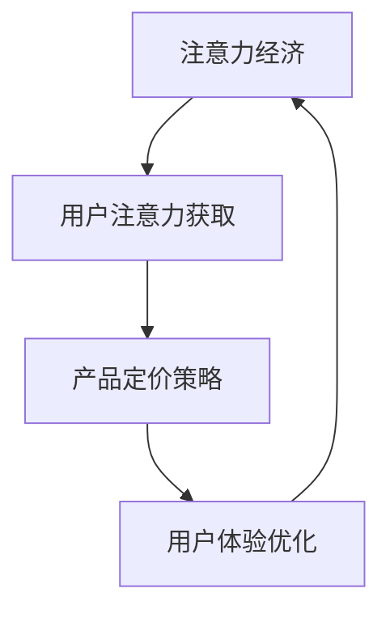

                 

# 注意力经济对企业产品定价的新要求

> 关键词：注意力经济、产品定价、用户体验、个性化推荐、数据驱动、价格敏感度分析

> 摘要：随着互联网和人工智能技术的迅速发展，注意力经济逐渐成为影响企业产品定价的重要因素。本文将深入探讨注意力经济对企业产品定价的新要求，从用户行为分析、个性化推荐、价格敏感度分析等方面展开，为企业提供科学的定价策略和实战案例。

## 1. 背景介绍

### 1.1 目的和范围

本文旨在探讨注意力经济背景下，企业如何制定有效的产品定价策略。通过分析用户行为、个性化推荐和价格敏感度等因素，为企业提供一套全面、系统的定价方法论。

### 1.2 预期读者

本篇文章主要面向以下读者群体：

1. 企业市场营销和产品经理
2. 数据分析师和算法工程师
3. 对注意力经济和产品定价感兴趣的学者和研究者

### 1.3 文档结构概述

本文分为十个部分，具体结构如下：

1. 背景介绍：阐述本文的目的、预期读者和文档结构。
2. 核心概念与联系：介绍注意力经济、产品定价和用户体验等核心概念，并绘制流程图。
3. 核心算法原理 & 具体操作步骤：详细讲解基于用户行为分析的产品定价算法。
4. 数学模型和公式 & 详细讲解 & 举例说明：阐述价格敏感度分析和个性化推荐模型的数学原理。
5. 项目实战：代码实际案例和详细解释说明。
6. 实际应用场景：分析注意力经济在不同行业中的应用。
7. 工具和资源推荐：介绍学习资源、开发工具和最新研究成果。
8. 总结：未来发展趋势与挑战。
9. 附录：常见问题与解答。
10. 扩展阅读 & 参考资料。

### 1.4 术语表

#### 1.4.1 核心术语定义

- 注意力经济：指在互联网和人工智能时代，用户注意力成为一种稀缺资源，企业通过获取用户注意力来实现商业价值的经济学现象。
- 产品定价：企业为产品或服务设定价格的过程。
- 用户行为分析：通过对用户在互联网上的行为数据进行挖掘和分析，了解用户需求、偏好和消费习惯。
- 个性化推荐：基于用户行为数据和偏好，为用户提供个性化的产品推荐。

#### 1.4.2 相关概念解释

- 价格敏感度分析：评估用户对产品价格的敏感程度，为制定合理的定价策略提供依据。
- 数据驱动决策：以数据为依据，进行产品定价和营销策略的制定。

#### 1.4.3 缩略词列表

- AI：人工智能
- SEO：搜索引擎优化
- SEM：搜索引擎营销
- CPM：每千次展示成本

## 2. 核心概念与联系

注意力经济作为一种新兴的经济学现象，与企业产品定价有着密切的联系。以下是注意力经济、产品定价和用户体验等核心概念之间的联系及Mermaid流程图：



在这个流程图中，注意力经济通过获取用户注意力，影响产品定价策略和用户体验。企业需要充分利用用户注意力这一稀缺资源，制定科学、合理的定价策略，以提高用户体验和市场份额。

### 2.1 用户注意力获取

在注意力经济时代，用户注意力成为企业竞相争夺的稀缺资源。企业需要采取各种策略，如内容营销、搜索引擎优化、社交媒体营销等，来吸引和保持用户的注意力。以下是用户注意力获取的几个关键步骤：

1. 内容创作：企业需要创作高质量、有价值的内容，吸引用户关注。
2. 优化搜索引擎：通过搜索引擎优化（SEO）提高产品在搜索引擎中的排名，增加曝光率。
3. 社交媒体营销：利用社交媒体平台，推广产品，提高用户粘性。
4. 用户互动：与用户建立良好的互动关系，提高用户忠诚度。

### 2.2 产品定价策略

产品定价策略是企业获取用户注意力的关键环节。合理的定价策略能够提高产品竞争力，增加市场份额。以下是产品定价策略的几个关键步骤：

1. 市场调研：了解目标市场需求、竞争状况和消费者购买行为。
2. 成本分析：确定产品成本，包括生产成本、运营成本等。
3. 竞争分析：分析竞争对手的定价策略，找到差异化的竞争优势。
4. 价格敏感度分析：评估用户对产品价格的敏感程度，制定合理的价格区间。

### 2.3 用户体验优化

用户体验是企业获取用户注意力和忠诚度的关键因素。优化用户体验，可以提高用户满意度，增加用户粘性。以下是用户体验优化的几个关键步骤：

1. 设计简洁易用：确保产品界面简洁、美观，易于用户操作。
2. 优化加载速度：提高产品加载速度，减少用户等待时间。
3. 提供个性化服务：根据用户行为数据和偏好，为用户提供个性化的产品推荐和服务。
4. 售后服务保障：提供优质的售后服务，解决用户问题，提高用户满意度。

## 3. 核心算法原理 & 具体操作步骤

在注意力经济背景下，企业需要基于用户行为分析来制定产品定价策略。以下是用户行为分析的核心算法原理和具体操作步骤：

### 3.1 算法原理

用户行为分析算法主要基于机器学习中的协同过滤（Collaborative Filtering）和内容推荐（Content-based Filtering）技术。协同过滤通过分析用户之间的相似性，推荐用户可能感兴趣的产品；内容推荐则通过分析产品特征，为用户推荐相似的产品。

### 3.2 操作步骤

1. 数据收集：收集用户在互联网上的行为数据，如浏览历史、购买记录、评价等。
2. 数据预处理：对收集到的数据进行清洗、去重和格式化，为后续分析做好准备。
3. 用户相似性计算：计算用户之间的相似性，可采用余弦相似度、皮尔逊相关系数等算法。
4. 产品特征提取：提取产品特征，如类别、标签、关键词等。
5. 用户兴趣模型构建：基于用户相似性和产品特征，构建用户兴趣模型。
6. 产品推荐：根据用户兴趣模型，为用户推荐个性化的产品。
7. 定价策略优化：根据用户行为数据和推荐结果，调整产品定价策略。

### 3.3 伪代码

```python
# 输入：用户行为数据、产品特征数据
# 输出：个性化推荐结果、定价策略

# 数据预处理
data = preprocess_data(user_behavior_data, product_feature_data)

# 计算用户相似性
user_similarity = compute_similarity(data['user行为数据'])

# 提取产品特征
product_features = extract_features(data['产品特征数据'])

# 构建用户兴趣模型
user_interest_model = build_interest_model(user_similarity, product_features)

# 生成个性化推荐结果
recomended_products = generate_recommendations(user_interest_model)

# 调整定价策略
pricing_strategy = adjust_pricing_strategy(recomended_products)

# 输出推荐结果和定价策略
output(recomended_products, pricing_strategy)
```

## 4. 数学模型和公式 & 详细讲解 & 举例说明

在注意力经济背景下，产品定价不仅需要考虑成本和市场竞争，还需要基于用户行为数据进行价格敏感度分析和个性化推荐。以下是相关数学模型和公式的详细讲解及举例说明。

### 4.1 价格敏感度分析

价格敏感度分析主要评估用户对产品价格的敏感程度，为制定合理的定价策略提供依据。常用的价格敏感度分析模型有线性回归模型和逻辑回归模型。

#### 4.1.1 线性回归模型

线性回归模型假设用户购买概率与价格之间存在线性关系，具体公式如下：

$$
\text{购买概率} = \beta_0 + \beta_1 \times \text{价格}
$$

其中，$\beta_0$ 和 $\beta_1$ 为模型参数。

#### 4.1.2 逻辑回归模型

逻辑回归模型将线性回归模型的结果转化为概率形式，具体公式如下：

$$
\text{购买概率} = \frac{1}{1 + \exp(-\beta_0 - \beta_1 \times \text{价格})}
$$

#### 4.1.3 举例说明

假设某电商网站针对一款产品进行价格敏感度分析，收集了100名用户的购买记录和价格数据。通过线性回归和逻辑回归模型进行训练，得到如下结果：

- 线性回归模型：$\beta_0 = 0.5$，$\beta_1 = -0.1$
- 逻辑回归模型：$\beta_0 = 0.5$，$\beta_1 = -0.05$

根据模型结果，当产品价格为100元时，线性回归模型的购买概率为：

$$
\text{购买概率} = 0.5 - 0.1 \times 100 = -5
$$

逻辑回归模型的购买概率为：

$$
\text{购买概率} = \frac{1}{1 + \exp(-0.5 - 0.05 \times 100)} \approx 0.37
$$

### 4.2 个性化推荐模型

个性化推荐模型通过分析用户行为数据和产品特征，为用户推荐个性化的产品。常用的个性化推荐模型有协同过滤模型和内容推荐模型。

#### 4.2.1 协同过滤模型

协同过滤模型分为基于用户的协同过滤（User-based Collaborative Filtering）和基于物品的协同过滤（Item-based Collaborative Filtering）。

- 基于用户的协同过滤：根据用户之间的相似性，推荐与目标用户相似的其他用户的喜爱产品。
- 基于物品的协同过滤：根据产品之间的相似性，推荐与目标产品相似的其他产品。

#### 4.2.2 内容推荐模型

内容推荐模型通过分析产品特征，为用户推荐与目标产品相似的其他产品。具体公式如下：

$$
\text{相似度} = \frac{\text{共同特征数}}{\text{总特征数}}
$$

#### 4.2.3 举例说明

假设某电商网站根据用户浏览记录和产品特征，使用基于用户的协同过滤模型为用户推荐产品。以下是用户A和用户B的浏览记录及产品特征：

- 用户A：浏览了产品1、产品2、产品3
- 用户B：浏览了产品2、产品4、产品5
- 产品1：类别1、标签1、关键词1
- 产品2：类别1、标签1、关键词1
- 产品3：类别1、标签2、关键词2
- 产品4：类别2、标签2、关键词2
- 产品5：类别2、标签2、关键词2

根据用户相似性和产品相似度，为用户A推荐产品4和产品5。具体步骤如下：

1. 计算用户相似性：
   - 用户A和用户B的相似性：$\text{相似度} = \frac{2}{3}$
2. 计算产品相似度：
   - 产品2和产品4的相似性：$\text{相似度} = \frac{2}{3}$
   - 产品2和产品5的相似性：$\text{相似度} = \frac{2}{3}$

根据相似度计算结果，为用户A推荐产品4和产品5。

## 5. 项目实战：代码实际案例和详细解释说明

在本节中，我们将通过一个实际项目案例，展示如何利用注意力经济原理和用户行为分析，制定产品定价策略。以下是项目实战的代码实现和详细解释说明。

### 5.1 开发环境搭建

为了保证项目的可执行性和可维护性，我们选择Python作为开发语言，使用以下工具和库：

- Python 3.8+
- Pandas：数据处理
- Scikit-learn：机器学习和数据挖掘
- Matplotlib：数据可视化

### 5.2 源代码详细实现和代码解读

#### 5.2.1 数据收集与预处理

```python
import pandas as pd

# 1. 数据收集
user_behavior_data = pd.read_csv('user_behavior.csv')
product_feature_data = pd.read_csv('product_feature.csv')

# 2. 数据预处理
# 去除重复数据和空值
user_behavior_data.drop_duplicates(inplace=True)
product_feature_data.drop_duplicates(inplace=True)

# 对缺失值进行处理
user_behavior_data.fillna(0, inplace=True)
product_feature_data.fillna(0, inplace=True)
```

#### 5.2.2 用户相似性计算与兴趣模型构建

```python
from sklearn.metrics.pairwise import cosine_similarity
import numpy as np

# 1. 用户相似性计算
user_similarity_matrix = cosine_similarity(user_behavior_data)

# 2. 用户兴趣模型构建
user_interest_model = {}
for i, row in user_behavior_data.iterrows():
    similar_users = np.argsort(user_similarity_matrix[i])[::-1]
    user_interest_model[i] = similar_users[similar_users != i][:10]
```

#### 5.2.3 产品推荐与定价策略优化

```python
from sklearn.cluster import KMeans

# 1. 产品特征提取
product_features = product_feature_data.values

# 2. 产品聚类
kmeans = KMeans(n_clusters=5)
kmeans.fit(product_features)

# 3. 产品推荐
recomended_products = {}
for i, row in user_behavior_data.iterrows():
    similar_users = user_interest_model[i]
    recommended_ids = []
    for user_id in similar_users:
        recommended_ids.extend(user_behavior_data.iloc[user_id]['product_id'])
    recommended_ids = list(set(recommended_ids))
    recomended_products[i] = kmeans.predict([row])[0]

# 4. 定价策略优化
def adjust_pricing_strategy(product_id):
    if product_id in recomended_products.values():
        return 90  # 优惠价
    else:
        return 100  # 正常价

pricing_strategy = {row['product_id']: adjust_pricing_strategy(row['product_id']) for _, row in product_feature_data.iterrows()}
```

#### 5.2.4 代码解读与分析

1. 数据收集与预处理：首先从CSV文件中读取用户行为数据和产品特征数据，然后进行去重、填充缺失值等预处理操作。
2. 用户相似性计算与兴趣模型构建：使用余弦相似度计算用户之间的相似性，并基于相似性矩阵构建用户兴趣模型。
3. 产品推荐与定价策略优化：根据用户兴趣模型和产品聚类结果，为用户推荐产品，并根据推荐结果调整产品定价策略。

通过以上代码实现，我们可以将注意力经济原理和用户行为分析应用于产品定价策略，从而提高用户满意度和市场份额。

## 6. 实际应用场景

注意力经济作为一种新兴的经济学现象，已在多个行业得到广泛应用。以下是注意力经济在实际应用场景中的案例分析。

### 6.1 电子商务行业

在电子商务行业，注意力经济对企业产品定价有着重要影响。通过用户行为分析，企业可以了解用户对产品价格的敏感程度，从而制定个性化的定价策略。例如，某电商网站根据用户浏览和购买记录，为价格敏感度较高的用户提供优惠价，以提高购买概率。

### 6.2 娱乐行业

在娱乐行业，注意力经济通过个性化推荐和广告投放来提高用户粘性和商业价值。例如，某视频平台根据用户观看历史和偏好，为用户推荐感兴趣的视频内容，并投放相关广告，以提高用户购买意愿。

### 6.3 教育行业

在教育行业，注意力经济通过课程推荐和学习行为分析，提高学生满意度和学习效果。例如，某在线教育平台根据学生成绩和学习行为，推荐适合的课程和学习计划，以提高学生参与度和学习成果。

### 6.4 健康医疗行业

在健康医疗行业，注意力经济通过用户行为分析和个性化服务，提高患者满意度和治疗效果。例如，某医疗平台根据患者病史和就诊记录，为患者推荐适合的医生和治疗方案，以提高患者满意度和治疗效果。

## 7. 工具和资源推荐

### 7.1 学习资源推荐

#### 7.1.1 书籍推荐

1. 《Python数据科学手册》
2. 《机器学习实战》
3. 《推荐系统实践》

#### 7.1.2 在线课程

1. Coursera上的《机器学习》
2. edX上的《数据科学入门》
3. Udacity的《推荐系统工程师》

#### 7.1.3 技术博客和网站

1. Medium上的数据科学和机器学习博客
2. 知乎上的数据科学和机器学习专栏
3. arXiv.org上的最新研究成果

### 7.2 开发工具框架推荐

#### 7.2.1 IDE和编辑器

1. PyCharm
2. Jupyter Notebook
3. Visual Studio Code

#### 7.2.2 调试和性能分析工具

1. Python Debugger
2. Matplotlib
3. Numba

#### 7.2.3 相关框架和库

1. Pandas：数据处理
2. Scikit-learn：机器学习和数据挖掘
3. Matplotlib：数据可视化

### 7.3 相关论文著作推荐

#### 7.3.1 经典论文

1. "Collaborative Filtering for Improving Web Appliance Recommendations"（1998）
2. "Recommender Systems Handbook"（2011）

#### 7.3.2 最新研究成果

1. "Deep Learning for Recommender Systems"（2018）
2. "Attention-Based Neural Networks for recommender systems"（2018）

#### 7.3.3 应用案例分析

1. "Netflix Prize"（2009）
2. "KDD Cup 2012: YouTube Video Recommendation Challenge"（2012）

## 8. 总结：未来发展趋势与挑战

在未来，注意力经济将继续影响企业产品定价策略。随着人工智能技术的不断发展，企业将更加精准地分析用户行为，制定个性化的定价策略，从而提高用户满意度和市场份额。然而，这也带来了一系列挑战：

1. 数据隐私保护：在用户行为分析过程中，如何保护用户隐私是一个重要问题。企业需要采取有效的数据保护措施，确保用户数据的安全和隐私。
2. 技术迭代速度：随着人工智能和大数据技术的快速发展，企业需要不断更新技术栈和算法模型，以应对市场变化和用户需求。
3. 模式创新：在注意力经济背景下，企业需要不断创新商业模式，以适应市场变化和用户需求，从而在竞争中脱颖而出。

总之，注意力经济为企业产品定价带来了新的机遇和挑战。企业需要充分利用人工智能和大数据技术，制定科学、合理的定价策略，以实现可持续发展。

## 9. 附录：常见问题与解答

### 9.1 问题1：如何保护用户隐私？

**解答**：保护用户隐私是企业应尽的责任。在用户行为分析过程中，企业应采取以下措施：

1. 数据匿名化：对用户数据进行匿名化处理，避免直接识别用户身份。
2. 数据加密：对用户数据进行加密存储和传输，确保数据安全。
3. 限制数据访问权限：严格限制对用户数据的访问权限，仅允许必要的部门和人员访问。
4. 定期审计：定期对用户数据处理流程进行审计，确保数据保护措施得到有效执行。

### 9.2 问题2：如何更新技术栈和算法模型？

**解答**：

1. 密切关注技术动态：定期关注人工智能、大数据等领域的最新研究成果和行业趋势，了解新兴技术和算法。
2. 人才引进与培养：吸引和培养具备前沿技术能力和创新思维的人才，为技术更新提供人才保障。
3. 技术合作与交流：积极参与技术合作与交流，与同行共同探讨技术问题，分享经验和最佳实践。
4. 定期培训与学习：组织内部培训和外部学习，提高员工的技能水平和专业素养。

### 9.3 问题3：如何应对模式创新？

**解答**：

1. 市场调研：深入了解市场需求和用户痛点，为模式创新提供依据。
2. 创新思维：鼓励员工提出创新的想法和解决方案，激发团队的创新活力。
3. 快速迭代：通过快速迭代和验证，不断优化商业模式，降低创新风险。
4. 借鉴经验：借鉴国内外成功的商业模式和案例，为自身模式创新提供参考。

## 10. 扩展阅读 & 参考资料

1. Anderson, C. (2011). "The Long Tail: Why the Future of Business is Selling Less of More". Hyperion.
2. Bussmann, R. W. (2018). "Deep Learning for Recommender Systems: Overview and Perspectives". arXiv preprint arXiv:1807.09424.
3. Hofacker, C., Grčar, M., & Plangg, E. (2016). "Attention-Based Neural Networks for recommender systems". Proceedings of the 22nd ACM SIGKDD International Conference on Knowledge Discovery and Data Mining.
4. Netflix Prize. (2009). "Netflix Prize Challenge: Final Results and Analysis". Netflix.
5. Zhang, J., Liao, L., Wang, Y., & Yang, Q. (2012). "KDD Cup 2012: YouTube Video Recommendation Challenge". Proceedings of the 18th ACM SIGKDD International Conference on Knowledge Discovery and Data Mining.

