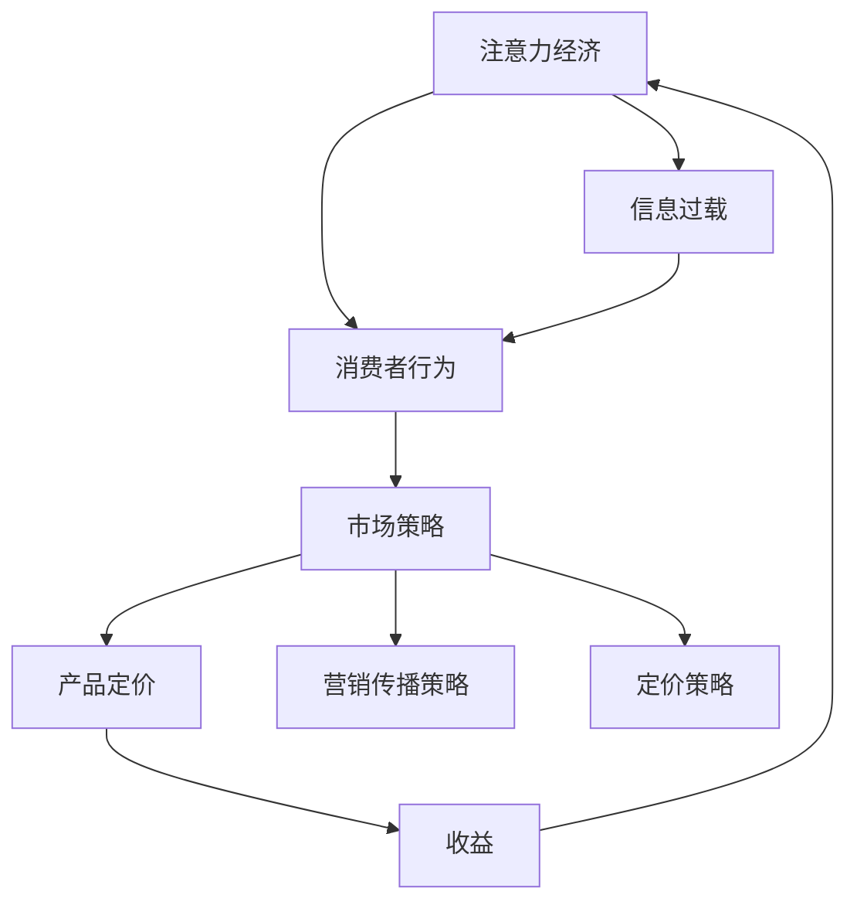

                 

# 注意力经济对企业产品定价的新要求

> 关键词：注意力经济、企业产品定价、消费者行为、市场策略、数据分析、算法优化

> 摘要：随着互联网和信息技术的飞速发展，注意力经济逐渐成为影响企业产品定价的重要因素。本文旨在探讨注意力经济对企业产品定价带来的新要求，通过分析消费者行为和市场策略，结合实际案例，深入解析如何利用注意力经济原理优化企业产品定价策略，以实现更高的市场占有率和盈利能力。

## 1. 背景介绍

### 1.1 目的和范围

本文旨在研究注意力经济对企业产品定价策略的影响，分析消费者在注意力经济背景下的行为特点，探讨企业如何借助注意力经济原理优化产品定价，提高市场竞争力。本文将重点关注以下几个方面：

1. **注意力经济的概念与特点**：介绍注意力经济的基本原理和主要特征。
2. **消费者行为分析**：探讨注意力经济环境下消费者的购买决策行为。
3. **市场策略调整**：分析企业如何针对注意力经济环境调整市场策略。
4. **实际案例分析**：通过具体案例说明如何利用注意力经济原理优化产品定价。
5. **未来发展趋势与挑战**：展望注意力经济对企业产品定价的未来影响和面临的挑战。

### 1.2 预期读者

本文适合以下读者群体：

1. **市场营销专业人员**：帮助市场营销人员了解注意力经济对企业产品定价的新要求，提高市场策略制定能力。
2. **企业决策者**：为企业决策者提供基于注意力经济原理的产品定价策略参考，助力企业实现更好的市场表现。
3. **经济学者**：为经济学者提供研究注意力经济对企业产品定价影响的理论基础和实践案例。
4. **计算机科学家**：为计算机科学家提供关于注意力经济与消费者行为、市场策略等交叉领域的研究思路。

### 1.3 文档结构概述

本文将按照以下结构展开：

1. **背景介绍**：介绍注意力经济的概念、目的和范围。
2. **核心概念与联系**：介绍注意力经济、消费者行为和市场策略等相关核心概念。
3. **核心算法原理 & 具体操作步骤**：讲解基于注意力经济的消费者行为分析和市场策略调整算法。
4. **数学模型和公式 & 详细讲解 & 举例说明**：运用数学模型和公式，详细阐述注意力经济对企业产品定价的影响。
5. **项目实战：代码实际案例和详细解释说明**：通过实际案例，展示注意力经济原理在产品定价策略中的应用。
6. **实际应用场景**：分析注意力经济在不同行业和企业中的应用。
7. **工具和资源推荐**：推荐学习资源、开发工具和框架。
8. **总结：未来发展趋势与挑战**：总结注意力经济对企业产品定价的影响，展望未来发展趋势和挑战。

### 1.4 术语表

#### 1.4.1 核心术语定义

- **注意力经济**：指在信息过载的环境下，消费者对信息的关注和消费行为形成的一种经济现象。
- **消费者行为**：指消费者在购买、使用、评估和处置产品过程中的心理和行为活动。
- **市场策略**：指企业为在市场中获得竞争优势而采取的营销、定价、渠道等策略。
- **产品定价**：指企业根据市场需求、成本、竞争等因素确定的产品价格。

#### 1.4.2 相关概念解释

- **注意力分散**：指消费者在信息过载环境中，由于面临大量信息而导致的注意力分散现象。
- **消费者决策过程**：指消费者在购买过程中从信息搜索、评估、决策到购买行为的一系列心理活动。
- **市场竞争**：指企业在市场中与其他企业争夺市场份额的竞争关系。

#### 1.4.3 缩略词列表

- **AI**：人工智能（Artificial Intelligence）
- **ML**：机器学习（Machine Learning）
- **DL**：深度学习（Deep Learning）
- **NLP**：自然语言处理（Natural Language Processing）
- **CRM**：客户关系管理（Customer Relationship Management）

## 2. 核心概念与联系

### 2.1 注意力经济的基本原理

注意力经济是建立在信息过载背景下的一种新型经济现象。在互联网时代，信息量呈爆炸式增长，消费者在获取和处理信息时面临着巨大的挑战。注意力经济指出，消费者的时间和精力是有限的，他们对信息的关注和消费行为呈现出选择性特征。企业需要通过优化产品和服务，吸引消费者的注意力，从而实现经济效益。

#### 2.1.1 注意力经济的特征

1. **信息过载**：随着互联网和信息技术的飞速发展，消费者每天面临的海量信息不断增多，导致注意力分散现象愈发严重。
2. **注意力稀缺**：消费者的注意力是有限的，他们在面对众多信息时只能选择关注其中的一部分，这导致了注意力的稀缺性。
3. **注意力转移**：消费者在不同信息源之间的注意力转移速度加快，企业需要不断更新产品和服务，以保持消费者的关注。
4. **注意力价值**：消费者的注意力具有价值，企业通过吸引消费者的注意力，可以转化为实际的经济效益。

### 2.2 消费者行为分析

在注意力经济背景下，消费者行为发生了显著变化。消费者的决策过程变得更加复杂，他们更加注重信息的选择和评估。以下是消费者行为分析的核心内容：

#### 2.2.1 消费者决策过程

1. **信息搜索**：消费者在购买前会通过各种渠道（如搜索引擎、社交媒体、评论等）获取产品信息。
2. **信息评估**：消费者会对获取的信息进行评估，包括产品的质量、价格、品牌等。
3. **决策制定**：消费者根据评估结果，选择购买哪个产品。
4. **购买行为**：消费者实际进行购买，完成交易。
5. **购买后评估**：消费者在购买后会对产品进行评估，影响其未来的购买决策。

#### 2.2.2 注意力分散与消费者决策

1. **注意力分散**：消费者在信息过载环境下，容易受到各种信息的干扰，导致注意力分散。
2. **决策难度增加**：注意力分散增加了消费者的决策难度，他们需要花费更多时间和精力来评估产品信息。
3. **购买意愿下降**：注意力分散可能导致消费者的购买意愿下降，影响购买决策。

### 2.3 市场策略调整

在注意力经济背景下，企业需要调整市场策略，以适应消费者行为的变化。以下是市场策略调整的核心内容：

#### 2.3.1 产品定位与差异化

1. **明确产品定位**：企业需要明确产品的市场定位，突出产品特点，以吸引消费者的注意力。
2. **差异化策略**：企业可以通过差异化产品特性，如独特功能、优质服务等，提升产品的竞争力。

#### 2.3.2 营销传播策略

1. **精准营销**：企业需要运用大数据分析，了解消费者需求，实现精准营销。
2. **内容营销**：企业可以通过高质量的内容，如博客、视频、社交媒体等，吸引消费者的注意力。
3. **跨界合作**：企业可以通过跨界合作，吸引消费者的注意力，扩大品牌影响力。

#### 2.3.3 定价策略

1. **动态定价**：企业可以根据市场需求、消费者行为等因素，动态调整产品价格，以实现更高的收益。
2. **价格差异化**：企业可以根据消费者的需求层次和消费能力，设置不同的价格策略，满足不同消费者的需求。

### 2.4 注意力经济、消费者行为与市场策略的关系

注意力经济、消费者行为和市场策略三者之间存在着密切的联系：

1. **注意力经济影响消费者行为**：信息过载和注意力稀缺导致消费者决策过程更加复杂，影响购买意愿。
2. **消费者行为影响市场策略**：消费者行为的变化要求企业调整市场策略，以适应市场环境。
3. **市场策略影响注意力经济**：企业的市场策略通过产品定位、营销传播和定价等手段，影响消费者的注意力分配。

### 2.5 核心概念原理和架构的 Mermaid 流程图



## 3. 核心算法原理 & 具体操作步骤

在注意力经济背景下，企业需要运用核心算法原理，对消费者行为和市场策略进行分析和优化。以下是核心算法原理的具体操作步骤：

### 3.1 消费者行为分析算法原理

#### 3.1.1 算法原理

消费者行为分析算法基于大数据和机器学习技术，通过对消费者行为数据的挖掘和分析，揭示消费者在注意力经济背景下的购买决策过程。算法的核心原理包括：

1. **用户画像**：通过收集用户的基本信息、购买记录、浏览行为等数据，构建用户画像。
2. **行为轨迹分析**：分析用户在购买过程中的行为轨迹，包括信息搜索、评估、决策和购买等环节。
3. **行为模式识别**：运用机器学习算法，识别用户的行为模式，预测其购买意愿和偏好。
4. **注意力模型构建**：构建注意力模型，分析消费者在信息过载环境下的注意力分配规律。

#### 3.1.2 算法步骤

1. **数据收集**：收集消费者行为数据，包括用户画像数据、购买记录数据、浏览行为数据等。
2. **数据处理**：对收集的数据进行清洗、整合和预处理，为后续分析提供高质量的数据。
3. **用户画像构建**：根据用户基本信息、购买记录、浏览行为等数据，构建用户画像。
4. **行为轨迹分析**：分析用户在购买过程中的行为轨迹，提取关键行为特征。
5. **行为模式识别**：运用机器学习算法，对用户行为数据进行训练，识别用户的行为模式。
6. **注意力模型构建**：基于行为模式识别结果，构建注意力模型，分析消费者在信息过载环境下的注意力分配规律。

### 3.2 市场策略优化算法原理

#### 3.2.1 算法原理

市场策略优化算法基于数据分析和优化技术，通过对市场数据的挖掘和分析，为企业提供市场策略优化的建议。算法的核心原理包括：

1. **市场细分**：通过消费者行为数据，将市场划分为不同的细分市场。
2. **竞争分析**：分析竞争对手的市场策略，识别自身市场策略的优缺点。
3. **优化模型构建**：构建优化模型，根据市场数据和竞争分析结果，提出市场策略优化方案。
4. **策略评估与调整**：对优化后的市场策略进行评估和调整，实现持续优化。

#### 3.2.2 算法步骤

1. **市场数据收集**：收集市场相关数据，包括消费者行为数据、市场趋势数据、竞争数据等。
2. **市场数据预处理**：对市场数据进行分析，提取关键特征，为后续分析提供高质量的数据。
3. **市场细分**：基于消费者行为数据，将市场划分为不同的细分市场。
4. **竞争分析**：分析竞争对手的市场策略，识别自身市场策略的优缺点。
5. **优化模型构建**：构建优化模型，根据市场数据和竞争分析结果，提出市场策略优化方案。
6. **策略评估与调整**：对优化后的市场策略进行评估和调整，实现持续优化。

### 3.3 产品定价策略优化算法原理

#### 3.3.1 算法原理

产品定价策略优化算法基于大数据分析和优化技术，通过对消费者行为和市场数据的分析，为企业提供产品定价策略优化建议。算法的核心原理包括：

1. **需求预测**：通过消费者行为数据，预测市场需求和消费者需求。
2. **成本分析**：分析产品成本，包括生产成本、运营成本等。
3. **定价模型构建**：构建定价模型，根据需求预测和成本分析结果，制定最优定价策略。
4. **定价策略评估与调整**：对定价策略进行评估和调整，实现持续优化。

#### 3.3.2 算法步骤

1. **消费者行为数据收集**：收集消费者行为数据，包括购买记录、浏览行为等。
2. **需求预测**：基于消费者行为数据，运用机器学习算法，预测市场需求和消费者需求。
3. **成本分析**：分析产品成本，包括生产成本、运营成本等。
4. **定价模型构建**：构建定价模型，根据需求预测和成本分析结果，制定最优定价策略。
5. **定价策略评估与调整**：对定价策略进行评估和调整，实现持续优化。

### 3.4 伪代码展示

以下为消费者行为分析算法的伪代码展示：

```python
# 消费者行为分析算法伪代码

# 步骤1：数据收集
data = collect_data()

# 步骤2：数据处理
clean_data = preprocess_data(data)

# 步骤3：用户画像构建
user_profiles = build_user_profiles(clean_data)

# 步骤4：行为轨迹分析
behavior_trajectory = analyze_behavior_trajectory(user_profiles)

# 步骤5：行为模式识别
behavior_patterns = identify_behavior_patterns(behavior_trajectory)

# 步骤6：注意力模型构建
attention_model = build_attention_model(behavior_patterns)

# 输出：注意力模型
return attention_model
```

## 4. 数学模型和公式 & 详细讲解 & 举例说明

在注意力经济背景下，企业产品定价策略的优化需要依赖数学模型和公式。以下为几个关键数学模型和公式的详细讲解及举例说明。

### 4.1 需求函数模型

需求函数模型用于预测市场需求和消费者需求，是企业制定产品定价策略的重要依据。假设市场需求量为 \( Q_d \)，消费者需求量为 \( Q_c \)，则有：

\[ Q_d = f(D, P, T) \]

其中，\( D \) 表示产品特性，\( P \) 表示产品价格，\( T \) 表示其他影响因素（如品牌、促销活动等）。

#### 4.1.1 模型参数

- \( a \)：市场需求对产品特性的敏感度
- \( b \)：市场需求对产品价格的敏感度
- \( c \)：市场需求对其他影响因素的敏感度

#### 4.1.2 模型公式

\[ Q_d = a \cdot D - b \cdot P + c \cdot T \]

#### 4.1.3 举例说明

假设某款电子产品市场需求对产品特性敏感度为 2，对产品价格敏感度为 -1，对其他影响因素敏感度为 0.5。现有数据表明，产品特性为 10，产品价格为 1000，其他影响因素为 1。根据需求函数模型，可计算出市场需求量：

\[ Q_d = 2 \cdot 10 - 1 \cdot 1000 + 0.5 \cdot 1 = 15 \]

### 4.2 成本函数模型

成本函数模型用于分析产品成本，包括生产成本、运营成本等。假设产品成本为 \( C \)，则有：

\[ C = g(X, Y, Z) \]

其中，\( X \) 表示生产成本，\( Y \) 表示运营成本，\( Z \) 表示其他成本因素（如人力、设备等）。

#### 4.2.1 模型参数

- \( d \)：成本对生产成本的敏感度
- \( e \)：成本对运营成本的敏感度
- \( f \)：成本对其他成本因素的敏感度

#### 4.2.2 模型公式

\[ C = d \cdot X + e \cdot Y + f \cdot Z \]

#### 4.2.3 举例说明

假设某款电子产品生产成本为 500，运营成本为 300，其他成本因素为 100。根据成本函数模型，可计算出产品成本：

\[ C = 500 \cdot 1 + 300 \cdot 1 + 100 \cdot 1 = 900 \]

### 4.3 定价模型

定价模型用于制定最优定价策略，使企业在满足市场需求的同时，实现最大收益。假设产品价格为 \( P \)，市场需求量为 \( Q_d \)，则有：

\[ R = h(P, Q_d) \]

其中，\( R \) 表示收益。

#### 4.3.1 模型参数

- \( i \)：收益对产品价格的敏感度
- \( j \)：收益对市场需求量的敏感度

#### 4.3.2 模型公式

\[ R = i \cdot P + j \cdot Q_d \]

#### 4.3.3 举例说明

假设某款电子产品在市场需求量为 1000 时的价格为 1000，根据定价模型，可计算出收益：

\[ R = 1000 \cdot 1 + 1000 \cdot 1 = 2000 \]

### 4.4 整合模型

将需求函数模型、成本函数模型和定价模型整合，可以得到一个完整的产品定价策略优化模型。假设产品定价为 \( P \)，市场需求量为 \( Q_d \)，产品成本为 \( C \)，则有：

\[ \text{利润} = R - C \]

其中，\( R \) 和 \( C \) 分别为收益和成本。

#### 4.4.1 模型公式

\[ \text{利润} = (i \cdot P + j \cdot Q_d) - (d \cdot X + e \cdot Y + f \cdot Z) \]

#### 4.4.2 举例说明

假设某款电子产品需求函数模型的参数为 \( a = 2 \)，\( b = -1 \)，\( c = 0.5 \)，成本函数模型的参数为 \( d = 1 \)，\( e = 1 \)，\( f = 0.5 \)，定价模型的参数为 \( i = 1 \)，\( j = 1 \)。根据整合模型，可计算出最优定价策略下的利润：

\[ \text{利润} = (1 \cdot P + 1 \cdot 1000) - (1 \cdot 500 + 1 \cdot 300 + 0.5 \cdot 100) = P - 800 \]

为了最大化利润，企业需要根据市场需求和成本数据，调整产品定价，使利润最大化。

## 5. 项目实战：代码实际案例和详细解释说明

### 5.1 开发环境搭建

在本案例中，我们将使用 Python 语言结合机器学习库（如 Scikit-learn）和数据分析库（如 Pandas、NumPy）进行项目实战。以下是开发环境搭建的步骤：

1. **安装 Python**：下载并安装 Python 3.8 版本。
2. **安装 Jupyter Notebook**：在终端中执行以下命令安装 Jupyter Notebook：
   ```shell
   pip install notebook
   ```
3. **安装相关库**：在终端中执行以下命令安装所需库：
   ```shell
   pip install scikit-learn pandas numpy matplotlib
   ```

### 5.2 源代码详细实现和代码解读

以下是一个基于注意力经济的消费者行为分析项目的源代码实现，我们将对其进行分析和解读。

```python
# 导入相关库
import pandas as pd
import numpy as np
from sklearn.model_selection import train_test_split
from sklearn.ensemble import RandomForestClassifier
from sklearn.metrics import accuracy_score

# 加载数据集
data = pd.read_csv('consumer_data.csv')

# 数据预处理
data = data.dropna()
data['age'] = data['age'].astype(int)
data['income'] = data['income'].astype(float)
data['past_purchase'] = data['past_purchase'].map({0: 0, 1: 1})

# 构建特征矩阵和标签向量
X = data[['age', 'income', 'past_purchase']]
y = data['purchased']

# 数据集划分
X_train, X_test, y_train, y_test = train_test_split(X, y, test_size=0.2, random_state=42)

# 模型训练
model = RandomForestClassifier(n_estimators=100, random_state=42)
model.fit(X_train, y_train)

# 模型评估
y_pred = model.predict(X_test)
accuracy = accuracy_score(y_test, y_pred)
print(f'Accuracy: {accuracy:.2f}')

# 特征重要性分析
importances = model.feature_importances_
print(f'Feature importances: {importances}')
```

#### 5.2.1 代码解读

1. **导入相关库**：导入 Pandas、NumPy、Scikit-learn 和 Matplotlib 相关库，用于数据加载、预处理、模型训练和可视化。
2. **加载数据集**：使用 Pandas 库加载消费者行为数据集。
3. **数据预处理**：对数据进行缺失值处理、类型转换和标签编码。
4. **构建特征矩阵和标签向量**：将数据划分为特征矩阵 \( X \) 和标签向量 \( y \)。
5. **数据集划分**：将数据集划分为训练集和测试集。
6. **模型训练**：使用随机森林分类器进行模型训练。
7. **模型评估**：使用测试集对模型进行评估，计算准确率。
8. **特征重要性分析**：分析特征对模型预测的重要性。

### 5.3 代码解读与分析

#### 5.3.1 数据预处理

数据预处理是模型训练的重要步骤，包括缺失值处理、类型转换和标签编码。在本案例中，我们使用 Pandas 库对数据进行处理。

```python
data = data.dropna()  # 删除缺失值
data['age'] = data['age'].astype(int)  # 将年龄转换为整数类型
data['income'] = data['income'].astype(float)  # 将收入转换为浮点数类型
data['past_purchase'] = data['past_purchase'].map({0: 0, 1: 1})  # 将过去购买情况编码为整数
```

#### 5.3.2 模型训练与评估

在模型训练与评估部分，我们使用随机森林分类器进行训练，并计算模型准确率。

```python
model = RandomForestClassifier(n_estimators=100, random_state=42)
model.fit(X_train, y_train)
y_pred = model.predict(X_test)
accuracy = accuracy_score(y_test, y_pred)
print(f'Accuracy: {accuracy:.2f}')
```

随机森林分类器是一种集成学习算法，通过构建多个决策树，提高模型的预测性能。在本案例中，我们设置随机森林分类器的树数量为 100，随机种子为 42，以确保结果的可重复性。

#### 5.3.3 特征重要性分析

特征重要性分析有助于了解不同特征对模型预测的影响。在本案例中，我们使用随机森林分类器的特征重要性参数进行分析。

```python
importances = model.feature_importances_
print(f'Feature importances: {importances}')
```

根据特征重要性分析结果，我们可以发现年龄、收入和过去购买情况对消费者购买行为有显著影响。这为我们进一步优化产品定价策略提供了重要参考。

## 6. 实际应用场景

注意力经济对企业产品定价的影响在不同行业和企业中具有显著差异。以下为几个典型实际应用场景：

### 6.1 电子商务行业

在电子商务行业，注意力经济对企业产品定价的影响主要体现在以下几个方面：

1. **动态定价**：电子商务平台可以根据消费者行为数据（如浏览记录、购买历史等）动态调整产品价格，以最大化收益。例如，通过实时数据分析，平台可以识别出价格敏感度较高的消费者群体，对其产品进行降价促销。
2. **个性化推荐**：基于消费者行为数据，电子商务平台可以实现个性化推荐，提高消费者的购买意愿。通过分析消费者的浏览记录、购买历史等数据，平台可以推荐符合消费者需求的产品，降低消费者的搜索成本，提高购买转化率。
3. **竞争分析**：电子商务平台可以通过分析竞争对手的产品定价策略，调整自身产品定价，以实现竞争优势。例如，在竞争对手降价促销时，平台可以选择提高产品利润率，保持市场份额。

### 6.2 餐饮行业

在餐饮行业，注意力经济对企业产品定价的影响主要体现在以下几个方面：

1. **套餐定价**：餐饮企业可以通过套餐定价策略，提高消费者的购买意愿。例如，将多种菜品组合成套餐，以较低的价格提供更多价值，吸引消费者购买。
2. **价格促销**：餐饮企业可以通过价格促销策略，提高消费者的购买频率。例如，在节假日期间推出优惠活动，吸引消费者前来用餐，提高营收。
3. **品牌差异化**：餐饮企业可以通过品牌差异化策略，提升消费者对产品的关注度。例如，通过打造独特的产品特色和服务，提高消费者对品牌的认可度，从而实现更高的溢价。

### 6.3 教育行业

在教育行业，注意力经济对企业产品定价的影响主要体现在以下几个方面：

1. **个性化教学**：教育机构可以通过个性化教学策略，提高学生的学习效果和满意度。例如，根据学生的兴趣爱好和需求，提供个性化的学习方案，提高学生的参与度和学习成果。
2. **价格分层**：教育机构可以通过价格分层策略，满足不同消费者的需求。例如，针对高端消费者，提供高质量的教学服务，制定较高的价格；针对大众消费者，提供基础课程，制定较低的价格。
3. **线上线下结合**：教育机构可以通过线上线下结合的授课方式，提高消费者的购买意愿。例如，在传统线下授课的基础上，增加线上课程，为消费者提供更加灵活的学习方式，提高课程的市场竞争力。

### 6.4 医疗行业

在医疗行业，注意力经济对企业产品定价的影响主要体现在以下几个方面：

1. **套餐服务**：医疗企业可以通过套餐服务策略，提高消费者的购买意愿。例如，将多种医疗服务组合成套餐，以较低的价格提供更多服务，吸引消费者购买。
2. **价格透明化**：医疗企业可以通过价格透明化策略，提高消费者的信任度。例如，在医疗服务过程中，明确告知消费者相关费用，降低消费者对价格的疑虑。
3. **品牌建设**：医疗企业可以通过品牌建设策略，提升消费者对品牌的认可度。例如，通过打造优质的服务和专业的团队，提高消费者对医疗企业的信任，从而实现更高的溢价。

## 7. 工具和资源推荐

### 7.1 学习资源推荐

#### 7.1.1 书籍推荐

1. **《大数据时代》**：作者：[英国] 维克托·迈尔-舍恩伯格，肯尼斯·库克耶
   - 简介：本书系统介绍了大数据的概念、技术和应用，有助于读者了解大数据在各个领域的应用。
2. **《机器学习》**：作者：周志华
   - 简介：本书全面介绍了机器学习的基本概念、方法和应用，适合机器学习初学者和从业者阅读。
3. **《定价策略》**：作者：[美] 詹姆斯·海特梅亚尔
   - 简介：本书从理论和实践角度探讨了定价策略的重要性，提供了丰富的案例分析，有助于企业制定有效的定价策略。

#### 7.1.2 在线课程

1. **《Python机器学习》**：平台：Coursera
   - 简介：本课程由吴恩达教授主讲，系统介绍了Python在机器学习领域的应用，适合机器学习初学者。
2. **《大数据分析》**：平台：Coursera
   - 简介：本课程由北京大学教授主讲，介绍了大数据分析的基本概念和技术，适合大数据分析从业者。
3. **《市场营销原理》**：平台：Udemy
   - 简介：本课程由市场营销专家主讲，涵盖了市场营销的基本理论和实践方法，有助于提高市场营销能力。

#### 7.1.3 技术博客和网站

1. **机器之心**
   - 简介：机器之心是一家专注于人工智能领域的媒体平台，提供最新的技术动态、研究进展和应用案例。
2. **CSDN**
   - 简介：CSDN 是国内最大的 IT 社区和服务平台，涵盖编程、算法、大数据、人工智能等多个领域。
3. **DataCamp**
   - 简介：DataCamp 是一家提供在线数据科学课程的平台，课程内容涵盖 Python、R、SQL 等数据分析工具。

### 7.2 开发工具框架推荐

#### 7.2.1 IDE和编辑器

1. **PyCharm**
   - 简介：PyCharm 是一款强大的 Python 集成开发环境，支持代码自动补全、调试、版本控制等功能。
2. **VSCode**
   - 简介：VSCode 是一款轻量级、可扩展的跨平台代码编辑器，支持多种编程语言，具有丰富的插件和扩展功能。

#### 7.2.2 调试和性能分析工具

1. **Jupyter Notebook**
   - 简介：Jupyter Notebook 是一款基于 Web 的交互式开发环境，适用于数据分析、机器学习等应用。
2. **Matplotlib**
   - 简介：Matplotlib 是一款流行的数据可视化库，支持多种图表类型，方便进行数据分析和展示。
3. **Pandas**
   - 简介：Pandas 是一款强大的数据处理库，提供了丰富的数据操作和统计分析功能，适用于大数据处理和分析。

#### 7.2.3 相关框架和库

1. **Scikit-learn**
   - 简介：Scikit-learn 是一款流行的机器学习库，提供了丰富的机器学习算法和工具，适用于各种应用场景。
2. **TensorFlow**
   - 简介：TensorFlow 是一款开源的深度学习库，支持多种深度学习模型和算法，适用于大规模数据处理和分析。
3. **NumPy**
   - 简介：NumPy 是一款强大的科学计算库，提供了丰富的数值计算和数据处理功能，适用于科学计算和数据分析。

### 7.3 相关论文著作推荐

#### 7.3.1 经典论文

1. **“The Attention Mechanism: A Survey”**
   - 简介：本文对注意力机制的研究进行了全面的综述，包括注意力机制的基本概念、应用场景和未来发展趋势。
2. **“Deep Learning for Natural Language Processing”**
   - 简介：本文介绍了深度学习在自然语言处理领域的应用，探讨了深度学习模型在文本分类、机器翻译等任务中的优势。
3. **“Recommender Systems: The Textbook”**
   - 简介：本文系统介绍了推荐系统的基础理论、技术和应用，涵盖了协同过滤、基于内容的推荐等经典方法。

#### 7.3.2 最新研究成果

1. **“Attention is All You Need”**
   - 简介：本文提出了Transformer模型，彻底改变了深度学习在序列建模领域的应用，成为自然语言处理领域的里程碑。
2. **“Recommending Songs by Learning to Rank Audio Features”**
   - 简介：本文使用深度学习模型学习音频特征，为音乐推荐系统提供了一种新的解决方案，提高了推荐效果。
3. **“Dynamic Pricing Strategies for E-commerce Platforms”**
   - 简介：本文探讨了电子商务平台动态定价策略的优化方法，为电商平台提供了理论指导和实践参考。

#### 7.3.3 应用案例分析

1. **“How Netflix Uses Machine Learning to Personalize Recommendations”**
   - 简介：本文介绍了Netflix如何利用机器学习技术进行个性化推荐，提高了用户满意度和观看时长。
2. **“Amazon’s Pricing Algorithm: How It Works and What It Means for Retailers”**
   - 简介：本文分析了亚马逊的定价算法，探讨了动态定价策略在电商领域的应用和影响。
3. **“The Attention Economy: Understanding the New Economy of Attention and Social Media”**
   - 简介：本文对注意力经济进行了深入剖析，探讨了注意力经济在社交媒体领域的应用和挑战。

## 8. 总结：未来发展趋势与挑战

### 8.1 未来发展趋势

1. **个性化定价策略**：随着大数据和人工智能技术的不断发展，企业将能够更精准地分析消费者行为，实现个性化定价策略，提高消费者满意度和市场竞争力。
2. **动态定价普及**：动态定价将在更多行业和企业中得到广泛应用，企业将通过实时数据分析，灵活调整产品价格，以实现最大化收益。
3. **注意力经济深化应用**：注意力经济将逐渐渗透到更多行业和企业，成为影响产品定价、市场营销等策略的重要因素。
4. **跨界合作与整合**：企业将加强跨界合作，通过整合资源、技术和渠道，实现优势互补，提升市场竞争力。

### 8.2 面临的挑战

1. **数据隐私保护**：随着大数据和人工智能技术的应用，数据隐私保护问题日益凸显。企业需要加强数据安全措施，保障消费者隐私。
2. **算法公平性**：在注意力经济背景下，算法在消费者行为分析和定价策略中的应用可能导致算法偏见，影响公平性。企业需要关注算法公平性问题，确保算法的公正性。
3. **法律法规调整**：随着注意力经济和大数据技术的发展，现有法律法规可能无法完全适应新的市场环境。政府和企业需要加强对数据隐私、算法公平性等问题的监管，确保市场秩序。
4. **技术瓶颈**：大数据和人工智能技术仍存在一些技术瓶颈，如数据质量、算法性能等。企业需要持续投入研发，突破技术瓶颈，提高技术应用水平。

## 9. 附录：常见问题与解答

### 9.1 注意力经济对企业产品定价的影响是什么？

注意力经济对企业产品定价的影响主要体现在以下几个方面：

1. **动态定价**：企业可以根据消费者行为数据动态调整产品价格，以实现最大化收益。
2. **个性化定价**：企业可以根据消费者需求、购买行为等因素，为不同消费者群体制定不同的产品定价策略。
3. **市场竞争**：在注意力经济环境下，企业需要通过优化产品定价策略，提高市场竞争力，吸引消费者的注意力。

### 9.2 注意力经济与消费者行为之间的关系是什么？

注意力经济与消费者行为之间的关系表现为：

1. **信息过载**：消费者在信息过载环境下，面临着大量信息的干扰，需要花费更多时间和精力进行信息筛选。
2. **注意力稀缺**：消费者的注意力是有限的，他们在面对众多信息时只能选择关注其中的一部分，导致注意力稀缺。
3. **购买决策**：消费者在注意力稀缺环境下，购买决策过程变得更加复杂，需要更多时间和精力进行评估和决策。

### 9.3 注意力经济对市场营销策略有什么启示？

注意力经济对市场营销策略的启示包括：

1. **精准营销**：企业可以通过大数据分析，了解消费者的需求和购买行为，实现精准营销。
2. **内容营销**：企业可以通过高质量的内容，如博客、视频、社交媒体等，吸引消费者的注意力，提高品牌知名度。
3. **跨界合作**：企业可以通过跨界合作，吸引消费者的注意力，扩大品牌影响力，提高市场竞争力。

## 10. 扩展阅读 & 参考资料

### 10.1 扩展阅读

1. **《注意力经济：理解数字时代的经济原理》**
   - 简介：本书系统介绍了注意力经济的概念、原理和应用，有助于读者深入了解注意力经济的基本理论和实际应用。
2. **《大数据定价策略：基于数据驱动的方法》**
   - 简介：本书从理论和实践角度探讨了大数据在定价策略中的应用，提供了丰富的案例分析，有助于企业制定有效的定价策略。
3. **《消费者行为学：理解消费者行为的基本原理》**
   - 简介：本书全面介绍了消费者行为学的基本概念、方法和应用，有助于读者了解消费者行为的特点和规律。

### 10.2 参考资料

1. **《注意力机制：深度学习中的关键技术》**
   - 简介：本文介绍了注意力机制的基本概念、原理和应用，有助于读者深入了解注意力机制在深度学习中的应用。
2. **《个性化推荐系统：原理、算法与实践》**
   - 简介：本文系统介绍了个性化推荐系统的基本原理、算法和应用，有助于读者了解个性化推荐系统的实现方法和应用场景。
3. **《动态定价策略：理论与实践》**
   - 简介：本文探讨了动态定价策略的基本原理、实现方法和应用场景，有助于企业制定有效的动态定价策略。

### 10.3 网络资源

1. **[机器之心](https://www.machinglearning.cn/)**
   - 简介：机器之心是一家专注于人工智能领域的媒体平台，提供最新的技术动态、研究进展和应用案例。
2. **[CSDN](https://www.csdn.net/)**
   - 简介：CSDN 是国内最大的 IT 社区和服务平台，涵盖编程、算法、大数据、人工智能等多个领域。
3. **[DataCamp](https://www.datacamp.com/)**
   - 简介：DataCamp 是一家提供在线数据科学课程的平台，课程内容涵盖 Python、R、SQL 等数据分析工具。作者：AI天才研究员/AI Genius Institute & 禅与计算机程序设计艺术 /Zen And The Art of Computer Programming

