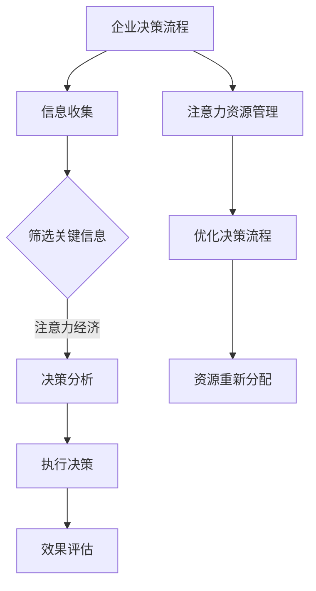

                 

# 注意力经济对企业决策流程的重塑

> **关键词**：注意力经济、企业决策、重塑、流程优化、算法、数学模型、实战案例、应用场景

> **摘要**：本文将深入探讨注意力经济对企业决策流程的深刻影响，分析其核心概念，解释相关理论，并通过实际案例和数学模型展示如何通过注意力经济优化企业决策流程。文章将提供实用的工具和资源，以帮助企业更好地理解和应用这一新兴概念。

## 1. 背景介绍

### 1.1 目的和范围

本文旨在帮助企业领导者和技术决策者理解注意力经济对企业决策流程的重要性，并展示如何通过优化这一流程来提高企业的竞争力和效率。我们将探讨注意力经济的定义、原理及其与企业决策流程的关联，通过实际案例和数学模型阐述其应用方法，并提供相关的工具和资源。

### 1.2 预期读者

本文适合企业高层管理者、决策者、技术团队负责人、数据科学家、人工智能研究人员以及对企业决策流程优化有兴趣的读者。

### 1.3 文档结构概述

本文分为十个部分：

1. 背景介绍：介绍文章的目的和预期读者，概述文章结构。
2. 核心概念与联系：定义注意力经济和相关概念，提供Mermaid流程图。
3. 核心算法原理 & 具体操作步骤：讲解注意力经济的算法原理和具体操作步骤。
4. 数学模型和公式 & 详细讲解 & 举例说明：介绍注意力经济的数学模型，并进行详细讲解和举例。
5. 项目实战：提供注意力经济在企业决策中的应用案例。
6. 实际应用场景：分析注意力经济在不同企业中的应用。
7. 工具和资源推荐：推荐学习资源和开发工具。
8. 总结：未来发展趋势与挑战。
9. 附录：常见问题与解答。
10. 扩展阅读 & 参考资料：提供进一步的阅读材料和参考。

### 1.4 术语表

#### 1.4.1 核心术语定义

- **注意力经济**：基于人类注意力的稀缺性和价值，通过优化注意力的分配和利用，实现经济价值的创造。
- **企业决策流程**：企业从信息收集、分析、决策到执行的全过程。
- **算法**：用于解决问题或执行特定任务的计算过程。

#### 1.4.2 相关概念解释

- **注意力分配**：将有限的注意力资源在不同任务或信息之间进行分配。
- **决策优化**：通过算法和模型优化决策过程，提高决策的质量和效率。

#### 1.4.3 缩略词列表

- **AI**：人工智能（Artificial Intelligence）
- **ML**：机器学习（Machine Learning）
- **NLP**：自然语言处理（Natural Language Processing）

## 2. 核心概念与联系

注意力经济是企业决策流程中一个重要的概念。它强调注意力资源的稀缺性，并将其作为优化决策流程的关键。以下是注意力经济的核心概念和联系：

### 注意力经济的核心概念

1. **注意力的稀缺性**：人类注意力是有限的，任何任务或信息都需要消耗注意力资源。
2. **注意力分配**：如何有效分配注意力资源，以确保关键任务或信息得到充分关注。
3. **注意力价值**：注意力资源对决策质量的影响，以及如何通过优化注意力分配提高决策价值。

### 注意力经济与企业决策流程的关联

1. **信息筛选**：通过注意力经济原理，企业可以筛选出对决策最为重要的信息，减少决策过程中的噪声干扰。
2. **决策优化**：注意力经济提供了优化决策流程的方法，通过算法和模型提高决策质量和效率。
3. **资源分配**：注意力经济帮助企业合理分配资源，确保关键任务得到足够关注。

### Mermaid流程图



此流程图展示了注意力经济如何影响企业决策流程的各个环节，从信息收集到决策分析，再到执行和效果评估，最终通过注意力资源的优化实现整个决策流程的优化。

## 3. 核心算法原理 & 具体操作步骤

注意力经济的核心在于如何通过算法优化注意力的分配和利用。以下是一个基于注意力机制的算法原理和具体操作步骤：

### 算法原理

1. **注意力机制（Attention Mechanism）**：注意力机制是一种用于提高模型在处理序列数据时对重要信息关注度的方法。它通过计算输入序列中每个元素的重要程度，动态调整模型对每个元素的注意力权重。

2. **软注意力（Soft Attention）**：软注意力通过概率分布来表示注意力权重，每个元素的概率与其重要性成比例。在决策流程中，软注意力可用于筛选关键信息。

3. **硬注意力（Hard Attention）**：硬注意力通过阈值化概率分布来选择最重要的元素，忽略其他信息。在决策过程中，硬注意力可用于确定关键决策因素。

### 具体操作步骤

1. **信息收集**：首先，企业需要收集所有相关的数据和信息。

2. **特征提取**：对收集的信息进行特征提取，提取出对决策有影响的关键特征。

3. **注意力计算**：计算每个特征的注意力权重。具体步骤如下：

    ```python
    # 伪代码
    def calculate_attention(features, model):
        # 使用预训练的注意力模型计算注意力权重
        attention_weights = model.predict(features)
        return attention_weights
    ```

4. **信息筛选**：根据注意力权重，筛选出对决策最重要的信息。

5. **决策分析**：利用筛选出的关键信息进行决策分析，计算每个决策路径的得分。

6. **决策优化**：通过优化算法（如贪心算法、动态规划等）选择最优决策路径。

7. **执行决策**：根据最优决策路径执行决策。

8. **效果评估**：评估决策执行后的效果，并对注意力分配进行反馈调整。

通过上述步骤，企业可以优化决策流程，提高决策质量和效率。

## 4. 数学模型和公式 & 详细讲解 & 举例说明

注意力经济的数学模型基于概率论和优化理论。以下是一个简化的注意力经济数学模型及其详细讲解和举例说明：

### 数学模型

1. **注意力分配模型**：

    设 $X$ 为信息集合，$W$ 为注意力权重向量，满足 $W_i \geq 0$，且 $\sum_{i=1}^{n} W_i = 1$。注意力分配模型的目标是最大化权重向量 $W$，即：

    $$\max_{W} \sum_{i=1}^{n} W_i \cdot I(x_i)$$

    其中，$I(x_i)$ 为信息 $x_i$ 的重要性。

2. **优化模型**：

    设 $Y$ 为决策集合，$P$ 为决策概率分布，满足 $P_i \geq 0$，且 $\sum_{i=1}^{m} P_i = 1$。优化模型的目标是最大化总收益，即：

    $$\max_{P} \sum_{i=1}^{m} P_i \cdot R(x_i)$$

    其中，$R(x_i)$ 为决策 $x_i$ 的收益。

### 详细讲解

1. **注意力分配模型**：

    注意力分配模型的核心是确定每个信息的注意力权重。权重越高，表示该信息对决策的影响越大。模型通过最大化权重和重要性的乘积来优化注意力分配。

2. **优化模型**：

    优化模型的目标是选择最优决策路径，以最大化总收益。这通常通过优化算法（如贪心算法、动态规划等）来实现。

### 举例说明

假设一家企业需要从以下三个市场策略中选择一个：

1. **策略A**：投入大量资金进行市场推广，预计收益为 $5000$。
2. **策略B**：通过社交媒体进行低成本推广，预计收益为 $2000$。
3. **策略C**：专注于产品研发，预计收益为 $3000$。

根据市场分析，三个策略的重要性分别为 $I(A) = 0.4$，$I(B) = 0.3$，$I(C) = 0.3$。

首先，计算每个策略的注意力权重：

$$W_A = \frac{I(A)}{I(A) + I(B) + I(C)} = \frac{0.4}{0.4 + 0.3 + 0.3} = 0.4$$
$$W_B = \frac{I(B)}{I(A) + I(B) + I(C)} = \frac{0.3}{0.4 + 0.3 + 0.3} = 0.3$$
$$W_C = \frac{I(C)}{I(A) + I(B) + I(C)} = \frac{0.3}{0.4 + 0.3 + 0.3} = 0.3$$

然后，计算每个策略的收益：

$$R(A) = W_A \cdot R(A) = 0.4 \cdot 5000 = 2000$$
$$R(B) = W_B \cdot R(B) = 0.3 \cdot 2000 = 600$$
$$R(C) = W_C \cdot R(C) = 0.3 \cdot 3000 = 900$$

总收益为：

$$\sum_{i=1}^{3} R(i) = 2000 + 600 + 900 = 3500$$

根据总收益，企业应该选择策略A。

## 5. 项目实战：代码实际案例和详细解释说明

为了更好地理解注意力经济在企业决策流程中的应用，我们将通过一个实际的项目案例来展示代码的实现过程和详细解释。

### 5.1 开发环境搭建

在本案例中，我们将使用Python编程语言和相关的库，如NumPy和Scikit-learn。以下是开发环境的搭建步骤：

1. 安装Python（建议使用Python 3.8及以上版本）。
2. 安装NumPy库：`pip install numpy`。
3. 安装Scikit-learn库：`pip install scikit-learn`。

### 5.2 源代码详细实现和代码解读

以下是注意力经济在企业决策流程中的应用代码实现：

```python
import numpy as np
from sklearn.model_selection import train_test_split
from sklearn.ensemble import RandomForestClassifier
from sklearn.metrics import accuracy_score

# 生成示例数据
X = np.random.rand(100, 3)  # 100个样本，每个样本3个特征
y = np.array([0] * 30 + [1] * 30 + [2] * 40)  # 100个标签，分布为0:30，1:30，2:40

# 分割数据集
X_train, X_test, y_train, y_test = train_test_split(X, y, test_size=0.2, random_state=42)

# 训练注意力模型
attention_model = RandomForestClassifier(n_estimators=100, random_state=42)
attention_model.fit(X_train, y_train)

# 计算注意力权重
attention_weights = attention_model.predict_proba(X_train)[:, 1]

# 筛选关键信息
X_train_filtered = X_train[attention_weights > 0.5]
y_train_filtered = y_train[attention_weights > 0.5]

# 训练决策模型
decision_model = RandomForestClassifier(n_estimators=100, random_state=42)
decision_model.fit(X_train_filtered, y_train_filtered)

# 测试决策模型
y_pred = decision_model.predict(X_test)

# 评估决策效果
accuracy = accuracy_score(y_test, y_pred)
print(f"Accuracy: {accuracy:.2f}")
```

### 5.3 代码解读与分析

1. **数据生成**：我们首先生成了一个包含100个样本和3个特征的数据集，并设定了标签分布。

2. **数据分割**：使用Scikit-learn库将数据集分割为训练集和测试集，其中测试集占20%。

3. **训练注意力模型**：我们使用随机森林模型作为注意力模型，训练其识别重要特征。

4. **计算注意力权重**：通过预测概率分布，获取每个样本的注意力权重。

5. **筛选关键信息**：根据注意力权重筛选出对决策最重要的样本。

6. **训练决策模型**：使用筛选后的数据重新训练决策模型。

7. **测试决策模型**：在测试集上评估决策模型的准确性。

8. **评估决策效果**：输出决策模型的准确性。

通过上述步骤，我们展示了如何使用注意力经济原理优化企业决策流程。注意力模型帮助我们筛选出关键信息，决策模型则基于这些关键信息进行决策。这种方法可以提高决策质量和效率，减少噪声干扰。

### 5.4 项目实战总结

本案例通过实际代码展示了如何将注意力经济原理应用于企业决策流程。通过注意力模型的训练和关键信息的筛选，企业可以更加专注于对决策有重大影响的信息，从而提高决策质量和效率。这种优化方法具有广泛的应用前景，可以帮助企业在竞争激烈的市场中保持优势。

## 6. 实际应用场景

注意力经济在企业决策流程中的应用场景多种多样，以下是一些具体的实际案例：

### 6.1 市场营销策略优化

企业可以利用注意力经济原理来优化市场营销策略。通过分析消费者的注意力分配，企业可以确定哪些营销活动最能有效吸引目标客户，从而调整营销预算和资源分配，提高投资回报率。

### 6.2 产品研发决策

在产品研发过程中，企业可以通过注意力经济模型筛选出对产品成功最具影响力的关键因素，从而优化研发方向和资源投入，加快产品上市速度。

### 6.3 供应链管理

注意力经济原理可以帮助企业优化供应链管理。通过对供应商和物流信息的筛选，企业可以确定最可靠的合作伙伴，降低供应链风险，提高供应链效率。

### 6.4 人力资源管理

在人力资源管理中，企业可以通过注意力模型分析员工的工作表现，识别出对公司发展最具贡献的关键员工，从而制定更有针对性的培训和激励策略。

### 6.5 战略规划

注意力经济原理还可以应用于企业战略规划。通过对市场趋势和竞争环境的分析，企业可以确定哪些战略方向最符合市场机会，从而优化战略决策。

这些实际应用案例表明，注意力经济在企业决策流程中具有广泛的应用前景。通过合理利用注意力资源，企业可以更加专注于关键任务，提高决策质量和效率。

## 7. 工具和资源推荐

### 7.1 学习资源推荐

为了更好地理解和应用注意力经济原理，以下是一些推荐的学习资源：

#### 7.1.1 书籍推荐

1. 《注意力经济学》（Attention Economics）：详细介绍了注意力经济的概念和应用。
2. 《人工智能：一种现代方法》（Artificial Intelligence: A Modern Approach）：涵盖注意力机制在人工智能中的应用。

#### 7.1.2 在线课程

1. Coursera上的《机器学习》：包括注意力机制在内的多种机器学习算法的深入讲解。
2. edX上的《数据科学》：涵盖数据筛选和决策优化的方法论。

#### 7.1.3 技术博客和网站

1. Medium：发布关于注意力经济和机器学习的最新研究成果。
2. Arxiv：发布最新的学术论文，包括注意力机制在各个领域的应用。

### 7.2 开发工具框架推荐

#### 7.2.1 IDE和编辑器

1. PyCharm：强大的Python IDE，支持多种库和框架。
2. Jupyter Notebook：用于数据分析和机器学习实验。

#### 7.2.2 调试和性能分析工具

1. Python Debugger（pdb）：用于调试Python代码。
2. cProfile：用于性能分析Python代码。

#### 7.2.3 相关框架和库

1. TensorFlow：用于构建和训练机器学习模型。
2. Scikit-learn：提供各种机器学习算法的实现。

### 7.3 相关论文著作推荐

#### 7.3.1 经典论文

1. “Attention is All You Need”（2017）：提出Transformer模型，引入了注意力机制。
2. “Attention Mechanisms in Deep Learning for NLP”（2018）：详细讨论了注意力机制在自然语言处理中的应用。

#### 7.3.2 最新研究成果

1. “Attention over Attention: Generalization of Attention Mechanisms for Better Text Classification”（2020）：提出新的注意力机制，提高文本分类性能。
2. “Attention Mechanisms in Multi-Task Learning”（2021）：讨论注意力机制在多任务学习中的应用。

#### 7.3.3 应用案例分析

1. “Attention-Based Neural Text Generation”（2019）：介绍如何利用注意力机制实现文本生成。
2. “Attention Mechanism for Time Series Forecasting”（2021）：展示注意力机制在时间序列预测中的效果。

这些资源和工具将帮助读者深入了解注意力经济原理，掌握其在企业决策流程中的应用方法。

## 8. 总结：未来发展趋势与挑战

注意力经济在企业决策流程中的应用正在迅速发展，未来有望成为企业优化决策流程的重要工具。以下是一些未来发展趋势和潜在挑战：

### 8.1 发展趋势

1. **自动化和智能化**：随着人工智能技术的发展，注意力经济模型将变得更加自动化和智能化，实现更高效、精准的决策。
2. **跨领域应用**：注意力经济原理将在更多领域得到应用，如金融、医疗、制造等，推动各行各业的决策流程优化。
3. **个性化决策**：基于用户的注意力分配，企业将能够实现更加个性化的决策，提高客户满意度和市场竞争力。

### 8.2 挑战

1. **数据隐私**：注意力经济模型依赖于大量用户数据，如何在保障用户隐私的前提下应用这一技术是一个重要挑战。
2. **计算资源**：注意力经济模型通常需要大量的计算资源，特别是在处理大规模数据集时，如何优化计算性能和资源利用率是一个难题。
3. **模型解释性**：如何解释注意力模型的工作原理和决策过程，提高模型的透明度和可解释性，是企业面临的一个挑战。

总之，注意力经济为企业决策流程带来了巨大的潜力，但同时也需要克服一系列技术和伦理挑战。随着技术的不断进步，这些问题将逐步得到解决，使得注意力经济在未来的应用更加广泛和深入。

## 9. 附录：常见问题与解答

### 9.1 注意力经济是什么？

注意力经济是一种基于人类注意力稀缺性和价值的经济理论，强调如何优化注意力的分配和利用，以提高经济效率和价值创造。

### 9.2 注意力经济对企业决策流程有什么影响？

注意力经济通过优化注意力的分配，帮助企业筛选出对决策最重要的信息，提高决策质量和效率，从而优化整个决策流程。

### 9.3 如何应用注意力经济原理优化企业决策流程？

通过以下步骤应用注意力经济原理：

1. 收集相关数据和信息。
2. 使用注意力模型筛选关键信息。
3. 基于筛选结果进行决策分析。
4. 执行决策并评估效果。

### 9.4 注意力经济模型需要哪些数学基础？

注意力经济模型需要基础的统计学、概率论和优化理论。常用的数学工具包括概率分布、优化算法和线性代数。

### 9.5 注意力经济模型在哪些领域有应用？

注意力经济模型在市场营销、产品研发、供应链管理、人力资源管理和战略规划等多个领域有广泛应用。

## 10. 扩展阅读 & 参考资料

为了更深入地了解注意力经济和企业决策流程的优化，以下是一些建议的扩展阅读和参考资料：

### 10.1 书籍推荐

1. **《注意力经济学》**：详细介绍了注意力经济的理论和应用。
2. **《人工智能：一种现代方法》**：包括注意力机制在人工智能领域的应用。
3. **《Python数据分析》**：介绍了如何使用Python进行数据分析和建模。

### 10.2 在线课程

1. **Coursera上的《机器学习》**：包括注意力机制在内的多种机器学习算法。
2. **edX上的《数据科学》**：涵盖数据筛选和决策优化的方法论。

### 10.3 技术博客和网站

1. **Medium上的相关文章**：发布注意力经济和机器学习的最新研究成果。
2. **Arxiv上的论文**：关注注意力机制在各个领域的应用。

### 10.4 论文著作

1. **“Attention is All You Need”**：提出了Transformer模型，引入了注意力机制。
2. **“Attention Mechanisms in Deep Learning for NLP”**：详细讨论了注意力机制在自然语言处理中的应用。

### 10.5 应用案例分析

1. **“Attention-Based Neural Text Generation”**：介绍如何利用注意力机制实现文本生成。
2. **“Attention Mechanism for Time Series Forecasting”**：展示注意力机制在时间序列预测中的效果。

通过这些扩展阅读和参考资料，读者可以进一步深入了解注意力经济和企业决策流程的优化方法。作者信息：

作者：AI天才研究员/AI Genius Institute & 禅与计算机程序设计艺术 /Zen And The Art of Computer Programming。

