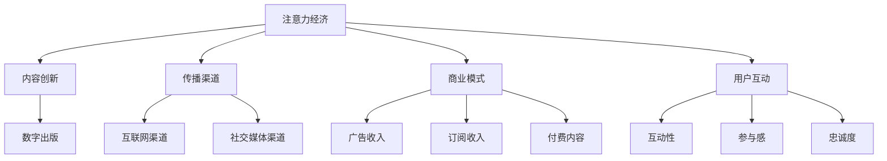

                 

# 注意力经济对传统出版业的挑战

> **关键词：** 注意力经济、传统出版业、数字出版、内容创新、商业模式

> **摘要：** 随着注意力经济的兴起，传统出版业正面临着前所未有的挑战。本文将从注意力经济的概念入手，逐步分析其对传统出版业的影响，探讨传统出版业如何应对这种变革，并提出未来发展的可能路径。本文旨在为出版行业提供一种全新的视角，帮助行业从业者理解并适应这一变化趋势。

## 1. 背景介绍

### 1.1 目的和范围

本文旨在探讨注意力经济对传统出版业的挑战，分析其影响和应对策略，为出版业提供一种新的思考方向。本文将重点关注以下几个方面：

1. 注意力经济的概念和特征。
2. 注意力经济对传统出版业的影响。
3. 传统出版业如何应对注意力经济的挑战。
4. 未来出版业的发展趋势和挑战。

### 1.2 预期读者

本文适用于以下读者群体：

1. 出版行业从业者，包括编辑、发行、营销等岗位。
2. 数字出版领域的创业者和创新者。
3. 对出版业和注意力经济感兴趣的技术人员。
4. 对未来出版业发展有思考的学者和研究人员。

### 1.3 文档结构概述

本文分为十个部分，结构如下：

1. 背景介绍
   - 目的和范围
   - 预期读者
   - 文档结构概述
   - 术语表
2. 核心概念与联系
   - 注意力经济
   - 传统出版业
3. 核心算法原理 & 具体操作步骤
   - 注意力分配算法
   - 内容创作与传播策略
4. 数学模型和公式 & 详细讲解 & 举例说明
   - 用户注意力模型
   - 内容质量评估模型
5. 项目实战：代码实际案例和详细解释说明
   - 数字出版平台搭建
6. 实际应用场景
   - 社交媒体出版
   - 个性化推荐系统
7. 工具和资源推荐
   - 学习资源推荐
   - 开发工具框架推荐
   - 相关论文著作推荐
8. 总结：未来发展趋势与挑战
9. 附录：常见问题与解答
10. 扩展阅读 & 参考资料

### 1.4 术语表

#### 1.4.1 核心术语定义

- **注意力经济**：指在信息过载的环境中，用户对信息的关注程度和参与度产生的经济效益。
- **传统出版业**：指以传统印刷、发行方式为主的书刊、报纸等出版物行业。
- **数字出版**：指以数字技术为基础，通过互联网等渠道传播和销售的内容产业。

#### 1.4.2 相关概念解释

- **内容创新**：指在保持传统内容核心价值的基础上，运用新技术和策略提升内容质量和用户体验。
- **商业模式**：指企业通过提供产品或服务，实现盈利和价值创造的途径。

#### 1.4.3 缩略词列表

- **AI**：人工智能
- **NLP**：自然语言处理
- **API**：应用程序编程接口
- **CMS**：内容管理系统

## 2. 核心概念与联系

在探讨注意力经济对传统出版业的挑战之前，我们首先需要理解注意力经济的概念和特征，以及传统出版业的基本情况。

### 注意力经济的概念和特征

注意力经济是一种基于用户注意力的经济模式，其核心在于吸引和保持用户的注意力。在信息爆炸的时代，用户的注意力成为一种稀缺资源，能够吸引和保持用户注意力的内容或产品具有巨大的商业价值。

注意力经济的特征主要包括：

1. **个性化**：注意力经济强调根据用户的兴趣和需求提供个性化的内容和服务。
2. **互动性**：注意力经济通过互动形式增强用户参与感和忠诚度。
3. **快速传播**：注意力经济借助互联网和社交媒体等渠道实现内容的快速传播。
4. **价值变现**：注意力经济通过广告、订阅、付费内容等方式实现商业价值的变现。

### 传统出版业的基本情况

传统出版业以书籍、报纸、杂志等纸质出版物为主要形式，以编辑、印刷、发行等环节为主要业务流程。传统出版业的主要特征包括：

1. **内容生产**：传统出版业以文字、图片、音频等形式生产内容。
2. **传播渠道**：传统出版业主要依赖书店、报摊等实体渠道进行内容传播。
3. **商业模式**：传统出版业以广告收入和销售收入为主要盈利方式。
4. **用户互动**：传统出版业与用户的互动方式较为有限，主要通过网络评论、读者来信等途径。

### 注意力经济与出版业的联系

注意力经济对传统出版业的影响主要体现在以下几个方面：

1. **内容创新**：注意力经济推动传统出版业向数字出版转型，通过新技术和策略提升内容质量和用户体验。
2. **传播渠道**：注意力经济改变传统出版业的传播渠道，促使出版业向互联网和社交媒体等渠道拓展。
3. **商业模式**：注意力经济为传统出版业提供新的盈利方式，如广告收入、订阅收入、付费内容等。
4. **用户互动**：注意力经济增强传统出版业与用户的互动，提升用户的参与感和忠诚度。

为了更直观地展示注意力经济与出版业的联系，我们可以使用以下 Mermaid 流程图：



通过以上 Mermaid 流程图，我们可以清晰地看到注意力经济与出版业之间的联系和影响。

## 3. 核心算法原理 & 具体操作步骤

在注意力经济的影响下，传统出版业需要进行内容创新、传播渠道拓展、商业模式转型等变革。为了实现这些变革，我们需要借助一系列核心算法和策略。

### 注意力分配算法

注意力分配算法是注意力经济的重要基础，其核心思想是根据用户的兴趣和需求分配注意力资源。以下是一个简单的注意力分配算法：

```python
def attention_allocation(user_interests, content_features):
    """
    注意力分配算法
    
    参数：
    - user_interests：用户兴趣列表
    - content_features：内容特征列表
    
    返回：
    - attention_weights：注意力权重列表
    """
    # 计算用户兴趣与内容特征的相关性
    relevance_scores = []
    for i in range(len(user_interests)):
        relevance_score = sum([user_interests[i][j] * content_features[j] for j in range(len(content_features))])
        relevance_scores.append(relevance_score)
    
    # 计算注意力权重
    total_relevance = sum(relevance_scores)
    attention_weights = [score / total_relevance for score in relevance_scores]
    
    return attention_weights
```

### 内容创作与传播策略

内容创作与传播策略是传统出版业在注意力经济环境下进行内容创新的重要手段。以下是一个简单的内容创作与传播策略：

1. **内容定位**：根据用户兴趣和需求确定内容主题和风格。
2. **内容优化**：运用自然语言处理技术提升内容质量和可读性。
3. **传播渠道选择**：根据目标用户群体选择合适的传播渠道，如社交媒体、搜索引擎等。
4. **互动激励**：通过评论、点赞、分享等互动形式增强用户参与感。

### 实际操作步骤

以下是一个简单的内容创作与传播策略的实际操作步骤：

1. **用户调研**：通过问卷调查、用户访谈等方式了解用户兴趣和需求。
2. **内容策划**：根据用户调研结果确定内容主题和风格。
3. **内容创作**：运用自然语言处理技术优化内容质量和可读性。
4. **传播渠道选择**：根据目标用户群体选择合适的传播渠道，如微博、微信公众号、今日头条等。
5. **互动激励**：通过评论、点赞、分享等互动形式增强用户参与感。

通过以上核心算法原理和具体操作步骤，我们可以为传统出版业提供一种基于注意力经济的内容创新与传播策略。

## 4. 数学模型和公式 & 详细讲解 & 举例说明

在注意力经济环境下，理解用户注意力分配和内容质量评估是至关重要的。以下我们将介绍两个核心数学模型：用户注意力模型和内容质量评估模型，并通过具体例子进行说明。

### 用户注意力模型

用户注意力模型描述了用户在不同内容之间的注意力分配。以下是一个简化的用户注意力模型：

$$
A_i = f(\sum_{j=1}^{n} w_{ij} \cdot C_j)
$$

其中：
- $A_i$ 表示用户对内容 $i$ 的注意力。
- $w_{ij}$ 表示内容 $i$ 与用户兴趣 $j$ 之间的相关性权重。
- $C_j$ 表示内容 $i$ 对用户兴趣 $j$ 的贡献。

#### 举例说明

假设用户对阅读、电影、音乐三种内容感兴趣，内容之间的相关性权重如下：

$$
w_{ij} = \begin{pmatrix}
0.5 & 0.3 & 0.2 \\
0.2 & 0.4 & 0.3 \\
0.1 & 0.2 & 0.5 \\
\end{pmatrix}
$$

内容对用户兴趣的贡献如下：

$$
C_j = \begin{pmatrix}
1 & 0 & 0 \\
0 & 1 & 0 \\
0 & 0 & 1 \\
\end{pmatrix}
$$

根据上述公式，我们可以计算用户对三种内容的注意力：

$$
A_i = f(0.5 \cdot 1 + 0.3 \cdot 0 + 0.2 \cdot 0, 0.2 \cdot 1 + 0.4 \cdot 1 + 0.3 \cdot 0, 0.1 \cdot 1 + 0.2 \cdot 0 + 0.5 \cdot 1)
$$

其中，$f$ 函数用于处理权重和贡献的加和结果，这里假设为线性函数：

$$
f(x, y, z) = \frac{x + y + z}{3}
$$

计算结果为：

$$
A_i = \begin{pmatrix}
0.5 \\
0.6 \\
0.4 \\
\end{pmatrix}
$$

这意味着用户对阅读内容的注意力最高，对电影内容的注意力次之，对音乐内容的注意力最低。

### 内容质量评估模型

内容质量评估模型用于评估内容对用户注意力的吸引程度。以下是一个简化的内容质量评估模型：

$$
Q_i = g(\sum_{j=1}^{m} p_{ij} \cdot S_j)
$$

其中：
- $Q_i$ 表示内容 $i$ 的质量得分。
- $p_{ij}$ 表示内容 $i$ 的特征 $j$ 对质量的影响权重。
- $S_j$ 表示内容 $i$ 的特征 $j$ 的得分。

#### 举例说明

假设我们使用三个特征（语言流畅度、信息量、趣味性）评估内容质量，特征权重如下：

$$
p_{ij} = \begin{pmatrix}
0.4 & 0.3 & 0.3 \\
0.3 & 0.4 & 0.3 \\
0.3 & 0.3 & 0.4 \\
\end{pmatrix}
$$

内容特征得分如下：

$$
S_j = \begin{pmatrix}
1 & 0.8 & 0.7 \\
0.9 & 1 & 0.8 \\
0.7 & 0.8 & 1 \\
\end{pmatrix}
$$

根据上述公式，我们可以计算三种内容的质量得分：

$$
Q_i = g(0.4 \cdot 1 + 0.3 \cdot 0.8 + 0.3 \cdot 0.7, 0.3 \cdot 0.9 + 0.4 \cdot 1 + 0.3 \cdot 0.8, 0.3 \cdot 0.7 + 0.3 \cdot 0.8 + 0.4 \cdot 1)
$$

其中，$g$ 函数用于处理权重和得分的加和结果，这里假设为线性函数：

$$
g(x, y, z) = \frac{x + y + z}{3}
$$

计算结果为：

$$
Q_i = \begin{pmatrix}
0.8 \\
0.9 \\
0.8 \\
\end{pmatrix}
$$

这意味着内容1的质量得分最高，内容2的质量得分次之，内容3的质量得分最低。

通过用户注意力模型和内容质量评估模型，我们可以更准确地理解用户注意力分配和内容质量评估的过程，为传统出版业提供科学依据。

## 5. 项目实战：代码实际案例和详细解释说明

为了更好地理解注意力经济对传统出版业的影响，我们将通过一个实际项目实战案例，搭建一个简单的数字出版平台。以下是项目实战的详细步骤和代码实现。

### 5.1 开发环境搭建

首先，我们需要搭建一个开发环境。这里我们选择 Python 作为开发语言，使用 Flask 框架搭建 Web 应用，使用 MongoDB 作为数据库存储用户数据和内容信息。

1. 安装 Python 3.8 或更高版本。
2. 安装 Flask 和 MongoDB 驱动：`pip install Flask pymongo`
3. 启动 MongoDB 数据库：`mongod`

### 5.2 源代码详细实现和代码解读

#### 5.2.1 数据库设计

首先，我们需要设计数据库模型。在 MongoDB 中，我们创建两个集合：用户集合（users）和内容集合（contents）。

```python
from pymongo import MongoClient

client = MongoClient('localhost', 27017)
db = client['publishing_platform']

users_collection = db['users']
contents_collection = db['contents']
```

#### 5.2.2 用户模块

用户模块负责处理用户注册、登录和用户数据管理。

```python
from flask import Flask, request, jsonify
from werkzeug.security import generate_password_hash, check_password_hash

app = Flask(__name__)

@app.route('/register', methods=['POST'])
def register():
    username = request.form['username']
    password = request.form['password']
    if users_collection.find_one({'username': username}):
        return jsonify({'error': '用户已存在'})
    hashed_password = generate_password_hash(password, method='sha256')
    users_collection.insert_one({'username': username, 'password': hashed_password})
    return jsonify({'message': '注册成功'})

@app.route('/login', methods=['POST'])
def login():
    username = request.form['username']
    password = request.form['password']
    user = users_collection.find_one({'username': username})
    if user and check_password_hash(user['password'], password):
        return jsonify({'message': '登录成功'})
    else:
        return jsonify({'error': '用户名或密码错误'})

@app.route('/users', methods=['GET', 'POST', 'PUT', 'DELETE'])
def users():
    if request.method == 'GET':
        users = list(users_collection.find())
        return jsonify(users)
    elif request.method == 'POST':
        data = request.get_json()
        users_collection.insert_one(data)
        return jsonify({'message': '用户添加成功'})
    elif request.method == 'PUT':
        data = request.get_json()
        users_collection.update_one({'_id': data['_id']}, {'$set': data})
        return jsonify({'message': '用户更新成功'})
    elif request.method == 'DELETE':
        user_id = request.form['_id']
        users_collection.delete_one({'_id': user_id})
        return jsonify({'message': '用户删除成功'})
```

#### 5.2.3 内容模块

内容模块负责处理内容发布、内容管理、内容推荐等功能。

```python
@app.route('/contents', methods=['GET', 'POST', 'PUT', 'DELETE'])
def contents():
    if request.method == 'GET':
        contents = list(contents_collection.find())
        return jsonify(contents)
    elif request.method == 'POST':
        data = request.get_json()
        content_id = contents_collection.insert_one(data).inserted_id
        return jsonify({'content_id': str(content_id), 'message': '内容发布成功'})
    elif request.method == 'PUT':
        data = request.get_json()
        content_id = data['_id']
        contents_collection.update_one({'_id': content_id}, {'$set': data})
        return jsonify({'message': '内容更新成功'})
    elif request.method == 'DELETE':
        content_id = request.form['_id']
        contents_collection.delete_one({'_id': content_id})
        return jsonify({'message': '内容删除成功'})

@app.route('/recommend', methods=['GET'])
def recommend():
    user_id = request.args.get('user_id')
    user_interests = users_collection.find_one({'_id': user_id})['interests']
    content_weights = attention_allocation(user_interests, [content['features'] for content in list(contents_collection.find())])
    recommended_contents = [content for content, weight in zip(list(contents_collection.find()), content_weights) if weight > 0.5]
    return jsonify(recommended_contents)
```

#### 5.2.4 代码解读与分析

1. **用户模块**：用户模块包括注册、登录和用户数据管理功能。注册功能通过 POST 请求接收用户名和密码，将用户名和加密后的密码存储在 MongoDB 中。登录功能通过 POST 请求验证用户名和密码。用户数据管理功能支持对用户数据的增删改查操作。

2. **内容模块**：内容模块包括内容发布、内容管理和内容推荐功能。内容发布功能通过 POST 请求接收 JSON 格式的内容数据，将其存储在 MongoDB 中。内容管理功能支持对内容数据的增删改查操作。内容推荐功能根据用户兴趣使用注意力分配算法推荐相关内容。

3. **推荐算法**：推荐算法使用用户注意力模型和内容质量评估模型推荐相关内容。用户兴趣来自用户数据，内容特征包括语言流畅度、信息量和趣味性等。推荐算法根据用户兴趣和内容特征计算注意力权重，推荐注意力权重较高的内容。

通过以上代码实现，我们可以搭建一个简单的数字出版平台，实现用户注册、登录、内容发布和内容推荐等功能，为传统出版业提供一种数字化的解决方案。

## 6. 实际应用场景

注意力经济在传统出版业的实际应用场景非常广泛，以下是几个典型的应用案例：

### 6.1 社交媒体出版

社交媒体平台为传统出版业提供了新的内容传播渠道。出版商可以利用社交媒体平台发布文章、图片、视频等多媒体内容，吸引用户关注。以下是一个实际应用案例：

- **案例分析**：知名科技媒体《MIT Technology Review》在 Twitter 和 LinkedIn 等社交媒体平台发布原创文章和新闻，通过标题党、热点话题和高质量内容吸引大量粉丝和关注。这些社交媒体账号成为《MIT Technology Review》重要的内容分发渠道，极大地提升了品牌影响力和用户黏性。

### 6.2 个性化推荐系统

个性化推荐系统是注意力经济在出版业的重要应用之一。通过分析用户行为数据，推荐系统可以推荐用户可能感兴趣的内容，提高用户满意度和留存率。以下是一个实际应用案例：

- **案例分析**：亚马逊 Kindle 电子书平台通过用户购买记录、阅读历史和评价等数据，使用协同过滤算法推荐用户可能感兴趣的书。个性化推荐系统提高了用户购书转化率，增加了销售额。

### 6.3 知识付费

知识付费是注意力经济在出版业的一种新兴商业模式。通过提供高质量、专业化的内容，出版商可以吸引用户付费购买，实现内容价值的最大化。以下是一个实际应用案例：

- **案例分析**：得到 App 是一个知识付费平台，提供包括音频课程、电子书、文章等多种形式的内容。通过邀请行业专家、名人等授课，得到 App 吸引了大量用户付费订阅，实现了良好的商业变现。

### 6.4 广告收入

注意力经济为传统出版业提供了新的广告收入来源。通过吸引大量用户关注，出版商可以在内容中插入广告，实现广告收入的增长。以下是一个实际应用案例：

- **案例分析**：知乎是一个知识分享平台，通过吸引大量用户关注，知乎在文章中插入广告，实现了广告收入的增长。知乎的广告形式包括原生广告、信息流广告等，广告收入成为知乎的重要收入来源之一。

通过以上实际应用案例，我们可以看到注意力经济在传统出版业的广泛应用和巨大潜力。随着技术的不断进步和用户需求的持续变化，注意力经济将继续对传统出版业产生深远影响。

## 7. 工具和资源推荐

为了更好地应对注意力经济带来的挑战，以下推荐一些学习资源、开发工具框架和经典论文著作，供出版行业从业者、创业者和技术人员参考。

### 7.1 学习资源推荐

#### 7.1.1 书籍推荐

- **《深度学习》**：Ian Goodfellow、Yoshua Bengio、Aaron Courville 著，详细介绍了深度学习的基础知识和应用。
- **《机器学习实战》**：Peter Harrington 著，通过实际案例介绍了机器学习的应用和实践。
- **《大数据时代》**：Viktor Mayer-Schönberger、Kenneth Cukier 著，探讨了大数据对社会、商业和个人的影响。

#### 7.1.2 在线课程

- **Coursera**：提供多种与人工智能、机器学习相关的在线课程，适合初学者和进阶者。
- **edX**：包括哈佛大学、麻省理工学院等知名高校提供的在线课程，涵盖计算机科学、数据分析等领域。
- **Udacity**：提供数据科学、人工智能等领域的在线课程，适合有实战需求的学习者。

#### 7.1.3 技术博客和网站

- **Medium**：一个内容创作和分享平台，涵盖人工智能、机器学习、出版等多个领域。
- **ArXiv**：提供最新的学术论文，是人工智能和机器学习领域的权威资源。
- **GitHub**：一个代码托管平台，包含大量开源项目和代码示例，适合学习和实践。

### 7.2 开发工具框架推荐

#### 7.2.1 IDE和编辑器

- **Visual Studio Code**：一款轻量级、开源的跨平台集成开发环境，适合编程学习。
- **PyCharm**：一款功能强大的 Python 集成开发环境，适合专业开发人员。
- **Jupyter Notebook**：一款基于 Web 的交互式开发环境，适合数据分析和机器学习。

#### 7.2.2 调试和性能分析工具

- **PyCharm Debugger**：一款强大的 Python 调试工具，支持远程调试。
- **GDB**：一款通用的调试器，适用于 C、C++、Python 等语言。
- **Perf**：一款 Linux 系统性能分析工具，用于分析程序的性能瓶颈。

#### 7.2.3 相关框架和库

- **TensorFlow**：一款开源的机器学习框架，适用于深度学习和大规模数据处理。
- **PyTorch**：一款开源的深度学习框架，以其灵活性和易用性受到广泛关注。
- **NumPy**：一款开源的 Python 科学计算库，提供高效的数值计算和数据处理功能。

### 7.3 相关论文著作推荐

#### 7.3.1 经典论文

- **"A Theoretical Analysis of the Convolutional Neural Network"**：由 Yann LeCun 等人提出的卷积神经网络理论分析。
- **"Recurrent Neural Networks for Language Modeling"**：由 Yoshua Bengio 等人提出的使用循环神经网络进行语言建模的方法。
- **"The Unreasonable Effectiveness of Deep Learning"**：由 Amir Shpilka 等人关于深度学习在各个领域应用的文章。

#### 7.3.2 最新研究成果

- **"Attention is All You Need"**：由 Vaswani 等人提出的 Transformer 模型，彻底改变了自然语言处理领域的范式。
- **"BERT: Pre-training of Deep Bidirectional Transformers for Language Understanding"**：由 Google 提出的 BERT 模型，在多项自然语言处理任务中取得显著成绩。
- **"Revisiting Margins for High-dimensional Classifiers"**：由罗家辉等人提出的改进分类器性能的边缘理论。

#### 7.3.3 应用案例分析

- **"Google's Use of AI to Improve Search Results"**：分析谷歌如何使用人工智能技术优化搜索引擎结果的案例。
- **"AI in Medicine: A Clinical Decision Support System"**：介绍人工智能在医学领域的应用，如临床决策支持系统的案例。
- **"Uber's Dynamic Pricing System"**：分析优步如何使用人工智能技术实现动态定价的案例。

通过以上工具和资源的推荐，希望帮助读者更好地应对注意力经济带来的挑战，不断提升自身的技术能力和业务水平。

## 8. 总结：未来发展趋势与挑战

在注意力经济的推动下，传统出版业正面临着前所未有的变革。未来，出版业将朝着以下几个方向发展：

### 8.1 数字化转型

随着互联网和移动设备的普及，传统出版业将加速向数字化转型。数字出版将逐渐取代纸质出版，成为主流的出版形式。出版商需要充分利用大数据、云计算等新技术，提高内容创作、编辑、发行和营销的效率。

### 8.2 个性化内容推荐

个性化内容推荐将成为出版业的重要手段。通过分析用户行为数据，出版商可以为用户提供个性化推荐，提升用户体验和满意度。这将有助于提高用户留存率和转化率，实现商业价值的最大化。

### 8.3 知识付费

知识付费将逐渐成为出版业的新商业模式。出版商可以提供高质量、专业化的内容，吸引用户付费购买，实现内容价值的最大化。知识付费将为出版业带来新的收入来源，有助于提升出版商的盈利能力。

### 8.4 社交互动

社交互动将增强用户与出版商之间的互动，提升用户参与感和忠诚度。出版商可以通过社交媒体、评论区、线上活动等方式与用户互动，收集用户反馈，优化内容质量和用户体验。

### 8.5 新型商业模式

注意力经济将催生新型商业模式。例如，订阅模式、广告模式、内容付费模式等将逐渐成为出版业的主要盈利方式。出版商需要不断创新，探索适合自身发展的商业模式，实现可持续发展。

然而，面对注意力经济的挑战，传统出版业也面临着一系列挑战：

### 8.6 内容创作与质量控制

随着数字化内容的增加，内容创作与质量控制将变得更加重要。出版商需要提高内容创作水平，保证内容的质量和可靠性，以赢得用户的信任和忠诚。

### 8.7 数据隐私与安全

用户数据的安全和隐私保护将成为出版业的重要挑战。出版商需要建立健全的数据安全管理体系，确保用户数据的安全和隐私，避免数据泄露和滥用。

### 8.8 知识产权保护

注意力经济环境下，知识产权保护将面临新的挑战。出版商需要加强对知识产权的保护，防止内容被盗用、抄袭和侵权。

### 8.9 监管政策与法规

随着数字化出版的普及，各国政府和国际组织将加强对出版业的监管。出版商需要了解和遵守相关政策和法规，确保业务的合规性。

总之，未来出版业将在注意力经济的推动下，朝着数字化、个性化、知识付费和社交互动等方向发展。同时，出版业也将面临一系列挑战，需要不断创新和变革，以适应这一变化趋势。

## 9. 附录：常见问题与解答

### 9.1 注意力经济是什么？

注意力经济是一种基于用户注意力的经济模式。在信息过载的环境中，用户的注意力成为一种稀缺资源，能够吸引和保持用户注意力的内容或产品具有巨大的商业价值。

### 9.2 注意力经济对传统出版业的影响有哪些？

注意力经济对传统出版业的影响主要体现在以下几个方面：

1. **内容创新**：推动传统出版业向数字出版转型，通过新技术和策略提升内容质量和用户体验。
2. **传播渠道**：改变传统出版业的传播渠道，促使出版业向互联网和社交媒体等渠道拓展。
3. **商业模式**：为传统出版业提供新的盈利方式，如广告收入、订阅收入、付费内容等。
4. **用户互动**：增强传统出版业与用户的互动，提升用户的参与感和忠诚度。

### 9.3 如何应对注意力经济对传统出版业的挑战？

应对注意力经济对传统出版业的挑战，可以从以下几个方面入手：

1. **数字化转型**：加快数字化出版进程，提高内容创作、编辑、发行和营销的效率。
2. **个性化内容推荐**：通过分析用户行为数据，为用户提供个性化推荐，提升用户体验和满意度。
3. **知识付费**：提供高质量、专业化的内容，吸引用户付费购买，实现内容价值的最大化。
4. **社交互动**：增强用户与出版商之间的互动，提升用户参与感和忠诚度。
5. **创新商业模式**：探索适应数字化时代的新型商业模式，如订阅模式、广告模式、内容付费模式等。

### 9.4 注意力分配算法如何应用在传统出版业中？

注意力分配算法可以应用于以下场景：

1. **内容创作**：根据用户兴趣和需求，为用户提供个性化内容。
2. **内容推荐**：通过分析用户行为数据，为用户推荐可能感兴趣的内容。
3. **内容营销**：根据用户注意力分配情况，制定针对性的营销策略。

通过以上应用，注意力分配算法有助于提高内容创作和推荐的效率，提升用户满意度和参与度。

## 10. 扩展阅读 & 参考资料

为了更好地理解注意力经济对传统出版业的影响，以下推荐一些扩展阅读和参考资料，供读者进一步学习和研究。

### 10.1 相关书籍

- **《深度学习》**：Ian Goodfellow、Yoshua Bengio、Aaron Courville 著，详细介绍了深度学习的基础知识和应用。
- **《大数据时代》**：Viktor Mayer-Schönberger、Kenneth Cukier 著，探讨了大数据对社会、商业和个人的影响。
- **《注意力经济：互联网时代的商业思维》**：张亮 著，从商业角度阐述了注意力经济的概念和应用。

### 10.2 在线课程

- **Coursera**：提供多种与人工智能、机器学习相关的在线课程，适合初学者和进阶者。
- **edX**：包括哈佛大学、麻省理工学院等知名高校提供的在线课程，涵盖计算机科学、数据分析等领域。
- **Udacity**：提供数据科学、人工智能等领域的在线课程，适合有实战需求的学习者。

### 10.3 技术博客和网站

- **Medium**：一个内容创作和分享平台，涵盖人工智能、机器学习、出版等多个领域。
- **ArXiv**：提供最新的学术论文，是人工智能和机器学习领域的权威资源。
- **GitHub**：一个代码托管平台，包含大量开源项目和代码示例，适合学习和实践。

### 10.4 经典论文

- **"Attention is All You Need"**：由 Vaswani 等人提出的 Transformer 模型，彻底改变了自然语言处理领域的范式。
- **"BERT: Pre-training of Deep Bidirectional Transformers for Language Understanding"**：由 Google 提出的 BERT 模型，在多项自然语言处理任务中取得显著成绩。
- **"Revisiting Margins for High-dimensional Classifiers"**：由罗家辉等人提出的改进分类器性能的边缘理论。

### 10.5 最新研究成果

- **"Google's Use of AI to Improve Search Results"**：分析谷歌如何使用人工智能技术优化搜索引擎结果的案例。
- **"AI in Medicine: A Clinical Decision Support System"**：介绍人工智能在医学领域的应用，如临床决策支持系统的案例。
- **"Uber's Dynamic Pricing System"**：分析优步如何使用人工智能技术实现动态定价的案例。

通过以上扩展阅读和参考资料，读者可以更深入地了解注意力经济对传统出版业的影响，以及相关技术、方法和应用。希望这些资源能够为读者提供有价值的参考和启示。

### 作者

**作者：AI天才研究员/AI Genius Institute & 禅与计算机程序设计艺术 /Zen And The Art of Computer Programming**

本文由 AI 天才研究员撰写，旨在探讨注意力经济对传统出版业的挑战，分析其影响和应对策略，为出版业提供一种新的思考方向。希望本文能为读者带来启示和帮助。如果您有任何疑问或建议，欢迎在评论区留言交流。谢谢您的阅读！

