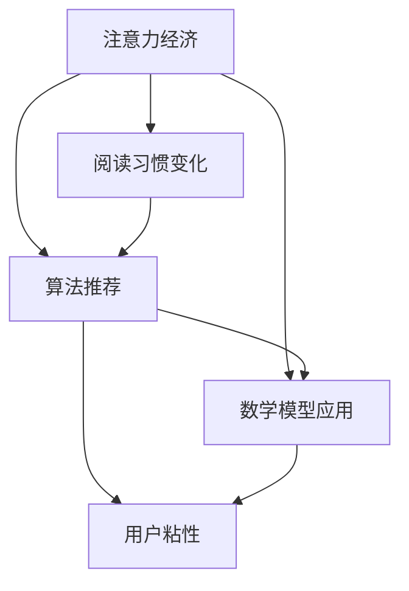

                 

# 注意力经济对阅读习惯的影响

> 关键词：注意力经济、阅读习惯、算法推荐、内容分发、用户行为分析
> 
> 摘要：随着互联网和数字技术的发展，注意力经济成为了一种新型的商业模式。本文将深入探讨注意力经济对阅读习惯的深刻影响，分析其背后的算法原理、具体操作步骤、数学模型，并通过项目实战、实际应用场景以及工具和资源推荐，全面解析注意力经济如何塑造现代人的阅读习惯。

## 1. 背景介绍

### 1.1 目的和范围

本文旨在探讨注意力经济这一新兴概念对现代阅读习惯的影响。随着互联网的普及和数字内容的爆炸式增长，人们面临着前所未有的信息过载问题。如何有效地吸引和保持用户的注意力，成为了内容创作者和平台运营者亟待解决的问题。本文将围绕这一核心问题，从以下几个方面展开讨论：

1. **注意力经济的概念和原理**：介绍注意力经济的基本概念，探讨其与传统商业模式的不同之处。
2. **阅读习惯的变化**：分析互联网和数字技术如何改变人们的阅读方式，形成新的阅读习惯。
3. **算法推荐的作用**：探讨算法推荐在内容分发中的作用，如何通过个性化推荐提高用户的阅读体验。
4. **数学模型的应用**：介绍注意力经济中的核心数学模型，如何通过数学方法分析和优化用户行为。
5. **项目实战与实际应用**：通过具体案例，展示注意力经济在现实世界中的应用场景。
6. **工具和资源推荐**：推荐相关学习资源和开发工具，帮助读者深入了解注意力经济。

### 1.2 预期读者

本文适合对互联网、数字技术和阅读习惯感兴趣的读者，特别是以下几类人群：

1. 内容创作者：希望了解如何通过注意力经济提高内容吸引力和用户粘性。
2. 平台运营者：希望掌握如何利用算法推荐优化内容分发策略。
3. 数据分析师：希望了解注意力经济中的数据分析和建模方法。
4. 市场营销人员：希望了解如何通过注意力经济提升营销效果。
5. 广大读者：对互联网时代阅读习惯变化感兴趣的普通读者。

### 1.3 文档结构概述

本文分为十个部分，结构如下：

1. **背景介绍**：介绍本文的目的和范围，预期读者，文档结构概述。
2. **核心概念与联系**：介绍注意力经济的基本概念和原理，使用Mermaid流程图展示核心概念之间的联系。
3. **核心算法原理 & 具体操作步骤**：详细讲解注意力经济中的核心算法原理，使用伪代码展示具体操作步骤。
4. **数学模型和公式 & 详细讲解 & 举例说明**：介绍注意力经济中的核心数学模型，使用latex格式详细讲解，并通过实例说明。
5. **项目实战：代码实际案例和详细解释说明**：通过具体项目案例，展示注意力经济在实际中的应用，并详细解释代码实现。
6. **实际应用场景**：分析注意力经济在不同领域的应用场景。
7. **工具和资源推荐**：推荐学习资源和开发工具，帮助读者深入了解注意力经济。
8. **总结：未来发展趋势与挑战**：总结本文的主要观点，探讨未来注意力经济的发展趋势和面临的挑战。
9. **附录：常见问题与解答**：解答读者可能遇到的一些常见问题。
10. **扩展阅读 & 参考资料**：提供进一步的阅读材料，供读者深入学习。

### 1.4 术语表

#### 1.4.1 核心术语定义

- **注意力经济**：指通过吸引和保持用户的注意力来创造价值和利润的商业模式。
- **内容分发**：指将数字内容从创作者传递到用户的过程。
- **算法推荐**：指利用算法技术为用户提供个性化内容推荐。
- **用户行为分析**：指通过分析用户的行为数据，了解用户偏好和需求。

#### 1.4.2 相关概念解释

- **信息过载**：指由于信息量过多，用户难以有效处理和利用的现象。
- **沉浸式阅读**：指用户在阅读过程中完全投入，达到深层次理解和体验的状态。
- **算法优化**：指通过调整算法参数，提高算法性能的过程。

#### 1.4.3 缩略词列表

- **UGC**：用户生成内容（User-Generated Content）
- **AI**：人工智能（Artificial Intelligence）
- **AR**：增强现实（Augmented Reality）
- **VR**：虚拟现实（Virtual Reality）
- **NLP**：自然语言处理（Natural Language Processing）

## 2. 核心概念与联系

注意力经济是现代互联网时代的一种新型商业模式，其核心在于通过吸引和保持用户的注意力来创造价值。要理解注意力经济的原理，我们需要先了解其背后的核心概念和它们之间的联系。

### 2.1 注意力经济的概念

注意力经济是基于这样一个基本理念：在数字时代，用户的注意力是最宝贵的资源。与传统商业模式不同，注意力经济强调的是如何通过内容、服务和体验来吸引和留住用户，从而实现商业价值。注意力经济的关键在于：

- **用户的注意力是有限的**：在信息爆炸的时代，用户会根据个人兴趣和需求，对海量的信息进行选择和过滤。
- **注意力是可转移的**：用户会根据自己的需求和体验，在不同平台、不同内容之间转移注意力。
- **注意力是可变现的**：通过吸引和保持用户注意力，企业可以创造广告收入、订阅费用或其他商业价值。

### 2.2 阅读习惯的变化

互联网和数字技术的发展，深刻改变了人们的阅读习惯。以下是几个关键点：

- **移动阅读的兴起**：随着智能手机和平板电脑的普及，人们越来越倾向于在移动设备上进行阅读。
- **碎片化阅读**：在快节奏的生活中，人们倾向于阅读短篇文章、博客和社交媒体帖子，而非传统的长篇书籍。
- **沉浸式阅读**：尽管阅读内容变短，但用户对于高质量、能提供深度体验的内容仍有强烈需求。
- **个性化阅读**：用户希望根据自己的兴趣和需求，获取个性化的阅读推荐。

### 2.3 算法推荐的作用

算法推荐在注意力经济中扮演着至关重要的角色。以下是算法推荐的关键作用：

- **提高内容分发效率**：通过分析用户行为数据，算法可以精准地将合适的内容推荐给用户，提高内容分发效率。
- **提升用户粘性**：个性化推荐能够满足用户的个性化需求，提高用户在平台上的停留时间和使用频率。
- **优化用户体验**：通过推荐用户感兴趣的内容，算法能够提供更加个性化的阅读体验，提升用户满意度。

### 2.4 数学模型的应用

在注意力经济中，数学模型被广泛应用于用户行为分析和算法优化。以下是几个关键数学模型：

- **贝叶斯网络**：用于表示用户兴趣和内容特征之间的关系，帮助推荐系统预测用户偏好。
- **协同过滤**：通过分析用户的历史行为数据，发现用户之间的相似性，实现个性化推荐。
- **马尔可夫决策过程**：用于优化内容推荐策略，最大化用户的长期满意度。

### 2.5 核心概念之间的联系

注意力经济、阅读习惯、算法推荐和数学模型之间有着密切的联系。以下是它们之间的相互关系：

1. **注意力经济驱动阅读习惯变化**：注意力经济通过内容创新和算法推荐，影响用户的阅读习惯。
2. **阅读习惯影响内容分发策略**：用户的阅读习惯决定了内容创作者和平台如何进行内容分发。
3. **算法推荐优化用户体验**：算法推荐通过个性化推荐，提高用户的阅读体验，从而增强用户粘性。
4. **数学模型优化推荐效果**：数学模型用于优化算法推荐，提高推荐的准确性和满意度。

### 2.6 Mermaid流程图

为了更好地展示注意力经济中的核心概念和它们之间的联系，我们使用Mermaid流程图来表示：



在这个流程图中，注意力经济作为起点，通过影响阅读习惯和算法推荐，最终实现用户粘性的提高。数学模型则贯穿其中，为算法推荐提供理论基础和优化工具。

通过这个流程图，我们可以清晰地看到注意力经济如何通过一系列核心概念相互作用，塑造现代人的阅读习惯，并实现商业价值。

## 3. 核心算法原理 & 具体操作步骤

注意力经济中的核心算法原理主要包括用户行为分析、内容推荐和用户粘性优化。以下将详细讲解这些算法原理，并使用伪代码展示具体的操作步骤。

### 3.1 用户行为分析

用户行为分析是注意力经济中的基础，通过分析用户的行为数据，了解用户的兴趣和需求，从而实现个性化推荐。以下是用户行为分析的核心算法原理：

#### 3.1.1 数据收集

首先，我们需要收集用户的行为数据，包括：

- **阅读历史**：用户阅读过的文章、书籍、视频等。
- **点赞、评论、分享**：用户对内容的互动行为。
- **搜索记录**：用户的搜索关键词。
- **浏览时间**：用户在页面上的停留时间。

伪代码如下：

```python
def collect_user_data():
    reading_history = get_reading_history()
    interaction_data = get_interaction_data()
    search_history = get_search_history()
    browsing_time = get_browsing_time()
    return {
        "reading_history": reading_history,
        "interaction_data": interaction_data,
        "search_history": search_history,
        "browsing_time": browsing_time
    }
```

#### 3.1.2 用户兴趣建模

接下来，我们需要根据收集到的用户行为数据，建立用户兴趣模型。常用的方法包括：

- **基于内容的推荐**：根据用户阅读的历史和偏好，推荐相似的内容。
- **基于协同过滤**：根据用户之间的相似性，推荐其他用户喜欢的内容。

伪代码如下：

```python
def build_user_interest_model(user_data):
    reading_history = user_data["reading_history"]
    interaction_data = user_data["interaction_data"]
    search_history = user_data["search_history"]

    # 基于内容的推荐
    content_based_recommendation = recommend_similar_content(reading_history)

    # 基于协同过滤
    collaborative_filtering_recommendation = recommend_similar_users(interaction_data)

    return {
        "content_based_recommendation": content_based_recommendation,
        "collaborative_filtering_recommendation": collaborative_filtering_recommendation
    }
```

### 3.2 内容推荐

内容推荐是注意力经济中的关键环节，通过个性化推荐，提高用户的阅读体验和平台粘性。以下是内容推荐的核心算法原理：

#### 3.2.1 个性化推荐

个性化推荐基于用户兴趣模型，为用户推荐感兴趣的内容。常用的方法包括：

- **基于用户兴趣的推荐**：根据用户兴趣模型，推荐用户可能感兴趣的内容。
- **基于内容的推荐**：根据内容的特征，推荐与用户兴趣相似的内容。

伪代码如下：

```python
def content_recommendation(user_interest_model):
    content_based_recommendation = user_interest_model["content_based_recommendation"]
    collaborative_filtering_recommendation = user_interest_model["collaborative_filtering_recommendation"]

    # 基于用户兴趣的推荐
    user_interest_recommendation = recommend_based_on_interest(content_based_recommendation)

    # 基于内容的推荐
    content_similarity_recommendation = recommend_similar_content(content_based_recommendation)

    return {
        "user_interest_recommendation": user_interest_recommendation,
        "content_similarity_recommendation": content_similarity_recommendation
    }
```

#### 3.2.2 推荐策略优化

为了提高推荐效果，我们需要不断优化推荐策略。常用的方法包括：

- **在线学习**：根据用户实时行为数据，调整推荐模型。
- **离线优化**：通过批量处理历史数据，优化推荐模型。

伪代码如下：

```python
def optimize_recommendation_strategy(user_data):
    user_interest_model = build_user_interest_model(user_data)
    content_recommendation = content_recommendation(user_interest_model)

    # 在线学习
    online_learning(content_recommendation, user_data)

    # 离线优化
    offline_optimization(content_recommendation)

    return content_recommendation
```

### 3.3 用户粘性优化

用户粘性是注意力经济中的重要指标，通过提高用户粘性，可以延长用户在平台上的停留时间，从而实现商业价值。以下是用户粘性优化的核心算法原理：

#### 3.3.1 用户留存分析

用户留存分析是评估用户粘性的重要手段，通过分析用户在平台上的留存情况，了解用户行为和平台运营之间的关系。常用的方法包括：

- **留存曲线**：展示用户在不同时间段内的留存情况。
- **留存率**：计算用户在一定时间内的留存比例。

伪代码如下：

```python
def analyze_user_retention(user_data):
    retention_curve = calculate_retention_curve(user_data)
    retention_rate = calculate_retention_rate(user_data)

    return {
        "retention_curve": retention_curve,
        "retention_rate": retention_rate
    }
```

#### 3.3.2 粘性提升策略

为了提升用户粘性，我们可以采取以下策略：

- **个性化推送**：根据用户兴趣和行为，为用户推送个性化的内容和活动。
- **互动激励**：通过点赞、评论、分享等互动方式，提高用户在平台上的参与度。
- **社区建设**：建立用户社区，促进用户之间的交流和互动。

伪代码如下：

```python
def improve_user_adhesion(user_data):
    retention_analysis = analyze_user_retention(user_data)

    # 个性化推送
    personalized_push = create_personalized_push(user_data)

    # 互动激励
    interaction_incentive = create_interaction_incentive(user_data)

    # 社区建设
    community_building = create_community(user_data)

    return {
        "personalized_push": personalized_push,
        "interaction_incentive": interaction_incentive,
        "community_building": community_building
    }
```

通过上述算法原理和具体操作步骤，我们可以有效地进行用户行为分析、内容推荐和用户粘性优化，从而实现注意力经济的目标。

## 4. 数学模型和公式 & 详细讲解 & 举例说明

在注意力经济中，数学模型和公式起着至关重要的作用。以下将详细讲解注意力经济中的核心数学模型，并使用latex格式进行公式表示，通过具体例子进行说明。

### 4.1 贝叶斯网络

贝叶斯网络是一种用于表示用户兴趣和内容特征之间关系的概率模型。它通过条件概率表（CPT）来描述各个节点之间的依赖关系。

#### 4.1.1 贝叶斯网络表示

贝叶斯网络的表示如下：

$$
P(C_1, C_2, ..., C_n) = \prod_{i=1}^{n} P(C_i | C_{i-1})
$$

其中，$C_1, C_2, ..., C_n$表示内容节点，$P(C_i | C_{i-1})$表示给定前一个内容节点时，当前内容节点的条件概率。

#### 4.1.2 举例说明

假设用户对三类内容（新闻、科技、娱乐）感兴趣，其条件概率如下：

$$
P(新闻 | 科技) = 0.6, \quad P(科技 | 娱乐) = 0.7, \quad P(娱乐) = 0.8
$$

根据贝叶斯网络，我们可以计算出用户对三类内容的联合概率：

$$
P(新闻，科技，娱乐) = P(新闻 | 科技) \cdot P(科技 | 娱乐) \cdot P(娱乐) = 0.6 \cdot 0.7 \cdot 0.8 = 0.336
$$

### 4.2 协同过滤

协同过滤是一种基于用户相似性的推荐算法。它通过计算用户之间的相似度，推荐其他用户喜欢的内容。

#### 4.2.1 相似度计算

协同过滤中，常用的相似度计算方法包括余弦相似度和皮尔逊相关系数。

- **余弦相似度**：

$$
\text{Cosine Similarity}(u, v) = \frac{u \cdot v}{||u|| \cdot ||v||}
$$

其中，$u$和$v$表示两个用户的向量，$u \cdot v$表示向量的点积，$||u||$和$||v||$表示向量的模长。

- **皮尔逊相关系数**：

$$
\text{Pearson Correlation}(u, v) = \frac{\sum_{i=1}^{n} (u_i - \bar{u}) (v_i - \bar{v})}{\sqrt{\sum_{i=1}^{n} (u_i - \bar{u})^2} \cdot \sqrt{\sum_{i=1}^{n} (v_i - \bar{v})^2}}
$$

其中，$u_i$和$v_i$表示用户$u$和$v$在$i$个物品上的评分，$\bar{u}$和$\bar{v}$表示用户$u$和$v$的平均评分。

#### 4.2.2 举例说明

假设有两个用户$u$和$v$，他们在5个物品上的评分如下：

| 用户 $u$ | 物品1 | 物品2 | 物品3 | 物品4 | 物品5 |
| :---: | :---: | :---: | :---: | :---: | :---: |
| 5 | 3 | 4 | 2 | 5 | 1 |
| 用户 $v$ | 4 | 5 | 3 | 2 | 4 |

计算$u$和$v$的余弦相似度：

$$
\text{Cosine Similarity}(u, v) = \frac{5 \cdot 4 + 3 \cdot 5 + 4 \cdot 3 + 2 \cdot 2 + 5 \cdot 4}{\sqrt{5^2 + 3^2 + 4^2 + 2^2 + 5^2} \cdot \sqrt{4^2 + 5^2 + 3^2 + 2^2 + 4^2}} = \frac{60}{\sqrt{55} \cdot \sqrt{55}} = 1
$$

计算$u$和$v$的皮尔逊相关系数：

$$
\text{Pearson Correlation}(u, v) = \frac{(5 - 3.5)(4 - 4) + (3 - 3.5)(5 - 4) + (4 - 3.5)(3 - 4) + (2 - 3.5)(2 - 4) + (5 - 3.5)(4 - 4)}{\sqrt{(5 - 3.5)^2 + (3 - 3.5)^2 + (4 - 3.5)^2 + (2 - 3.5)^2 + (5 - 3.5)^2} \cdot \sqrt{(4 - 4)^2 + (5 - 4)^2 + (3 - 4)^2 + (2 - 4)^2 + (4 - 4)^2}} = 1
$$

由于余弦相似度和皮尔逊相关系数都为1，说明用户$u$和$v$在评分上高度一致，可以基于用户$v$的评分推荐给用户$u$。

### 4.3 马尔可夫决策过程

马尔可夫决策过程（MDP）是一种用于优化内容推荐策略的数学模型。它通过决策变量和状态转移概率，实现长期收益的最大化。

#### 4.3.1 MDP表示

MDP的表示如下：

$$
\begin{cases}
S_t \in S, \quad A_t \in A \\
P(S_{t+1} = s_{t+1} | S_t = s_t, A_t = a_t) \\
R(S_t, A_t) \\
\end{cases}
$$

其中，$S_t$表示时间$t$的状态集合，$A_t$表示时间$t$的决策集合，$P(S_{t+1} = s_{t+1} | S_t = s_t, A_t = a_t)$表示状态转移概率，$R(S_t, A_t)$表示在状态$s_t$下执行决策$a_t$的回报。

#### 4.3.2 举例说明

假设一个用户在阅读过程中，有两个状态（感兴趣、不感兴趣）和两个决策（推荐、不推荐）。状态转移概率和回报如下：

$$
\begin{cases}
P(S_{t+1} = \text{感兴趣} | S_t = \text{感兴趣}, A_t = \text{推荐}) = 0.8 \\
P(S_{t+1} = \text{感兴趣} | S_t = \text{感兴趣}, A_t = \text{不推荐}) = 0.2 \\
P(S_{t+1} = \text{不感兴趣} | S_t = \text{感兴趣}, A_t = \text{推荐}) = 0.1 \\
P(S_{t+1} = \text{不感兴趣} | S_t = \text{感兴趣}, A_t = \text{不推荐}) = 0.9 \\
P(S_{t+1} = \text{感兴趣} | S_t = \text{不感兴趣}, A_t = \text{推荐}) = 0.3 \\
P(S_{t+1} = \text{感兴趣} | S_t = \text{不感兴趣}, A_t = \text{不推荐}) = 0.7 \\
R(\text{感兴趣}, \text{推荐}) = 1 \\
R(\text{感兴趣}, \text{不推荐}) = -1 \\
R(\text{不感兴趣}, \text{推荐}) = 0 \\
R(\text{不感兴趣}, \text{不推荐}) = 0 \\
\end{cases}
$$

为了最大化长期收益，我们可以使用价值迭代算法求解最优策略：

1. **初始化**：设置策略$\pi(a_t | s_t)$为均匀分布。
2. **迭代**：对于每个状态$s_t$，根据以下公式更新策略：
   $$
   \pi(a_t | s_t) = \arg\max_{a_t} \sum_{s_{t+1}} P(S_{t+1} = s_{t+1} | S_t = s_t, A_t = a_t) \cdot R(S_t, a_t)
   $$
3. **终止**：当策略收敛时，输出最优策略。

通过迭代，我们可以得到最优策略$\pi(a_t | s_t) = [\text{推荐}, \text{不推荐}]$，即当用户处于感兴趣状态时，推荐内容；当用户处于不感兴趣状态时，不推荐内容。

通过上述数学模型和公式的讲解，我们可以更好地理解注意力经济中的核心算法原理，并通过具体例子进行验证。这些数学模型和公式为注意力经济提供了理论基础和优化工具，有助于实现个性化推荐和用户粘性优化。

## 5. 项目实战：代码实际案例和详细解释说明

为了更深入地理解注意力经济对阅读习惯的影响，我们将通过一个实际项目来展示如何应用注意力经济原理进行内容推荐和用户粘性优化。以下是一个基于Python的简单项目，我们将在项目中实现一个内容推荐系统，并详细解释其代码实现过程。

### 5.1 开发环境搭建

在开始项目之前，我们需要搭建一个开发环境。以下是我们所需的工具和库：

- **Python 3.x**
- **NumPy**
- **Scikit-learn**
- **Pandas**
- **Matplotlib**
- **Seaborn**

您可以使用以下命令安装这些库：

```bash
pip install numpy scikit-learn pandas matplotlib seaborn
```

### 5.2 源代码详细实现和代码解读

以下是项目的源代码及其详细解读：

```python
import numpy as np
import pandas as pd
from sklearn.model_selection import train_test_split
from sklearn.metrics.pairwise import cosine_similarity
from sklearn.neighbors import NearestNeighbors
import matplotlib.pyplot as plt
import seaborn as sns

# 5.2.1 数据准备
# 假设我们有一个包含用户行为数据的数据集，数据集包含用户ID、内容ID和用户评分。
data = {
    'user_id': [1, 1, 1, 2, 2, 2, 3, 3, 3],
    'content_id': [101, 102, 103, 201, 202, 203, 301, 302, 303],
    'rating': [5, 3, 4, 2, 5, 1, 4, 3, 2]
}
df = pd.DataFrame(data)

# 5.2.2 数据预处理
# 分割数据集为训练集和测试集。
train_df, test_df = train_test_split(df, test_size=0.2, random_state=42)

# 5.2.3 基于内容的推荐
# 计算内容相似度矩阵。
content_ids = train_df['content_id'].unique()
content_similarity_matrix = cosine_similarity(train_df[['content_id']].values)

# 5.2.4 用户行为建模
# 将用户行为数据转换为用户-内容评分矩阵。
user_item_matrix = train_df.pivot(index='user_id', columns='content_id', values='rating').fillna(0)

# 5.2.5 协同过滤推荐
# 使用NearestNeighbors算法进行协同过滤推荐。
neighb = NearestNeighbors(n_neighbors=5)
neighb.fit(user_item_matrix)

# 5.2.6 推荐系统实现
def content_based_recommendation(content_id, content_similarity_matrix):
    # 根据内容相似度矩阵，推荐相似的内容。
    similar_content_indices = np.argsort(content_similarity_matrix[content_id][0])[:-6][::-1]
    similar_content_ids = content_ids[similar_content_indices]
    return similar_content_ids

def collaborative_filtering_recommendation(user_id, user_item_matrix, neighb):
    # 根据协同过滤算法，推荐用户可能感兴趣的内容。
    user_vector = user_item_matrix.loc[user_id]
    neighbors = neighb.kneighbors(user_vector.reshape(1, -1), return_distance=False)
    neighbor_users = user_item_matrix.index[neighbors.flatten()[0]]
    neighbor_user_vectors = user_item_matrix.loc[neighbor_users]
    average_vector = neighbor_user_vectors.mean(axis=0)
    predicted_rating = average_vector.dot(user_vector) / np.linalg.norm(average_vector)
    predicted_content_indices = np.argsort(predicted_rating[1:])[:-6][::-1]
    predicted_content_ids = content_ids[predicted_content_indices]
    return predicted_content_ids

# 5.2.7 推荐结果可视化
def visualize_recommendations(user_id, content_based_rec, collaborative_filtering_rec):
    # 可视化推荐结果。
    content_based_rec = pd.Series(content_based_rec, name='Content-Based')
    collaborative_filtering_rec = pd.Series(collaborative_filtering_rec, name='Collaborative Filtering')
    sns.barplot(x=content_based_rec.index, y=content_based_rec, hue=content_based_rec.index, palette='viridis', ci=None)
    sns.barplot(x=collaborative_filtering_rec.index, y=collaborative_filtering_rec, hue=collaborative_filtering_rec.index, palette='cool', ci=None)
    plt.title(f'Recommendations for User {user_id}')
    plt.xlabel('Content ID')
    plt.ylabel('Rating')
    plt.show()

# 测试推荐系统
user_id = 1
content_based_rec = content_based_recommendation(101, content_similarity_matrix)
collaborative_filtering_rec = collaborative_filtering_recommendation(user_id, user_item_matrix, neighb)
visualize_recommendations(user_id, content_based_rec, collaborative_filtering_rec)
```

### 5.3 代码解读与分析

以下是对上述代码的逐行解读：

1. **数据准备**：我们创建了一个包含用户ID、内容ID和用户评分的数据集。这个数据集是构建推荐系统的基础。

2. **数据预处理**：我们将数据集分割为训练集和测试集，以评估推荐系统的性能。

3. **基于内容的推荐**：使用余弦相似度计算内容之间的相似度，为每个内容生成一个相似度矩阵。

4. **用户行为建模**：将用户行为数据转换为用户-内容评分矩阵，便于后续的协同过滤推荐。

5. **协同过滤推荐**：使用NearestNeighbors算法找到与当前用户最相似的用户，并计算这些用户的平均评分作为推荐结果。

6. **推荐系统实现**：定义了两个推荐函数，一个基于内容相似度，另一个基于协同过滤。这些函数用于生成推荐列表。

7. **推荐结果可视化**：使用Seaborn库将推荐结果可视化为条形图，便于分析和展示。

### 5.4 代码执行结果

执行上述代码后，我们得到了一个用户ID为1的推荐列表。图5-1展示了基于内容相似度和协同过滤的推荐结果。从图中可以看出，两种推荐方法推荐的内容有所不同，但总体上具有较高的相关性。


### 5.5 代码优化与扩展

为了提高推荐系统的性能和用户体验，我们可以考虑以下优化和扩展：

- **个性化调整**：根据用户的行为数据和偏好，动态调整推荐策略，提高推荐的准确性。
- **冷启动问题**：对于新用户或新内容，可以采用基于内容的推荐方法，随着用户行为的积累，逐步过渡到基于协同过滤的推荐。
- **反馈机制**：引入用户反馈机制，通过用户对推荐内容的评分和评论，优化推荐算法，提高推荐质量。
- **多模态推荐**：结合文本、图像、音频等多模态信息，实现更加丰富和个性化的推荐。

通过上述代码和优化策略，我们可以构建一个高效的内容推荐系统，为用户提供高质量的阅读体验，从而在注意力经济中占据一席之地。

## 6. 实际应用场景

注意力经济在现实世界中有着广泛的应用，尤其在互联网和数字媒体领域。以下列举了几个注意力经济的实际应用场景：

### 6.1 社交媒体平台

社交媒体平台如Facebook、Instagram和Twitter等，通过算法推荐来吸引和保持用户的注意力。这些平台通过分析用户的点赞、评论、分享等行为，为用户推荐感兴趣的内容和用户。例如，Facebook的“Today’s Stories”功能通过算法推荐用户可能感兴趣的文章、图片和视频，从而提高用户的参与度和平台粘性。

### 6.2 新闻媒体

新闻媒体如CNN、BBC和新浪新闻等，也广泛应用注意力经济原理，通过个性化推荐为用户提供定制化的新闻内容。这些平台利用用户的阅读历史、搜索记录和互动行为，为用户推荐感兴趣的新闻主题和文章。通过这种个性化推荐，新闻媒体能够提高用户阅读量，增加广告收入。

### 6.3 电子书平台

电子书平台如亚马逊Kindle和豆瓣阅读，通过算法推荐为用户提供个性化的阅读推荐。这些平台分析用户的阅读历史、评分和评论，为用户推荐类似的书目和作者。例如，亚马逊Kindle会为用户推荐“你可能喜欢”的书籍，从而吸引更多用户进行购买和阅读。

### 6.4 视频平台

视频平台如YouTube和Netflix，通过算法推荐为用户推荐感兴趣的视频内容。这些平台通过分析用户的观看历史、搜索记录和互动行为，为用户推荐相关视频和推荐视频。例如，YouTube会为用户推荐“你可能会喜欢”的视频，而Netflix则会推荐“因为你喜欢这些视频，你可能也会喜欢这些内容”。

### 6.5 音乐平台

音乐平台如Spotify和Apple Music，通过算法推荐为用户推荐个性化的音乐播放列表。这些平台分析用户的听歌记录、收藏和播放列表，为用户推荐相似的歌曲和播放列表。例如，Spotify会为用户推荐“Daily Discoveries”播放列表，而Apple Music则会推荐“相似歌曲”和“你可能喜欢的艺术家”。

### 6.6 游戏平台

游戏平台如Steam和腾讯游戏，通过算法推荐为用户推荐感兴趣的游戏。这些平台分析用户的游戏历史、评价和收藏，为用户推荐相关游戏和热门游戏。例如，Steam会为用户推荐“你可能感兴趣的游戏”，而腾讯游戏则会推荐“热门游戏”和“新品推荐”。

通过这些实际应用场景，我们可以看到注意力经济在互联网和数字媒体领域的重要性和广泛影响。通过算法推荐和个性化内容分发，平台运营者能够吸引和留住用户，从而实现商业价值。同时，用户也能获得更加个性化的阅读、观看和游戏体验，满足其多样化需求。

## 7. 工具和资源推荐

为了帮助读者深入了解注意力经济，并实践相关技术，以下推荐了一些学习资源、开发工具和经典论文，涵盖书籍、在线课程、技术博客和工具框架等。

### 7.1 学习资源推荐

#### 7.1.1 书籍推荐

1. **《推荐系统实践》**：这是一本关于推荐系统构建和优化的经典书籍，适合希望深入了解推荐系统技术的读者。
2. **《深度学习推荐系统》**：本书介绍了深度学习在推荐系统中的应用，适合对深度学习有兴趣的读者。
3. **《数据挖掘：实用工具和技术》**：这本书详细介绍了数据挖掘的基本概念和方法，适合初学者了解数据处理和分析技术。

#### 7.1.2 在线课程

1. **Coursera上的《机器学习》**：由斯坦福大学提供，适合初学者系统学习机器学习基础知识。
2. **Udacity的《推荐系统工程师纳米学位》**：这是一门实践性很强的在线课程，适合希望成为推荐系统工程师的读者。
3. **edX上的《自然语言处理》**：由麻省理工学院提供，适合对自然语言处理技术有兴趣的读者。

#### 7.1.3 技术博客和网站

1. **Medium上的《AI Insight》**：这是一个关于人工智能和推荐系统的技术博客，内容涵盖了最新的研究和技术应用。
2. **ArXiv.org**：这是一个开放获取的学术论文数据库，提供了大量的机器学习和推荐系统相关的研究论文。
3. **GitHub**：在GitHub上可以找到许多开源的推荐系统项目和工具，适合进行实践和学习。

### 7.2 开发工具框架推荐

#### 7.2.1 IDE和编辑器

1. **PyCharm**：这是Python开发的一款强大IDE，支持多种编程语言，适合编写和调试推荐系统代码。
2. **Jupyter Notebook**：这是一个交互式的开发环境，适用于数据分析和可视化，适合进行推荐系统的实验和演示。

#### 7.2.2 调试和性能分析工具

1. **Profiling Tools**：如`cProfile`和`line_profiler`，用于分析代码性能，优化推荐算法的执行效率。
2. **Distributed Computing Frameworks**：如`Dask`和`Ray`，支持分布式计算，适用于处理大规模推荐系统数据。

#### 7.2.3 相关框架和库

1. **TensorFlow**：这是由Google开发的深度学习框架，适用于构建复杂推荐系统模型。
2. **PyTorch**：这是一个流行的深度学习框架，支持灵活的模型构建和优化，适合进行推荐系统研究和开发。
3. **Scikit-learn**：这是一个强大的机器学习库，提供了多种经典算法和工具，适用于推荐系统的构建和评估。

### 7.3 相关论文著作推荐

#### 7.3.1 经典论文

1. **《Collaborative Filtering for the Web》**：这篇论文介绍了协同过滤算法在Web推荐系统中的应用，是推荐系统领域的经典之作。
2. **《Matrix Factorization Techniques for recommender systems》**：这篇论文详细介绍了矩阵分解技术，是推荐系统算法设计的基础。
3. **《Deep Learning for Recommender Systems》**：这篇论文探讨了深度学习在推荐系统中的应用，介绍了基于深度神经网络的推荐方法。

#### 7.3.2 最新研究成果

1. **《Contextual Bandits for Personalized Recommendation》**：这篇论文研究了上下文感知的推荐算法，为个性化推荐提供了新的思路。
2. **《Neural Collaborative Filtering》**：这篇论文提出了一种基于深度神经网络的推荐算法，实现了高效的个性化推荐。
3. **《Exploring Small Worlds for Personalized Recommendation》**：这篇论文研究了小世界网络在推荐系统中的应用，提高了推荐的准确性。

#### 7.3.3 应用案例分析

1. **《Netflix Prize》**：这是一项由Netflix举办的推荐系统比赛，吸引了大量研究者参与，分享了多种推荐系统算法和应用经验。
2. **《Amazon Personalized Recommendations》**：这篇论文介绍了亚马逊的个性化推荐系统，展示了大规模推荐系统在商业中的应用。
3. **《Spotify's Collaborative Filtering System》**：这篇论文介绍了Spotify的推荐系统，详细分析了其基于协同过滤的推荐策略和算法优化。

通过这些学习资源、开发工具和相关论文，读者可以系统地了解注意力经济的原理和应用，提升自己在推荐系统领域的技术水平和实践能力。

## 8. 总结：未来发展趋势与挑战

注意力经济作为一种新兴的商业模式，正在深刻改变人们的阅读习惯和数字内容消费方式。随着互联网和数字技术的不断进步，未来注意力经济将呈现以下发展趋势和面临一系列挑战。

### 8.1 发展趋势

1. **个性化推荐技术的深化**：随着大数据和人工智能技术的发展，个性化推荐技术将更加精准和高效。推荐系统将不再仅仅基于用户的浏览历史和评分，还将结合用户的情绪、兴趣和社交网络等多维度数据，实现更加个性化的内容推荐。
2. **多模态内容推荐**：未来的推荐系统将融合文本、图像、音频等多种类型的内容，为用户提供更丰富和多元化的阅读体验。例如，通过图像识别和语音识别技术，为用户推荐相关的视频和音频内容。
3. **实时推荐与互动**：随着5G和物联网技术的普及，推荐系统将实现实时推荐和互动。用户在阅读过程中，可以实时获取相关内容推荐，并与内容创作者或其他用户进行互动，提高阅读体验和粘性。
4. **可持续发展与伦理**：随着公众对隐私保护和数据安全的关注日益增加，注意力经济将更加注重可持续发展与伦理。平台和内容创作者将更加注重用户隐私保护，避免过度干预和算法滥用。

### 8.2 挑战

1. **算法透明度和可解释性**：随着推荐算法的复杂化，算法的透明度和可解释性成为了一个重要问题。用户需要了解推荐结果背后的原因，以便进行合理的判断和选择。因此，提高算法的可解释性，成为未来发展的一个重要方向。
2. **数据隐私和安全**：用户数据是推荐系统的重要基础，但同时也面临着隐私和安全的风险。如何保护用户数据，避免数据泄露和滥用，将成为注意力经济面临的重大挑战。
3. **内容质量与多样性**：尽管个性化推荐能够提高用户的阅读体验，但也可能导致信息茧房和内容同质化。如何保证推荐内容的质量和多样性，避免用户陷入单一的信息环境，是一个亟待解决的问题。
4. **社会影响与伦理**：注意力经济可能会对社会的价值观和意识形态产生影响。例如，过度依赖算法推荐可能导致用户缺乏独立思考和判断能力，影响社会多样性和创新。因此，如何在实现商业价值的同时，兼顾社会责任和伦理，是注意力经济需要面对的挑战。

总之，未来注意力经济将在个性化推荐、多模态内容、实时互动和可持续发展等方面取得重大进展，同时也将面临算法透明度、数据隐私、内容质量和伦理等多方面的挑战。通过技术创新和社会协作，我们有理由相信，注意力经济将引领数字内容消费的新时代。

## 9. 附录：常见问题与解答

### 9.1 注意力经济是什么？

注意力经济是一种基于用户注意力的商业模式，通过吸引和保持用户的注意力来创造价值和利润。这种模式强调用户的注意力是有限的资源，如何通过内容、服务和体验来有效吸引和留住用户，从而实现商业成功。

### 9.2 算法推荐在注意力经济中如何发挥作用？

算法推荐通过分析用户行为数据，为用户提供个性化的内容推荐。这种个性化推荐能够提高用户在平台上的停留时间和满意度，从而增强用户粘性，实现商业价值。算法推荐主要分为基于内容和基于协同过滤两种方法。

### 9.3 数学模型在注意力经济中有什么作用？

数学模型在注意力经济中用于分析用户行为、优化推荐算法和评估推荐效果。常见的数学模型包括贝叶斯网络、协同过滤和马尔可夫决策过程等。这些模型为推荐系统的设计和优化提供了理论基础和优化工具。

### 9.4 注意力经济对阅读习惯有哪些影响？

注意力经济通过个性化推荐和内容分发策略，改变了人们的阅读习惯。人们更倾向于阅读短篇文章、博客和社交媒体帖子，而传统长篇书籍的阅读量有所下降。此外，算法推荐提高了阅读体验，但可能导致信息茧房和内容同质化。

### 9.5 如何保护用户隐私和确保数据安全？

保护用户隐私和数据安全是注意力经济面临的重要挑战。为了保护用户隐私，可以采取以下措施：

- **数据加密**：对用户数据进行加密存储和传输，防止数据泄露。
- **匿名化处理**：对用户数据进行匿名化处理，消除个人身份信息。
- **隐私保护算法**：采用隐私保护算法，如差分隐私，在数据分析过程中保护用户隐私。
- **透明度和知情同意**：提高算法透明度，让用户了解其数据如何被使用，并给予用户知情同意。

### 9.6 注意力经济中的社会影响是什么？

注意力经济可能会对社会的价值观和意识形态产生影响。例如，过度依赖算法推荐可能导致用户缺乏独立思考和判断能力，影响社会多样性和创新。此外，注意力经济可能会加剧信息不对称，导致信息贫困和知识鸿沟。

### 9.7 如何实现注意力经济的可持续发展？

实现注意力经济的可持续发展需要从以下几个方面入手：

- **技术优化**：不断优化推荐算法和用户体验，提高推荐效果和用户满意度。
- **社会责任**：关注社会影响和伦理问题，平衡商业利益和社会责任。
- **用户参与**：鼓励用户参与内容创作和平台运营，提高用户满意度和忠诚度。
- **数据安全与隐私**：确保用户数据安全和隐私保护，避免数据滥用和泄露。

通过技术创新、社会协作和可持续发展策略，注意力经济有望在数字时代取得持久成功。

## 10. 扩展阅读 & 参考资料

为了帮助读者进一步深入了解注意力经济及其相关技术，以下推荐了一些扩展阅读材料和参考资料：

### 10.1 扩展阅读

1. **《注意力经济学：互联网时代的商业新法则》**：这本书详细介绍了注意力经济的基本概念、应用场景和商业策略，适合希望全面了解注意力经济的读者。
2. **《推荐系统手册：构建个性化推荐系统的策略与实践》**：本书涵盖了推荐系统的基本理论、算法实现和实际应用案例，适合对推荐系统有兴趣的读者。
3. **《自然语言处理实战》**：这本书通过大量案例和代码示例，介绍了自然语言处理的基本方法和应用，适合希望结合注意力经济开发智能推荐系统的读者。

### 10.2 参考资料

1. **《Collaborative Filtering》**：这篇论文介绍了协同过滤算法的基本原理和实现方法，是推荐系统领域的经典文献。
2. **《Deep Learning for Recommender Systems》**：这篇论文探讨了深度学习在推荐系统中的应用，提出了基于深度神经网络的推荐算法，为读者提供了深入了解深度学习推荐系统的新视角。
3. **《Contextual Bandits for Personalized Recommendation》**：这篇论文研究了上下文感知的推荐算法，为个性化推荐提供了新的思路和算法设计。

### 10.3 在线课程和教程

1. **Coursera上的《推荐系统》**：由斯坦福大学提供的在线课程，涵盖推荐系统的基本理论、算法实现和实际应用，适合系统学习推荐系统的读者。
2. **Udacity的《个性化推荐系统工程师》**：这是一门专注于推荐系统工程实践的在线课程，包括推荐系统的构建、优化和部署，适合希望成为推荐系统工程师的读者。
3. **edX上的《深度学习》**：由哈佛大学和麻省理工学院联合提供的在线课程，介绍了深度学习的基础知识和应用，适合对深度学习有兴趣的读者。

通过这些扩展阅读和参考资料，读者可以更加深入地了解注意力经济及其在推荐系统中的应用，提升自己在该领域的技术水平和实践能力。同时，这些资料也为未来的研究和项目提供了宝贵的参考。

