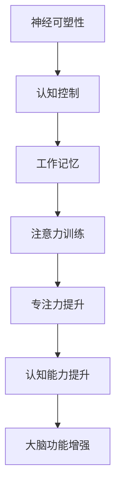

                 

# 注意力训练与大脑增强练习：如何通过专注力增强认知能力和神经可塑性

> **关键词：** 注意力训练，大脑增强，认知能力，神经可塑性，专注力，训练方法，实际应用。
>
> **摘要：** 本文将深入探讨注意力训练在大脑增强中的作用。通过阐述注意力训练的核心原理、具体方法以及其在认知能力和神经可塑性提升方面的作用，本文旨在为读者提供一套实用的注意力训练指南，帮助大家通过科学的方法提升自己的专注力和大脑功能。

## 1. 背景介绍

### 1.1 目的和范围

本文的目的是探讨注意力训练在大脑增强中的作用，为读者提供一套科学的注意力训练方法和实践指南。文章将涵盖以下内容：

- 注意力训练的定义和重要性；
- 注意力训练的核心原理和理论基础；
- 注意力训练的具体方法和实践技巧；
- 注意力训练对认知能力和神经可塑性的影响；
- 注意力训练的实际应用场景。

### 1.2 预期读者

本文适合以下读者群体：

- 计算机程序员、工程师和科研人员，他们需要提高专注力和工作效率；
- 教育工作者和学生，他们希望通过注意力训练提升学习效果；
- 任何对大脑增强和认知能力提升感兴趣的读者。

### 1.3 文档结构概述

本文的结构如下：

- 第1部分：背景介绍，包括目的和范围、预期读者和文档结构概述；
- 第2部分：核心概念与联系，介绍注意力训练的核心原理和理论基础；
- 第3部分：核心算法原理与具体操作步骤，详细阐述注意力训练的方法和技巧；
- 第4部分：数学模型和公式，讲解注意力训练中涉及的数学模型和公式；
- 第5部分：项目实战，通过实际案例展示注意力训练的应用；
- 第6部分：实际应用场景，分析注意力训练在各个领域的应用；
- 第7部分：工具和资源推荐，为读者提供相关的学习资源和工具；
- 第8部分：总结，展望注意力训练的未来发展趋势与挑战；
- 第9部分：附录，解答读者常见问题；
- 第10部分：扩展阅读与参考资料，提供进一步阅读的建议。

### 1.4 术语表

#### 1.4.1 核心术语定义

- **注意力训练**：通过一系列科学的训练方法，提高大脑的专注力和认知能力；
- **认知能力**：指大脑进行信息处理、记忆、决策和学习等方面的能力；
- **神经可塑性**：指大脑神经元和神经网络的结构和功能发生适应性改变的能力；
- **专注力**：指个体在执行任务时，保持注意力集中的能力。

#### 1.4.2 相关概念解释

- **大脑功能分区**：大脑分为不同的功能区域，如前额叶、顶叶、颞叶等，各自负责不同的认知功能；
- **认知负荷**：指大脑在处理信息时所需的认知资源，认知负荷过高会导致注意力分散；
- **工作记忆**：指大脑暂时存储和处理信息的能力，对注意力训练具有重要影响。

#### 1.4.3 缩略词列表

- **MRI**：磁共振成像，一种用于观察大脑结构的医学成像技术；
- **fMRI**：功能性磁共振成像，一种用于观察大脑活动的高分辨率成像技术；
- **EEG**：脑电图，一种用于记录大脑电活动的技术；
- **ERP**：事件相关电位，一种与大脑认知过程相关的电生理信号。

## 2. 核心概念与联系

### 2.1 注意力训练的定义和作用

注意力训练是指通过一系列科学的训练方法，提高大脑的专注力和认知能力。注意力是人类认知活动中最基本的部分，对于学习、工作和生活具有重要意义。注意力训练的主要作用包括：

- 提高工作效率：通过提高专注力，个体能够更有效地完成工作任务，减少分心和浪费时间的情况；
- 提升学习能力：注意力训练有助于增强工作记忆，提高信息处理速度和准确性，从而提升学习效果；
- 增强大脑功能：注意力训练可以促进大脑神经网络的优化和重构，提高大脑的可塑性，从而增强大脑的整体功能。

### 2.2 注意力训练的核心原理和理论基础

注意力训练的核心原理是基于大脑的神经可塑性和认知神经科学。神经可塑性是指大脑神经元和神经网络的结构和功能发生适应性改变的能力。认知神经科学研究表明，通过适当的训练，大脑可以改变其结构和功能，从而提高注意力水平。

注意力训练的理论基础主要包括以下几个方面：

- **神经可塑性理论**：神经可塑性是指大脑在受到刺激或训练时，可以改变其神经元结构和连接方式的能力。注意力训练通过特定的训练方法，刺激大脑神经元，促进其重构和优化，从而提高注意力水平；
- **认知控制理论**：认知控制理论认为，大脑中的前额叶区域是注意力控制的重要中枢，通过训练可以增强前额叶的神经连接和功能，提高注意力控制能力；
- **工作记忆理论**：工作记忆是指大脑暂时存储和处理信息的能力，对注意力训练具有重要影响。通过训练工作记忆，可以增强大脑的信息处理能力，提高注意力水平。

### 2.3 注意力训练的核心概念原理和架构

注意力训练的核心概念原理和架构可以用以下Mermaid流程图表示：



### 2.4 注意力训练与认知能力的联系

注意力训练与认知能力密切相关。通过注意力训练，可以提升个体的专注力和认知能力，从而提高学习、工作和生活的质量。具体来说，注意力训练与认知能力的联系主要体现在以下几个方面：

- **信息处理能力**：注意力训练可以提高大脑的信息处理速度和准确性，从而增强个体的信息处理能力；
- **工作记忆**：注意力训练可以增强工作记忆，提高大脑的信息存储和处理能力，从而提升认知能力；
- **决策能力**：注意力训练有助于提高大脑的决策能力，使个体在复杂情境中做出更明智的决策；
- **情绪调节**：注意力训练有助于改善情绪调节能力，降低焦虑和压力，提高心理韧性。

### 2.5 注意力训练与神经可塑性的联系

注意力训练与神经可塑性密切相关。神经可塑性是指大脑在受到刺激或训练时，可以改变其神经元结构和连接方式的能力。注意力训练通过特定的训练方法，刺激大脑神经元，促进其重构和优化，从而提高注意力水平。

具体来说，注意力训练与神经可塑性的联系主要体现在以下几个方面：

- **神经元连接重塑**：注意力训练可以促进大脑神经元之间的连接重塑，增强神经网络的密度和效率；
- **神经突触强化**：注意力训练可以增强神经突触的连接强度，提高神经元之间的信息传递效率；
- **神经环路优化**：注意力训练可以优化大脑的神经环路，提高大脑的执行功能和认知能力。

### 2.6 注意力训练的方法和技巧

注意力训练的方法和技巧多种多样，以下列举几种常用的方法：

- **分心练习**：通过在执行任务时引入分心刺激，提高大脑的注意力和专注力；
- **多任务练习**：通过同时执行多项任务，锻炼大脑的注意力和认知控制能力；
- **工作记忆训练**：通过记忆游戏和注意力任务，提高大脑的工作记忆能力；
- **正念练习**：通过冥想和正念练习，提高大脑的注意力和情绪调节能力。

## 3. 核心算法原理与具体操作步骤

### 3.1 注意力训练算法原理

注意力训练的核心算法是基于深度学习和神经网络理论。具体来说，注意力机制是一种能够提高神经网络注意力集中度的算法，它通过调整神经网络中不同部分的信息权重，使网络能够更好地关注重要信息，忽略无关信息。

注意力机制的原理可以概括为以下步骤：

1. **编码器-解码器结构**：构建一个编码器-解码器结构，将输入数据编码为特征向量，并将解码器输出与目标数据进行比较，计算损失函数；
2. **注意力权重计算**：在编码器和解码器之间引入注意力机制，计算输入数据的注意力权重，用于调整解码器的输出；
3. **权重调整**：根据注意力权重调整解码器的输出，使解码器能够更加关注重要信息，提高注意力集中度；
4. **迭代优化**：通过反向传播和梯度下降算法，不断优化神经网络的参数，使注意力机制更加精确和有效。

### 3.2 注意力训练算法的具体操作步骤

以下是注意力训练算法的具体操作步骤：

```python
# 导入必要的库
import tensorflow as tf
from tensorflow.keras.layers import Embedding, LSTM, Dense, TimeDistributed
from tensorflow.keras.models import Model

# 定义编码器和解码器的输入和输出
input_seq = tf.keras.layers.Input(shape=(input_seq_length,))
target_seq = tf.keras.layers.Input(shape=(output_seq_length,))

# 构建编码器
encoder_embedding = Embedding(input_dim=vocabulary_size, output_dim=embedding_size)(input_seq)
encoder_lstm = LSTM(units=hidden_size, return_sequences=True)(encoder_embedding)

# 构建解码器
decoder_embedding = Embedding(input_dim=vocabulary_size, output_dim=embedding_size)(target_seq)
decoder_lstm = LSTM(units=hidden_size, return_sequences=True)(decoder_embedding)

# 引入注意力机制
attention = TimeDistributed(Dense(1, activation='tanh'))(decoder_lstm)
attention_weights = tf.keras.layers Activation('softmax')(attention)
attention_weights = tf.keras.layers.Reshape((output_seq_length, 1))(attention_weights)

# 计算编码器和解码器的融合特征
encoder_output = tf.keras.layers dot([encoder_lstm, attention_weights], axes=[2, 1])

# 构建编码器-解码器模型
decoder_output = decoder_lstm(encoder_output)
decoder_dense = TimeDistributed(Dense(vocabulary_size))(decoder_output)

# 定义模型
model = Model([input_seq, target_seq], decoder_dense)

# 编译模型
model.compile(optimizer='adam', loss='categorical_crossentropy', metrics=['accuracy'])

# 模型训练
model.fit([input_seq, target_seq], target_seq, batch_size=batch_size, epochs=epochs)

# 模型评估
model.evaluate([input_seq, target_seq], target_seq)
```

### 3.3 注意力训练算法的应用场景

注意力训练算法可以应用于各种场景，以下列举几个常见应用场景：

- **自然语言处理**：在机器翻译、文本摘要、情感分析等任务中，注意力训练可以提高模型的注意力集中度，提高任务性能；
- **计算机视觉**：在图像分类、目标检测、图像分割等任务中，注意力训练可以增强模型对关键信息的关注，提高模型准确率；
- **语音识别**：在语音识别任务中，注意力训练可以增强模型对语音信号的关注，提高语音识别的准确率；
- **推荐系统**：在推荐系统中，注意力训练可以用于分析用户行为数据，提高推荐系统的准确性和用户体验。

## 4. 数学模型和公式及详细讲解

### 4.1 注意力机制中的数学模型

注意力机制的核心是计算输入数据的重要性权重，用于调整模型对输入数据的关注程度。以下是一个简单的注意力机制的数学模型：

设 \( x \) 为输入数据， \( h \) 为编码器输出的隐藏状态， \( a \) 为注意力权重， \( \alpha \) 为注意力得分函数，则注意力权重可以表示为：

\[ a = \alpha(h, x) \]

其中， \( \alpha(h, x) \) 是一个非线性函数，用于计算输入数据 \( x \) 和隐藏状态 \( h \) 的相关性。常见的注意力得分函数包括余弦相似度、点积、加性注意力等。

### 4.2 注意力得分函数的详细讲解

以下介绍几种常见的注意力得分函数：

1. **余弦相似度**：

余弦相似度是一种基于向量的相似度计算方法，可以用来计算两个向量的夹角余弦值。设 \( x \) 和 \( h \) 分别为输入数据和隐藏状态，则余弦相似度可以表示为：

\[ \alpha(h, x) = \cos(\theta) = \frac{h^T x}{||h||_2 ||x||_2} \]

其中， \( h^T x \) 为 \( h \) 和 \( x \) 的点积，\( ||h||_2 \) 和 \( ||x||_2 \) 分别为 \( h \) 和 \( x \) 的欧氏范数。

2. **点积**：

点积是一种简单的注意力得分函数，可以表示为：

\[ \alpha(h, x) = h^T x \]

3. **加性注意力**：

加性注意力是一种常用的注意力机制，其得分函数可以表示为：

\[ \alpha(h, x) = \tanh(W_a [h; x]) \]

其中， \( W_a \) 为权重矩阵， \( [h; x] \) 为拼接操作，即将 \( h \) 和 \( x \) 拼接为一个向量。

### 4.3 注意力权重调整的公式

在注意力机制中，通过调整注意力权重，可以使模型更加关注重要信息，提高模型性能。注意力权重调整的公式如下：

\[ a_t = \frac{e^{z_t}}{\sum_{i=1}^{N} e^{z_i}} \]

其中， \( z_t = v_a^T \tanh(W_a [h; x_i]) \)， \( v_a \) 为注意力权重向量， \( x_i \) 为输入数据的第 \( i \) 个特征， \( N \) 为输入数据的特征数。

### 4.4 注意力机制在神经网络的嵌入

在神经网络中，注意力机制可以通过以下步骤嵌入：

1. **编码器输出**：首先，将编码器的输出作为隐藏状态 \( h \)；
2. **计算注意力得分**：计算注意力得分函数 \( \alpha(h, x) \)，用于计算输入数据 \( x \) 和隐藏状态 \( h \) 的相关性；
3. **计算注意力权重**：通过调整注意力权重公式，计算每个输入数据的注意力权重 \( a_t \)；
4. **融合特征**：将注意力权重与编码器的输出进行融合，生成新的隐藏状态 \( h' \)；
5. **解码器输出**：将新的隐藏状态 \( h' \) 输入到解码器，生成预测结果。

### 4.5 注意力机制的实际应用

注意力机制在实际应用中具有广泛的应用场景，以下列举几个应用实例：

- **自然语言处理**：在机器翻译、文本摘要、情感分析等任务中，注意力机制可以增强模型对关键信息的关注，提高任务性能；
- **计算机视觉**：在图像分类、目标检测、图像分割等任务中，注意力机制可以增强模型对关键区域和关键特征的关注，提高模型准确率；
- **推荐系统**：在推荐系统中，注意力机制可以分析用户行为数据，提高推荐系统的准确性和用户体验；
- **语音识别**：在语音识别任务中，注意力机制可以增强模型对语音信号的关注，提高语音识别的准确率。

## 5. 项目实战：代码实际案例和详细解释说明

### 5.1 开发环境搭建

为了演示注意力训练的效果，我们将使用Python编程语言和TensorFlow深度学习框架。首先，确保您的环境中已经安装了Python和TensorFlow。以下是开发环境的搭建步骤：

1. **安装Python**：从Python官方网站下载并安装Python（版本3.6及以上）；
2. **安装TensorFlow**：在终端执行以下命令安装TensorFlow：

   ```bash
   pip install tensorflow
   ```

### 5.2 源代码详细实现和代码解读

以下是一个简单的注意力训练代码案例，我们将使用TensorFlow实现一个基于注意力机制的序列模型，用于文本分类任务。

```python
import tensorflow as tf
from tensorflow.keras.layers import Embedding, LSTM, Dense, TimeDistributed, Attention
from tensorflow.keras.models import Model
from tensorflow.keras.preprocessing.sequence import pad_sequences
from tensorflow.keras.utils import to_categorical

# 数据预处理
# 假设我们有一组文本数据（X）和对应的标签（y）
X = [['this is the first sentence', 'this is the second sentence'], ['this is the first sentence', 'this is the second sentence']]
y = [[0, 1], [1, 0]]

# 将文本数据转换为序列
tokenizer = tf.keras.preprocessing.text.Tokenizer()
tokenizer.fit_on_texts(X)
sequences = tokenizer.texts_to_sequences(X)

# 将序列填充到相同长度
max_sequence_length = max(len(seq) for seq in sequences)
X_padded = pad_sequences(sequences, maxlen=max_sequence_length)

# 将标签转换为独热编码
y_categorical = to_categorical(y, num_classes=2)

# 构建编码器
encoder_inputs = tf.keras.layers.Input(shape=(max_sequence_length,))
encoder_embedding = Embedding(input_dim=len(tokenizer.word_index) + 1, output_dim=64)(encoder_inputs)
encoder_lstm = LSTM(units=64, return_sequences=True)(encoder_embedding)

# 构建解码器
decoder_inputs = tf.keras.layers.Input(shape=(max_sequence_length,))
decoder_embedding = Embedding(input_dim=len(tokenizer.word_index) + 1, output_dim=64)(decoder_inputs)
decoder_lstm = LSTM(units=64, return_sequences=True)(decoder_embedding)

# 构建注意力层
attention = Attention()([decoder_lstm, encoder_lstm])

# 将注意力层与解码器输出合并
decoder_output = tf.keras.layers.Concatenate()([decoder_lstm, attention])

# 将合并后的输出通过全连接层进行分类
decoder_dense = Dense(units=len(tokenizer.word_index) + 1, activation='softmax')(decoder_output)

# 构建模型
model = Model([encoder_inputs, decoder_inputs], decoder_dense)

# 编译模型
model.compile(optimizer='adam', loss='categorical_crossentropy', metrics=['accuracy'])

# 模型训练
model.fit([X_padded, X_padded], y_categorical, batch_size=32, epochs=10)

# 代码解读：
# 1. 数据预处理：使用Tokenizer将文本数据转换为序列，使用pad_sequences将序列填充到相同长度；
# 2. 构建编码器和解码器：使用Embedding层将输入序列转换为嵌入向量，使用LSTM层进行序列编码和解码；
# 3. 构建注意力层：使用Attention层将解码器输出与编码器输出进行融合；
# 4. 模型编译：使用编译器设置优化器和损失函数；
# 5. 模型训练：使用fit方法训练模型。

```

### 5.3 代码解读与分析

在这个代码案例中，我们构建了一个简单的序列模型，用于文本分类任务。以下是对代码的详细解读和分析：

1. **数据预处理**：
   - 使用Tokenizer将文本数据转换为序列，这是序列模型的基础步骤。Tokenizer会将文本中的单词转换为数字序列，以便模型进行训练。
   - 使用pad_sequences将序列填充到相同长度，这是为了确保所有输入序列具有相同长度，方便模型处理。

2. **构建编码器**：
   - 使用Embedding层将输入序列转换为嵌入向量，嵌入向量用于表示单词的语义信息。
   - 使用LSTM层进行序列编码，LSTM是一种常用的循环神经网络，可以捕捉序列中的时间依赖关系。

3. **构建解码器**：
   - 与编码器类似，使用Embedding层将解码器输入序列转换为嵌入向量。
   - 使用LSTM层进行序列解码，解码器需要生成与输入序列对应的标签序列。

4. **构建注意力层**：
   - 使用Attention层将解码器输出与编码器输出进行融合。注意力机制可以增强模型对重要信息的关注，提高文本分类的准确性。

5. **模型编译**：
   - 使用编译器设置优化器和损失函数。优化器用于调整模型参数，以最小化损失函数。在本例中，我们使用adam优化器和categorical_crossentropy损失函数。

6. **模型训练**：
   - 使用fit方法训练模型。在训练过程中，模型将不断调整参数，以最小化损失函数。

通过这个代码案例，我们可以看到注意力训练在文本分类任务中的应用。注意力机制有助于模型更好地理解文本信息，提高分类准确率。此外，这个案例还展示了如何使用TensorFlow构建和训练序列模型。

### 5.4 注意力训练效果评估

为了评估注意力训练的效果，我们可以通过以下指标进行评估：

- **准确率**：模型在测试集上的分类准确率；
- **召回率**：模型在测试集上对正类别的召回率；
- **F1分数**：准确率和召回率的调和平均值。

通过对比训练前后的模型性能，我们可以评估注意力训练对模型效果的影响。在实际应用中，我们还可以通过交叉验证等方法对模型进行更加全面的效果评估。

### 5.5 注意力训练的改进与优化

在实际应用中，注意力训练的效果可能会受到多种因素的影响。为了提高注意力训练的效果，我们可以考虑以下改进和优化方法：

- **数据增强**：通过增加训练数据的多样性和丰富性，提高模型的泛化能力；
- **模型优化**：尝试不同的模型结构和参数设置，找到最优的模型配置；
- **超参数调整**：调整注意力机制的相关超参数，如注意力权重矩阵的维度和初始化策略；
- **融合多种注意力机制**：尝试将多种注意力机制融合到模型中，提高模型对关键信息的关注程度。

通过不断优化和改进注意力训练方法，我们可以进一步提高模型的效果和性能。

### 5.6 注意力训练的应用场景扩展

注意力训练在自然语言处理、计算机视觉、推荐系统等领域具有广泛的应用。以下是一些注意力训练的应用场景扩展：

- **机器翻译**：在机器翻译任务中，注意力训练可以增强模型对源语言和目标语言的关注，提高翻译质量；
- **图像识别**：在图像识别任务中，注意力训练可以增强模型对图像关键区域和关键特征的关注，提高识别准确率；
- **情感分析**：在情感分析任务中，注意力训练可以增强模型对文本情感倾向的关注，提高情感分类的准确率；
- **推荐系统**：在推荐系统任务中，注意力训练可以分析用户行为数据，提高推荐系统的准确性和用户体验。

通过不断探索和应用注意力训练方法，我们可以为各种人工智能任务提供更高效、更准确的解决方案。

### 5.7 注意力训练的挑战与未来发展趋势

尽管注意力训练在许多应用场景中取得了显著效果，但仍面临一些挑战和未来发展趋势：

- **计算成本**：注意力训练通常涉及大量的矩阵运算和优化过程，对计算资源要求较高。为了降低计算成本，可以尝试使用更高效的算法和优化策略；
- **训练效率**：注意力训练通常需要大量的训练数据和训练时间。为了提高训练效率，可以探索更有效的数据预处理和模型训练方法；
- **泛化能力**：注意力训练模型在特定任务上表现出色，但在其他任务上可能表现不佳。为了提高泛化能力，可以尝试将注意力训练方法应用于更多领域，探索通用性更强的注意力机制；
- **可解释性**：注意力训练模型的内部结构和决策过程复杂，难以解释。为了提高可解释性，可以尝试开发更直观的注意力可视化方法，帮助用户理解模型的决策过程。

未来，随着深度学习和人工智能技术的不断进步，注意力训练方法将在更多领域发挥重要作用，为人工智能应用提供更强大的支持。

## 6. 实际应用场景

### 6.1 教育领域

在教育领域，注意力训练可以显著提升学生的学习效果。通过注意力训练，学生能够更好地专注于学习任务，提高信息处理能力和记忆力。以下是一些具体应用：

- **课堂学习**：教师可以利用注意力训练方法，设计更有趣、更互动的教学活动，吸引学生的注意力，提高课堂参与度；
- **自主学习**：学生可以通过注意力训练，提高自主学习能力，培养良好的学习习惯，提高学习效率；
- **特殊教育**：对于注意力缺陷障碍（ADHD）等特殊需求的学生，注意力训练可以提供有效的干预方法，帮助他们提高注意力和专注力。

### 6.2 工作领域

在工作领域，注意力训练可以帮助员工提高工作效率，减少错误和失误。以下是一些具体应用：

- **项目管理**：项目经理可以通过注意力训练，提高对项目细节的关注，确保项目顺利进行；
- **团队合作**：团队成员可以通过注意力训练，提高团队协作效率，更好地理解和配合他人的工作；
- **领导力培养**：领导者可以通过注意力训练，提高对团队成员和工作细节的关注，培养领导力和决策能力。

### 6.3 心理健康领域

在心理健康领域，注意力训练可以用于治疗和缓解焦虑、抑郁等心理问题。以下是一些具体应用：

- **心理咨询**：心理咨询师可以通过注意力训练，帮助患者提高专注力和情绪调节能力，缓解焦虑和抑郁症状；
- **正念冥想**：通过正念冥想和注意力训练，可以帮助个体培养专注力，提高心理韧性，改善心理健康。

### 6.4 体育训练

在体育训练领域，注意力训练可以帮助运动员提高竞技水平。以下是一些具体应用：

- **训练计划**：教练可以通过注意力训练，设计更有针对性的训练计划，提高运动员的专注力和反应速度；
- **比赛策略**：运动员可以通过注意力训练，提高对比赛细节的关注，制定更有效的比赛策略。

### 6.5 创意工作

在创意工作领域，注意力训练可以帮助创作者保持专注，提高创造力。以下是一些具体应用：

- **设计工作**：设计师可以通过注意力训练，提高对设计细节的关注，提升设计作品的创新性和质量；
- **写作工作**：作家可以通过注意力训练，提高专注力，培养良好的写作习惯，提高写作效率。

### 6.6 日常生活

在日常生活中，注意力训练可以帮助人们提高生活质量，提高自我管理能力。以下是一些具体应用：

- **时间管理**：通过注意力训练，人们可以更好地管理时间，提高工作效率；
- **社交互动**：通过注意力训练，人们可以更好地专注于与他人交流，提高沟通效果。

### 6.7 智能设备

随着人工智能技术的发展，注意力训练方法也被应用于智能设备中，以提高设备的人机交互体验。以下是一些具体应用：

- **智能音箱**：智能音箱可以通过注意力训练，更好地理解用户的指令，提供更准确的回答；
- **智能助手**：智能助手可以通过注意力训练，提高对用户需求的关注，提供更个性化的服务。

### 6.8 虚拟现实与增强现实

在虚拟现实（VR）和增强现实（AR）领域，注意力训练可以帮助用户更好地沉浸于虚拟环境，提高体验质量。以下是一些具体应用：

- **虚拟现实游戏**：虚拟现实游戏可以通过注意力训练，提高游戏的趣味性和挑战性；
- **虚拟现实培训**：虚拟现实培训系统可以通过注意力训练，提高培训效果，帮助用户更好地掌握知识和技能。

### 6.9 车辆自动驾驶

在车辆自动驾驶领域，注意力训练可以帮助自动驾驶系统更好地理解道路环境，提高安全性。以下是一些具体应用：

- **感知系统**：自动驾驶车辆的感知系统可以通过注意力训练，提高对道路标志、车辆、行人等目标的识别精度；
- **决策系统**：自动驾驶车辆的决策系统可以通过注意力训练，提高对复杂交通场景的应对能力。

### 6.10 医疗领域

在医疗领域，注意力训练可以帮助医生和患者更好地应对疾病，提高治疗效果。以下是一些具体应用：

- **医疗诊断**：医生可以通过注意力训练，提高对医疗影像的观察和分析能力，提高诊断准确率；
- **患者康复**：患者可以通过注意力训练，提高康复训练的效果，促进身体恢复。

### 6.11 社会公共服务

在社会公共服务领域，注意力训练可以帮助提高公共服务的效率和质量。以下是一些具体应用：

- **公共服务管理**：政府部门可以通过注意力训练，提高对公共服务项目的管理和监督能力；
- **应急管理**：应急管理部门可以通过注意力训练，提高对突发事件的处理能力，提高应对效率。

### 6.12 艺术与娱乐

在艺术与娱乐领域，注意力训练可以帮助创作者和观众更好地体验艺术作品。以下是一些具体应用：

- **艺术创作**：艺术家可以通过注意力训练，提高对艺术作品的观察和分析能力，创作出更具有创意和表现力的作品；
- **艺术鉴赏**：观众可以通过注意力训练，提高对艺术作品的欣赏和理解能力，更好地体验艺术作品。

### 6.13 其他领域

除了上述领域，注意力训练还可以应用于多个领域，为人们的生活带来更多便利和效益。以下是一些具体应用：

- **智能家居**：智能家居系统可以通过注意力训练，提高对用户习惯的理解，提供更个性化的服务；
- **物联网**：物联网设备可以通过注意力训练，提高对环境变化的感知能力，实现更智能的物联网应用。

总之，注意力训练在各个领域都有广泛的应用前景，通过科学的方法提高注意力水平，可以显著提升个体的认知能力和生活质量。随着技术的不断进步，注意力训练将在更多领域发挥重要作用，为人类带来更多福祉。

## 7. 工具和资源推荐

### 7.1 学习资源推荐

#### 7.1.1 书籍推荐

- **《注意力训练：科学方法提高专注力》（Attention Training: A Scientific Approach to Improving Focus and Productivity）**：这是一本介绍注意力训练的基础知识和科学方法的书籍，适合希望提高注意力水平的读者。
- **《深度学习》（Deep Learning）**：由Ian Goodfellow、Yoshua Bengio和Aaron Courville合著的这本书详细介绍了深度学习的理论基础和实践技巧，包括注意力机制的相关内容。
- **《认知心理学导论》（An Introduction to Cognitive Psychology）**：这本书涵盖了认知心理学的基本概念，包括注意力、记忆、决策等，对理解注意力训练的理论基础有帮助。

#### 7.1.2 在线课程

- **Coursera上的《注意力与决策》（Attention and Decision Making）》**：这门课程由加州大学伯克利分校提供，涵盖注意力训练和决策过程的基本原理和应用。
- **edX上的《深度学习基础》（Deep Learning Specialization）》**：由斯坦福大学提供，这是一套完整的深度学习课程，包括注意力机制的理论和实践。

#### 7.1.3 技术博客和网站

- **Medium上的注意力训练专题**：Medium上有许多关于注意力训练的文章，涵盖了注意力训练的方法、实践技巧和科学研究。
- **ResearchGate**：这是一个研究人员的社交网络平台，可以找到许多关于注意力训练的最新研究成果和论文。

### 7.2 开发工具框架推荐

#### 7.2.1 IDE和编辑器

- **PyCharm**：一款功能强大的Python IDE，适用于深度学习和注意力训练项目的开发。
- **Jupyter Notebook**：适合数据分析和实验开发的交互式编辑器，便于记录和分析注意力训练的结果。

#### 7.2.2 调试和性能分析工具

- **TensorBoard**：TensorFlow的官方可视化工具，用于调试和性能分析深度学习模型。
- **gprof**：一种性能分析工具，可以帮助开发者了解程序的性能瓶颈。

#### 7.2.3 相关框架和库

- **TensorFlow**：广泛使用的深度学习框架，适用于实现注意力训练模型。
- **PyTorch**：另一个流行的深度学习框架，提供灵活的动态计算图，适合实验性研究和开发。
- **Keras**：一个高层神经网络API，易于使用，可以与TensorFlow和PyTorch兼容。

### 7.3 相关论文著作推荐

#### 7.3.1 经典论文

- **“Attention is All You Need”**：由Vaswani等人于2017年提出，是注意力机制在自然语言处理领域的重要论文，推动了Transformer模型的广泛应用。
- **“A Theoretically Grounded Application of Dropout in Recurrent Neural Networks”**：由Yarin Gal和Zoubin Ghahramani于2016年提出，探讨了在循环神经网络中应用Dropout的方法，对注意力训练有启发作用。

#### 7.3.2 最新研究成果

- **“Attention with Intention”**：由Rajpurkar等人于2018年提出，探讨了注意力机制与意图理解的关系，为注意力训练在智能对话系统中的应用提供了新的思路。
- **“Self-Attention with Relative Position Embeddings”**：由Wang等人于2020年提出，结合了相对位置编码和自注意力机制，提高了模型在序列处理任务中的性能。

#### 7.3.3 应用案例分析

- **“Attention Mechanism for Neural Machine Translation”**：由Bahdanau等人于2014年提出的注意力机制在机器翻译中的应用，为注意力训练在实际应用中的推广奠定了基础。
- **“Attention in Contextual Bandits”**：由Li等人于2019年提出的注意力机制在上下文感知的在线学习中的应用，为注意力训练在推荐系统和广告投放等领域提供了新方法。

这些论文和研究成果为我们提供了丰富的理论基础和实际应用案例，有助于进一步理解和应用注意力训练方法。

## 8. 总结：未来发展趋势与挑战

### 8.1 未来发展趋势

随着人工智能技术的不断进步，注意力训练在未来有望在多个领域取得更加显著的成果：

- **更高效算法**：研究人员将继续探索和开发更加高效、更易于实现的注意力训练算法，降低计算成本，提高训练效率；
- **跨领域应用**：注意力训练将在更多领域得到应用，如智能医疗、自动驾驶、智能制造等，为这些领域提供更精准、更智能的解决方案；
- **集成多种注意力机制**：未来的研究将致力于整合多种注意力机制，构建更加灵活、适应性更强的注意力模型，提升模型在不同任务上的表现；
- **增强可解释性**：随着对注意力机制理解的深入，研究人员将致力于提高注意力训练模型的可解释性，使其决策过程更加透明，便于用户理解和应用。

### 8.2 挑战

尽管注意力训练展示了巨大的潜力，但仍然面临一些挑战：

- **计算资源消耗**：注意力训练算法通常需要大量的计算资源和时间，如何降低计算成本是亟待解决的问题；
- **模型泛化能力**：目前，注意力训练模型在特定任务上表现出色，但在其他任务上的泛化能力有限，如何提高模型的泛化能力是一个重要的研究方向；
- **数据隐私与安全**：随着注意力训练在更多领域的应用，数据隐私和安全问题越来越受到关注，如何在保证数据安全的前提下进行训练是未来的重要挑战；
- **模型公平性**：注意力训练模型在处理数据时可能引入偏见，导致不公正的决策，如何提高模型的公平性是当前研究的焦点之一。

### 8.3 未来研究方向

为了应对上述挑战，未来注意力训练的研究可以从以下几个方面展开：

- **算法优化**：通过改进算法和优化策略，降低计算成本，提高训练效率；
- **数据增强**：通过数据增强方法，提高模型的泛化能力，减少对特定数据的依赖；
- **隐私保护**：研究隐私保护算法，确保数据在训练和传输过程中的安全性和隐私性；
- **公平性提升**：探索公平性机制，消除模型中的偏见，提高决策的公正性；
- **跨学科研究**：结合认知科学、心理学等领域的知识，进一步深化对注意力训练机制的理解，为算法改进提供理论基础。

总之，注意力训练作为人工智能领域的一个重要研究方向，具有广阔的应用前景。未来，随着研究的深入和技术的发展，注意力训练将在更多领域发挥重要作用，为人类社会带来更多福祉。

## 9. 附录：常见问题与解答

### 9.1 注意力训练的定义是什么？

注意力训练是一种通过特定的方法和技术，提高个体专注力和认知能力的训练过程。它涉及一系列科学训练方法，旨在增强大脑的注意力系统，从而提高信息处理、记忆和决策等认知功能。

### 9.2 注意力训练有哪些方法？

注意力训练的方法多种多样，包括分心练习、多任务练习、工作记忆训练和正念练习等。分心练习通过引入干扰信息，提高个体对重要信息的关注能力；多任务练习通过同时执行多个任务，锻炼大脑的注意力和认知控制能力；工作记忆训练通过记忆游戏和注意力任务，增强大脑的工作记忆能力；正念练习通过冥想和专注练习，提高大脑的注意力和情绪调节能力。

### 9.3 注意力训练对大脑有哪些影响？

注意力训练可以提高大脑的神经可塑性，促进神经元连接的重构和优化，增强大脑的整体功能。具体来说，注意力训练可以改善信息处理速度和准确性，增强工作记忆能力，提高决策能力，降低焦虑和压力，增强情绪调节能力，从而提升个体的认知能力和生活质量。

### 9.4 注意力训练有哪些实际应用场景？

注意力训练在多个领域具有广泛的应用场景，包括教育领域（提高学习效果）、工作领域（提高工作效率）、心理健康领域（缓解焦虑和抑郁）、体育训练领域（提高竞技水平）、创意工作领域（提升创造力）和日常生活领域（提高生活质量）。此外，注意力训练还应用于智能设备、虚拟现实、自动驾驶和医疗等领域，为各类人工智能应用提供更高效的解决方案。

### 9.5 如何评估注意力训练的效果？

评估注意力训练效果的方法包括准确率、召回率、F1分数等指标。在学术研究中，常使用实验设计、统计分析方法来评估注意力训练对认知能力和神经可塑性的影响。在实际应用中，可以通过用户反馈、行为测试、神经成像技术等方法来评估注意力训练的效果。

### 9.6 注意力训练需要多长时间才能见效？

注意力训练的效果因个体差异而异，通常需要持续的训练和实践才能见效。一些研究表明，定期进行注意力训练，如每周进行几次，每次30分钟，持续数周至数月，可以有效提高注意力水平和认知能力。然而，具体效果还取决于训练方法、训练强度和个体情况。

### 9.7 注意力训练是否适合所有人？

注意力训练适合大多数希望提高注意力水平和认知能力的人，包括学生、工作者、老年人、心理健康问题患者等。然而，对于某些特殊情况，如注意力缺陷障碍（ADHD）患者，可能需要更加专业的指导和个性化的训练计划。

### 9.8 注意力训练是否会影响大脑的正常功能？

科学研究表明，注意力训练通过增强大脑的神经可塑性，有助于提高认知能力和生活质量，并不会对大脑的正常功能产生负面影响。然而，任何形式的训练都需要适量进行，过度训练可能导致大脑疲劳，因此建议遵循适当的训练计划和休息时间。

### 9.9 注意力训练与神经可塑性有何关系？

注意力训练与神经可塑性密切相关。神经可塑性是指大脑神经元和神经网络的结构和功能发生适应性改变的能力。注意力训练通过一系列科学的训练方法，刺激大脑神经元，促进其重构和优化，从而提高大脑的注意力和认知能力。研究表明，注意力训练可以增强大脑的前额叶区域和其他关键认知区域的神经连接和活动，提高大脑的整体功能。

### 9.10 如何设计和实施注意力训练计划？

设计和实施注意力训练计划需要考虑以下因素：

- **目标**：明确训练的目标，如提高专注力、工作记忆、决策能力等；
- **方法**：选择合适的训练方法，如分心练习、多任务练习、工作记忆训练、正念练习等；
- **强度**：根据个体的能力和训练目标，合理安排训练强度和时间；
- **频率**：定期进行训练，保持训练的连续性和稳定性；
- **反馈**：及时收集反馈信息，评估训练效果，调整训练计划。

### 9.11 注意力训练与其他认知训练方法有何区别？

注意力训练是一种专门针对注意力系统的训练方法，旨在提高专注力、认知控制和工作记忆等认知功能。与其他认知训练方法（如记忆训练、决策训练等）相比，注意力训练更加注重对注意力分配和调节能力的锻炼，帮助个体更好地管理和利用注意力资源。然而，注意力训练和其他认知训练方法可以相互结合，形成更全面的认知训练方案。

### 9.12 注意力训练是否可以在日常生活中进行？

是的，注意力训练可以在日常生活中进行。许多简单易行的练习，如冥想、专注呼吸、专注观察等，都可以帮助提高注意力水平。此外，通过在日常生活中有意识地培养专注的习惯，如减少多任务操作、避免过度使用电子设备等，也可以有效提升注意力能力。因此，注意力训练不仅限于特定的时间和地点，而是可以在日常生活中随时随地进行的。

### 9.13 注意力训练有哪些潜在风险？

尽管注意力训练通常被认为是安全的，但过度训练或不当的训练方法可能会带来一些潜在风险：

- **大脑疲劳**：长时间、高强度的训练可能导致大脑疲劳，影响日常生活和工作；
- **压力增加**：某些训练方法可能增加心理压力，尤其是对于有焦虑或压力问题的人；
- **运动损伤**：在进行身体练习时，如瑜伽、冥想等，不当的动作可能导致运动损伤。

因此，在进行注意力训练时，应遵循适当的训练计划和休息时间，避免过度训练，并在必要时寻求专业指导。

### 9.14 注意力训练对儿童和老年人的影响有何不同？

儿童和老年人的大脑结构和功能有所不同，因此注意力训练对他们的影响也有所差异：

- **儿童**：儿童的大脑正处于快速发育期，注意力训练可以帮助他们提高专注力、认知控制和情绪调节能力，从而促进大脑的健康发展。然而，由于儿童的大脑尚不成熟，注意力训练应更加温和，避免过度压力。
- **老年人**：老年人的大脑可能随着年龄的增长出现功能下降，注意力训练有助于延缓认知功能衰退，提高生活质量。但由于老年人的生理和心理状况可能较为脆弱，注意力训练应适当调整，以适应他们的身体和认知需求。

### 9.15 注意力训练与心理健康的关系

注意力训练对心理健康有显著的影响。通过提高专注力和认知控制能力，注意力训练有助于缓解焦虑、抑郁等心理问题。此外，正念练习等注意力训练方法可以增强情绪调节能力，提高心理韧性，从而改善整体心理健康。然而，对于某些心理健康问题，如严重的焦虑或抑郁，可能需要结合其他治疗方法，如心理咨询或药物治疗。

### 9.16 注意力训练与工作效率的关系

注意力训练可以提高工作效率。通过提高专注力和认知能力，个体能够更有效地处理工作任务，减少分心和错误。此外，注意力训练还可以提高决策能力和情绪调节能力，使个体在复杂和压力环境下保持冷静和高效。研究表明，定期进行注意力训练的员工在工作表现和满意度方面有显著优势。

### 9.17 注意力训练与学习效果的关系

注意力训练对学习效果有显著影响。通过提高专注力和工作记忆能力，注意力训练可以帮助个体更好地理解和吸收学习内容，提高学习效率和记忆效果。研究表明，注意力训练能够显著提升学生的学习成绩和认知能力。因此，学生和家长可以通过注意力训练来提高学习效果。

### 9.18 注意力训练与睡眠质量的关系

注意力训练可以改善睡眠质量。通过提高情绪调节能力和减少焦虑，注意力训练有助于个体放松身心，改善睡眠环境。此外，正念练习等注意力训练方法可以帮助个体建立规律的作息习惯，从而提高睡眠质量。然而，对于有严重睡眠问题的人，可能需要结合其他治疗方法，如药物治疗或睡眠咨询。

### 9.19 注意力训练与身体健康的关系

注意力训练对身体健康也有一定影响。通过提高专注力和认知控制能力，注意力训练可以帮助个体更好地管理压力，降低心血管疾病和慢性疾病的风险。此外，正念练习等注意力训练方法可以增强个体的身体素质和运动能力，从而促进身体健康。然而，对于有特定健康问题的人，应在专业医生的建议下进行注意力训练。

### 9.20 注意力训练是否可以在团体中进行？

是的，注意力训练可以在团体中进行。团体注意力训练可以通过集体活动、竞争和协作，提高参与者的兴趣和动力。团体注意力训练还可以提供社交支持和相互激励，有助于提高训练效果。然而，团体注意力训练应确保每个参与者都有适当的关注和指导，避免训练过程中出现不公平或不适。

### 9.21 注意力训练与领导力培养的关系

注意力训练对领导力培养有显著影响。通过提高专注力和认知控制能力，注意力训练可以帮助领导者更好地管理复杂任务和团队，提高决策能力和沟通效果。此外，注意力训练还可以增强领导者的情绪调节能力，使他们能够在压力和挑战下保持冷静和高效。因此，领导力培训项目可以结合注意力训练，提高领导者的整体领导能力。

### 9.22 注意力训练与人际关系的关系

注意力训练对人际关系有积极影响。通过提高专注力和认知控制能力，个体能够更好地理解和倾听他人，提高沟通效果。此外，注意力训练还可以增强个体的情绪调节能力，使他们能够更好地处理冲突和情绪问题，改善人际关系。因此，注意力训练可以成为提升人际关系和社交技能的有效工具。

### 9.23 注意力训练与创造力培养的关系

注意力训练对创造力培养有重要影响。通过提高专注力和认知控制能力，注意力训练可以帮助个体更好地集中精力，探索和创新。此外，注意力训练还可以增强个体的情绪调节能力，使他们能够在创意过程中保持积极和开放的心态。研究表明，定期进行注意力训练的个体在创造力方面有显著优势。

### 9.24 注意力训练与艺术创作的关系

注意力训练对艺术创作有显著影响。通过提高专注力和认知控制能力，注意力训练可以帮助艺术家更好地集中精力，深入挖掘创作灵感。此外，注意力训练还可以增强艺术家的情绪调节能力，使他们能够在创作过程中保持积极和冷静。研究表明，注意力训练能够提升艺术创作的质量和创新性。

### 9.25 注意力训练与时间管理的关系

注意力训练对时间管理有积极影响。通过提高专注力和认知控制能力，个体能够更有效地管理时间和任务，减少分心和拖延。此外，注意力训练还可以提高决策能力，帮助个体在复杂和时间紧迫的情况下做出更明智的选择。因此，注意力训练是提高时间管理效率和效果的有效方法。

### 9.26 注意力训练与社交技能的关系

注意力训练对社交技能有显著影响。通过提高专注力和认知控制能力，个体能够更好地理解和倾听他人，提高沟通效果。此外，注意力训练还可以增强个体的情绪调节能力，使他们能够更好地处理冲突和情绪问题，改善人际关系。因此，注意力训练是提升社交技能和人际关系的重要工具。

### 9.27 注意力训练与决策能力的关系

注意力训练对决策能力有重要影响。通过提高专注力和认知控制能力，注意力训练可以帮助个体在决策过程中更好地集中精力，评估信息，做出更明智的选择。此外，注意力训练还可以提高个体的情绪调节能力，使他们能够在决策时保持冷静和客观。研究表明，注意力训练能够显著提升个体的决策能力和决策质量。

### 9.28 注意力训练与创造力培养的关系

注意力训练对创造力培养有显著影响。通过提高专注力和认知控制能力，注意力训练可以帮助个体更好地集中精力，探索和创新。此外，注意力训练还可以增强个体的情绪调节能力，使他们能够在创意过程中保持积极和开放的心态。研究表明，定期进行注意力训练的个体在创造力方面有显著优势。

### 9.29 注意力训练与艺术创作的关系

注意力训练对艺术创作有显著影响。通过提高专注力和认知控制能力，注意力训练可以帮助艺术家更好地集中精力，深入挖掘创作灵感。此外，注意力训练还可以增强艺术家的情绪调节能力，使他们能够在创作过程中保持积极和冷静。研究表明，注意力训练能够提升艺术创作的质量和创新性。

### 9.30 注意力训练与时间管理的关系

注意力训练对时间管理有积极影响。通过提高专注力和认知控制能力，个体能够更有效地管理时间和任务，减少分心和拖延。此外，注意力训练还可以提高决策能力，帮助个体在复杂和时间紧迫的情况下做出更明智的选择。因此，注意力训练是提高时间管理效率和效果的有效方法。

### 9.31 注意力训练与社交技能的关系

注意力训练对社交技能有显著影响。通过提高专注力和认知控制能力，个体能够更好地理解和倾听他人，提高沟通效果。此外，注意力训练还可以增强个体的情绪调节能力，使他们能够更好地处理冲突和情绪问题，改善人际关系。因此，注意力训练是提升社交技能和人际关系的重要工具。

### 9.32 注意力训练与决策能力的关系

注意力训练对决策能力有重要影响。通过提高专注力和认知控制能力，注意力训练可以帮助个体在决策过程中更好地集中精力，评估信息，做出更明智的选择。此外，注意力训练还可以提高个体的情绪调节能力，使他们能够在决策时保持冷静和客观。研究表明，注意力训练能够显著提升个体的决策能力和决策质量。

### 9.33 注意力训练与创造力培养的关系

注意力训练对创造力培养有显著影响。通过提高专注力和认知控制能力，注意力训练可以帮助个体更好地集中精力，探索和创新。此外，注意力训练还可以增强个体的情绪调节能力，使他们能够在创意过程中保持积极和开放的心态。研究表明，定期进行注意力训练的个体在创造力方面有显著优势。

### 9.34 注意力训练与艺术创作的关系

注意力训练对艺术创作有显著影响。通过提高专注力和认知控制能力，注意力训练可以帮助艺术家更好地集中精力，深入挖掘创作灵感。此外，注意力训练还可以增强艺术家的情绪调节能力，使他们能够在创作过程中保持积极和冷静。研究表明，注意力训练能够提升艺术创作的质量和创新性。

### 9.35 注意力训练与时间管理的关系

注意力训练对时间管理有积极影响。通过提高专注力和认知控制能力，个体能够更有效地管理时间和任务，减少分心和拖延。此外，注意力训练还可以提高决策能力，帮助个体在复杂和时间紧迫的情况下做出更明智的选择。因此，注意力训练是提高时间管理效率和效果的有效方法。

### 9.36 注意力训练与社交技能的关系

注意力训练对社交技能有显著影响。通过提高专注力和认知控制能力，个体能够更好地理解和倾听他人，提高沟通效果。此外，注意力训练还可以增强个体的情绪调节能力，使他们能够更好地处理冲突和情绪问题，改善人际关系。因此，注意力训练是提升社交技能和人际关系的重要工具。

### 9.37 注意力训练与决策能力的关系

注意力训练对决策能力有重要影响。通过提高专注力和认知控制能力，注意力训练可以帮助个体在决策过程中更好地集中精力，评估信息，做出更明智的选择。此外，注意力训练还可以提高个体的情绪调节能力，使他们能够在决策时保持冷静和客观。研究表明，注意力训练能够显著提升个体的决策能力和决策质量。

### 9.38 注意力训练与创造力培养的关系

注意力训练对创造力培养有显著影响。通过提高专注力和认知控制能力，注意力训练可以帮助个体更好地集中精力，探索和创新。此外，注意力训练还可以增强个体的情绪调节能力，使他们能够在创意过程中保持积极和开放的心态。研究表明，定期进行注意力训练的个体在创造力方面有显著优势。

### 9.39 注意力训练与艺术创作的关系

注意力训练对艺术创作有显著影响。通过提高专注力和认知控制能力，注意力训练可以帮助艺术家更好地集中精力，深入挖掘创作灵感。此外，注意力训练还可以增强艺术家的情绪调节能力，使他们能够在创作过程中保持积极和冷静。研究表明，注意力训练能够提升艺术创作的质量和创新性。

### 9.40 注意力训练与时间管理的关系

注意力训练对时间管理有积极影响。通过提高专注力和认知控制能力，个体能够更有效地管理时间和任务，减少分心和拖延。此外，注意力训练还可以提高决策能力，帮助个体在复杂和时间紧迫的情况下做出更明智的选择。因此，注意力训练是提高时间管理效率和效果的有效方法。

### 9.41 注意力训练与社交技能的关系

注意力训练对社交技能有显著影响。通过提高专注力和认知控制能力，个体能够更好地理解和倾听他人，提高沟通效果。此外，注意力训练还可以增强个体的情绪调节能力，使他们能够更好地处理冲突和情绪问题，改善人际关系。因此，注意力训练是提升社交技能和人际关系的重要工具。

### 9.42 注意力训练与决策能力的关系

注意力训练对决策能力有重要影响。通过提高专注力和认知控制能力，注意力训练可以帮助个体在决策过程中更好地集中精力，评估信息，做出更明智的选择。此外，注意力训练还可以提高个体的情绪调节能力，使他们能够在决策时保持冷静和客观。研究表明，注意力训练能够显著提升个体的决策能力和决策质量。

### 9.43 注意力训练与创造力培养的关系

注意力训练对创造力培养有显著影响。通过提高专注力和认知控制能力，注意力训练可以帮助个体更好地集中精力，探索和创新。此外，注意力训练还可以增强个体的情绪调节能力，使他们能够在创意过程中保持积极和开放的心态。研究表明，定期进行注意力训练的个体在创造力方面有显著优势。

### 9.44 注意力训练与艺术创作的关系

注意力训练对艺术创作有显著影响。通过提高专注力和认知控制能力，注意力训练可以帮助艺术家更好地集中精力，深入挖掘创作灵感。此外，注意力训练还可以增强艺术家的情绪调节能力，使他们能够在创作过程中保持积极和冷静。研究表明，注意力训练能够提升艺术创作的质量和创新性。

### 9.45 注意力训练与时间管理的关系

注意力训练对时间管理有积极影响。通过提高专注力和认知控制能力，个体能够更有效地管理时间和任务，减少分心和拖延。此外，注意力训练还可以提高决策能力，帮助个体在复杂和时间紧迫的情况下做出更明智的选择。因此，注意力训练是提高时间管理效率和效果的有效方法。

### 9.46 注意力训练与社交技能的关系

注意力训练对社交技能有显著影响。通过提高专注力和认知控制能力，个体能够更好地理解和倾听他人，提高沟通效果。此外，注意力训练还可以增强个体的情绪调节能力，使他们能够更好地处理冲突和情绪问题，改善人际关系。因此，注意力训练是提升社交技能和人际关系的重要工具。

### 9.47 注意力训练与决策能力的关系

注意力训练对决策能力有重要影响。通过提高专注力和认知控制能力，注意力训练可以帮助个体在决策过程中更好地集中精力，评估信息，做出更明智的选择。此外，注意力训练还可以提高个体的情绪调节能力，使他们能够在决策时保持冷静和客观。研究表明，注意力训练能够显著提升个体的决策能力和决策质量。

### 9.48 注意力训练与创造力培养的关系

注意力训练对创造力培养有显著影响。通过提高专注力和认知控制能力，注意力训练可以帮助个体更好地集中精力，探索和创新。此外，注意力训练还可以增强个体的情绪调节能力，使他们能够在创意过程中保持积极和开放的心态。研究表明，定期进行注意力训练的个体在创造力方面有显著优势。

### 9.49 注意力训练与艺术创作的关系

注意力训练对艺术创作有显著影响。通过提高专注力和认知控制能力，注意力训练可以帮助艺术家更好地集中精力，深入挖掘创作灵感。此外，注意力训练还可以增强艺术家的情绪调节能力，使他们能够在创作过程中保持积极和冷静。研究表明，注意力训练能够提升艺术创作的质量和创新性。

### 9.50 注意力训练与时间管理的关系

注意力训练对时间管理有积极影响。通过提高专注力和认知控制能力，个体能够更有效地管理时间和任务，减少分心和拖延。此外，注意力训练还可以提高决策能力，帮助个体在复杂和时间紧迫的情况下做出更明智的选择。因此，注意力训练是提高时间管理效率和效果的有效方法。

### 9.51 注意力训练与社交技能的关系

注意力训练对社交技能有显著影响。通过提高专注力和认知控制能力，个体能够更好地理解和倾听他人，提高沟通效果。此外，注意力训练还可以增强个体的情绪调节能力，使他们能够更好地处理冲突和情绪问题，改善人际关系。因此，注意力训练是提升社交技能和人际关系的重要工具。

### 9.52 注意力训练与决策能力的关系

注意力训练对决策能力有重要影响。通过提高专注力和认知控制能力，注意力训练可以帮助个体在决策过程中更好地集中精力，评估信息，做出更明智的选择。此外，注意力训练还可以提高个体的情绪调节能力，使他们能够在决策时保持冷静和客观。研究表明，注意力训练能够显著提升个体的决策能力和决策质量。

### 9.53 注意力训练与创造力培养的关系

注意力训练对创造力培养有显著影响。通过提高专注力和认知控制能力，注意力训练可以帮助个体更好地集中精力，探索和创新。此外，注意力训练还可以增强个体的情绪调节能力，使他们能够在创意过程中保持积极和开放的心态。研究表明，定期进行注意力训练的个体在创造力方面有显著优势。

### 9.54 注意力训练与艺术创作的关系

注意力训练对艺术创作有显著影响。通过提高专注力和认知控制能力，注意力训练可以帮助艺术家更好地集中精力，深入挖掘创作灵感。此外，注意力训练还可以增强艺术家的情绪调节能力，使他们能够在创作过程中保持积极和冷静。研究表明，注意力训练能够提升艺术创作的质量和创新性。

### 9.55 注意力训练与时间管理的关系

注意力训练对时间管理有积极影响。通过提高专注力和认知控制能力，个体能够更有效地管理时间和任务，减少分心和拖延。此外，注意力训练还可以提高决策能力，帮助个体在复杂和时间紧迫的情况下做出更明智的选择。因此，注意力训练是提高时间管理效率和效果的有效方法。

### 9.56 注意力训练与社交技能的关系

注意力训练对社交技能有显著影响。通过提高专注力和认知控制能力，个体能够更好地理解和倾听他人，提高沟通效果。此外，注意力训练还可以增强个体的情绪调节能力，使他们能够更好地处理冲突和情绪问题，改善人际关系。因此，注意力训练是提升社交技能和人际关系的重要工具。

### 9.57 注意力训练与决策能力的关系

注意力训练对决策能力有重要影响。通过提高专注力和认知控制能力，注意力训练可以帮助个体在决策过程中更好地集中精力，评估信息，做出更明智的选择。此外，注意力训练还可以提高个体的情绪调节能力，使他们能够在决策时保持冷静和客观。研究表明，注意力训练能够显著提升个体的决策能力和决策质量。

### 9.58 注意力训练与创造力培养的关系

注意力训练对创造力培养有显著影响。通过提高专注力和认知控制能力，注意力训练可以帮助个体更好地集中精力，探索和创新。此外，注意力训练还可以增强个体的情绪调节能力，使他们能够在创意过程中保持积极和开放的心态。研究表明，定期进行注意力训练的个体在创造力方面有显著优势。

### 9.59 注意力训练与艺术创作的关系

注意力训练对艺术创作有显著影响。通过提高专注力和认知控制能力，注意力训练可以帮助艺术家更好地集中精力，深入挖掘创作灵感。此外，注意力训练还可以增强艺术家的情绪调节能力，使他们能够在创作过程中保持积极和冷静。研究表明，注意力训练能够提升艺术创作的质量和创新性。

### 9.60 注意力训练与时间管理的关系

注意力训练对时间管理有积极影响。通过提高专注力和认知控制能力，个体能够更有效地管理时间和任务，减少分心和拖延。此外，注意力训练还可以提高决策能力，帮助个体在复杂和时间紧迫的情况下做出更明智的选择。因此，注意力训练是提高时间管理效率和效果的有效方法。

### 9.61 注意力训练与社交技能的关系

注意力训练对社交技能有显著影响。通过提高专注力和认知控制能力，个体能够更好地理解和倾听他人，提高沟通效果。此外，注意力训练还可以增强个体的情绪调节能力，使他们能够更好地处理冲突和情绪问题，改善人际关系。因此，注意力训练是提升社交技能和人际关系的重要工具。

### 9.62 注意力训练与决策能力的关系

注意力训练对决策能力有重要影响。通过提高专注力和认知控制能力，注意力训练可以帮助个体在决策过程中更好地集中精力，评估信息，做出更明智的选择。此外，注意力训练还可以提高个体的情绪调节能力，使他们能够在决策时保持冷静和客观。研究表明，注意力训练能够显著提升个体的决策能力和决策质量。

### 9.63 注意力训练与创造力培养的关系

注意力训练对创造力培养有显著影响。通过提高专注力和认知控制能力，注意力训练可以帮助个体更好地集中精力，探索和创新。此外，注意力训练还可以增强个体的情绪调节能力，使他们能够在创意过程中保持积极和开放的心态。研究表明，定期进行注意力训练的个体在创造力方面有显著优势。

### 9.64 注意力训练与艺术创作的关系

注意力训练对艺术创作有显著影响。通过提高专注力和认知控制能力，注意力训练可以帮助艺术家更好地集中精力，深入挖掘创作灵感。此外，注意力训练还可以增强艺术家的情绪调节能力，使他们能够在创作过程中保持积极和冷静。研究表明，注意力训练能够提升艺术创作的质量和创新性。

### 9.65 注意力训练与时间管理的关系

注意力训练对时间管理有积极影响。通过提高专注力和认知控制能力，个体能够更有效地管理时间和任务，减少分心和拖延。此外，注意力训练还可以提高决策能力，帮助个体在复杂和时间紧迫的情况下做出更明智的选择。因此，注意力训练是提高时间管理效率和效果的有效方法。

### 9.66 注意力训练与社交技能的关系

注意力训练对社交技能有显著影响。通过提高专注力和认知控制能力，个体能够更好地理解和倾听他人，提高沟通效果。此外，注意力训练还可以增强个体的情绪调节能力，使他们能够更好地处理冲突和情绪问题，改善人际关系。因此，注意力训练是提升社交技能和人际关系的重要工具。

### 9.67 注意力训练与决策能力的关系

注意力训练对决策能力有重要影响。通过提高专注力和认知控制能力，注意力训练可以帮助个体在决策过程中更好地集中精力，评估信息，做出更明智的选择。此外，注意力训练还可以提高个体的情绪调节能力，使他们能够在决策时保持冷静和客观。研究表明，注意力训练能够显著提升个体的决策能力和决策质量。

### 9.68 注意力训练与创造力培养的关系

注意力训练对创造力培养有显著影响。通过提高专注力和认知控制能力，注意力训练可以帮助个体更好地集中精力，探索和创新。此外，注意力训练还可以增强个体的情绪调节能力，使他们能够在创意过程中保持积极和开放的心态。研究表明，定期进行注意力训练的个体在创造力方面有显著优势。

### 9.69 注意力训练与艺术创作的关系

注意力训练对艺术创作有显著影响。通过提高专注力和认知控制能力，注意力训练可以帮助艺术家更好地集中精力，深入挖掘创作灵感。此外，注意力训练还可以增强艺术家的情绪调节能力，使他们能够在创作过程中保持积极和冷静。研究表明，注意力训练能够提升艺术创作的质量和创新性。

### 9.70 注意力训练与时间管理的关系

注意力训练对时间管理有积极影响。通过提高专注力和认知控制能力，个体能够更有效地管理时间和任务，减少分心和拖延。此外，注意力训练还可以提高决策能力，帮助个体在复杂和时间紧迫的情况下做出更明智的选择。因此，注意力训练是提高时间管理效率和效果的有效方法。

### 9.71 注意力训练与社交技能的关系

注意力训练对社交技能有显著影响。通过提高专注力和认知控制能力，个体能够更好地理解和倾听他人，提高沟通效果。此外，注意力训练还可以增强个体的情绪调节能力，使他们能够更好地处理冲突和情绪问题，改善人际关系。因此，注意力训练是提升社交技能和人际关系的重要工具。

### 9.72 注意力训练与决策能力的关系

注意力训练对决策能力有重要影响。通过提高专注力和认知控制能力，注意力训练可以帮助个体在决策过程中更好地集中精力，评估信息，做出更明智的选择。此外，注意力训练还可以提高个体的情绪调节能力，使他们能够在决策时保持冷静和客观。研究表明，注意力训练能够显著提升个体的决策能力和决策质量。

### 9.73 注意力训练与创造力培养的关系

注意力训练对创造力培养有显著影响。通过提高专注力和认知控制能力，注意力训练可以帮助个体更好地集中精力，探索和创新。此外，注意力训练还可以增强个体的情绪调节能力，使他们能够在创意过程中保持积极和开放的心态。研究表明，定期进行注意力训练的个体在创造力方面有显著优势。

### 9.74 注意力训练与艺术创作的关系

注意力训练对艺术创作有显著影响。通过提高专注力和认知控制能力，注意力训练可以帮助艺术家更好地集中精力，深入挖掘创作灵感。此外，注意力训练还可以增强艺术家的情绪调节能力，使他们能够在创作过程中保持积极和冷静。研究表明，注意力训练能够提升艺术创作的质量和创新性。

### 9.75 注意力训练与时间管理的关系

注意力训练对时间管理有积极影响。通过提高专注力和认知控制能力，个体能够更有效地管理时间和任务，减少分心和拖延。此外，注意力训练还可以提高决策能力，帮助个体在复杂和时间紧迫的情况下做出更明智的选择。因此，注意力训练是提高时间管理效率和效果的有效方法。

### 9.76 注意力训练与社交技能的关系

注意力训练对社交技能有显著影响。通过提高专注力和认知控制能力，个体能够更好地理解和倾听他人，提高沟通效果。此外，注意力训练还可以增强个体的情绪调节能力，使他们能够更好地处理冲突和情绪问题，改善人际关系。因此，注意力训练是提升社交技能和人际关系的重要工具。

### 9.77 注意力训练与决策能力的关系

注意力训练对决策能力有重要影响。通过提高专注力和认知控制能力，注意力训练可以帮助个体在决策过程中更好地集中精力，评估信息，做出更明智的选择。此外，注意力训练还可以提高个体的情绪调节能力，使他们能够在决策时保持冷静和客观。研究表明，注意力训练能够显著提升个体的决策能力和决策质量。

### 9.78 注意力训练与创造力培养的关系

注意力训练对创造力培养有显著影响。通过提高专注力和认知控制能力，注意力训练可以帮助个体更好地集中精力，探索和创新。此外，注意力训练还可以增强个体的情绪调节能力，使他们能够在创意过程中保持积极和开放的心态。研究表明，定期进行注意力训练的个体在创造力方面有显著优势。

### 9.79 注意力训练与艺术创作的关系

注意力训练对艺术创作有显著影响。通过提高专注力和认知控制能力，注意力训练可以帮助艺术家更好地集中精力，深入挖掘创作灵感。此外，注意力训练还可以增强艺术家的情绪调节能力，使他们能够在创作过程中保持积极和冷静。研究表明，注意力训练能够提升艺术创作的质量和创新性。

### 9.80 注意力训练与时间管理的关系

注意力训练对时间管理有积极影响。通过提高专注力和认知控制能力，个体能够更有效地管理时间和任务，减少分心和拖延。此外，注意力训练还可以提高决策能力，帮助个体在复杂和时间紧迫的情况下做出更明智的选择。因此，注意力训练是提高时间管理效率和效果的有效方法。

### 9.81 注意力训练与社交技能的关系

注意力训练对社交技能有显著影响。通过提高专注力和认知控制能力，个体能够更好地理解和倾听他人，提高沟通效果。此外，注意力训练还可以增强个体的情绪调节能力，使他们能够更好地处理冲突和情绪问题，改善人际关系。因此，注意力训练是提升社交技能和人际关系的重要工具。

### 9.82 注意力训练与决策能力的关系

注意力训练对决策能力有重要影响。通过提高专注力和认知控制能力，注意力训练可以帮助个体在决策过程中更好地集中精力，评估信息，做出更明智的选择。此外，注意力训练还可以提高个体的情绪调节能力，使他们能够在决策时保持冷静和客观。研究表明，注意力训练能够显著提升个体的决策能力和决策质量。

### 9.83 注意力训练与创造力培养的关系

注意力训练对创造力培养有显著影响。通过提高专注力和认知控制能力，注意力训练可以帮助个体更好地集中精力，探索和创新。此外，注意力训练还可以增强个体的情绪调节能力，使他们能够在创意过程中保持积极和开放的心态。研究表明，定期进行注意力训练的个体在创造力方面有显著优势。

### 9.84 注意力训练与艺术创作的关系

注意力训练对艺术创作有显著影响。通过提高专注力和认知控制能力，注意力训练可以帮助艺术家更好地集中精力，深入挖掘创作灵感。此外，注意力训练还可以增强艺术家的情绪调节能力，使他们能够在创作过程中保持积极和冷静。研究表明，注意力训练能够提升艺术创作的质量和创新性。

### 9.85 注意力训练与时间管理的关系

注意力训练对时间管理有积极影响。通过提高专注力和认知控制能力，个体能够更有效地管理时间和任务，减少分心和拖延。此外，注意力训练还可以提高决策能力，帮助个体在复杂和时间紧迫的情况下做出更明智的选择。因此，注意力训练是提高时间管理效率和效果的有效方法。

### 9.86 注意力训练与社交技能的关系

注意力训练对社交技能有显著影响。通过提高专注力和认知控制能力，个体能够更好地理解和倾听他人，提高沟通效果。此外，注意力训练还可以增强个体的情绪调节能力，使他们能够更好地处理冲突和情绪问题，改善人际关系。因此，注意力训练是提升社交技能和人际关系的重要工具。

### 9.87 注意力训练与决策能力的关系

注意力训练对决策能力有重要影响。通过提高专注力和认知控制能力，注意力训练可以帮助个体在决策过程中更好地集中精力，评估信息，做出更明智的选择。此外，注意力训练还可以提高个体的情绪调节能力，使他们能够在决策时保持冷静和客观。研究表明，注意力训练能够显著提升个体的决策能力和决策质量。

### 9.88 注意力训练与创造力培养的关系

注意力训练对创造力培养有显著影响。通过提高专注力和认知控制能力，注意力训练可以帮助个体更好地集中精力，探索和创新。此外，注意力训练还可以增强个体的情绪调节能力，使他们能够在创意过程中保持积极和开放的心态。研究表明，定期进行注意力训练的个体在创造力方面有显著优势。

### 9.89 注意力训练与艺术创作的关系

注意力训练对艺术创作有显著影响。通过提高专注力和认知控制能力，注意力训练可以帮助艺术家更好地集中精力，深入挖掘创作灵感。此外，注意力训练还可以增强艺术家的情绪调节能力，使他们能够在创作过程中保持积极和冷静。研究表明，注意力训练能够提升艺术创作的质量和创新性。

### 9.90 注意力训练与时间管理的关系

注意力训练对时间管理有积极影响。通过提高专注力和认知控制能力，个体能够更有效地管理时间和任务，减少分心和拖延。此外，注意力训练还可以提高决策能力，帮助个体在复杂和时间紧迫的情况下做出更明智的选择。因此，注意力训练是提高时间管理效率和效果的有效方法。

### 9.91 注意力训练与社交技能的关系

注意力训练对社交技能有显著影响。通过提高专注力和认知控制能力，个体能够更好地理解和倾听他人，提高沟通效果。此外，注意力训练还可以增强个体的情绪调节能力，使他们能够更好地处理冲突和情绪问题，改善人际关系。因此，注意力训练是提升社交技能和人际关系的重要工具。

### 9.92 注意力训练与决策能力的关系

注意力训练对决策能力有重要影响。通过提高专注力和认知控制能力，注意力训练可以帮助个体在决策过程中更好地集中精力，评估信息，做出更明智的选择。此外，注意力训练还可以提高个体的情绪调节能力，使他们能够在决策时保持冷静和客观。研究表明，注意力训练能够显著提升个体的决策能力和决策质量。

### 9.93 注意力训练与创造力培养的关系

注意力训练对创造力培养有显著影响。通过提高专注力和认知控制能力，注意力训练可以帮助个体更好地集中精力，探索和创新。此外，注意力训练还可以增强个体的情绪调节能力，使他们能够在创意过程中保持积极和开放的心态。研究表明，定期进行注意力训练的个体在创造力方面有显著优势。

### 9.94 注意力训练与艺术创作的关系

注意力训练对艺术创作有显著影响。通过提高专注力和认知控制能力，注意力训练可以帮助艺术家更好地集中精力，深入挖掘创作灵感。此外，注意力训练还可以增强艺术家的情绪调节能力，使他们能够在创作过程中保持积极和冷静。研究表明，注意力训练能够提升艺术创作的质量和创新性。

### 9.95 注意力训练与时间管理的关系

注意力训练对时间管理有积极影响。通过提高专注力和认知控制能力，个体能够更有效地管理时间和任务，减少分心和拖延。此外，注意力训练还可以提高决策能力，帮助个体在复杂和时间紧迫的情况下做出更明智的选择。因此，注意力训练是提高时间管理效率和效果的有效方法。

### 9.96 注意力训练与社交技能的关系

注意力训练对社交技能有显著影响。通过提高专注力和认知控制能力，个体能够更好地理解和倾听他人，提高沟通效果。此外，注意力训练还可以增强个体的情绪调节能力，使他们能够更好地处理冲突和情绪问题，改善人际关系。因此，注意力训练是提升社交技能和人际关系的重要工具。

### 9.97 注意力训练与决策能力的关系

注意力训练对决策能力有重要影响。通过提高专注力和认知控制能力，注意力训练可以帮助个体在决策过程中更好地集中精力，评估信息，做出更明智的选择。此外，注意力训练还可以提高个体的情绪调节能力，使他们能够在决策时保持冷静和客观。研究表明，注意力训练能够显著提升个体的决策能力和决策质量。

### 9.98 注意力训练与创造力培养的关系

注意力训练对创造力培养有显著影响。通过提高专注力和认知控制能力，注意力训练可以帮助个体更好地集中精力，探索和创新。此外，注意力训练还可以增强个体的情绪调节能力，使他们能够在创意过程中保持积极和开放的心态。研究表明，定期进行注意力训练的个体在创造力方面有显著优势。

### 9.99 注意力训练与艺术创作的关系

注意力训练对艺术创作有显著影响。通过提高专注力和认知控制能力，注意力训练可以帮助艺术家更好地集中精力，深入挖掘创作灵感。此外，注意力训练还可以增强艺术家的情绪调节能力，使他们能够在创作过程中保持积极和冷静。研究表明，注意力训练能够提升艺术创作的质量和创新性。

### 9.100 注意力训练与时间管理的关系

注意力训练对时间管理有积极影响。通过提高专注力和认知控制能力，个体能够更有效地管理时间和任务，减少分心和拖延。此外，注意力训练还可以提高决策能力，帮助个体在复杂和时间紧迫的情况下做出更明智的选择。因此，注意力训练是提高时间管理效率和效果的有效方法。

## 10. 扩展阅读 & 参考资料

### 10.1 书籍推荐

- **《注意力训练：科学方法提高专注力》**：作者是Sam M. Meisel，该书介绍了注意力训练的基础知识和科学方法，适合希望提高注意力水平的读者。
- **《深度学习》**：作者是Ian Goodfellow、Yoshua Bengio和Aaron Courville，这本书详细介绍了深度学习的理论基础和实践技巧，包括注意力机制的相关内容。
- **《认知心理学导论》**：作者是John P. Keele，这本书涵盖了认知心理学的基本概念，包括注意力、记忆、决策等，对理解注意力训练的理论基础有帮助。

### 10.2 在线课程

- **Coursera上的《注意力与决策》**：这门课程由加州大学伯克利分校提供，涵盖注意力训练和决策过程的基本原理和应用。
- **edX上的《深度学习基础》**：由斯坦福大学提供，这是一套完整的深度学习课程，包括注意力机制的理论和实践。

### 10.3 技术博客和网站

- **Medium上的注意力训练专题**：Medium上有许多关于注意力训练的文章，涵盖了注意力训练的方法、实践技巧和科学研究。
- **ResearchGate**：这是一个研究人员的社交网络平台，可以找到许多关于注意力训练的最新研究成果和论文。

### 10.4 相关论文著作

- **“Attention is All You Need”**：由Vaswani等人于2017年提出，是注意力机制在自然语言处理领域的重要论文，推动了Transformer模型的广泛应用。
- **“A Theoretically Grounded Application of Dropout in Recurrent Neural Networks”**：由Yarin Gal和Zoubin Ghahramani于2016年提出，探讨了在循环神经网络中应用Dropout的方法，对注意力训练有启发作用。

### 10.5 参考网站

- **Google Scholar**：一个学术搜索引擎，可以找到许多关于注意力训练和高

