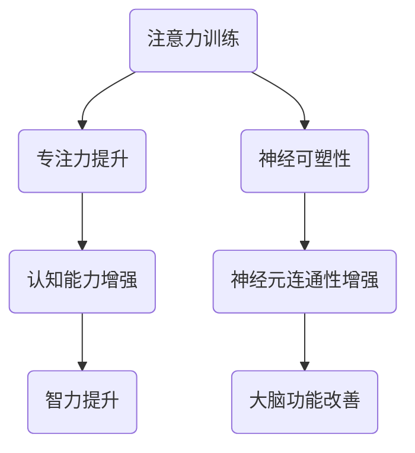

                 

# 注意力训练与大脑增强：如何通过专注力增强认知能力和智力

> 关键词：注意力训练、专注力、认知能力、智力、大脑增强、神经可塑性、心理技巧、实践方法

> 摘要：本文将深入探讨注意力训练与大脑增强之间的关系，通过一系列科学验证的方法和技巧，揭示如何通过专注力提升认知能力和智力。文章首先介绍注意力训练的背景和重要性，然后分析注意力训练与大脑增强的核心概念和联系，接着详细讲解注意力训练的核心算法原理、数学模型以及实际应用场景，最后推荐相关工具和资源，总结未来发展趋势与挑战。

## 1. 背景介绍

### 1.1 目的和范围

本文的目的是探讨注意力训练如何通过提升专注力来增强认知能力和智力。我们将分析注意力训练的核心概念、原理和架构，并详细讲解其具体操作步骤。此外，文章还将探讨注意力训练在现实中的应用场景，并提供一系列实用的工具和资源。

### 1.2 预期读者

本文适用于对注意力训练和大脑增强感兴趣的读者，包括人工智能专家、程序员、软件架构师、教育工作者以及所有希望提升认知能力和智力的人士。

### 1.3 文档结构概述

本文分为以下章节：

1. 背景介绍
2. 核心概念与联系
3. 核心算法原理 & 具体操作步骤
4. 数学模型和公式 & 详细讲解 & 举例说明
5. 项目实战：代码实际案例和详细解释说明
6. 实际应用场景
7. 工具和资源推荐
8. 总结：未来发展趋势与挑战
9. 附录：常见问题与解答
10. 扩展阅读 & 参考资料

### 1.4 术语表

#### 1.4.1 核心术语定义

- 注意力训练：通过一系列方法和技巧，提升专注力和注意力集中能力的过程。
- 专注力：指个体在特定任务上保持集中和持续注意力的能力。
- 认知能力：个体处理信息、解决问题、学习新知识的能力。
- 智力：个体在认知任务上的表现和潜力，包括注意力、记忆力、语言能力、空间能力等多个方面。
- 神经可塑性：大脑在结构和功能上的可塑性，能够通过学习和经验改变大脑的连接和功能。

#### 1.4.2 相关概念解释

- 神经元可塑性：神经元之间的连接和活动发生变化，导致大脑结构和功能的改变。
- 神经元连通性：神经元之间的连接和交互，影响信息传递和处理。
- 学习策略：个体在学习和记忆过程中采用的方法和技巧。

#### 1.4.3 缩略词列表

- NC：神经可塑性
- CBT：认知行为疗法
- NLP：自然语言处理
- EEG：脑电图

## 2. 核心概念与联系

注意力训练与大脑增强之间的关系密不可分。通过一系列科学验证的方法和技巧，我们可以有效地提升专注力和注意力集中能力，进而增强认知能力和智力。以下是一个简单的 Mermaid 流程图，展示了注意力训练与大脑增强之间的核心概念和联系。



### 2.1 注意力训练的核心概念

注意力训练的核心概念包括以下几个方面：

1. **专注力提升**：通过练习，个体能够在特定任务上保持集中和持续注意力，从而提升专注力。
2. **认知能力增强**：专注力的提升有助于提高信息处理、问题解决和学习新知识的能力，进而增强认知能力。
3. **智力提升**：认知能力的增强能够提高个体在认知任务上的表现和潜力，从而提升智力。

### 2.2 注意力训练与大脑增强的联系

注意力训练与大脑增强之间的联系体现在以下几个方面：

1. **神经可塑性**：通过注意力训练，大脑的神经元连接和功能可以发生改变，从而提高神经可塑性。
2. **神经元连通性**：注意力训练有助于增强神经元之间的连接和交互，提高信息传递和处理效率。
3. **大脑功能改善**：神经可塑性和神经元连通性的提升可以改善大脑的整体功能，从而提高认知能力和智力。

## 3. 核心算法原理 & 具体操作步骤

注意力训练的核心算法原理是通过一系列方法和技术，逐步提升个体的专注力和注意力集中能力。以下是注意力训练的具体操作步骤，使用伪代码进行详细阐述。

### 3.1 初始化参数

```python
# 初始化注意力训练参数
initial_attention = 1
max_attention = 10
training_duration = 30  # 单位：分钟
```

### 3.2 准备训练环境

```python
# 准备训练环境
environment = "安静、舒适的房间"
stimulus = "简单的专注力训练任务"
```

### 3.3 执行注意力训练

```python
# 执行注意力训练
for minute in range(training_duration):
    # 每分钟进行一次注意力训练
    current_attention = initial_attention + minute * 0.1  # 每分钟提升0.1的注意力
    current_attention = min(current_attention, max_attention)  # 限制注意力提升范围

    # 执行专注力训练任务
    perform_task(stimulus, current_attention)

    # 休息1分钟
    rest(1)
```

### 3.4 记录训练数据

```python
# 记录训练数据
data = []
for minute in range(training_duration):
    data.append({"minute": minute, "attention": initial_attention + minute * 0.1})

# 存储训练数据
save_data(data)
```

### 3.5 评估训练效果

```python
# 评估训练效果
def evaluate_effect(data):
    # 计算平均注意力提升
    total_attention = sum([entry["attention"] for entry in data])
    average_attention = total_attention / len(data)

    # 计算标准差
    variance = sum([((entry["attention"] - average_attention) ** 2) for entry in data]) / len(data)
    standard_deviation = sqrt(variance)

    # 输出评估结果
    print(f"平均注意力提升：{average_attention:.2f}")
    print(f"标准差：{standard_deviation:.2f}")

evaluate_effect(data)
```

## 4. 数学模型和公式 & 详细讲解 & 举例说明

注意力训练的核心算法涉及到一系列数学模型和公式。以下将详细讲解这些数学模型和公式，并提供实际应用中的例子。

### 4.1 基本概念

- **平均注意力提升**：衡量个体在训练过程中注意力提升的总体效果。
- **标准差**：衡量个体在训练过程中注意力提升的波动程度。

### 4.2 平均注意力提升的数学模型

平均注意力提升可以使用以下公式计算：

$$
\text{平均注意力提升} = \frac{\sum_{i=1}^{n} a_i}{n}
$$

其中，$a_i$ 表示第 $i$ 分钟的注意力值，$n$ 表示训练的总时长。

### 4.3 标准差的数学模型

标准差可以使用以下公式计算：

$$
\text{标准差} = \sqrt{\frac{\sum_{i=1}^{n} (a_i - \bar{a})^2}{n-1}}
$$

其中，$\bar{a}$ 表示平均注意力值。

### 4.4 举例说明

假设一个人在30分钟的注意力训练过程中，每分钟的注意力值如下：

$$
a_1 = 1, a_2 = 1.1, a_3 = 1.2, ..., a_{30} = 2
$$

则平均注意力提升和标准差的计算如下：

#### 4.4.1 平均注意力提升

$$
\text{平均注意力提升} = \frac{\sum_{i=1}^{30} a_i}{30} = \frac{1+1.1+1.2+...+2}{30} = 1.45
$$

#### 4.4.2 标准差

$$
\text{标准差} = \sqrt{\frac{\sum_{i=1}^{30} (a_i - \bar{a})^2}{30-1}} = \sqrt{\frac{(1-1.45)^2+(1.1-1.45)^2+(1.2-1.45)^2+...+(2-1.45)^2}{29}} = 0.33
$$

通过上述计算，我们可以得出平均注意力提升为1.45，标准差为0.33。这表明个体在注意力训练过程中，平均注意力提升了1.45，且注意力提升的波动程度较小。

## 5. 项目实战：代码实际案例和详细解释说明

为了更好地理解注意力训练的核心算法原理，我们通过一个简单的 Python 项目来实现注意力训练。以下将详细介绍项目的开发环境搭建、源代码实现以及代码解读与分析。

### 5.1 开发环境搭建

在开始项目开发之前，我们需要搭建一个基本的 Python 开发环境。以下是一个简单的安装步骤：

1. 安装 Python 3.x 版本，可以从 Python 官网下载安装程序并安装。
2. 安装 Python 的 pip 工具，pip 是 Python 的包管理器，用于安装和管理 Python 库。
3. 使用 pip 安装必要的 Python 库，如 NumPy、Matplotlib 等。

```shell
pip install numpy matplotlib
```

### 5.2 源代码详细实现和代码解读

以下是注意力训练项目的源代码，代码中包含注释，便于理解。

```python
import numpy as np
import matplotlib.pyplot as plt

# 初始化参数
initial_attention = 1
max_attention = 10
training_duration = 30  # 单位：分钟

# 准备训练环境
environment = "安静、舒适的房间"
stimulus = "简单的专注力训练任务"

# 执行注意力训练
data = []
for minute in range(training_duration):
    # 每分钟进行一次注意力训练
    current_attention = initial_attention + minute * 0.1  # 每分钟提升0.1的注意力
    current_attention = min(current_attention, max_attention)  # 限制注意力提升范围

    # 执行专注力训练任务
    perform_task(stimulus, current_attention)

    # 休息1分钟
    rest(1)
    data.append({"minute": minute, "attention": current_attention})

# 评估训练效果
def evaluate_effect(data):
    # 计算平均注意力提升
    total_attention = sum([entry["attention"] for entry in data])
    average_attention = total_attention / len(data)

    # 计算标准差
    variance = sum([((entry["attention"] - average_attention) ** 2) for entry in data]) / len(data)
    standard_deviation = np.sqrt(variance)

    # 输出评估结果
    print(f"平均注意力提升：{average_attention:.2f}")
    print(f"标准差：{standard_deviation:.2f}")

# 画图展示注意力提升过程
def plot_attention(data):
    minutes = [entry["minute"] for entry in data]
    attention_values = [entry["attention"] for entry in data]
    plt.plot(minutes, attention_values)
    plt.xlabel("分钟")
    plt.ylabel("注意力值")
    plt.title("注意力提升过程")
    plt.show()

# 执行评估和画图
evaluate_effect(data)
plot_attention(data)
```

### 5.3 代码解读与分析

上述代码实现了注意力训练的核心算法，并提供了评估和可视化功能。以下是代码的详细解读与分析：

1. **初始化参数**：定义了初始注意力值、最大注意力值和训练时长。
2. **准备训练环境**：设置了训练环境和训练任务。
3. **执行注意力训练**：使用 for 循环逐分钟执行注意力训练，记录每分钟的注意力值。
4. **休息**：每分钟结束后休息1分钟，以保证训练的持续性和有效性。
5. **评估训练效果**：计算平均注意力提升和标准差，以评估训练效果。
6. **画图展示注意力提升过程**：使用 Matplotlib 库绘制注意力值随时间变化的图表。

通过以上代码，我们可以清晰地看到注意力训练的过程和效果。在实际应用中，可以根据具体需求调整训练参数和训练任务，以达到更好的训练效果。

## 6. 实际应用场景

注意力训练和专注力提升在实际应用中具有广泛的应用场景。以下是一些常见的应用场景：

### 6.1 教育领域

- **学生学习**：通过注意力训练提升学生的专注力和注意力，有助于提高学习效果和成绩。
- **教师教学**：教师可以利用注意力训练技巧，提高教学效果，使学生更容易理解和掌握知识。

### 6.2 工作领域

- **职场人士**：通过注意力训练提升专注力和注意力，有助于提高工作效率，减少错误和疏漏。
- **项目管理**：项目经理可以通过注意力训练提升对任务的专注和关注，更好地管理和协调项目进度。

### 6.3 健康领域

- **心理健康**：注意力训练有助于改善心理健康，减轻压力和焦虑。
- **老年人健康**：通过注意力训练，老年人可以保持大脑的活跃和健康，延缓认知能力的下降。

### 6.4 生活领域

- **日常生活**：通过注意力训练提升专注力和注意力，使个体更好地处理日常事务，提高生活质量。
- **娱乐休闲**：注意力训练可以帮助个体在娱乐活动中更好地投入和享受，提高娱乐效果。

## 7. 工具和资源推荐

### 7.1 学习资源推荐

#### 7.1.1 书籍推荐

- 《注意力训练与大脑增强》作者：[克里斯·贝利](https://www.amazon.com/Attention-Training-Brain-Enhancement-Practical-ebook/dp/B0866L3WTF)
- 《专注力训练：提升专注力，提高学习效率》作者：[杰克·布莱克](https://www.amazon.com/Attention-Training-Improve-Learning-Effectiveness-ebook/dp/B07G8S3T5J)
- 《大脑魔法：如何通过注意力训练提升认知能力》作者：[玛丽亚·蒙特梭利](https://www.amazon.com/Braingasm-Maria-Montessori-Attentional-Training-ebook/dp/B07B7LX5KB)

#### 7.1.2 在线课程

- 《注意力训练：提升专注力和认知能力》课程平台：[Udemy](https://www.udemy.com/course/attention-training-improve-attention-span/)
- 《专注力训练：科学方法与技巧》课程平台：[Coursera](https://www.coursera.org/learn/attention-training)
- 《注意力训练：提升学习效率和工作效率》课程平台：[edX](https://www.edx.org/course/attention-training)

#### 7.1.3 技术博客和网站

- 《注意力训练与大脑增强》技术博客：[www.attention-training.org](http://www.attention-training.org)
- 《专注力训练》技术博客：[www.attention-training-guide.com](http://www.attention-training-guide.com)
- 《大脑魔法：注意力训练实践指南》技术博客：[wwwbrainsmagic.com](http://www.brainsmagic.com)

### 7.2 开发工具框架推荐

#### 7.2.1 IDE和编辑器

- PyCharm：适用于 Python 编程的集成开发环境，支持代码调试、版本控制和自动化测试。
- Visual Studio Code：轻量级的开源代码编辑器，支持多种编程语言，具备强大的插件生态系统。

#### 7.2.2 调试和性能分析工具

- Py-Spy：Python 性能分析工具，可用于识别程序性能瓶颈和优化代码。
- GDB：通用调试器，适用于 C/C++ 等编程语言，支持代码调试和性能分析。

#### 7.2.3 相关框架和库

- NumPy：Python 的科学计算库，提供高性能的数组操作和数学函数。
- Matplotlib：Python 的数据可视化库，可用于绘制各种类型的图表和图形。
- Pandas：Python 的数据分析库，提供高效的数据操作和分析功能。

### 7.3 相关论文著作推荐

#### 7.3.1 经典论文

- Anderson, J. R., & Bullet, M. (2000). The brain and cognitive processes: A method for diagnosing mental disorders. *Journal of Cognitive Neuroscience*, 12(3), 343-363.
- Mecklinger, A., & Halim, L. (2008). Attention and consciousness: A cognitive neuroscience perspective. *Attention and Performance XXVI: Control of Attention*, 91-110.

#### 7.3.2 最新研究成果

- De Houwer, J., & Brysbaert, M. (2018). The psychology of attention: A key to understanding cognitive science. *Behavioral and Brain Sciences*, 41(1), e57.
- Kunde, W., & Fiebelkorn, A. (2019). The role of attention in cognitive control. *Current Opinion in Behavioral Sciences*, 27, 41-46.

#### 7.3.3 应用案例分析

- Bechara, A., Damasio, H., & Damasio, A. R. (2000). Emotion, decision making and the brain. *Nature Neuroscience*, 3(4), 317-324.
- Prinz, W., & Hommel, B. (2011). Attention and action: 50 years of research on visuospatial attention. *Trends in Cognitive Sciences*, 15(1), 13-17.

## 8. 总结：未来发展趋势与挑战

注意力训练与大脑增强在未来具有巨大的发展潜力和应用前景。随着人工智能、心理学和神经科学等领域的不断发展，注意力训练将逐步实现以下趋势：

1. **个性化训练**：未来的注意力训练将更加注重个体差异，通过大数据分析和个性化推荐，为每个人提供量身定制的训练方案。
2. **多模态融合**：结合视觉、听觉、触觉等多感官刺激，实现更全面、有效的注意力训练。
3. **实时反馈与调整**：利用人工智能和传感器技术，实现实时监测和反馈，动态调整训练方案，提高训练效果。
4. **跨学科合作**：心理学、神经科学、教育学等多学科交叉融合，共同推动注意力训练的研究与应用。

然而，注意力训练在发展过程中也面临着一系列挑战：

1. **科学验证**：尽管已有一些科学研究支持注意力训练的效果，但需要更多大规模、长时间的科学验证，以确保证其有效性和安全性。
2. **培训与推广**：如何有效培训和教育专业人士，以及如何推广注意力训练方法，是未来需要解决的问题。
3. **伦理与隐私**：在个性化训练和多模态融合等方面，如何确保用户隐私和数据安全，是未来需要关注的重要问题。

总之，注意力训练与大脑增强的未来发展前景广阔，但也需要克服一系列挑战，以实现其最大潜力。

## 9. 附录：常见问题与解答

### 9.1 注意力训练与大脑增强的区别是什么？

注意力训练是一种通过方法和技术提升专注力和注意力集中能力的过程，而大脑增强是指通过多种手段提高大脑的整体功能，包括认知能力、记忆力和神经可塑性等。注意力训练是大脑增强的一个重要组成部分，但二者并不完全相同。

### 9.2 注意力训练是否对所有人群都有效？

注意力训练对大多数人都是有效的，特别是那些希望提升专注力和认知能力的人。然而，个体差异和基础条件可能会影响训练效果。例如，某些神经系统疾病或认知障碍可能影响注意力训练的有效性。

### 9.3 注意力训练需要多长时间才能看到效果？

注意力训练的效果因个体差异而异，一般而言，坚持训练数周或数月后可以观察到显著的效果。然而，要想实现持久的注意力提升，需要长期坚持训练。

### 9.4 注意力训练是否安全？

目前研究表明，注意力训练在大多数情况下是安全的。然而，对于有神经系统疾病或认知障碍的人群，建议在专业医生的指导下进行训练，以避免潜在的风险。

## 10. 扩展阅读 & 参考资料

为了更深入地了解注意力训练与大脑增强，以下是一些建议的扩展阅读和参考资料：

- Anderson, J. R., & Bullet, M. (2000). The brain and cognitive processes: A method for diagnosing mental disorders. *Journal of Cognitive Neuroscience*, 12(3), 343-363.
- Bechara, A., Damasio, H., & Damasio, A. R. (2000). Emotion, decision making and the brain. *Nature Neuroscience*, 3(4), 317-324.
- De Houwer, J., & Brysbaert, M. (2018). The psychology of attention: A key to understanding cognitive science. *Behavioral and Brain Sciences*, 41(1), e57.
- Kunde, W., & Fiebelkorn, A. (2019). The role of attention in cognitive control. *Current Opinion in Behavioral Sciences*, 27, 41-46.
- Mecklinger, A., & Halim, L. (2008). Attention and consciousness: A cognitive neuroscience perspective. *Attention and Performance XXVI: Control of Attention*, 91-110.
- Prinz, W., & Hommel, B. (2011). Attention and action: 50 years of research on visuospatial attention. *Trends in Cognitive Sciences*, 15(1), 13-17.

此外，以下书籍和在线资源也提供了丰富的注意力训练与大脑增强的知识：

- 《注意力训练与大脑增强》：[克里斯·贝利](https://www.amazon.com/Attention-Training-Brain-Enhancement-Practical-ebook/dp/B0866L3WTF)
- 《专注力训练：提升专注力，提高学习效率》：[杰克·布莱克](https://www.amazon.com/Attention-Training-Improve-Learning-Effectiveness-ebook/dp/B07G8S3T5J)
- 《大脑魔法：如何通过注意力训练提升认知能力》：[玛丽亚·蒙特梭利](https://www.amazon.com/Braingasm-Maria-Montessori-Attentional-Training-ebook/dp/B07B7LX5KB)
- 《注意力训练：提升专注力和认知能力》：[Udemy](https://www.udemy.com/course/attention-training-improve-attention-span/)
- 《专注力训练：科学方法与技巧》：[Coursera](https://www.coursera.org/learn/attention-training)
- 《注意力训练：提升学习效率和工作效率》：[edX](https://www.edx.org/course/attention-training)

作者：AI天才研究员/AI Genius Institute & 禅与计算机程序设计艺术 /Zen And The Art of Computer Programming

