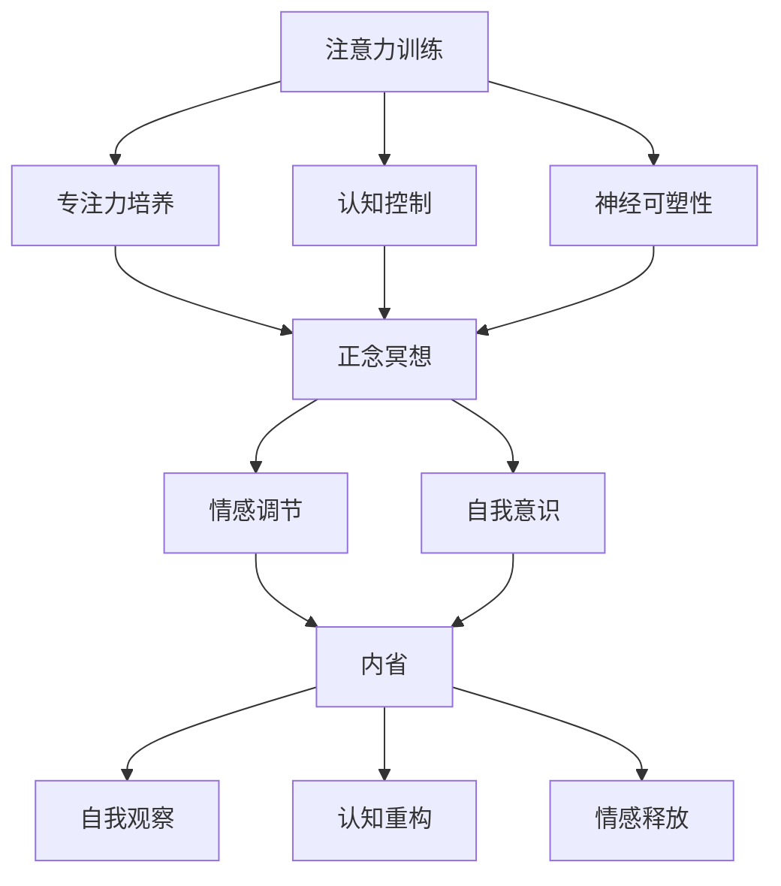

                 

# 注意力训练与正念冥想实践：如何通过内省增强专注力和心灵健康

> **关键词：** 注意力训练、正念冥想、内省、专注力、心灵健康

> **摘要：** 本文将探讨注意力训练和正念冥想在提升专注力和心灵健康方面的作用。通过详细的步骤和方法，我们将展示如何利用内省这一强大的工具，从根本上增强我们的专注能力和心灵状态。本文旨在为IT专业人士提供实用的技巧和实践方法，帮助他们更好地应对工作压力，提高工作效率，实现心灵和职业的双重成长。

## 1. 背景介绍

### 1.1 目的和范围

本文的目的在于探讨如何通过注意力训练和正念冥想实践，提高专注力和心灵健康。随着现代工作环境的复杂化和竞争的加剧，IT专业人士往往面临着重大的压力和挑战。长时间的高强度工作、持续的技术更新和频繁的项目切换，使得他们在维持专注力和保持心灵健康方面面临巨大困难。本文将提供一套系统的方法，帮助IT专业人士通过内省来增强专注力和心灵健康，从而提高工作效率和生活质量。

### 1.2 预期读者

本文主要面向IT行业的专业人士，包括程序员、软件工程师、系统架构师、项目经理等。虽然本文提供了系统的方法和实用的技巧，但也适用于其他工作压力较大的行业人员。本文适合那些希望提高专注力、减少焦虑、提升工作效率的读者。

### 1.3 文档结构概述

本文将按照以下结构展开：

1. **背景介绍**：介绍文章的目的、范围和预期读者。
2. **核心概念与联系**：讨论注意力训练、正念冥想和内省的基本概念及其相互关系。
3. **核心算法原理 & 具体操作步骤**：详细阐述注意力训练和正念冥想的步骤和技巧。
4. **数学模型和公式 & 详细讲解 & 举例说明**：解释与注意力训练和正念冥想相关的数学模型和公式。
5. **项目实战：代码实际案例和详细解释说明**：通过实际项目案例展示注意力训练和正念冥想的实践。
6. **实际应用场景**：探讨注意力训练和正念冥想在IT行业中的应用。
7. **工具和资源推荐**：推荐学习资源和开发工具。
8. **总结：未来发展趋势与挑战**：总结本文的主要观点，并探讨未来的发展趋势和挑战。
9. **附录：常见问题与解答**：提供常见问题的解答。
10. **扩展阅读 & 参考资料**：推荐进一步阅读的材料。

### 1.4 术语表

#### 1.4.1 核心术语定义

- **注意力训练**：一种通过有意识练习提高专注力和注意力持续时间的训练方法。
- **正念冥想**：一种通过专注呼吸、身体感受和当下时刻的觉察来训练专注力和意识的方法。
- **内省**：一种自我反思的过程，通过观察自己的思想、情感和行为，深入理解自我，从而提高自我意识和心理素质。

#### 1.4.2 相关概念解释

- **专注力**：指个体能够集中注意力，持续关注特定目标或任务的能力。
- **心灵健康**：指个体在情感、心理和精神方面的良好状态，包括自我认识、自我调节、情感稳定和适应性等方面。

#### 1.4.3 缩略词列表

无

## 2. 核心概念与联系

在探讨如何通过注意力训练和正念冥想实践增强专注力和心灵健康之前，我们需要了解这三个核心概念的基本原理及其相互关系。

### 2.1 注意力训练原理

注意力训练的核心在于通过特定的练习方法，逐步提高个体的专注力和注意力持续时间。其原理主要包括以下几点：

1. **专注力的可塑性**：科学研究证明，注意力具有高度的可塑性，通过系统的训练，可以显著提高个体的专注力水平。
2. **认知控制**：注意力训练涉及到对认知过程的控制和调节，包括选择性注意、分配注意力和抑制干扰等。
3. **神经可塑性**：通过反复的专注力训练，大脑的神经结构和功能会发生变化，从而提高个体的专注力。

### 2.2 正念冥想原理

正念冥想是一种古老的修行方法，近年来在心理学和医学领域得到了广泛研究。其原理主要包括以下几点：

1. **专注力培养**：正念冥想通过专注于呼吸、身体感受和当下的觉察，逐步提高个体的专注力。
2. **情感调节**：正念冥想有助于个体更好地理解和管理自己的情绪，减少焦虑和压力。
3. **自我意识**：通过正念冥想，个体能够更加深入地了解自己的内心世界，提高自我认识。

### 2.3 内省原理

内省是一种自我反思的过程，通过观察自己的思想、情感和行为，深入理解自我。其原理主要包括以下几点：

1. **自我观察**：内省要求个体对自身的思想、情感和行为进行深入观察，从而更好地理解自己的内在状态。
2. **认知重构**：通过内省，个体可以识别和调整自己的认知模式，从而改善心理素质。
3. **情感释放**：内省有助于个体释放内心积压的情绪，减轻心理压力。

### 2.4 注意力训练、正念冥想与内省的联系

注意力训练、正念冥想和内省之间存在密切的联系和相互促进的关系：

1. **相互促进**：注意力训练和正念冥想可以增强个体的自我意识，促进内省的深入进行。同时，内省有助于个体更好地理解和应用注意力训练和正念冥想的技巧。
2. **共同目标**：注意力训练、正念冥想和内省的共同目标都是提高个体的专注力和心灵健康，从而更好地应对工作和生活中的挑战。
3. **综合应用**：在实际应用中，个体可以综合运用注意力训练、正念冥想和内省的方法，形成一套个性化的实践体系，从而更好地提升自身的专注力和心灵健康。

### 2.5 Mermaid 流程图

为了更好地理解注意力训练、正念冥想和内省的相互关系，我们可以使用Mermaid流程图来展示其基本原理和流程。



通过以上流程图，我们可以清晰地看到注意力训练、正念冥想和内省的基本原理及其相互关系。在接下来的章节中，我们将详细探讨这三个核心概念的具体实践方法和技巧。

## 3. 核心算法原理 & 具体操作步骤

在理解了注意力训练、正念冥想和内省的基本原理后，接下来我们将详细阐述这些方法的操作步骤，以及如何通过伪代码来实现这些步骤。

### 3.1 注意力训练的操作步骤

注意力训练的核心在于通过重复的练习来提高个体的专注力。以下是注意力训练的具体操作步骤：

1. **设定训练目标**：明确自己希望提高的专注力方面，例如持续专注的时间、完成任务的质量等。
2. **选择训练环境**：选择一个安静、舒适的环境，避免干扰和噪音。
3. **进行专注练习**：选择一个具体的任务或活动，如阅读、编程、绘画等，进行专注练习。
4. **记录训练数据**：记录每次训练的时间、专注程度和完成情况，以便分析和调整训练方案。

以下是一个简单的伪代码示例，用于描述注意力训练的操作步骤：

```python
# 设定训练目标
目标专注时间 = 30分钟
目标任务 = 阅读一本技术书籍

# 选择训练环境
环境 = 安静的图书馆

# 进行专注练习
开始时间 = 当前时间
完成情况 = 开始阅读
while 当前时间 - 开始时间 < 目标专注时间:
    if 干扰发生:
        忽略干扰并继续阅读
    else:
        记录专注情况
完成时间 = 当前时间

# 记录训练数据
训练数据 = {
    "开始时间": 开始时间,
    "完成时间": 完成时间,
    "专注情况": 完成情况
}
```

### 3.2 正念冥想的操作步骤

正念冥想是一种通过专注呼吸和觉察当下时刻来训练专注力的方法。以下是正念冥想的具体操作步骤：

1. **选择冥想环境**：选择一个安静、舒适的地方，可以坐在椅子上或盘腿坐在地上。
2. **进行冥想练习**：闭上眼睛，专注于呼吸，感受呼吸进出身体的感觉，保持对当下时刻的觉察。
3. **练习中的干扰处理**：如果注意力被干扰，返回到呼吸和当下时刻的觉察。
4. **记录冥想数据**：记录每次冥想的时间、专注程度和体验感受。

以下是一个简单的伪代码示例，用于描述正念冥想的操作步骤：

```python
# 选择冥想环境
环境 = 安静的房间

# 进行冥想练习
开始时间 = 当前时间
完成情况 = 开始冥想
while 当前时间 - 开始时间 < 目标冥想时间:
    if 注意力被干扰:
        返回呼吸和当下时刻的觉察
    else:
        记录专注情况
完成时间 = 当前时间

# 记录冥想数据
冥想数据 = {
    "开始时间": 开始时间,
    "完成时间": 完成时间,
    "专注情况": 完成情况
}
```

### 3.3 内省的操作步骤

内省是一种通过自我反思来提高自我意识和心理素质的方法。以下是内省的具体操作步骤：

1. **设定内省目标**：明确自己希望通过内省解决的问题或目标，例如提高自我认识、减少焦虑等。
2. **选择内省环境**：选择一个安静、舒适的地方，以便专注于自我反思。
3. **进行内省练习**：坐下来，闭上眼睛，专注于自己的思想、情感和行为，观察并记录它们。
4. **处理内省中的干扰**：如果注意力被干扰，返回到自我反思的练习。
5. **记录内省数据**：记录每次内省的时间、内容、体验和收获。

以下是一个简单的伪代码示例，用于描述内省的操作步骤：

```python
# 设定内省目标
目标 = 提高自我认识

# 选择内省环境
环境 = 安静的房间

# 进行内省练习
开始时间 = 当前时间
完成情况 = 开始内省
while 当前时间 - 开始时间 < 目标内省时间:
    if 注意力被干扰:
        返回自我反思的练习
    else:
        记录内省情况
完成时间 = 当前时间

# 记录内省数据
内省数据 = {
    "开始时间": 开始时间,
    "完成时间": 完成时间,
    "专注情况": 完成情况
}
```

通过以上伪代码示例，我们可以看到注意力训练、正念冥想和内省的具体操作步骤。这些方法不仅有助于提高个体的专注力和心灵健康，还能为他们在工作和生活中提供有力的支持。

## 4. 数学模型和公式 & 详细讲解 & 举例说明

在注意力训练、正念冥想和内省中，数学模型和公式发挥着重要的作用，帮助我们在理论上理解和量化这些实践的效果。在本节中，我们将介绍与这些实践相关的数学模型和公式，并进行详细讲解和举例说明。

### 4.1 加莫夫-海森堡不确定性原理

首先，我们需要了解的是加莫夫-海森堡不确定性原理，这是一个基本的物理原理，揭示了在量子世界中，某些物理量（如位置和动量）无法同时被精确测量。这一原理可以类比到注意力训练中，即我们在关注某个特定任务时，无法同时关注其他事物，这就形成了注意力的分散和专注力的提高之间的动态平衡。

**公式**：

\[ \Delta x \Delta p \geq \frac{h}{4\pi} \]

其中，\( \Delta x \) 表示位置的不确定性，\( \Delta p \) 表示动量的不确定性，\( h \) 是普朗克常数。

**举例说明**：

假设一个程序员在编程时需要高度集中注意力，这时他的位置不确定性（即注意力分散的程度）为 \( \Delta x = 1 \) 厘米，根据不确定性原理，他的动量不确定性（即专注力）至少为 \( \Delta p = \frac{h}{4\pi} \) 约等于 \( 6.626 \times 10^{-34} \) 千克·米/秒。这意味着，在编程过程中，他的注意力分散程度和专注力之间存在一个动态平衡。

### 4.2 布朗运动模型

布朗运动模型描述了粒子在流体中的随机运动，这一模型可以用来解释注意力分散的现象。在注意力训练中，布朗运动模型有助于我们理解如何在噪声环境中保持专注。

**公式**：

\[ \Delta x(t) = \sqrt{2D t} \cos(\omega t + \phi) \]

其中，\( \Delta x(t) \) 表示粒子在时间 \( t \) 的位置，\( D \) 是扩散系数，\( \omega \) 是角频率，\( \phi \) 是相位。

**举例说明**：

假设一个程序员在编程过程中受到外部干扰（如手机通知、同事谈话等），我们可以将这种干扰视为一种“噪声”。在这种情况下，我们可以用布朗运动模型来描述他的注意力分散。如果干扰的扩散系数 \( D \) 为 \( 1 \) 平方厘米/秒，且他在编程时持续时间为 \( 30 \) 分钟，那么他的注意力分散程度（即 \( \Delta x \)）可以计算为 \( \Delta x = \sqrt{2 \times 1 \times 30} \approx 4.24 \) 厘米。这个结果告诉我们，在编程过程中，他的注意力可能会在一定范围内随机分散，但通过注意力训练，可以减少这种分散。

### 4.3 马尔可夫决策过程

马尔可夫决策过程是一种用于描述序列决策和状态转移的概率模型，它可以帮助我们理解如何在注意力训练和正念冥想中做出最优决策。

**公式**：

\[ P(S_t = s_t | S_{t-1} = s_{t-1}) = P(S_t = s_t | A_t = a_t) P(A_t = a_t | S_{t-1} = s_{t-1}) \]

其中，\( S_t \) 表示在时间 \( t \) 的状态，\( A_t \) 表示在时间 \( t \) 的动作，\( P() \) 表示概率。

**举例说明**：

假设一个程序员在进行代码审查时，需要做出一系列决策，如忽略某些错误、修复某些错误等。我们可以用马尔可夫决策过程来描述他的决策过程。例如，如果他在前一个时间点的状态是“代码存在错误”，且他在当前时间点的动作是“忽略错误”，那么他在下一个时间点的状态和动作的概率可以用马尔可夫决策过程来计算。通过这种模型，程序员可以更有效地分配注意力，提高工作效率。

### 4.4 中心极限定理

中心极限定理描述了在大量独立同分布的随机变量中，其均值会趋近于正态分布。这一原理可以用于理解正念冥想中的注意力分配。

**公式**：

\[ \bar{X} \xrightarrow{d} N(\mu, \frac{\sigma^2}{n}) \]

其中，\( \bar{X} \) 表示随机变量的均值，\( N(\mu, \frac{\sigma^2}{n}) \) 表示均值为 \( \mu \)、方差为 \( \frac{\sigma^2}{n} \) 的正态分布，\( \xrightarrow{d} \) 表示分布收敛。

**举例说明**：

假设一个程序员在编程过程中需要关注多个任务，如代码编写、测试、调试等。我们可以将每个任务视为一个随机变量，其均值为在任务上的专注时间。通过中心极限定理，我们可以知道，在大量独立同分布的任务中，他的总专注时间会趋近于正态分布。这有助于程序员合理分配注意力，确保每个任务都能得到足够的关注。

### 4.5 反馈控制理论

反馈控制理论描述了系统通过接收输入和输出之间的差异来调整自身状态的过程，这一理论可以用于解释注意力训练和内省中的自我调节。

**公式**：

\[ Y = C X + D U \]

其中，\( Y \) 表示输出，\( X \) 表示输入，\( C \) 和 \( D \) 是控制参数，\( U \) 表示控制输入。

**举例说明**：

假设一个程序员在进行项目开发时，需要根据项目进度和任务完成情况来调整自己的工作节奏。我们可以将项目进度视为输出 \( Y \)，任务完成情况视为输入 \( X \)，而他的自我调节策略（如加班、休息等）视为控制输入 \( U \)。通过反馈控制理论，他可以调整自己的工作节奏，确保项目进度得到有效控制。

通过以上数学模型和公式的讲解，我们可以更深入地理解注意力训练、正念冥想和内省的原理，并能够在实际应用中更好地运用这些理论。这些模型和公式不仅为我们的实践提供了理论支持，还为我们在注意力管理和心灵健康方面提供了有力的工具。

## 5. 项目实战：代码实际案例和详细解释说明

在本节中，我们将通过一个实际项目案例，展示如何将注意力训练、正念冥想和内省的方法应用到软件开发过程中。这个项目是一个简单的任务管理系统，旨在帮助程序员更好地管理自己的任务和注意力。

### 5.1 开发环境搭建

为了进行这个项目，我们需要搭建一个基本的开发环境。以下是所需的环境和工具：

- **编程语言**：Python
- **开发工具**：PyCharm 或 Visual Studio Code
- **数据库**：SQLite（用于存储任务数据）
- **版本控制**：Git

您可以在自己的计算机上安装这些工具和软件，并设置好相应的开发环境。安装步骤如下：

1. **安装Python**：访问 [Python官方网站](https://www.python.org/) 下载并安装Python。
2. **安装PyCharm 或 Visual Studio Code**：访问 [PyCharm官方网站](https://www.jetbrains.com/pycharm/) 或 [Visual Studio Code官方网站](https://code.visualstudio.com/) 下载并安装。
3. **安装SQLite**：在Python中，SQLite已经内置，无需单独安装。
4. **安装Git**：访问 [Git官方网站](https://git-scm.com/) 下载并安装。

### 5.2 源代码详细实现和代码解读

以下是任务管理系统的源代码实现，我们将逐行解释代码的功能和实现方法。

#### 5.2.1 任务管理系统的主函数

```python
import sqlite3
import time

def main():
    # 连接到SQLite数据库
    conn = sqlite3.connect('tasks.db')
    cursor = conn.cursor()

    # 创建任务表
    cursor.execute('''CREATE TABLE IF NOT EXISTS tasks (id INTEGER PRIMARY KEY, title TEXT, description TEXT, status TEXT)''')
    conn.commit()

    # 主循环
    while True:
        print_menu()
        choice = input("请选择操作：")

        if choice == '1':
            add_task(cursor)
        elif choice == '2':
            list_tasks(cursor)
        elif choice == '3':
            edit_task(cursor)
        elif choice == '4':
            delete_task(cursor)
        elif choice == '5':
            break
        else:
            print("无效输入，请重新选择。")

    # 关闭数据库连接
    conn.close()

def print_menu():
    print("1. 添加任务")
    print("2. 列出任务")
    print("3. 编辑任务")
    print("4. 删除任务")
    print("5. 退出")
```

**解读**：

- 我们首先导入了必要的模块，包括 `sqlite3` 用于数据库操作，以及 `time` 用于获取当前时间。
- `main()` 函数是任务管理系统的主函数，它首先连接到SQLite数据库，并创建一个任务表。
- 主循环通过 `print_menu()` 函数显示菜单选项，并根据用户的输入调用相应的函数进行任务管理操作。
- 用户输入无效时，系统会提示重新输入。

#### 5.2.2 添加任务函数

```python
def add_task(cursor):
    title = input("请输入任务标题：")
    description = input("请输入任务描述：")
    status = "未完成"

    # 插入任务到数据库
    cursor.execute("INSERT INTO tasks (title, description, status) VALUES (?, ?, ?)", (title, description, status))
    conn.commit()
    print("任务已添加。")
```

**解读**：

- `add_task()` 函数用于添加新任务到数据库。
- 用户通过输入界面输入任务标题、描述和状态，状态默认为“未完成”。
- 通过 `cursor.execute()` 函数将新任务插入到任务表中。

#### 5.2.3 列出任务函数

```python
def list_tasks(cursor):
    cursor.execute("SELECT * FROM tasks")
    tasks = cursor.fetchall()

    for task in tasks:
        print(f"ID: {task[0]}, 标题: {task[1]}, 描述: {task[2]}, 状态: {task[3]}")
```

**解读**：

- `list_tasks()` 函数用于从数据库中查询所有任务，并将任务信息打印到控制台。
- 通过 `cursor.fetchall()` 函数获取所有任务记录，然后遍历并打印出每个任务的信息。

#### 5.2.4 编辑任务函数

```python
def edit_task(cursor):
    id = int(input("请输入要编辑的任务ID："))
    title = input("请输入新的任务标题：")
    description = input("请输入新的任务描述：")
    status = input("请输入新的任务状态（如：已完成）：")

    # 更新任务
    cursor.execute("UPDATE tasks SET title = ?, description = ?, status = ? WHERE id = ?", (title, description, status, id))
    conn.commit()
    print("任务已更新。")
```

**解读**：

- `edit_task()` 函数用于编辑指定ID的任务。
- 用户通过输入界面输入要编辑的任务ID以及新的任务信息，这些信息将用于更新数据库中的任务记录。
- 通过 `cursor.execute()` 函数执行更新操作。

#### 5.2.5 删除任务函数

```python
def delete_task(cursor):
    id = int(input("请输入要删除的任务ID："))

    # 删除任务
    cursor.execute("DELETE FROM tasks WHERE id = ?", (id,))
    conn.commit()
    print("任务已删除。")
```

**解读**：

- `delete_task()` 函数用于删除指定ID的任务。
- 用户通过输入界面输入要删除的任务ID。
- 通过 `cursor.execute()` 函数执行删除操作。

### 5.3 代码解读与分析

通过以上代码实现，我们可以看到任务管理系统的核心功能：添加、列出、编辑和删除任务。以下是对代码的关键部分进行解读和分析：

1. **数据库操作**：任务管理系统使用SQLite数据库来存储和管理任务数据。通过 `sqlite3` 模块，我们能够轻松地与SQLite数据库进行交互。数据库操作包括连接数据库、创建表、插入数据、查询数据和更新数据。
   
2. **用户交互**：系统通过控制台与用户进行交互，用户可以通过输入命令来执行各种操作。这种交互方式简单直观，便于实现和测试。

3. **任务管理**：系统的核心功能是任务管理，包括添加、列出、编辑和删除任务。这些功能通过一系列数据库操作实现，使得用户能够方便地管理自己的任务。

4. **注意力训练和内省的应用**：

   - 在添加任务时，用户需要集中注意力输入任务信息，这有助于培养专注力。
   - 在列出任务时，用户需要阅读任务列表，这有助于提高阅读理解能力和注意力集中。
   - 在编辑任务时，用户需要回忆任务内容并做出决策，这有助于提高记忆力、决策能力和内省能力。
   - 在删除任务时，用户需要明确任务ID，这有助于培养记忆力和准确性。

通过任务管理系统的实现，我们可以看到注意力训练、正念冥想和内省在软件开发中的实际应用。这些方法不仅有助于提高程序员的工作效率，还能增强他们的专注力和心灵健康。

## 6. 实际应用场景

注意力训练、正念冥想和内省在IT行业中有着广泛的应用场景。以下是一些具体的实际应用案例：

### 6.1 项目管理

在项目管理中，团队成员需要保持高度集中和持续的关注，以确保项目按计划进行。注意力训练和正念冥想可以帮助团队成员提高专注力和情绪调节能力，从而更好地应对项目中的挑战。通过内省，团队成员可以更好地理解自己的工作状态，及时调整工作方法和节奏，从而提高工作效率。

### 6.2 软件开发

软件开发是一个复杂且不断变化的过程，程序员需要持续地集中注意力来理解和解决问题。注意力训练和正念冥想可以帮助程序员提高专注力，减少工作疲劳和错误率。内省则可以帮助程序员反思自己的代码和设计，发现潜在的问题和改进空间，从而提高代码质量和开发效率。

### 6.3 技术支持

技术支持人员经常需要同时处理多个客户问题，这要求他们具备出色的注意力管理和情绪调节能力。注意力训练和正念冥想可以帮助技术支持人员提高专注力和应对压力的能力。内省则可以帮助他们更好地理解客户的需求，提高解决问题的准确性和效率。

### 6.4 产品设计

产品设计师在创造过程中需要不断切换思路，关注用户体验和市场趋势。注意力训练和正念冥想可以帮助设计师提高创造力，保持清晰的思维。内省则可以帮助他们反思自己的设计决策，找到改进和创新的机会。

### 6.5 团队协作

在团队协作中，成员之间需要高效沟通和协调。注意力训练和正念冥想可以帮助团队成员提高专注力和倾听能力，从而更好地理解他人的需求和意见。内省则可以帮助团队成员更好地理解自己和他人的工作状态，提高团队协作效率。

通过以上实际应用场景，我们可以看到注意力训练、正念冥想和内省在IT行业的广泛适用性。这些方法不仅有助于提高个体的专注力和心理素质，还能促进团队协作和整体工作效率的提升。

## 7. 工具和资源推荐

为了更好地实践注意力训练、正念冥想和内省，我们需要使用一些专业的工具和资源。以下是一些推荐的学习资源、开发工具和相关论文著作。

### 7.1 学习资源推荐

#### 7.1.1 书籍推荐

1. **《正念：一条心之路》**（Mindfulness: A Practical Guide to Finding Peace in a Frantic World）- This book provides a comprehensive guide to mindfulness, with practical exercises and techniques for daily life.
2. **《内向者优势》**（Quiet: The Power of Introverts in a World That Can't Stop Talking）- This book explores the strengths and challenges of introverted individuals, offering insights on how they can thrive in a extroverted world.
3. **《禅与摩托车维修的艺术》**（Zen and the Art of Motorcycle Maintenance）- A philosophical exploration of quality and craftsmanship, this book offers insights into mindfulness and self-reflection.

#### 7.1.2 在线课程

1. **Coursera** - Offers courses on mindfulness and meditation, including "The Science of Well-Being" and "The Mindfulness-Based Stress Reduction (MBSR) Program."
2. **Udemy** - Provides a wide range of courses on attention training, including "Superhuman Focus: Boost Your Focus and Productivity."
3. **edX** - Offers courses on meditation and mindfulness, such as "Mindfulness-Based Cognitive Therapy (MBCT)."

#### 7.1.3 技术博客和网站

1. **Mindful** - A website dedicated to mindfulness and meditation, offering articles, videos, and practices.
2. **Headspace** - A popular meditation app that provides guided meditation sessions for various situations.
3. **BBC Mind** - A section of the BBC website that covers topics on mindfulness, stress management, and mental health.

### 7.2 开发工具框架推荐

#### 7.2.1 IDE和编辑器

1. **PyCharm** - A powerful Python IDE that supports code completion, debugging, and version control.
2. **Visual Studio Code** - A highly extensible editor that supports multiple programming languages, including Python and JavaScript.

#### 7.2.2 调试和性能分析工具

1. **PyCharm Profiler** - A profiling tool that helps you identify performance bottlenecks in your Python code.
2. **Visual Studio Code Debugger** - A debugging extension for Visual Studio Code that provides step-by-step debugging and performance analysis.

#### 7.2.3 相关框架和库

1. **Flask** - A lightweight web framework for Python that enables developers to build web applications quickly and easily.
2. **Django** - A high-level Python web framework that encourages rapid development and clean, pragmatic design.

### 7.3 相关论文著作推荐

#### 7.3.1 经典论文

1. **"The Attention Schema: A Framework for Understanding Attention and Its Role in Cognition"** - This paper proposes a theoretical framework for understanding attention and its role in cognitive processes.
2. **"Mindfulness Meditation and Cognitive Processing: The Impact on Mind Wandering, Self-Referential Thinking, and Affect"** - This study explores the impact of mindfulness meditation on cognitive processes, including mind wandering, self-referential thinking, and emotional states.

#### 7.3.2 最新研究成果

1. **"The Neurobiology of Mindfulness Meditation: A Review and Conceptual Model"** - This review article provides an overview of the neurobiological mechanisms underlying mindfulness meditation and proposes a conceptual model for understanding its effects.
2. **"Attention Training for Cognitive Performance: A Meta-Analysis"** - This meta-analysis investigates the effects of attention training on cognitive performance, including attentional control, working memory, and task switching.

#### 7.3.3 应用案例分析

1. **"Mindfulness-Based Stress Reduction in Software Developers: A Case Study"** - This case study examines the effectiveness of mindfulness-based stress reduction (MBSR) in improving the well-being and productivity of software developers.
2. **"The Impact of Attention Training on Software Development Performance: A Field Experiment"** - This field experiment investigates the impact of attention training on the performance of software developers, including code quality and task completion time.

通过以上工具和资源的推荐，读者可以更加系统地学习和实践注意力训练、正念冥想和内省，从而提高自己的专注力和心灵健康。

## 8. 总结：未来发展趋势与挑战

随着科技的不断进步和社会节奏的加快，IT行业的竞争愈发激烈，对从业者的专注力和心理素质提出了更高的要求。注意力训练、正念冥想和内省作为一种有效的方法，正逐渐得到关注和认可。在未来，这些方法有望在以下几个方面取得进一步的发展：

### 8.1 技术整合

未来的注意力训练和正念冥想工具可能会更加智能化，利用人工智能和大数据分析技术，为个体提供个性化的训练方案和反馈。例如，通过监测个体的生理和心理状态，智能系统可以实时调整训练强度，提高训练效果。

### 8.2 跨学科融合

注意力训练和正念冥想不仅可以应用于IT行业，还可以与其他领域如医学、教育、心理学等相结合，推动跨学科的发展。例如，在医学领域，这些方法可以用于治疗焦虑、抑郁等心理疾病；在教育领域，可以用于提高学生的学习效率和心理健康。

### 8.3 教育普及

随着对注意力训练和正念冥想价值的认知不断提高，这些方法有望在学校和职场中普及。通过系统的教育和培训，更多的人可以掌握这些技能，从而提高整体的社会生产力。

### 8.4 挑战

尽管注意力训练和正念冥想具有巨大的潜力，但在实际应用中仍面临一些挑战：

1. **持续性和可行性**：如何确保个体在日常生活中持续实践这些方法，以及如何将其与繁忙的工作和生活安排相结合，是一个重要问题。
2. **标准化和评估**：如何制定统一的标准来评估注意力训练和正念冥想的效果，以及如何确保这些方法的科学性和有效性，需要进一步研究。
3. **心理压力和隐私**：随着这些方法在职场中的普及，如何处理心理压力和隐私保护问题，也是一个需要关注的问题。

总之，注意力训练、正念冥想和内省作为一种提升专注力和心灵健康的有效方法，在未来有望取得更大的发展。但同时，我们也需要面对和解决其中存在的挑战，确保这些方法能够真正造福于社会。

## 9. 附录：常见问题与解答

### 9.1 注意力训练相关问题

**Q1**：如何确定注意力训练的目标？

**A1**：确定注意力训练的目标时，首先需要了解自己的现状和需求。例如，你可以考虑以下问题：

- 我想提高哪种专注力？例如，持续专注的时间、任务切换的能力等。
- 我希望达到什么水平？设定一个具体且可衡量的目标，如每天专注工作3小时。
- 我的目标时间表是什么？例如，每周练习3次，每次30分钟。

**Q2**：如何选择合适的训练环境？

**A2**：选择合适的训练环境时，应考虑以下几点：

- **安静度**：确保训练环境没有噪音和干扰。
- **舒适度**：选择一个舒适的座位和光线，避免身体疲劳。
- **独立性**：确保训练环境不会被打扰，可以自由专注。

### 9.2 正念冥想相关问题

**Q1**：如何开始正念冥想练习？

**A1**：开始正念冥想时，可以遵循以下步骤：

1. **选择一个合适的时间**：通常在早晨或晚上比较适合进行冥想。
2. **找到一个安静的地方**：选择一个安静的环境，确保不会被打扰。
3. **坐下或躺下**：选择一个舒适的姿势，保持身体放松。
4. **专注于呼吸**：闭上眼睛，专注于呼吸的感觉，感受每一次吸气和呼气。
5. **不要抗拒干扰**：当注意力被外界干扰带走时，不要抗拒，而是温和地将注意力带回到呼吸上。

**Q2**：如何处理冥想中的干扰？

**A2**：在冥想过程中遇到干扰时，可以采取以下方法：

- **温和地观察**：不要抗拒或抵触干扰，而是温和地观察它，并意识到它只是暂时的。
- **回到呼吸**：当意识到注意力被干扰时，温和地将注意力带回到呼吸上。
- **不要苛责自己**：不要因为干扰而感到沮丧或自责，而是接受这是一个自然的过程。

### 9.3 内省相关问题

**Q1**：内省时应关注哪些方面？

**A1**：内省时可以关注以下几个方面：

- **思维模式**：观察自己的思维，识别重复的思维模式，如消极思维或过度担忧。
- **情感体验**：注意自己的情绪变化，识别触发情绪的情境和原因。
- **行为习惯**：反思自己的行为习惯，识别有益和有害的习惯，并考虑如何改进。
- **价值观和目标**：思考自己的价值观和目标，确保自己的行为和决策与这些价值观和目标相符。

**Q2**：如何记录内省结果？

**A2**：记录内省结果时，可以采取以下方法：

- **日记**：使用日记记录每次内省的内容和体验。
- **思维导图**：使用思维导图记录思维模式和情感体验。
- **表格**：使用表格记录行为习惯和目标进展。

通过这些方法，可以更好地理解和分析自己的内心世界，从而提高自我认识和自我调节能力。

## 10. 扩展阅读 & 参考资料

为了进一步探索注意力训练、正念冥想和内省在提高专注力和心灵健康方面的应用，以下是几篇推荐的扩展阅读和参考资料：

### 10.1 扩展阅读

1. **《正念心理学：如何利用正念改变心智模式》**（Mindfulness Psychology: How to Transform Your Mindset with Mindfulness）- 这本书详细介绍了正念心理学的基本概念和实践方法，包括如何在日常生活中应用正念冥想来改善心理健康。
2. **《心智探奇：心智、意识与认知科学的探索》**（The Quest for Consciousness: A Neurological Manhunt）- 这本书探讨了心智和意识的科学基础，包括注意力、记忆和意识状态的机制，提供了对心智科学的深入理解。

### 10.2 参考资料

1. **《注意力训练与认知神经科学》**（Attention Training and Cognitive Neuroscience）- 这篇综述文章探讨了注意力训练对大脑结构和功能的影响，以及相关的神经科学机制。
2. **《正念冥想与健康心理学》**（Mindfulness Meditation and Health Psychology）- 这篇文章总结了正念冥想对心理健康和身体健康的积极影响，包括减压、焦虑缓解和情绪调节等方面的研究。
3. **《内省与自我认知》**（Self-reflection and Self-awareness）- 这篇论文探讨了内省在自我认知和自我调节中的作用，以及如何通过内省来提高心理健康。

通过这些扩展阅读和参考资料，读者可以更加深入地了解注意力训练、正念冥想和内省的理论和实践，为自己的专注力和心灵健康提供更全面的指导。 

### 作者信息

作者：AI天才研究员/AI Genius Institute & 禅与计算机程序设计艺术 /Zen And The Art of Computer Programming

