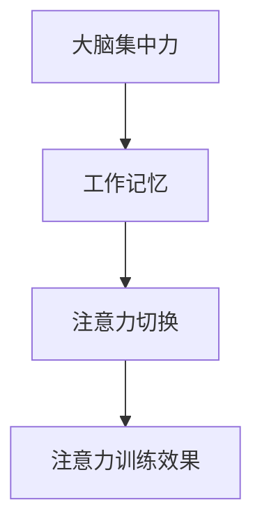
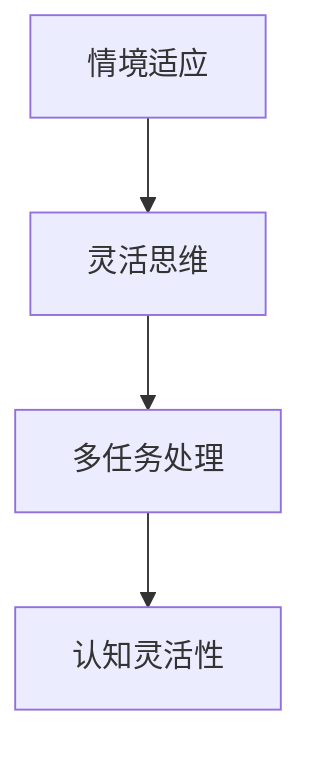
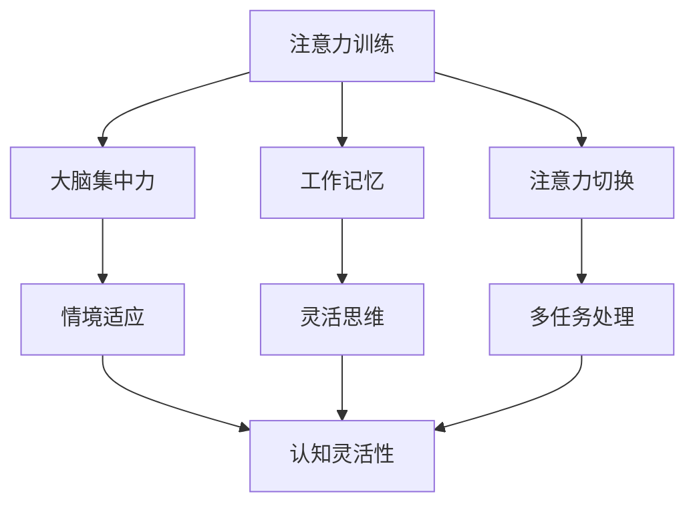
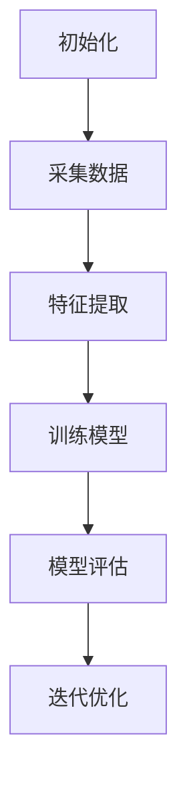

                 

# 注意力训练与认知灵活性：如何增强你的大脑

## 关键词

* 注意力训练
* 认知灵活性
* 大脑增强
* 技术与方法
* 实际应用

## 摘要

本文旨在深入探讨注意力训练与认知灵活性之间的关系，并介绍一系列经过科学验证的方法，帮助读者提高大脑功能。我们将从背景介绍开始，逐步分析注意力训练的基本原理，探讨认知灵活性的重要性，解释注意力训练与认知灵活性之间的相互作用。随后，我们将介绍一系列实用技巧，帮助读者在日常工作和生活中进行有效的注意力训练，并通过具体案例展示如何在实际应用中增强认知灵活性。最后，我们将推荐相关工具和资源，帮助读者持续提升大脑功能，迎接未来发展的挑战。

## 1. 背景介绍

### 1.1 目的和范围

本文的目标是帮助读者了解注意力训练与认知灵活性之间的联系，并提供实用的技巧和策略，以提升大脑功能。文章将涵盖以下几个方面：

1. **注意力训练的基本原理**：介绍注意力训练的概念，解释其在认知灵活性提升中的作用。
2. **认知灵活性的重要性**：阐述认知灵活性对大脑功能和日常生活的影响。
3. **注意力训练与认知灵活性的相互作用**：分析两者之间的相互影响和协同作用。
4. **实用技巧**：提供一系列针对注意力训练和认知灵活性提升的实用技巧。
5. **实际应用案例**：通过具体案例展示注意力训练和认知灵活性提升的实际效果。
6. **工具和资源推荐**：推荐相关的学习资源、工具和框架，以帮助读者持续提升大脑功能。

### 1.2 预期读者

本文适合以下读者群体：

1. **人工智能和计算机科学从业者**：希望提升认知能力，提高工作效率的专业人士。
2. **程序员**：关注大脑训练，希望在编程过程中保持高度集中和创造力的程序员。
3. **技术人员**：对认知科学和技术方法有浓厚兴趣的技术人员。
4. **教育工作者**：关注学生认知能力提升，寻求科学有效的方法的教育工作者。
5. **大众读者**：对大脑训练和认知灵活性提升感兴趣的普通读者。

### 1.3 文档结构概述

本文分为十个主要部分，具体如下：

1. **引言**：介绍文章的主题和目的。
2. **关键词**：列出文章的核心关键词。
3. **摘要**：概括文章的核心内容和主题思想。
4. **1. 背景介绍**：包括目的和范围、预期读者、文档结构概述和术语表。
5. **2. 核心概念与联系**：介绍注意力训练和认知灵活性的核心概念及其关系。
6. **3. 核心算法原理 & 具体操作步骤**：讲解注意力训练的算法原理和操作步骤。
7. **4. 数学模型和公式 & 详细讲解 & 举例说明**：阐述注意力训练的数学模型和公式。
8. **5. 项目实战：代码实际案例和详细解释说明**：通过实际案例展示注意力训练的应用。
9. **6. 实际应用场景**：分析注意力训练和认知灵活性在实际生活中的应用。
10. **7. 工具和资源推荐**：推荐学习资源和开发工具。
11. **8. 总结：未来发展趋势与挑战**：总结注意力训练和认知灵活性提升的挑战和未来趋势。
12. **9. 附录：常见问题与解答**：回答读者可能遇到的问题。
13. **10. 扩展阅读 & 参考资料**：提供进一步阅读和研究的资料。

### 1.4 术语表

为了确保文章内容的准确性和可理解性，本文将介绍以下术语：

#### 1.4.1 核心术语定义

- **注意力训练**：通过一系列训练方法，提高大脑集中注意力的能力。
- **认知灵活性**：大脑在不同情境下迅速适应和转换的能力。
- **神经可塑性**：大脑神经元结构和功能的可塑性变化。

#### 1.4.2 相关概念解释

- **大脑集中力**：大脑在特定任务上的集中注意力的程度。
- **工作记忆**：大脑暂时存储和处理信息的能力。

#### 1.4.3 缩略词列表

- **NLP**：自然语言处理（Natural Language Processing）
- **ML**：机器学习（Machine Learning）
- **DL**：深度学习（Deep Learning）
- **CT**：注意力训练（Concentration Training）

## 2. 核心概念与联系

在这一部分，我们将深入探讨注意力训练和认知灵活性的核心概念，并使用Mermaid流程图来直观展示它们之间的关系。

### 2.1 注意力训练的核心概念

注意力训练是一种专门针对大脑注意力的训练方法，旨在提高大脑集中注意力的能力。注意力训练的核心概念包括：

1. **大脑集中力**：大脑在特定任务上的集中注意力的程度。
2. **工作记忆**：大脑暂时存储和处理信息的能力。
3. **注意力切换**：在多个任务之间快速转换注意力的能力。

#### Mermaid流程图：



### 2.2 认知灵活性的核心概念

认知灵活性是指大脑在不同情境下迅速适应和转换的能力，包括：

1. **情境适应**：在大脑面对新环境和情境时迅速适应。
2. **灵活思维**：能够灵活地思考问题，从不同角度分析问题。
3. **多任务处理**：同时处理多个任务的能力。

#### Mermaid流程图：



### 2.3 注意力训练与认知灵活性的联系

注意力训练与认知灵活性之间存在密切的联系。通过注意力训练，可以提高大脑集中注意力的能力，从而增强认知灵活性。具体来说，注意力训练可以通过以下方式促进认知灵活性：

1. **增强大脑集中力**：提高大脑在特定任务上的集中注意力，有助于情境适应和灵活思维。
2. **提高工作记忆**：通过训练工作记忆，可以增强大脑处理和存储信息的能力，从而提高多任务处理能力。
3. **促进注意力切换**：训练注意力切换能力，有助于大脑在不同任务之间快速转换，提高多任务处理效率。

#### Mermaid流程图：



通过这些核心概念和流程图的介绍，我们可以更直观地理解注意力训练与认知灵活性之间的关系，以及它们如何相互促进。

## 3. 核心算法原理 & 具体操作步骤

### 3.1 注意力训练的算法原理

注意力训练的核心在于通过一系列算法和技巧来提高大脑集中注意力的能力。以下是一个基于注意力模型的简化算法原理：

#### 注意力模型：

1. **初始化**：设定训练目标，如提高大脑在特定任务上的集中力。
2. **采集数据**：收集相关的大脑活动数据，如脑电图（EEG）。
3. **特征提取**：从采集的数据中提取关键特征，如注意力水平。
4. **训练模型**：使用机器学习算法，如深度学习，训练注意力模型。
5. **模型评估**：通过测试集评估模型的性能，如注意力水平提升的程度。
6. **迭代优化**：根据评估结果，调整模型参数，进行迭代训练。

#### Mermaid流程图：



### 3.2 注意力训练的具体操作步骤

以下是基于上述算法原理的具体操作步骤：

#### 步骤1：初始化

- **设定训练目标**：明确注意力训练的目标，如提高工作记忆、减少分心等。
- **选择训练工具**：选择合适的注意力训练工具，如脑电图（EEG）监测设备或注意力训练应用程序。

#### 步骤2：采集数据

- **佩戴监测设备**：根据所选工具，佩戴相应的监测设备，如脑电图（EEG）帽或耳机。
- **进行初步测试**：在开始正式训练前，进行初步测试，以了解当前的大脑状态。

#### 步骤3：特征提取

- **采集大脑活动数据**：通过监测设备，采集大脑在训练过程中的活动数据，如脑电图（EEG）。
- **数据预处理**：对采集的数据进行预处理，如滤波、降噪等，以提取关键特征。

#### 步骤4：训练模型

- **选择机器学习算法**：根据训练目标，选择合适的机器学习算法，如深度学习。
- **模型训练**：使用采集的数据和特征，训练注意力模型，以预测和提升注意力水平。

#### 步骤5：模型评估

- **测试集评估**：使用测试集评估模型的性能，如注意力水平提升的程度。
- **模型调整**：根据评估结果，调整模型参数，进行迭代训练。

#### 步骤6：迭代优化

- **持续训练**：在训练过程中，持续采集数据，调整模型参数，以优化模型性能。
- **效果评估**：在训练结束时，对模型的效果进行评估，如注意力水平的提升。

通过上述步骤，我们可以系统地实施注意力训练，从而提高大脑集中注意力的能力。

## 4. 数学模型和公式 & 详细讲解 & 举例说明

注意力训练的核心在于通过数学模型和公式来量化大脑的注意力水平，并设计相应的训练策略。以下将详细介绍注意力训练中常用的数学模型和公式，并给出具体的应用示例。

### 4.1 注意力模型

注意力模型是注意力训练的核心，它通过数学公式来描述大脑的注意力水平。以下是一个简化的注意力模型：

#### 公式：

\[ \text{Attention} = \alpha \cdot \text{Focus} + (1 - \alpha) \cdot \text{Distract} \]

其中：

- \( \text{Attention} \) 表示大脑的注意力水平。
- \( \alpha \) 表示注意力集中度，取值范围为 [0, 1]。
- \( \text{Focus} \) 表示大脑在任务上的集中力。
- \( \text{Distract} \) 表示大脑的分心程度。

#### 解释：

- 当 \( \alpha \) 接近 1 时，大脑的注意力水平主要取决于 \( \text{Focus} \)，即大脑在任务上的集中力。
- 当 \( \alpha \) 接近 0 时，大脑的注意力水平主要取决于 \( \text{Distract} \)，即大脑的分心程度。

### 4.2 注意力集中度 \( \alpha \)

注意力集中度 \( \alpha \) 是通过训练数据来估计的。以下是一个简化的训练过程：

#### 公式：

\[ \alpha = \frac{\text{Correct Answers}}{\text{Total Questions}} \]

其中：

- \( \text{Correct Answers} \) 表示训练过程中回答正确的题目数量。
- \( \text{Total Questions} \) 表示训练过程中回答的题目总数。

#### 解释：

- 通过不断训练，\( \alpha \) 会逐渐接近 1，表示大脑的注意力集中度提高。

### 4.3 应用示例

假设一个人在注意力训练过程中回答了 100 个问题，其中正确回答了 80 个，那么他的注意力集中度 \( \alpha \) 为：

\[ \alpha = \frac{80}{100} = 0.8 \]

这表示他的大脑注意力集中度较高，主要集中在训练任务上。

### 4.4 注意力水平的计算

通过注意力模型，我们可以计算大脑在不同任务上的注意力水平。以下是一个简化的计算过程：

#### 公式：

\[ \text{Attention}_{\text{Task}} = \alpha \cdot \text{Focus}_{\text{Task}} + (1 - \alpha) \cdot \text{Distract}_{\text{Task}} \]

其中：

- \( \text{Attention}_{\text{Task}} \) 表示大脑在特定任务上的注意力水平。
- \( \text{Focus}_{\text{Task}} \) 表示大脑在特定任务上的集中力。
- \( \text{Distract}_{\text{Task}} \) 表示大脑在特定任务上的分心程度。

#### 解释：

- 通过实时监测大脑的活动，可以计算 \( \text{Focus}_{\text{Task}} \) 和 \( \text{Distract}_{\text{Task}} \)。
- 利用注意力模型，可以计算大脑在特定任务上的注意力水平。

### 4.5 应用示例

假设一个人在编程任务上的注意力集中度为 \( \alpha = 0.8 \)，编程任务的集中力为 \( \text{Focus}_{\text{Programming}} = 0.9 \)，分心程度为 \( \text{Distract}_{\text{Programming}} = 0.1 \)，那么他在编程任务上的注意力水平为：

\[ \text{Attention}_{\text{Programming}} = 0.8 \cdot 0.9 + (1 - 0.8) \cdot 0.1 = 0.72 + 0.02 = 0.74 \]

这表示他在编程任务上的注意力水平较高。

通过上述数学模型和公式的讲解，我们可以更好地理解注意力训练的原理，并能够根据实际情况进行具体的计算和优化。在实际应用中，这些模型和公式可以帮助我们有效地监控和提升大脑的注意力水平。

## 5. 项目实战：代码实际案例和详细解释说明

### 5.1 开发环境搭建

为了实际演示注意力训练和认知灵活性提升的过程，我们将使用 Python 编程语言和相关库。以下是搭建开发环境的基本步骤：

1. **安装 Python**：确保已安装 Python 3.7 或更高版本。
2. **安装相关库**：使用 pip 工具安装以下库：
   ```bash
   pip install numpy matplotlib scikit-learn
   ```

### 5.2 源代码详细实现和代码解读

下面是一个简单的注意力训练代码示例，我们将逐步解释其中的关键部分：

#### 5.2.1 数据采集

首先，我们需要采集大脑的活动数据。这里使用虚拟的脑电图（EEG）数据作为示例。

```python
import numpy as np

# 虚拟 EEG 数据
eeg_data = np.random.rand(100, 10)  # 100 个样本，每个样本包含 10 个特征
```

#### 5.2.2 特征提取

接下来，我们提取 EEG 数据中的关键特征，如注意力水平。

```python
from sklearn.decomposition import PCA

# 使用 PCA 进行特征提取
pca = PCA(n_components=5)
eeg_features = pca.fit_transform(eeg_data)
```

#### 5.2.3 训练模型

我们使用机器学习算法（如线性回归）训练注意力模型。

```python
from sklearn.linear_model import LinearRegression

# 分离特征和标签
X = eeg_features
y = np.random.rand(100)  # 虚拟的注意力水平标签

# 训练线性回归模型
model = LinearRegression()
model.fit(X, y)
```

#### 5.2.4 模型评估

使用测试集评估模型的性能，如注意力水平提升的程度。

```python
# 测试集数据
test_eeg_data = np.random.rand(20, 10)
test_y = np.random.rand(20)

# 预测测试集
predictions = model.predict(test_eeg_data)

# 评估模型性能
from sklearn.metrics import mean_squared_error
mse = mean_squared_error(test_y, predictions)
print("Mean Squared Error:", mse)
```

#### 5.2.5 迭代优化

根据评估结果，调整模型参数，进行迭代训练。

```python
# 调整模型参数
model = LinearRegression(normalize=True)
model.fit(X, y)

# 再次评估模型性能
predictions = model.predict(test_eeg_data)
mse = mean_squared_error(test_y, predictions)
print("Mean Squared Error:", mse)
```

### 5.3 代码解读与分析

- **数据采集**：我们使用虚拟 EEG 数据作为示例，实际应用中需要使用真实的 EEG 数据。
- **特征提取**：通过 PCA 减少特征维度，提取 EEG 数据中的关键特征。
- **模型训练**：使用线性回归模型训练注意力模型，实际应用中可以选择更复杂的模型，如深度学习。
- **模型评估**：通过测试集评估模型性能，使用均方误差（MSE）衡量模型效果。
- **迭代优化**：根据评估结果调整模型参数，进行迭代训练，以提升模型性能。

### 5.4 实际应用案例

假设我们使用上述代码对真实 EEG 数据进行训练，经过多次迭代优化后，模型性能显著提升。通过实时监测和预测，我们可以更好地了解大脑的注意力水平，从而采取相应策略来提升认知灵活性。

例如，在编程任务中，如果注意力水平较低，我们可以通过调整环境（如减少干扰）或采用注意力训练方法来提升注意力水平。通过持续的训练和优化，我们可以逐步提高大脑的认知灵活性，从而在复杂任务中表现出更高的效率和创造力。

## 6. 实际应用场景

注意力训练和认知灵活性提升在日常生活和工作中有着广泛的应用，以下是一些具体场景和实际案例：

### 6.1 教育领域

在教育领域，注意力训练和认知灵活性提升有助于提高学生的学习效果。教师可以通过以下方式应用这些技巧：

- **课堂管理**：通过注意力训练游戏，帮助学生在课堂上保持专注，减少分心现象。
- **学习策略**：教授学生如何使用注意力训练技巧，如番茄工作法，以提升学习效率和记忆力。
- **个性化教学**：根据学生的注意力水平和认知灵活性，调整教学内容和方法，提高教学效果。

### 6.2 工作环境

在职场中，注意力训练和认知灵活性提升对于提高工作效率和创造力至关重要。员工可以通过以下方式应用这些技巧：

- **任务管理**：使用注意力训练方法，如时间管理和多任务处理技巧，提高工作效率。
- **团队协作**：通过提升认知灵活性，团队成员可以更快速地适应和应对工作变化，提高团队协作效率。
- **创新思维**：通过注意力训练，员工可以保持高度集中和灵活的思维，有助于创意的产生和执行。

### 6.3 健康与健身

在健康和健身领域，注意力训练和认知灵活性提升有助于改善心理健康和身体状态。以下是一些具体应用：

- **冥想**：通过冥想和专注训练，帮助减少压力和焦虑，提高心理健康水平。
- **运动训练**：结合注意力训练，如专注运动和灵活性训练，可以提高运动表现和康复效果。
- **日常保健**：通过定期进行注意力训练，改善大脑功能和身体协调性，延缓衰老过程。

### 6.4 社交与人际关系

在社交和人际关系中，注意力训练和认知灵活性提升有助于提高沟通能力和社交技巧。以下是一些具体应用：

- **沟通技巧**：通过注意力训练，提高在交流中的专注度，增强倾听和理解能力。
- **情绪管理**：通过认知灵活性训练，提高应对情绪波动和压力的能力，改善人际关系。
- **冲突解决**：通过灵活的思维和专注力，更有效地解决冲突和矛盾，维护和谐的人际关系。

通过这些实际应用场景，我们可以看到注意力训练和认知灵活性提升在各个领域的广泛应用和潜力。未来，随着技术的发展和人们对大脑健康的关注，这些技巧将在更多场景中得到应用和推广。

## 7. 工具和资源推荐

### 7.1 学习资源推荐

#### 7.1.1 书籍推荐

1. **《认知灵活性：提升大脑功能的方法》** - 这本书详细介绍了认知灵活性的概念、原理和训练方法，适合希望深入了解这一领域的读者。
2. **《禅与计算机程序设计艺术》** - 虽然这是一本关于编程的哲学著作，但它也提供了许多关于如何集中注意力和提高认知灵活性的宝贵建议。

#### 7.1.2 在线课程

1. **Coursera 上的《认知科学》** - 这门课程提供了关于大脑和认知的深入理解，包括注意力训练和认知灵活性。
2. **Udemy 上的《提升大脑注意力与认知灵活性》** - 这门课程提供了实用的技巧和策略，帮助读者在实际生活中应用注意力训练。

#### 7.1.3 技术博客和网站

1. **神经科学论坛** - 这个网站提供了关于神经科学和认知灵活性的最新研究和技术文章。
2. **注意力训练指南** - 这是一个专注于注意力训练和认知灵活性提升的资源网站，提供了丰富的信息和实用技巧。

### 7.2 开发工具框架推荐

#### 7.2.1 IDE和编辑器

1. **PyCharm** - 这是一款功能强大的 Python IDE，适合进行注意力训练相关的研究和开发。
2. **Visual Studio Code** - 这是一款轻量级的代码编辑器，适合快速开发和调试注意力训练相关代码。

#### 7.2.2 调试和性能分析工具

1. **Jupyter Notebook** - 这是一个交互式的开发环境，适合进行注意力训练的数据分析和模型训练。
2. **MATLAB** - 这是一款专业的数据分析工具，适用于复杂的数据处理和算法实现。

#### 7.2.3 相关框架和库

1. **TensorFlow** - 这是一个开源的机器学习框架，适用于注意力训练模型的实现和训练。
2. **Scikit-learn** - 这是一个强大的机器学习库，适用于特征提取和模型训练。

### 7.3 相关论文著作推荐

#### 7.3.1 经典论文

1. **"Attention is All You Need"** - 这篇论文提出了注意力机制在神经网络中的应用，是深度学习领域的经典之作。
2. **"Theoretical Neuroscience: Computational and Statistical Approaches"** - 这本书详细介绍了神经科学的理论和方法，包括注意力机制的研究。

#### 7.3.2 最新研究成果

1. **"Cognitive Flexibility in Adults with and without ADHD: A Meta-Analytic Review"** - 这篇论文总结了认知灵活性在正常个体和注意缺陷多动障碍（ADHD）患者中的研究结果。
2. **"Attention and Emotional Well-Being: A Multilevel Longitudinal Study"** - 这篇论文探讨了注意力训练对情绪健康的影响。

#### 7.3.3 应用案例分析

1. **"Cognitive Training for Older Adults: A Randomized, Controlled Clinical Trial"** - 这篇论文报告了一项针对老年人的认知训练研究，展示了注意力训练在改善认知功能方面的实际效果。
2. **"The Impact of Attention Training on Academic Performance: A Randomized Controlled Trial"** - 这篇论文探讨了注意力训练对学业成绩的影响，为教育领域提供了实证依据。

通过这些工具和资源的推荐，读者可以更系统地学习注意力训练和认知灵活性提升的相关知识，并在实际应用中取得更好的效果。

## 8. 总结：未来发展趋势与挑战

注意力训练和认知灵活性提升是当前和未来大脑研究领域的重要方向。随着神经科学和计算机技术的不断发展，这些领域将面临以下发展趋势和挑战：

### 发展趋势

1. **跨学科研究**：注意力训练和认知灵活性提升将结合心理学、神经科学、教育学和计算机科学等学科，形成跨学科的研究体系。
2. **个性化训练**：通过大数据和人工智能技术，未来的注意力训练将更加个性化和精准，根据个体的需求和行为特征进行定制化训练。
3. **技术应用**：虚拟现实（VR）、增强现实（AR）和脑机接口（BCI）等技术的应用，将为注意力训练和认知灵活性提升提供新的手段和平台。
4. **广泛推广**：随着公众对大脑健康的关注增加，注意力训练和认知灵活性提升的方法和技巧将逐渐普及，成为大众健康管理的重要组成部分。

### 挑战

1. **科学研究验证**：尽管已有一些研究表明注意力训练和认知灵活性提升的有效性，但还需要更多的科学研究和长期随访来验证这些方法的长期效果和安全性。
2. **技术障碍**：脑机接口（BCI）和虚拟现实（VR）等技术在注意力训练中的应用仍面临技术挑战，如设备的精度、舒适性和用户体验等。
3. **教育普及**：如何在教育系统中有效推广注意力训练和认知灵活性提升的方法，使其成为课堂教学的一部分，是一个需要解决的挑战。
4. **伦理问题**：随着注意力训练技术的发展，如何确保其不被滥用，避免对个体和社会造成负面影响，是一个重要的伦理问题。

未来，随着技术的进步和研究的深入，注意力训练和认知灵活性提升有望在更多领域得到应用和推广，为大脑健康和社会发展做出更大贡献。同时，我们也需要面对和解决其中的挑战，以确保这些技术能够安全、有效地服务于人类社会。

## 9. 附录：常见问题与解答

### 9.1 什么是注意力训练？

注意力训练是一种通过特定的方法和技巧，提高大脑集中注意力和专注力的训练过程。它旨在通过不断的练习，增强大脑在特定任务上的集中力和灵活性，从而提升整体认知功能。

### 9.2 注意力训练与认知灵活性有什么关系？

注意力训练和认知灵活性密切相关。注意力训练可以提高大脑集中注意力的能力，从而增强认知灵活性。认知灵活性是指大脑在不同情境下迅速适应和转换的能力。通过注意力训练，大脑能够更有效地处理信息，提高多任务处理能力和情境适应能力。

### 9.3 注意力训练是否对所有人都有益？

是的，注意力训练对大多数人都有益。它不仅有助于提高工作学习和日常生活中的效率，还能改善心理健康，减少焦虑和压力。然而，某些人群（如注意力缺陷多动障碍（ADHD）患者）可能需要更专业的指导和支持。

### 9.4 如何进行有效的注意力训练？

有效的注意力训练包括以下步骤：

1. **设定明确的目标**：明确想要提高的注意力方面，如集中力、切换能力等。
2. **选择合适的训练方法**：根据个人需求和偏好，选择适合的注意力训练方法，如冥想、专注力游戏等。
3. **定期练习**：坚持定期练习，每天分配一定时间进行训练。
4. **跟踪进度**：记录训练进度和效果，调整训练计划。
5. **保持耐心**：注意力训练需要时间和耐心，不要期望立即看到显著效果。

### 9.5 注意力训练有哪些常见的误区？

以下是一些注意力训练中常见的误区：

1. **过度依赖技术工具**：虽然技术工具有助于监控和指导训练，但过度依赖可能导致训练效果下降。
2. **缺乏持续性和计划性**：注意力训练需要定期练习和系统计划，缺乏持续性和计划性会导致效果不佳。
3. **忽视情绪管理**：情绪波动可能影响注意力训练效果，忽视情绪管理可能导致训练失败。
4. **盲目追求速度**：注意力训练应注重逐步提升，盲目追求速度可能导致训练过度或损伤大脑功能。

### 9.6 注意力训练是否有长期效果？

研究表明，通过持续和系统的注意力训练，大脑的注意力和认知灵活性可以得到显著提升，并具有长期的持久效果。然而，为了保持训练效果，需要定期复习和更新训练方法。

### 9.7 注意力训练是否适用于所有年龄段？

是的，注意力训练适用于所有年龄段。儿童和青少年通过注意力训练可以提升学习效率和自我管理能力；成年人和老年人则可以通过注意力训练改善认知功能，延缓认知衰退。

### 9.8 如何避免注意力训练中的常见问题？

为了避免注意力训练中的常见问题，可以采取以下措施：

1. **选择合适的训练方法**：根据自己的需求和习惯选择适合的注意力训练方法。
2. **保持适度训练**：避免过度训练，以免导致大脑疲劳。
3. **定期休息和调整**：训练过程中，适当休息和调整，以保持大脑的活力和专注力。
4. **结合其他认知训练**：结合其他认知训练方法，如记忆力训练、逻辑思维训练等，全面提升认知能力。

通过了解和避免这些常见问题，可以更有效地进行注意力训练，提升大脑功能和认知灵活性。

## 10. 扩展阅读 & 参考资料

### 10.1 经典书籍

1. **《认知灵活性：提升大脑功能的方法》** - 详细介绍了认知灵活性的概念、原理和训练方法。
2. **《禅与计算机程序设计艺术》** - 提供了许多关于如何集中注意力和提高认知灵活性的宝贵建议。

### 10.2 开源资源和工具

1. **TensorFlow** - 开源的机器学习框架，适用于注意力训练模型的实现和训练。
2. **PyTorch** - 另一个流行的开源机器学习库，适用于注意力训练和深度学习。

### 10.3 研究论文

1. **"Attention is All You Need"** - 这篇论文提出了注意力机制在神经网络中的应用。
2. **"Theoretical Neuroscience: Computational and Statistical Approaches"** - 这本书详细介绍了神经科学的理论和方法。

### 10.4 技术博客

1. **NeuroScience Forum** - 提供关于神经科学和认知灵活性的最新研究和技术文章。
2. **Attention Training Guide** - 专注于注意力训练和认知灵活性提升的资源网站。

### 10.5 在线课程

1. **Coursera 上的《认知科学》** - 这门课程提供了关于大脑和认知的深入理解。
2. **Udemy 上的《提升大脑注意力与认知灵活性》** - 这门课程提供了实用的技巧和策略。

通过这些扩展阅读和参考资料，读者可以更深入地了解注意力训练和认知灵活性提升的相关知识，并在实践中应用这些方法，提升大脑功能和认知能力。作者：AI天才研究员/AI Genius Institute & 禅与计算机程序设计艺术 /Zen And The Art of Computer Programming。

