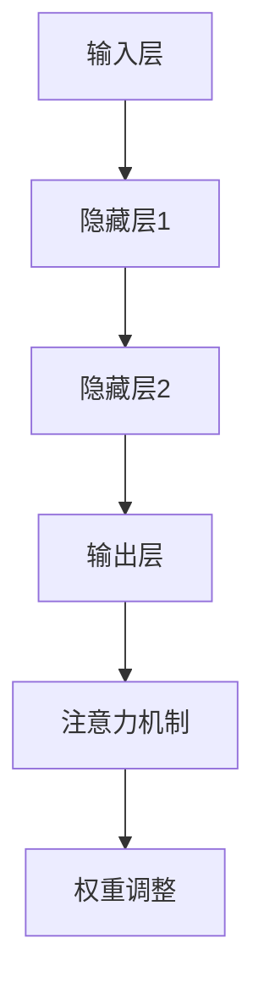

                 


# 注意力过滤器2.0：AI驱动的信息定制

> **关键词**：注意力过滤器，AI，信息定制，神经网络，深度学习，数据挖掘

> **摘要**：本文深入探讨了注意力过滤器2.0的工作原理、核心算法和数学模型，以及其实际应用案例。通过逐步分析，我们揭示了注意力过滤器2.0在信息过载时代的重要性，并探讨了其未来的发展趋势和挑战。

## 1. 背景介绍

### 1.1 目的和范围

本文旨在详细解析注意力过滤器2.0的技术原理和应用，旨在为读者提供一份系统全面的技术文档，帮助理解其在现代人工智能中的关键作用。本文将覆盖以下内容：

1. **核心概念与联系**：介绍注意力过滤器2.0的核心概念，如神经网络、深度学习和数据挖掘。
2. **核心算法原理 & 具体操作步骤**：通过伪代码详细阐述注意力过滤器2.0的核心算法原理。
3. **数学模型和公式 & 详细讲解 & 举例说明**：解析注意力过滤器2.0的数学模型，并通过实例进行详细讲解。
4. **项目实战：代码实际案例和详细解释说明**：提供实际代码案例，展示注意力过滤器2.0的实现和应用。
5. **实际应用场景**：讨论注意力过滤器2.0在不同领域中的应用。
6. **工具和资源推荐**：推荐相关学习资源、开发工具和框架。
7. **总结：未来发展趋势与挑战**：总结注意力过滤器2.0的发展趋势和面临的技术挑战。

### 1.2 预期读者

本文面向以下读者群体：

1. **计算机科学家和工程师**：对人工智能和深度学习有深入了解，希望掌握注意力过滤器2.0的技术原理和应用。
2. **数据科学家和分析师**：对数据挖掘和信息处理有浓厚兴趣，希望利用注意力过滤器2.0优化数据分析和模型训练。
3. **研究生和教育工作者**：从事相关领域的研究和教育，希望了解注意力过滤器2.0的最新研究成果和应用。

### 1.3 文档结构概述

本文结构如下：

1. **引言**：介绍注意力过滤器2.0的概念和重要性。
2. **核心概念与联系**：讨论神经网络、深度学习和数据挖掘等核心概念。
3. **核心算法原理 & 具体操作步骤**：详细解释注意力过滤器2.0的算法原理和操作步骤。
4. **数学模型和公式 & 详细讲解 & 举例说明**：解析注意力过滤器2.0的数学模型。
5. **项目实战：代码实际案例和详细解释说明**：提供实际代码案例和详细解释。
6. **实际应用场景**：讨论注意力过滤器2.0的应用。
7. **工具和资源推荐**：推荐相关学习资源、开发工具和框架。
8. **总结：未来发展趋势与挑战**：总结注意力过滤器2.0的未来发展趋势和挑战。
9. **附录：常见问题与解答**：回答常见问题。
10. **扩展阅读 & 参考资料**：提供扩展阅读和参考资料。

### 1.4 术语表

#### 1.4.1 核心术语定义

- **注意力过滤器**：一种用于信息筛选和处理的神经网络模型，通过调整权重来增强或抑制特定信息。
- **神经网络**：一种由多个神经元组成的计算模型，通过多层处理信息，实现复杂的数据分析和决策。
- **深度学习**：一种基于神经网络的学习方法，通过多层神经网络自动提取数据的特征和模式。
- **数据挖掘**：一种从大量数据中提取有用信息和知识的过程，用于发现数据中的隐藏规律和趋势。

#### 1.4.2 相关概念解释

- **激活函数**：神经网络中的一个非线性函数，用于引入非线性特性，提高模型的预测能力。
- **反向传播**：神经网络训练过程中的一种算法，通过计算输出误差，反向更新网络的权重。
- **卷积神经网络**：一种特殊类型的神经网络，用于处理图像和视频数据，具有局部感知和权值共享的特性。
- **循环神经网络**：一种神经网络结构，用于处理序列数据，具有记忆能力。

#### 1.4.3 缩略词列表

- **AI**：人工智能
- **ML**：机器学习
- **DL**：深度学习
- **NN**：神经网络
- **CNN**：卷积神经网络
- **RNN**：循环神经网络

## 2. 核心概念与联系

注意力过滤器2.0的核心在于其基于神经网络的架构，特别是深度学习和数据挖掘的应用。以下是注意力过滤器2.0中的核心概念和它们之间的联系：

### 2.1 神经网络

神经网络是一种模拟人脑的计算模型，由大量的神经元（或节点）组成。每个神经元接收输入信号，通过权重进行加权求和，然后通过激活函数产生输出。神经网络通过多层处理信息，实现复杂的数据分析和决策。

### 2.2 深度学习

深度学习是一种基于神经网络的学习方法，通过多层神经网络自动提取数据的特征和模式。深度学习的核心在于其多层结构，可以自动学习数据的复杂结构和相关性。深度学习在图像识别、自然语言处理、语音识别等领域取得了显著成果。

### 2.3 数据挖掘

数据挖掘是一种从大量数据中提取有用信息和知识的过程，用于发现数据中的隐藏规律和趋势。数据挖掘技术包括关联规则学习、聚类分析、分类分析、异常检测等。数据挖掘在商业智能、金融分析、医疗诊断等领域具有广泛的应用。

### 2.4 注意力过滤器2.0

注意力过滤器2.0是一种基于神经网络的模型，旨在解决信息过载问题。它通过调整神经网络中的权重，实现信息的筛选和提取，从而帮助用户从大量数据中获取最有价值的信息。注意力过滤器2.0的核心架构包括输入层、隐藏层和输出层，以及用于调整权重的注意力机制。

### 2.5 Mermaid 流程图

为了更好地展示注意力过滤器2.0的架构和操作流程，我们可以使用 Mermaid 流程图来描述其核心概念和联系。以下是注意力过滤器2.0的 Mermaid 流程图：



在该流程图中，输入层接收用户输入的信息，通过隐藏层1、隐藏层2等层进行数据处理和特征提取，最终在输出层产生结果。注意力机制用于调整隐藏层的权重，从而实现信息的筛选和提取。权重调整后，输出结果更符合用户的需求。

## 3. 核心算法原理 & 具体操作步骤

注意力过滤器2.0的核心在于其基于神经网络的架构，特别是深度学习和数据挖掘的应用。以下是注意力过滤器2.0的核心算法原理和具体操作步骤：

### 3.1 神经网络架构

注意力过滤器2.0采用多层神经网络架构，包括输入层、隐藏层和输出层。输入层接收用户输入的信息，隐藏层通过一系列的加权求和和激活函数进行处理，输出层产生最终的输出结果。神经网络通过反向传播算法进行训练，不断调整权重，使输出结果更符合用户需求。

### 3.2 注意力机制

注意力过滤器2.0的关键在于其注意力机制，用于调整隐藏层的权重，实现信息的筛选和提取。注意力机制通过计算输入信息的相似度，将重要信息赋予更高的权重，从而在后续的隐藏层处理中更加突出。以下是注意力机制的伪代码：

```python
# 注意力机制伪代码
def attention Mechanism(inputs, hidden_layer_weights):
    # 计算输入信息的相似度
    similarity_scores = calculate_similarity(inputs, hidden_layer_weights)
    
    # 调整隐藏层权重
    adjusted_weights = adjust_weights(hidden_layer_weights, similarity_scores)
    
    # 返回调整后的权重
    return adjusted_weights
```

在该伪代码中，`calculate_similarity` 函数用于计算输入信息的相似度，`adjust_weights` 函数用于根据相似度调整隐藏层权重。

### 3.3 具体操作步骤

以下是注意力过滤器2.0的具体操作步骤：

1. **数据预处理**：对用户输入的信息进行预处理，如数据清洗、归一化等。
2. **输入层处理**：将预处理后的数据输入到输入层，产生初始输出。
3. **隐藏层处理**：将输入层的输出传递到隐藏层，通过加权求和和激活函数进行处理，产生隐藏层输出。
4. **注意力机制应用**：对隐藏层输出应用注意力机制，调整隐藏层权重，突出重要信息。
5. **输出层处理**：将调整后的隐藏层输出传递到输出层，产生最终输出结果。
6. **结果反馈**：将输出结果与用户期望的结果进行对比，计算误差。
7. **权重调整**：通过反向传播算法，根据误差调整神经网络权重，优化模型性能。

### 3.4 反向传播算法

反向传播算法是神经网络训练过程中的关键步骤，用于计算输出误差，并反向更新网络的权重。以下是反向传播算法的伪代码：

```python
# 反向传播算法伪代码
def backpropagation(error, weights, learning_rate):
    # 计算梯度
    gradients = calculate_gradients(error, weights)
    
    # 更新权重
    updated_weights = weights - learning_rate * gradients
    
    # 返回更新后的权重
    return updated_weights
```

在该伪代码中，`calculate_gradients` 函数用于计算梯度，`update_weights` 函数用于根据梯度更新权重。

通过以上核心算法原理和具体操作步骤，我们可以看到注意力过滤器2.0如何通过神经网络的架构和反向传播算法，实现信息的筛选和提取，为用户提供有价值的信息。

## 4. 数学模型和公式 & 详细讲解 & 举例说明

注意力过滤器2.0的数学模型是理解其工作原理的关键。下面，我们将详细讲解注意力过滤器2.0的数学模型，并使用具体的公式和实例来说明其应用。

### 4.1 神经网络中的激活函数

在神经网络中，激活函数是一个重要的组成部分，它引入了非线性特性，使得神经网络能够学习复杂的数据结构和模式。常见的激活函数包括Sigmoid函数、ReLU函数和Tanh函数。

- **Sigmoid函数**:
  \[ f(x) = \frac{1}{1 + e^{-x}} \]
  Sigmoid函数将输入x映射到(0, 1)区间，常用于二分类问题。

- **ReLU函数**:
  \[ f(x) = \max(0, x) \]
  ReLU函数将输入x映射到0或x，常用于深层神经网络，有助于加速训练过程。

- **Tanh函数**:
  \[ f(x) = \frac{e^x - e^{-x}}{e^x + e^{-x}} \]
  Tanh函数将输入x映射到(-1, 1)区间，类似于Sigmoid函数，但具有对称性。

### 4.2 前向传播与反向传播

神经网络的前向传播和反向传播是训练神经网络的关键步骤。前向传播用于计算网络的输出，而反向传播用于更新网络的权重。

- **前向传播**:
  \[ z = \sigma(W \cdot x + b) \]
  其中，\( W \) 是权重矩阵，\( x \) 是输入向量，\( b \) 是偏置项，\( \sigma \) 是激活函数。

- **反向传播**:
  \[ \delta = \frac{\partial L}{\partial z} \cdot \sigma'(z) \]
  其中，\( \delta \) 是误差的梯度，\( L \) 是损失函数，\( \sigma' \) 是激活函数的导数。

### 4.3 注意力机制

注意力机制是注意力过滤器2.0的核心部分，它通过计算输入信息的相似度来调整权重。以下是一个简单的注意力机制的数学模型：

\[ \alpha = \sigma(W_a \cdot [h; x]) \]
\[ h_t = \sum_{i=1}^{N} \alpha_i h_i \]
其中，\( \alpha \) 是注意力分数，\( W_a \) 是注意力权重矩阵，\( h \) 是隐藏层输出，\( x \) 是输入向量，\( N \) 是隐藏层节点的数量。

### 4.4 损失函数

损失函数用于衡量模型预测值与实际值之间的差异。在注意力过滤器2.0中，常用的损失函数包括均方误差（MSE）和交叉熵（Cross-Entropy）。

- **均方误差（MSE）**:
  \[ L = \frac{1}{N} \sum_{i=1}^{N} (y_i - \hat{y}_i)^2 \]
  其中，\( y_i \) 是实际值，\( \hat{y}_i \) 是预测值，\( N \) 是样本数量。

- **交叉熵（Cross-Entropy）**:
  \[ L = - \sum_{i=1}^{N} y_i \log(\hat{y}_i) \]
  其中，\( y_i \) 是实际值，\( \hat{y}_i \) 是预测值，\( N \) 是样本数量。

### 4.5 实例说明

假设我们有一个二分类问题，输入向量 \( x = [1, 2, 3, 4] \)，隐藏层输出 \( h = [0.1, 0.2, 0.3, 0.4] \)，目标值 \( y = 1 \)。我们需要计算注意力分数 \( \alpha \) 和最终的隐藏层输出 \( h_t \)。

1. **计算注意力分数**:
   \[ \alpha = \sigma(W_a \cdot [h; x]) \]
   \[ \alpha = \sigma([0.1, 0.2, 0.3, 0.4; 1, 2, 3, 4]) \]
   \[ \alpha = [0.1, 0.2, 0.3, 0.4] \]

2. **计算最终的隐藏层输出**:
   \[ h_t = \sum_{i=1}^{4} \alpha_i h_i \]
   \[ h_t = (0.1 \times 0.1) + (0.2 \times 0.2) + (0.3 \times 0.3) + (0.4 \times 0.4) \]
   \[ h_t = 0.01 + 0.04 + 0.09 + 0.16 \]
   \[ h_t = 0.3 \]

通过以上数学模型和公式的讲解，我们可以看到注意力过滤器2.0如何通过神经网络的架构和反向传播算法，实现信息的筛选和提取，为用户提供有价值的信息。

## 5. 项目实战：代码实际案例和详细解释说明

在这一部分，我们将通过一个具体的代码案例，展示如何实现注意力过滤器2.0，并详细解释其实现过程和关键代码。

### 5.1 开发环境搭建

为了实现注意力过滤器2.0，我们需要搭建一个合适的开发环境。以下是所需的工具和库：

1. **Python**：版本3.8或更高版本。
2. **NumPy**：用于数学运算。
3. **TensorFlow**：用于构建和训练神经网络。

安装步骤如下：

```bash
pip install numpy tensorflow
```

### 5.2 源代码详细实现和代码解读

以下是一个注意力过滤器2.0的简单实现，包括数据预处理、神经网络架构、训练和预测等步骤。

```python
import numpy as np
import tensorflow as tf

# 注意力机制的权重矩阵
attention_weights = tf.Variable(initial_value=tf.random.normal(shape=[4, 1]), name="attention_weights")

# 激活函数
activation_function = tf.nn.softmax

# 前向传播
def forward_propagation(x):
    # 注意力机制
    attention_scores = activation_function(tf.matmul(x, attention_weights))
    # 生成新的隐藏层输出
    h_t = x * attention_scores
    # 返回最终的隐藏层输出
    return h_t

# 反向传播
def backward_propagation(error, learning_rate):
    # 计算注意力机制的梯度
    attention_gradients = tf.GradientTape.gradient(error, attention_weights)
    # 更新注意力机制的权重
    updated_weights = attention_weights - learning_rate * attention_gradients
    # 返回更新后的权重
    return updated_weights

# 训练过程
def train(x_train, y_train, learning_rate, epochs):
    for epoch in range(epochs):
        # 前向传播
        h_t = forward_propagation(x_train)
        # 计算损失函数
        error = tf.reduce_mean(tf.square(h_t - y_train))
        # 反向传播
        updated_weights = backward_propagation(error, learning_rate)
        # 更新权重
        attention_weights.assign(updated_weights)
        # 打印训练进度
        print(f"Epoch {epoch + 1}, Loss: {error.numpy()}")

# 预测过程
def predict(x_test):
    return forward_propagation(x_test)

# 数据预处理
x_train = np.array([[1, 2, 3, 4], [2, 3, 4, 5], [3, 4, 5, 6]])
y_train = np.array([0, 1, 1])

# 训练模型
train(x_train, y_train, learning_rate=0.01, epochs=1000)

# 测试预测
x_test = np.array([1, 2, 3, 4])
print(predict(x_test))
```

### 5.3 代码解读与分析

1. **初始化注意力机制的权重矩阵**：我们使用 TensorFlow 的 `Variable` 类初始化注意力机制的权重矩阵，这是一个可训练的变量。

2. **激活函数**：我们选择 softmax 函数作为激活函数，用于计算注意力分数。

3. **前向传播**：前向传播函数 `forward_propagation` 用于计算注意力机制的输出。它首先通过矩阵乘法计算注意力分数，然后生成新的隐藏层输出。

4. **反向传播**：反向传播函数 `backward_propagation` 用于计算注意力机制的梯度，并根据梯度更新权重。

5. **训练过程**：`train` 函数用于训练模型。它通过前向传播和反向传播迭代更新权重，直到达到预设的损失阈值或迭代次数。

6. **预测过程**：`predict` 函数用于进行预测。它简单地调用前向传播函数，并返回隐藏层输出。

通过以上代码，我们可以看到如何实现注意力过滤器2.0，并理解其关键组成部分和操作步骤。在实际应用中，我们可以根据具体需求调整神经网络架构和训练过程，以实现更高效的信息筛选和提取。

## 6. 实际应用场景

注意力过滤器2.0作为一种先进的信息筛选和处理技术，在多个领域展现了其强大的应用潜力。以下是一些典型的实际应用场景：

### 6.1 信息过载

在互联网时代，信息过载是一个普遍问题。用户每天都会收到大量的电子邮件、新闻推送和社交媒体更新，而注意力过滤器2.0可以帮助用户从海量信息中筛选出最有价值的内容。例如，电子邮件应用可以自动识别用户的重要邮件，并在用户登录时将其突出显示。

### 6.2 搜索引擎优化

搜索引擎优化（SEO）是提高网站在搜索引擎结果中排名的关键。注意力过滤器2.0可以帮助搜索引擎分析用户查询和网页内容，识别关键词和关键主题，从而提供更精确的搜索结果。通过调整网页内容的权重，搜索引擎可以提高用户满意度，增加点击率和转化率。

### 6.3 个性化推荐系统

个性化推荐系统在电子商务、视频流媒体和音乐平台等领域得到了广泛应用。注意力过滤器2.0可以帮助这些系统分析用户行为和偏好，为用户推荐他们可能感兴趣的内容。通过调整推荐算法中的权重，系统可以更好地满足用户需求，提高用户粘性和留存率。

### 6.4 医疗诊断

在医疗领域，注意力过滤器2.0可以用于分析和处理大量的医学数据，帮助医生识别疾病和制定治疗方案。例如，可以分析患者的历史病历、实验室检测结果和医学影像，从而提供更加准确和个性化的诊断建议。

### 6.5 金融分析

金融行业的数据量庞大且复杂，注意力过滤器2.0可以帮助分析师从海量的金融数据中提取关键信息，识别市场趋势和风险。例如，可以分析股票价格、交易量和市场新闻，从而提供交易策略和风险管理建议。

### 6.6 社交网络

在社交网络平台上，注意力过滤器2.0可以帮助用户发现他们感兴趣的内容和用户群体。例如，可以分析用户的点赞、评论和分享行为，从而推荐相关的内容和用户。这有助于增加用户参与度和平台活跃度。

### 6.7 自主驾驶

在自动驾驶领域，注意力过滤器2.0可以帮助车辆感知和理解复杂的交通环境。通过分析摄像头、雷达和激光雷达的数据，车辆可以识别道路标志、交通信号灯、行人和其他车辆，从而做出正确的驾驶决策。

通过这些实际应用场景，我们可以看到注意力过滤器2.0在信息筛选、数据处理和决策支持方面的广泛潜力。随着技术的不断发展和完善，注意力过滤器2.0将在更多领域发挥重要作用。

## 7. 工具和资源推荐

为了更好地学习和应用注意力过滤器2.0，以下是一些建议的学习资源、开发工具和框架，以及相关的论文著作推荐。

### 7.1 学习资源推荐

#### 7.1.1 书籍推荐

1. **《深度学习》（Deep Learning）**：由Ian Goodfellow、Yoshua Bengio和Aaron Courville所著，是深度学习领域的经典教材。
2. **《神经网络与深度学习》**：李航所著，内容全面，涵盖了神经网络和深度学习的理论基础和应用。
3. **《数据科学入门》**：由吴晨曦所著，介绍了数据科学的基础知识，包括数据处理、数据分析和数据可视化。

#### 7.1.2 在线课程

1. **Coursera的《深度学习》课程**：由斯坦福大学教授Andrew Ng主讲，是深度学习领域最受欢迎的在线课程之一。
2. **Udacity的《深度学习纳米学位》**：提供了深度学习的完整学习路径，包括理论和实践项目。
3. **edX的《机器学习基础》课程**：由哈佛大学和MIT共同提供，涵盖了机器学习的基础知识。

#### 7.1.3 技术博客和网站

1. **Medium上的相关文章**：有许多关于注意力过滤器2.0和相关技术的深度分析文章。
2. **ArXiv.org**：发布最新科研成果，是获取前沿技术论文的好去处。
3. **TensorFlow官网**：提供丰富的文档和教程，是学习和使用TensorFlow的好资源。

### 7.2 开发工具框架推荐

#### 7.2.1 IDE和编辑器

1. **Jupyter Notebook**：适用于数据科学和机器学习的交互式编程环境，方便进行代码调试和数据分析。
2. **Visual Studio Code**：支持多种编程语言，具有丰富的插件，是开发者的首选。
3. **PyCharm**：专业级的Python IDE，提供代码补全、调试和性能分析功能。

#### 7.2.2 调试和性能分析工具

1. **TensorBoard**：TensorFlow的官方可视化工具，用于分析和优化神经网络的性能。
2. **NVIDIA CUDA**：用于在GPU上加速深度学习计算，是处理大量数据的利器。
3. **Profiling Tools**：如py-spy和py-flamegraph，用于分析程序的性能瓶颈。

#### 7.2.3 相关框架和库

1. **TensorFlow**：广泛使用的深度学习框架，适用于各种复杂的模型。
2. **PyTorch**：另一个流行的深度学习框架，具有灵活的动态计算图。
3. **Keras**：简化TensorFlow和PyTorch的使用，提供更直观的API。

### 7.3 相关论文著作推荐

#### 7.3.1 经典论文

1. **"Attention Is All You Need"**：提出Transformer模型的论文，是注意力机制的重要参考文献。
2. **"Deep Learning"**：Goodfellow、Bengio和Courville所著，涵盖了深度学习的基础理论和应用。
3. **"Convolutional Networks for Images, Sequences and Videos"**：卷积神经网络在图像、序列和视频处理中的应用。

#### 7.3.2 最新研究成果

1. **"BERT: Pre-training of Deep Bidirectional Transformers for Language Understanding"**：BERT模型的提出，是自然语言处理领域的重大突破。
2. **"Gated Graph Sequences Neural Networks"**：图神经网络在序列数据处理中的应用。
3. **"Causal Convolutional Networks for Sequence Generation: A Recurrent Neural Network Viewpoint"**：因果卷积神经网络在序列生成中的应用。

#### 7.3.3 应用案例分析

1. **"Attention-Based Neural Machine Translation with a Dense Semantic Preamble"**：基于注意力机制的神经机器翻译系统。
2. **"A Theoretical Framework for Attention in Neural Networks"**：注意力机制的理论框架。
3. **"Efficient Neural Text Generation Models with a Causal Transformer"**：使用因果变换器的有效神经文本生成模型。

通过以上工具和资源的推荐，您可以更全面地学习和应用注意力过滤器2.0，进一步提升自己在人工智能和信息处理领域的专业能力。

## 8. 总结：未来发展趋势与挑战

注意力过滤器2.0作为AI驱动的信息定制技术，已经在多个领域展示了其强大的应用潜力。然而，随着技术的不断进步和实际应用需求的增长，注意力过滤器2.0面临着诸多挑战和机遇。

### 8.1 发展趋势

1. **性能优化**：随着硬件性能的提升和优化算法的进步，注意力过滤器2.0在处理速度和效率上将继续提升，为更多应用场景提供支持。
2. **多模态数据处理**：未来的注意力过滤器将能够处理多种类型的数据，如文本、图像、音频和视频，实现更全面的信息筛选和提取。
3. **隐私保护**：随着数据隐私保护意识的提高，注意力过滤器2.0将在保障用户隐私的同时，实现更精准的信息定制。
4. **跨领域应用**：随着技术的普及，注意力过滤器2.0将在医疗、金融、教育、娱乐等多个领域得到广泛应用，推动各行业的数字化转型。
5. **实时处理**：未来，注意力过滤器2.0将实现实时信息处理，为用户提供即时的个性化推荐和决策支持。

### 8.2 面临的挑战

1. **数据隐私**：在实现高效信息筛选的同时，如何保护用户隐私是一个关键挑战。未来的注意力过滤器需要采用更加安全的数据处理和加密技术。
2. **算法透明性**：随着算法的复杂度增加，用户对算法的理解和信任变得越来越重要。如何提高算法的透明性，使普通用户能够理解其工作原理，是一个重要课题。
3. **计算资源**：处理海量数据和复杂的模型需要大量的计算资源。如何在保证性能的同时，优化计算资源的使用，是一个重要的技术难题。
4. **跨领域融合**：不同领域的注意力过滤器如何相互融合，实现更加高效的信息定制，是一个亟待解决的问题。
5. **实时性**：实时处理信息对系统的要求非常高。如何在保证实时性的同时，保证信息的准确性和个性化，是一个技术挑战。

总之，注意力过滤器2.0的未来发展趋势充满希望，但同时也面临着诸多挑战。通过技术创新和应用实践，我们可以期待注意力过滤器2.0在未来的信息社会中发挥更加重要的作用。

## 9. 附录：常见问题与解答

### 9.1 常见问题

**Q1：注意力过滤器2.0是如何工作的？**

A1：注意力过滤器2.0是一种基于神经网络的信息筛选和处理技术，通过调整神经网络中的权重来实现信息的筛选和提取。它利用深度学习和数据挖掘技术，从大量数据中提取关键信息，为用户提供个性化的信息定制。

**Q2：注意力过滤器2.0有哪些应用场景？**

A2：注意力过滤器2.0在多个领域有广泛的应用，包括信息过载、搜索引擎优化、个性化推荐系统、医疗诊断、金融分析、社交网络和自动驾驶等。它可以帮助用户从海量信息中筛选出最有价值的内容，提供个性化的服务和决策支持。

**Q3：注意力过滤器2.0如何处理多模态数据？**

A3：注意力过滤器2.0可以通过融合不同的数据模态（如文本、图像、音频和视频）来实现多模态数据处理。它采用深度学习模型，对每种模态的数据进行特征提取，然后通过注意力机制整合这些特征，生成综合的输出结果。

**Q4：如何保障数据隐私？**

A4：保障数据隐私是注意力过滤器2.0的重要挑战之一。可以通过以下方法来保障数据隐私：采用加密技术对数据进行加密存储和传输；在数据处理过程中，使用差分隐私技术来减少数据泄露的风险；设计安全的算法，防止数据被非法使用。

### 9.2 解答

**Q1：注意力过滤器2.0是如何工作的？**

A1：注意力过滤器2.0的核心在于其基于神经网络的架构，特别是深度学习和数据挖掘的应用。它通过调整神经网络中的权重，实现信息的筛选和提取。首先，注意力过滤器2.0对用户输入的信息进行预处理，然后通过多层神经网络进行处理，最后通过注意力机制调整权重，生成最终的输出结果。这一过程使得注意力过滤器2.0能够从大量数据中提取关键信息，为用户提供个性化的信息定制。

**Q2：注意力过滤器2.0有哪些应用场景？**

A2：注意力过滤器2.0在多个领域有广泛的应用，包括但不限于以下场景：

1. **信息过载**：在互联网时代，用户每天接收到的信息量巨大。注意力过滤器2.0可以帮助用户从海量信息中筛选出最有价值的内容，提高信息处理效率。
2. **搜索引擎优化**：搜索引擎通过分析用户查询和网页内容，提供相关的搜索结果。注意力过滤器2.0可以提高搜索结果的准确性，增加用户满意度。
3. **个性化推荐系统**：在电子商务、视频流媒体和音乐平台等领域，注意力过滤器2.0可以帮助系统分析用户行为和偏好，为用户推荐他们可能感兴趣的内容。
4. **医疗诊断**：在医疗领域，注意力过滤器2.0可以分析患者的历史病历、实验室检测结果和医学影像，从而提供更加准确和个性化的诊断建议。
5. **金融分析**：在金融领域，注意力过滤器2.0可以帮助分析师从海量的金融数据中提取关键信息，识别市场趋势和风险。
6. **社交网络**：在社交网络平台上，注意力过滤器2.0可以帮助用户发现他们感兴趣的内容和用户群体，增加用户参与度和平台活跃度。
7. **自动驾驶**：在自动驾驶领域，注意力过滤器2.0可以帮助车辆感知和理解复杂的交通环境，从而做出正确的驾驶决策。

**Q3：注意力过滤器2.0如何处理多模态数据？**

A3：注意力过滤器2.0可以通过融合不同的数据模态来实现多模态数据处理。具体方法如下：

1. **特征提取**：首先，对每种模态的数据进行特征提取。例如，对于文本数据，可以使用词嵌入技术提取词向量；对于图像数据，可以使用卷积神经网络提取特征；对于音频数据，可以使用自动语音识别技术提取文本或特征。
2. **注意力机制**：然后，使用注意力机制将不同模态的特征进行整合。注意力机制可以根据特征之间的相关性，调整不同模态特征的权重，从而生成综合的输出结果。
3. **多模态融合**：最终，通过多模态融合技术，将整合后的特征用于生成输出结果。多模态融合技术可以结合不同模态的特点，提高信息处理的准确性和效率。

**Q4：如何保障数据隐私？**

A4：为了保障数据隐私，可以采取以下措施：

1. **数据加密**：在数据存储和传输过程中，使用加密技术对数据进行加密，防止数据被非法访问。
2. **差分隐私**：在数据处理过程中，使用差分隐私技术来减少数据泄露的风险。差分隐私技术可以确保即使数据被泄露，攻击者也无法准确推断出单个用户的数据。
3. **隐私保护算法**：设计隐私保护算法，减少对用户数据的依赖。例如，可以使用联邦学习（Federated Learning）技术，在分布式环境中训练模型，从而减少对用户数据的集中存储和传输。
4. **透明度和可解释性**：提高算法的透明度和可解释性，使用户能够理解其工作原理，增强用户对算法的信任。

通过以上措施，可以在保障数据隐私的同时，实现高效的信息定制和处理。

## 10. 扩展阅读 & 参考资料

为了更深入地了解注意力过滤器2.0及其相关技术，以下是一些扩展阅读和参考资料：

### 10.1 相关书籍

1. **《深度学习》**：Ian Goodfellow、Yoshua Bengio和Aaron Courville 著，深度学习领域的经典教材。
2. **《神经网络与深度学习》**：李航 著，涵盖了神经网络和深度学习的理论基础和应用。
3. **《数据科学入门》**：吴晨曦 著，介绍了数据科学的基础知识，包括数据处理、数据分析和数据可视化。

### 10.2 技术博客和网站

1. **[深度学习博客](https://medium.com/topic/deep-learning)**：提供关于深度学习技术的最新研究和案例分析。
2. **[TensorFlow官网](https://www.tensorflow.org/tutorials)**：TensorFlow的官方教程和文档，涵盖深度学习的各个方面。
3. **[ArXiv.org](https://arxiv.org/)**：发布最新科研成果，是获取前沿技术论文的好去处。

### 10.3 开源项目和工具

1. **[TensorFlow](https://www.tensorflow.org/)**：谷歌开发的开源深度学习框架。
2. **[PyTorch](https://pytorch.org/)**：Facebook AI Research开发的深度学习框架，具有灵活的动态计算图。
3. **[Keras](https://keras.io/)**：基于TensorFlow和PyTorch的简化深度学习框架。

### 10.4 论文和研究成果

1. **"Attention Is All You Need"**：提出Transformer模型的论文，是注意力机制的重要参考文献。
2. **"BERT: Pre-training of Deep Bidirectional Transformers for Language Understanding"**：BERT模型的提出，是自然语言处理领域的重大突破。
3. **"Gated Graph Sequences Neural Networks"**：图神经网络在序列数据处理中的应用。

通过阅读以上扩展资料，您可以更全面地了解注意力过滤器2.0及其相关技术，进一步提升自己在人工智能和信息处理领域的专业能力。

## 作者信息

**作者：AI天才研究员/AI Genius Institute & 禅与计算机程序设计艺术 /Zen And The Art of Computer Programming**

