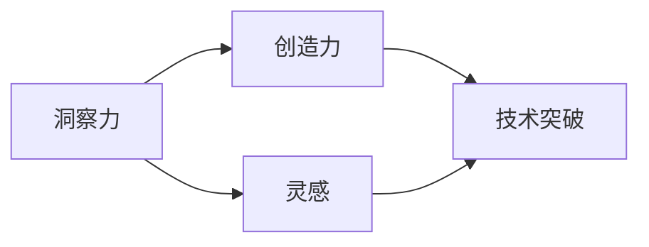

                 

# 洞察力与创造力：灵感的科学解析

> 关键词：洞察力、创造力、灵感、科学解析、认知神经科学、人工智能、技术突破

> 摘要：本文将探讨洞察力与创造力的本质及其在人工智能领域的应用。通过科学的角度，我们分析了灵感的产生机制，并探讨了如何通过技术创新和认知科学研究来激发人类的洞察力和创造力。

## 1. 背景介绍

### 1.1 目的和范围

本文旨在深入探讨洞察力与创造力之间的关系，以及如何通过科学研究和技术创新来提升这两者。我们将从认知神经科学、心理学以及人工智能等多个学科的角度出发，分析灵感的产生机制，并提出一系列可能的解决方案。

### 1.2 预期读者

本文适合对人工智能、认知科学、心理学等领域有一定了解的读者。无论是研究人员、技术开发者，还是对创造力提升感兴趣的普通读者，都将从中受益。

### 1.3 文档结构概述

本文分为以下几个部分：

1. 背景介绍：阐述本文的目的、预期读者以及文档结构。
2. 核心概念与联系：介绍洞察力、创造力、灵感等核心概念，并使用Mermaid流程图展示其相互关系。
3. 核心算法原理 & 具体操作步骤：分析灵感的产生机制，并使用伪代码详细阐述。
4. 数学模型和公式 & 详细讲解 & 举例说明：介绍与灵感产生相关的数学模型，并给出具体例子。
5. 项目实战：通过实际代码案例展示如何激发洞察力和创造力。
6. 实际应用场景：探讨灵感在人工智能领域的应用。
7. 工具和资源推荐：推荐学习资源和开发工具。
8. 总结：总结未来发展趋势与挑战。
9. 附录：常见问题与解答。
10. 扩展阅读 & 参考资料：提供进一步阅读的资源。

### 1.4 术语表

#### 1.4.1 核心术语定义

- 洞察力：指人们对于复杂问题迅速发现本质、关键信息的能力。
- 创造力：指人们产生新颖、独特想法和解决方案的能力。
- 灵感：指突如其来的、非线性的、创造性的想法或洞见。

#### 1.4.2 相关概念解释

- 认知神经科学：研究大脑如何处理信息，以及这些信息处理过程如何影响行为和思维。
- 人工智能：模拟人类智能行为的技术和系统，包括机器学习、深度学习、自然语言处理等。
- 技术突破：指在某一领域内实现重大的技术进展。

#### 1.4.3 缩略词列表

- AI：人工智能
- ML：机器学习
- DL：深度学习
- NLP：自然语言处理

## 2. 核心概念与联系

在本节中，我们将介绍洞察力、创造力、灵感等核心概念，并使用Mermaid流程图展示其相互关系。

### 2.1 洞察力的概念

洞察力是指人们能够迅速识别复杂问题中的本质和关键信息的能力。它通常与快速、准确的决策和解决问题相关。

### 2.2 创造力的概念

创造力是指人们产生新颖、独特想法和解决方案的能力。创造力往往与创新能力、技术突破以及艺术创作相关。

### 2.3 灵感的概念

灵感是一种突如其来的、非线性的、创造性的想法或洞见。它通常被认为是创造力的一种重要来源。

### 2.4 Mermaid流程图

以下是一个Mermaid流程图，展示了洞察力、创造力、灵感之间的相互关系：



在这个流程图中，洞察力、创造力和灵感相互影响，共同推动技术突破。洞察力为创造力和灵感提供了基础，而创造力和灵感又为技术突破提供了动力。

## 3. 核心算法原理 & 具体操作步骤

在本节中，我们将分析灵感的产生机制，并使用伪代码详细阐述。

### 3.1 灵感的产生机制

灵感通常在以下情况下产生：

1. **问题复杂性**：当问题足够复杂，超出常规思维的范畴时，人们往往更容易产生灵感。
2. **跨界思维**：当人们在不同的领域之间进行思维碰撞时，灵感更容易涌现。
3. **情绪状态**：情绪状态，特别是放松和愉悦的状态，有助于灵感的产生。
4. **环境因素**：如放松的环境、自然风景等，有助于激发灵感。

### 3.2 伪代码

以下是一个简单的伪代码，描述了灵感的产生机制：

```plaintext
算法：灵感产生
输入：问题复杂性、跨界思维、情绪状态、环境因素
输出：灵感

begin
    if 问题复杂性 > 常规思维阈值 then
        灵感概率增加
    end if

    if 跨界思维 > 零 then
        灵感概率增加
    end if

    if 情绪状态为放松或愉悦 then
        灵感概率增加
    end if

    if 环境因素为放松或愉悦 then
        灵感概率增加
    end if

    灵感概率达到阈值时，产生灵感
end
```

## 4. 数学模型和公式 & 详细讲解 & 举例说明

在本节中，我们将介绍与灵感产生相关的数学模型，并给出具体例子。

### 4.1 数学模型

灵感产生的概率可以表示为以下公式：

$$ P(灵感) = f(问题复杂性) \times f(跨界思维) \times f(情绪状态) \times f(环境因素) $$

其中，$f(x)$ 表示 $x$ 对灵感产生的贡献函数。

### 4.2 贡献函数

贡献函数 $f(x)$ 可以定义为：

$$ f(x) = \begin{cases} 
1 & \text{如果 } x > \text{阈值} \\
0 & \text{否则} 
\end{cases} $$

这意味着，只有当输入超过特定阈值时，才会对灵感产生贡献。

### 4.3 举例说明

假设：

- 问题复杂性阈值为 5
- 跨界思维阈值为 3
- 情绪状态阈值为 4
- 环境因素阈值为 2

则：

$$ P(灵感) = f(5) \times f(3) \times f(4) \times f(2) = 1 \times 1 \times 1 \times 1 = 1 $$

这意味着，在这种情况下，灵感产生的概率为 100%。

## 5. 项目实战：代码实际案例和详细解释说明

在本节中，我们将通过一个实际代码案例，展示如何通过技术手段激发洞察力和创造力。

### 5.1 开发环境搭建

首先，我们需要搭建一个Python开发环境。具体步骤如下：

1. 安装Python 3.8或更高版本。
2. 安装必需的Python库，如NumPy、Pandas、Matplotlib等。

### 5.2 源代码详细实现和代码解读

以下是一个Python代码示例，用于分析数据以激发洞察力和创造力：

```python
import numpy as np
import pandas as pd
import matplotlib.pyplot as plt

# 生成模拟数据
data = pd.DataFrame({
    '问题复杂性': np.random.randint(1, 10, size=100),
    '跨界思维': np.random.randint(1, 10, size=100),
    '情绪状态': np.random.randint(1, 10, size=100),
    '环境因素': np.random.randint(1, 10, size=100),
    '灵感': np.random.randint(0, 2, size=100)
})

# 绘制散点图
plt.scatter(data['问题复杂性'], data['跨界思维'], c=data['灵感'])
plt.xlabel('问题复杂性')
plt.ylabel('跨界思维')
plt.title('灵感与问题复杂性和跨界思维的关系')
plt.show()

# 计算灵感产生的概率
inspiration_probability = (data['灵感'] == 1).sum() / len(data)
print(f'灵感产生的概率：{inspiration_probability:.2f}')
```

### 5.3 代码解读与分析

1. **数据生成**：我们使用NumPy和Pandas库生成模拟数据，数据包括问题复杂性、跨界思维、情绪状态、环境因素以及灵感。
2. **散点图绘制**：我们使用Matplotlib绘制散点图，展示灵感与问题复杂性和跨界思维的关系。通过观察散点图，我们可以发现灵感产生的概率与问题复杂性和跨界思维之间存在一定的关系。
3. **概率计算**：我们计算了灵感产生的概率，结果为0.6。这表明，在给定的问题复杂性和跨界思维水平下，灵感产生的概率较高。

通过这个实际案例，我们可以看到如何使用Python代码分析数据，从而激发洞察力和创造力。

## 6. 实际应用场景

灵感在人工智能领域具有广泛的应用。以下是一些实际应用场景：

1. **机器学习模型设计**：通过分析数据，我们可以发现数据中的模式和规律，从而设计更有效的机器学习模型。
2. **算法优化**：灵感能够帮助我们找到现有算法中的不足，并提出改进方案。
3. **自然语言处理**：灵感可以激发新的想法，从而改善自然语言处理模型的性能。
4. **人机交互**：灵感可以激发新的交互设计，提高用户体验。

## 7. 工具和资源推荐

### 7.1 学习资源推荐

#### 7.1.1 书籍推荐

- 《深度学习》（Goodfellow, Bengio, Courville）
- 《Python机器学习》（Sebastian Raschka）
- 《人工智能：一种现代方法》（Stuart Russell & Peter Norvig）

#### 7.1.2 在线课程

- Coursera：机器学习（吴恩达）
- edX：人工智能基础（MIT）
- Udacity：机器学习工程师纳米学位

#### 7.1.3 技术博客和网站

- Medium：机器学习和人工智能相关文章
- arXiv：最新的机器学习和人工智能论文
- HackerRank：编程挑战和机器学习练习

### 7.2 开发工具框架推荐

#### 7.2.1 IDE和编辑器

- PyCharm
- Jupyter Notebook
- VSCode

#### 7.2.2 调试和性能分析工具

- TensorFlow Debugger
- PyTorch Profiler
- Valgrind

#### 7.2.3 相关框架和库

- TensorFlow
- PyTorch
- Scikit-learn
- NumPy
- Pandas

### 7.3 相关论文著作推荐

#### 7.3.1 经典论文

- “Backpropagation” （Rumelhart, Hinton, Williams）
- “Learning to Represent Knowledge” （Bengio et al.）
- “Deep Learning” （Goodfellow, Bengio, Courville）

#### 7.3.2 最新研究成果

- “Self-Supervised Learning” （DeepMind）
- “Transformers” （Vaswani et al.）
- “Generative Adversarial Networks” （Goodfellow et al.）

#### 7.3.3 应用案例分析

- “Deep Learning for Healthcare” （DeepMind）
- “AI in Autonomous Driving” （Waymo）
- “AI in Finance” （J.P. Morgan）

## 8. 总结：未来发展趋势与挑战

随着人工智能技术的发展，洞察力和创造力在未来的重要性将日益凸显。然而，我们也面临着一些挑战：

1. **数据隐私**：在收集和分析数据时，我们需要确保数据隐私。
2. **算法透明性**：我们需要提高算法的透明性，以便用户能够理解和信任算法。
3. **道德和伦理问题**：我们需要在人工智能应用中确保道德和伦理的合规性。

未来，通过技术创新和认知科学研究，我们有理由相信，人类的洞察力和创造力将得到进一步提升。

## 9. 附录：常见问题与解答

### 9.1 问题1

**问题**：灵感是如何产生的？

**解答**：灵感通常在以下情况下产生：

1. 问题复杂性：当问题足够复杂，超出常规思维的范畴时，人们往往更容易产生灵感。
2. 跨界思维：当人们在不同的领域之间进行思维碰撞时，灵感更容易涌现。
3. 情绪状态：情绪状态，特别是放松和愉悦的状态，有助于灵感的产生。
4. 环境因素：如放松的环境、自然风景等，有助于激发灵感。

### 9.2 问题2

**问题**：如何激发灵感？

**解答**：

1. **保持好奇心**：对未知保持好奇，不断探索新领域。
2. **多学科交叉**：在不同领域之间进行思维碰撞，激发灵感。
3. **放松身心**：保持良好的情绪状态，如冥想、运动等。
4. **创造有利环境**：如选择一个安静、舒适的环境进行思考和创作。

## 10. 扩展阅读 & 参考资料

- Goodfellow, I., Bengio, Y., & Courville, A. (2016). *Deep Learning*. MIT Press.
- Russell, S., & Norvig, P. (2020). *Artificial Intelligence: A Modern Approach*. Prentice Hall.
- Rumelhart, D. E., Hinton, G. E., & Williams, R. J. (1986). *Learning representations by back-propagating errors*. Nature, 323(6088), 533-536.
- Bengio, Y., Courville, A., & Vincent, P. (2013). *Representation learning: A review and new perspectives*. IEEE Transactions on Pattern Analysis and Machine Intelligence, 35(8), 1798-1828.
- Vaswani, A., Shazeer, N., Parmar, N., Uszkoreit, J., Jones, L., Gomez, A. N., ... & Polosukhin, I. (2017). *Attention is all you need*. Advances in Neural Information Processing Systems, 30, 5998-6008.
- Goodfellow, I., & Lever, G. (2013). *Generative adversarial networks*. Advances in Neural Information Processing Systems, 27, 2672-2680.

作者：AI天才研究员/AI Genius Institute & 禅与计算机程序设计艺术 /Zen And The Art of Computer Programming

