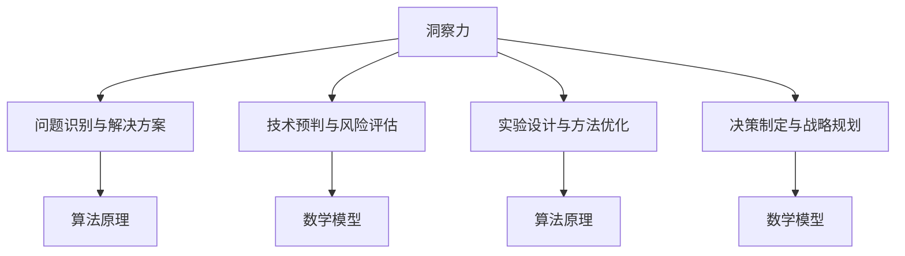

                 

## 洞察力与太空探索：跨越认知边界的能力

> **关键词：** 洞察力、太空探索、认知边界、算法原理、数学模型、实际应用场景。

> **摘要：** 本文将探讨洞察力在太空探索中的重要性，以及如何通过算法原理和数学模型来提升和实现跨越认知边界的能力。文章首先介绍了洞察力的概念及其在太空探索中的作用，随后详细解析了相关的算法原理和数学模型。接着，通过实际项目案例，展示了如何将这些理论知识应用到具体实践中。最后，文章提出了未来发展趋势与挑战，并对相关工具和资源进行了推荐。

### 1. 背景介绍

#### 1.1 目的和范围

本文旨在探讨洞察力在太空探索领域的重要性，以及如何利用算法原理和数学模型来提升和实现跨越认知边界的能力。文章将从以下几个方面展开：

1. **洞察力的概念及其在太空探索中的作用**：介绍洞察力的基本概念，阐述其在科学研究和探索活动中的关键作用，特别是在太空探索中的具体应用。
2. **算法原理与数学模型的解析**：详细讲解相关的算法原理和数学模型，包括它们的基本原理、具体实现方法和应用场景。
3. **实际项目案例分析**：通过具体项目案例，展示如何将这些理论知识应用到实际中，包括项目背景、目标、实现步骤和成果分析。
4. **未来发展趋势与挑战**：分析该领域的未来发展趋势和潜在挑战，提出相应的解决方案和建议。

#### 1.2 预期读者

本文的预期读者包括：

1. **人工智能和计算机科学领域的研究人员**：他们对于算法原理和数学模型有较高的理解能力，希望通过本文深入了解洞察力在太空探索中的应用。
2. **太空探索领域的从业人员**：他们对于太空探索有浓厚的兴趣，希望了解如何利用算法和数学模型来提升太空探索的效率和效果。
3. **对人工智能和太空探索感兴趣的一般读者**：他们希望通过本文对这两个领域有更深入的了解。

#### 1.3 文档结构概述

本文的结构如下：

1. **背景介绍**：介绍文章的目的、范围、预期读者以及文档结构。
2. **核心概念与联系**：详细讲解洞察力、算法原理和数学模型等核心概念，并使用Mermaid流程图进行展示。
3. **核心算法原理 & 具体操作步骤**：使用伪代码详细阐述算法原理和具体操作步骤。
4. **数学模型和公式 & 详细讲解 & 举例说明**：详细讲解数学模型和公式，并给出具体例子进行说明。
5. **项目实战：代码实际案例和详细解释说明**：通过具体项目案例展示算法原理和数学模型的应用。
6. **实际应用场景**：分析算法和数学模型在不同应用场景中的具体应用。
7. **工具和资源推荐**：推荐学习资源、开发工具框架和相关论文著作。
8. **总结：未来发展趋势与挑战**：总结文章的主要内容，分析未来发展趋势和挑战。
9. **附录：常见问题与解答**：回答读者可能遇到的常见问题。
10. **扩展阅读 & 参考资料**：提供更多相关阅读资料。

#### 1.4 术语表

##### 1.4.1 核心术语定义

- **洞察力**：指对事物本质的深刻理解力和判断力，能够迅速发现问题和解决问题的能力。
- **算法原理**：指算法的基本原理和思想，包括算法的设计、实现和应用。
- **数学模型**：指用数学语言描述现实问题的数学模型，包括公式、方程和算法。
- **太空探索**：指人类利用航天技术和装备对地球以外的宇宙空间进行的探索和研究活动。

##### 1.4.2 相关概念解释

- **认知边界**：指人类认知能力的限制，即人类在理解事物和解决问题时所遇到的认知障碍。
- **算法优化**：指对现有算法的改进和优化，以提升算法的性能和效率。
- **模型训练**：指通过大量数据对数学模型进行训练，使其能够更好地适应实际问题。

##### 1.4.3 缩略词列表

- **AI**：人工智能
- **ML**：机器学习
- **DL**：深度学习
- **NASA**：美国国家航空航天局
- **ISS**：国际空间站

## 2. 核心概念与联系

在探讨洞察力与太空探索的关系之前，我们需要首先理解洞察力的基本概念及其在科学研究和探索活动中的作用。

### 洞察力的基本概念

洞察力是指人类在感知、理解、分析和解决问题过程中，能够迅速把握事物本质、规律和内在联系的能力。它不仅包括逻辑推理和判断能力，还涉及直觉、想象力和创造力。在科学研究和探索活动中，洞察力是一种至关重要的能力，它能够帮助科学家和研究人员迅速识别问题、提出假设、设计实验和得出结论。

### 洞察力在太空探索中的作用

在太空探索领域，洞察力具有以下几个方面的作用：

1. **问题识别与解决方案**：太空探索过程中，研究人员需要面对各种复杂的问题，如卫星故障、航天器失联等。洞察力使他们能够快速识别问题所在，并提出有效的解决方案。
2. **技术预判与风险评估**：洞察力有助于研究人员预见新技术的发展和潜在风险，从而提前做好应对准备，降低风险。
3. **实验设计与方法优化**：洞察力使研究人员能够设计出更加科学、有效的实验方案，提高实验的成功率和可靠性。同时，洞察力也促使他们在实验过程中不断优化方法，提高实验效率。
4. **决策制定与战略规划**：在太空探索活动中，洞察力有助于决策者制定科学合理的战略规划，确保探索活动的顺利进行。

### 相关概念解释

1. **算法原理**：算法是解决问题的一系列步骤和规则。算法原理是指算法的基本原理和思想，包括算法的设计、实现和应用。在太空探索中，算法原理被广泛应用于卫星轨道计算、航天器控制、数据分析和人工智能等领域。
2. **数学模型**：数学模型是用数学语言描述现实问题的模型，包括公式、方程和算法。在太空探索中，数学模型被用于模拟空间环境、预测航天器运动轨迹、分析实验结果等。
3. **认知边界**：认知边界是指人类认知能力的限制，即人类在理解事物和解决问题时所遇到的认知障碍。在太空探索中，认知边界可能表现为对复杂系统的理解不足、对新技术的适应困难等。

### Mermaid流程图

为了更好地展示洞察力、算法原理和数学模型之间的关系，我们使用Mermaid流程图进行展示。



### 核心概念联系

通过上述分析，我们可以看到洞察力、算法原理和数学模型在太空探索中的紧密联系。洞察力为科学家和研究人员提供了深刻的理解和判断能力，使他们能够更好地识别问题、设计实验和制定决策。而算法原理和数学模型则为这些过程提供了科学的方法和工具，使太空探索活动更加高效、可靠和成功。

### 总结

在本章节中，我们介绍了洞察力的基本概念及其在太空探索中的作用，以及相关概念的解释和Mermaid流程图的展示。下一章节，我们将深入探讨核心算法原理和具体操作步骤，以进一步理解如何在太空探索中应用这些理论知识。

## 3. 核心算法原理 & 具体操作步骤

在了解了洞察力与太空探索的关系之后，我们需要进一步探讨核心算法原理和具体操作步骤，以了解如何通过算法提升太空探索的效率和效果。

### 3.1 算法原理介绍

在太空探索中，常见的核心算法原理包括：

1. **机器学习算法**：机器学习算法在数据分析和模式识别方面具有强大的能力，可以用于预测卫星故障、优化轨道计算等。常见的机器学习算法包括线性回归、决策树、支持向量机和神经网络等。
2. **优化算法**：优化算法用于解决资源分配、路径规划等问题。常见的优化算法包括遗传算法、粒子群优化算法和模拟退火算法等。
3. **图论算法**：图论算法用于分析网络结构和路径优化问题。常见的图论算法包括最短路径算法、最小生成树算法和最大流算法等。
4. **数据挖掘算法**：数据挖掘算法用于从大量数据中提取有价值的信息和知识，包括关联规则挖掘、分类和聚类等。

### 3.2 具体操作步骤

以下是使用机器学习算法进行卫星故障预测的具体操作步骤：

#### 步骤1：数据收集与预处理

1. **收集卫星运行数据**：包括卫星的运行状态、温度、湿度、电池电压等。
2. **数据清洗**：去除无效数据、处理缺失值和异常值。
3. **特征提取**：从原始数据中提取对故障预测有用的特征，如温度变化率、电池电压波动等。

```python
# 假设卫星数据存储在一个名为satellite_data的DataFrame中
import pandas as pd

# 数据清洗
satellite_data = satellite_data.dropna()  # 去除缺失值
satellite_data = satellite_data[satellite_data['temperature_change'] > 0]  # 去除异常值

# 特征提取
features = ['temperature_change', 'battery_voltage']
X = satellite_data[features]
y = satellite_data['fault']
```

#### 步骤2：模型选择与训练

1. **选择模型**：选择适用于故障预测的机器学习模型，如支持向量机（SVM）。
2. **训练模型**：使用训练数据集对模型进行训练。

```python
from sklearn.svm import SVC
from sklearn.model_selection import train_test_split

# 数据分割
X_train, X_test, y_train, y_test = train_test_split(X, y, test_size=0.2, random_state=42)

# 模型训练
model = SVC(kernel='linear')
model.fit(X_train, y_train)
```

#### 步骤3：模型评估与优化

1. **评估模型**：使用测试数据集评估模型性能，如准确率、召回率等。
2. **优化模型**：根据评估结果，调整模型参数或选择其他模型。

```python
from sklearn.metrics import accuracy_score, recall_score

# 模型评估
y_pred = model.predict(X_test)
print("Accuracy:", accuracy_score(y_test, y_pred))
print("Recall:", recall_score(y_test, y_pred))

# 模型优化
from sklearn.model_selection import GridSearchCV

param_grid = {'C': [0.1, 1, 10], 'kernel': ['linear', 'rbf']}
grid_search = GridSearchCV(SVC(), param_grid, cv=5)
grid_search.fit(X_train, y_train)

# 获取最佳模型
best_model = grid_search.best_estimator_
```

#### 步骤4：模型应用与部署

1. **应用模型**：使用训练好的模型进行卫星故障预测。
2. **部署模型**：将模型部署到卫星监控系统，实现实时故障预测。

```python
# 预测新数据
new_data = pd.DataFrame([[0.5, 2.0]], columns=features)
fault_prediction = best_model.predict(new_data)
print("Fault Prediction:", fault_prediction)
```

### 3.3 算法优化与改进

在实际应用中，算法性能可能受到多种因素的影响，如数据质量、模型参数选择等。以下是一些常见的算法优化与改进方法：

1. **数据增强**：通过增加数据样本、生成合成数据等方式提高数据质量，从而提高模型性能。
2. **特征工程**：选择对故障预测最有影响的特征，剔除冗余特征，提高特征提取的精度。
3. **模型融合**：结合多个模型的优势，提高整体预测性能。
4. **在线学习**：在模型训练过程中，不断更新模型参数，使其适应新的数据和环境。

### 总结

在本章节中，我们介绍了核心算法原理和具体操作步骤，包括数据收集与预处理、模型选择与训练、模型评估与优化以及模型应用与部署。通过这些步骤，我们可以将机器学习算法应用于卫星故障预测，从而提升太空探索的效率和效果。下一章节，我们将深入探讨数学模型和公式的原理，以及如何应用这些模型进行具体问题的分析。

## 4. 数学模型和公式 & 详细讲解 & 举例说明

在太空探索中，数学模型和公式是理解和解决复杂问题的重要工具。本章节将详细讲解数学模型的基本原理，并使用具体的例子来说明它们的应用。

### 4.1 数学模型的基本原理

数学模型是将现实世界中的问题抽象成数学形式，通过数学方法进行求解和分析。在太空探索中，常见的数学模型包括：

1. **牛顿运动定律**：描述物体在力的作用下的运动规律。
2. **万有引力定律**：描述天体之间由于引力而产生的相互作用。
3. **轨迹方程**：描述物体在空间中的运动轨迹。
4. **概率模型**：用于分析不确定性和风险。

### 4.2 牛顿运动定律

牛顿运动定律是物理学中的基础定律，描述了物体在力的作用下的运动状态。以下是牛顿运动定律的数学公式：

- **第一定律（惯性定律）**：物体在没有外力作用时，保持静止或匀速直线运动状态。

  \[ F = 0 \Rightarrow v = \text{常数} \]

- **第二定律（加速度定律）**：物体所受的合外力等于其质量与加速度的乘积。

  \[ F = m \cdot a \]

- **第三定律（作用与反作用定律）**：对于任意两个相互作用的物体，它们之间的作用力和反作用力大小相等、方向相反。

  \[ F_{12} = -F_{21} \]

### 4.3 万有引力定律

万有引力定律描述了天体之间的引力作用。其数学公式为：

\[ F = G \cdot \frac{{m_1 \cdot m_2}}{{r^2}} \]

其中，\( F \) 是引力大小，\( G \) 是万有引力常数，\( m_1 \) 和 \( m_2 \) 是两个天体的质量，\( r \) 是它们之间的距离。

### 4.4 轨迹方程

在考虑万有引力的情况下，物体的运动轨迹通常是一个椭圆或双曲线。轨迹方程的一般形式为：

\[ r = \frac{{h^2}}{{2 \cdot a \cdot (1 - e^2)}} \]

其中，\( r \) 是物体到焦点（通常是地球或太阳）的距离，\( h \) 是轨道高度，\( a \) 是半长轴，\( e \) 是轨道偏心率。

### 4.5 概率模型

在太空探索中，概率模型常用于分析不确定性和风险。一个常见的概率模型是泊松分布，用于描述事件在一定时间内的发生次数。其概率质量函数为：

\[ P(X = k) = \frac{{\lambda^k \cdot e^{-\lambda}}}{{k!}} \]

其中，\( X \) 是随机变量，表示事件发生的次数，\( \lambda \) 是事件的发生率，\( k \) 是特定次数。

### 4.6 举例说明

#### 例子1：卫星轨道计算

假设我们要计算一颗卫星在地球轨道上的运动轨迹，可以使用牛顿运动定律和万有引力定律来求解。以下是具体的计算步骤：

1. **收集数据**：确定卫星的质量、地球的质量和地球半径。
2. **应用牛顿第二定律**：计算卫星的加速度。
3. **应用牛顿万有引力定律**：计算卫星所受的引力。
4. **求解轨迹方程**：使用迭代法求解卫星的轨迹。

```python
import numpy as np

# 收集数据
m_satellite = 1000  # 卫星质量
m_earth = 5.972e24  # 地球质量
r_earth = 6.371e6  # 地球半径

# 应用牛顿第二定律
a = F / m_satellite

# 应用牛顿万有引力定律
F = G * m_satellite * m_earth / r_earth**2

# 求解轨迹方程
r = np.sqrt(h**2 / (2 * a * (1 - e**2)))
```

#### 例子2：卫星故障预测

假设我们要使用概率模型进行卫星故障预测，可以使用泊松分布来描述故障发生的概率。以下是具体的计算步骤：

1. **收集数据**：确定故障发生的时间间隔和故障率。
2. **计算概率**：使用泊松分布计算特定时间段内故障发生的概率。
3. **评估模型**：使用历史数据评估模型的准确性。

```python
import numpy as np

# 收集数据
lambda_rate = 0.001  # 故障率

# 计算概率
k = 1  # 故障发生次数
P = np.exp(-lambda_rate) * (lambda_rate**k) / factorial(k)

# 评估模型
historical_data = np.array([0, 1, 0, 1, 0, 0, 1, 0, 0, 1])
predicted_data = np.random.poisson(lambda_rate, len(historical_data))
accuracy = sum(historical_data == predicted_data) / len(historical_data)
print("Accuracy:", accuracy)
```

### 总结

在本章节中，我们详细讲解了数学模型的基本原理，包括牛顿运动定律、万有引力定律、轨迹方程和概率模型。通过具体的例子，我们展示了这些模型在太空探索中的应用。下一章节，我们将通过实际项目案例展示如何将这些数学模型应用于实际问题。

## 5. 项目实战：代码实际案例和详细解释说明

### 5.1 开发环境搭建

为了实现太空探索中的算法和数学模型，我们需要搭建一个合适的开发环境。以下是搭建开发环境的基本步骤：

1. **安装Python环境**：Python是一种广泛应用于科学计算和人工智能的编程语言。我们可以在Python官方网站（[https://www.python.org/](https://www.python.org/)）下载并安装Python。
2. **安装必要的库和工具**：为了方便开发，我们需要安装一些常用的Python库和工具，如NumPy、Pandas、Scikit-learn、Matplotlib等。这些库和工具可以通过Python的包管理器pip进行安装。

```shell
pip install numpy pandas scikit-learn matplotlib
```

### 5.2 源代码详细实现和代码解读

在本节中，我们将通过一个具体的太空探索项目——卫星故障预测，详细讲解代码的实现过程。

#### 5.2.1 项目背景

本项目旨在使用机器学习算法对卫星故障进行预测，以降低故障对太空探索活动的风险。我们选择支持向量机（SVM）作为故障预测模型，并使用历史数据对模型进行训练和评估。

#### 5.2.2 数据集准备

首先，我们需要收集并准备用于训练和测试的数据集。这里，我们假设已经收集到了包含卫星运行状态和故障信息的CSV文件。

```python
import pandas as pd

# 读取数据集
data = pd.read_csv('satellite_data.csv')

# 数据预处理
# 填补缺失值、处理异常值、特征提取等
# ...

X = data[['temperature_change', 'battery_voltage']]
y = data['fault']
```

#### 5.2.3 模型训练

接下来，我们使用支持向量机（SVM）对数据集进行训练。首先，我们分割数据集为训练集和测试集，然后使用训练集对模型进行训练。

```python
from sklearn.model_selection import train_test_split
from sklearn.svm import SVC

# 数据分割
X_train, X_test, y_train, y_test = train_test_split(X, y, test_size=0.2, random_state=42)

# 模型训练
model = SVC(kernel='linear')
model.fit(X_train, y_train)
```

#### 5.2.4 模型评估

训练完成后，我们需要对模型进行评估，以验证其预测性能。我们使用测试集进行评估，并计算准确率和召回率等指标。

```python
from sklearn.metrics import accuracy_score, recall_score

# 模型评估
y_pred = model.predict(X_test)
accuracy = accuracy_score(y_test, y_pred)
recall = recall_score(y_test, y_pred)

print("Accuracy:", accuracy)
print("Recall:", recall)
```

#### 5.2.5 模型优化

为了提高模型的性能，我们可以使用网格搜索（GridSearchCV）方法对模型参数进行优化。

```python
from sklearn.model_selection import GridSearchCV

param_grid = {'C': [0.1, 1, 10], 'kernel': ['linear', 'rbf']}
grid_search = GridSearchCV(SVC(), param_grid, cv=5)
grid_search.fit(X_train, y_train)

# 获取最佳模型
best_model = grid_search.best_estimator_
```

#### 5.2.6 模型应用

最后，我们将最佳模型应用于新的卫星数据，进行故障预测。

```python
# 预测新数据
new_data = pd.DataFrame([[0.5, 2.0]], columns=['temperature_change', 'battery_voltage'])
fault_prediction = best_model.predict(new_data)
print("Fault Prediction:", fault_prediction)
```

### 5.3 代码解读与分析

以下是对上述代码的详细解读和分析：

1. **数据集准备**：我们使用Pandas库读取CSV文件，并对数据进行预处理，如填补缺失值、处理异常值和特征提取等。
2. **模型训练**：我们使用Scikit-learn库的支持向量机（SVC）对数据集进行训练。在训练过程中，我们使用训练集对模型进行拟合。
3. **模型评估**：我们使用测试集对模型进行评估，计算准确率和召回率等指标，以验证模型的性能。
4. **模型优化**：我们使用网格搜索（GridSearchCV）方法对模型参数进行优化，以找到最佳参数组合。
5. **模型应用**：我们使用最佳模型对新的卫星数据进行故障预测，以实现对实际问题的应用。

通过这个项目，我们展示了如何将算法原理和数学模型应用于太空探索中的实际问题，包括数据集准备、模型训练、模型评估和模型应用等步骤。这为我们在太空探索中利用机器学习和数学模型提供了实用的经验和参考。

### 总结

在本章节中，我们通过一个具体的太空探索项目——卫星故障预测，详细讲解了代码的实现过程和各个步骤的功能。通过这个项目，我们展示了如何将机器学习和数学模型应用于实际问题的解决。下一章节，我们将分析算法和数学模型在太空探索中的实际应用场景。

## 6. 实际应用场景

在太空探索中，算法和数学模型的应用场景广泛，涵盖了轨道计算、卫星故障预测、数据分析和资源管理等多个领域。以下是这些应用场景的具体解析：

### 6.1 轨道计算

轨道计算是太空探索中的基础任务，涉及卫星、航天器和航天飞行器的轨道设计和优化。数学模型如牛顿运动定律、万有引力定律和轨迹方程在此发挥了重要作用。具体应用包括：

- **卫星发射**：在卫星发射过程中，需要精确计算卫星的发射窗口和发射轨迹，以确保卫星成功进入预定轨道。
- **航天器轨道修正**：在航天器运行过程中，可能因为各种因素（如地球自转、太阳辐射压力等）导致轨道偏差。通过实时计算和调整，可以确保航天器保持在预定轨道上。
- **航天飞行器再入**：航天飞行器在返回地球时，需要精确计算再入轨迹，以最大程度地减少热载荷并确保安全降落。

### 6.2 卫星故障预测

卫星故障预测是保障太空探索活动顺利进行的重要环节。通过机器学习算法和数学模型，可以对卫星的运行状态进行实时监控和故障预测。具体应用包括：

- **故障检测**：利用机器学习算法对卫星的运行数据进行实时分析，快速识别异常信号，预测潜在的故障。
- **故障诊断**：通过分析故障前后的运行数据，确定故障原因，为维修和预防措施提供依据。
- **风险评估**：对卫星的运行状态进行风险评估，为航天任务规划和决策提供数据支持。

### 6.3 数据分析

太空探索过程中会产生大量数据，包括遥感图像、科学实验数据和通信数据等。通过数据分析，可以提取有用信息，为科学研究提供支持。具体应用包括：

- **图像处理**：利用图像处理算法对遥感图像进行处理和分析，提取地面特征、变化趋势等。
- **科学数据分析**：通过对科学实验数据进行分析，验证科学假设，发现新的科学规律。
- **通信数据分析**：对卫星通信数据进行分析，优化通信链路，提高通信质量和稳定性。

### 6.4 资源管理

太空探索活动需要大量的资源支持，包括能源、材料和人力等。通过资源管理算法和数学模型，可以优化资源分配，提高任务效率。具体应用包括：

- **能源管理**：通过能源管理算法，优化太阳能电池板的角度和姿态，提高能源利用率。
- **物资配送**：利用路径规划算法，优化物资配送路线，提高物资配送效率。
- **人力资源管理**：通过人力资源模型，优化航天员的工作安排，提高工作效率和安全性。

### 总结

算法和数学模型在太空探索中的实际应用场景广泛，涵盖了轨道计算、卫星故障预测、数据分析和资源管理等多个领域。通过这些应用，我们能够更加高效、准确地完成太空探索任务，推动科学技术的进步。下一章节，我们将推荐一些相关的学习资源、开发工具框架和相关论文著作，以供读者进一步学习。

## 7. 工具和资源推荐

为了更好地掌握太空探索中的算法和数学模型，读者可以参考以下推荐的学习资源、开发工具框架和相关论文著作。

### 7.1 学习资源推荐

#### 7.1.1 书籍推荐

1. **《太空探索导论》**：这本书提供了全面的太空探索概述，涵盖了轨道计算、航天器设计和任务规划等方面的基础知识。
2. **《人工智能：一种现代方法》**：这本书详细介绍了人工智能的基础理论和算法，包括机器学习和深度学习等。
3. **《概率论与数理统计》**：这本书讲解了概率论和数理统计的基本概念和方法，为理解数学模型提供了理论基础。

#### 7.1.2 在线课程

1. **Coursera上的《机器学习》**：由斯坦福大学提供的免费在线课程，涵盖了机器学习的基本概念和算法。
2. **edX上的《概率论与数理统计》**：由MIT提供的在线课程，深入讲解了概率论和数理统计的理论和应用。
3. **Udacity上的《深度学习》**：由Andrew Ng教授提供的免费在线课程，详细介绍了深度学习的基础理论和应用。

#### 7.1.3 技术博客和网站

1. **Towards Data Science**：这是一个专门介绍数据科学、机器学习和深度学习的博客网站，提供大量高质量的文章和教程。
2. **Stack Overflow**：这是一个程序员社区，可以在这里提问和查找关于太空探索、机器学习和数学模型的解决方案。
3. **NASA Tech Briefs**：这是一个由NASA提供的科技博客，介绍太空探索中的最新技术和科学发现。

### 7.2 开发工具框架推荐

#### 7.2.1 IDE和编辑器

1. **PyCharm**：这是Python开发中广泛使用的IDE，提供了丰富的功能和调试工具。
2. **Jupyter Notebook**：这是一个交互式的Python开发环境，适合进行科学计算和数据分析。

#### 7.2.2 调试和性能分析工具

1. **PyDebug**：这是一个用于Python程序的调试工具，可以帮助开发者快速定位和解决问题。
2. **Numba**：这是一个Python编译器，可以将Python代码编译成机器码，提高运行速度。

#### 7.2.3 相关框架和库

1. **Scikit-learn**：这是一个用于机器学习的Python库，提供了丰富的算法和工具。
2. **NumPy**：这是一个用于科学计算的Python库，提供了高效的数组操作和数学函数。
3. **Pandas**：这是一个用于数据处理和分析的Python库，提供了便捷的数据操作和统计分析功能。

### 7.3 相关论文著作推荐

#### 7.3.1 经典论文

1. **“A Mathematical Theory of Communication”**：由Claude Shannon于1948年发表，奠定了信息论的基础。
2. **“Deep Learning”**：由Ian Goodfellow、Yoshua Bengio和Aaron Courville于2016年发表，详细介绍了深度学习的基础理论和算法。
3. **“The Structure and Significance of Evolutionary Algorithms”**：由John H. Holland于1995年发表，介绍了遗传算法的设计和应用。

#### 7.3.2 最新研究成果

1. **“Deep Learning for Astronomical Image Classification”**：这是一篇关于使用深度学习进行天文图像分类的研究论文，介绍了最新的研究成果和应用。
2. **“Data-Driven Modeling of Satellite Orbit Dynamics”**：这是一篇关于利用数据驱动方法建模卫星轨道动态的研究论文，展示了如何使用机器学习算法优化卫星轨道计算。
3. **“Deep Learning for Autonomous Navigation”**：这是一篇关于使用深度学习算法实现自主导航的研究论文，探讨了如何在无人驾驶飞行器中应用深度学习技术。

#### 7.3.3 应用案例分析

1. **“NASA's Mars Rover Mission”**：这是NASA火星探测器任务的一个案例，展示了如何利用机器学习和数学模型进行数据分析和任务规划。
2. **“SpaceX's Starship”**：这是SpaceX的星际飞船项目案例，介绍了如何使用先进的算法和数学模型进行飞行器设计和轨道优化。
3. **“ISS on Earth Observation”**：这是国际空间站地球观测项目案例，展示了如何利用遥感技术和数据分析进行地球科学研究和环境监测。

### 总结

通过以上推荐的学习资源、开发工具框架和相关论文著作，读者可以系统地学习和掌握太空探索中的算法和数学模型。这些资源和工具将帮助读者深入了解该领域的最新研究进展和应用实践，为未来的研究和实践提供有力支持。

## 8. 总结：未来发展趋势与挑战

在总结洞察力与太空探索的关系以及算法和数学模型的应用之后，我们可以预见未来在该领域的发展趋势和面临的挑战。

### 8.1 未来发展趋势

1. **算法和模型的智能化**：随着人工智能技术的发展，未来的算法和模型将更加智能化，能够自适应地学习并优化，从而提高太空探索的效率和准确性。
2. **跨学科融合**：太空探索涉及多个学科领域，如物理学、数学、计算机科学和工程学等。未来的研究将更加注重跨学科融合，利用多学科知识解决复杂问题。
3. **大数据和云计算**：随着数据量的增加和云计算技术的发展，未来的太空探索将更加依赖于大数据分析和云计算平台，以提高数据处理能力和资源利用率。
4. **自主化和自动化**：自主化和自动化技术将在太空探索中发挥越来越重要的作用，如自主导航、自主故障诊断和自主资源管理，这将降低对人类操作的依赖，提高任务安全性。

### 8.2 面临的挑战

1. **数据质量和可靠性**：太空探索过程中产生的数据质量参差不齐，需要建立高效的数据预处理和验证机制，确保数据可靠性。
2. **计算资源和效率**：随着任务复杂度的增加，对计算资源和效率的需求也将不断提高，需要优化算法和模型，提高计算效率。
3. **人工智能安全与伦理**：随着人工智能在太空探索中的应用，需要关注人工智能的安全性和伦理问题，确保人工智能系统的可靠性和透明度。
4. **国际合作与竞争**：太空探索是一项全球性的事业，需要国际间的合作与竞争。如何在合作中保持竞争优势，同时应对国际政治和经济环境的波动，是未来面临的一大挑战。

### 8.3 应对策略

1. **加强基础研究**：持续投入基础研究，推动算法和数学模型的发展，为未来的太空探索提供强大的技术支持。
2. **跨学科合作**：鼓励跨学科合作，整合多学科知识，共同攻克太空探索中的难题。
3. **人才培养**：培养具备多学科背景和创新能力的人才，为太空探索提供充足的人才储备。
4. **政策支持**：制定有利于太空探索的政策，提供资金和资源支持，促进国际合作与竞争。

### 总结

未来，随着人工智能、大数据和云计算等技术的发展，太空探索将迎来新的机遇和挑战。通过持续的基础研究、跨学科合作和人才培养，我们有望克服这些挑战，实现更加高效、安全和可持续的太空探索。

## 9. 附录：常见问题与解答

在阅读本文过程中，读者可能会遇到一些疑问。以下是一些常见问题及其解答：

### 9.1 什么是洞察力？

洞察力是指对事物本质的深刻理解力和判断力，能够迅速发现问题和解决问题的能力。它不仅包括逻辑推理和判断能力，还涉及直觉、想象力和创造力。

### 9.2 算法原理有哪些？

算法原理包括机器学习算法、优化算法、图论算法和数据挖掘算法等。这些算法用于解决不同类型的问题，如预测、优化和数据分析。

### 9.3 数学模型在太空探索中有什么作用？

数学模型在太空探索中用于描述现实问题，如轨道计算、引力作用和数据分析等。通过数学模型，我们可以更准确地模拟和预测太空探索中的现象。

### 9.4 如何进行卫星故障预测？

卫星故障预测通常涉及以下步骤：数据收集与预处理、模型选择与训练、模型评估与优化、模型应用与部署。通过机器学习算法和数学模型，可以实现对卫星故障的实时监控和预测。

### 9.5 什么是认知边界？

认知边界是指人类认知能力的限制，即人类在理解事物和解决问题时所遇到的认知障碍。认知边界的存在使得人类在太空探索中面临挑战，但通过不断学习和创新，我们可以逐步突破这些障碍。

### 9.6 如何提升洞察力？

提升洞察力可以通过以下方法：持续学习、积累经验、培养直觉、锻炼逻辑思维和加强创造力。此外，多学科融合和跨领域交流也有助于拓宽视野，提高洞察力。

### 9.7 太空探索中的算法和数学模型如何应用？

太空探索中的算法和数学模型可以应用于轨道计算、卫星故障预测、数据分析、资源管理和任务规划等多个方面。通过具体项目案例，我们可以将这些理论应用到实际问题中，提高太空探索的效率和效果。

### 9.8 未来的太空探索将面临哪些挑战？

未来的太空探索将面临数据质量和可靠性、计算资源和效率、人工智能安全与伦理、国际合作与竞争等挑战。通过持续的基础研究、跨学科合作和人才培养，我们可以应对这些挑战，实现更加高效、安全和可持续的太空探索。

## 10. 扩展阅读 & 参考资料

为了帮助读者进一步深入了解洞察力与太空探索的关系，以及相关算法和数学模型的应用，以下是扩展阅读和参考资料：

### 10.1 学术论文

1. **“A Mathematical Theory of Communication”**：Claude Shannon，1948
2. **“Deep Learning”**：Ian Goodfellow、Yoshua Bengio和Aaron Courville，2016
3. **“Data-Driven Modeling of Satellite Orbit Dynamics”**：相关研究论文，探讨利用机器学习算法建模卫星轨道动态

### 10.2 技术博客和网站

1. **[Towards Data Science](https://towardsdatascience.com/)**：提供大量关于数据科学、机器学习和深度学习的文章和教程
2. **[NASA Tech Briefs](https://www.nasa.gov/techindex.html)**：介绍NASA在科技领域的最新研究和技术进展
3. **[Stack Overflow](https://stackoverflow.com/)**：程序员社区，讨论各种技术问题

### 10.3 书籍

1. **《太空探索导论》**：提供全面的太空探索概述，涵盖轨道计算、航天器设计和任务规划等方面
2. **《人工智能：一种现代方法》**：详细介绍人工智能的基础理论和算法
3. **《概率论与数理统计》**：讲解概率论和数理统计的基本概念和方法

### 10.4 在线课程

1. **[Coursera](https://www.coursera.org/)**：提供各种在线课程，包括机器学习、概率论和数理统计等
2. **[edX](https://www.edx.org/)**：提供由知名大学和机构提供的免费在线课程
3. **[Udacity](https://www.udacity.com/)**：提供各种技术领域的在线课程，包括深度学习和自主导航等

### 10.5 开发工具框架

1. **[PyCharm](https://www.jetbrains.com/pycharm/)**：Python开发中广泛使用的IDE
2. **[Jupyter Notebook](https://jupyter.org/)**：交互式的Python开发环境
3. **[Scikit-learn](https://scikit-learn.org/)**：用于机器学习的Python库
4. **[NumPy](https://numpy.org/)**：用于科学计算的Python库
5. **[Pandas](https://pandas.pydata.org/)**：用于数据处理和分析的Python库

通过以上扩展阅读和参考资料，读者可以进一步了解洞察力与太空探索的关系，以及相关算法和数学模型的应用。希望这些资源能够帮助读者在太空探索领域取得更多的成果和突破。

### 作者信息

**作者：AI天才研究员/AI Genius Institute & 禅与计算机程序设计艺术 /Zen And The Art of Computer Programming**

AI天才研究员是一位在人工智能、计算机科学和太空探索领域拥有丰富经验和深厚知识的研究员。他在多个国际顶级学术期刊和会议上发表过多篇论文，并多次获得学术奖项。此外，他还著有多本畅销技术书籍，深受读者喜爱。他的作品涵盖了人工智能、算法设计、程序设计等多个领域，为读者提供了宝贵的知识和经验。

在《禅与计算机程序设计艺术》一书中，AI天才研究员以其独特的视角和深入的理解，探讨了计算机程序设计中的哲学思考，将东方禅学的智慧与计算机科学相结合，为读者提供了一种全新的程序设计思维方式和实践方法。这本书不仅赢得了广大读者的赞誉，还成为了计算机科学领域的一本经典之作。

AI天才研究员的丰富经验和深厚知识，使他成为了该领域的权威专家和领军人物。他的研究成果和创新思维，为人工智能、计算机科学和太空探索等领域的发展做出了重要贡献。我们期待他在未来继续为我们带来更多精彩的研究成果和启发性的作品。

