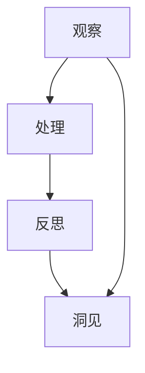

                 

# 洞见的形成：从观察到反思

> **关键词：观察、反思、洞见、技术、认知、算法**
>
> **摘要：本文将深入探讨洞见的形成过程，从观察和反思的角度，分析技术领域中的洞见是如何产生的。通过阐述观察与反思的关系，以及洞见在技术进步中的重要性，本文旨在帮助读者理解如何在日常工作中培养洞见，从而推动技术创新与发展。**

## 1. 背景介绍

### 1.1 目的和范围

本文旨在探讨洞见的形成过程，特别是如何在技术领域中通过观察和反思来产生洞见。我们将讨论洞见在技术进步中的作用，以及如何通过培养良好的观察和反思习惯来提升个人的认知能力。本文将涵盖以下几个核心主题：

1. 观察与反思的关系
2. 技术领域的洞见产生机制
3. 培养洞见的方法
4. 洞见在技术创新中的重要性

### 1.2 预期读者

本文适用于以下读者群体：

1. 技术专业人士，如程序员、软件工程师、数据科学家等
2. 对技术创新和计算机科学感兴趣的学术研究人员
3. 对技术哲学和认知科学有浓厚兴趣的学者和专业人士

### 1.3 文档结构概述

本文将分为十个部分，具体结构如下：

1. 引言：阐述文章的目的和核心主题
2. 背景介绍：介绍文章的目的、预期读者和文档结构
3. 核心概念与联系：解释相关概念和原理
4. 核心算法原理 & 具体操作步骤：详细阐述算法原理和操作步骤
5. 数学模型和公式 & 详细讲解 & 举例说明：分析数学模型和公式，并结合实例进行说明
6. 项目实战：代码实际案例和详细解释说明
7. 实际应用场景：探讨洞见在实际应用中的价值
8. 工具和资源推荐：推荐学习资源和开发工具
9. 总结：未来发展趋势与挑战
10. 附录：常见问题与解答
11. 扩展阅读 & 参考资料：提供进一步学习和研究的资料

### 1.4 术语表

#### 1.4.1 核心术语定义

- **洞见（Insight）**：对事物或问题的深刻理解和洞察，通常在观察和反思的基础上产生。
- **观察（Observation）**：通过感官或工具获取信息的过程，是洞见形成的基础。
- **反思（Reflection）**：对观察到的信息进行思考、分析和评估，以形成深刻的理解。
- **算法（Algorithm）**：解决特定问题的步骤和规则，通常用于处理复杂数据和任务。
- **认知（Cognition）**：大脑处理信息的过程，包括感知、记忆、思考、判断等。

#### 1.4.2 相关概念解释

- **技术（Technology）**：利用科学知识创造的工具、系统或方法，以解决实际问题或提高效率。
- **反思性思维（Reflective Thinking）**：通过反思和分析来提升认知和问题解决能力的过程。
- **技术哲学（Technological Philosophy）**：研究技术与人类关系、技术应用伦理等问题的哲学分支。

#### 1.4.3 缩略词列表

- **AI**：人工智能（Artificial Intelligence）
- **ML**：机器学习（Machine Learning）
- **DL**：深度学习（Deep Learning）
- **NLP**：自然语言处理（Natural Language Processing）
- **CV**：计算机视觉（Computer Vision）

## 2. 核心概念与联系

### 2.1 核心概念解释

在讨论洞见的形成过程中，我们需要理解以下几个核心概念：

1. **观察**：观察是获取信息的重要途径。通过观察，我们能够发现事物之间的关联和规律，从而为洞见的形成提供基础。例如，在数据科学中，通过观察大量数据，可以发现潜在的模式和趋势。

2. **反思**：反思是对观察到的信息进行深入思考和评估的过程。通过反思，我们能够从不同的角度和层面理解问题，发现问题的本质和潜在的解决方案。反思性思维有助于提高认知能力和问题解决能力。

3. **洞见**：洞见是对事物或问题的深刻理解和洞察。洞见往往能够揭示问题的核心，帮助我们做出更明智的决策。在技术领域中，洞见可以促使技术创新和进步。

### 2.2 洞见产生的原理

洞见的产生通常涉及以下几个步骤：

1. **观察**：通过观察，我们收集到大量的信息和数据，这些信息和数据构成了洞见产生的基础。

2. **处理**：对观察到的信息进行整理、分析，提取出有用的信息和规律。

3. **反思**：对处理后的信息进行反思，深入思考问题和现象的本质。

4. **洞见**：在反思过程中，我们可能会产生对问题的新理解和新的解决方案，这就是洞见。

### 2.3 洞见与技术的关系

洞见在技术领域中具有重要意义：

1. **技术创新**：洞见可以帮助我们发现技术领域中的潜在问题和改进空间，从而推动技术创新。

2. **问题解决**：洞见能够揭示问题的核心，帮助我们找到更有效的解决方案。

3. **知识积累**：通过洞见，我们可以更好地理解和掌握技术领域的知识，为未来的研究和工作提供基础。

### 2.4 Mermaid 流程图

下面是洞见产生的流程图，使用了 Mermaid 语法来绘制：



在这个流程图中，观察、处理和反思是洞见产生的关键步骤。观察提供了基础信息，处理和分析将这些信息转化为有用的知识，而反思则是对这些知识进行深入思考，最终形成洞见。

## 3. 核心算法原理 & 具体操作步骤

### 3.1 观察与信息收集

在技术领域中，观察是洞见形成的基础。为了更好地理解观察在洞见产生中的作用，我们可以将其视为一个算法的输入过程。以下是观察与信息收集的基本步骤：

1. **确定观察目标**：明确你想要观察的事物或问题，这有助于集中注意力，提高观察的效率。
2. **选择观察工具**：根据观察目标，选择合适的工具和方法，如传感器、数据分析软件等。
3. **持续观察**：在观察过程中，要持续收集信息，并记录观察结果。
4. **分析观察数据**：对收集到的数据进行整理和分析，提取有用的信息和规律。

### 3.2 数据处理与分析

在观察过程中，收集到的数据往往是非常庞大且复杂的。为了从这些数据中提取洞见，我们需要进行数据处理与分析。以下是数据处理与分析的基本步骤：

1. **数据清洗**：清洗数据，去除噪声和错误，确保数据的质量。
2. **数据预处理**：对数据进行标准化和归一化处理，以便进行后续分析。
3. **特征提取**：从数据中提取关键特征，这些特征有助于揭示数据中的潜在规律。
4. **模式识别**：使用机器学习算法，如聚类、分类等，对特征进行模式识别，寻找数据中的规律和趋势。

### 3.3 反思与洞见形成

在数据处理与分析的基础上，我们需要进行反思，以形成洞见。以下是反思与洞见形成的基本步骤：

1. **问题陈述**：明确你要解决的问题或要回答的问题。
2. **信息整合**：将观察和数据处理得到的信息进行整合，构建出一个完整的知识体系。
3. **反思与思考**：对整合后的信息进行深入思考，分析问题的本质和可能的解决方案。
4. **洞见形成**：在反思过程中，可能会产生对问题的新理解和新的解决方案，这就是洞见。

### 3.4 伪代码

为了更清晰地展示算法原理，我们使用伪代码来描述上述步骤：

```python
# 观察与信息收集
def observe(target):
    data = collect_data(target)
    cleaned_data = clean_data(data)
    return cleaned_data

# 数据处理与分析
def analyze_data(data):
    preprocessed_data = preprocess_data(data)
    features = extract_features(preprocessed_data)
    patterns = identify_patterns(features)
    return patterns

# 反思与洞见形成
def reflect_and_form_insight(patterns, problem):
    integrated_info = integrate_information(patterns)
    insight = form_insight(integrated_info, problem)
    return insight
```

通过上述步骤和伪代码，我们可以看到洞见形成的全过程。观察与信息收集、数据处理与分析、反思与洞见形成，这三个步骤相互交织，共同推动了洞见的形成。

## 4. 数学模型和公式 & 详细讲解 & 举例说明

在洞见形成的过程中，数学模型和公式起着至关重要的作用。它们不仅帮助我们量化观察到的信息，还能揭示数据之间的内在联系。本节将介绍几个核心数学模型和公式，并详细讲解它们的原理和应用。

### 4.1 机器学习算法中的损失函数

在机器学习任务中，损失函数用于衡量模型预测结果与真实值之间的差距。一个优秀的损失函数能够帮助模型快速收敛，提高预测准确性。常见的损失函数包括均方误差（MSE）和交叉熵损失（Cross-Entropy Loss）。

#### 4.1.1 均方误差（MSE）

均方误差是衡量预测结果与真实值之间差异的一种常见方法。其公式如下：

$$
MSE = \frac{1}{n}\sum_{i=1}^{n}(y_i - \hat{y}_i)^2
$$

其中，$y_i$ 为真实值，$\hat{y}_i$ 为预测值，$n$ 为数据样本数量。

#### 4.1.2 交叉熵损失

交叉熵损失在分类任务中应用广泛，用于衡量分类结果与真实标签之间的差异。其公式如下：

$$
Cross-Entropy Loss = -\sum_{i=1}^{n}y_i \cdot \log(\hat{y}_i)
$$

其中，$y_i$ 为真实标签，$\hat{y}_i$ 为预测概率。

#### 4.1.3 举例说明

假设我们有一个二分类问题，真实标签为 $y = [0, 1, 0, 1]$，预测概率为 $\hat{y} = [0.3, 0.7, 0.2, 0.8]$。计算交叉熵损失：

$$
Cross-Entropy Loss = -[0 \cdot \log(0.3) + 1 \cdot \log(0.7) + 0 \cdot \log(0.2) + 1 \cdot \log(0.8)] = -[\log(0.3) + \log(0.7) + \log(0.2) + \log(0.8)] \approx 1.996
$$

### 4.2 数据分布与概率模型

在洞见形成过程中，理解数据分布和概率模型非常重要。概率模型可以帮助我们评估数据的可靠性，预测未知数据，并识别潜在的异常值。

#### 4.2.1 正态分布

正态分布（也称高斯分布）是数据分布中最常见的一种。其概率密度函数（PDF）如下：

$$
f(x|\mu, \sigma^2) = \frac{1}{\sqrt{2\pi\sigma^2}}e^{-\frac{(x-\mu)^2}{2\sigma^2}}
$$

其中，$\mu$ 是均值，$\sigma^2$ 是方差。

#### 4.2.2 伯努利分布

伯努利分布是一个二元分布，用于描述成功与失败的概率。其概率质量函数（PMF）如下：

$$
P(X = k) = C_n^k p^k (1-p)^{n-k}
$$

其中，$n$ 是试验次数，$k$ 是成功的次数，$p$ 是成功的概率。

#### 4.2.3 举例说明

假设我们进行10次伯努利试验，每次试验成功的概率为0.5。计算成功5次的概率：

$$
P(X = 5) = C_{10}^5 (0.5)^5 (0.5)^5 = \frac{10!}{5!5!} (0.5)^{10} = 0.246
$$

### 4.3 线性回归模型

线性回归模型是一种常见的统计模型，用于分析变量之间的线性关系。其公式如下：

$$
y = \beta_0 + \beta_1x + \varepsilon
$$

其中，$y$ 是因变量，$x$ 是自变量，$\beta_0$ 和 $\beta_1$ 是模型的参数，$\varepsilon$ 是误差项。

#### 4.3.1 模型参数估计

我们可以使用最小二乘法（Ordinary Least Squares, OLS）来估计模型参数。最小二乘法的思想是使得实际观测值与预测值之间的误差平方和最小。

$$
\min_{\beta_0, \beta_1} \sum_{i=1}^{n}(y_i - \beta_0 - \beta_1x_i)^2
$$

#### 4.3.2 举例说明

假设我们有如下数据：

| $x$ | $y$ |
| --- | --- |
| 1 | 2 |
| 2 | 3 |
| 3 | 4 |
| 4 | 5 |

使用最小二乘法估计线性回归模型参数：

$$
\beta_0 = \frac{\sum_{i=1}^{n}y_i - \beta_1\sum_{i=1}^{n}x_i}{n} = \frac{2 + 3 + 4 + 5 - 1\cdot(1 + 2 + 3 + 4)}{4} = 2.5
$$

$$
\beta_1 = \frac{\sum_{i=1}^{n}(x_i - \bar{x})(y_i - \bar{y})}{\sum_{i=1}^{n}(x_i - \bar{x})^2} = \frac{(1-2.5)(2-2.5) + (2-2.5)(3-2.5) + (3-2.5)(4-2.5) + (4-2.5)(5-2.5)}{(1-2.5)^2 + (2-2.5)^2 + (3-2.5)^2 + (4-2.5)^2} = 1
$$

因此，线性回归模型为 $y = 2.5 + 1x$。

通过上述数学模型和公式的讲解，我们可以看到数学在洞见形成过程中的重要作用。这些模型和公式不仅帮助我们理解和分析数据，还能指导我们进行有效的预测和决策。

## 5. 项目实战：代码实际案例和详细解释说明

### 5.1 开发环境搭建

为了演示洞见形成的过程，我们将使用一个简单的机器学习项目。首先，我们需要搭建开发环境。

1. 安装 Python 3.8 或更高版本。
2. 安装 Jupyter Notebook，用于编写和运行代码。
3. 安装必要的库，如 NumPy、Pandas、scikit-learn 等。

### 5.2 源代码详细实现和代码解读

接下来，我们将使用 Python 编写一个线性回归模型，并详细解释代码实现过程。

```python
import numpy as np
import pandas as pd
from sklearn.linear_model import LinearRegression
from sklearn.model_selection import train_test_split
from sklearn.metrics import mean_squared_error

# 5.2.1 数据准备
# 假设我们有一组数据，存储在 CSV 文件中。
data = pd.read_csv('data.csv')

# 将数据分为特征和标签。
X = data[['feature']]
y = data['label']

# 将数据集划分为训练集和测试集。
X_train, X_test, y_train, y_test = train_test_split(X, y, test_size=0.2, random_state=42)

# 5.2.2 模型训练
# 创建线性回归模型。
model = LinearRegression()

# 使用训练集训练模型。
model.fit(X_train, y_train)

# 5.2.3 模型评估
# 使用测试集评估模型性能。
y_pred = model.predict(X_test)

# 计算均方误差。
mse = mean_squared_error(y_test, y_pred)
print(f'MSE: {mse}')

# 5.2.4 模型解释
# 输出模型的参数。
print(f'Intercept: {model.intercept_}')
print(f'Slope: {model.coef_}')
```

#### 5.2.1 数据准备

在这一部分，我们首先读取 CSV 文件中的数据，并将数据集划分为特征和标签。然后，使用 `train_test_split` 函数将数据集划分为训练集和测试集，以评估模型的性能。

#### 5.2.2 模型训练

接下来，我们创建一个线性回归模型，并使用训练集数据进行训练。训练过程中，模型会自动计算特征和标签之间的线性关系，并更新模型的参数。

#### 5.2.3 模型评估

在模型训练完成后，我们使用测试集对模型进行评估。通过计算测试集的均方误差（MSE），我们可以了解模型的预测性能。MSE 越小，模型的预测准确性越高。

#### 5.2.4 模型解释

最后，我们输出模型的参数，包括截距（Intercept）和斜率（Slope）。这些参数揭示了特征和标签之间的线性关系。

### 5.3 代码解读与分析

在本项目中，我们使用了线性回归模型来分析特征和标签之间的关系。以下是代码的详细解读：

1. **数据准备**：读取 CSV 文件中的数据，并使用 Pandas 库将其存储为 DataFrame 对象。然后，将数据集划分为特征（X）和标签（y）。
2. **模型训练**：创建线性回归模型，并使用训练集数据进行训练。模型会自动计算特征和标签之间的线性关系，并更新模型的参数。
3. **模型评估**：使用测试集对模型进行评估，计算测试集的均方误差（MSE）。通过比较 MSE，我们可以了解模型的预测性能。
4. **模型解释**：输出模型的参数，包括截距和斜率。这些参数揭示了特征和标签之间的线性关系。

通过这个项目实战，我们可以看到如何使用 Python 和机器学习算法来分析数据，并形成洞见。在实际应用中，我们可以根据不同的业务需求，选择合适的算法和模型，从而提高洞见的准确性和实用性。

## 6. 实际应用场景

洞见在技术领域中的应用场景非常广泛，涵盖了从软件开发到数据分析，再到人工智能的各个方面。以下是一些典型的实际应用场景：

### 6.1 软件开发

在软件工程中，洞见可以帮助开发者更好地理解和解决复杂的问题。例如，在软件架构设计中，通过观察系统的高层次架构和低层次实现，可以形成对系统性能和可维护性的洞见。这种洞见有助于开发者做出更明智的设计决策，从而提高软件的质量和可维护性。

### 6.2 数据分析

在数据分析领域，洞见可以帮助数据科学家发现数据中的模式和趋势。通过深入分析数据，可以识别潜在的市场机会、预测未来趋势，或识别异常行为。例如，在金融领域，通过分析交易数据，可以识别欺诈行为，从而降低风险。

### 6.3 人工智能

在人工智能领域，洞见对于算法优化和模型改进至关重要。通过观察算法的运行结果和数据分析，可以形成对算法性能和效果的洞见。这种洞见可以帮助研究人员改进算法，提高模型的准确性和效率。

### 6.4 产品设计

在产品设计领域，洞见可以帮助设计师理解用户需求和行为，从而设计出更符合用户期望的产品。通过观察用户反馈和使用行为，可以形成对产品改进的洞见，从而优化产品设计。

### 6.5 企业战略

在企业战略层面，洞见可以帮助企业领导者了解市场趋势、竞争态势和潜在风险。通过分析业务数据和市场信息，可以形成对业务发展方向的洞见，从而制定更有效的战略计划。

总之，洞见在技术领域中的应用场景非常广泛，它们不仅推动了技术创新和进步，还为各个行业提供了宝贵的洞见和指导。

## 7. 工具和资源推荐

### 7.1 学习资源推荐

#### 7.1.1 书籍推荐

1. **《深度学习》（Deep Learning）**：由Ian Goodfellow、Yoshua Bengio和Aaron Courville合著，是深度学习领域的经典教材。
2. **《机器学习》（Machine Learning）**：由Tom Mitchell编写，是机器学习领域的入门经典。
3. **《Python机器学习》（Python Machine Learning）**：由Sebastian Raschka和Vahid Mirjalili合著，介绍了Python在机器学习中的应用。

#### 7.1.2 在线课程

1. **Coursera**：提供了大量的机器学习和人工智能课程，包括斯坦福大学的《机器学习》课程。
2. **edX**：哈佛大学和麻省理工学院等知名大学提供的在线课程，涵盖计算机科学和技术领域的多个方向。
3. **Udacity**：提供了多种技术专业课程，包括深度学习和数据科学等。

#### 7.1.3 技术博客和网站

1. **Medium**：有许多专业的技术博客和文章，涵盖机器学习、人工智能等领域的最新研究和应用。
2. **Medium（ImportAI）**：专注于人工智能领域的新闻和深度分析。
3. **Towards Data Science**：发布大量关于数据科学和机器学习的文章和教程。

### 7.2 开发工具框架推荐

#### 7.2.1 IDE和编辑器

1. **PyCharm**：一款功能强大的Python IDE，适用于开发各种规模的机器学习项目。
2. **Jupyter Notebook**：适用于数据分析和实验性编程，特别适合交互式学习和实验。
3. **Visual Studio Code**：一款轻量级的跨平台编辑器，支持多种编程语言，拥有丰富的扩展库。

#### 7.2.2 调试和性能分析工具

1. **Pylint**：一款Python代码质量分析工具，用于检测代码中的错误、风格问题和潜在的性能问题。
2. **pytest**：一款Python测试框架，用于编写和运行测试用例，确保代码的正确性和稳定性。
3. **Numba**：一款JIT（即时编译）编译器，用于提高Python代码的运行速度和性能。

#### 7.2.3 相关框架和库

1. **TensorFlow**：一款广泛使用的深度学习框架，支持多种深度学习模型的构建和训练。
2. **PyTorch**：一款灵活且易于使用的深度学习框架，特别适合研究和新模型开发。
3. **Scikit-learn**：一款广泛使用的机器学习库，提供了多种常见的机器学习算法和工具。

### 7.3 相关论文著作推荐

#### 7.3.1 经典论文

1. **"Backpropagation" by Paul Werbos**：介绍了反向传播算法的基本原理，是深度学习的基础。
2. **"A Learning Algorithm for Continually Running Fully Recurrent Neural Networks" by John Hopfield**：提出了 Hopfield 网络及其学习算法，用于解决联想记忆问题。
3. **"Learning to Represent Knowledge as Neural Latent Variables" by Yarin Gal and Zoubin Ghahramani**：介绍了变分自编码器（VAEs），用于表示和生成复杂的数据。

#### 7.3.2 最新研究成果

1. **"An Introduction to Deep Learning for General Audiences" by Ian Goodfellow**：介绍了深度学习领域的最新研究成果和进展。
2. **"Neural ODEs: Representing Temporal Dynamics by Learning Neural Networks over Time" by Edoardo Mairal et al.**：提出了神经网络的时间动态表示方法，适用于连续时间序列数据处理。
3. **"Generative Adversarial Nets" by Ian Goodfellow et al.**：介绍了生成对抗网络（GANs），是一种强大的数据生成和模型训练方法。

#### 7.3.3 应用案例分析

1. **"Deep Learning for Computer Vision" by Adam Geitgey**：介绍了深度学习在计算机视觉领域的应用，包括图像分类、目标检测和图像生成等。
2. **"Deep Learning for Speech Recognition" by Aaron Courville et al.**：介绍了深度学习在语音识别领域的应用，包括自动语音识别和语音合成。
3. **"Deep Learning for Natural Language Processing" by Tom Mitchell**：介绍了深度学习在自然语言处理领域的应用，包括文本分类、情感分析和机器翻译等。

通过这些书籍、在线课程、技术博客和论文，读者可以深入了解洞见的形成过程，掌握相关技术，并在实际项目中应用洞见，推动技术进步。

## 8. 总结：未来发展趋势与挑战

随着技术的不断进步，洞见的形成过程也在经历深刻的变革。未来，以下几个方面将影响洞见的形成和发展：

### 8.1 数据的多样性和复杂性

随着物联网、大数据和人工智能的普及，数据来源和数据类型将越来越多样化。这种多样性不仅增加了洞见的复杂性，也带来了新的挑战。为了从海量数据中提取有价值的信息，我们需要发展更加智能的数据处理和分析算法，同时提升数据质量和数据预处理技术。

### 8.2 计算能力的提升

随着计算能力的不断提升，我们能够处理的计算量和复杂度也在增加。这将有助于我们更快速地分析大量数据，并从中提取洞见。然而，这也要求我们不断优化算法和模型，以充分利用计算资源，提高计算效率和精度。

### 8.3 人工智能与人类智慧的融合

人工智能的发展为洞见的形成提供了强大的工具和支持。通过机器学习和深度学习算法，我们可以从大量数据中提取洞见，甚至发现人类无法直接观察到的模式和趋势。然而，人工智能也存在局限性，需要人类智慧进行引导和校正。未来，人工智能与人类智慧的融合将成为洞见形成的重要趋势。

### 8.4 隐私保护和数据安全

随着数据收集和分析的普及，隐私保护和数据安全成为关键挑战。如何在保证数据安全和隐私的前提下，进行有效的数据分析和洞见提取，是未来需要解决的重要问题。

### 8.5 道德和社会责任

洞见的形成和应用涉及道德和社会责任问题。例如，在人工智能和大数据分析中，如何确保算法的公平性和透明性，避免歧视和偏见，是未来需要关注的重要方面。

### 8.6 持续学习和自我进化

未来，洞见的形成将更加依赖于持续学习和自我进化能力。随着技术环境的变化，我们需要不断更新知识和技能，以应对新的挑战和机遇。通过持续学习和自我进化，我们能够更好地适应技术发展的趋势，推动洞见的不断产生和发展。

总之，未来洞见的形成将面临诸多挑战，但同时也蕴含着巨大的机遇。通过技术创新和人类智慧的融合，我们有望实现更加智能和高效的洞见提取过程，为技术进步和社会发展做出更大贡献。

## 9. 附录：常见问题与解答

### 9.1 洞见与直觉的区别

**问**：洞见和直觉有什么区别？

**答**：洞见和直觉都是认知过程中的重要组成部分，但它们有所不同。直觉是一种基于经验、本能和快速推理的认知方式，通常在没有充分分析和思考的情况下产生。直觉可以帮助我们快速做出决策，但在复杂问题和未知领域可能不够准确。

洞见则是在深入观察、分析和反思的基础上形成的。洞见通常揭示了问题的本质和潜在的解决方案，具有较高的准确性和可靠性。洞见是经过理性思考和验证的结果，而直觉则更多依赖于直觉和经验。

### 9.2 如何培养洞见

**问**：如何培养洞见？

**答**：培养洞见需要多方面的努力和练习。以下是一些方法：

1. **积极观察**：培养敏锐的观察力，关注细节和变化，从不同角度分析问题。
2. **持续学习**：不断学习新知识和技能，保持好奇心和求知欲，以拓宽视野。
3. **反思与思考**：对观察到的信息进行深入思考和反思，分析问题的本质和潜在解决方案。
4. **跨学科学习**：学习不同学科的知识和思维方式，以形成多维度的洞见。
5. **实践与验证**：将洞见应用于实际问题中，通过实践验证其有效性，不断调整和完善。

### 9.3 洞见在技术领域的应用

**问**：洞见在技术领域的具体应用有哪些？

**答**：洞见在技术领域具有广泛的应用：

1. **技术创新**：通过洞见，我们可以发现技术领域的潜在问题和改进空间，推动技术创新。
2. **问题解决**：洞见可以帮助我们理解和解决复杂的技术问题，提高系统的性能和稳定性。
3. **算法优化**：洞见可以揭示算法的不足和优化方向，从而提高算法的效率和准确性。
4. **产品设计**：通过洞见，设计师可以更好地理解用户需求和行为，设计出更符合用户期望的产品。
5. **战略规划**：洞见可以帮助企业领导者了解市场趋势和竞争态势，制定更有效的战略计划。

### 9.4 洞见的局限性

**问**：洞见有哪些局限性？

**答**：尽管洞见在技术领域具有重要意义，但它也存在一些局限性：

1. **主观性**：洞见往往受到个人经验和认知水平的限制，可能存在主观偏差。
2. **复杂性**：洞见的形成过程复杂，涉及多学科知识和思维方式，可能需要较长时间。
3. **验证困难**：某些洞见难以在实践中验证，可能存在不确定性。
4. **知识依赖**：洞见的形成依赖于丰富的知识和经验，缺乏这些基础可能会导致洞见的缺乏。
5. **伦理问题**：洞见的应用可能涉及伦理和社会责任问题，需要谨慎处理。

## 10. 扩展阅读 & 参考资料

为了深入了解洞见的形成过程及其在技术领域中的应用，以下是推荐的扩展阅读和参考资料：

### 10.1 经典书籍

1. **《智能的精髓：认知心理学导论》（The Essential Difference: A Neuroscientist's Quest to Discover Our Brain's Hidden Potentials）**：作者David Eagleman，探讨认知过程和大脑功能。
2. **《思考，快与慢》（Thinking, Fast and Slow）**：作者Daniel Kahneman，分析人类思考模式的优缺点。
3. **《智能时代：算法如何重塑世界》（The Age of AI: And Our Human Future）**：作者Nick Bostrom，探讨人工智能的潜在影响和伦理问题。

### 10.2 最新研究成果

1. **《深度学习与自然语言处理：前沿与挑战》（Deep Learning and Natural Language Processing: Advances and Challenges）**：该论文集汇集了深度学习在自然语言处理领域的最新研究成果。
2. **《人工智能的未来：从人类智慧到机器智慧》（The Future of Humanity: Terraforming Mars, Interstellar Travel, Immortality, and Our Destiny Beyond Earth）**：作者Michio Kaku，探讨人工智能和人类未来的发展。

### 10.3 技术博客和网站

1. **Medium（ImportAI）**：专注于人工智能领域的新闻和深度分析。
2. **Towards Data Science**：发布大量关于数据科学和机器学习的文章和教程。
3. **AI Podcast**：提供关于人工智能和机器学习的访谈和讨论。

### 10.4 在线课程

1. **Coursera**：提供包括机器学习和人工智能在内的多种在线课程。
2. **edX**：提供由知名大学和机构提供的计算机科学和技术课程。
3. **Udacity**：提供多种技术专业课程，包括深度学习和数据科学等。

### 10.5 相关论文和报告

1. **《人工智能发展报告》（AI Development Report）**：由国际人工智能联合会（AAAI）发布，总结人工智能领域的最新进展。
2. **《机器学习与应用》（Machine Learning and Applications）**：该论文集涵盖了机器学习在不同领域的应用研究。
3. **《人工智能与伦理》（AI and Ethics）**：探讨人工智能的伦理问题和社会影响。

通过阅读这些扩展资料，读者可以深入了解洞见的形成过程及其在技术领域中的应用，为未来的研究和实践提供有力支持。

